# 现代嵌入式系统编程：第12课：C语言结构与CMSIS标准

在本节课中，我们将学习C语言中的结构体，并介绍如何使用CMSIS标准通过结构体来访问Cortex-M微控制器中的硬件寄存器。

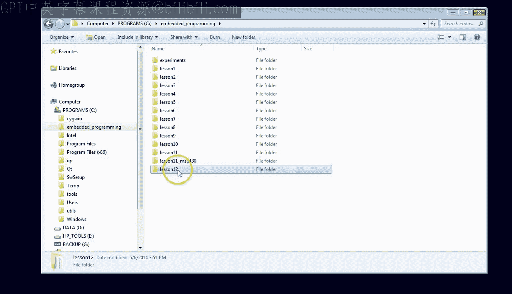

## 概述

到目前为止，本课程中我们仅使用了标量数据类型（如内置整数）和上节课介绍的确切宽度整数类型。在第7课中，我们还学习了数组，这是一种将相同类型的变量组合在一起的方式。结构体是C语言中另一种将变量（可能是不同类型）组合在一起的机制。结构体的好处在于，它允许将一组相关的变量作为一个单元来处理，而不是作为单独的实体。在嵌入式系统中，结构体还允许你以优雅且直观的方式访问硬件。本节课我们将首先解释语法并给出一些C语言结构体的示例，然后探索其在硬件访问中的应用。

## C语言结构体语法

为了解释结构体语法，我们将为嵌入式图形LCD显示屏创建几个结构体。最基本的对象是一个点，它将x坐标和y坐标组合在一起。

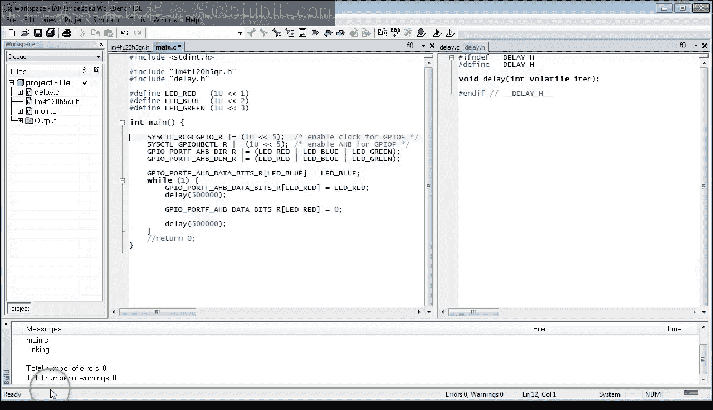

以下是一个结构体声明的示例：

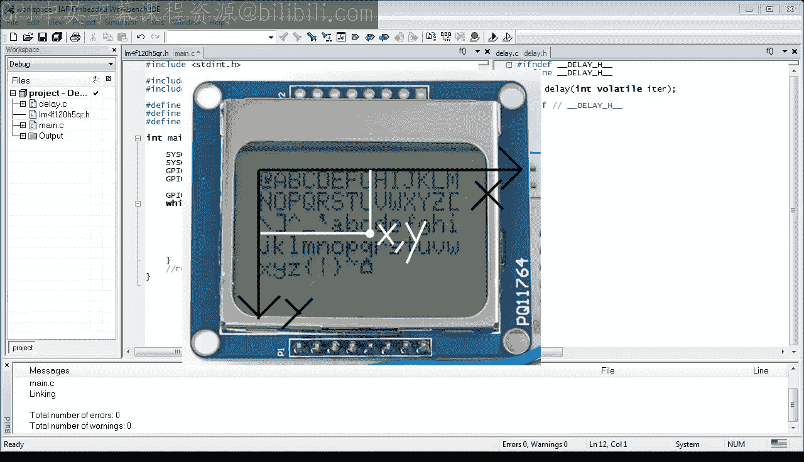

```c
struct Point {
    uint16_t x;
    uint8_t y;
};
```

关键字 `struct` 用于引入结构体声明。单词 `struct` 后面可以跟一个可选的名称，称为结构体标签，例如本例中的标签 `Point`。大括号内列出的变量称为成员。因此，这里的 `x` 和 `y` 是结构体 `Point` 的成员。

结构体声明后可以立即跟一个变量列表。例如，你可以定义变量 `pa` 和 `pb`，它们都是 `Point` 类型。实际上，如果在结构体后立即定义变量，甚至可以完全省略结构体标签。

然而，更常见的做法是定义一个结构体，后面不跟变量列表。这是C语言中唯一一种右大括号必须紧跟分号的情况。不跟变量列表的结构体声明不保留存储空间，但如果结构体有标签，你可以在以后使用它来声明变量。

尽管如此，这种使用结构体类型的方式仍然有些繁琐，因为你必须总是在结构体标签前重复 `struct` 关键字。这也不是C++中的做法，在C++中你不需要在类名前面重复 `struct` 或 `class` 关键字。

但到现在，你应该知道解决方案了。在上节课中，我们学习了 `typedef` 指令，你可以用它来定义 `Point` 类型，如下所示：

```c
typedef struct Point {
    uint16_t x;
    uint8_t y;
} Point;
```

现在，你可以在没有 `struct` 关键字的情况下定义 `Point` 类型的变量 `p1` 和 `p2`。

一个有趣的地方是，编译器同时接受了结构体标签和类型定义名都使用 `Point`。这是因为在C语言中，标签名与类型定义名、变量名或函数名占据不同的命名空间。

最后，还有一种方法可以通过在 `typedef` 内部使用无标签的结构体声明来完全消除 `Point` 名称的重复。在这种情况下，编译器显然不再识别 `struct Point` 类型，但它仍然接受 `typedef Point` 类型。

总结一下，我倾向于使用最后一种不带结构体标签的 `typedef` 形式。实际上，最新的安全C标准MISRA C 2012也推荐这样做，其咨询规则2.4建议项目不应包含未使用的标签声明。结构体标签名几乎从不需要，一个显著的例外是所谓的自引用结构，例如链表或树的节点。但这是结构体的一种高级用法，超出了本课程当前的范围。

## 访问结构体成员

现在你已经知道了声明结构体类型的所有不同形式，是时候了解你实际上可以用它们做什么了。首先，你可以访问单个结构体成员。在C语言中，这通常通过特殊的成员访问运算符（一个点 `.`）来实现。

例如，以下代码将获取结构体 `Point` 的大小并将其赋值给 `p1.x` 成员：

```c
p1.x = sizeof(struct Point);
```

当然，你也可以在表达式中使用点运算符。例如，这里计算 `p1.x` 成员减去3，并将其赋值给 `p1.y` 成员：

```c
p1.y = p1.x - 3U;
```

此时，你需要知道点运算符具有非常高的优先级，高于任何算术运算符（如减号）。这就是为什么你通常不需要在访问结构体成员时使用括号。

## 结构体在内存中的布局

现在，是时候深入机器代码，看看你的 `Point` 结构体在内存中实际是什么样子，以及它的真实大小是多少，因为它可能不是你预期的3字节（x占2字节，y占1字节）。

为了这部分课程，我将使用模拟器，但你也可以在LaunchPad开发板上运行代码。

清理 `Watch1` 视图并准备监视 `p1` 结构体变量。同时设置内存视图以显示 `p1` 地址周围的内存。

正如你在两个视图中看到的，`p1` 以全零开始。当你单步执行代码时，可以看到编译器将 `p1.x` 视为任何其他半字变量，并使用已经熟悉的 `STRH` 指令在其中存储一个值。但编译器显然认为 `Point` 结构体的大小是4字节，而不是3字节。

在表达式求值中，你可以再次看到 `p1.y` 被视为字节大小的变量，因为表达式的结果是用 `STRB` 指令存储的。

查看内存视图，你现在可以将 `Point` 结构体识别为地址 `0x20000000` 处的4个字节，后面跟着全零。值为4的 `p1.x` 成员位于结构体的开头，值为1的 `p1.y` 成员紧随其后。有趣的是，编译器在 `p1.y` 成员之后填充了一个字节。

为了研究结构体布局和填充，让我们反转成员的顺序并再次运行。

正如你所看到的，内存中成员的顺序也被反转了，因为 `p1.y` 现在位于比 `p1.x` 更低的地址。现在查看内存视图，你可以看到确实 `p1.y` 成员位于结构体的开头，后面跟着一个未使用的字节，然后是 `p1.x` 成员，因此结构体总大小为4字节。

与之前的运行相比，顺序的改变应该让你相信，编译器会完全按照你在结构体声明中键入的顺序来安排结构体成员。

然而，编译器可以并且有时会在你的结构体中插入额外的填充字节。第二个有趣的观察是，显然，ARM Cortex-M编译器宁愿浪费1字节内存，也不愿将 `p1.x` 半字成员放在奇数地址。明显的问题是：为什么？

为了研究最后一个问题，以某种方式强制编译器不浪费 `y` 和 `x` 成员之间的字节会很有趣。这在标准C中是不可能的，但大多数嵌入式编译器提供了一些非标准扩展来紧密打包结构体成员，没有任何填充。

IAR编译器通过扩展关键字 `__packed` 提供了这个功能，你可以将其放在 `struct` 关键字前面。所以，让我们现在就做这个，看看会发生什么。

另外，为了避免 `p1.y` 的值为0（当结构体大小确实为3时会发生这种情况），让我们将其改为其他值。

在 `Watch` 视图中要注意的第一件有趣的事情是，这次 `p1.x` 成员被分配到了一个奇数的内存地址。在反汇编窗口中，请注意代码仍然非常高效。特别是，对 `p1.x` 的赋值仍然由 `STRH` 指令处理，即使 `p1.x` 在奇数地址。那么，这有什么大不了的？CPU处理这个结构体完全没问题。

为了看到真正的区别，让我们改变CPU。打开项目选项对话框，转到“General Options”，选择Cortex-M0内核而不是Cortex-M4F。接下来，转到“Debugger”部分，选择“TI Stellaris”接口，并确保选中“Use Flash Loaders”选项。

是的，没错。我真的打算在真实硬件上运行代码，而不仅仅是在模拟器中。事实上，我将在TI LaunchPad开发板上运行它，即使它装有Cortex-M4F处理器，而不是Cortex-M0。通过这种方式，我希望让你相信Cortex-M处理器是真正二进制兼容的。具体来说，从Cortex-M机器指令的图表中，你可以看到Cortex-M4识别Cortex-M3的所有指令，而Cortex-M3识别Cortex-M0/M1的所有指令。这就像一套嵌套娃娃，任何更大的娃娃都可以容纳所有更小的娃娃。

在代码被编程到LaunchPad开发板后，快速检查 `p1.x` 是否仍在奇数地址，并设置内存视图。

当我开始单步执行代码时，请注意，用于简单赋值 `p1.x` 的代码比以前更大。为了帮助你看到区别，我将之前Cortex-M4F的反汇编放在旁边。

正如你所看到的，为Cortex-M0编译的相同C源代码由两条 `STRB` 指令加上一条逻辑右移指令组成，而Cortex-M4仅用一条 `STRH` 指令就实现了相同的效果。

有趣的是，这并不是因为Cortex-M0没有 `STRH` 指令。事实上它有，但它此时不能使用它，因为Cortex-M0中的 `STRH` 指令不如Cortex-M4中的强大，无法访问分配在奇数地址的半字。

所以在这里，你第一次看到内存中数据的对齐对处理器很重要。作为一名嵌入式程序员，你绝对需要了解这一点，否则你将永远无法理解为什么编译器会在你的结构体中插入填充。编译器倾向于保持数据对齐，而不是浪费CPU周期来访问未对齐的数据。

你还可以在这里看到，打包结构体的访问效率可能不如常规的非打包结构体。换句话说，你只有在绝对需要避免填充时才需要明智地使用打包结构体。

为了结束在Cortex-M4 CPU上运行Cortex-M0代码的实验，我直接运行程序，以便你可以看到LaunchPad开发板像以前一样继续闪烁LED，因此它愉快地执行M0代码。

## 复杂结构体与指针

现在我想向你展示更多可以用结构体做的事情。首先，你可以创建更复杂的结构体，包括包含其他结构体的结构体。

例如，一个矩形窗口可能包含两个点，用于窗口的左上角和右下角。结构体也可以包含数组。例如，一个三角形结构体可能包含一个由三个角组成的数组，每个角都是一个点。所以你可以看到，你可以有结构体数组。

结构体类型的变量有时被称为实例。所以这里 `w` 是 `Window` 的一个实例，`t` 是 `Triangle` 结构体的一个实例。

现在，关于访问这些复杂结构体的成员，以下是访问窗口和三角形结构体嵌套成员的示例：

```c
w.topLeft.x = 10U;
t.corners[0].y = 20U;
```

请注意IAR编辑器如何通过显示给定结构体的所有可能成员来帮助你。

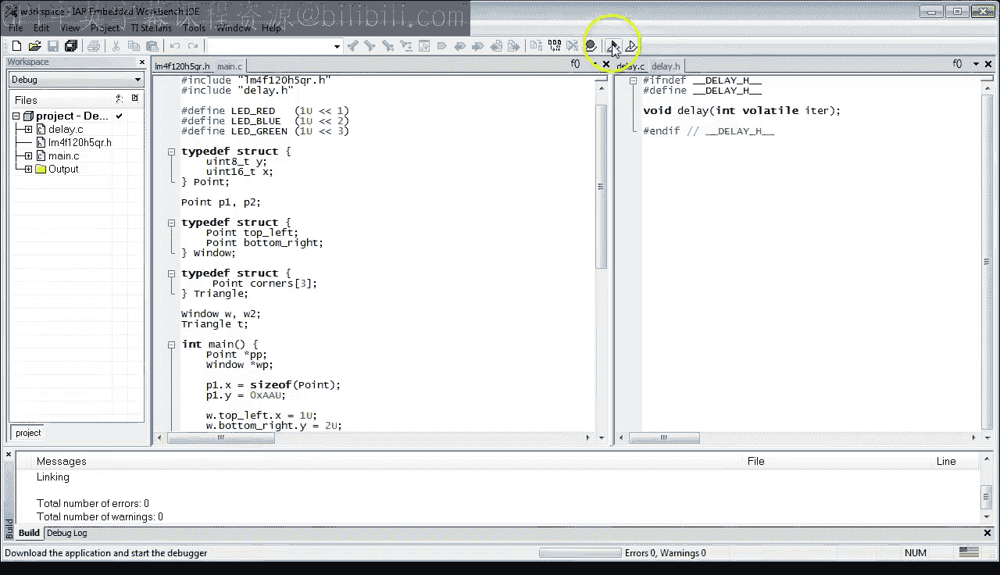

但赋值不仅限于基本标量类型。你也可以赋值整个结构体。例如，你可以将整个 `p1` 结构体赋值给 `p2` 结构体，或者将整个复杂的 `Window` 结构体赋值给另一个 `Window` 结构体。

然而，我希望你意识到，更复杂的结构体可能占用相当大的内存，因此看似无害的结构体赋值可能意味着将一大块内存从一个变量复制到另一个变量。

因此，与其将整个结构体从内存中的一个地方复制到另一个地方，通常更有效的方法是使用指向结构体的指针。正如你可能从第3课中记得的，指针类型是通过简单地在类型名后面加一个星号 `*` 来创建的。这正是你创建指向结构体类型的指针的方式。例如，`pp` 是指向 `Point` 类型的指针，而 `wp` 是指向 `Window` 类型的指针。

要初始化指针，你可以使用取地址运算符 `&` 获取变量的地址。例如，你可以将 `pp` 设置为指向 `p1` 点，或将 `wp` 设置为指向 `w2` 窗口。

下一个问题是如何使用指针访问结构体的成员。C语言提供了两种方式。首先，正如你在第3课中学到的，你可以在指针前应用星号运算符 `*` 以获取指针指向的对象。

所以如果 `pp` 是指向 `Point` 的指针，`*pp` 就是 `Point` 类型。从那里，你可以使用点运算符访问任何成员。请注意，`(*pp)` 周围的括号是必要的，因为点运算符的优先级非常高，甚至高于星号运算符。

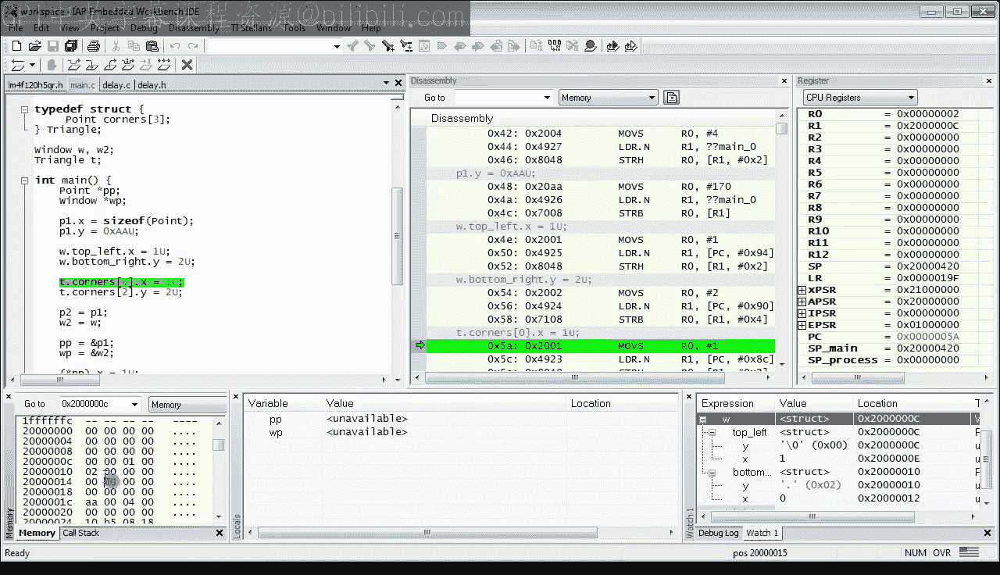

以类似的方式，你可以解引用 `wp` 指针来设置 `topLeft` 成员。请注意，这里再次看到了整个结构体的赋值，因为 `topLeft` 成员和 `*pp` 都是 `Point` 类型。

但是指向结构体的指针在C语言中使用如此频繁，以至于该语言提供了另一种运算符 `->`，作为通过指针访问结构体成员的更快方式。因此，以下两个赋值等同于之前的版本：

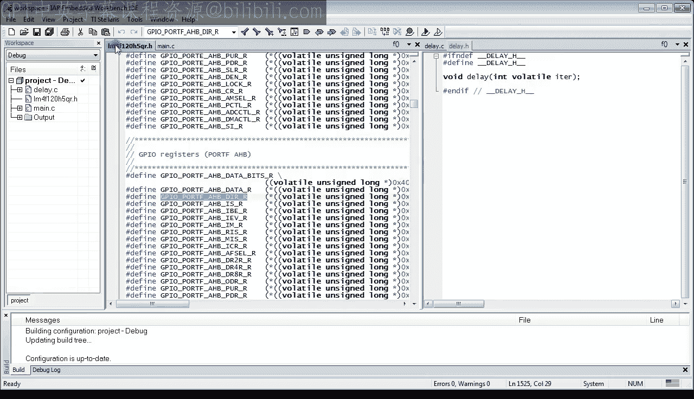

```c
pp->x = 5U;
wp->topLeft = *pp;
```

现在让我们在调试器中看看如何访问这些更复杂的结构体。你可以保留Cortex-M0内核，但从 `Point` 结构体中移除 `__packed` 扩展关键字，以避免访问未对齐数据使情况复杂化。

单步执行到访问 `Window` 结构体的代码处，并将 `w` 变量放入监视窗口。确保所有成员都已展开并可见。

现在，单步执行反汇编，并注意一些有趣的事情。首先，你应该注意到 `STRH` 指令，这意味着它在Cortex-M0中可用，但仅当 `Point` 成员 `x` 对齐时。其次，请注意 `STRH` 指令后的方括号。这意味着 `R0` 寄存器的内容必须存储在 `R1` 寄存器中的地址加上2字节的偏移量处（在本例中）。这种带有给定基址寄存器额外偏移量的寻址模式对于访问结构体非常方便。事实上，它可能正是为此目的而设计的。

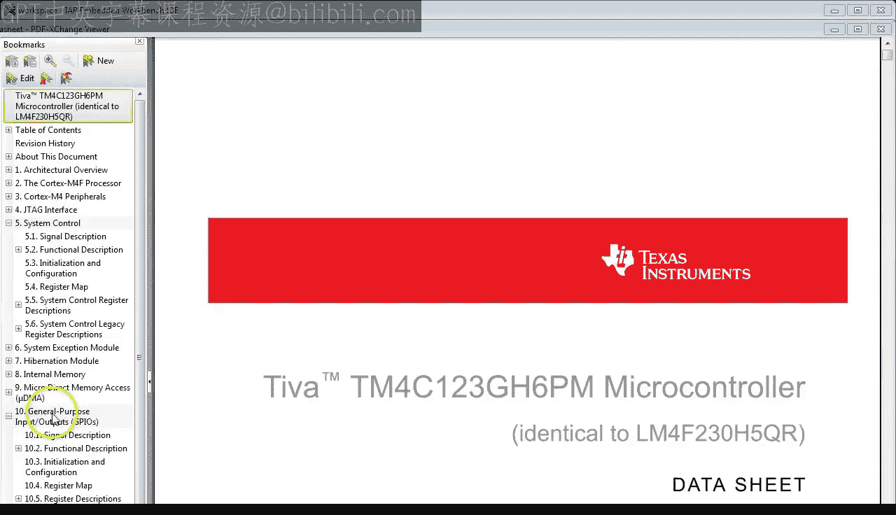

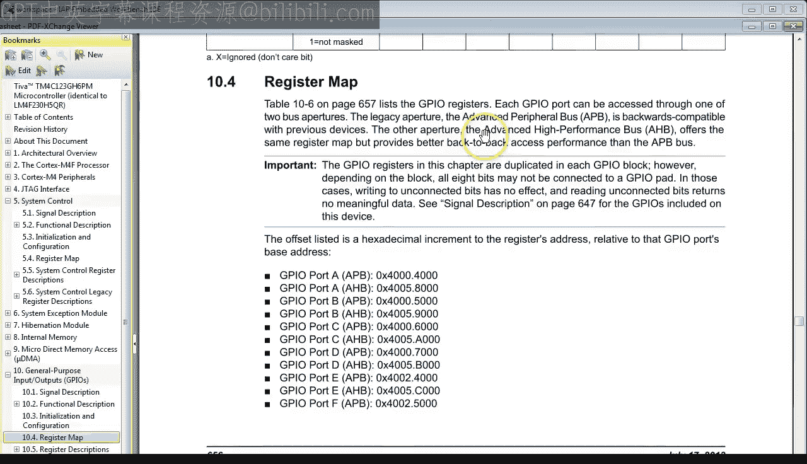

因为对于编译器来说，结构体不过是一堆偏移量，每个成员一个，从结构体的开头开始。在这里，你再次看到这种寻址模式用于 `STRB` 指令，以访问 `Window` 结构体中 `bottomRight` 点的 `y` 成员。正如你立即看到的，该成员距离 `Window` 结构体开头有4字节的偏移量。

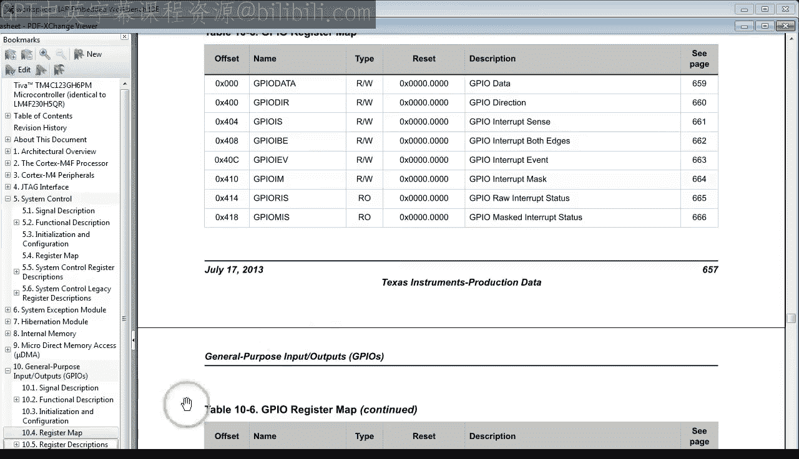

让我们通过查看 `w` 变量在内存视图中的地址来确认这些偏移量。所以这里是整个结构体。这里是距离 `topLeft.x` 成员的2字节偏移量，这里是距离 `bottomRight.y` 成员的4字节偏移量。

## 使用结构体访问硬件寄存器

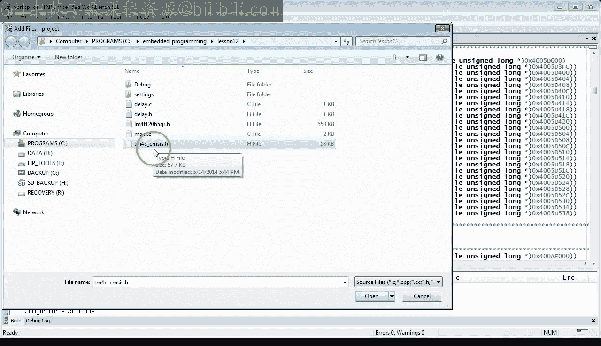

现在，我希望你真的准备好接受将结构体应用于访问嵌入式微控制器（如系统控制寄存器以启用或禁用各种外设，或GPIO寄存器，通过它们你可以在LaunchPad开发板上打开或关闭各种颜色的LED）中的硬件寄存器的想法。

请注意，到目前为止你访问硬件寄存器的方式相当原始，并且不涉及结构体。你使用了 `lm4f.h` 头文件，该文件将你的LM4F微控制器的硬件寄存器简单地定义为预处理器宏。

例如，`GPIO_PORTF_AHB_DIR` 寄存器被定义为对具有数据手册中寄存器硬编码地址的指针的解引用。所有其他寄存器都以类似的方式定义。

相比之下，现在的想法是设计一个C结构体，使其数据成员对应于给定硬件块（如系统控制或GPIO）内的所有寄存器。为此，你需要查阅数据手册。这里我有你的TI LaunchPad开发板上使用的特定TM4C微控制器的数据手册，该数据手册也与稍旧的LM4F LaunchPad上使用的LM4F微控制器相同。这个PDF可以从德州仪器直接获取，也可以从伴随本视频课程的 `statemachine.com/quickstart` 网页获取。

例如，在通用输入输出块的描述中，你可以找到“寄存器映射”部分。正如你在那里看到的，GPIO块内的所有寄存器都指定为从该块基地址开始的偏移量。因此，寄存器映射提供了C语言中GPIO结构体的蓝图，因为你从一分钟前的调试会话中记得，结构体只是一堆偏移量，每个成员一个。

因此，有了数据手册，我希望你开始明白如何编写GPIO块的C结构体。好消息是你不需要自己做，因为微控制器供应商已经完成了。事实上，我已经将 `tm4c_scmsis.h` 头文件复制到你当前的项目目录中，该文件包含在你的微控制器中找到的所有硬件块的结构体定义。

当你打开那个TM4C头文件并向下滚动一点，你可以看到它包含 `typedef` 结构体定义。例如，这里我们可以看到系统控制（SYSCTL）的结构体。紧接着下面，你可以看到GPIO的结构体。

作为一个快速练习，让我们将TM4C头文件中的结构体定义与数据手册中的GPIO寄存器映射进行比较。正如你所看到的，数据手册中的第一个寄存器是 `GPIO_DATA`，但当你仔细看时，你可以看到在映射中到下一个寄存器的偏移量有一个 `0x400` 的大间隙。这是因为 `GPIO_DATA` 不是单个寄存器，而是一组256个4字节寄存器，我在第7课中详细讨论过。在C结构体中，这256个数据寄存器组表示为一个包含255个 `DATA_Bits` 成员加上 `DATA` 结构体成员的数组。再次，请参考第7课，了解为什么这最后一个数据寄存器是特殊的。

GPIO映射中所有后续的寄存器都与头文件中C结构体的成员一一对应。我只想指出在 `GPIO_AFSEL` 寄存器之后偏移量中的间隙。这样的间隙在C结构体中表示为 `RESERVED1` 数组成员，以便后续成员精确对齐数据手册中指定的偏移量。

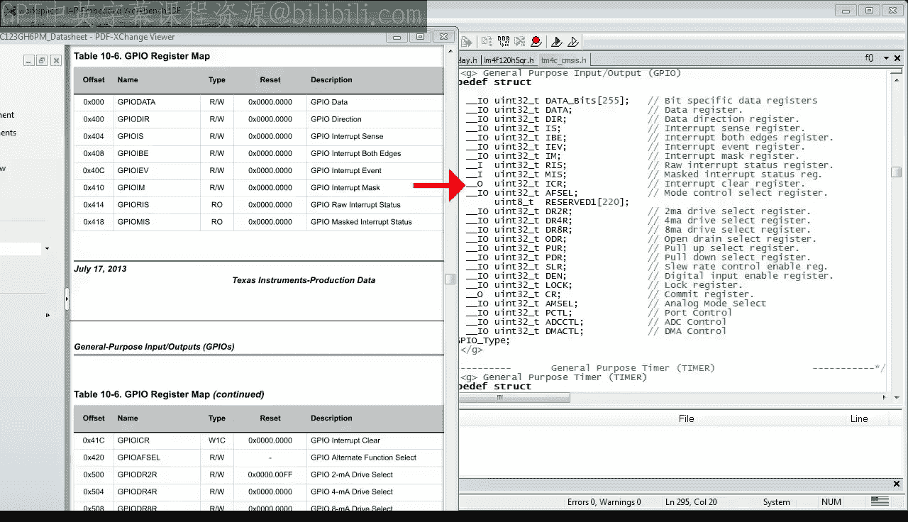

最后，我相信你很好奇C结构体中使用的类型。我希望你认出 `uint32_t` 固定宽度整数类型，这意味着所有寄存器都是32位宽，但 `__IO`、`__I` 和 `__O` 标识符看起来确实很奇怪。事实证明，这些是Cortex微控制器软件接口标准（CMSIS）中定义的预处理器宏，TM4C头文件是其中的一部分。

我马上会向你展示这些CMSIS宏的实际定义，但首先请注意，这些宏对应于数据手册中的第三列。其中 `__IO` 代表输入输出，对应于读写；`__I` 代表输入，对应于只读；`__O` 代表输出，对应于只写。

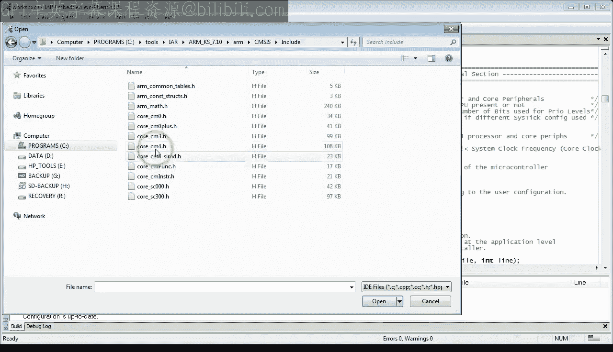

回到CMSIS，你可以看到TM4C头文件并不是完全独立的，而是包含了 `core_scm4.h` 头文件。这个头文件是CMSIS行业标准的一部分，并作为工具链的一个组成部分由IAR分发。

要查看 `core_scm4.h` 头文件，请转到你的IAR工具链安装目录。进入 `arm\CMSIS\Include` 并打开该文件。

所以这里是宏 `__IO`、`__I` 和 `__O` 的定义。这些宏实际上被定义为 `volatile` 关键字，我希望这对你来说是有意义的。这也意味着 `volatile` 限定符可以用于单个结构体成员。`__I` 宏还有额外的限定符 `const`，这意味着这样指定的变量是常量，不能被修改。我希望在未来的课程中涵盖 `const` 关键字的使用和程序的常量正确性概念。

关于 `core_scm4.h` 头文件，我只想向你展示它也包含定义硬件寄存器的结构体。例如，这里是嵌套向量中断控制器（NVIC）的结构体，它是每个Cortex-M内核的一部分，因此将其定义在CMSIS核心头文件中是有意义的。你将在未来关于中断的课程中使用NVIC。

有了所有这些信息，你终于可以重写你的代码，使用符合CMSIS标准的、通过结构体访问硬件的方式。

你需要理解的最后一块拼图是如何确保系统控制或GPIO结构体位于正确的基地址。这似乎是一个大问题，因为到目前为止，你只创建了 `Point`、`Window` 或 `Triangle` 结构体的实例，编译器控制它们在内存中的放置。

但这个问题其实并不新鲜，你之前在第4课就已经遇到过。解决方案是使用指向结构体的指针，这些指针被初始化为数据手册中的硬编码基地址。

事实上，这正是TM4C头文件中所做的。在文件的末尾，你可以找到各种硬件块的 `#define` 基地址。在那下面，你有一堆 `#define` 硬编码指针指向各种结构体类型。例如，`SYSCTL` 宏定义了一个指向 `SYSCTL_Type` 结构体的指针，该指针硬编码到系统控制基地址。类似地，`GPIOF_AHB` 宏定义了一个指向 `GPIO_Type` 结构体的指针，该指针硬编码到GPIO端口F AHB基地址。

替换你访问硬件方式的第一步是将头文件名更改为 `tm4c_scmsis.h`。你也可以从项目中移除 `lm4f.h` 头文件。接下来，你使用新形式替换每个寄存器访问。例如，要替换第一个寄存器访问，你取 `SYSCTL` 指针并附加成员访问运算符。此时，IAR编辑器将通过显示结构体的所有成员来帮助你。你从列表中选择适当的寄存器。为了确定选择哪个，你可能需要查阅数据手册和 `SYSCTL_Type` 结构体定义。你以类似的方式处理所有其他寄存器。

GPIO端口F数据寄存器实际上是一个包含255个寄存器的数组，正如你几分钟前看到的。正如你所看到的，程序编译得很干净。

最后一件要做的事情是验证LED是否像以前一样闪烁。确实如此。

## 总结

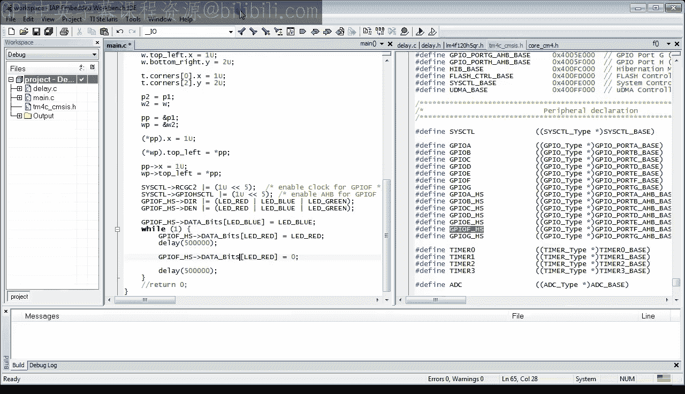

本节课我们一起学习了C语言中的结构体以及CMSIS标准。我们探讨了结构体的声明、成员访问、内存布局和填充，以及如何使用结构体指针。更重要的是，我们了解了如何利用CMSIS标准定义的结构体，以一种更优雅、更直观的方式来访问Cortex-M微控制器中的硬件寄存器，这比直接使用硬编码地址的宏更加清晰和安全。

在下一课中，我将讨论函数指针，你将需要理解启动代码和中断处理程序。如果你喜欢这个频道，请订阅以保持关注。你也可以访问 `statemachine.com/quickstart` 获取课堂笔记和项目文件下载。