# 现代嵌入式系统编程：14：启动代码第二部分 - 嵌入式软件构建过程

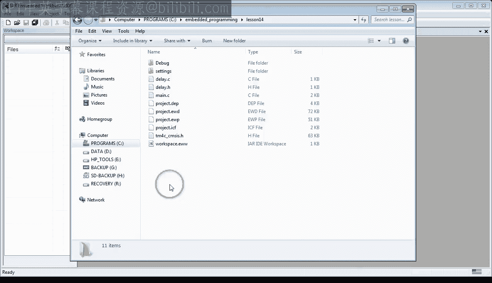

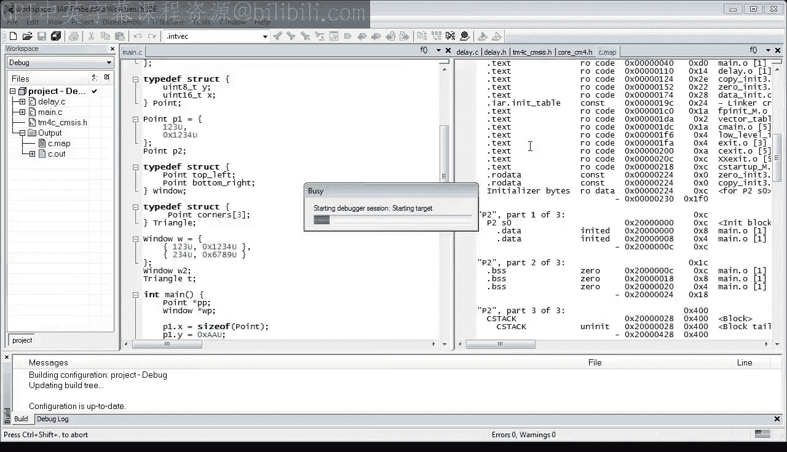

在本节课中，我们将继续学习启动代码，并深入了解嵌入式软件的构建过程。你将学习如何用自己的向量表替换IAR库中的通用向量表。

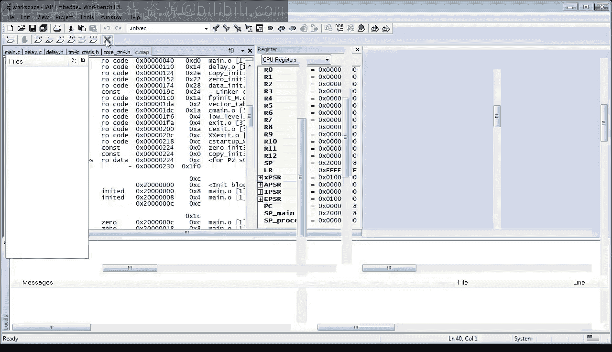

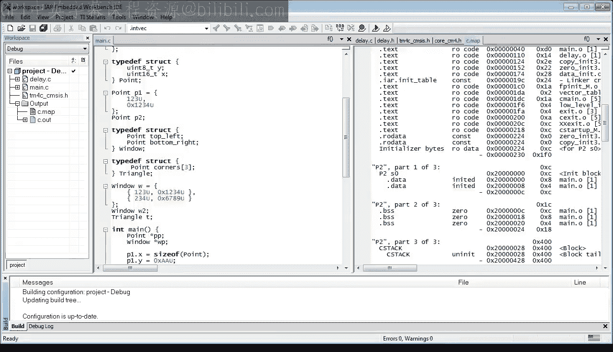

## 概述

上一节我们介绍了ARM Cortex-M处理器启动时在地址0处的重要数据结构——向量表。然而，我们使用的IAR库提供的默认向量表并不完整。本节中，我们将学习嵌入式软件的构建过程，并在此基础上用自己的向量表替换默认版本。

## 嵌入式软件构建过程

嵌入式软件的构建通常在称为“主机”的桌面计算机上完成，而生成的程序则运行在“目标”嵌入式设备上。这种开发方式称为“交叉开发”，与在桌面计算机上开发和运行软件的“原生开发”形成鲜明对比。

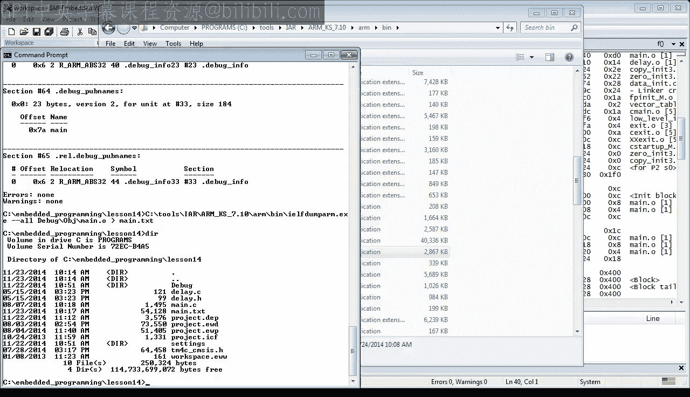

以下是构建嵌入式项目的主要步骤：

1.  **编译**：C语言编译器将源文件（如 `main.c` 和 `delay.c`）转换为目标文件（如 `main.o` 和 `delay.o`）。
2.  **链接**：链接器将项目中的所有目标文件、标准库及其他库，结合链接脚本，组合成最终的可执行程序。

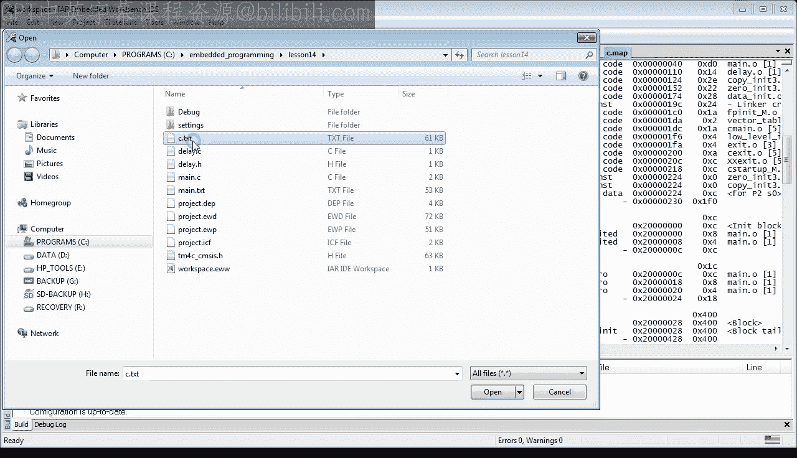

目标文件包含的是“可重定位”的机器代码，这意味着代码中的地址引用尚未固定到内存中的具体位置。链接器的任务就是组合所有目标文件，解析模块间的引用，并最终确定所有地址。

## 深入理解目标文件

为了理解“可重定位代码”的含义，我们需要查看目标文件的结构。在你的项目中，目标文件位于 `Debug\Obj` 子目录中。

目标文件通常采用 **ELF** 格式。你可以使用工具（如IAR的 `ielfdumparm.exe` 或GCC的 `objdump`）来查看其内容。以下是一个使用IAR工具查看 `main.o` 内容的示例命令：
```bash
ielfdumparm.exe --all main.o > main.txt
```
打开生成的文本文件，你会看到ELF文件包含多个段，例如：
*   `.text`：存放代码。
*   `.data`：存放已初始化的数据。
*   `.bss`：存放未初始化的数据。

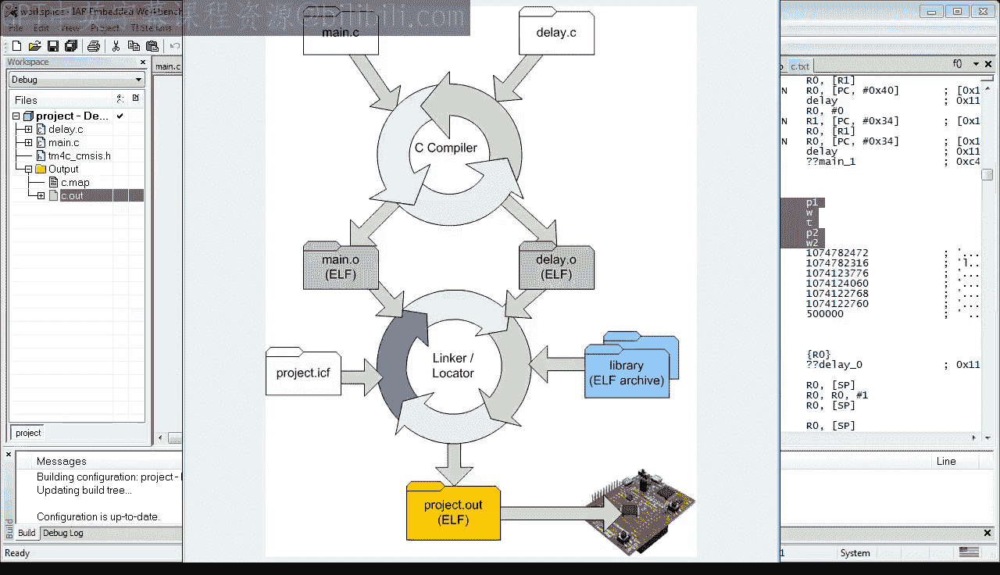

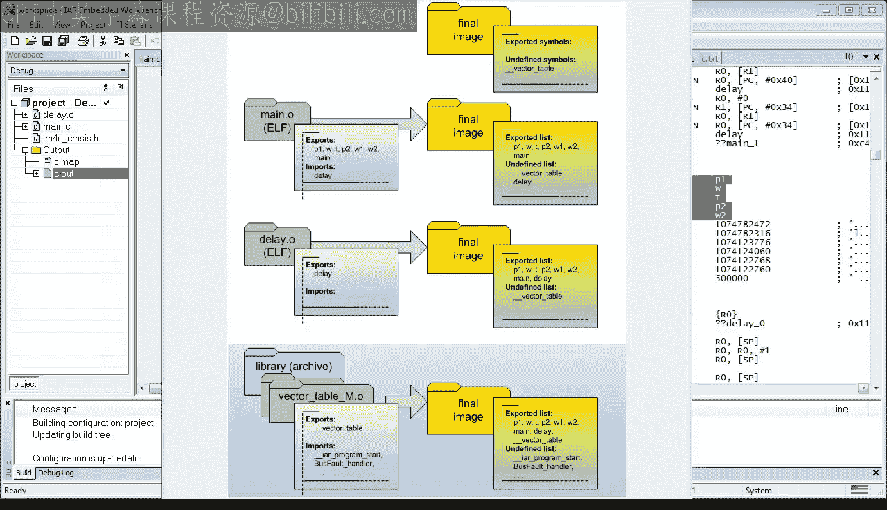

此外，文件中还包含链接器所需的符号信息以及调试器使用的调试信息。**注意**：不应通过目标文件的大小来评估代码尺寸，因为机器代码只是目标文件中的一小部分。评估代码尺寸的可靠依据是链接器生成的映射文件。

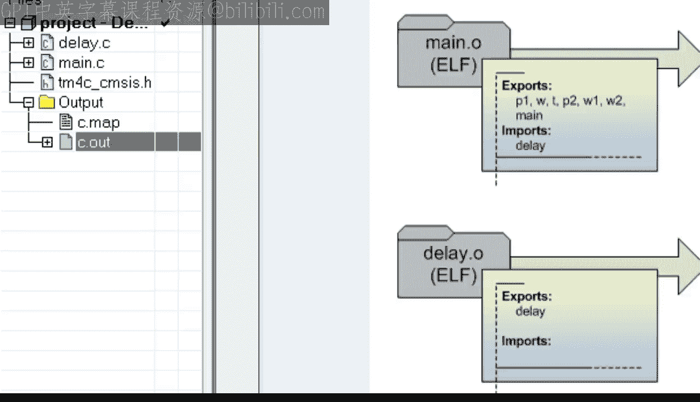

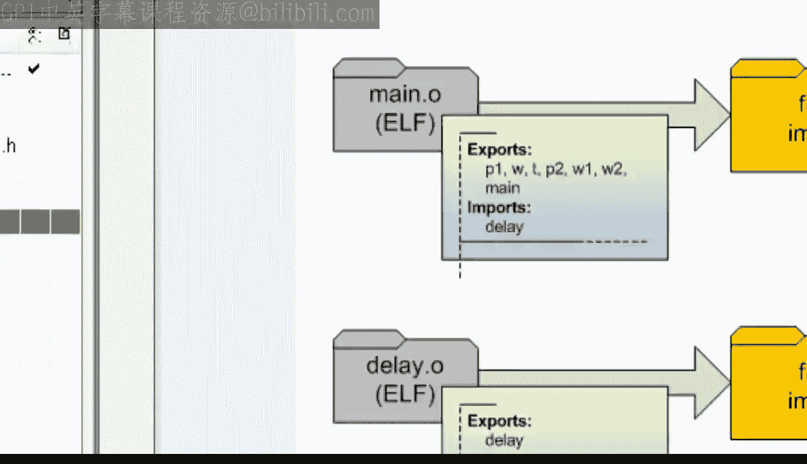


## 链接器如何工作

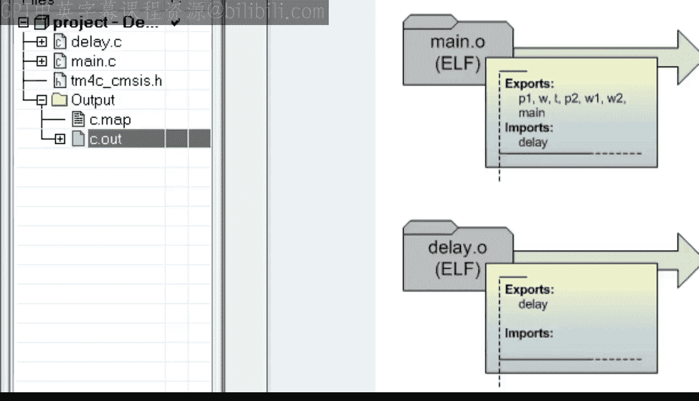

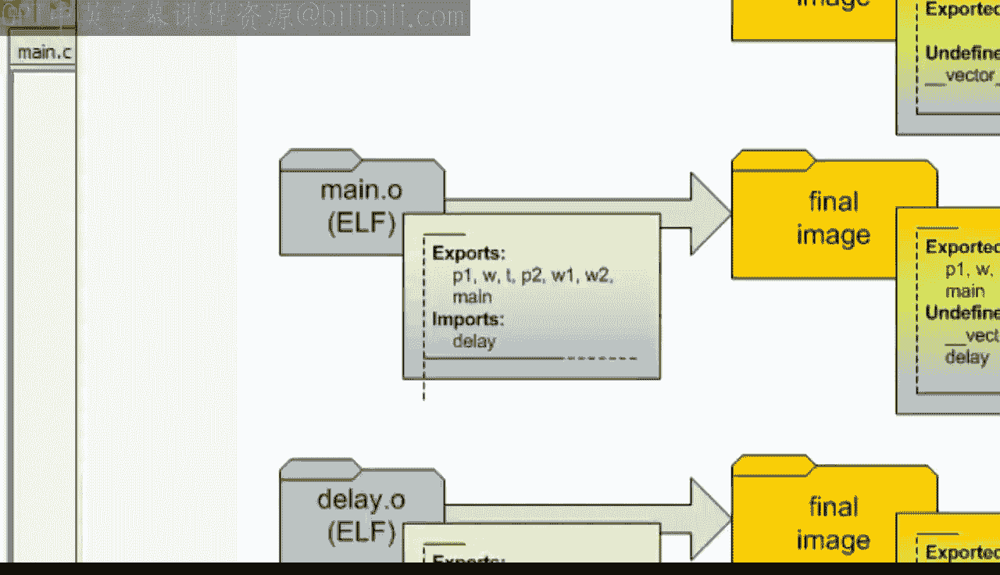

链接器的核心工作是解析符号引用。每个目标文件都提供它导出的符号（即它定义的函数或变量），也可能需要它导入的符号（即它使用但未定义的函数或变量）。

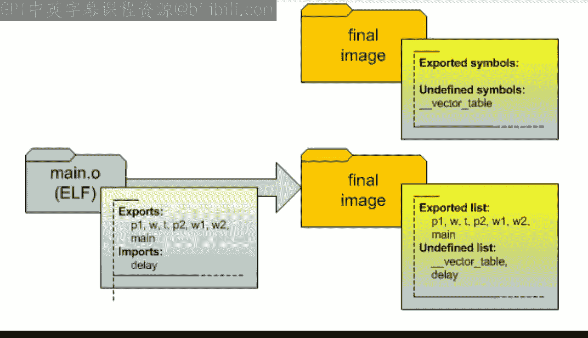

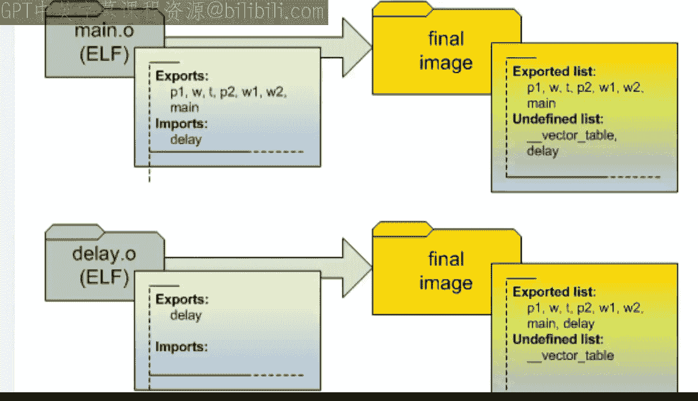

以下是链接器解析符号的基本过程：

1.  链接器维护两个列表：**已导出符号列表**和**未定义符号列表**。
2.  链接器按顺序处理项目中的目标文件。对于每个文件：
    *   将其导出的所有符号加入“已导出列表”。
    *   对于其导入的每个符号，在“已导出列表”中查找。如果找到，则解析该引用；如果未找到，则将该符号加入“未定义列表”。
3.  处理完所有直接包含的目标文件后，链接器开始搜索库文件。
4.  库是目标文件的集合。**关键区别**在于：库中的目标文件**仅当**它包含“未定义列表”中的符号时，才会被链接到最终镜像中。
5.  链接器持续处理库，直到“未定义列表”为空，链接成功完成。如果搜索完所有库后列表仍不为空，则会产生链接错误。

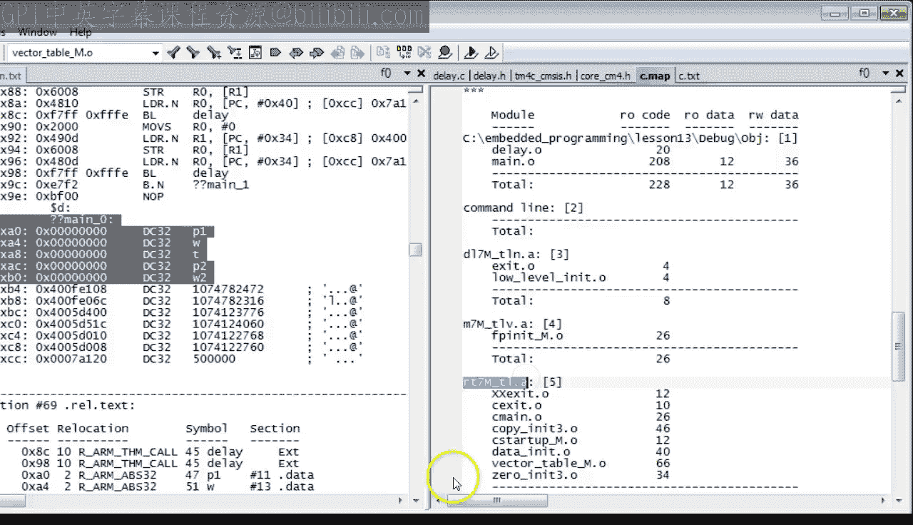

一个重要的实践是：库中的目标文件应尽可能小巧，通常只包含一个函数或一个全局变量。这样可以确保只链接实际需要的代码，避免最终镜像不必要地膨胀。

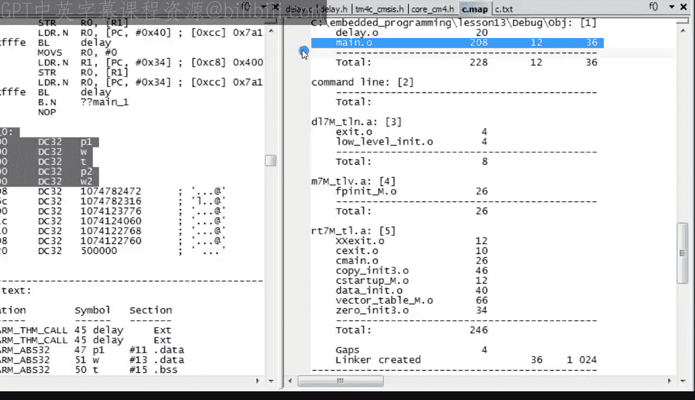

## 替换默认向量表

理解了构建过程后，我们现在可以着手替换IAR库中的默认向量表。思路很简单：在我们自己的源代码模块中定义一个名为 `__vector_table` 的符号。由于项目中的目标文件会先于库被链接，因此链接器会使用我们定义的版本，而忽略库中的版本。

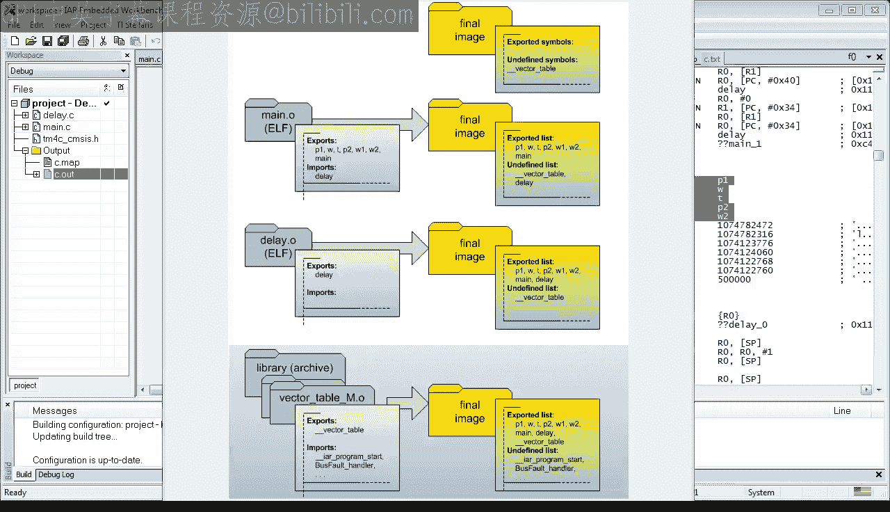

我们将创建一个新的C源文件，例如 `startup_tm4c.c`。但请注意，在启动初期，C语言运行环境（如栈、`.data` 和 `.bss` 段的初始化）尚未建立，因此编写启动代码需要格外小心。幸运的是，ARM Cortex-M架构的设计减少了对底层汇编语言的需求。

我们的主要目标是定义一个全局数组作为向量表，并确保它被放置在内存的正确位置。

首先，我们需要知道默认向量表被放在了哪里。查看链接映射文件可以发现，它位于 `.intvec` 段，地址为0（ROM起始位置）。这个段的定义在链接脚本文件 `project.icf` 中。

为了将我们自己的数组放入 `.intvec` 段，我们需要使用编译器扩展来指定段。在IAR编译器中，语法如下：
```c
__root const uint32_t __vector_table[] @ ".intvec" = {
    // 初始化值
};
```
*   `__root` 指示链接器必须保留此符号，即使它看起来未被引用。
*   `const` 关键字至关重要，它告诉编译器这个数组是常量，应放入只读存储器。
*   `@ ".intvec"` 是IAR的扩展语法，用于指定变量所在的段。

编译项目并检查映射文件，确认 `__vector_table` 现在来自 `startup_tm4c.o`，并且位于ROM地址0处。至此，我们成功替换了默认向量表。

**重要提示**：目前我们的向量表内容尚未正确初始化。为了安全起见，避免调试器挂起或无法编程开发板，请先用以下安全值初始化你的向量表：
```c
__root const uint32_t __vector_table[] @ ".intvec" = {
    0x20004000, // 初始栈指针值（示例，需根据实际RAM调整）
    0x00000009, // 复位处理函数地址（示例，暂时用非法指令异常地址）
    // ... 其他异常向量暂时也用同样的安全值填充
};
```

## 总结

本节课我们一起学习了嵌入式软件的构建过程，包括编译、链接以及链接器解析符号的原理。基于这些知识，我们成功用自己的C模块替换了IAR库中的默认向量表，并通过链接脚本和编译器扩展将其正确放置在ROM的起始位置。

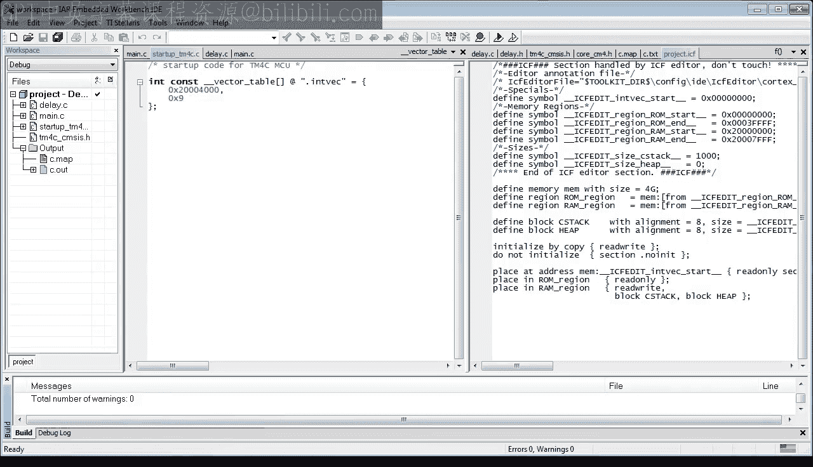

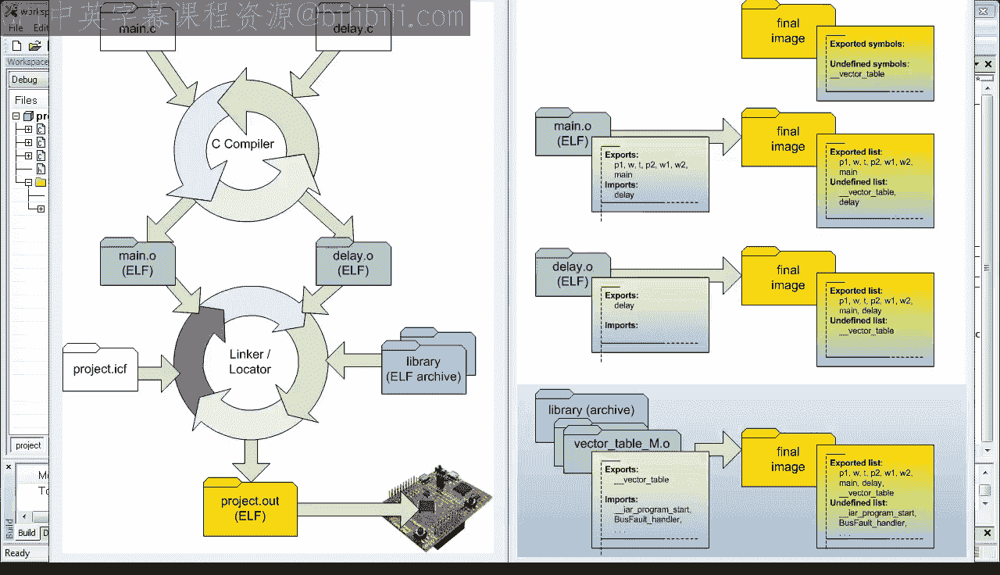

在下一节课中，我们将学习如何正确初始化向量表，包括设置正确的栈指针和填充微控制器支持的所有中断向量。