# Quantum Leaps《现代嵌入式系统编程Modern Embedded Systems Programming》中英字幕 p17 -17-#16 Interrupts Part-1_ What are interrupts, and how they work.zh_en -BV1fRt2efEms_p17-

Welcome to the Modern Emded Systems Program course。

🎼My name is Miro Samak and in this lesson Ill finally tackle the subject of interrupts。

🎼Today you will learn what interrupts are and how they work。As usual。

 let's get started with making a copy of the previous lessons 15 project and renaming it to lessons 16。

 If you are just joining the course， you can download the previous projects from state machinesach dot com s Quickstart。

Get inside the new lesson 16 directory and double click on the workspace file to open the IR tool set。

 If you don't have the IAR tool set， go back to lesson 0。

To quickly summarize what happened so far in the couple of last lessons。

 you are laying the groundwork for adding interrupts to your program Today day。

 you are finally ready to actually start using interrupts to learn what they are and how they work。

Let's start today with cleaning up the code from all the little experiments you've performed so that you get your Blinky program back to its basic form。

To remind you how the Blinky program works， your main function starts off with initializing the hardware。

Next， it lights up the blue LED。And finally， it enters the endless wild1 loop。In this loop。

 your code turns the red LED on and then calls the delay function that busy waits for half a million iterations。

 which happens to take about half a second。 Next， the program turns the red LED off， and again。

 it busy waits for half a million of iterations。When I say that the program busy weights。

 I mean that the CPU is doing nothing else but constantly checking whether the iteration counter has dropped all the way to 0。

In programming， this is called Pauling， and it is an approach in which the program keeps checking for a certain condition to occur in order to do something in response。

There are many kinds of polling， some more clever than the others。

 but the busy weight polling for longer periods of time。

 like the delay function is one of the most brain dead ones because it ties up the CPU completely and renders it unavailable for any other work。

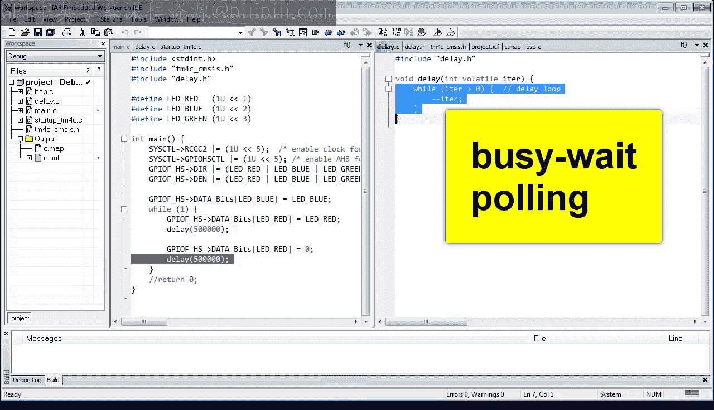

This is like you would spend all night counting every clock tick so that you won't overs sleepleep in the morning。

 I mean， most people would set up an alarm clock to go off at the right time。 That way。

 you would be able to do something else than constantly watching the clock。

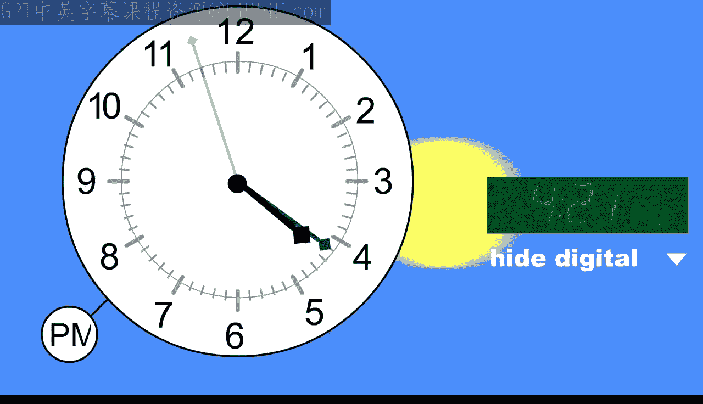

It turns out that microprocessors also have a mechanism of setting up alarms。

 which are called interrupts。 These interrupts are not just for timeouts。

 but for many other conditions， such as when a user presses a button when data arrives through a communication interface。

 when analog to digital conversion completes， etc cea。

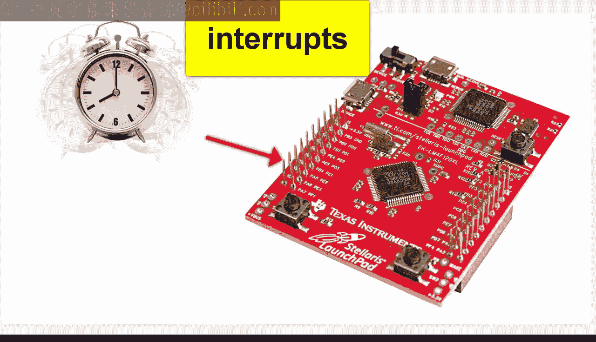

The name interrupt is actually quite suitable because just like in real life。

 interrupt disrupts an ongoing activity and forces you to start doing something else in response to the interrupt。

So let's stretch the analogy between alarms in real life and interrupts in a process or a bit further and consider what's necessary for a person to use an alarm clock。

Well， first， you need a special clock with an alarm hardware to make noise at the right time。

But you also need a person to be able to hear the alarm。We take it obviously for granted。

 but a person needs a special hardware， ears， auditory nerves， et cetera， to listen to the alarms。

With this picture in mind， I hope you begin to see that the microprocessor， too。

 needs a special hardware to handle interrupts。 software alone， although also necessary。

 is not enough to do the job。So back to your By program。

 you first need to find an appropriate alarm clock for your microcontroller。As it turns out。

 TV C MC has many choices， one of them being the system timer。

 you can find it in the TV C data sheet by searching for SsT。

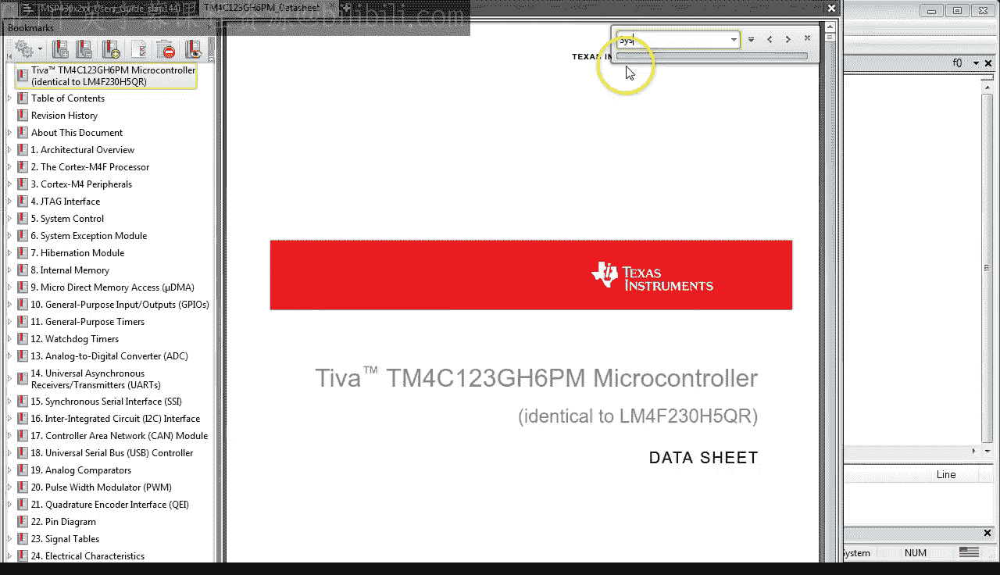

The cysttic is a hardware peripheral， meaning that it is a separate hardware block on the MCU silicon。

It is clocked by the CPU clock and consists of three registers。The S current register。

 which in software will be called Cisistic Val， is a simple 24 B down counter that decrements by one at every CPU clock cycle。

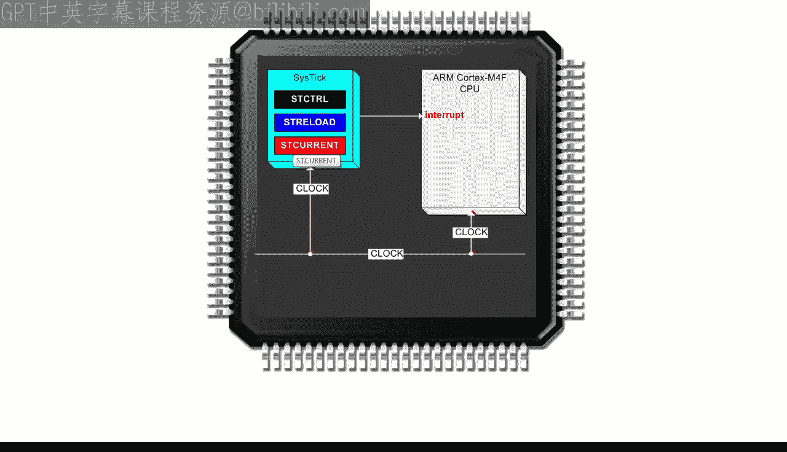

When the counter reaches 0， it can generate an alarm that is an interrupt to the CPU。

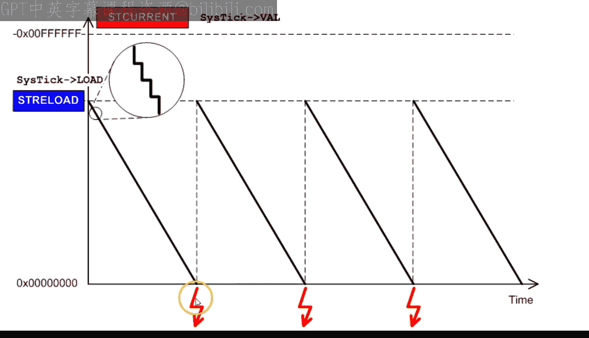

At this point， the counter automatically reloads from the S reload register。

 which in software would be called cysttic load and starts decrementtic again。

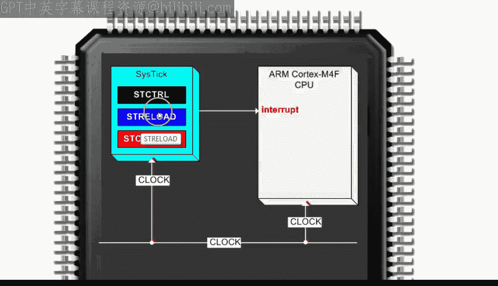

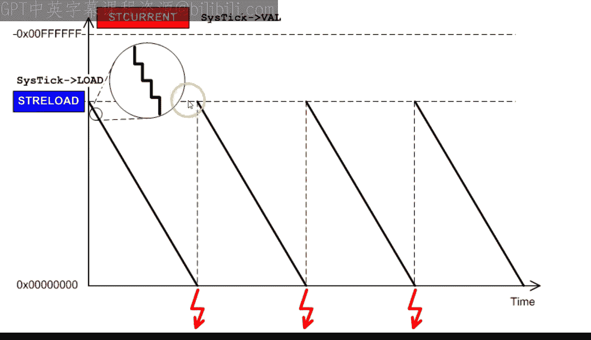

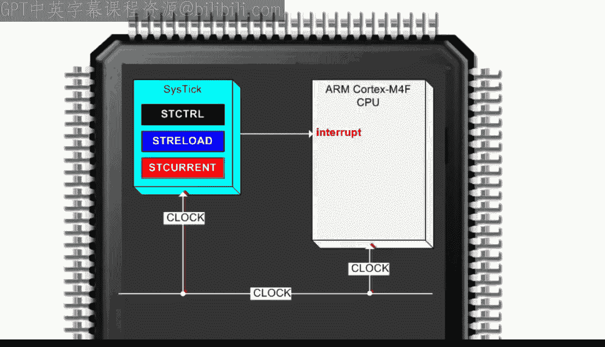

By writing a different value into the Ci load register。

 you can set up a different time between the interrupts。

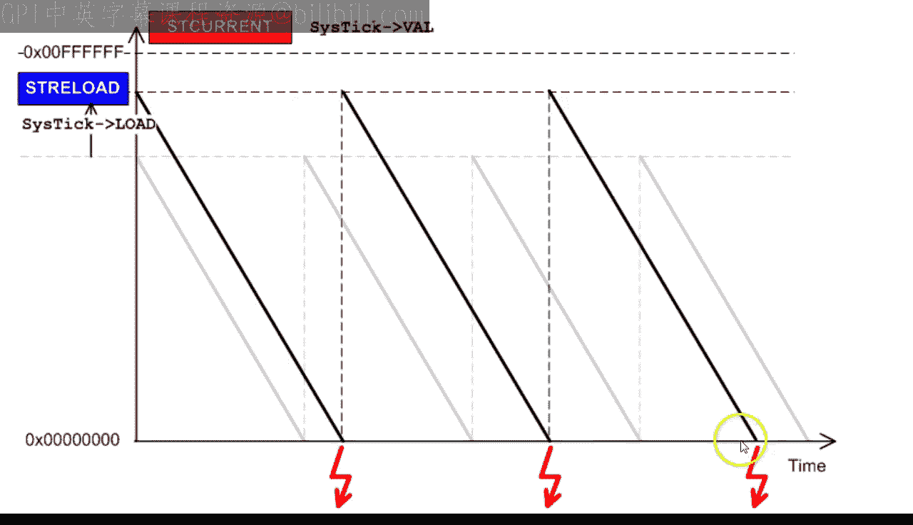

The second piece of the puzzle is your CPU and specifically how it listens to the interrupt coming through the interrupt line。

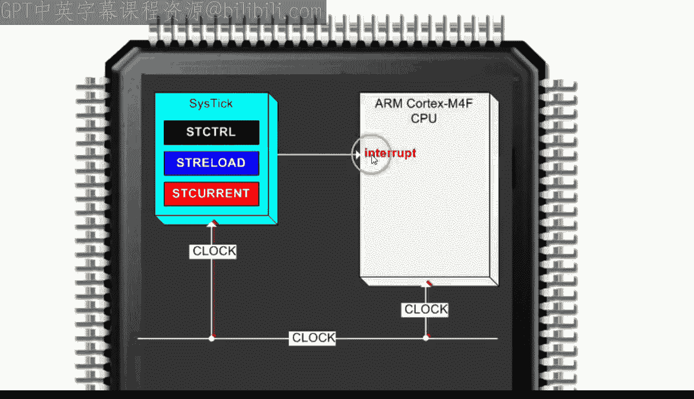

Well， the CPU has a special build in hardware that samples the status of the interrupt line after every instruction。

 As long as the interrupt is low， the CPU fetches the next instruction in the pipeline。However。

 when the interrupt line is high， the special CPU hardware forces the CPU to execute the interrupt entry instruction。

This is called preemption。Please note that while all the instructions are strictly synchronized to the CPU clock。

The interrupt line is generally not。The inter line can change its status at any time and typically in the middle of an instruction。

 completely asynchronously to the instruction execution。

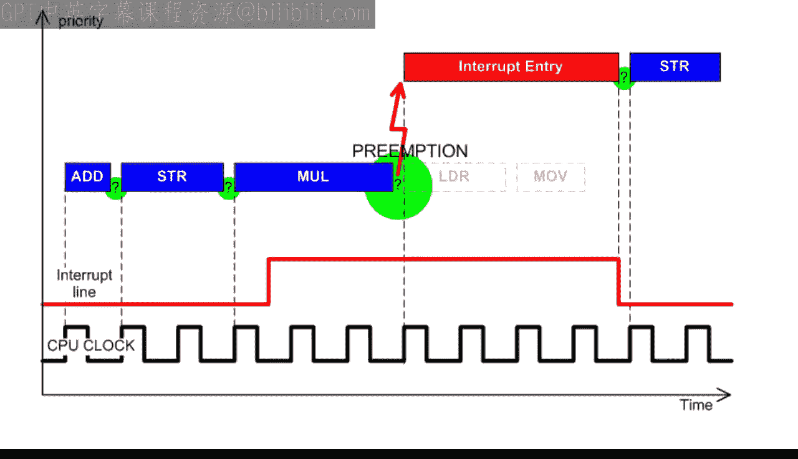

That's why it is often said that interrupts are asynchronous to the executing program。

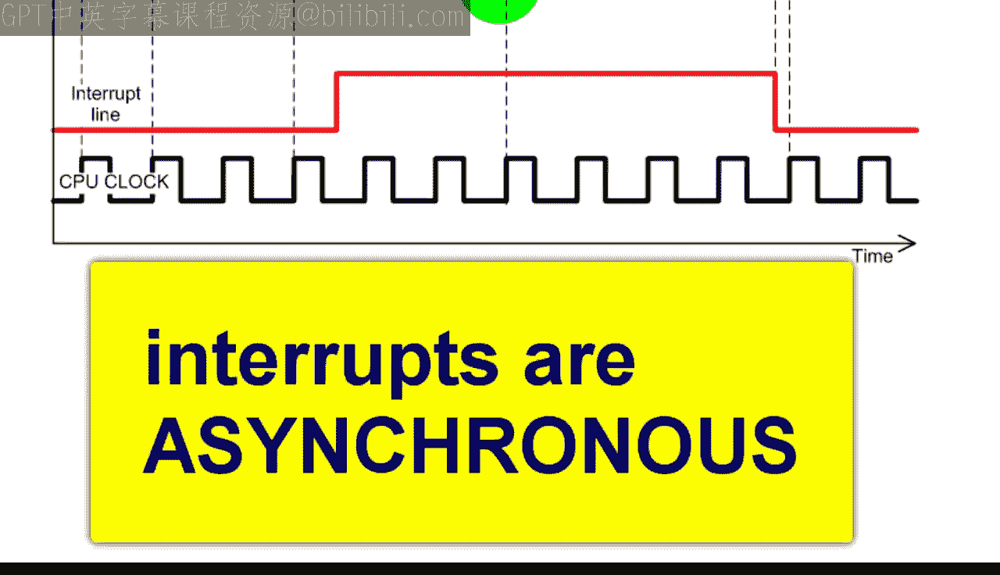

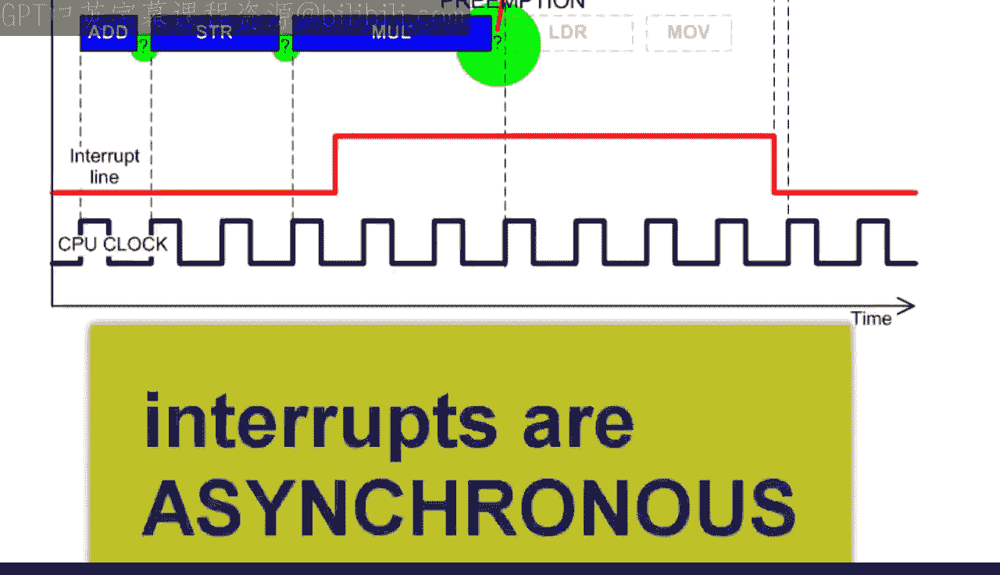

Another interesting observation is that the CPU has a special interrupt entry instruction。

 which is often one of the longest in the instruction set。 For example。

 the arm cortex M interrupt entry takes at least 12 cycles。

 whereas other simpler instructions such as move or add can execute in just one clock cycle。

With all this new information， you are almost ready to get back to the code and use the cyst interrupt instead of the brain dead polling。

But before you set up the interrupt， let's modify the polling code so that you have only one delay in the loop。

 This one delay would then directly correspond to the interval between the cystic interrupts。

 So the body of the loop， except the delay， obviously。

 would be the exact code for the interrupt handler。This will become much clearer in a minute。

 but the point is to test this still with the old polling approach before venturing into something new。

 like using interrupts。So instead of relying on the sequence LED on delay， LED off delay。

 you can observe that before each delay， the state of the LED needs to toggle。If the LED was off。

 it needs to go on and vice versa。It turns out that the C language has a nice coding idiom for toggling a bit。

 and that is the bitwise exclusive ore operator。 For example， to toggle the LED red bit。

 you use X or equals operator like this。From the truth table of the exclusive or operator。

 you can see that if the LED red bit was 0， it will become1， and if it was one， it will become 0。

Finally， let me also comment out the code for lighting up the blue LED so that the red LED will be the only one used。

When I press F7， the code compiles and builds error free。

The last logical thing to do is obviously to check if the code still runs。As you can see。

 when I set a breakpoint at the exclusive or operator。

The LED toggles every time I hit the break point。When the programme is run free。

 the LED blinks about once a second。All right， so finally。

 you are ready to configure the cysttic to generate interrupts every half a second instead of using the brain dead delay function。

For those， you need to write the correct values into the three registers comprising the cystic。

As all other registers in your MCU， the cystic registers are already mapped for you in the TM4CC CMCs H header file。

Specifically， the cyst is specified in the Cortex microcontroller software interface standard。

 CMCs header filele， core， and score CM4。H， which is included in the CM4c CMCs H header file。

It's a little bit annoying that CCs uses different register names than the data sheet in this case。

But with just three registers， it's pretty easy to figure out how they match。Actually。

 the only register that you really need to look up in the data sheet is ST CTtRl register where you configure the cystic timer。

In this register， you would need to set bits 2，1 and0 for clock source， interrupt。

 enable and counter enable respectively。The cystic counter value register is simple。

 The data sheet says that it is a clear on right register。

 which means that it will be clear no matter what you write to it。 So let's write 0。

The load register is the most interesting one because this is where you determine the interval between the interrupts。

To set this interval to half a second， you need to know the speed of the CPU clock in terms of cycles per second。

As it turns out， the default speed of your Tiva C is 16 MHz out of the onboard crystal oscillator。

 If you have good eyesight， you can see it written on the crystal Y2。

The CPU clock frequency in Hertz is an important constant in your program。

 so let's define it at the top of the file。16 MHz is 16 million cycles per second。Finally。

 you can set the cyststic load register to half of the clock cycles per second-1。

 This -1 accounts for the fact that cyststic counts through 0。 So if you didn't subtract one。

 you would count one， tick too many。One word of caution here is that for such a long time out of half a second。

 you need to check that you don't overflow the dynamic range of the counter， which is only 24 B。

 You should check it with a calculator when you convert the value to hex。

 You can see that it just fits in 3 Bs，24 B。 So you are okay。At this point。

 you have the cysttic interrupt configured and enabled。

 It will interrupt the CPU every half a second。This interrupt， in turn。

 will cause calling the cyststic interrupt handler that you have installed in the vector table in the last lesson。

In fact， you already have an empty body of this handler in your BSP do C module Today。

 the big question is， what should you put inside。Well， just like aaling loop。

 your interrupt handler needs to toggle the red LED。

 and that's all it needs to do because the delay between the interruptse happens outside the CPU handled autonomously by the cystic peripheral。

A slight problem at this point is that the code fails to compile because the LED red bit is defined only in May doC。

 and it is not known in PSP doty。The right way to fix it is to put all such board specific definitions like LED pin numbers and CPU clock frequency into the BSP。

 H header file。I am going to adapt a delay do H file for this because the busy weight delay function becomes obsolete at this point。

After the edits， I save the file as BSP dot H。And I include BSP dot H in the main C。And in BP dot C。

At this point， I can remove delayedd C from the project。When I build now。

 I get an error that the delay function is not available。

This is fine because I don't need it any more。 So I just delete it。

But note that I can't delete the whole while one loop， even though it is no longer doing anything。

This is because the CPU must spend its time somewhere between servicing the interrupts。In the future。

 you can use this loop to do something useful or to put a CPU to sleep。 But for now。

 just keep it empty。

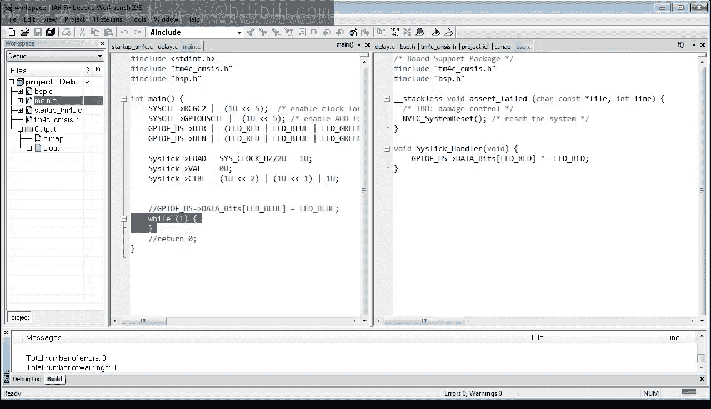

The code is almost ready to test， but you need to add one more thing。

 which is enabling interrupts to the CPU。In the previous discussion。

 I showed you that the peripherals like cyststic connect directly to the CPU's interrupt line。

This is a bit oversimplified because there is a bit more happening in between。For starters。

 all CPUus have a way to block the interrupt line in software。

 Arcortex M CPUus have a special bit called premask that must be cleared in software for interrupts to reach the CPU。

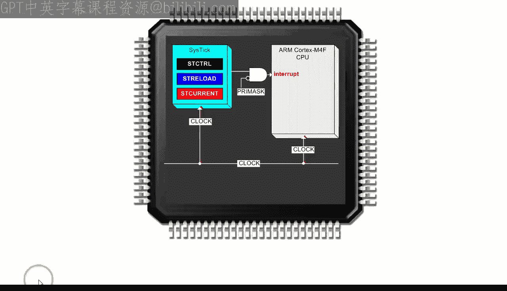

So in the last touch in your code， you need to add a call to the IR intrinsiccing function。

 underscore， underscore enable interrupt。This function will clear the prem bit。

The code compiles and links cleanly， and I am sure that you are hanging by the edge of your seat to see how the code performs on the launchpad board。

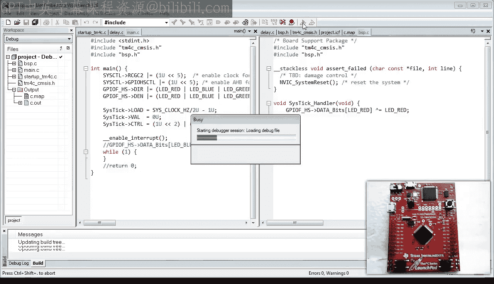

As you can see， the red LED blinks every second。When you break into the code。

 youll find it spinning inside the empty while one loop。

And when you set the breakpoint inside the cystic handler。

 you can see that the LED gets toggled every time the breakpoint is hit。

🎼This concludes this very gentle introduction to interrupts。🎼In the next lesson。

 I will step into the code and explain exactly the magic of preemption。

🎼I will also show you how interrupts work on the IMSP 430 processor。

 which will help you understand how arm cortex M differs from all other processors。

If you like this channel， please subscribe to stay tuned。You can also visit statemachine。

com/quistart for the class notes and the project file downloads。

