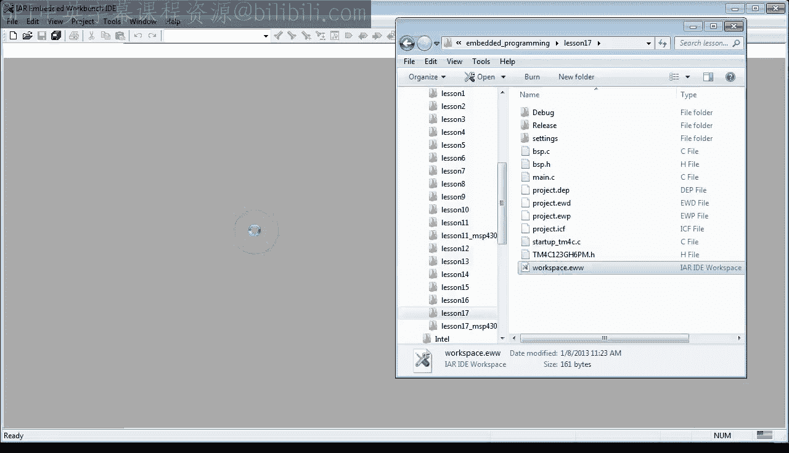
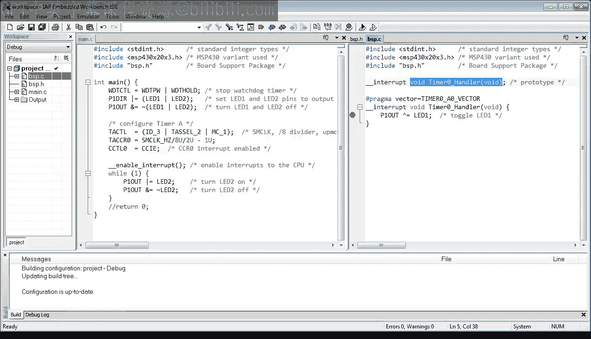
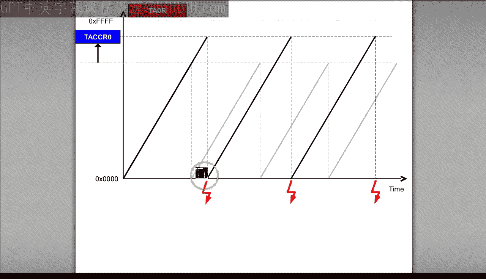
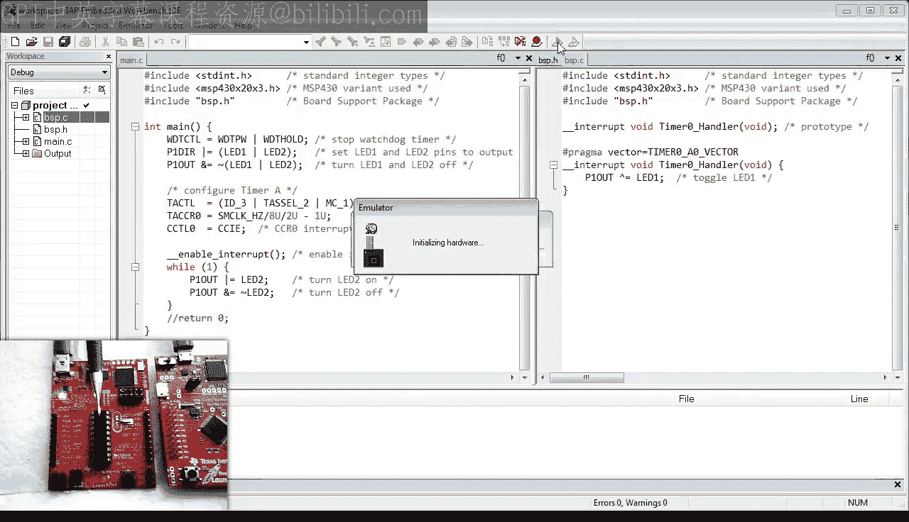
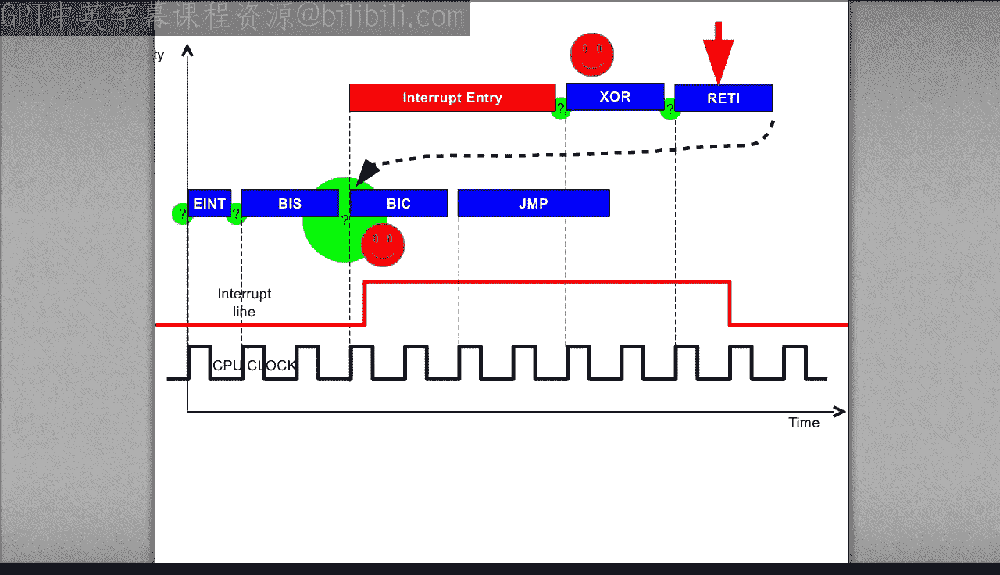
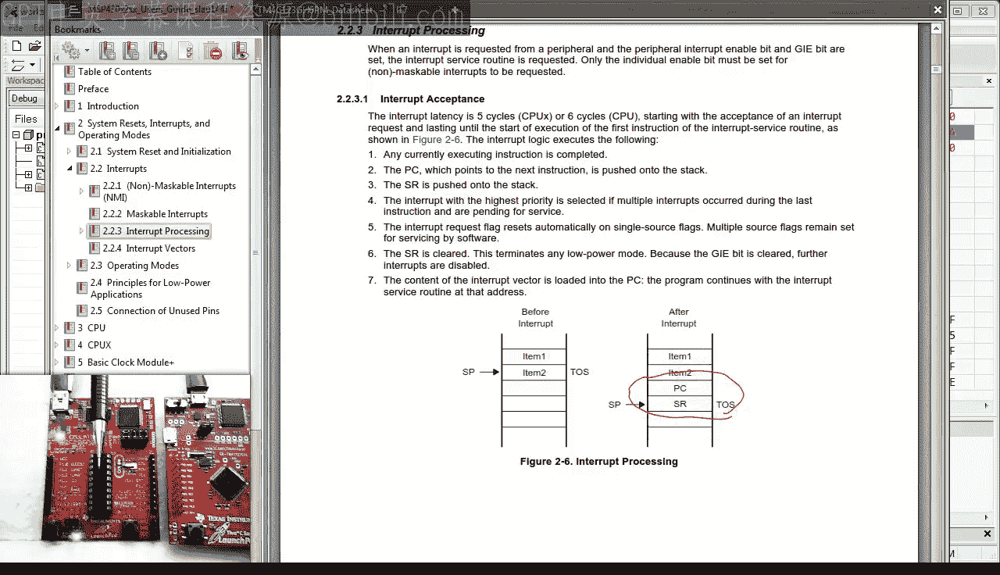
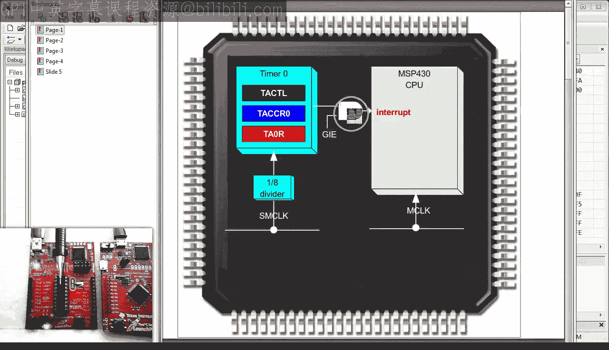
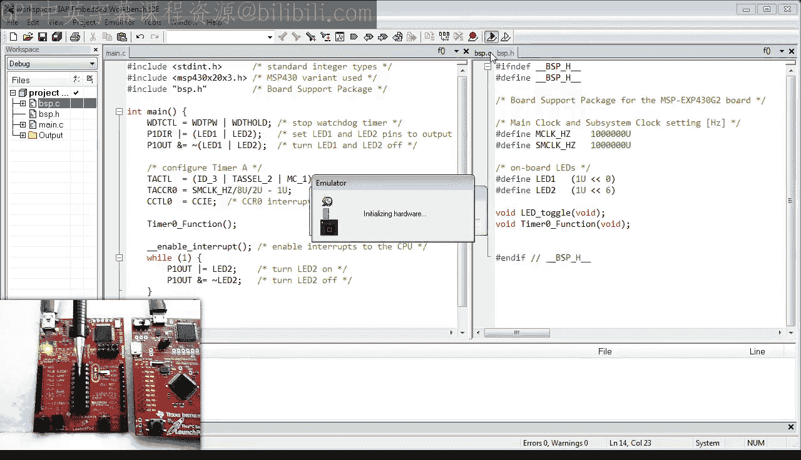

# Quantum Leaps《现代嵌入式系统编程Modern Embedded Systems Programming》中英字幕 p18 -18-#17 interrupts Part-2_ How most CPUshandle interrupts_.zh_en -BV1fRt2efEms_p18-

🎼Welcome to the modern embeddedd System programming course。

 My name is Miro Samak and in this lesson I'll delve deeper into interrupts。

🎼Today you will see how interrupts work in the MSP 430 processor。

 which will help you to understand how arm cortex M differs from other processors。🎼Specifically。

 you will see exactly how an interrupt service routine is entered and how it returns。Today。

 I will start with the lesson 17 project that I have prepared in advance instead of copying the previous lesson 16。

The reason is that I've used a different header file for the Tva CMCU。

 which is more compatible with the latest cortex microcontroller software interface standard CMCs。

The lessons 17 project is available for download from the usual URL statemachine。comm/ Quickstart。

After downloading the project， get inside the lesson 17 directory and open the provided workspace in the IR toolet。

 If you don't have the IR tool set， go back to lesson 0。

Other than the replacement of the header file， the project is identical to what you had by the end of the lesson 16 or lesson Hx 10。

 as I called it in the video。To quickly summarize what happened so far in the last lesson。

 you have completely changed the structure of your blinky program to use the cysttic interrupt instead of the brain that busy polling to wait between toggling the LED。

You probably didn't appreciate it at the time， but the cystic interrupt handler turned out to be a regular。

 completely ordinary C function， which you could call directly。

 not just through the vector table and the magic process of preemption。In fact。

 let's start today day with modifying your code to call cyststic directly from mainine。

Let's also put some code into the empty while1 loop， because for studying interrupts。

 it's more educational to have a piece of linear code for interrupts to preempt rather than just a single branch to self instruction。

So let's turn the green LED on and then immediately off in the while loop。

This will add a few instructions to the body of the loop and cause a visual effect of green LED glowing at about half of its maximum intensity。

 because it will blink too fast to be noticeable to the human eye。The code compiles error free。

 so let's set a breakpoint at the function call and another one at the beginning of the system handler。

When you run this program， you can see that the call happens in a very standard way by means of the BL branch with link instruction。

The cystic handler called as a regular function also works correctly and toggles the red LED。

And finally， the function returns to the color flawlessly by means of the standard B， X。

 LR instruction。When you continue， the program hits the break point at the beginning of cyststic。

 but this time， it is called through a completely different process of interrupt preemption。

And this is actually quite unusual。 in fact， the ability to call interrupt handlers as regular C functions is a unique feature of the arm cortex and processor because no other processor allows interrupt handlers to be regular C functions。

In most other processors， the interrupt handlers require a special entry code。

 and they return through a special return from interrupt instruction。

 so they can't be the regular C functions。Also， interrupt handlers typically must save and restore more CPU registers than the regular functions。

To understand why interrupt handlers must do this， you really need to see how they work on other processors than arm cortex M。

For that， I have here the MSP Xp 430 G2 launchpad board right next to the Tva C Lapa。

 I had already used that board bag in lesson 11。 The MSP 430 launchpad is quite similar to the Tiva launch pad。

 except it has the MSP 430 microcontroller instead of the arm cortex M。

I have also prepared an interrupt driven version of the Blinky program for the MSP 430 launchpad。

 which is analogous to the Blinky for Tiva C。The programs are very similar and consist of initializing the pens for the LEDs。

Setting up the periodic timer interrupt。Enabling interrupts。

And the wild one loop in which one of the LEDs is rapidly turned on and off。Just to make it clear。

 MSP 430 is a different processor than arm， so I cannot use the IR toolset for arm。 Instead。

 I am using IR embedded workbench for MSP 430。 You can get it from IerR dot com just like you got an embedded workbench for arm。

 whereas IR offers a free quickstar version of the MSP 430 toolset as well。

Before you load and run Bing on MSP 430， please make sure。

That the FET debugger on the MSP 430 launchpad。Is configured not to use software breakpoints。

This means that the debugger will use the hardware breakpoint built into the M U。

 The MSP 430 variant you are using has two such hardware break points。

 which is perfect for what you need。When you run the program。

You can see that the red LED blinks once per second and that the green LED glow。

When you break into the code， you can see it is spinning in the while1 loop。

 whereas single stepping through the code causes the green LED to turn on and off。Most importantly。

 though， when you set a breakpoint inside the timer 0 handler。

 which is the interrupt handler in Blinky for MSP 430， you can see that first of all。

 the breakpoint is hit at all， meaning that the interrupt handler runs and second。

 the LED toggles every time the handler runs， so the handler is doing its job。But wait a minute。

 The timer 0 handler is apparently written in C。 So what's the big deal here。Well。

 the big deal here is the underscore underscore interrupt extended keyword in front of the timer0 handler。

 This keyword instructs the Ir compiler that this is no ordinary C function。

 but rather than an interrupt handler， also called interrupt service routine IR。Also。

 there is the pragma vector directive that automatically assigns the designated interrupt handler to the specific location in the MSP430 vector table。

 This is a much simpler mechanism than in arm cortex M。

Let me make absolutely clear that both the interrupt keyword and the pragma vector directive go beyond the standard C and are specific to both the IAR toolet and the MSP 430 processor。

All this makes timer0 handler a non standard C function that you definitely cannot call directly from your program。

But you don't need to take my word for it。 In a minute。

 you will examine closer the timer 0 handler code by stepping through it in thisassembly。

But first you need to find a way to trigger the interrupt at will from the debugger。

 This is actually not quite trivial because you need to fake the expiration of the timer 0 in your MSP430 M。

 for which you need to understand how this timer works。

So here is the MSP430 timer 0 peripheral。 It consists of three registerstrs。

 with functions quite similar to that of cyststic in arm cortex M。

 but the registers are only 16 bit wide。Timer0 can be configured to use different clock sources。

 but in the blinking program it is set up to use the substem clock as MCLK divided by 8。

 meaning that only every8 substem clock cycle increments that T0 are registered。

This large divisor is necessary to fit the half second worth of clock ticks in just 16 B。

 It turns out that half a second is an awfully long time for any M， even at MSP 430。

 running at only 1 MHz。I set that timer 0 increments because unlike cyststic in arm cortex m。

 timer 0 is an up counter that increments until it reaches the value in the T CCR 0 register。

 at which point it is reset to 0， and the timer 0 interrupt is generated。

This gives you a clue how to trigger the interrupt。

 You can write to the T A0 R register a value just below the limit in T CCR 0。

The next clockctic cycle will cause these values to match， which will trigger the timer0 interrupt。

So let's just try this idea。Loow the program to the MSP 43D launchpad。

And run it free。Break into the program。As expected， you'll find the program inside the while1 loop。

Next， open the timer0 registers and find T 0 R。Click on it and enter a value of Hx F 4，22。

 which is one less than the value in T A 0， CCR 0。Finally， set two break points。

 one at the next instruction， B I C for bit clear and the other at timer 0 handler。At this point。

 you have set up the following experiment。 You are stopped at the B I S instruction by writing to the T A 0 R register。

 you arranged for the interrupt line to go high on the next clock cycle。

You have also placed two break points at the two possible paths through the code。

1 is the very next B I C instruction。 This breakpoint would be hit if the interrupt would not preempt after the B I S instruction。

 and the program would execute as usual。Your other break point is inside the timer 0 interrupt handler。

 This brakepoint would be hit only when the interrupt would fire right after the Bs S instruction。

 thus preempting the normal programme flow in this exact point。

So which one do you think it is going to be？To experimentally settle this question。

 you cannot single step because it disables checking for interrupts after each instruction。 Instead。

 you need to let the program run free。So the answer is that the interrupt has fired。But wait。

 there is more because now you can single step through the code。

The X OR instruction toggles the red LED， and the next instruction called Red eye is very special because it causes return from the interrupt。

As you can see， the program returns to the BIC instruction where you still have your first breakpoint。

So congratulations， you have just created an interrupt preemption at will。

Maybe you don't quite appreciate it at this point， but the technique of triggering any interrupt you want exactly at the instruction of your choosing is invaluable。

 Similarlyly to the fault injection technique that I showed you a couple of lessons ago。

Such techniques will help you track down the most elusive。

 intermittent and difficult problems in embedded systems programming。

 because instead of waiting forever for some rare event， you can make it happen at will。

 any number of times。

For example， you can now answer the big question。 how does the interrupt know where to return to。

So let's reset the target and set up the experiment again。But this time。

 let's watch the CP registers and specifically the S stack pointer。

Let's also set up the memory view to see the contents of the stack。Because MSP 430 is a 16 bit CPU。

 it is best to watch the stock in2 byte chunks。Unfortunately。

 I can't make the window narrow enough to show you only one column of stack entries。

 but I highlight the current top of stack that is the position of the S P。Now。

When you run the program。And hit the break point inside the interrupt。

 You can see that the S P dropped from Hex 3 F E to hex 3 F A， which is a difference of4 bytes。

 That is two stack entries。When you look into the data sheet of the MSP430 MC in the section about Internet processing。

You can see that interrupt entry pushes the PC and the SR status register to this stack。

 so the S drops by 4 bytes。

With this information， you can now identify that Hx 0，0，0 D is the saved value of the SR。

 and Hx C038 is the saved PC。 That is the return address。In fact。

 you can actually see that address in the disassembly window。

 which happens to be the BIC instruction inside the while1 loop。Interestingly。

 you can also see that after being saved， the SR register is cleared upon the entry to the interrupt。

 Among others， this clears the global interrupt enabled bit G Ie。

 which disables further interrupts to the CPU。

The red eye instruction causes the exact opposite to the interrupt entry instruction by restoring the SR and PC registers。

So that's how the code returns back to exactly the preemption point。 Also。

 the GIe bit is restored so the interrupts can be serviced again。

The return from an interrupt service routine ISR through the red eye instruction is interesting。

 but an ISR can differ from a regular C function in one more important way。And that is。

 an ISR must save more CPU registers than a regular function。To see this。

 you need to modify your timer 0 handler IR to use more CPU registers。 for instance。

 by calling a regular C function。So here I copy the current body of the timer0 handler and make it into a regular C function LED toggle。

I then call this function from timer 0 handler instead of doing the toggling directly。Next。

 I make another copy of the ISR and make it into a regular function timer 0 function to have a control sample for comparison with the original ISR。

To prevent the smart I R linker from eliminating this control function。

 I need to actually call it somewhere。 So I call it from main。And finally。

 I need to provide the prototypes of all new functions。 this。

 which I put in the BSP dot H header file。When you load this new code。

And set breakpoints in timer 0 handler and timer 0 function。

You can see that timer0 function consists of just one instruction， branch to LED toggle。In contrast。

 the timer0 handler contains much more code。 It starts with pushing registers R 13，12。

15 and R 14 on this stack。 Then it calls LED toggle via the call instruction。

And then it pops the registers into the exact reverse order。 Finally。

 the IR returns via the red eye instruction。So as you can see。

 the compiler generated very different code for a C function and ISR that have otherwise identical bodies。

I hope you start sensing why the ASR has more to do。

A function call from within an ISR can apparently club registers R 12 through R 15。

So they have to be preserved。 Otherwise， an interrupt preemption would have a side effect of clobbering registers。

Please remember that an interrupt can preempt asynchronously any two instructions so the compiler cannot tolerate clbbing registers。

In contrast， a regular function call is synchronous because the compiler is doing it via the call instruction or sometimes the BR instruction。

In any case， the compiler is prepared that certain CPU registers will be potentially clobbered at this particular point in the code。

🎼This concludes this closer look at interrupt handling in MSP 430。

 which is much more typical than in arm cortex M。In the next lesson。

 I'll go back to Ar and take a similar closer look at how it handles interrupts。

If you like this channel， please subscribe to stay tuned You can also visit statemachine。

com/quistart for the class notess and project file downloads。

There will be two projects for this lesson 17， one for the arm and the other for MSP 430。

