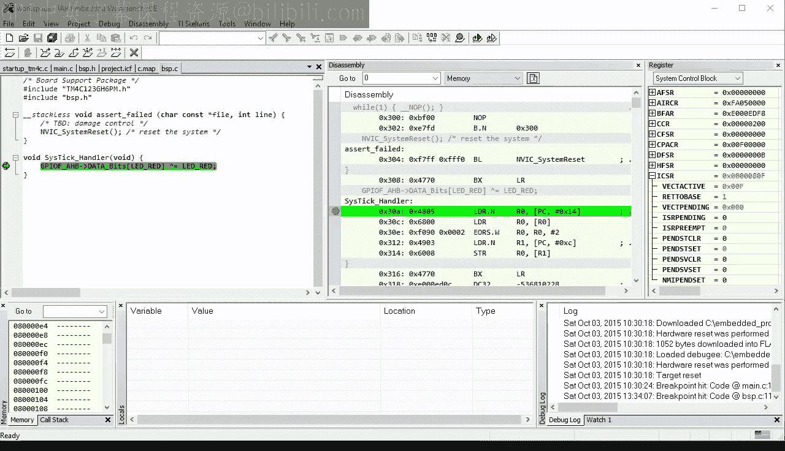
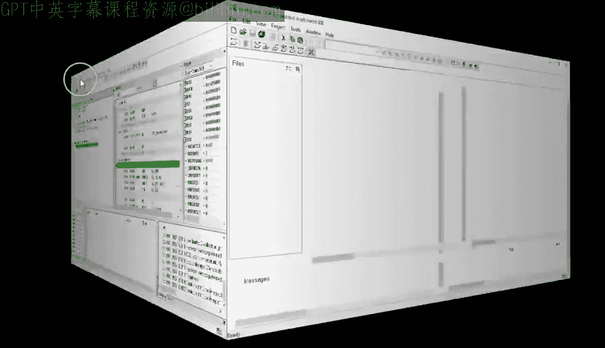
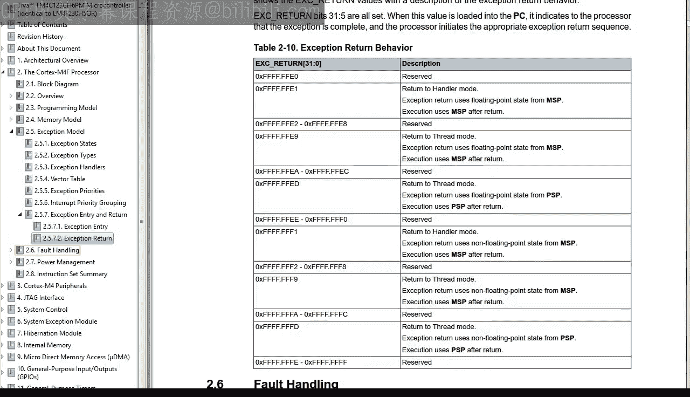
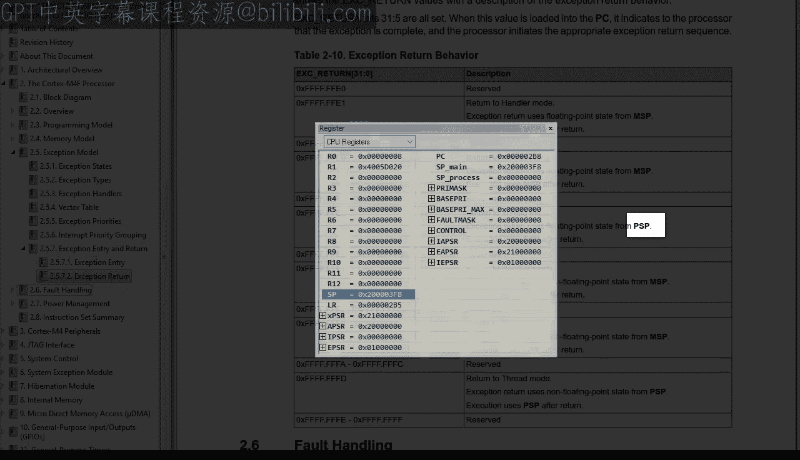
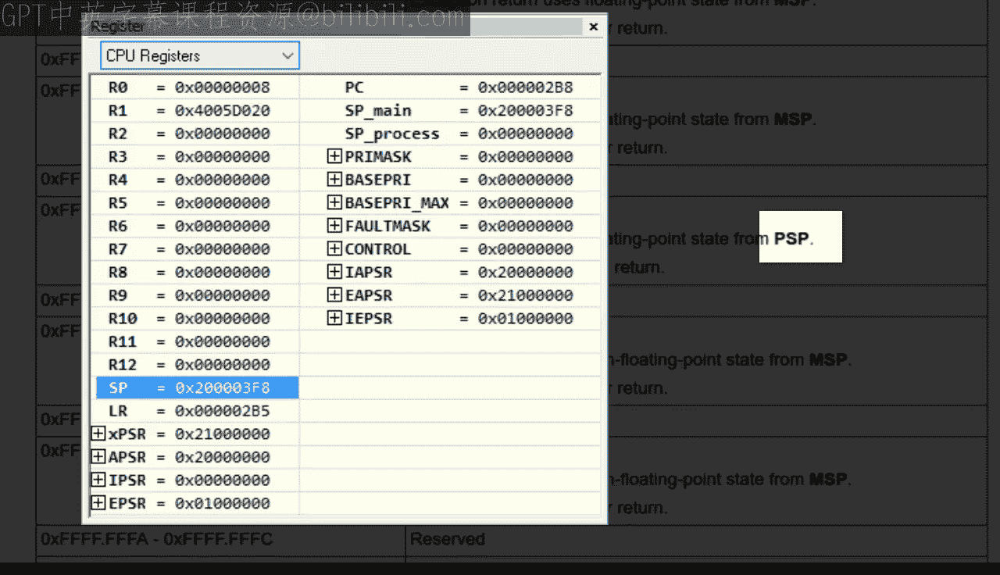
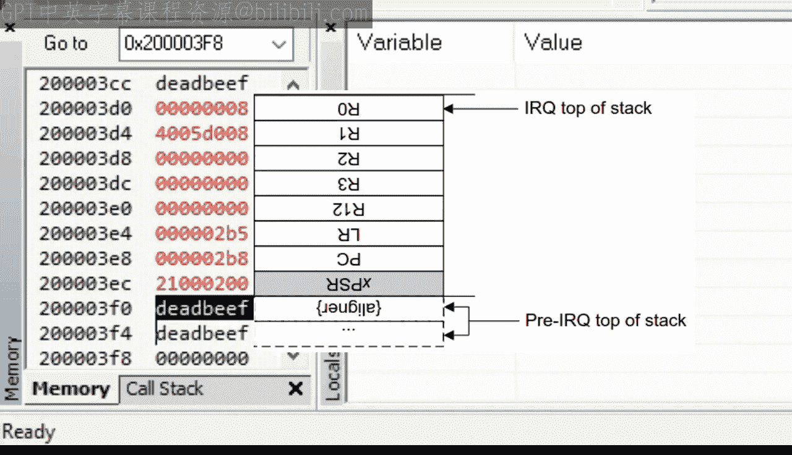
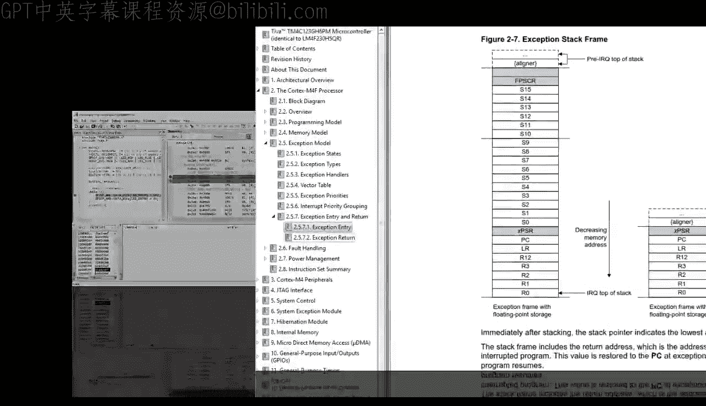
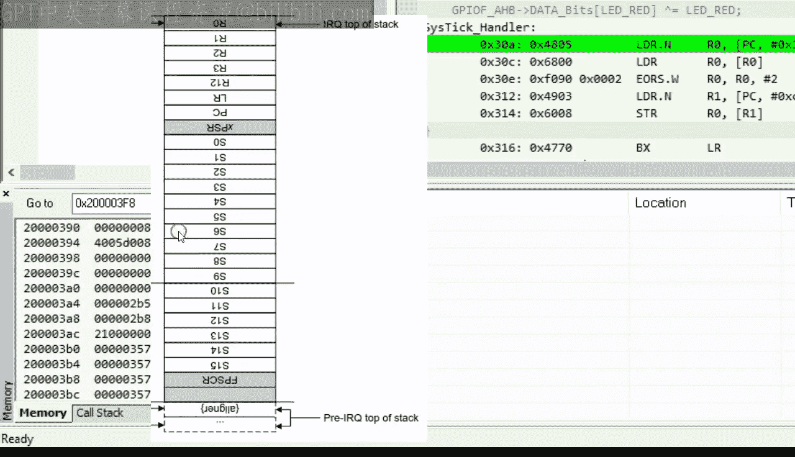
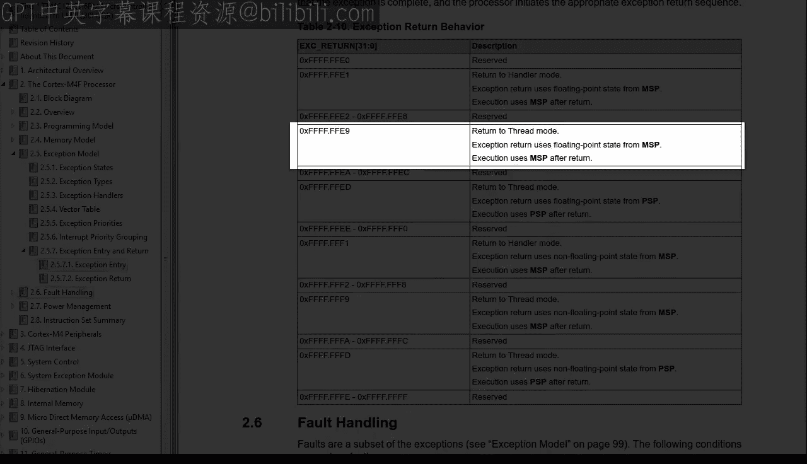

# 现代嵌入式系统编程：18：ARM Cortex-M中断工作原理

## 概述

在本节课中，我们将学习ARM Cortex-M处理器如何处理中断。我们将探讨为何中断处理程序可以是普通的C函数，以及处理器如何自动保存和恢复寄存器状态。通过实验和代码分析，我们将深入理解中断的进入和退出机制。

## 实验准备

上一节我们介绍了MSP430的中断机制，本节中我们来看看ARM Cortex-M是如何处理中断的。首先，我们需要复制上一课的项目并重命名。

以下是操作步骤：
*   复制第17课的项目，重命名为“lesson18”。
*   打开IAR工具集，进入新项目目录。
*   双击工作区文件以加载项目。

## 触发中断

为了精确控制中断的发生时机，我们需要从调试器中手动触发SysTick中断。在ARM Cortex-M中，可以通过设置中断控制与状态寄存器（ICSR）中的`PENDSTSET`位来实现。

以下是具体步骤：
*   将代码加载到Tiva LaunchPad开发板。
*   在`while(1)`循环顶部设置断点。
*   运行代码，当断点命中后，将断点移到下一条`LDR.N`指令。
*   在SysTick中断处理程序中设置另一个断点。
*   在寄存器面板中，找到系统控制块（SCB）下的ICSR寄存器。
*   将`PENDSTSET`位（位26）设置为1，使SysTick中断进入挂起状态。

运行程序后，代码将在SysTick中断处理程序中的断点处停止，这验证了我们能够精确触发中断。

## 中断栈帧分析

在触发中断并进入处理程序后，我们可以观察栈内存的变化。ARM Cortex-M在中断进入时会自动将多个寄存器压栈，形成“中断栈帧”。

以下是中断栈帧（无FPU时）包含的寄存器：
*   `xPSR`：程序状态寄存器。
*   `PC`：程序计数器（返回地址）。
*   `LR`：链接寄存器。
*   `R12`：临时寄存器。
*   `R3`， `R2`， `R1`， `R0`：通用寄存器。

通过对比内存视图和数据手册中的栈帧图，我们可以识别出这些被保存的寄存器值。特别值得注意的是，被保存的`PC`值指向`while(1)`循环中`LDR.N`指令的地址，这正是中断发生后的返回点。

## 中断与函数调用标准的关联

观察中断栈帧中保存的寄存器组（`R0`-`R3`， `R12`， `LR`， `PC`， `xPSR`），你会发现它们恰好与ARM应用过程调用标准（AAPCS）中规定由调用者保存的寄存器组形成互补。

AAPCS规定，函数必须保存寄存器`R4`-`R11`。而中断硬件自动保存了其余所有会被破坏的寄存器。这种设计使得一个普通的C函数完全可以作为中断处理程序使用，因为它只需要遵循AAPCS，保存`R4`-`R11`即可，其余工作由硬件完成。

## 中断返回机制

中断处理函数执行完毕后，通过标准的`BX LR`指令返回。然而，在中断进入时，硬件会将链接寄存器`LR`设置为一个特殊值（例如`0xFFFFFFF9`）。

当`BX LR`指令执行时，处理器检测到`LR`中的这个特殊值，并不会将其作为普通的返回地址跳转，而是将其识别为“中断返回”信号。随后，硬件自动从栈中弹出中断帧，恢复所有寄存器，并将`PC`设置回被中断的指令处，从而完成中断返回。

## 栈对齐与性能

ARM Cortex-M硬件要求中断栈帧在8字节边界对齐，以实现高效的块寄存器传输。如果栈指针（SP）未对齐，硬件会在压栈时自动插入一个“填充字”以实现对齐。

以下是关于栈对齐的要点：
*   **目的**：实现高速的寄存器压栈/出栈操作。
*   **表现**：中断进入和退出仅需12个时钟周期。
*   **注意**：编译器通常能保证栈对齐，但在涉及实时操作系统（RTOS）时需特别注意。

## 浮点单元（FPU）的影响

当启用FPU时，中断栈帧会显著增大，因为需要额外保存浮点寄存器状态（`S0`-`S15`和`FPSCR`）。

以下是FPU启用后的变化：
*   **栈空间**：中断栈帧从8个字增加到26个字，需要分配更大的栈空间。
*   **链接寄存器**：`LR`被设置为另一个特殊值（如`0xFFFFFFE9`），指示使用FPU扩展栈帧。
*   **性能**：中断进入和退出的时间会变长。

因此，在使用FPU的应用中，必须确保有足够的栈空间，并权衡其带来的性能开销。

## 总结

本节课我们一起学习了ARM Cortex-M的中断处理机制。我们了解到，通过硬件自动保存与AAPCS互补的寄存器组，并使用特殊`LR`值来标识中断返回，ARM Cortex-M使得普通C函数能够直接作为中断服务例程使用。我们还探讨了栈对齐的重要性以及FPU对中断栈帧和性能的影响。理解这些底层机制，是编写高效、可靠嵌入式中断代码的基础。在下一课中，我们将探讨一个与中断密切相关的关键概念——竞态条件。