# Quantum Leaps《现代嵌入式系统编程Modern Embedded Systems Programming》中英字幕 p23 -23-#22 RTOS Part-1_ What is a Real-Time Operating System_.zh_en -BV1fRt2efEms_p23-

Welcome to the Modern Amed Systems Program course。My name is Miro Samak and in this lesson I'll finally introduce the concept of a real time operating system。

 Arts。At this point， let me clarify right away that when I say Arts。

 I mean here a real time kernel component of the Arts， which is responsible for multitasking。

I specifically don't mean here hardware abstraction layers， device drivers， file systems， networking。

 software， or other such components sometimes attributed to the artist。🎼In this first lesson on Arts。

 you will see how to extend the foreground background architecture from the previous lesson so that you can have multiple background loops running seemingly simultaneously。

To follow along today's lesson， I highly recommend that you watch again lesson 18 about interrupts so that you have it fresh in your memory。

In terms of the software， you need the previous lesson 21 directory with the ArKyle Microvision project and the QPC frameworkrawork directory。

 which contains among others， the Cortex Microcontroller Interface Standard Syimpis。

 and the startup code for your Tva C Lapad board。The previous lesson 21 explains how to download and install all this software。

 including the ArK microcrovision development toolchain。With these prerequisites in place。

 make a copy of the lessons 21 directory。🎼And rename it to lesson 22。

Get inside the new Lesson 22 directory and double click on the Microvision project lesson to open it。

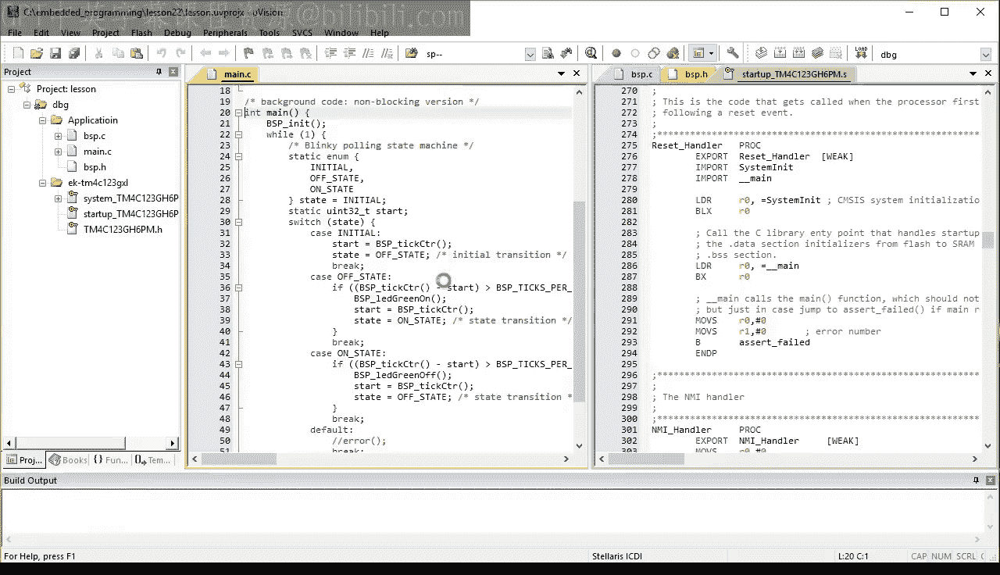

To remind you quickly what happened so far in the last lesson。

 you've learned the basic foreground background architecture。

 and you saw that it can be implemented with sequential blocking code and with event driven non blocklocking code for this lesson。

 you revert to the sequential code and delete the event driven alternative because for this and the couple of next lessons。

 you are going to focus on the sequential architectures， such as the arts。

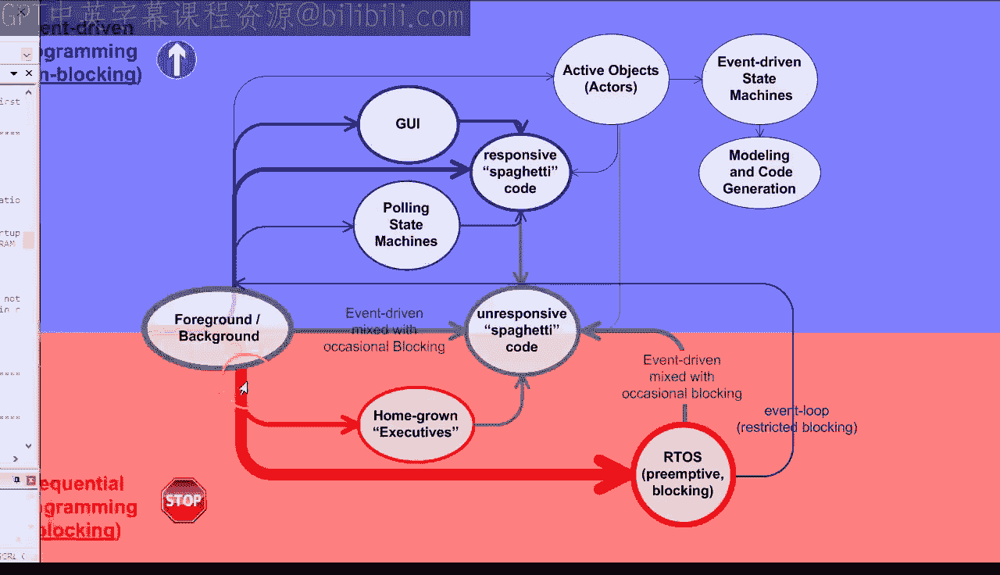

I promise to go back to the event driven architectures in the future lessons。

The sequential code from last time simply blinks the green LED on your launchpa board。

 Today's challenge is to extend its basic architecture to also blink the blue LED available on your board。

But to do it independently and simultaneously with blinking the green a lady。😊。

The first naive attempt could be to just copy and paste the code for the green LED。

And replace the LED color。🎼And perhaps also change the on and off delays。

🎼When you compile and load dis code to the board。🎼你说。You find out that it blinks both LEDs。

But not simultaneously。 Instead， the LEDs are turned on and off in sequence。 First。

 the green LED and then the blue LED。😊，Of course， this is exactly the nature of the sequential code you created。

 All you did just now was to extend the hard coded sequence of events to include also switching the blue LED on and off to blink the LEDs truly independently while preserving the simple sequential structure of the code。

 you would need not one， but two background loops running somehow simultaneously。😊。

To explore this possibility， let's create two main functions called。Main blinky one。🎼。And。

Main blinklinky2。Each of these functions having the usual structure of the while one endless background loop。

Now in the original main program， you need to call these functions so that the compiler won't eliminate the two main functions as unused code。

However， it turns out that you cannot simply call the functions one after another because the compiler is so smart that it will still eliminate the second call as unreachable because it knows that the first call never returns。

😊，To prevent this， you can add an if statement controlled by a volatile variable like this。

Before you run this code， however， please open the project options dialog box and turn off the use of the floating point hardware。

 Similarlyly， as you did in lesson 18。This is to simplify the way CPU handles interrupts。

 which will turn out to be important for the following discussion。Also， as you are edit。

 please make sure that you have a non0 heap size Again。

 it turns out that the K debugger likes to have some heap space for the so called semi hosting feature。

With these changes， let's open the coding to debugger。When you run the code free。

 you can see that it only blinks the blue LED from the main Blinky2 function。

 but let's place a breakpoint at the end of the cystic interrupt handler in BP。c。

As you remember from the previous lesson， you have configured this interrupt to fire 100 times per second When you hit the break point。

 open the memory one view and dock it along the right side of your screen。

Scroll the memory to the address of the stack pointer register S P。 Now。

 in lesson 18 about interrupts， you learn about the very specific stack frame generated by the arm cortex M exceptions such as interrupts。

To quickly refresh your memory， I will grab the layout of the interrupt stack frame from the TVC data sheet。

I will then align the internet stack frame with your stack memory view。

 remembering to flip it upside down because the arm stack grows toward the lower memory addresses。

As you can see， the seventh stack entry from the top contains the program counter PC。

 this value will be loaded to the PC register upon the return from the interrupt。So for example。

 here the PC will be loaded with Hex40 E， which you can easily test experimentally by simply stepping through the BxLR instruction and watching where the interrupt returns to。

And indeed， it does return to the address Hex for O E。

 This is a regular interrupt return to exactly the point of preemption。But now。

 when your breakpoint insistic handler is hit again， let's cheat。

And change the stack entry corresponding to the PC to the address of your main By1 function。

Which happens to be。🎼7， C6。🎼，🎼，When you execute the return from interrupt instruction BxLR this time。

 you can see that you indeed return to main By1。This means that you are returning to a different point than the original point of preemption。

When you remove the breakpoint in sstic interrupt and let the cold run free。

 you can see that you are now blinking the green LED。Of course， you can repeat the process again。

 but this time go back to executing main Blinky2。🎼And indeed， you now blink the blue LED。うん。🎼う。Here。

 I need to warn you， however， that what you have just done is not quite legal and will not really work with a more complex code。

 as I will explain in a minute。But already at this point。

 the exercise allows you to make a couple of interesting observations。First of all。

 you can see that such switching the CPU between executing multiple background loops should be possible。

Second， the exercise points you to the general mechanism for such CPU context switching。

 which is to exploit the interrupt processing hardware already available in your processor。And third。

 the exercise illustrates the general idea of multitasking on a single CPU。

 which is to switch the CPU between executing different background loops like your main By 1 and main By 2 here。

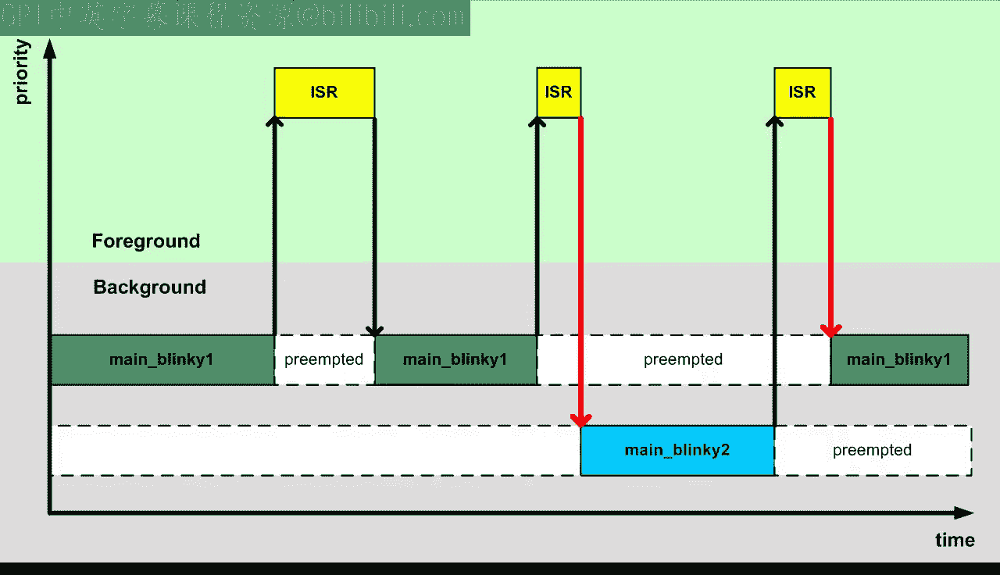

So far in this lesson， you've been doing the switching manually。

 but the process can be automated in special software called the Real time operating system kernel or Arts kernel for short。

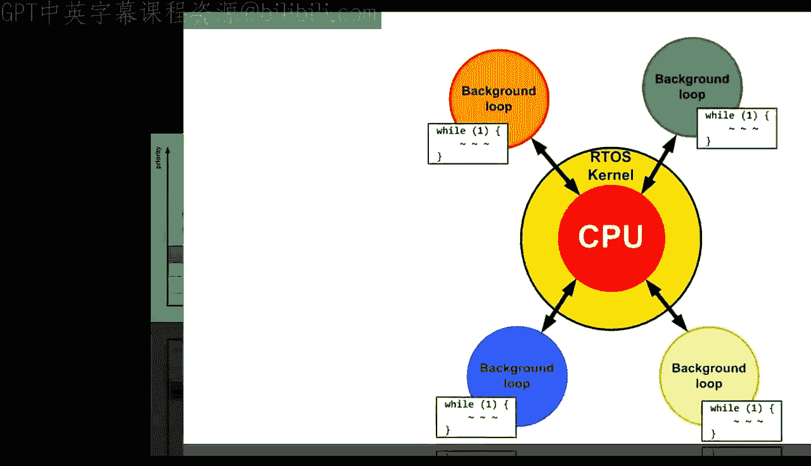

A simple definition of an artists kernel is that it is software that extends the basic foreground background architecture by allowing you to run multiple background loops called threads or tasks on a single CPU。

Another term that you should learn is multithreading or multitasking。

 which is switching the CPU context frequently from one thread to another to create an illusion that each such thread has the whole CPU all to itself。

 Both these definitions use the term thread， but I want you to remember that these threads are essentially the background loops from the foreground background architecture。

 Now in the remaining part of this lesson， let me go back and explain why changing the PC register value on the stack was illegal and what you really need to do to switch context cleanly from one thread to another。

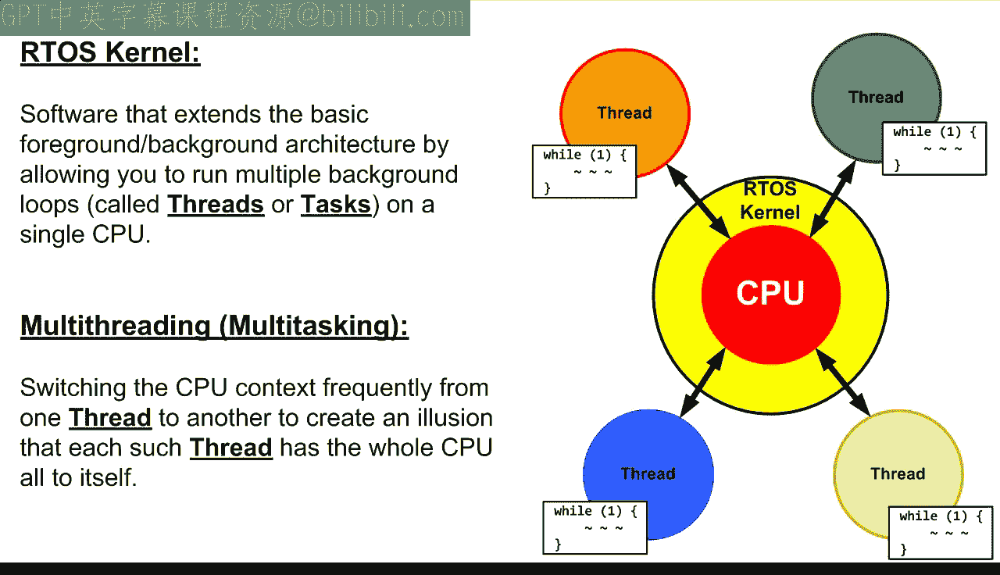

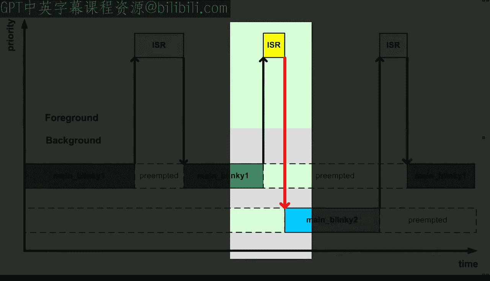

To illustrate the problem， let me use colorss for the registers that are saved and restored by an interrupt here。

 for example， I use green for the registers of Blinky1 because it blinks the green LED。

As you can see in the case of the regular interrupt preemption。

 you save registers for the Blinky One thread and restore the registers for the same By one thread as long as you actually return to the Blinky one thread。

 everything is okay。However， when you manually modify the return address。

 you are returning to the Blinky 2 thread， but you still restore the registers saved originally for the Blinky1 thread。

 which is exactly the illegal part。It happens to just work for the dead， simple， blinky threads。

 but it can and will break down for more complex threads that use more registers。

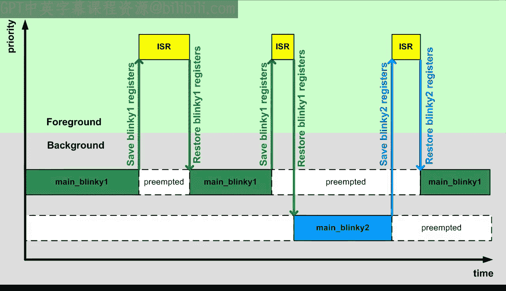

So now you might have a better idea how to fix it。Well。

 you need to keep the register sets for different threads separate。 In other words。

 the registers saved for By 1 cannot be restored for Blinky2 and vice versa。

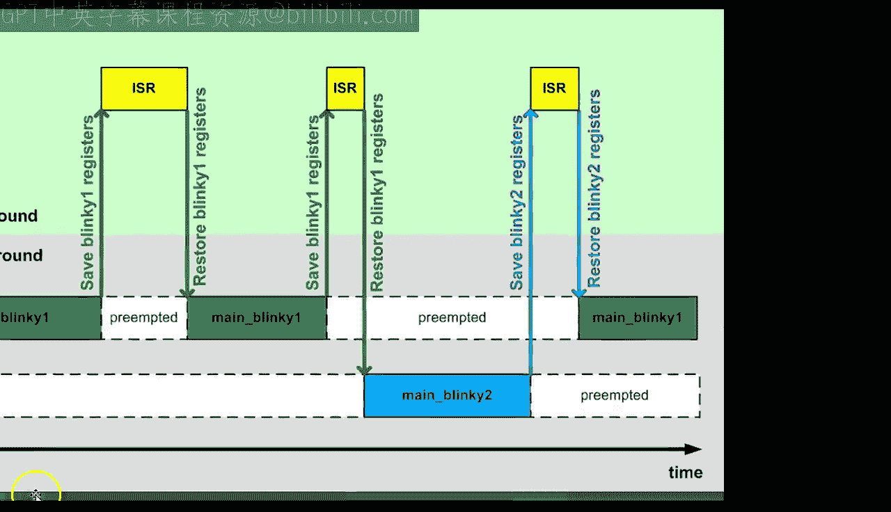

What that means is that you need to use a separate private stack for each thread。 Again。

 it might sound complicated at first， but really isn't， as you will see in the following experiment。

 You can quite easily add a stack to a thread because it is really nothing more than an area in Ram and a pointer that points to the current top of that stack In C。

 such a memory area can be represented as an array of you in 32 B words corresponding to the 32 B registers of the CPU plus a stack pointer。

Let's initialize the stack pointer to point one word beyond the end of the stack array。

 because on the arm CPU， the stack grows down。 That is from the end of your stack array to its beginning。

You need to provide a similar stack for the By2 thread as well。Now in the main program。

 you no longer need to call the thread functions， instead you need to prefill each thread stack with a fabricated cortex and interrupt stack frame。

The goal is to make the stack look as if it was preempted by an interrupt just before calling the thread function。

Therefore， you can use again the arm exception frame layout from the data sheet as your template。

You start from the high memory end of the stack because the arm stack grows from high to low memory。

Also， the armCO requires that the ISR stack frame be aligned at the8 byte boundary。

 This is the case here because the stack array was sized at 40 302id words。

 which aligns at the8 of 8 by boundary。This means that the align stack entry is not necessary。

 Finally， the arm CPU uses the full stack， which means that the stack pointer points to the last used stack entry as opposed to the first free entry。

Therefore， to add a new stack entry， you first decrement the stack pointer to get to the first free location and then you dereference it to write a value to this location。

 The first value you'll write is the fabricated program status register in which you need to set just one bit number 24。

This bit corresponds to the thumb state of the processor。

 the cortex N processor cannot be really in any other state， such as the arm state。

 but for historic reasons， the XPSR register must have the thumb bit set。

The next value on this tag is the PC。 This is the return address from the interrupt。

 and as you saw from your earlier experiments， it needs to be set to the address of the thread function。

I have not explained yet in this course that the C language allows you to take an address of a function using exactly the same ampers operator as taking an address of a variable。

The address of operator applied to a function produces a pointer to function。

 which I will explain in more detail in a future lesson about state machines。For now。

 you need only to understand that such a pointer can be created。

 but must be cast on U in 32 to fit on your stack。The other registers in the I R stack frame do not really matter for the proper calling of the thread function。

 because the thread does not return， but for testing purposes。

 you can initialize the stack with numbers corresponding to the register number。

 This will help you to easily recognize the stack frame in the debugger。

You initialize this tag for the Blinky2th thread in exactly the same way。

 except you use the address of the Blinky2 thread function for the PC register value。And finally。

 you need to prevent the main program from terminating。

 so you will add an empty while1 loop which will wait for you to start switching the threads around。

So now you can open the debugger。And run the program free to first verify that it doesn't blink any LEDs because it executes the empty while one loop in main。

But the code should have initialized the stacks， which you can see in the memory one view Here is Blinky one stack。

🎼Yeah。And here。🎼Blinkky2 stack You can also open the watch1 window。And set it up。

To watch the initial S By1。NSP blinky2 stack pointer variables。Now comes the most interesting part。

 and I can only imagine that you must be hanging by the edge of your seat for what's about to happen。

 set your usual break point at the end of Sst。 And when it is hit。

 you switch the CPU stack from the original main C stack to one of the private By stacks。

 say blinky one。To do this， youll simply manually change the SP CPU register to the value of the S By1 variable。

Now， when you step through the BxLR return from interrupt instruction。

 you can see that you end up in the blinky one thread。

And when you remove the brakepoint from cyststic， you blink the green LED。

To change the context to the Blinky2 thread， set the brake at the end of Stic again。

 and this time you will switch the stack to Blinky2， but before changing the SP register in the CPU。

 copy the current value of the SP from the CPU into the SP blinky1 stack pointer variable because this release is the current top of stack for the Blinky1 thread and so you need to update the stack pointer before switching away from this thread only now you can overwrite the SP register with the top of stack of the next blinky2 thread to execute。

When you step through the BXLR instruction。You can see that now you'll return to the Blinky2 thread。

When you remove the break point and run the code again。

 you can see that the blue LED starts blinking， so you are indeed running the blinky tooth thread。

So now I hope you are getting the hang of it。Your manual procedure of switching the CPU context is to break at the end of the cystic interrupt。

Copy the current value from the SP CPU register into the stack pointer variable corresponding to the currently executing thread。

And to copy the other thread stack pointer to the SB CPU register。Please note， however。

 that you no longer need to mess with the stack content in memory。

Please also note that when you switch to the blinky one thread now。

 you resume it at precisely the point of preemption by the cystic interrupt and not at the beginning of its thread function。

For example， here you return to a specific location in the BSP take counter function。

 which was called from a specific location in the BSP De function。

 which was called from main Blinky one thread。All this information is preserved on the private Blinky one stack。

When you run the code free， you can see that the two threads execute now independently。 For example。

 here， the Blinky1 thread runs while Blinky 2 is preempted with the blue LED turned on。

The timing diagram illustrates the new way of context switching using a separate private stack for each thread。

 As you can see， you no longer mix registers。 Instead。

 the registers for Blinky1 thread are stored on Blinky1 stack and subsequently restored from the same Blinky1 stack。

 the same goes for Blinky2 or any other thread that you might add to the system。

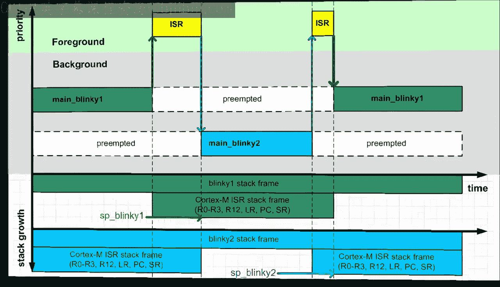

All of this looks very promising as the way to implement a contact switch。

 but you are not quite out of the woods yet。 The remaining problem is that your contact switch can still cober some CPU registers。

 so the CPU state is not quite correctly restored before resuming a given thread。To understand why。

 recall from lesson 18 that the cortex M exception T frame corresponds to the Ar application Procure call standard。

 AA PCCS， in that it stores only the registers that are allowed to be clubed by a function call。

But does none store registers R 4 through R 11， which must be preserved by a function call。

This works for interrupt series routines， ISRs， because an ISR must necessarily run to completion before returning to the preempted code。

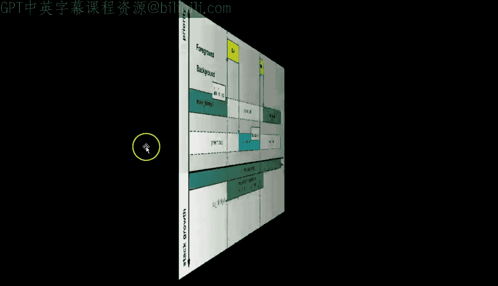

For example， suppose that Blinky1 T code uses the R7 register。

 which as you can see is not saved in the Cortex M ISR stack frame。The ISR might be also using R 7。

 but it must save it and restore before returning。 This works just fine。

 but only when the ISR is the only code executed while a thread is preempted。But in your case。

 the ISR does not return to the preempted code， but rather to another thread， Blinky2。

 this other thread can also use the R7 register and as any function is also obligated by the AAPCS to restore the R7 upon its return。

But you are not executing the whole thread function， but rather just a piece of it。

 This piece of code doesn't need to comply with the A PCCs， and it can change the value in R7。

The result is that by the time Blinky1 resumes execution， the R7 register might be clobbered。

 which is a problem。Of course， the same argument can be made about any of the registers R 4 through I 11。

 The solution is to say the remaining 8 registers R 4 through R 11 on the thread stack at the end of the ISR。

 right before switching the context away from the thread。

 These registers must then be restored from the thread stack right before returning to this thread from the ISR。

Unfortunately， these additional eight registers add a lot of tedious labor to the manual context which we have been doing so far。

First， you need to append the additional registers to the fabricated stock frame for all your threads。

🎼，🎼。Second， when saving the current thread context。

 you need to save the additional 8 CPU registers R11 down to R4 on top of the current ISR stack frame。

 and also you need to adjust the value of the SP CPU register by subtracting Hex20 from the SP before saving it in the thread stack pointer。

 second， when restoring the next thread， you need to restore the additional registers。

 R11 down to R4 from the thread stack to the CPU registers。And finally。

 you need to add Hex 20 bytes to the thread stack pointer before writing it to the CPUUSP register。

A idious manual procedure is of course not a problem when you auto it in software。

 and this is exactly the subject of the next lesson where you will begin building your own artist as kernel。

The most important takeaway from today's lesson is that you now gained an understanding of Art threats and the mechanism an Arts currently uses for switching the CPU from one thread to another。

Not only that， you have also worked out a precise algorithm for context switching。

 so you are now ready to implement your own art kernel。

 I hope you will join me for this fun in the next lesson。😊，If you like this channel。

 please subscribe to stay tuned， you can also visit statemachine。

com/quistart for the class notes and project file downloads。

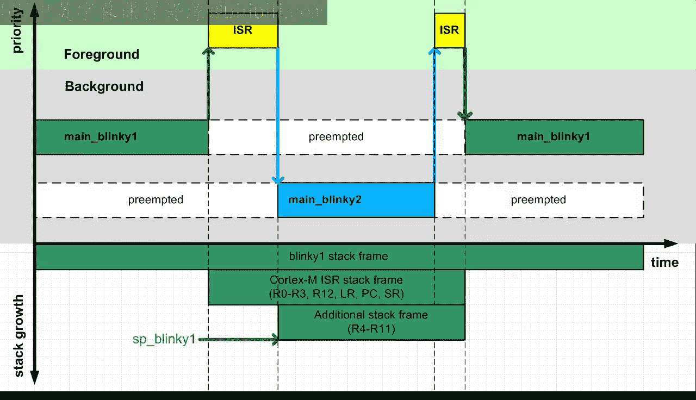