# Quantum Leaps《现代嵌入式系统编程Modern Embedded Systems Programming》中英字幕 p24 -24-#23 RTOS Part-2_ Automating the context switch.zh_en -BV1fRt2efEms_p24-

Welcome to the Modern Ameded System Program course My name is Mirosic and in this second lesson on Arts。

 that is a real time operating system， I'll show you how to automate the contact switch process。

Specifically in this lesson， you will start building your own minimal art that will implement the manual context switch procedure that you worked out in the previous lesson 22。

As usual， let's get started by making a copy of the previous lessons 22 directory and renaming it to lesson 23。

Click inside the new lessons 23 directory and double click on the Microvision Project lesson to open it。

To remind you quickly what happened so far in the last lesson。

 you have been posed a challenge to blink both green and blue LEDs on your launchpa board。

 but to do it independently。After finding out that you cannot easily do this in a single loop。

 you've explored the idea of running two background loops simultaneously。

 specifically you've created two such loops called main Blinky 1 and main Blinky 2 and then you try to figure out how to switch the CPU between executing one to executing the other。

This turned out to be the central idea behind a realtime operating system， Arts。

 whose main job is exactly to extend the foreground background architecture by allowing you to run multiple background loops on a single CPU and to create an illusion of concurrent execution by frequently switching the CPU among all these loops。

You also learn the new terminology in which the background loops managed by the arts are called threads or tasks。

 and the switching from one such thread to another is called context switch。

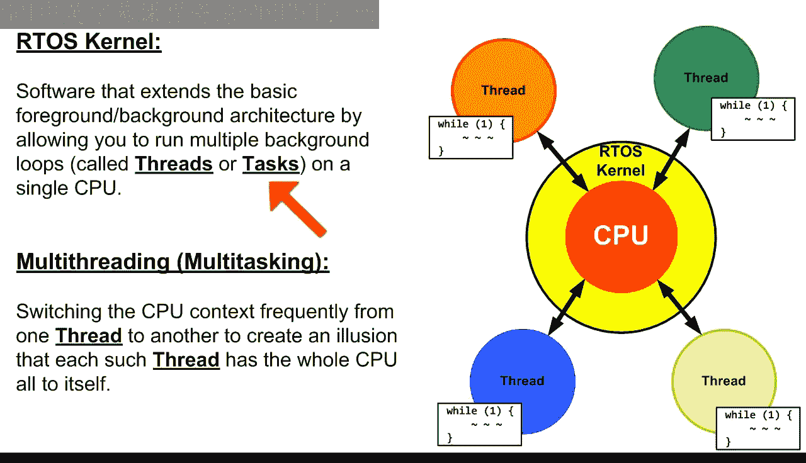

Finally， in the last lesson 22， you've worked out an algorithm to perform the context switch manually。

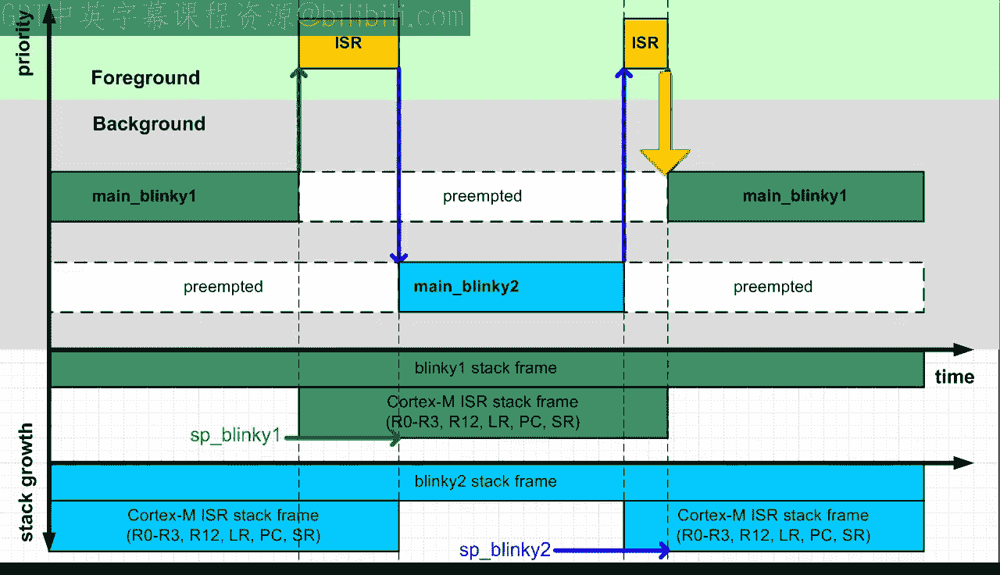

In this lesson， you will write the actual code to automate it。

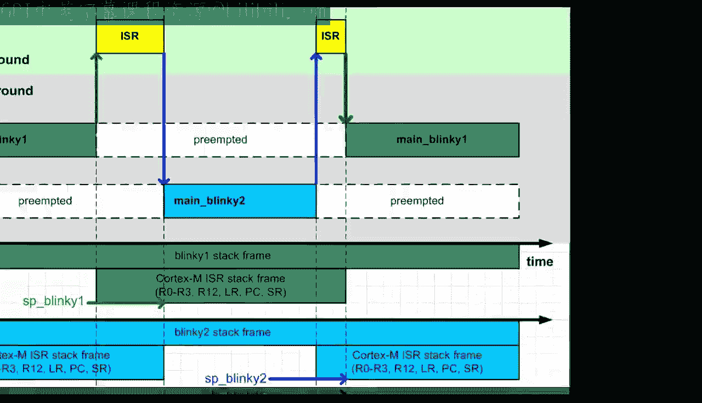

Specifically today you will start building your own minimal real time operating system。

 which I abbreviated to mirrors。As I am a strong believer in learning by doing。

 I think that the process of building a minimal but functional Arts kernel from scratch will offer you a deeper learning experience than trying to learn by reverse engineering and existing product。

 such as free Arts。This is because an real life kernel is necessarily much more complex with features that will only make sense to you later。

 so it is just too easy to lose the big picture for the minotia。

So let's get started by adding a new project group called Miros。

🎼In a which you create just two files。First is the header file that will contain the application programming interface API of your Art。

🎼う。And second is the C file that will contain the complete implementation of the Arts。

🎼In the hair file， you place the usual inclusion guards。But also。

 as this piece of code has the potential of being used more widely。

 it is a good idea to provide a comment with a brief description， copyright and licensing terms。

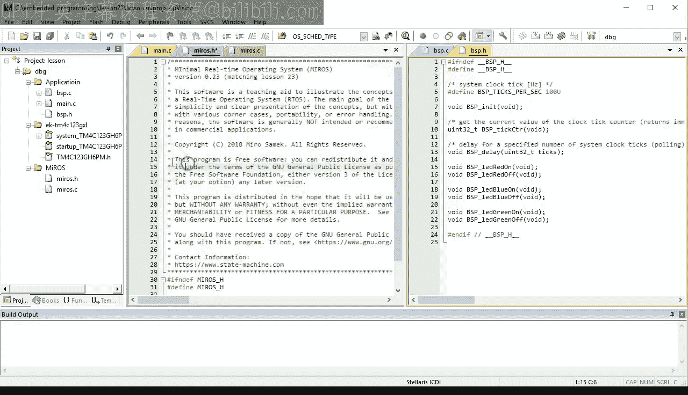

I say here that this code is intended as a teaching aid and is not recommended for commercial applications。

I decided to use the GPL open source license and include the standard language from the GPL that declines any warranties。

 Finally， the comment contains the contact information。

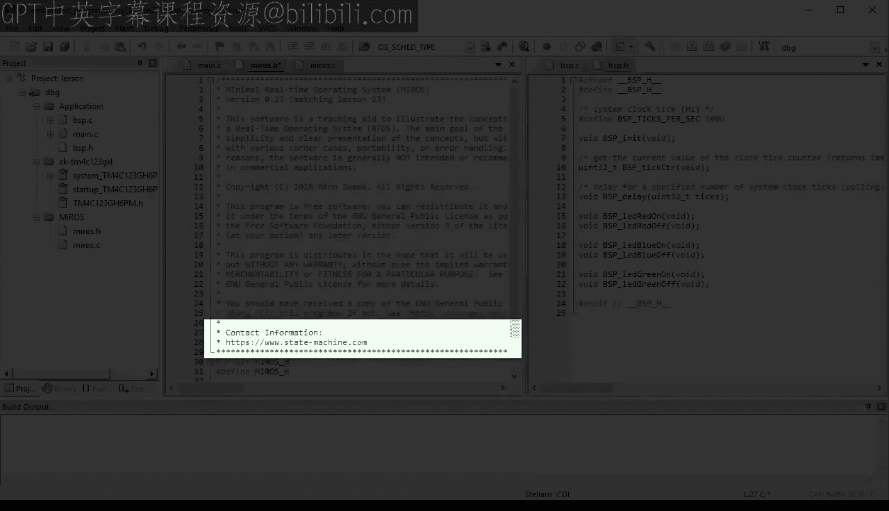

The first thing you need in the header file is a way to represent your threads。For this。

 you can look in the main dot C file where you see that each thread requires a private stack pointer。

 S， and perhaps some other information。You can capture this by providing astruct。O S thread。

That contains the S pointer and can be extended in the future as your artist grows。

In the standard artist implementations， the data structure associated you with the thread is traditionally called a thread control block。

 TCB。As far as the prefix Os is concerned， similar prefixes are used in many artes where they serve two purposes。

 First is to clearly indicate which elements are parts of the operating system O。

And the second purpose is that such prefix reduces the possibility of name collisions in larger projects where someone might also choose the same name thread。

 but for something entirely different。With the OS thread type they provided。

 you can now use it in main dot C。 You need to include murals do H Hophil and replace the stack pointers with the O thread type。

The next Arts API you need is a function to fabricate the register context on each thread stack。

🎼Traditionally， such artist as service is called thread Cate or thread start here I will use the name OS thread underscore start。

🎼。🎼うんうん。The function needs to take the following parameters。At pointer to the TCD。

 I will call this pointer me， which is a coding convention that I will explain in a future lesson about object oriented programming in C。

Apoint to function to the thread handler。Which is a bit tricky to define and see。

 and the best way is to provide the type def for it。For now， let's call this type O thread handler。

 And finally， the thread start function needs the memory for the private stack and the size of that stack。

This signature will be augmented with additional parameters as your mirrorro's artist grows。

 but this is all for now。Regarding the pointer to the thread function。

 you need to type def it obviously before the thread starts signature as follows。

It is a pointer to a function taking no arguments for now and returning void。

As far as the implementation is concerned， you start your Mis。c file with the same comment as Mis。h。

 and you include both SDdin。h and Mis。h header files。

You copy the OS thread start signature from Euros。t H and the body。🎼From main dot C。

To stitch the two pieces together， you need to establish the initial stack pointer from which to build the stack frame。

🎼As I mentioned in lesson 22， on arm cortex M， the stack grows from high to low memory。

 so you need to start from the end of the provided stack memory。🎼，🎼你。🎼う。🎼出处。🎼。As I also mentioned。

 the cortex Ms tag needs to be aligned at the8 byte boundary。

 but obviously the user of the function might not be aware of these requirements。

 so it is unwise to assume that the end of the provided stack memory will be properly aligned。

But you can ensure the proper alignment by rounding down the end address one way to achieve it is to apply integer division by8。

 followed by integer multiplication by 8。Next， you simply replace the SP Blink1 identifier with SP。

You also change the main By1 thread handler with the thread handler parameter of your OS thread start function。

And finally， after the stock frame is built， you save the top of the stack frame into the SP member of your OS thread structure。

At this point， you can add some extra features such as pre fillinging the remaining stack with a known bit pattern like dead beef here。

This will make it easier for you to see the stack in memory and will help you to determine the worst case stack use you will see this later in the debugger view。

😊，Your R OS thread start function is ready now， so we can call it right away inside main。C。

You first call it for the Blinky one thread。🎼The。🎼。🎼The。🎼The。🎼。

🎼And then simply replicate the code for the blinky toolth thread。🎼The。As you can see。

 the code still builds error free。The next feature is the actual code for the context switch algorithm。

As you saw in the last lesson， the context which must happen during the return from an interrupt。

 such as cysttic， and in principle you could code it right there。

But the main drawback would be that the contact switch code would need to be added to every interrupt service routine ISR in the system。

This would not only be repetitious， but it would defeat one of the main benefits of Arcortex M。

 which is that ISRs can be pure C functions， I hope you realize from the last lesson that the context which cannot be coded in standard C。

 but rather will require some CPU specific assembly code to build a very specific stack frames as well as to manipulate the CPU stack pointer register。

However， it turns out that arm cortex N offers a solution that allows you to code the context switch in only one interrupt。

 which will be then efficiently triggered from other interrupts or even from the thread level code if need be。

The trick of triggering an interrupt has been already introduced back in lesson 18。

 where you trigger cyststic by setting a bit in a special register inside the system control block module。

Today， you will use the same exact trick again， but with respect to a different exception called PansV。

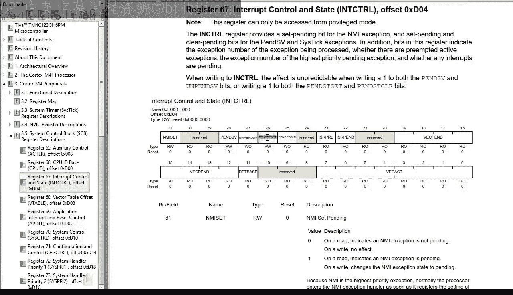

🎼，Which exists for this specific purpose and virtually all arttoes for cortex N use it for context switching。

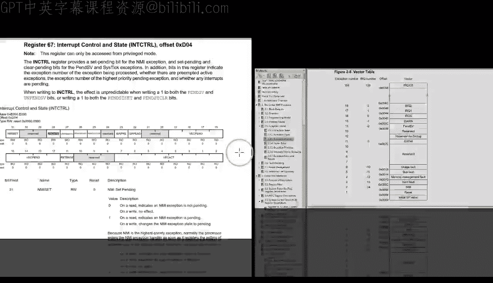

I'd like you to remember， however， that pansV is not that special and in principle you could use any other asynchronous exception or interrupt for the purpose of context switching。

To see how it will work， let's add an empty panacev handler implementation at the end of murals。

c file。Build。And open the debugger。🎼出。🎼，🎼。First， let's check that your OS thread start function calls fabricate the expected stack content in the memory view。

🎼And indeed， you can easily see the stack for By one。🎼And this tag for Blinky2。Next。

 set a breakpoint in your so handler and run the program。When the break point is hit。

 scroll your memory view to the address Has E000 E04。

 which is the interrupt control and state register in the system control block。

As you can check in the data sheet， the PsV exception is triggered by setting the bit number 28。

 which is hex1 followed by 7 zeros。You write this value into the ICSR register to trigger Pda's fee。

Before running the program， move the original breakpoint in cyststic to the next instruction and set another breakpoint in your empty pendas V handler。

 This setup has been already used in lesson 18 because it allows you to determine precisely the order of preemption。

 When you run the program now， it turns out that the first breakpoint hit is inside pandas V。

 This confirms that you have successfully triggered the pens V exception。

 But this is also interesting because apparently the pendas V exception has preempted the still active cyststic exception。

 Indeed， when you continue， you hit the breakpoint in cyststic。 and only when you continue again。

You end up in the main function。Unfortunately， this order of preemption is not what you want。Instead。

 you want the Stic handler to complete， and only after it's done you want the Ps V handler to run and switch the context。

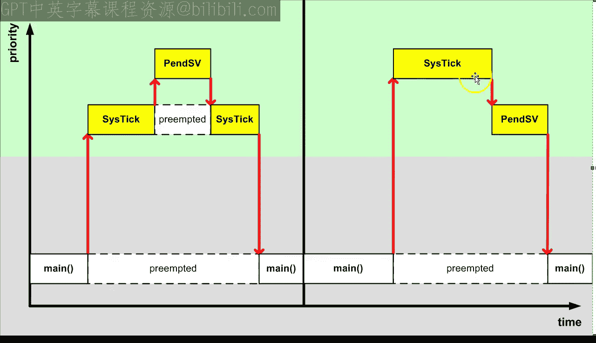

Luckily， the arm cortex M Cor lets you control how exceptions and interrupts preempt each other by means of the adjustable interrupt priority associated with each exception。

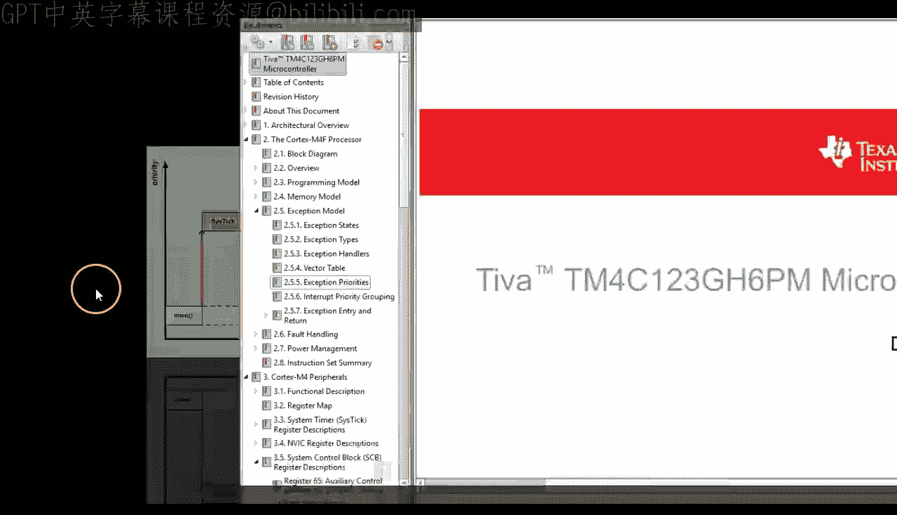

Specifically， priorities of cyststic andendice V are controlled by the Cs33 register at address Hx E000 E20。

You can actually view this register in the memory where you can see that the cyst priority is hex E0 and pendas V priority is 0。

These priorities work backwards， meaning that a higher priority number means really lower priority for preemption。

 That's why theendice V with priority 0 preemps cystic with priority E0。If you flip it。

 that is you give cysttic priority 0 and pens V the lowest priority E0。

 you will revert the order of preemption。To prove it。

 let's set up the break points exactly as before。🎼The。And manually trigger pansV again。🎼うう。

When you run the code now， you can see that the first breakpoint hit is inside cyststic。

 which means that cyststic has not been preempted by pandas V。

But Penicephi still was triggered and runs just as you wanted it。 And it finally returns to Maine。

Please also note that even if you write FF into the priority byte associated with Panas V。

The value reads back as E zero。This is because armcortex M core implement Inter priority only in the highest order bits of the priority by Tiva CmC implements only three interrupt priority bits Other cortex MMmCs might implement more bits。

 for example， STM32 implement4 priority bits， so if you wrote FF to an ST chip it would read back as F0。

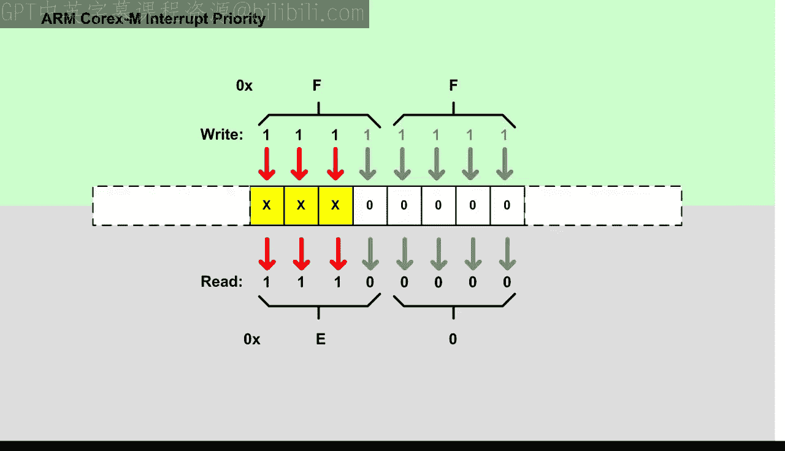

If you think that Ar cortex M in priority numbering scheme is a bit complicated， you are not alone。

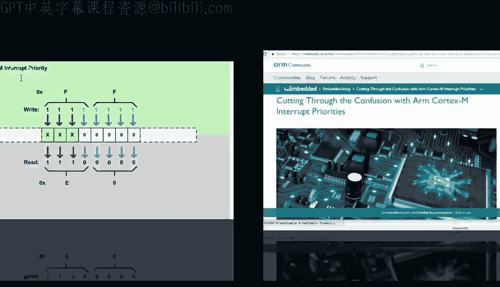

To get it all clarified in the notes for this video。

 I provide the link to my Ar community blog post cutting through the confusion with Ar cortex M interrupt priorities。

For today however， you only need to remember that pens V needs to have the lowest interrupt priority of all exceptions and interrupts。

 which you can set by writing FF into the priority byte for Pens V。

 this would cover all possible versions of the arm cortex M course。

The Pan SV priority setting needs to happen during the system initialization So let's put it in the O S in function。

Please note that inside the art' implementation， I decided to use R memory address of the CsP3 register instead of the Simpis interface。

 because I don't want to commit to any specific arm cortex M core， such as cortex M0 and3 M4 or M7。

The panis fee priority is at the same address in all of them， so this code will be more universal。

Of course， you need to put the OS in it prototype in the Miro。 H heading file。

And you need to call Os in it from main inside the application level code。

 you should generally avoid interrupts with the lowest priority because the lowest level should be reserved for pens fee。

Therefore， in BP。C， you need to raise the priority of cyststic from the lowest level to0。

 for example。Here you commit to a specific T M anyway。

 so you can use the Sensus function and VC set priority to set the priority of the systemic exception。

With the interrupt priorities in place， you now need a function to trigger Ps V。

As it will become clearer later in this lesson， the triggering of a context which will be closely related to the decision about which thread to schedule next。

 Therefore， the name of this function will be O S SC。To implement this scheduling service。

 you first need to decide how to keep track of the current thread and the next thread to execute。

This， you can simply qualify as two pointers， to OS thread objects。

 The OS curve pointer will point to the current thread。

And always next will point to the next thread to run。

As these pointers will be used inside the interrupts， you should make them volatile。

 Please note that you need to place the volatile keyword after the asterisk because you want your pointer to be volatile If you placed volatile before the asterisk you will get a nonvolat pointer pointing to volatile OS thread start。

 which is not what you want。Going back to the implementation of the OS CA function。

 it needs to decide how to set the OS next pointer。

 but let's initially skip this step you will see a couple of popular scheduling strategies in the upcoming lessons。

For now， let's simply codify how to trigger the penice V exception。

But only when the next thread is actually different from the current thread。At this point。

 as with all art' services， you should be very careful about race conditions。

 which I introduced back in lesson 20。 This is actually the most difficult aspect of building an arts in the first place with OSKD。

 you have of course plenty of opportunities for race conditions around the current and next pointers。

 so you need to prevent them by disabling interrupts。You have two options。

 either disabledable interrupts inside the function like this。

Or you can demand that the whole function must be always called from within an already established critical section。

I prefer the second option because it turns out that the scheduler often needs to be called when you already have disabled interrupts。

 so disabling and reenabling them again inside OS SCD could be problematic。With this。

 you can now call the scheduler at the end of your cystic handler。

But you need to surround it with the critical section like this。So now finally。

 you have everything in place to implement the contact switch inside the Pice V handler。

As I mentioned earlier， Pit view will necessarily need to be coded in assemblymbly。

 but you can get a big help from the compiler by writing some code in C and then copying the compiler generated code from disassembly view as a convenient starting point for your actual implementation。

🎼The first thing you need in PV is to disable interrupts。🎼お。

Next you need to save the stack content of the current thread。

 but you need to be careful because the first time around there will be no threads running and the OS curve pointer will be zero out of reset。

 therefore you need to check for it in an F statement。Inside the if。

 you want to push the registers R4 through R 11 onto the current stack， but you cannot code it in C。

 so you'll just leave a comment。After pushing the registers。

 you need to save the SP register into the private SP data member of the current thread Again you cannot easily access the real SP register。

 but you can at least fake it by introducing a local variable SP that the compiler will allocate in some register。

You will then be able to replace that register with the real S in the actual code。

After saving the context of the current thread， you need to restore the context of the next thread to run。

 so you set the SP register to the value of the private S from the OS next thread。

As you are now changing the current thread， you set the OS curve pointer to OS next。And finally。

 you pop the registers R4 through our 11 from the new stack。

 you re enableable interrupt and you happily return to the next thread。

So let's build and test all this。

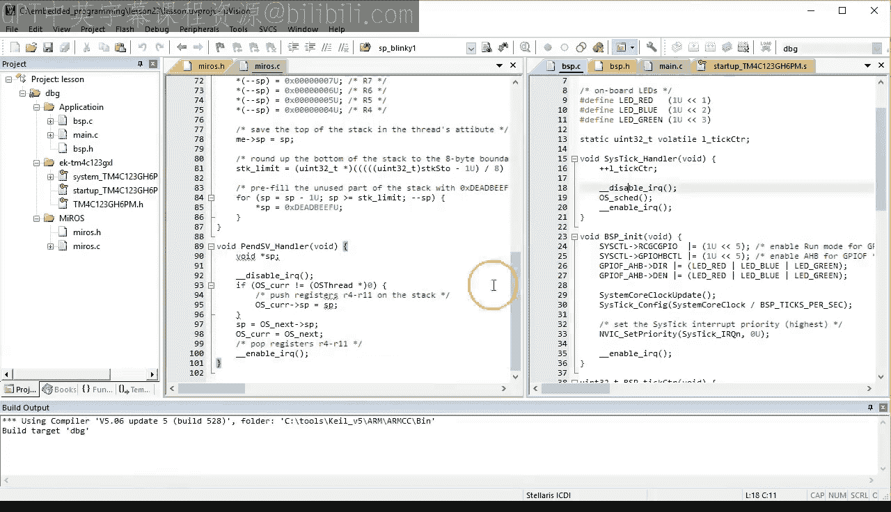

🎼Yeah。First， step over BSP in it and OS in it and verify that the priorities of cyststic and pens V are0。

 the highest level， and E0， the lowest level respectively。Next。

 set the breakpoint in your cystic handler and run the code。When the breakpoint is hit。

 verify that interrupts are being disabled with the CP IDI instruction。

Keep stepping through the code into OS SCD。And once inside OSC。

 update the watch1 view to see the OSs curve and OSs next pointers， which are both0 at this point。

 manually set the OSs next pointer to the address of Blinky1 object from main do C。

This simulates scheduling a blinky one thread to run next。In the call stack view。

 verify that OS SCd is called from cyststic， which is preempting main。

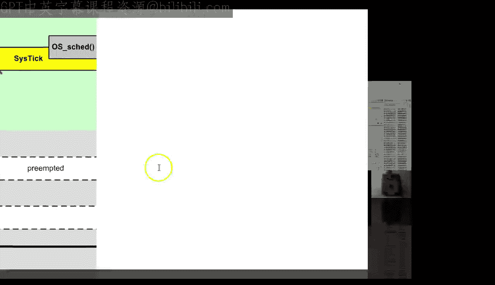

Step out of OScaD Dsistic and verify that interrupts are getting reenabled with the CPIe I instruction。

 Next， set a breakpoint in your pandas V handler and run the code。 The breakpoint is hit。

 which means that OScaD has triggered pandas V。Also。

 verify that pans V is now directly preempting main， so your mechanism is working。

At this point you might be concerned about the combined overhead of exiting one interrupt cysttic in this case and entering another。

 the peniceV exception here， After all， typically an interrupt exit involves popping the eight registers from the stack and an interrupt entry typically involves pushing eight registers on the stack。

But in this case of back to back interrupt processing。

 the Arcortex M core skips the popping and pushing registers in the hardware optimization calledT chaining。

So the overhead is comparable to a simple function call。So finally。

 you reach PsV with the contemporary code ready for stealing from the disassembly view。

You select all the machine code forendice V。Exit the debugger。

And paste the code into your appendice V handler， This is the starting point for your final code in assembly。

The first thing you need to change is to tell the compiler that the code inside the appendix V handler function will be in assembly rather than in C。

 the K compiler version 5 supports the underscore underscore ASM extended keyword applied to a function。

Obviously this is a non standard extension to the C language and you would need to do this differently in other embedded C compilers。

 but many will actually allow you to write the whole function in assembly。Next。

 you delete the C code。🎼M。And you turn the next C statements from the disassembly into comments。🎼。🎼。

Now let's go through the code one instruction at a time。First。

 let me quickly explain that dis assembly。The first hex number is the address in the code memory。

 The next number is the actual machine instruction up code also in hexadecimal。

 This is followed by a human readableneing of the instruction， followed by its parameters。

🎼In the assembly language， you only need the mnemonic and parameters。

 so you need to delete the address and the up code as I do for the disabling interrupts instruction。

🎼う。The comment about pushing the registers is misaligned because the disassembler had apparently no idea that the comment represents an instruction。

 You skip it for now because first you need to code the if statement which checks the OS curve pointer against0。

Here you can see that R1 is loaded with a PC relative constant from the code memory。

 According to the C code， this must be the address of the OS curve variable for which the assembly language provides a special idiom equals variable name。

You might want to remember the address of the OS curve constant， which is Hex 5E8。

 because it will repeat a couple of times later in the code。Next， R1 is loaded again。

 but this time with the value of OS curve and the CBC branch instruction branches to the given code address。

 if R1 is0， you can search for the destination address of the branch and sure enough youll find it downstream。

You need to place there an assembly label I chose the name penice for restore because that's the place in the code where you will start restoring the context of the next thread。

You copy and paste the label into the CC instruction。

So now you have a better understanding of the code structure。

 specifically if the OS curve pointer is not0， the CBC instruction will not branch。

 So here is the place for the body of the if statement。

 The first thing here is to push the registers R4 through R 11 onto the stack Cortex M actually provides an instruction for it。

 which is simply push R4 minus R 11 in curly braces。 This wasn't that difficult， Was it。Next。

 you need to store the stack pointer into the private SP member of the OS curve structure。

This is accomplished in these three instructions， except instead of the fake SP that the compiler apparently allocated in R0。

 you use the real SP register。Here you restore the context of the next thread。

 you load the address of OS next into R1 and you load again the value of OS next into R1 Finally you load the value of the private SP member from OS next structure into R0。

 which you replaced again with the real SP。Again， the comment about popping the regiistars is misaligned。

 so you move it to the right place。These four instructions assign OS next to OS curve。

 you load the addresses and values again and finally you store the value of OS next at the address of OS curve。

🎼Yeah。🎼うん。Yeah。Now is the time to pop the Regs R4 through our 11 from the next threads stack。

 which you called similarly as the push instruction earlier。

The reenabling of interrupts can be left as is， and the return from the pens V handler function can be left as is。

This is the end of the function， so let's try to build it。Oops。

 the does not compile because the asmbler apparently does not recognize the OS curve and OS next symbols。

You can fix it by providing the explicit import assembly directives like this。

Now the code compiles and links clearly。But before running it。

 I still like to improve the comments and overall readability of the code。

Of course as you go over this version you can see a lot of repetitions and opportunities for improvement such optimization would make a lot of sense because a context switch code like this executes quite frequently。

 but let's leave this to the next lesson and finish today by testing the code in the debugger。🎼。🎼気持ち。

Make sure that you have a breakpoint in your cyst handler and run the program。

Once you hit the breakpoint， step inside the OS scheduler。

🎼Leave a breakpoint here and perform manual scheduling by setting the OS next pointer to the address of the By1 thread。

🎼う。Make sure that you have a breakpoint in Pans V handler Asmbler code and continue running。

Let's step through your as code， one instruction at a time to admire your creation。

 The first time through the value of OS curve in R1 is 0。So the CBZ branch is taken， perfect。

The SP register loaded from the OS next pointer seems reasonable。

 so let's scroll the memory view to that SP。🎼，🎼The。🎼The stack content seems correct。

Here you set OS curve to OS next， and as you can see in the watch1 view， OS curve gets updated。

Now you pop the registers and the registers R4 through R 11 look exactly as you prepared them in the OS Th Start function。

The P instruction has obviously changed the S， so you scroll your memory view to the new top of stack。

And finally， you re enableable interrupts， and you are about to return from Pansv。

 You step into the Px LR instruction and。Ohoops， instead of returning to the blinky one thread。

 you end up in the Hartford handler。 This is not good。We have a bug。

But don't panic and keep you cool。 It's time for some real debugging。

It seems that everything was going just fine up to the return from the penice V handler。

 so let's just reset the CPU and quickly repeat the steps up to that point。🎼う。

So here we are again at the BXLR instruction。Now let's think how this return instruction can fail。

Well， the first reason could be the incorrect value of the LR register。But it is Hex F S，F F， F F 9。

 which is fine。 I explained this particular value back in lesson 18， interrupts part 3。

So the next reason for a failed return can only be an incorrect value for the PC register on this stack。

 so let's have a look。Indeed， the value to be restored into the PC starts with hex 2。

This is obviously a Ram address and not an address of any code in Rome。 This is very suspect。

So let's check the code that has generated this stack content。

 which is your OS thread start function， specifically the value for the PC is prepared in this line of code。

I wonder if you can see the bug。 Yes， the thread handle parameter already is a pointer to function。

 So taking an address of it with the Emperserson operator is wrong。 So this is the bug。

And let's fix it。Ait the debugger。🎼。And rebuild the code。Obviously。

 now you need to retest the whole thing again。

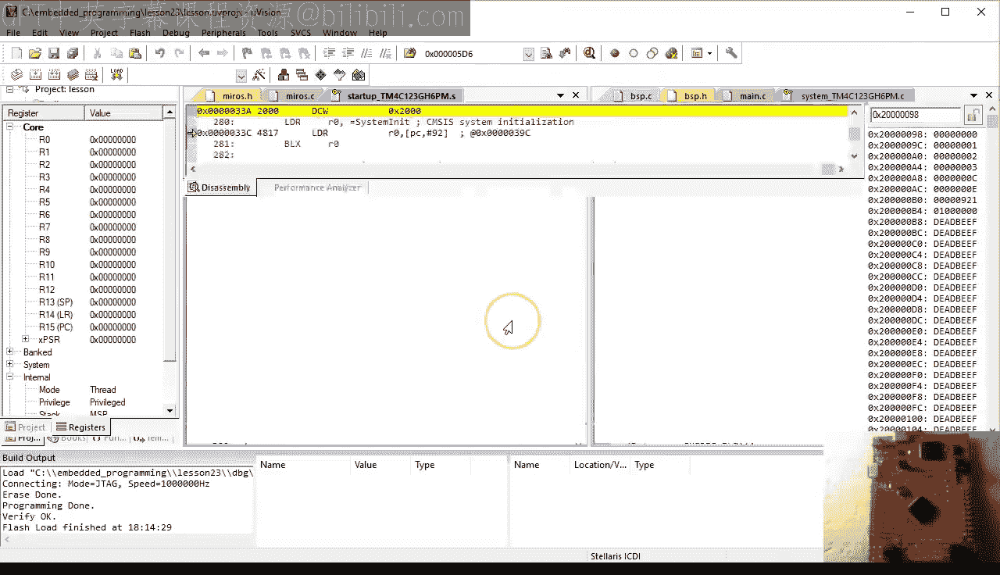

🎼う。Run the code to O Scad and manually schedule Blinky one thread to run next。

Continue until the BXLR return from Pdas V。Check the stack content and specifically the value to be restored into the PC register。

This is definitely an address in Rome， so it makes much more sense now。🎼Okay。

 so let's take the plunge and execute the DxLR instruction。🎼And。What do you know。

 You end up inside the main Blinky one function。 So you are starting the blinky one thread。

When you continue， you obviously hit the breakpoint inside the scheduler again。

 but notice that the green LED has turned on on your launchpa board。

Let's remove the breakpoint from OSKD and let the code run free for a while。As you can see。

 the green LED is blinking， which means that your blinky one thread is now running。

Restore the brakement in OS SCD。And manually schedule your blinky tool thread。

🎼Rrun the code to the end of pans V and quickly verify the stack content of the Blinky2 thread now。

Step over the BXLR instruction and verify that you switched the context to blinky too。

🎼When you stop inside the scheduler， notice that now the blue LED is on。

 let the program run free for a while and watch the blue LED blink。

 which means that your blinky2 thread is now active。Of course。

 you can repeat the contact switch between Blinky1 and Blinky2 as many times as you like。🎼楚出。🎼。🎼心情。

This concludes this lesson about automating the context switch The scheduling is still performed manually。

 but the next lesson will automate the scheduling as well。

 specifically you will extend the Mis arts with the simplest scheduling policy called roundund Robbin that way you will implement a time sharing system on your launchpa board。

If you like this channel， please subscribe to stay tuned you can also visit statemachine。

com/quistart for the class notess and project file downloads。

