# Quantum Leaps《现代嵌入式系统编程Modern Embedded Systems Programming》中英字幕 p29 -29-#28 RTOS Part-7_ Mutual exclusion mechanisms.zh_en -BV1fRt2efEms_p29-

Welcome to the Moern Emmbded System Program course。

 My name is Miro Samak and in the seventh lesson on Arts。

 I'll talk about sharing of resources among concurrent threads and about the arts mechanisms for protecting such shared resources。

As usual， let's get started by making a copy of the previous lesson 27 directory。

🎼Then renaming it till lesson 28。Get inside the new lesson 28 directory。

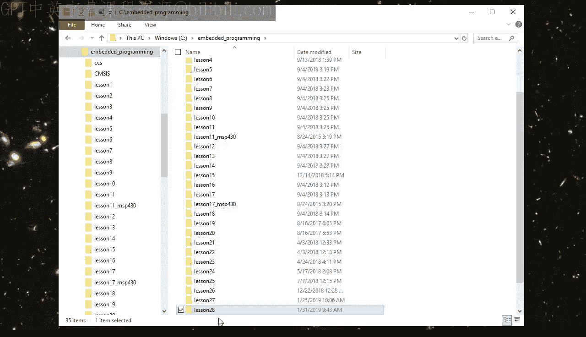

And double click on the microvision project lesson to open it。

To remind you quickly what happened so far， in the last lesson。

 you ported your blinky threads to the professional grade QPC framework with the QXK Arts kernel。

 which provides a whole assortment of interthread communication mechanisms。

The first such artists mechanism you learned about was the semaphore that you applied to synchronize your blinky2th thread。

🎼With pressing of the SW1 switch on your TVva C launchunchpad board。But still。

 the threads in your applications don't yet interact with each other。

 whereas in any real life program， the threads need to communicate。

 coordinate and otherwise collaborate。The simplest and most often used way for threads to interact with each other is to share variables。

 functions and other resources like the various peripheral devices。

Please note that such sharing of variables and hardware registers among Artto threads is allowed in the Arts in the sense that the art does nothing to prevent it。

This is unlike in the big desktop or server style operating systems such as Windows or Linux。

 where different processes cannot easily share variables and memory mapped registers because they run in separate address spaces。

In contrast， concurrent threads within an arts are very lightweight and all run in the same address space。

In fact， the C compiler is completely unaware of the context which magic and the changes to the stack pointer that happen under the covers。

Therefore， the compiler treats the thread functions the same way as all other functions in the program。

 so they can access any variables and all other memory and hardware registers that are visible to them。

However， every instance of sharing of anything among concurrent threads is equivalent to threads crossing their paths in various ways。

Therefore， as in real life， sharing always poses a threat of conflicts and collisions。

 which now you have to avert by introducing some mechanisms and rules to make sure that only one thread uses the shared resource at any given time。

In programming， these mechanisms are collectively called mutual exclusion mechanisms because their goal is to ensure mutually exclusive access to shared resources。

In today's lesson， you will learn about the most important mutual exclusion mechanisms commonly offered by modern arttoes。

So let's start today by introducing some sharing of resources among your blinky threads to first see the problems such She might cause。

Actually， let's use today exactly the same form of sharing of the GPAO registers that you already saw in lesson 20 about race conditions。

In that lesson， you use the GPIOF data register， which combines all eight GPIO bits in one register that becomes then a shared resource。

For example， to implement the LED toggle operation， you can read the GPIOF data register。

 exclusively or it with a desired bit like LED Blue in this case。

 and write it back to GIOF data registerister。This operation can be written more succinctly with the X or equals operator as follows。

🎼You can now repeat the same operation for the green LED as well。🎼う。

The critical difference between the LED on LED off and LED toggle operations is that the on off operations use different registers。

 while the toggle operations use the same GPIOF data register。

 This introduces sharing of the data register between any threads that would call the toggle operations。

So now after adding the prototypes of the LED toggle operations to the BSP header file。

 let's use them instead of the LED on off operations inside the ob blinky threads。🎼。Note， however。

 that now there is only one change of the LED state in the full loop。

 which is a bit faster than two changes on and off previously， therefore。

 to achieve similar CPUU utilization as before， you need to increase the number of the loop iterations。

My testing that I did ahead of time shows that 1900 iterations is about right。

But speaking of the number of iterations， if you consider the state of the LED after the whole for loop。

 it will remain the same after an even number of toggles and will switch after an odd number of toggles。

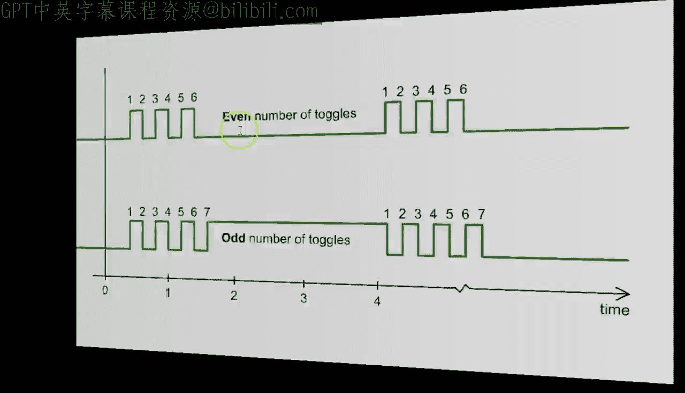

For what you want to observe in this lesson， it is better to switch the state of the LED after each for loop。

 So let's use explicitly an odd number of toggles。By the way。

 an expression like this is evaluated at compile time and is equivalent to writing the P sumalm together as 1901。

 but the explicit plus1 better documents the intent of using an odd number。So let's build a software。

🎼う。Louded into your board。

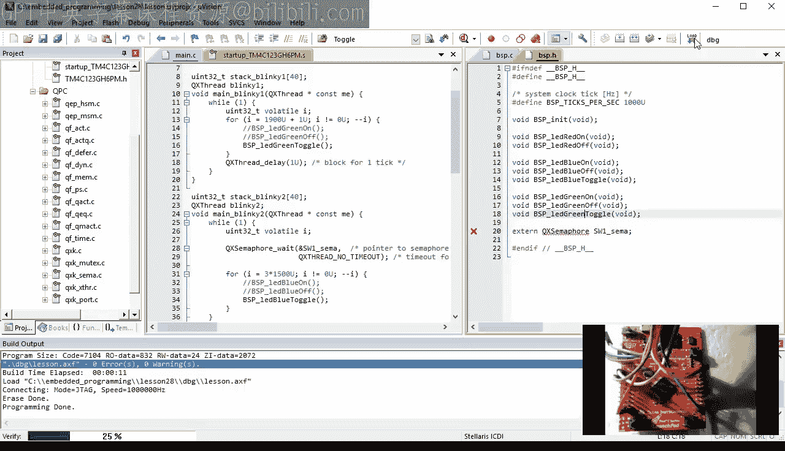

And opened the logic analyzer。The monitor traces are as follows。

 starting from the highest priority at the top。 The state of the SW1 switch。

 which triggers the G of interrupt when the switch is depressed。 This interrupt， in turn。

 signals the semaphore inside the blinky2 thread， the highest priority blinky1 thread that toggles the green LED。

 The lower priority blinky2 thread that toggles the blue LED。

 The lowest priority idle thread that switches the red LED on and off。

The logic analysis trigger is set to the falling edge of the SW1 signal because the switch is active low with this trigger。

 When I start collecting data， nothing happens until I press the Sw1 switch。

 When the switch is pressed， the Blinky 2 thread starts running。

 but because Blinky1 has higher priority， Blinky2 gets preempted every 2 milliseconds for Blinky1 to run。

 Now， let's examine a bit closer。 the blinklinky1 thread。As you can see， indeed。

 it changes the state of the green LED after every period of activity。But sometimes not always。

 And only when Blinky 2 is running as well， the state of the greenel does not change。For instance。

 here， you would expect the green LED to toggle from off to on， but it apparently isn't。Well。

 let's examine the trace closer at this exact point。So when you zoom in。

 you can see that actually the blinky 1 thread has changed the state of the green L as expected。

 but when the blinky 2 thread resumed after being preempted by blinky one。

 the state of the green L changed again。Moreover， if you keep zooming in all the way to the nanosecond level。

 you can see that the change of the green LED and the blue LED are always simultaneous。

This is a telltale sign of both LEDs being changed in the same CPU instruction。

 which was explained in detail in lesson 20 about race conditions。

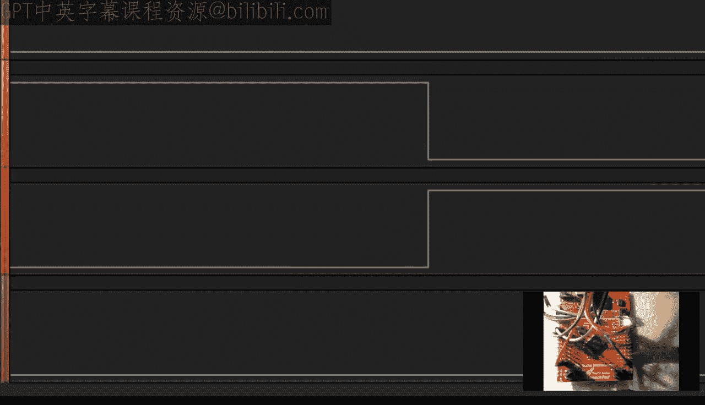

More specifically， the low priority Blinky2 thread must have been preempted by the Cysic interrupt after it read the GIOF data register。

 but before it could write it back in the meantime the Cysec scheduled Blinky one which ran and toggled the green L when the Blinky2 resumed it finally wrote the value into the data register but this was an outdated value so it inadvertently switched both its own blue LED and the blinky ones green L。

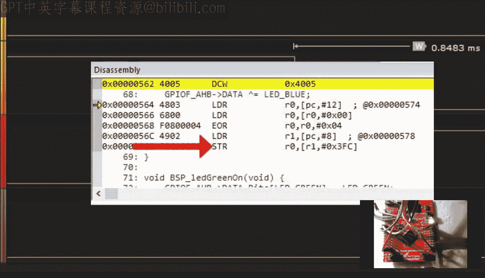

The relevance of all this for today is that race conditions can happen not only between the main code and interrupts as it was the case in lesson 20。

 but also and actually even more so between any two concurrent threads in the preemptive Arts kernel。

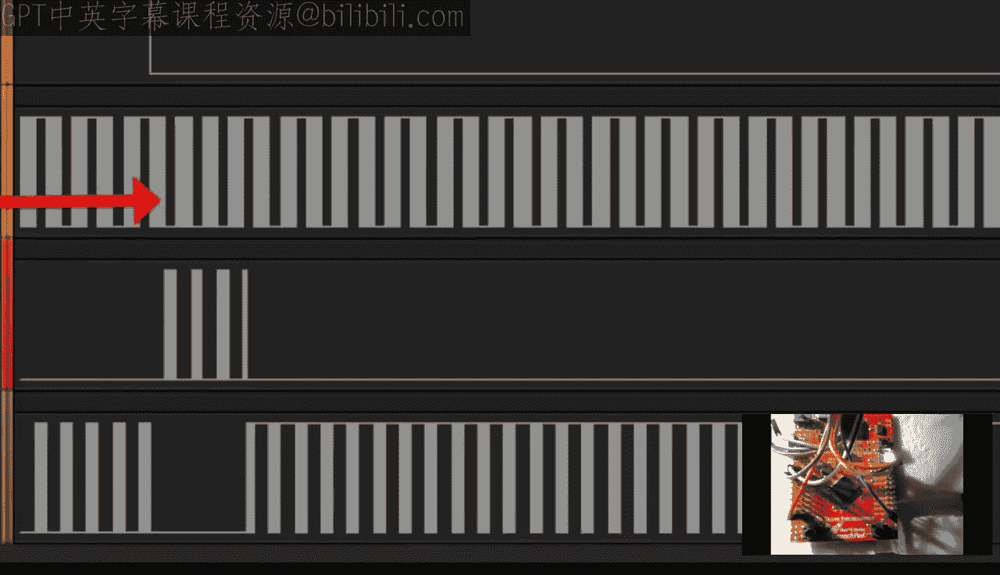

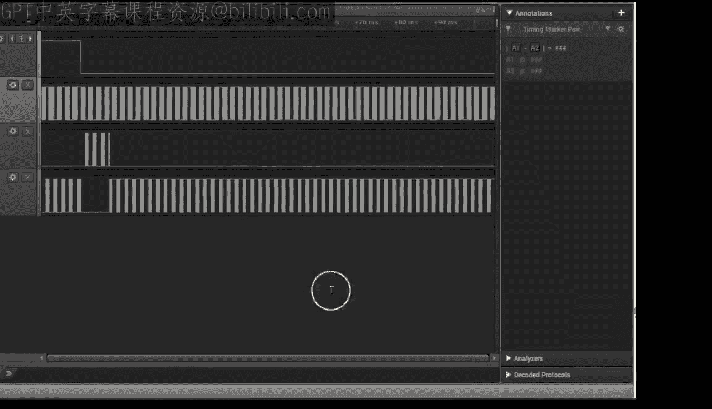

The first mechanism for avoiding such race conditions is simply disabling interrupts around the code that touches the shared resource。

 as already explained in lesson 20。This works in Arts as well because disabling interrupts cuts off the CPU completely from the external world。

 so preemption cannot happen。But the simplistic， unconditional interrupt disabling and enabling around the critical section of code。

 like you did in lesson 20， has at least two drawbacks。First。

 it is inconsistent with the interrupt disabling policy of the arts。

 as explained in the last lesson 27， the QXK Arts kernel implements the zero latency policy by disabling interrupts selectively only up to a certain level of interrupt priority。

 The simplistic critical section disables all interrupts indiscriminately and thus introduces additional latency for interrupts that should never be disabled。

And second， sometimes you might need to nest critical sections。 For example。

 if you hide a critical section inside the function call and then call this function also from a critical section established already。

If your critical section is not designed to nest， you will re enableable interrupt prematurely and you might create a race condition in the piece of code that should be protected by a critical section。

 but isn't。The QXK kernel provides a critical section mechanism that is both consistent with the zero latency interrupt disabling policy。

 and that allows critical sections to nest。The QXK critical section is implemented as follows。 First。

 you need to define an automatic variable which will remember the interrupt disabledable status。Next。

 you call the QF critical entry macro that takes this variable as a parameter。

 This macro will first read the current interrupt disabled status and save it into the provided variable。

 and only after that it will disable interrupts。At the end of the critical section。

 you call the QF critical Exit macro， which will restore the Sa interrupt Disable status from the provided I status parameter。

This critical section can nest because it saves and restores the original interrupt disabled status。

But for now， I simply delete a redundant simplistic critical section from the By thread。

And I also add the critical section to the other toggle function for the blue LED。🎼住。As you can see。

 the code builds without errors or warnings。

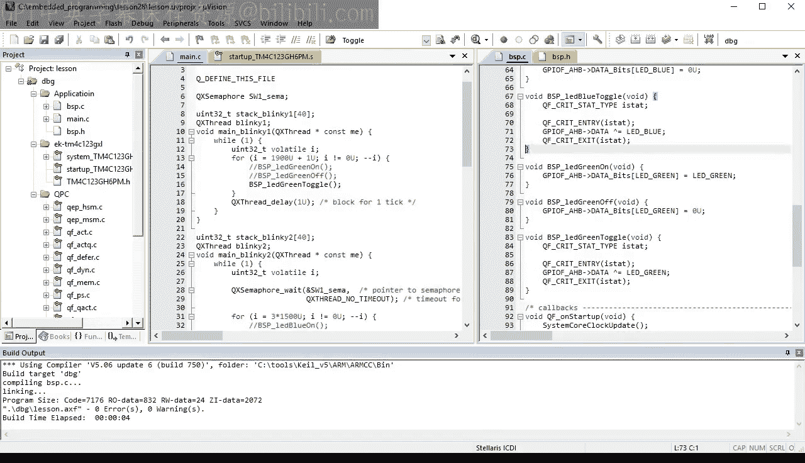

So let's load it into the board。🎼And open the en logicic Anar。🎼你。

The first obvious difference you see from the previous run is that the Blinky one thread utilizes more CPU。

 which is due to the additional overhead of the critical section inside the LED toggle functions。

But now the blinky one thread always switches the state of the green LED as expected。

No matter how many times you try， now you cannot find the green LED being toggled incorrectly。

Of course， testing like this cannot prove that there are no more bugs。

 but the race condition seems to be eliminated。

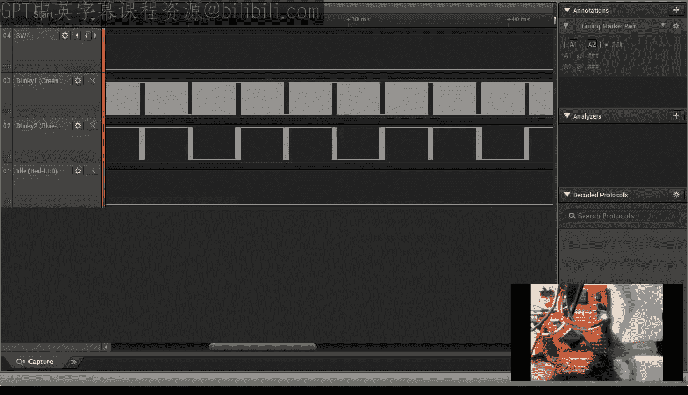

🎼In summary， criticalical section is a very powerful mutual exclusion mechanism that the art itself uses to protect its own internal variables from race conditions。

You can use it as well， but exactly because the mechanism is so powerful。

 it is applicable only to very short sections of code。

 anything that takes more than a few microseconds， meaning only a handful of machine instructions is just too long and can increase the interlatency in your system。

😊，So let's move on to a situation where sharing of the resource would last hundreds of microseconds。

 which is way too long to use the critical section mutual exclusion mechanism。As an example。

 imagine that you need to send messages in Morse code by means of blinking the green LED。

The Morse code consists of dots and dashes， whereas the duration of a dot is the fundamental unit of time and needs to be about 40 microseconds to make it interesting for today。

A dash is 3 dot times。 The space between parts of the same letter is a dot time。

 The space between letters are 3 dot times， and finally the space between the words is 7 dot times。

Your software will be sending two types of messages。

 an urgent SOOS distress code which needs to come out at least once in every2 millisecond interval and a low priority test message that needs to come out twice about every5 milliseconds when the system has nothing else to do。

The picture suggests also the implementation， a message to send will be encoded in a bit mask where each bit represents one dot time unit。

 Here are the examples of encoding the Ss word and the test word with the right pause within the letters and between the letters。

As you remember from lesson1， each group of four bits is called a nibble and can be encoded as one hexadeimmal digit。

 so the whole bit masks can be written like this， The function for modulating the green LED。

 according to the provided Morse code called BSP and Morse code， is implemented as follows。

It takes the message bit mask and examines its most significant bit。 If the bit is one。

 the green LED is turned on。 Otherwise it is turned off。 After this。

 the function busy waits for the dot time to hold the LED state。😊。

Please note that the dot time delay of only about 40 microseconds is way too short to use the efficient blocking As delay function。

 which can delay only for multiples of the system clock tick interval。

 The only option for microsecond time delays is a busy waiting loop。After processing the bit。

 the bitmask is shifted to the left by one bit， and the cycle repeats until the bitm becomes0。

 which means that there are no more letters in the message。Finally， after sending all the letters。

 the function turns the green off and generates the seven dot paths required after the Morse code word。

With this implementation in place。And remembering to add the prototype of the Morse code function to the BSP do H header file。

You can use the function in your threads。The highest priority Blinky one thread will send the urgent SOSOS message after which it will delay itself for one clock tick。

The low urgency test message will be sent by the blinklinky3 thread， which was not used until now。

 This thread will send two test messages one after another and will delay itself for five clock ticks。

The main point of this exercise is that the BSP and Morse code function is now shared between two concurrent threads。

 Blinky 1 and Blinky 3， Please also note that at this point the shared function has no protection from concurrent access because first you need to see what happens without such a protection。

By the way， you obviously still need to start the By 3 thread at some low priority for this exercise you will use priority 1。

 which is lower than By 1 and By 2。So let's rebuild the code。

And loaded to your Tiva Sea launchpaboard。

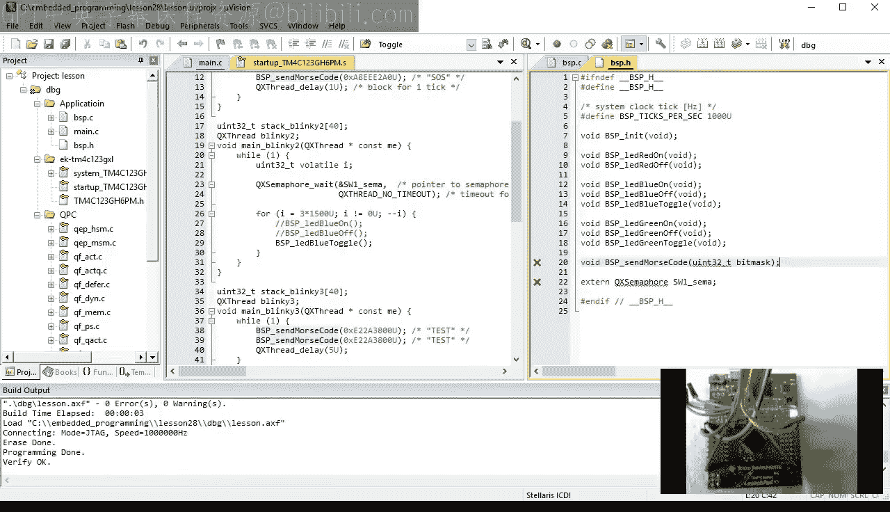

In the logic analyzer view， the trigger is still set up for pressing the SW1 button。

 so nothing gets captured until you press the switch。When you zoom in and watch the green LED traces。

 you can recognize the three dots， three dashes， three dots， S O S message。The message。Comes every。

🎼2 milliseconds。But you can also see places where the green LED blinks with a different pattern。

For instance here， you can recognize the1 dash T。1 dot E。3 dot S。

 but instead of the final1 dash TV from the test message， you can see dash dot dot。

 which happens to make the letter D。This is followed by three dashes， O，3 dots S。 and finally。

 the7 dot pause。All this makes this scramble message Tas Ds， which is neither test nor SOS。

The blink patterns that follow are even more scrambled than that。

 The bottom line is that the messages test and S O S collide and both get damaged in the process。

 As a result， the urgent message S O does not come on time， so it misses its hard real time deadline。

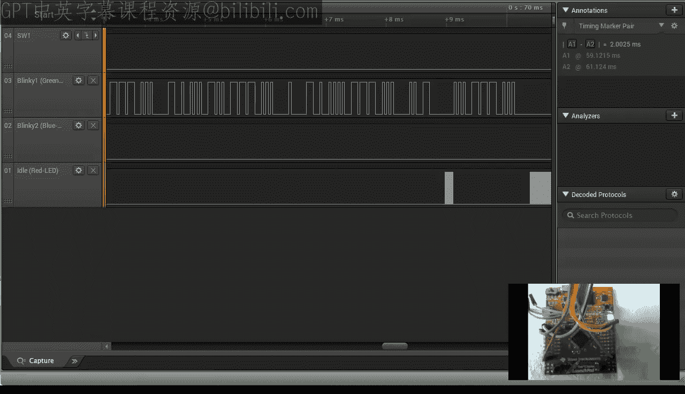

The problem here is obviously that two concurrent threads。

 Blinky 1 and Blinky3 share the green LED without any protection against the conflicts。However。

 because the sharing of the green LED now lasts almost a millisecond， which is 100 microseconds。

 you need to use some other protection mechanism than a critical section。But from the last lesson 27。

 you already know and use a semi4。Which has been invented in the 1960s for both thread synchronization and for mutual exclusion。

So now instead of the take counter that you no longer use。

 you need a new semi for for protecting the Morse code function， which you can name morese Sema。

 and which can also be static because it will only be used inside the BSP。C file scope。

You need to initialize the sepho。Similarly， as the signaling is W1 semapho。

Accepted now you will start with count1， meaning that the resource is initially available。Next。

 before accessing the shared green LED resource， you wait for the semapho to become available。

 This is similar to cars waiting for the green light at an intersection。

After you have done accessing the shared resource， you signal the Sam to make it available for the next time。

🎼Please note that because the Semapho is binary， meaning that it can hold only one token at a time。

 only one thread at a time can be allowed past the Semapho weight function call。

 which is exactly the mutual exclusion you need。

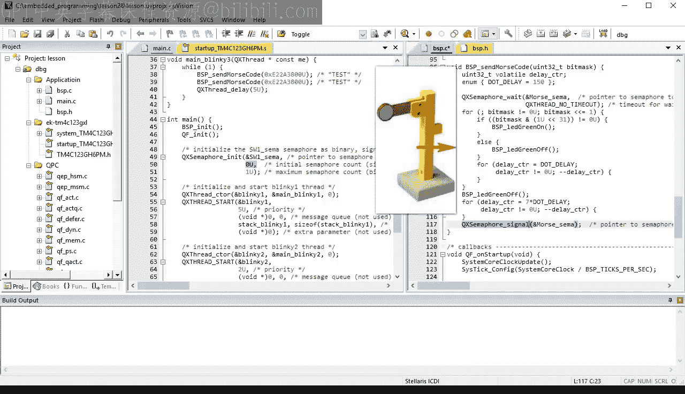

All right， I bet you must be curious how this will work and what kind of a difference the Se will make。

 so let's build the code and load it to the board。🎼The logic analyzer is still set up to trigger on the falling edge of the SW1 signal。

 so nothing happens until they press the button。Once the trace is collected and I zoom in on the green LED signal。

 you can clearly recognize the three dots， three dashes， three dots， SOSOS messages。

You can also recognize the dash dot，3 dots， dash test message。

 which is clearly intact and no longer scrambled。When the test message sneaks in。🎼Yeah。🎼う。う。

The next SOS message gets obviously delayed。But still， it manages to come out before its deadline。

So it seems that you have successfully prevented the conflicts around the green LED shared between the Blinky 1 and Blinky 3 threads。

And indeed， you can try many times。And each time everything looks just fine。Until it doesn't。Here。

 for example， the green LED stops blinking whatsoever。

 apparently for as long as Blinky toe keeps running for over 6 milliseconds。

This means that somehow the highest priority Blinky1 thread is prevented from running by the lower priority Blinky2 thread。

 which runs completely undisturbed。When you examine more closely what happened。

 you can see that the button press happened while the green lady was sending the test message。

 which means that the low priority Blinky3 was in control。 This is all fine。

 but when the next system clocktic and blocked the highest priority Blinky1。

 it blocked immediately on the more semaphore， because the semapho was already taken by the low priority Blinky 3。

This allowed Blinky2 to run for as long as it wanted to。

 while Blinky 1 missed its hard real time deadline。

The problem you just witnessed is called unbounded priority inversion and is a catastrophic failure in a hard real time system。

🎼う。🎼う。

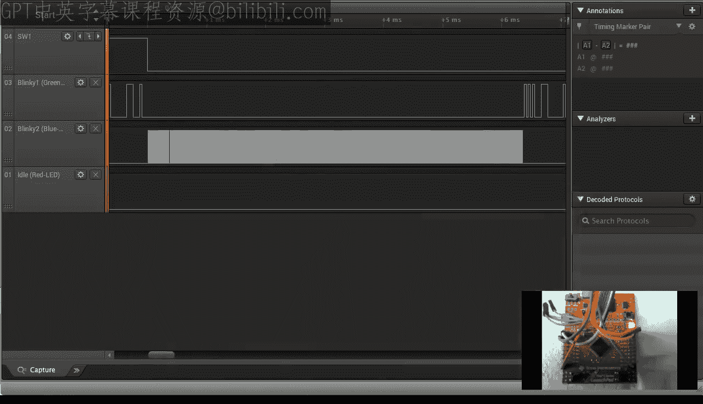

🎼The fundamental issue here is that the semapho is just unaware of the priorities of threats that it blocks。

 so nothing is done to prevent priority inversion from happening。

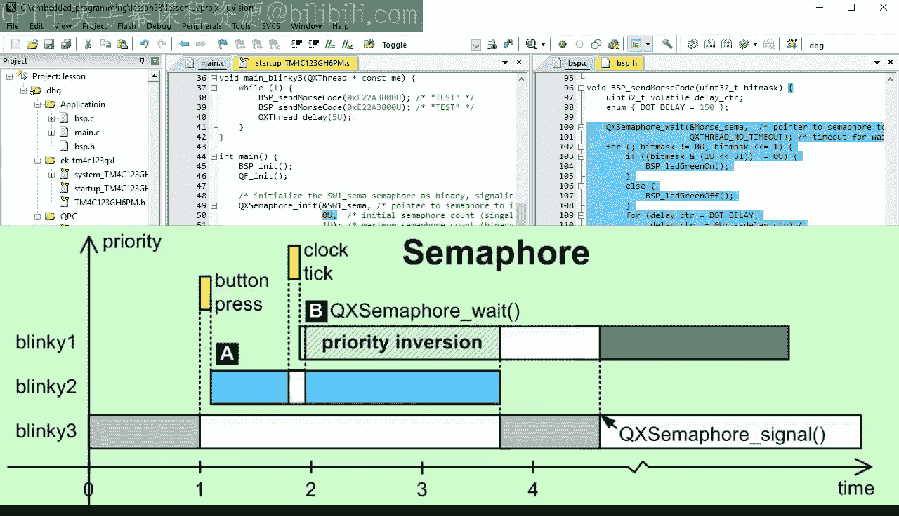

This should be actually not that surprising because semaphos have been invented in the era of time sharing systems where the notion of threat priority was simply not used。

Without the concept of priority， priority inversion cannot happen。

 so it was a known issue until that is， somemaphos were forced to work with priority based arts kernels。

It turns out that the classic semapho， while still applicable to synchronizing threads。

 as you saw in the last lesson， is not a good mechanism for mutual exclusion in priority based systems。

Which brings us to the two modern mutual exclusion mechanisms that I'd still like to cover in this lesson。

 Both of them prevent priority inversion， as well as many other tricky problems， such as deadlock。

The first such mechanism is selective schedule locking up to the specified priority ceiling。

Let's first see how you use it in your application and then Ill explain how it works in the logic analysis view and in a timing diagram。

So here you no longer need the more sa for， but instead of deleting the previous code。

 I will simply comment it out， adding a note about the mechanism being used so that you can later experiment with all the options discussed in this lesson。

The M no longer needs to be initialized。And finally。Instead of the se for weight。🎼。

You call QXK Slock function。The function takes a parameter， which is the priority ceiling。

 The ceiling denotes the level up to which you lock the scheduler。

 meaning that all threads below or equal to the ceiling won't be scheduled。

 but any threads above the ceiling are scheduled as usual。

 Of course the ISRrs that run above all threads are not affected at all。

 so there is no impact on the interrupt latency。From this explanation。

 it should be clear that the ceiling priority must be at least as high as the priority of the highest priority thread that uses the shared resources。

In your case， the highest priority thread is blinky1 with priority of5。

The QX case headlock API can only be invoked from a thread that now takes ownership of the Sch lock。

The function returns the previous status of the Sch lock。

 just like the critical section mechanism return the previous status of interrupt。

Just as before with critical section， district allows the schedule logs to nest， if need be。

And finally， instead of Se4 signal， the thread owning the lock unlocks the scheduler with the QXKca unlock API。

By calling this function， the thread restores the previous Sch log state from the parameter as stat。

Please note that selective schedule locking is a non blocking mutual exclusion mechanism。

 similar as critical section was non blocking， except now you will only prevent scheduling of threads up to the specified priority ceiling。

 while higher priority threads and all interrupts will continue running undisturbed。🎼The。

🎼So now let's see how this works using a logic analyzer。First。

 let's check whether the selective scheduler locking prevents collisions between the SOSOS and test messages。

🎼うんふ。🎼The messages looked intact and don't runt into each other。

 so the mutual exclusion definitely works。🎼嗯。🎼But now you also need to check whether the unbounded priority inversion still occurs。

For that， you need to catch the special case where the button press comes during the test message。

Luckily， this scenario comes up quite quickly。As you can see。

 even though the button has been pressed， the Blinky2 thread。

 which has higher priority than Blinky3 sending the test message， does not preempt to By 3。

Because now it is below the priority ceiling and so it is apparently not scheduled。Instead。

 Blinky 3 sends the test message undisturbed and then Blinky 1 sends the SOOS message only after this。

 Blinky 2 has a chance to run until it is preempted by Blinky 1 again。

The bottom line is that unbounded priority inversion has been prevented。

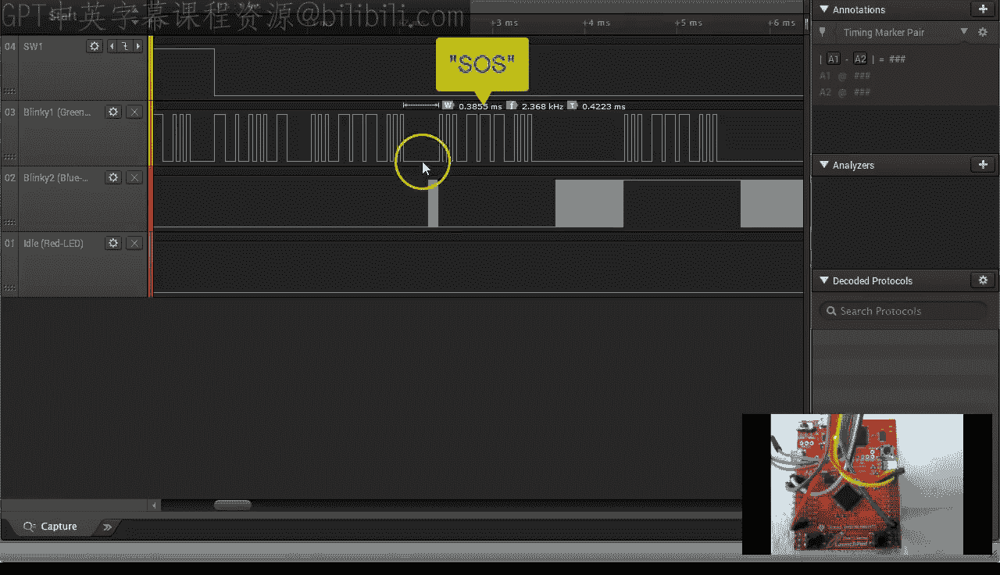

The timing diagram shows the same scenario again for the sapho and selective scheduler locking。

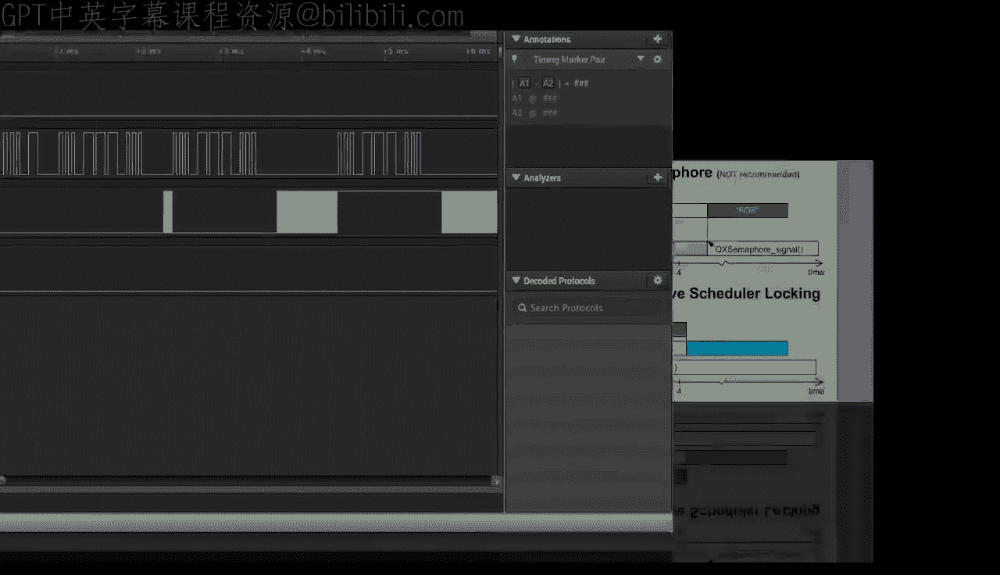

In the case of the classic semaphore， the button press at time A costs scheduling the Blinky2 thread because its priority was higher than the currently running Blinky 3。

At some later time B， the highest priority Blinky 1 was scheduled。

 but it was immediately blocked on the semaphore because the semaphore was already taken by Blinky 3。

 This allowed Blinky 2 to run for as long as it wanted。

 creating the unbounded priority inversion problem。In contrast， in the case of schedule locking。

 the Blinky2 thread was not scheduled at time A because the priority of Blinky2 was below the priority ceiling。

At the later time B， the Blinky1 thread wasn't scheduled either because it too was not above the ceiling。

 only after Blinky 3 finished it released the lock and the scheduler picked the highest priority thread ready to run。

 which happened to be By1。In summary， selective Schully locking is a very effective non blocking mutual exclusion mechanism which prevents unbounded priority inversion。

It is simple to implement inside the arts and therefore is very efficient。

But many arttoes provide only crude schedule locking of all threads。

 which is unfortunately too pervasive。Modern artists kernels， including QXK。

 provide the selective schedule locking only up to the specified priority ceiling。

 This allows higher priority threads which don't participate in the sharing of a given resource to run completely undisturbed。

The only limitation of the selective scheduleul locking is that the thread cannot block while holding the lock。

Blocking while accessing a shared resource such as calling the blocking delay or the Semapho weight APIs is considered the bad practice and should be avoided。

 but still it occasionally happens in real life projects and in that case the QXK will assert if the thread would attempt to block while owning a Sch lock。

Your only option in that case is the last mutual exclusion mechanism that I want to discuss in this lesson called the muttics。

The termmuts is an abbreviation of mutual exclusion and sometimes is also called mutual exclusion semophore。

But I don't want you to think of em muics as a kind of senophore。Instead。

 think of a mutics as an artist's object specifically designed for protecting resources shared among concurrent threads in the most generic case。

 where threads might block while accessing the shared resource。

To demonstrate the use of emotics while keeping things simple。

 I will just replace the Sch lock with emuotics， even though there is no blocking in the protected code。

First， you need to define a mutics object。🎼。Next。The muics object needs to be initialized before it can be used。

The QXK kernel provides the so called priority ceiling mutics。

 which needs to be initialized with the priority ceiling associated with the research to be protected by this mutics。

Similarly， as with the schedule lock， this priority ceiling must be at least as high as the highest priority thread that accesses the shared resource。

However， in Qx K， the ceiling priority must be unique and cannot be the same as priority already used by a thread。

 Therefore， here it will be one level higher than blinky 1。 That is priority 6。🎼う。

This makes a priority ceiling mutics a bit similar to a thread。

 and therefore it must be initialized after the call to the QF init function。

Since the initialization of the mutics happens in BSP in it。

 you need to make sure that it is called after QF in it。

This means that you need to reverse the order of the calls in the main function。Alright。

 so with this setup， you can now apply the mutex to protect the Morse code generation。

The protected section of the code starts with the QX Mutics lock API。

 at which point the thread becomes the owner of the Mutics。

The protection ends with the QX Mutics unlock call。

 at which point the thread relinquishs the ownership of the Mutics。

Their log unlock names in the API for Mutexes have been specifically chosen to be similar to schedule locking and different from the weight signal names in the API for Sephos。

As before with the schedule lock， let's first build and run the code in the logic analyzer and then explain the details with the timing diagram。

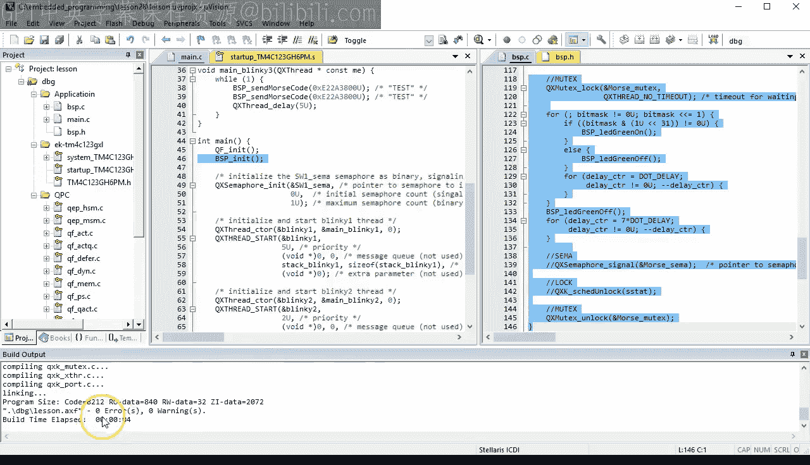

The first order of business is to verify that the Mutics does its job of preventing collisions between the SOOS and test messages。

And so， it apparently does。Next， you need to verify that unbounded priority inversion does not happen for which you need to catch the special case where the button press comes during the test message。

 and so luck it happens right away。As you can see， even in this case。

 the test message comes out intact and the Blinky2 thread does not preempt the low priority By3。

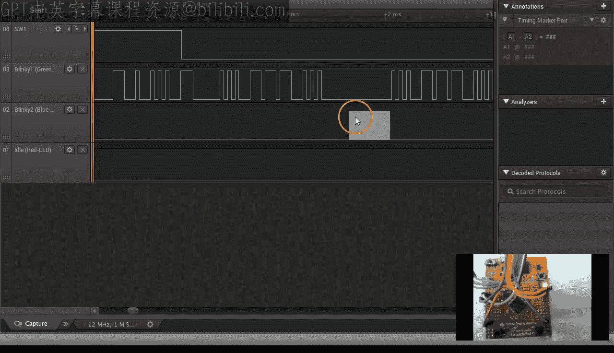

Now let's take a look at the corresponding timing diagrams。First。

 let's compare selective schedule locking to the priority ceiling mus。

The main difference is that at time A， the low priority blinky3 thread is promoted to the ceiling priority of the muticics。

From that time on， Blinky 3 runs at the ceiling priority。

 which protects it from preemption by Blinky2 and even Blinky1。At the end of the day， however。

 just looking at the thread execution because there is no blocking the protected code。

 the timing diagrams for schedule locking and priority ceiling mutics are identical。

The QXK priority ceiling muts that you just saw in action influence the so called priority ceiling protocol。

But this is not the only way of preventing unbounded priority inversion。 In fact。

 most arttois implement muttices with a different strategy called priority inheritance protocol。

So even though I can't show you a working example because QXK does not support priority inheritance。

 I'd like to briefly explain the difference between the two strategies and point out their are respective strengths and weaknesses。

The first difference that you don't see in the timing diagram is that priority inheritance Mutics does not need to be initialized with any particular priority like the ceiling priority。

 because it will adjust thread priorities fully automatically。

This leads to the first difference at time A in the diagram where priority ceiling protocol immediately promotes the thread to the ceiling priority。

 but priority inheritance does not change the thread priority at this point yet。Because of that。

 the medium priority Blinky2 thread preemps By3 immediately after the button press。

The low priority thread is promoted only after the high priority thread starts running and tries to lock the priority inheritance mutics。

 specifically the low priority thread inherits the priority of the high priority contender for the resource。

From that point， the timing diagrams are very similar。

 but because of the initial preemption by the medium priority thread。

 the high priority thread runs and finishes later under the priority inheritance。

 So it runs a higher risk of missing its deadline。

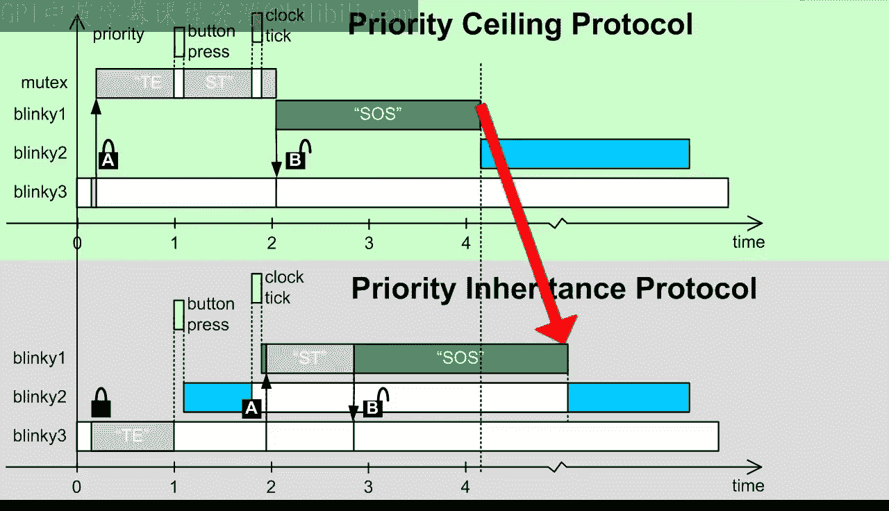

Another big disadvantage of priority inheritance is that it typically leads to many more expensive context switches than priority ceiling。

 For example， in the scenario just discussed， priority ceiling leads to only two context switches while priority inheritance uses four of them。

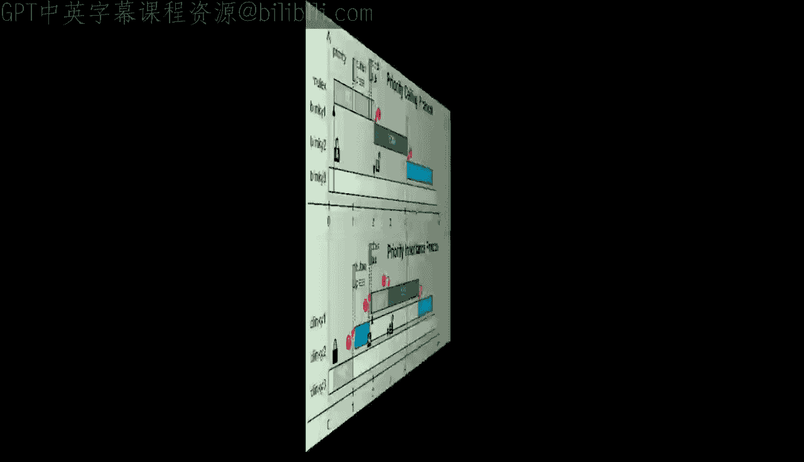

For all these reasons， as well as much simpler timing analysis for hard drill time systems。

 priority ceilinging protocol is the preferred strategy。

 and that's why it is the only one supported in QXK。

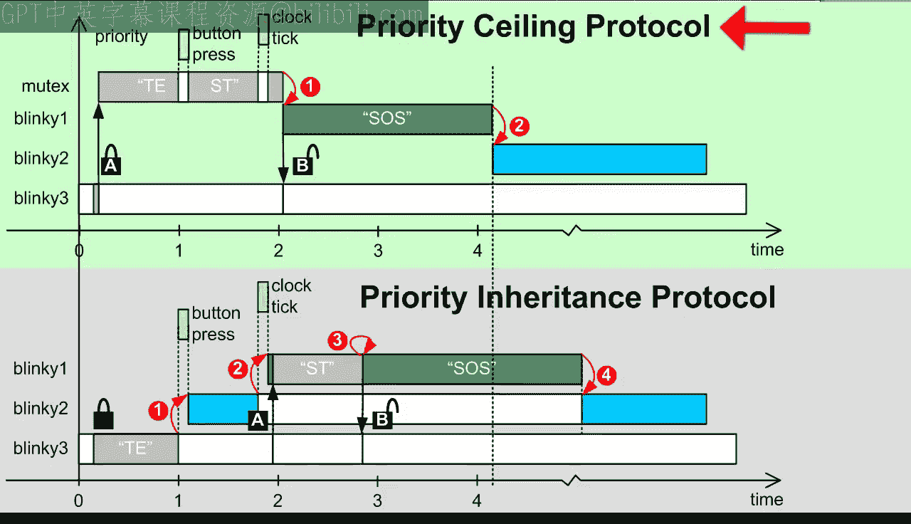

In summary， in this lesson， you learn about sharing of resources and the mutual exclusion mechanisms commonly available inside art's kernels。

 This subject is complex， and this lesson barely scratched the surface of the problems you might run into。

If you want to learn more， the description below this video provides a couple of links to good articles on the subject。

The shared state concurrency programming model based on the traditional preemptivas has been the dominating approach since the 1980s。

 but it has several negative implications。The first order ripple effects of resource sharing are race conditions and collisions in the time domain and data space。

 If left unprotected， these consequences lead directed to a system failure。To avoid such failures。

 traditional artes provide an assortment of mutual exclusion mechanisms to protect the shared resources。

 but each of them lead to their own negative implications。

Most of these second order implications have negative impact on the real time performance of the system and can lead to missed deadlines。

 which again means failure in hard real time systems。

But the shared state concurrency model is no longer the only option on the market。

 The 1990s brought alternative real time software architectures that avoid sharing of resources and thus eliminate the need for complex mutual exclusion mechanisms。

 I will talk about these more modern approaches in the future lessons。

But before jumping into that subject， in the next lesson。

 I still need to talk about the very important development that happened during the 1980s。

 which is object oriented programming。If you like this channel， please subscribe to stay tuned。

 you can also visit statemachine。com/quistart for the class notess and project file downloads。

