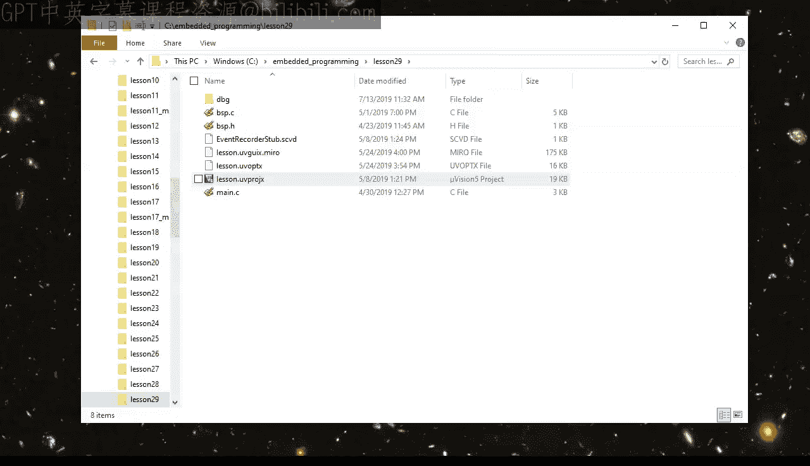
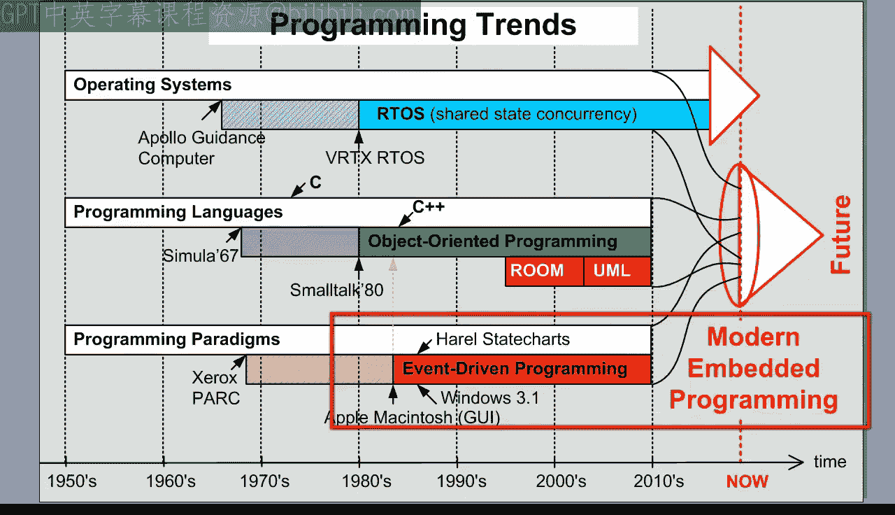
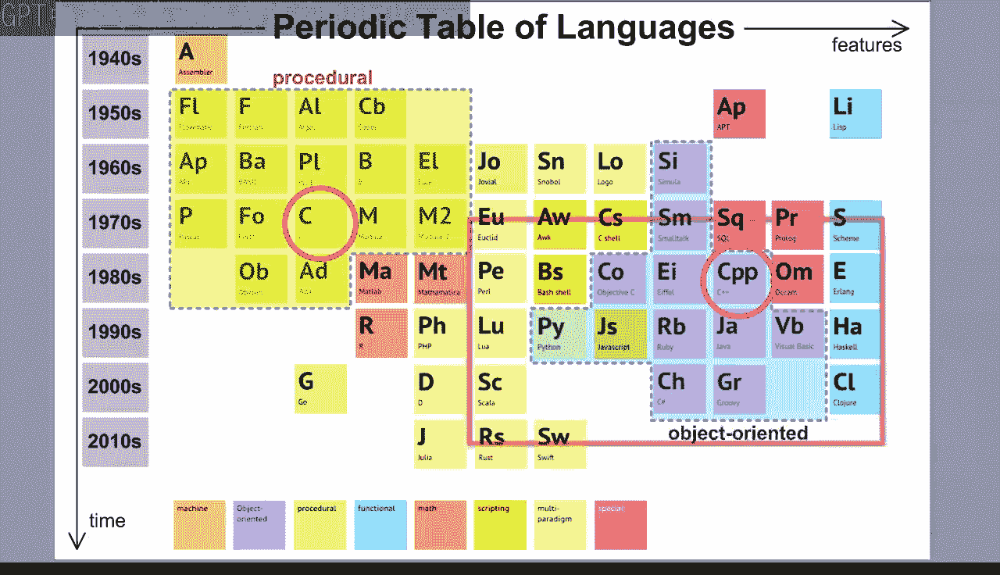
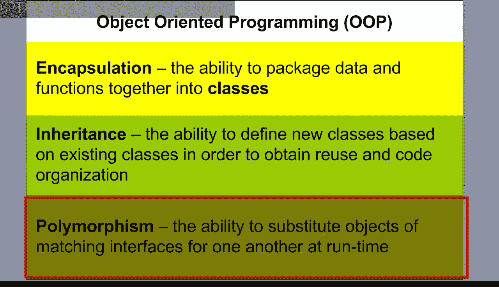
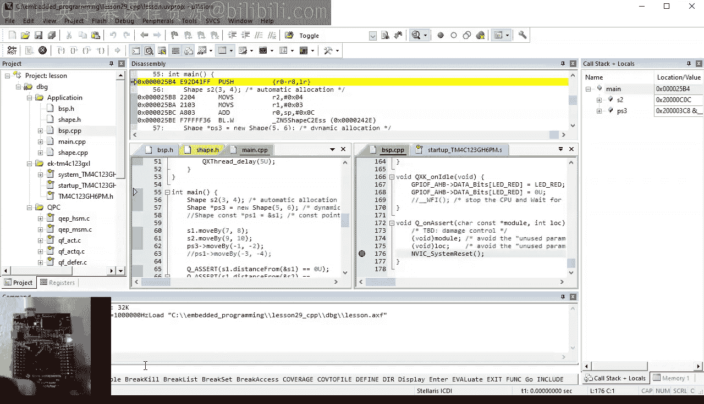
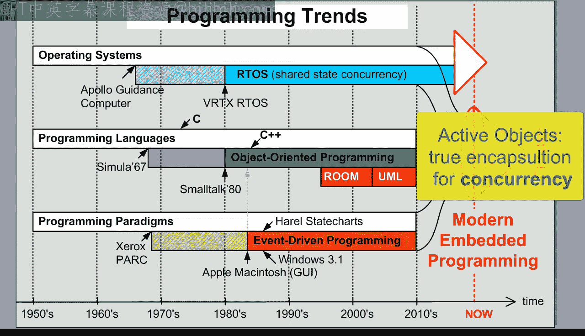
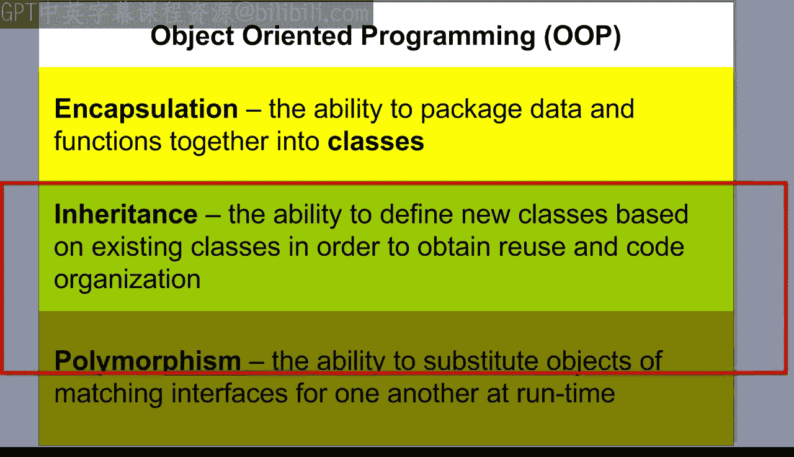
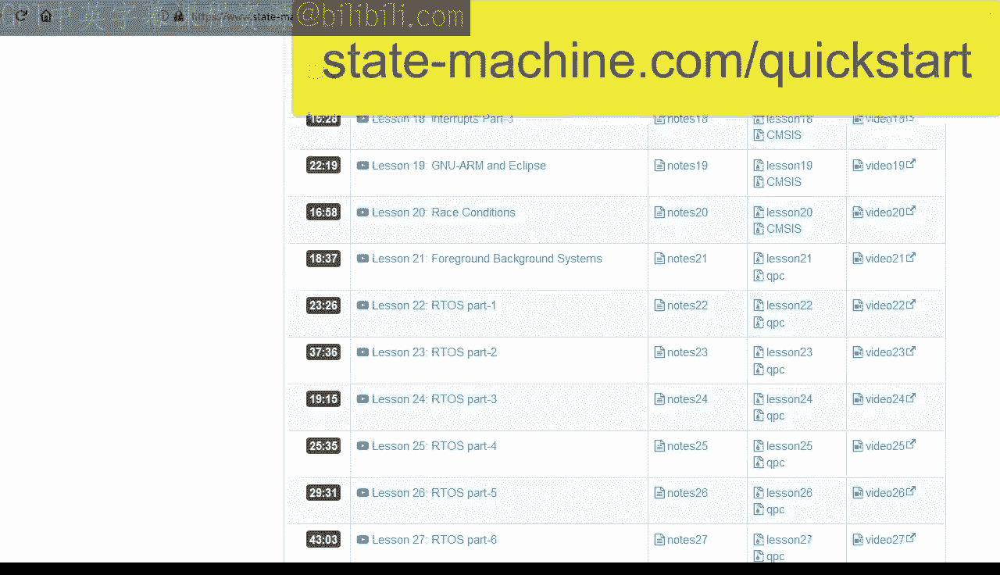

# 现代嵌入式系统编程：29：面向对象编程第一部分 - C与C++中的封装（类）




在本节课中，我们将要学习面向对象编程的基础概念，特别是**封装**。我们将了解如何在不使用特定面向对象语言的情况下，通过C语言实现类的概念，并最终将其与C++中的原生类实现进行对比。通过这种方式，你将理解封装的核心思想及其在底层是如何工作的。

---







## 概述

面向对象编程是现代软件开发的重要基石。许多人认为它必须使用C++、Java或Python等语言，但实际上，OOP是一种基于**封装**、**继承**和**多态**三大概念的软件设计方法。本节课，我们将重点探讨**封装**，并学习如何在标准C语言中模拟类，以及如何在C++中实现真正的类。

上一节我们回顾了实时操作系统及其基于共享状态的并发编程模型。本节中，我们来看看如何将数据和操作封装到一个实体——类中。

## 封装的概念

封装与信息隐藏和抽象密切相关。你已经在板级支持包的设计中使用过这些概念。例如，在BSP模块中，你将“做什么”（头文件）与“如何做”（实现文件）分离开来，抽象了LED的操作细节，并将具体的实现方式对用户隐藏。

然而，这种基于模块的设计有一个重要限制：它只能处理固定数量的资源（如三个LED），难以轻松扩展以处理数量不定的对象（例如图形界面中的各种形状）。为了解决这个问题，我们需要引入类的概念。

## 在C语言中模拟类

在C语言中，我们可以使用结构体和一组相关的函数来模拟一个类。

以下是创建一个“形状”类接口的步骤：

1.  **定义数据结构**：使用C结构体表示形状的属性，例如屏幕上的位置坐标。
    ```c
    typedef struct {
        int16_t x;
        int16_t y;
    } Shape;
    ```
2.  **定义操作函数**：提供一组专门操作`Shape`结构体的函数。通过编码约定，禁止直接访问结构体成员，所有操作必须通过这些函数进行。
    *   **构造函数**：用于初始化形状对象。
    *   **移动函数**：根据给定的偏移量移动形状。
    *   **距离计算函数**：计算两个形状之间的距离。

    这些函数都遵循两个约定：
    *   函数名以关联的结构体名称为前缀（例如`Shape_ctor`）。
    *   第一个参数是一个指向`Shape`结构体的指针（通常命名为`me`），用于指定函数操作的是哪个具体的形状实例。

    这个`me`指针对应于C++中的隐式`this`指针。

3.  **实现操作函数**：在`.c`文件中实现这些函数的具体逻辑。

通过这种方式，我们创建了一个**类**。类将数据（称为**属性**）和函数（称为**操作**）组合成一个实体。类图可以直观地展示一个类，方框顶部是类名，中间是属性，底部是操作。

类实现了**封装**，因为它只向外部展示操作构成的外壳，而内部数据和实现细节则被封装在壳内。

## 创建和使用对象

类就像饼干模具，可以用来创建任意数量的实例，这些实例称为**对象**。

在C语言中，我们可以通过多种方式创建`Shape`对象：

*   静态分配
*   在函数栈上自动分配
*   在堆上动态分配（使用`malloc`）

创建对象后，必须在使用前调用构造函数进行初始化。之后，就可以通过相应的操作函数来操作这些对象了。

一个良好的类接口设计原则是：**易于正确使用，难以错误使用**。例如，尝试对声明为`const`的`Shape`对象调用修改其状态的`moveBy`操作，编译器会报错。

## 底层机制与调试

在底层，调用类操作（如构造函数）时，`me`指针通常会被放在`R0`寄存器中（遵循ARM AAPCS标准）。在操作函数内部，访问类属性是通过`me`指针的寄存器偏移寻址模式完成的，效率很高。

在调试时，`me`指针（或C++中的`this`指针）通常显示在局部变量窗口的顶部，方便开发者查看当前操作的对象属性。

## 在C++中实现类

C++直接支持类的概念，使得封装更加直观和严格。

将C模拟的类转换为真正的C++类涉及以下步骤：

1.  将`struct`关键字替换为`class`。
2.  使用`private:`和`public:`访问说明符来明确封装数据成员和公开成员函数。
3.  构造函数名与类名相同，且没有返回值。C++会自动调用构造函数。
4.  成员函数不再需要显式的`me`指针参数，编译器会提供隐式的`this`指针。
5.  使用作用域解析运算符`::`来定义类成员函数。
6.  使用构造函数初始化列表来初始化成员变量，这是更地道的C++方式。

在代码中使用C++类时：
*   对象初始化在创建时直接完成（例如 `Shape s1(1, 2);`）。
*   动态对象使用`new`操作符分配，并自动调用构造函数；使用`delete`释放。
*   通过点运算符`.`或箭头运算符`->`来调用成员函数。

尽管语法不同，但C++编译器为这些操作生成的机器代码，与之前C语言模拟版本生成的代码是**完全相同**的。这表明，C++的类机制在底层本质上是一套语法糖和严格的类型检查。

## 封装与并发（RTOS）

封装本身并不能解决并发环境下的数据竞争问题。即使将共享对象（如一个全局的`Shape`对象）封装在类中，当它被多个RTOS线程（一个修改，一个读取）同时访问时，依然会发生**竞态条件**。

这意味着，为了实现真正的并发安全封装，需要超越简单的类，采用**主动对象**设计模式。主动对象模式融合了并发编程、面向对象编程和事件驱动编程，这将在未来的课程中探讨。



---

## 总结







本节课中我们一起学习了面向对象编程的第一个核心概念——**封装**。我们探讨了如何通过结构体和相关函数在C语言中模拟类，并详细对比了在C++中实现真正类的语法和机制。我们看到，尽管语法不同，但两者的底层实现原理是相通的。重要的是，我们理解了封装主要是为了组织代码和隐藏实现细节，它本身并不解决并发访问的同步问题。在接下来的课程中，我们将继续学习面向对象编程的另外两个支柱：**继承**和**多态**。