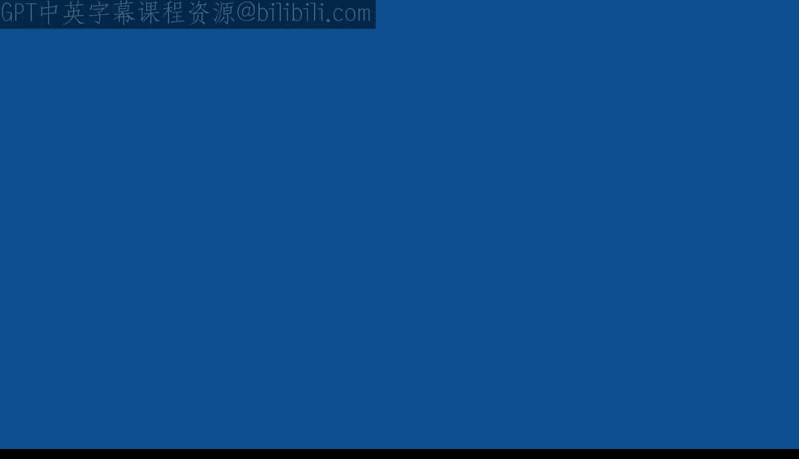
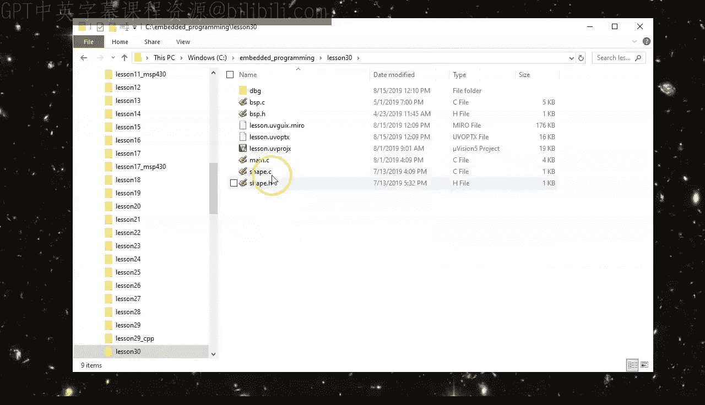
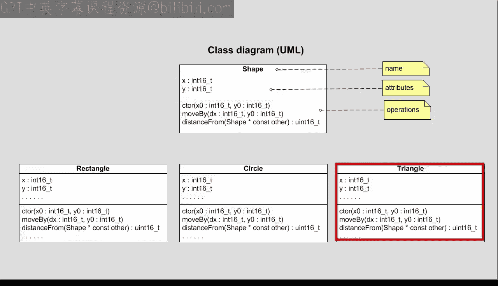
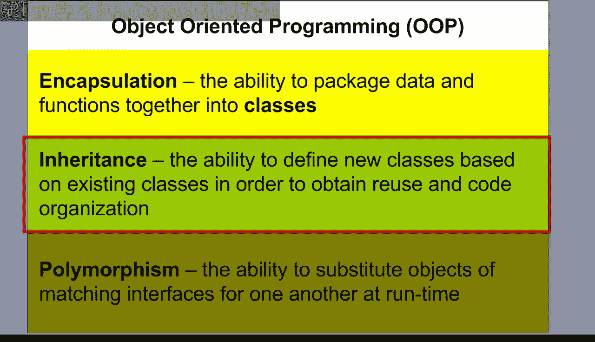
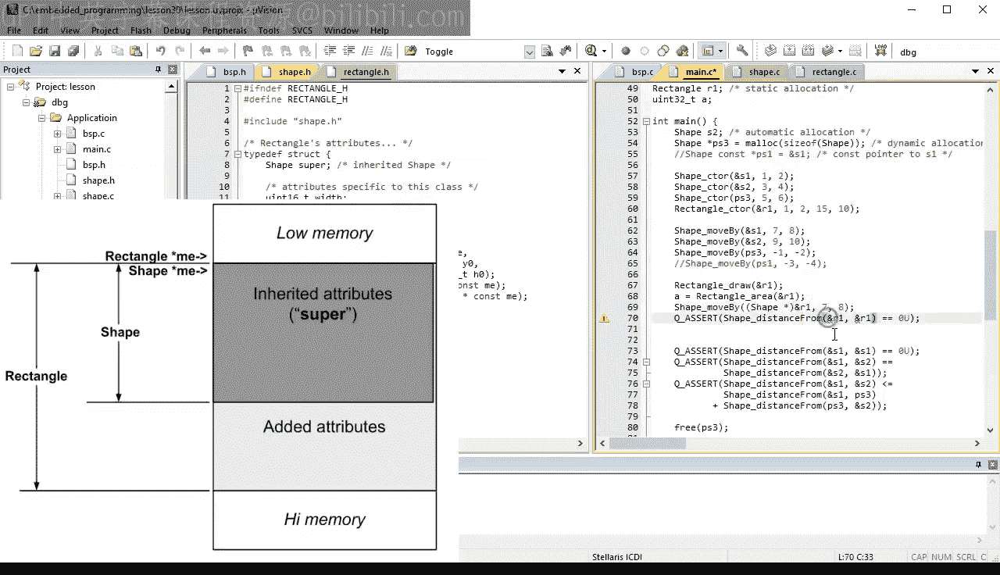
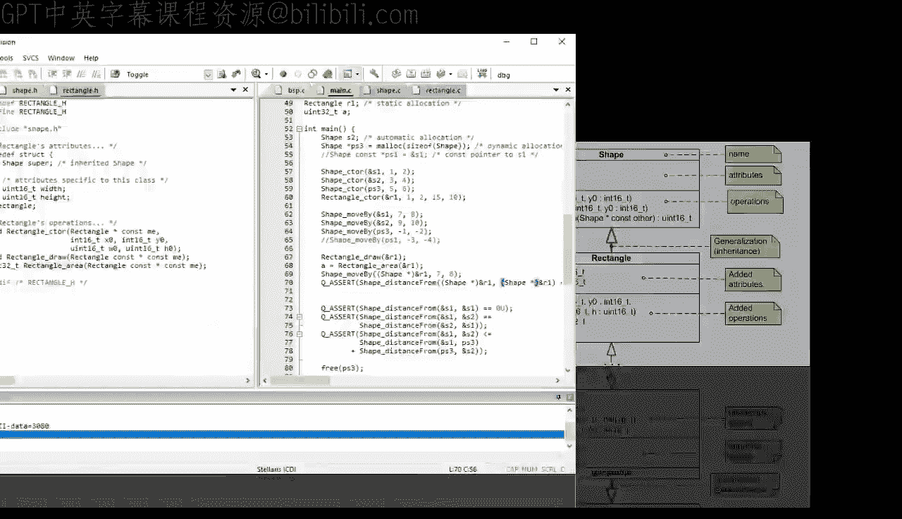
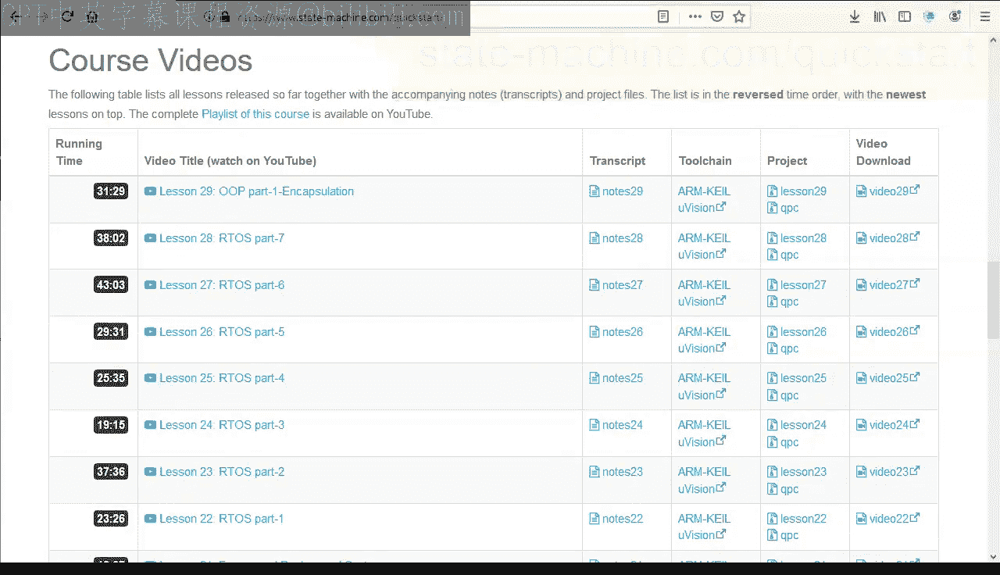

# 现代嵌入式系统编程：第30课：面向对象编程第二部分 - 继承



在本节课中，我们将要学习面向对象编程的第二个核心概念：**继承**。我们将探讨如何在C语言中模拟继承，以及C++语言如何原生支持继承，并理解其背后的内存布局和设计思想。



## 概述

在上一节课中，我们介绍了面向对象编程的第一个概念——**封装**，并实现了表示LCD屏幕上图形的`Shape`类。然而，实际应用中我们需要更具体的图形，如矩形、圆形等。这些具体图形都拥有`Shape`类的通用属性（如位置）和操作（如移动）。为了避免重复代码，我们可以使用**继承**来基于已有的`Shape`类创建新的类。

## 在C语言中模拟继承

以下是实现`Rectangle`类以继承`Shape`类的步骤。



### 1. 创建头文件接口



首先，在`rectangle.h`头文件中定义`Rectangle`类。我们通过将`Shape`结构体作为第一个成员来模拟继承。

```c
#ifndef RECTANGLE_H
#define RECTANGLE_H

#include "shape.h" // 包含基类定义

// Rectangle 属性结构体
typedef struct {
    Shape super; // 继承自 Shape 的成员（按约定命名为 super）
    int16_t width;
    int16_t height;
} Rectangle;

// 构造函数原型
void Rectangle_ctor(Rectangle * const me, int16_t x0, int16_t y0,
                    int16_t w0, int16_t h0);

// Rectangle 特有的操作
void Rectangle_draw(Rectangle const * const me);
uint32_t Rectangle_area(Rectangle const * const me);

#endif // RECTANGLE_H
```

### 2. 实现源文件

接着，在`rectangle.c`源文件中实现这些函数。构造函数需要先初始化基类部分。

```c
#include "rectangle.h"

// Rectangle 构造函数
void Rectangle_ctor(Rectangle * const me, int16_t x0, int16_t y0,
                    int16_t w0, int16_t h0)
{
    // 首先调用基类 Shape 的构造函数
    Shape_ctor(&me->super, x0, y0);
    // 然后初始化 Rectangle 特有的属性
    me->width = w0;
    me->height = h0;
}

// 计算矩形面积
uint32_t Rectangle_area(Rectangle const * const me)
{
    return (uint32_t)me->width * (uint32_t)me->height;
}

// 绘制矩形（此处为伪代码）
void Rectangle_draw(Rectangle const * const me)
{
    // 伪代码：在LCD上绘制水平线和垂直线
    // drawHLine(me->super.x, me->super.y, me->width);
    // drawVLine(me->super.x, me->super.y, me->height);
    // ...
}
```

### 3. 使用Rectangle类

现在，我们可以在主程序中使用`Rectangle`类。由于C语言没有自动向上转型，我们需要显式地将`Rectangle`指针转换为`Shape`指针来调用继承的操作。



```c
#include "rectangle.h"

int main() {
    Rectangle r1;
    // 初始化矩形对象
    Rectangle_ctor(&r1, 10, 20, 30, 40);

    // 调用Rectangle特有的操作
    Rectangle_draw(&r1);
    uint32_t a = Rectangle_area(&r1);

    // 调用从Shape继承的操作（需要显式向上转型）
    Shape_moveBy((Shape *)&r1, 5, 5); // 向上转型
    int16_t d = Shape_distanceFrom((Shape *)&r1, (Shape *)&r1);

    return 0;
}
```



### 4. 内存布局与向上转型

在C语言中，结构体的第一个成员的地址与结构体本身的地址相同。这意味着`Rectangle`结构体的起始地址就是其`super`（`Shape`类型）成员的地址。因此，将`Rectangle*`指针安全地转换为`Shape*`指针是可行的，这种转换称为**向上转型**。

通过调试器查看内存，可以验证`Rectangle`对象的内存布局：首先是`Shape`的成员（`x`, `y`），紧接着是`Rectangle`特有的成员（`width`, `height`）。

## 在C++中实现继承

C++原生支持继承，语法更简洁，并且能自动处理向上转型。

### 1. 定义C++ Rectangle类

在`rectangle.h`中，我们使用C++语法定义类。


```cpp
#ifndef RECTANGLE_H
#define RECTANGLE_H

#include "shape.h" // 包含基类

class Rectangle : public Shape { // 公有继承自 Shape
private:
    int16_t width;
    int16_t height;

public:
    // 构造函数
    Rectangle(int16_t x0, int16_t y0, int16_t w0, int16_t h0);
    // Rectangle特有的操作
    void draw() const;
    uint32_t area() const;
};

#endif // RECTANGLE_H
```

### 2. 实现C++ Rectangle类

在`rectangle.cpp`中实现成员函数。构造函数使用初始化列表来调用基类构造函数。

```cpp
#include "rectangle.h"

// 构造函数：使用初始化列表调用基类构造函数
Rectangle::Rectangle(int16_t x0, int16_t y0, int16_t w0, int16_t h0)
    : Shape(x0, y0), // 调用基类构造函数
      width(w0),
      height(h0)
{
}

// 计算面积
uint32_t Rectangle::area() const
{
    return (uint32_t)width * (uint32_t)height;
}

// 绘制矩形
void Rectangle::draw() const
{
    // 可以直接访问从Shape继承的protected成员x和y
    // drawHLine(x, y, width);
    // drawVLine(x, y, height);
}
```

**注意**：为了使派生类能直接访问`Shape`的坐标`x`和`y`，我们需要在`Shape`类中将它们声明为`protected`，而不是`private`。

### 3. 使用C++ Rectangle类

在C++中，使用类更加直观，向上转型是自动的。

```cpp
#include "rectangle.h"

int main() {
    // 创建并初始化Rectangle对象
    Rectangle r1(10, 20, 30, 40);

    // 调用Rectangle特有的操作
    r1.draw();
    uint32_t a = r1.area();

    // 调用从Shape继承的操作（自动向上转型）
    r1.moveBy(5, 5); // 无需显式转型
    int16_t d = r1.distanceFrom(r1);

    return 0;
}
```

## 继承的核心概念与类比

上一节我们介绍了如何在代码中实现继承，本节中我们来看看如何正确地理解继承关系。

理解继承时，应避免使用“家族树”的类比（如父类、子类），因为子类对象并不包含一个父类对象，而是**本身就是一个**父类对象。更准确的类比是**生物分类学**。

例如：
*   一只家猫（`HouseCat`）**是一只**猫科动物（`Felidae`）。
*   一只猫科动物**是一个**食肉动物（`Carnivore`）。
*   一个食肉动物**是一个**哺乳动物（`Mammal`）。

高层类（如`Mammal`）定义的行为（如`lactate`哺乳）对低层类（如`HouseCat`）同样有意义。这就是“是一个”的关系。

## 继承与组合的区别

继承和组合（一个类包含另一个类的实例）都涉及代码复用，但有本质区别：

*   **继承**：建立“是一个”关系（`Rectangle` **是一个** `Shape`）。派生类对象可以当作基类对象使用。
*   **组合**：建立“有一个”关系（`Car` **有一个** `Engine`）。`Engine`是`Car`的一部分，但`Car`不能当作`Engine`使用。

在C语言模拟中，只有将基类结构体作为派生类的**第一个成员**时，才能安全地进行向上转型，从而实现继承语义。如果将其放在其他位置，则只是组合。

## 总结

本节课中我们一起学习了面向对象编程的第二个核心概念——**继承**。

我们了解到：
1.  **继承**是一种代码复用机制，允许新类（派生类）基于已有类（基类）创建，并自动获得其属性和操作。
2.  在**C语言**中，可以通过将基类结构体作为派生类结构体的第一个成员来模拟继承，并需要手动进行指针的向上转型。
3.  **C++语言**原生支持继承，语法简洁（使用`:`），并能自动处理向上转型，使代码更清晰。
4.  继承建立了类之间的“**是一个**”关系，这与组合的“有一个”关系不同。
5.  通过调试查看内存布局，我们验证了派生类对象在内存中起始部分就是其基类部分。



继承不仅实现了代码复用，还为下一个强大的OOP概念——**多态**——奠定了基础，这将是下一节课的主题。