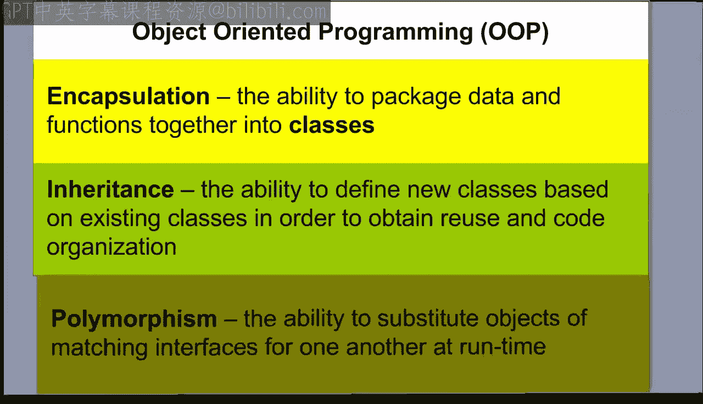
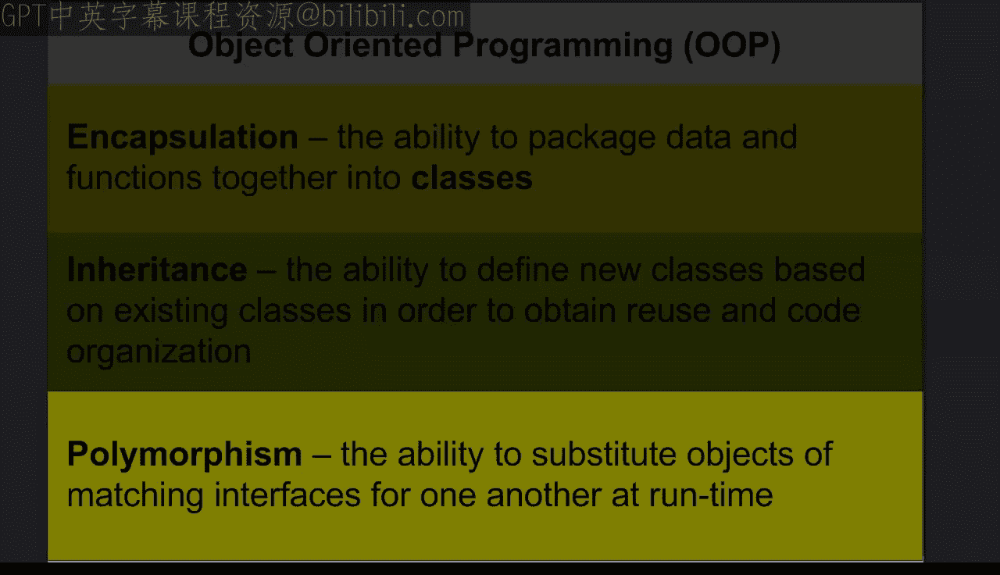
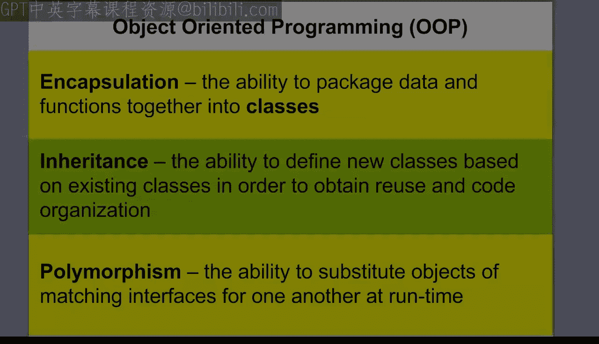
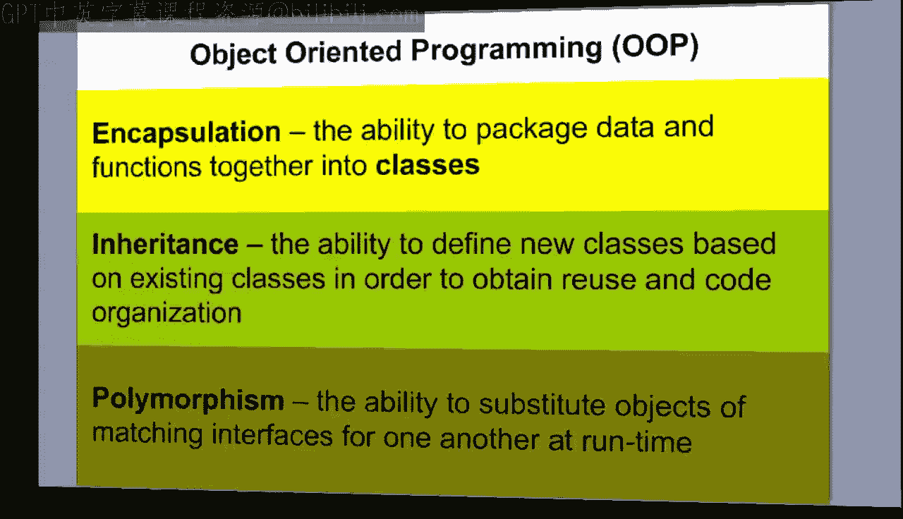
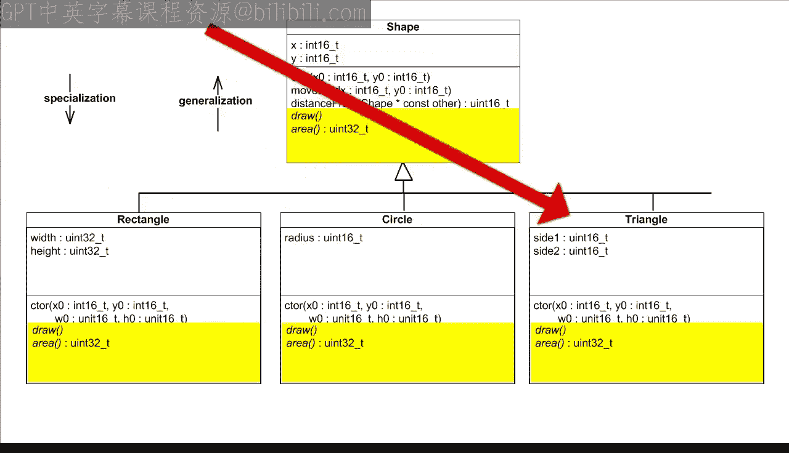
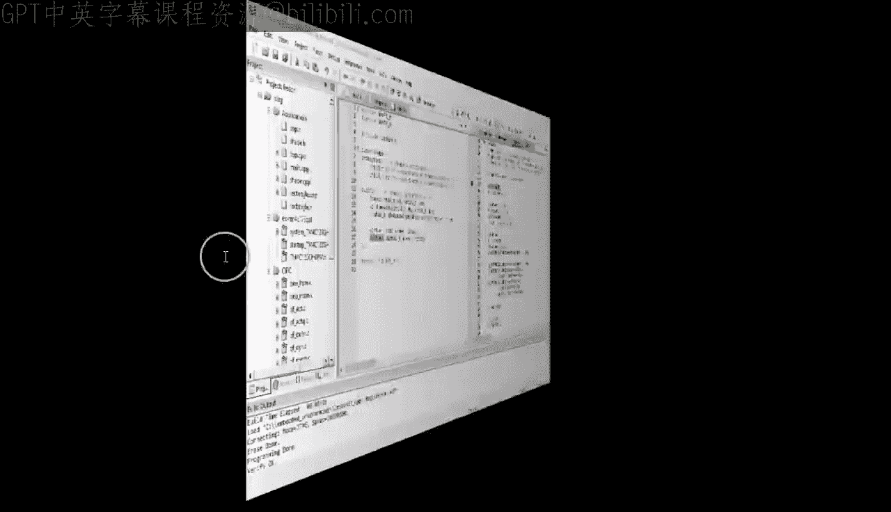
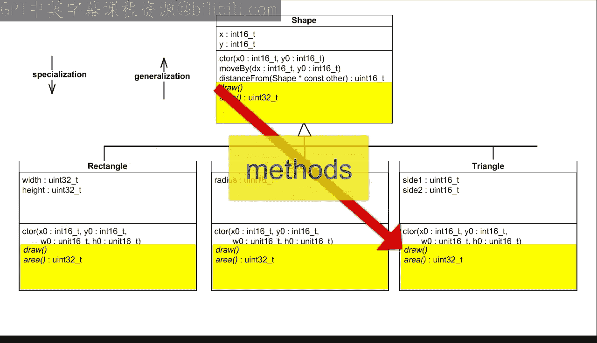
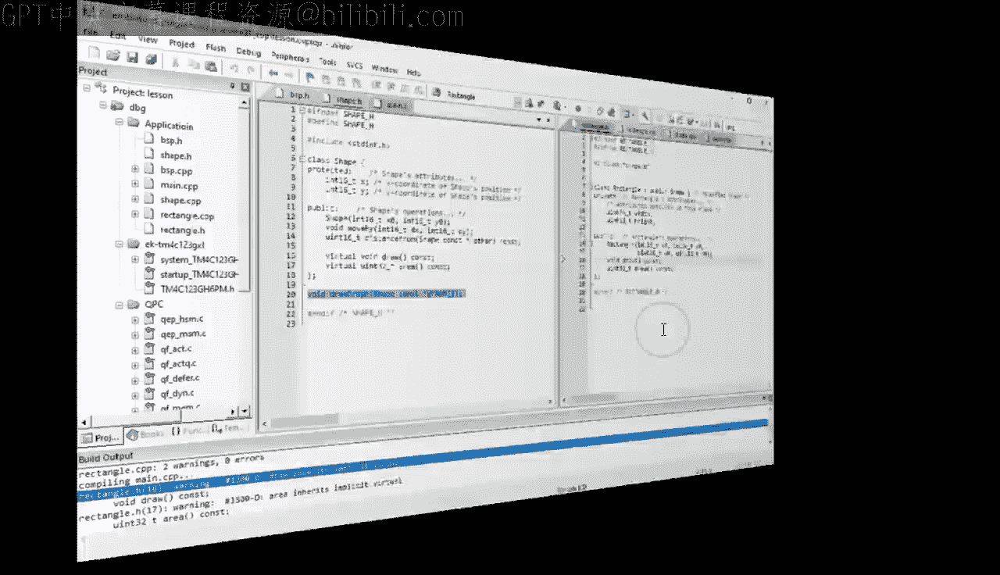
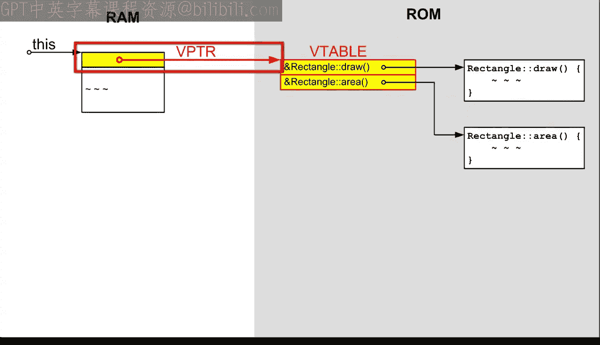
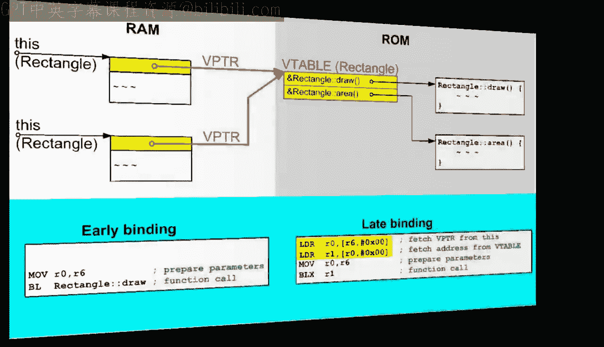

# 现代嵌入式系统编程：31：C++中的多态性

在本节课中，我们将学习面向对象编程的核心概念之一：多态性。我们将探讨它在C++中如何工作，以及其背后的实现机制。

与之前讨论的封装和继承不同，多态性是纯粹的面向对象概念，在像C这样的传统过程式语言中没有直接对应物。因此，今天的计划与之前两节课相反：我们将首先了解什么是多态性以及它在C++中如何工作，然后基于这些知识，再来看如何在C语言中模拟它。

## 从继承到多态接口

在上一节课中，我们学习了类继承的概念，并创建了一个`Rectangle`类，它继承了`Shape`基类的所有属性和操作。但`Rectangle`也添加了自己的操作，例如在LCD屏幕上绘制矩形的`draw`操作和计算矩形表面积的`area`操作。

然而，这两个新增的操作对于`Shape`基类同样有意义，因为任何形状都可以被绘制在屏幕上并拥有表面积。唯一的问题是`Shape`类过于通用，在这个高层级上我们无法真正知道如何实现`draw`和`area`操作。

面向对象编程的核心在于分离接口（可以做什么）和实现（如何做）。本着这种精神，`Shape`类至少可以提供`draw`和`area`操作的接口，而将实现细节留到以后处理。

## 实现多态性

首先，我们简单地将`area`和`draw`的函数签名从`Rectangle`子类复制到`Shape`超类。同时，我们也从`Rectangle`复制这些操作的实现并适配到`Shape`。当然，在通用的`Shape`类高层级上，我们无法提供真正的实现，因为我们还不知道处理的是矩形、圆形、三角形还是线条。因此，我们只提供一些虚拟代码。

现在，当测试这个新的`Shape`接口时，我们利用上一节课学到的向上转型——将派生类指针转换为基类指针。在C++等面向对象语言中，这种向上转型总是安全的，并且会自动进行。

这开启了一个有趣的可能性：将指向`Rectangle`对象`r1`的指针向上转型为指向`Shape`的指针`ps`，然后在这个向上转型的指针上调用`draw`和`area`操作。编译无误后，在调试器中检查这种情况下调用了哪个操作。你会发现，调用的是`Shape`的实现，这并不奇怪，因为编译器根据指针的类型（`Shape*`）而非对象的类型（`Rectangle`）来解析函数。

但是，如果我们修改`Shape`类的声明，在`draw`和`area`操作前添加`virtual`关键字，情况就不同了。再次调试，你会发现这次调用的是`Rectangle`的实现。这意味着，调用现在根据对象的类型（`Rectangle`）而非指针的类型（`Shape*`）来选择实现。这就是多态性在起作用。

术语“多态性”本身源于希腊词根：poly（意为“多”）和morph（意为“形”）。因此，多态性意味着多种形式。确实，这里发生的情况是：同一个操作（如`draw`或`area`）可以根据指针所指向对象的类型而采取多种形式。

## 多态性的实际应用

多态性在实践中有什么用呢？它允许你在比没有它时更高的抽象层次上编写通用代码。

例如，假设你想在LCD屏幕上绘制一个由多个形状组成的图形。为简化起见，假设图形是一个指向各种形状对象的指针数组。现在，图形中的`Shape`指针可能实际指向不同的类型，但由于它们都继承自`Shape`基类，因此都可以安全地向上转型为`Shape`类型。

你可以在`Shape`类层级声明一个通用函数`draw_graph`，并在`shape.cpp`中实现它。`draw_graph`函数简单地遍历图形数组中的形状指针，直到遇到空指针。实现的关键点是`graph[i]->draw()`调用，它利用多态性根据对象的类型（而非明显是`Shape*`的指针类型）来正确选择`draw`实现。

## 方法重写与虚函数

在添加了`virtual`关键字后，编译器会提示`Rectangle`类中的`draw`和`area`声明隐式继承了`virtual`属性。这是因为多态性意味着`Rectangle`中的`draw`和`area`操作并非完全新增的操作；相反，它们仅仅是`Shape`基类中已指定并继承下来的`draw`和`area`操作的不同形式或不同方法。

引入一些面向对象术语：**方法**描述了同一操作的不同形式，子类中的不同方法被称为**重写**了从基类继承的原始方法。

回到代码，编译器注意到`Rectangle`中的`draw`和`area`操作只是基类中已声明操作的不同方法。作为同一操作的不同方法，它们自动成为`virtual`（即多态的），因此编译器强烈建议将这些方法显式声明为`virtual`。确实，在`Rectangle`子类的`draw`和`area`声明前添加`virtual`关键字可以消除警告。

## 扩展设计：添加Circle类

为了让你充分体会到基于多态性的设计的可扩展性，让我们创建另一个`Shape`的子类，例如`Circle`。`Circle`子类与`Rectangle`类似，因此我们复制相关文件并进行适配。

在头文件中，重命名包含保护符和类名。属性方面，将`width`和`height`替换为圆的`radius`。`Circle`构造函数以`r0`作为半径的初始值。`Circle`类还需要为从`Shape`继承的`draw`和`area`操作提供自己专门的方法，因此`virtual`声明保持不变。

在实现文件中，包含`circle.h`并再次替换类名。构造函数接收`r0`参数并用它初始化`radius`属性。`Circle`的`draw`方法将调用原始的`draw_ellipse`函数。最后，`Circle`的`area`方法将计算圆的面积，公式为π乘以半径的平方。为简单起见，这里我们仅使用整数运算，并将π近似为3。

完成`Circle`类后，最后一步是在`main.cpp`中测试它。我们包含`circle.h`头文件，实例化一个具有给定`x`、`y`和`radius`值的`Circle`对象`c1`。然后将指向`c1`的指针添加到图形数组中，这样`Circle`对象`c1`就成为随后由`draw_graph`函数绘制的图形的一部分。

构建项目时，请注意只有`circle.cpp`和`main.cpp`被重新编译，而包含`draw_graph`算法的`shape.cpp`并未重新编译。这意味着最终的可执行映像使用了在引入`Circle`类之前编译的`draw_graph`实现。当你运行程序并步入`draw_graph`函数时，可以看到它正确地调用了`Circle`的`draw`方法（`this`指针指向`c1`对象），而其他的`graph[i]->draw()`虚调用则为`Rectangle r1`和`Shape ps3`调用了正确的方法。这展示了多态性的威力和可扩展性。

## 虚函数调用机制

虚函数调用机制肯定与常规函数调用大不相同。为了比较两者，让我们在虚调用前添加一个常规函数调用。

请注意，在完整对象（如`Rectangle r1`）上调用的操作始终是常规的非虚函数调用，即使该操作本身被声明为`virtual`。这是因为对象的精确类型在编译时是已知的。顺便说一下，函数调用和函数体之间的连接称为**调用绑定**。

在编译和链接时建立的连接称为**早期绑定**；这是像C这样的过程式语言中使用的唯一调用绑定。但在C++中，在指针（如这里的`ps`）上调用的虚操作建立了一种不同的调用绑定，因为对象的精确类型在编译时是未知的（指针可能是从派生类向上转型而来的）。这种类型的绑定称为**晚期绑定**、**动态绑定**或**实时绑定**。

构建项目并将断点移到早期绑定调用处，最终看看它与晚期绑定有何不同。在反汇编视图中，你可以看到早期绑定调用包括将`this`指针的值移动到`r0`，然后使用带链接的分支指令`BL`来调用硬编码在`BL`指令本身的`Rectangle::draw`函数。

而晚期绑定的机器代码则显著不同。它首先从`R6`加载一个32位字（稍后用作`r0`中的`this`指针），因此这个32位字必定来自`this`对象。随后，这个字被用作基地址，所以来自`this`对象的这个字本身就是一个指针。等等，你肯定没有向`Shape`或`Rectangle`类添加任何指针属性，所以让我们仔细看看RAM中的这个指针。

确实，你可以识别出从`Shape`继承的16位属性`x`和`y`，以及`Rectangle`中添加的`width`和`height`，但现在所有这些前面都有一个指针——这显然是在`Shape`基类中引入虚函数时由C++编译器添加的。因此，`Rectangle`对象的总体大小现在增加了一个指针。

关于`Rectangle`对象内部的这个指针，它看起来像是RAM中的一个地址。让我们在内存视图中查看这个地址。当你将内存视图切换到32位数量时，我希望你能认出，该地址处的第一个字非常类似于`Rectangle::draw`函数的地址（之前是`0x250C`）。实际上，它就是那个地址加1。

正如在本视频课程早期课程中多次解释的，Cortex-M中的程序地址存储为奇数，因为最低有效位不用于寻址，而是始终设置为1以表示CPU的Thumb状态。简而言之，该地址处的第一个字就是`Rectangle::draw`函数的地址。

那么该地址处的第二个字呢？让我们在反汇编窗口中查找它（记住要从地址中减去1）。这确实是`Rectangle::area`方法的地址，它是`Rectangle`类的第二个虚函数。

所有这些逆向工程可以总结如下：编译器在类属性的开头添加了一个指针，该指针指向RAM中的一个表，该表包含所有虚函数的地址。在文献中，虚函数表被称为**vtable**，存储在对象中指向它的指针被称为**vptr**。

继续调试，你可以看到`Rectangle::draw`函数的地址从vtable加载到`R1`中，最后`this`指针在`r0`中设置。实际的函数调用由分支带链接和交换指令`BLX R1`执行，该指令跳转到`R1`中提供的地址。确实，当你步入`BLX`指令时，最终会进入`Rectangle::draw`方法。在这里检查`this`指针，你实际上可以看到对象的第一个属性（从`Shape`继承的切片）就是vptr。

## 开销与实现细节

总而言之，与早期绑定相比，晚期绑定的开销是：RAM中每个对象额外增加一个vptr，RAM中每个类一个vtable，以及每次函数调用多两条指令。对于所获得的功能来说，这并不是很大的开销，但仍然不可忽略，因此C++仅将此机制应用于显式指定为`virtual`的函数。这是为了防止不需要晚期绑定的函数产生开销。

其他面向对象语言（例如Java）将多态性视为如此基本的功能，以至于默认情况下所有函数都是`virtual`的。另外，请注意vptr/vtable双重间接寻址只是晚期绑定的一种可能实现，C++标准将其完全开放给编译器设计者。尽管如此，实际上所有针对各种CPU的现有C++实现都使用了你刚刚看到的vptr/vtable实现。

那么，今天剩下的最后一个问题是：谁设置了vptr？我的意思是，每个类在RAM中的常量vtable可以像代码本身一样轻松添加，但vptr需要在每个类的每个实例中设置，而这些实例通常在运行时分配（例如，作为函数中的自动对象）。

我希望此时你能猜到，建立vptr的理想位置是类的构造函数。当然，你在C++代码中没有对vptr做任何处理，这意味着C++编译器必须秘密地合成一些代码来为你完成这项工作。

作为一名嵌入式工程师，我相信你一定特别好奇任何这样的秘密代码。因此，让我们在`Rectangle`构造函数中设置一个断点并启动调试器。断点立即被命中，因为有一个静态分配的`Rectangle`实例，它甚至在`main`之前就被初始化了。当你展开`this`指针时，可以看到vptr仍未初始化。

步入后，你最终进入`Shape`的构造函数，它是从`Rectangle`构造函数的初始化列表调用的。此时`this`指针的类型变为`Shape`，但vptr仍未初始化。查看反汇编，你可以看到两行机器代码，它们显然设置了vptr。但是，等等，它指向哪个vtable？让我们从内存视图中检查vtable。例如，取表中的第二个条目并在反汇编中定位它。如前所述，你需要从vtable中的地址减去1，所以你正在寻找地址`0x000024EA`。你最终进入`Shape::area`方法，这意味着该vtable属于`Shape`类。

因此，在初始化的这个阶段，`Rectangle`实例仍被视为其`Shape`基类。但让我们继续逐步执行`Shape`属性的初始化，并返回到`Rectangle`的构造函数。在这里的汇编代码中，你遇到了类似的指令，它们显然将vptr重新初始化为一个不同的值。再次，让我们通过检查其第二个条目从内存视图中找出这是哪个vtable。现在你正在寻找地址`0x00002502`。你最终进入`Rectangle::area`方法，这意味着vtable现在属于`Rectangle`类。

如你所见，vptr在每个构造函数中被初始化并重新初始化，以指向该类的vtable。但构造函数调用的顺序是：超类总是在子类之前初始化，因此vptr最终指向最后一个派生类，这是正确的。

本节课中，我们一起学习了面向对象编程的核心概念——多态性。我们探讨了它在C++中的工作原理，包括虚函数、vtable和vptr的机制，以及早期绑定与晚期绑定的区别。多态性允许我们编写更通用、可扩展的代码，是构建复杂嵌入式系统的重要工具。在下一节课中，你将通过用C语言实现晚期绑定来测试对虚函数的理解。