# Quantum Leaps《现代嵌入式系统编程Modern Embedded Systems Programming》中英字幕 p33 -33-#32 OOP Part-4_ Polymorphism in C.zh_en -BV1fRt2efEms_p33-

Yeah。Welcome to the Modern Emded Systems programming course My name is Mirosak and in this lesson I'll continue with OOP and polymorphism。

 but this time you will see how to implement polymorphism in portable standard complianceliant C code this should reinforce what you've learned about virtual functions in C++ in the last lesson and expose some additional nuances of the VPTRV table implementation。

This lesson will also provide some general principles and guidelines about using objectiented programming in embedded software。

By the way， this is a very round lesson number Hex 20。

 which coincides with even rounder number of subscribers to their Quaum news video channel。

 which is about to cross Hex 8000 or2 to 15th。 I'd like to thank you all for your help in reaching these fantastic milestones。

As usual， let's get started by copying the previous lesson 30。

 the C version without the underscore CPP suffix to lesson 32。

Get inside the new lesson 32 directory and double click on the project lesson to open it in the microvision IE。

To remind you quickly what happened so far in the last lesson。

 you'll learn about the R O P concept of polymorphism。

 which is the ability to provide different methods for the same inherited operation in the subclassuses of a given class。

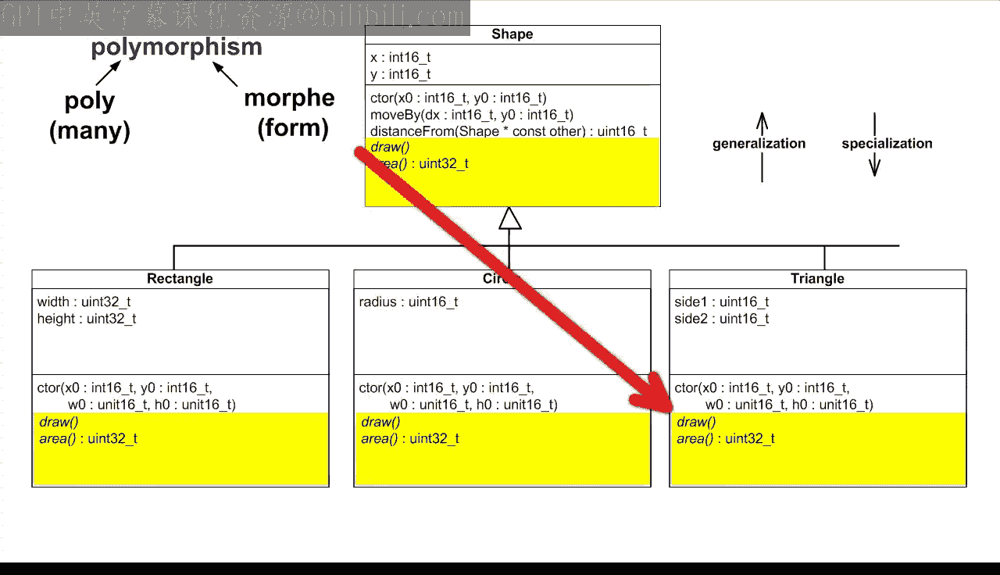

Specifically， use sawho polymorphism is implemented in C plus plus by means of virtual functions。

 and you have reversed engineered the late binding mechanism with a specific method for a given operation is resolved at runtime based on the type of the object。

 not the type of the pointer used in the call。But before you go any further from the last lesson。

 it should be clear that， unlike class encapsulation and single inheritance。

 which were essentially free in C。Polymorphism in C will add coding complexity and overhead。

 Therefore， if you intend to use polymorphism extensively。

 you would be probably better off by switching to C plus plus。

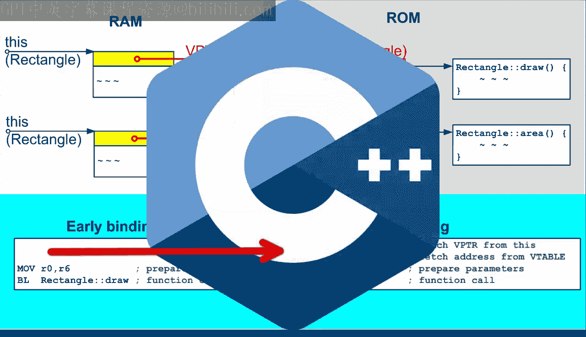

However， if you build or use software libraries such as the QP Real time framework。

 the complexities of polymorphency can be confined to the library and can be effectively hidden from the application developers。

But either way， this lesson's primary goal is to show you how things really work under the hood。

 which should help you to use polymorphism more efficiently and with greater confidence in any language。

So today， you will implement the virtual functions manually in C following exactly the C plus plus VPT RV table design。

For this， you need to explicitly add the VPTR to the attribute structure of the shape base class。

VPTR will be the first attribute and will be a pointer to the Kst shape V table structure。

 This cons will allow the V table to reside in Rome。

Please note that at this point you have not provided the declaration of the shapepe V table track just yet。

But here you are using only a pointer to the， which the compiler accepts。

 because all it needs to know for processing the shape attribute structure is the size of the pointer。

 which is known， not the size of the whole V table。But now you obviously need to declare the V table。

 which even though its called a table， is typically not implemented as an array。

 but rather as a structure of pointers to all virtual functions such as draw and area in the case of the shape class。

I used pointers to functions in this video course before。

 but today is the time to introduce them a bit more carefully。

So the C language allows you to provide a pointer to a function。

 just like you can provide a pointer to a variable。 In both cases。

 a pointer contains the address of the function or variable respectively。

 and also the type information about the entity that is being pointed to。

In case of pointers to functions， the type information consists of the full signature of the function。

So to declare a pointer to the draw function， you first need to write a signature of this function。

And then you need to convert the actual name of the function into a pointer。

 which means using the asterisk operator。But because of the specific operator precedence rules you see。

 the asterisk would be bound to the return value instead of the function name。

 So you need to add explicit parentheses around the pointer like this。

You apply the exact same steps to declare a pointer to the area function。O。

 so the VPTR and V table are both declared， but now the users of the shape class。

 as well as its subclass must be able to call the virtual functions。

You can provide this virtual call functionality， also known as late binding in a few different ways。

First， you can provide member functions for that， just like all the other operations of the shape plus。

Specifically， you can take the draw method signature。And turn it into the shape， Draw V function。

Similarly， you can take the area method signature。And turned it into the shape area。

 the call member function。The implementation of these virtual call functions goes to the shape do C file。

Here in the shape draw V call function， you first get from the me pointer to the VPTR。Next。

 you get from the VPTR to the specific pointer to function， such as draw。Finally。

 you need to provide the parameters of the call， which include the me pointer and potentially other parameters included in the signature of the function。

You repeat the exact same steps for the shape area vehicle function。

Except that this function returns a value。 So you need to add the return statement in front。

As you can see， the C compiler accepts this syn without complaints because the presence of the parameter list following the pointer to function tells the compiler that this is a function call based on this pointer to function。

However， this syntax fails to show that you are dereferencing a pointer。

 and I prefer to be very explicit about it。 Therefore。

 I prefer the alternative syntax analogous to dereencing any other pointer that is with the asterisk in front。

 Of course， again， just like in the declaration of a pointer to function。

 you need to use parentheses around the pointer。As you can see。

 the compiler accepts this version just as well。But either way。

 the most important point here is that the me pointer is used twice once to find the VPTR within the object so that the call is specific to the object。

 not to the type of the me pointer。And the second time。

 the me pointer is used as the usual first parameter of a member function。

So this is the first clean and straightforward solution that will work， but it has a big drawback。

 and that is the additional function call overhead to call the invented Vcal functions。

But the good news is that the newer C 99 language standard allows you to avoid this overhead by using the in line functions introduced exactly for this purpose。

😊，To make the functions in line， you move the whole definitions of the functions into the header file。

 and you add the keywords in line and static in front。

The discussion as to why it is a good idea to use both inline and static is a bit lengthy。

 and I am going to leave it for another day， as it is off topic for to day。But now。

 when you try to compile this code， it fails because as it turns out。

 this compiler still works in the older C 89 mode and does not recognize the inline keyword。

 You can remedy this by opening the project options dialog box and going to the C C plus plus tab or you can take the box next to C 99 mode。

As you can see， this triggers the complete recompilation of the whole project。 But this time。

 the code builds cleanly。While the inline implementation of the virtual call mechanism is the preferred way for completeness。

 Id like to mention the third implementation option based on pre process or macros。

 which will look as follows。You take the function definition and turn it into a macro by stripping away most of the type information。

This is because macros provide only purely textual substitutions。Therefore。

 to avoid any surprises when， for instance， the client code would use expressions for the macro parameters。

 It's always a good idea to enclose the macro parameters like the me pointer here。

 in additional set of parentheses。For all these reasons。

 macros are not nearly as good as inline functions。

 but I still show you the macros because they are the only low overhead option for the older C 89 compilers。

 which are still in extensive use。All right。 So you have seen how to define and how to de referenceence pointers to functions。

 But you are not quite out of the woods yet with your virtual functions in C。

You still need to somehow define the V table in Rome。

 and also you need to set up the VPTR in each instance of the shape class and its subclasses。

As you remember from the reverse engineer C plus plus implementation from the last lesson。

 the VPTR and V table setup occurs in the construct。 So that's where you need to go next。Here。

 you need to define an instance of the tract shape V table in Rome。

Meaning that it would be both static that is not on the stack and cons。Now。

 a constant object cannot be changed， so we must immediately initialize it at the point of creation。

But before you can initialize the V table， you need to provide the functions with which to initialize the draw and area pointers to functions in your V table。

So let's provide the prototypes for the functions。Shape， draw。And shape area。

You can make these functions static because they will be only used locally inside the shape the C module。

So now you can finally initialize your V table instance。

 whereas you can choose between the two options of the syntax。First。

 you can directly use the function names。 The compiler will accept this because the absence of parentheses after the function names means that these are not function calls。

 but rather addresses of the functions。However， I prefer the alternative syntax in which you explicitly use the empers that is address of operators to leave absolutely no doubt that here you mean addresses of the functions。

So now you can set up the VPTR in the newly constructed shape object to point to the V table for the shape class。

And finally， you need to define the shape， draw and shape area functions。Interestingly。

 at the level of the shape class， you cannot really provide meaningful implementations because shape is too abstract。

So for now， you just leave the functions empty， but to avoid compiler warnings about unused parameters。

 you can use the idiom of casting the unused parameter on void。At this point。

 you are done with the general virtual function machinery in the shape based class。

 and you can immediately put it to good use by writing the generic D operation discussed in the last lesson。

So here is the C plus plus code from lesson 31， where an array graph holds pointers to shape。

 but these pointers actually point to subclasses of shape， such as rectangle， circle or triangle。

The central point here is that this C plus pluscode applies polymorphism to call the specific draw method for each shape pointer in the graph array in a very intuitive and elegant way。

So now your job is to do the same in C using the virtual call mechanism you just implemented。

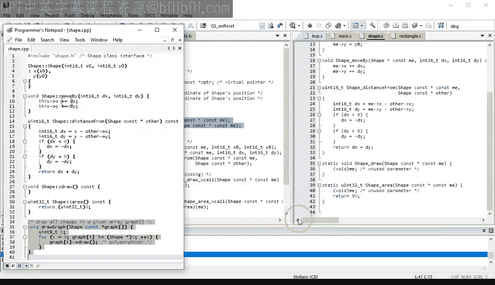

Well， it's actually very similar to the C plus plus version。 The only difference now is that you use。

The shape draw V call in line function， to apply polymorphism。So this is all there is to it。

 except that you obviously still need to provide the prototype of the draw graph operation in the shape dot H header file。

O， the shape based class is done， but some work is still needed in the subclasses of shape。

 like rectangle or circle。

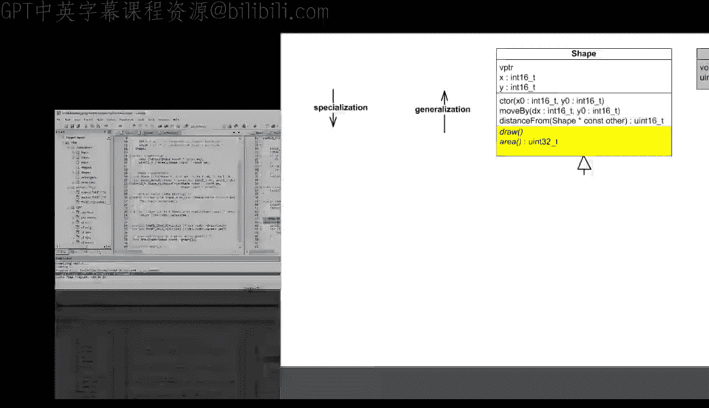

They will all inherit the V PTR and the virtual column mechanism from shape， But each subclass。

 like rectangle， still needs to provide its own V table and its own specific implementation of the virtual functions Draw an area。

 This was the main purpose of polymorphism。So let's do it now for the rectangle subclass of shape。

You need to go to rectangle dot C and pretty much repeat the steps you did for the shape base class。

So first， you add the static and consed virtual table inside the rectangle constructor。At this point。

 I presume that a rectangle does not add any new virtual functions to the ones already specified in the shape super class。

In that case， rectangle can use shape V table structure directly。Otherwise。

 you would need to apply inheritance in C with respect to V tables。

 But let's keep it simple here and not add any new virtual functions in rectangle。

So back to the initialization of the V table， instead of shapes methods。

 the rectangle V table will obviously contain the rectangle's implementations。But now。

 a rectangle already provides its own rectangle draw and rectangle area functions。

 The problem is that the me pointers in the signatures of the rectangle implementations are of type rectangle。

While the pointers to functions in the shapes V table have signatures that expect me pointers of type shape。

Because remember that even though rectangle and shape are related by inheritance。

 the C compiler doesn't know about it and will not perform upcasting automatically。

So to make the rectangle signatures fit into the V table Or defined for the shape base class。

 you need to cast point to2 functions by using the whole function signatures like this。

Only now you can finally assign the inherited VPTR for the rectangle class。

 but you need to be very careful to do it after calling the constructor of the shape upper class。

This is because just like in C+， the shape constructor sets the VPTR to point to the shapes of V table。

 But here you want to override the setting to the rectangles V table。

And this is all because rectangle dot C already contains the implementations of the rectangle draw and rectangle area functions。

The very final touch， which will allow you to test allt this in the debugger。

 is to call the generic draw operation that makes use of the virtual call mechanism。For this。

 you can open the C+ plus code from the last lesson。

And copy the relevant snippet to your main sea file。In the C version。

 you need to set up the graph array of pointers slightly differently because you don't have the circle class in C。

 So let's use the S1 shape object instead。Also， instead of creating a shape object dynamically。

Let's create a rectangle object。Then， of course， you need to call the right constructor on it as well。

So this is about it。 But to make the C compiler happy。

You still need to add an explicit cost in the rectangle constructor。

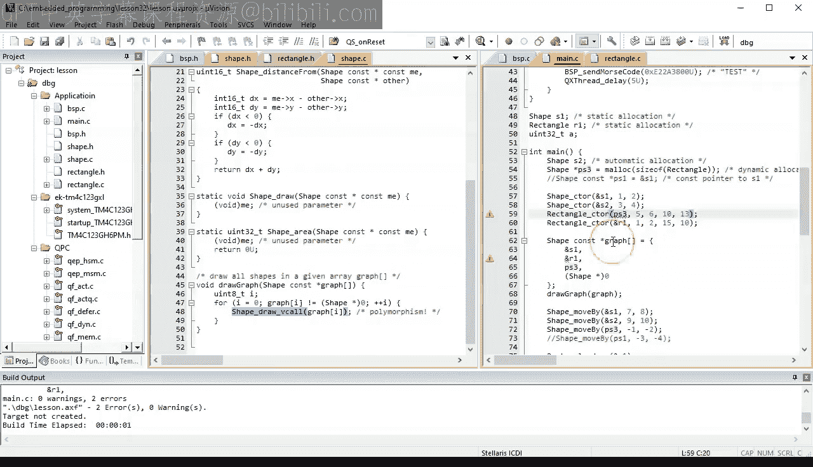

And in the initialization of the graph array of pointers。All right。

 So you got the code to build cleanly。 Now， I am sure you are curious how all this will work in a real embedded board。

So let's connect the Tiva see launchpa board and open the debugger。

The first thing I'd like you to verify is the rectangle constructor。When you step inside。

 the first code you see is the call to the shape constructor of the superclass。

 step inside again and verify that the VPTR is initially not set。

 but gets initialized to the shape V table containing addresses of shape。

 draw and shape area functions。Also， please note that the V table is definitely in Rome because its address starts with zeros。

Now， when you keep stepping， you return back to the rectangle constructor and there the VPTR gets overridden to the rectangle fleet table with addresses of rectangle draw and rectangle area functions。

So your constructors in C work now exactly like the C++ constructors from the last lesson。

 except that in C you had to add the V table and the code to set the VPTR manually while C++ synthesize that code automatically。

Now， the most interesting part is to see the virtual calls inside the generic draw graph function。

 But before you step there， just note that the first object to draw will be shape S 1。

 The second will be the rectangle R1， and the third will be another rectangle pointed2 by the pointer PS3。

Once inside draw graph， step to the shape draw V called virtual call and take a look at the disassembly。

When you compare it to the code generated by the C++ compiler， you can see that they are identical。

So let's step through this late binding code a single instruction at a time。

The first LDR fetches the VPTR from the me pointer in R6 and places it in r0。

The second LDR fetches the first virtual function from the V table now in R0 and places it in R1。

A move instruction copies the me pointer in R 6 to R 0 to prepare it as the first parameter of the call。

Finally， the B L X R1 instruction executes the call to the address in R1。And indeed。

 you end up in the shape draw method， because as you remember。

 the first pointer in the graph array was the S1 shape class object。

The second time through the loop in the draw graph function。

 the same late binding code now invokes the rectangle draw function， however。So as you just saw。

 the C implementation of virtual functions works exactly like the C plus plus original down to the machine instructions for late binding。

At this point， I'd like to note that the VPT RV table implementation of polymorphism in C that youll learned here is not the only possibility in the literature or online。

 you can find plenty of other techniques。

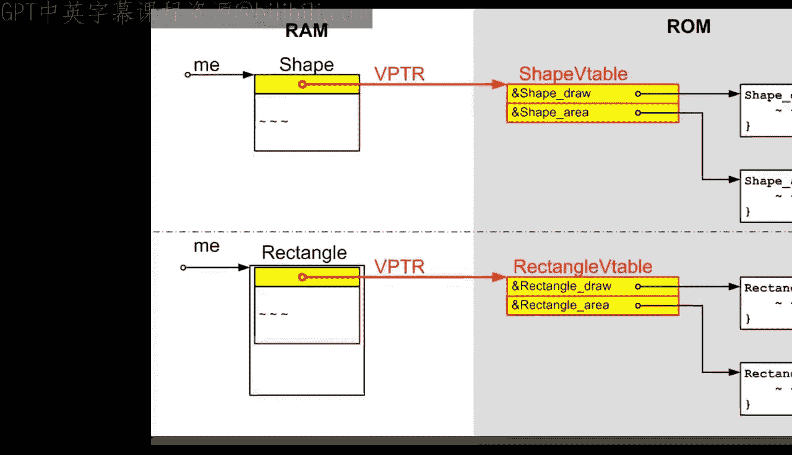

Perhaps the most frequently used alternative is to remove the VPTR level of indirect and embed the whole V table inside every object。

The advantage here is a little simpler virtual call。

 as well as a nicewi syntax more closely resembling C plus plus， because the drum method。

 for example， I invoked on an object using the dot operator like this。

But the dropag is the increase Ram usage， because V table is now in Ram rather than Ram。

Not only this， the V table is repeated in every object。 So if you have many objects。

 you can easily double or triple your Ram usage。

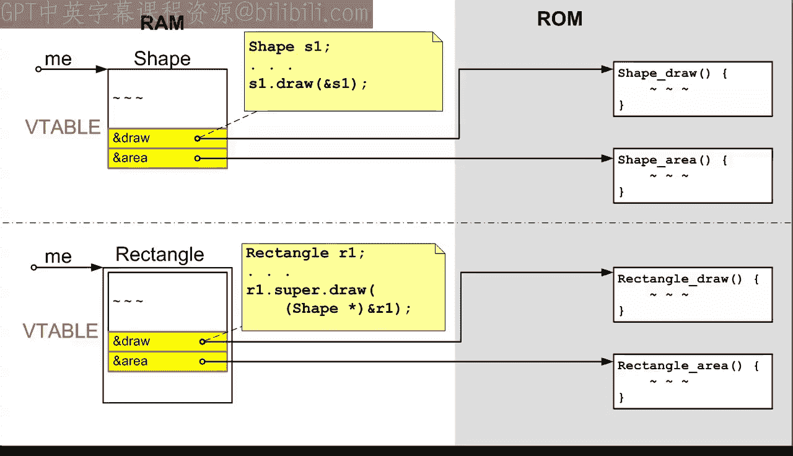

An example book that presents this implementation method is design patterns for embedded systems in C by Bruce Powell Douglas。

You can find there the whole chapter on object ored programming。

 and specifically its C implementation。

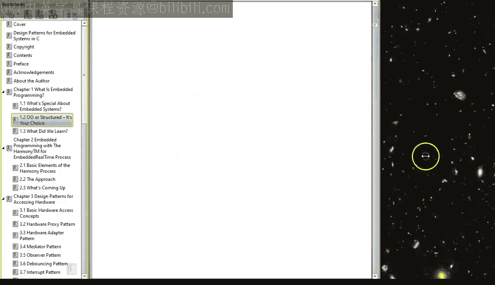

The author discusses classes。Objects， polymorphism and virtual functions。

 subclasses and other aspects。There is also specific C code where you can clearly recognize the V table embedded directly in the attribute structure。

Interestingly， please note how this book also uses the me pointer naming convention for the class member functions in C。

The last subject I want to touch upon to day is when to use polymorphism and perhaps even more importantly。

 when not to。Let's start with a simple code smell， indicating that polymorphism might be helpful。

For that， imagine how the generic draw function would be implemented in a very traditional sea code without late binding。

 Well， it would probably look something like that。Specifically。

 you would probably add an attribute kind into the shape structure。

 and you would also provide an enumeration of all possible kinds of shapes。Such as rectangle， circle。

 triangle， etc cetera。Then every time you would need behavior specific to the kind of shape。

 you would use a switch or if then else， branching to invoke the right function for the kind of shape you happen to be dealing with。

But such code is far less maintainable because every time you add or remove a new kind of shape。

 you would need to find and change all places throughout the code。In contrast。

 the virtual call mechanism is not only much more efficient。

 It is also automatically extensible because you can keep adding or removing different shaped sub classes。

 but you don't need to change the code with the virtual call at all。

 You don't even need to recompile the whole shape base class。

 including draw graph and any other functions like it。So here is your main guideline。

 Whenever you see or anticipate code like the switch statements scattered throughout your project。

 you should consider polymorphism。But please remember that the only valid reason for applying polymorphism is that the object specific behavior needs to be selected at runtime。

Which brings me to the guidelines when not to use polymorphism。 Well。

 you don't need polymorphism when the selection based on the object type does not need to happen at run time。

The most frequent misuse of polymorphism I see in the industry is in attempts to manage product lines of related。

 but slightly different products。For example， a medical company making。

 say infusion pumps for drugs might start with a single pump。

 but then keeps coming up with ever more versions for various drugs and market segments。

The software for the new pumps is almost never created from scratch， but rather。

 it's continually tweaked and adapted from the existing software。 But actually。

 the software for a new pump is not copyied and changed separately。 Instead。

 a single ever growing code base is extended to service all existing pumps。And herein lies madness。

Develop litter the code with conditional logic， which quickly becomes unmanageable and untestable。

This code makes decisions at run time based on the product type。

 version numbers and similar variables， While really any given codes that ends up in only one specific product。

 Therefore， the selection of the product does not need to happen at runtime。

 It can happen at compile time and end link time。So even if polymorphism could eliminate much of the convoluted。

 if then else logic。A better way is to design a clean board support package， B SP interface。

 and then provide different implementations，  different B Sps for different products。

 So for product ABC， you would have B SP underscore ABC and so on。 This is the use of abstraction。

 as I explained back in lesson 29。Of course， there is much more to it than just a simple BSP abstraction。

 The effective management of product lines requires careful physical design。

 which is the way or you partition your code into directories and files such as her files and implementation files。

 That way， you can build the final software for any given product by combining various modules at link time。

 rather than using techniques like polymorphism at runtime。

The art of good physical design is very valuable， especially in embedded systems programming。

 Unfortunately， the subject is not widely known or appreciated。

 While tons of books talk about logical design techniques such as O， O P。

 very few resources exist for physical design。

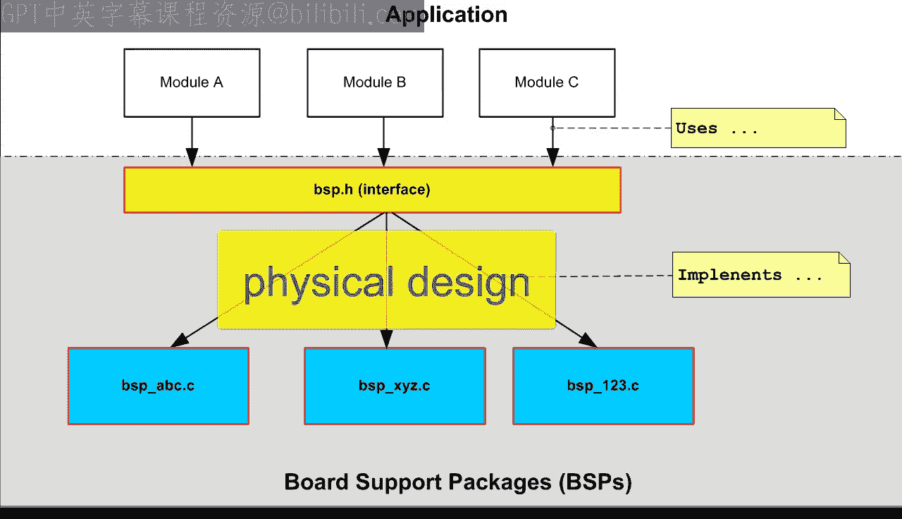

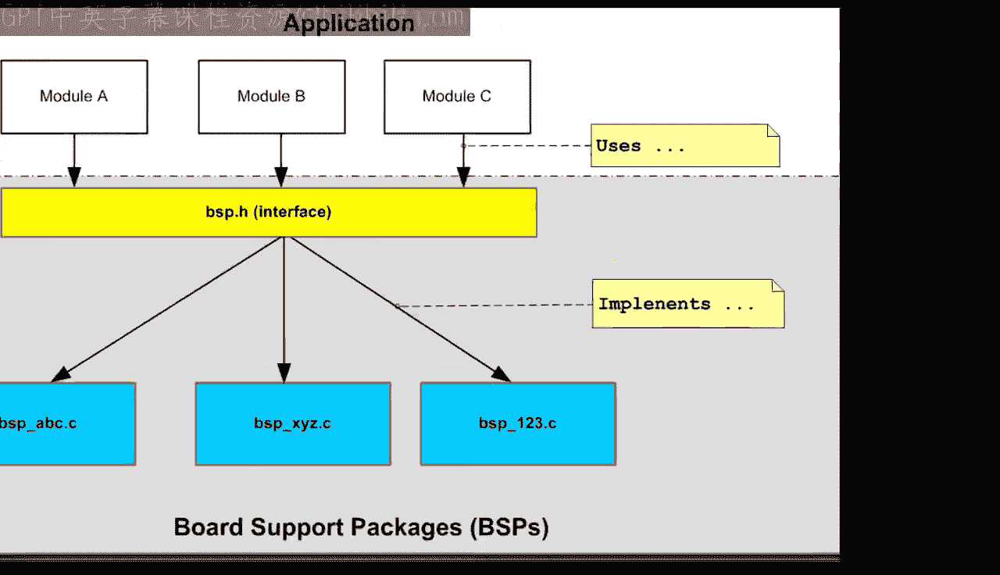

One notable exception is the book largerge scale C plus plus So designed by John Lakes。

 This book explains physical design really well， highly recommended。

And this concludes this group of lessons about object oriented programming in embedded systems。

In the next lesson， I will go back to my overarching theme。

 which is introducing the main trends that shape the modern embedded systems programming。

Specifically， I will start a new segment in which you will learn about the last big trend that went mainstream during the 1980s。

 and that is event driven programming。

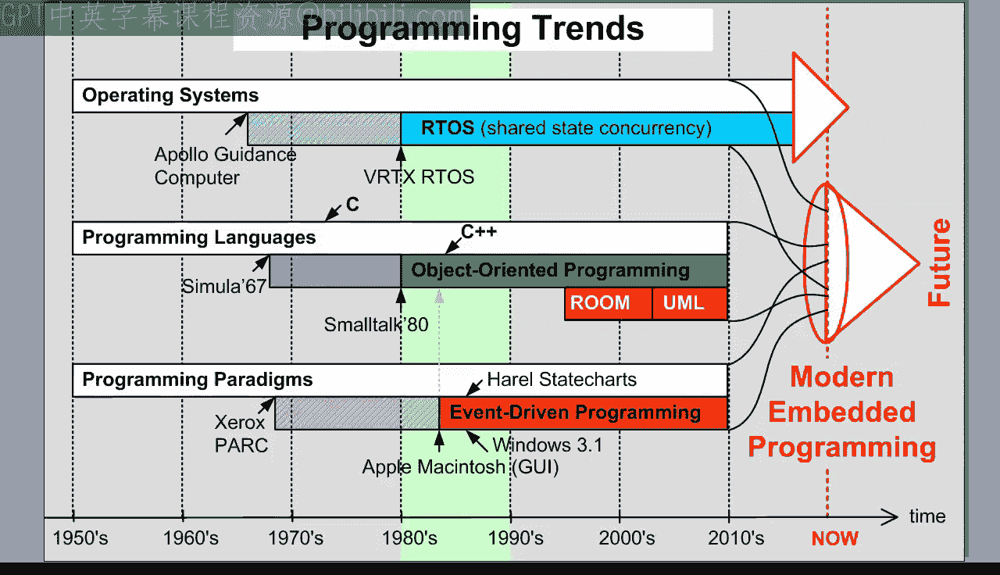

If you like this channel， please give this video a like and subscribe to stay tuned。

🎼You can also visit statemachine do com s Quickstart for the class notes and project file downloads。

🎼。

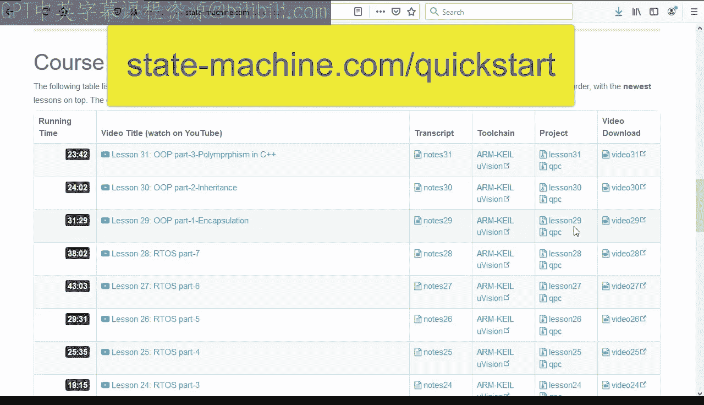