现代嵌入式系统编程：第33章：事件驱动编程第一部分 - GUI示例

在本节课中，我们将要学习事件驱动编程的核心概念。我们将以图形用户界面（GUI）为例，探讨这种编程范式为何产生、如何工作，以及它与传统顺序编程的根本区别。通过分析一个简单的Windows应用程序，我们将理解事件循环、消息处理、异步事件传递以及控制反转等关键思想。

上一节我们介绍了课程概述，本节中我们来看看事件驱动编程的起源。

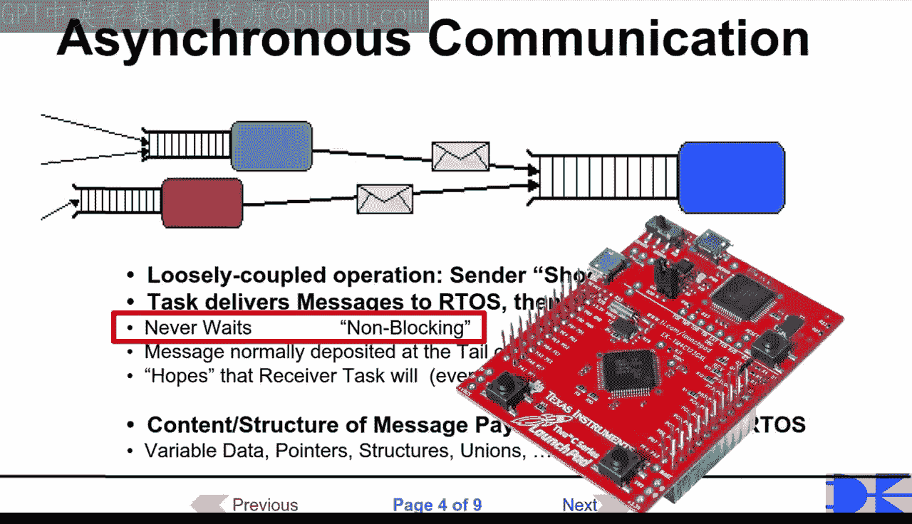

### 图形用户界面的兴起与编程挑战

图形用户界面在20世纪80年代的个人计算机革命中成为主流。从编程角度看，最具影响力的发明之一是20世纪60年代中期出现的鼠标。

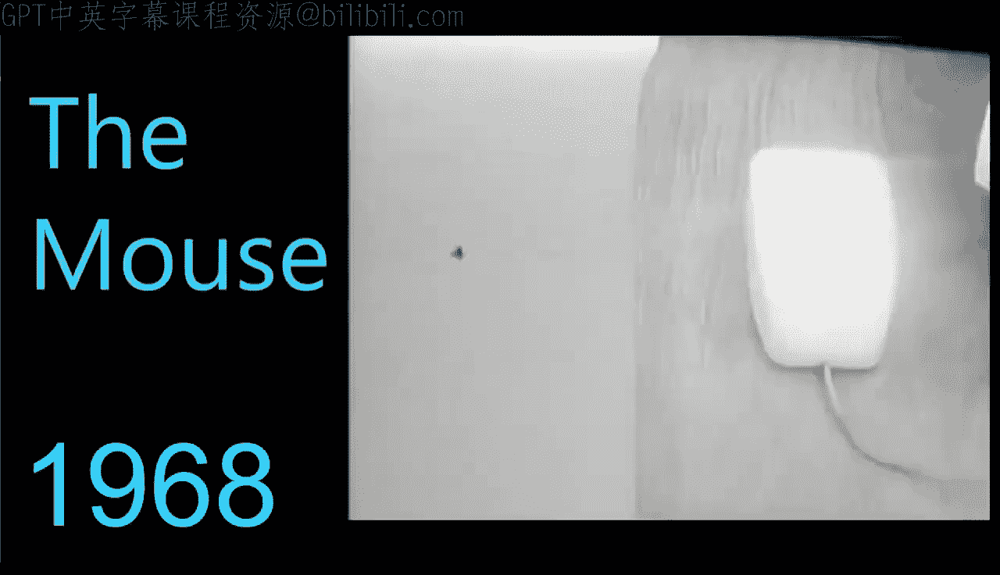

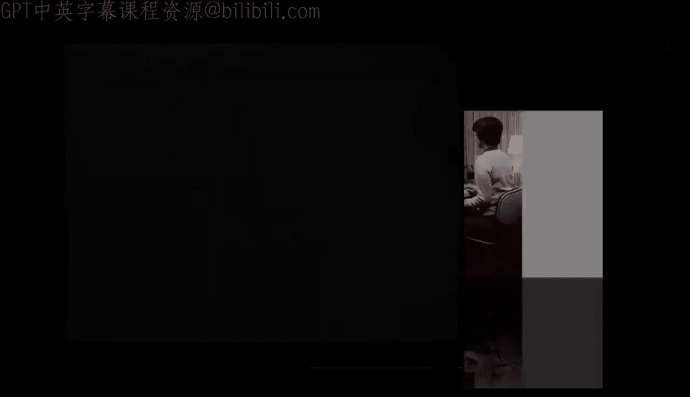

但直到十年后的70年代中期，施乐帕洛阿尔托研究中心的工程师们才解决了如何实际实现这些想法的技术细节。

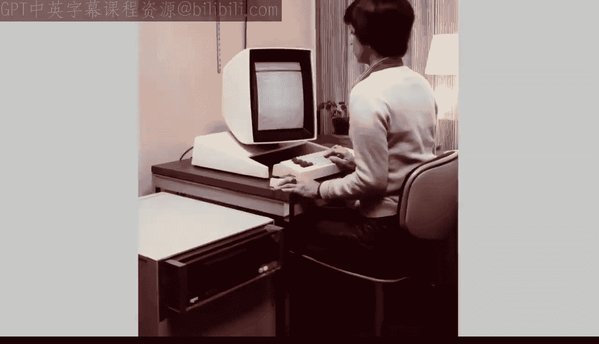

鼠标是一种指向设备，可以在显示屏上移动光标。大约在1973年，施乐帕洛阿尔托研究中心开发的Alto计算机引入了窗口概念，被选中的窗口会显示在其他窗口之上，就像将一张纸放在桌上一叠纸的最上面。

与当时基于命令行（如电传打字机或终端）的系统相比，图形用户界面的实现需要一次范式转变。

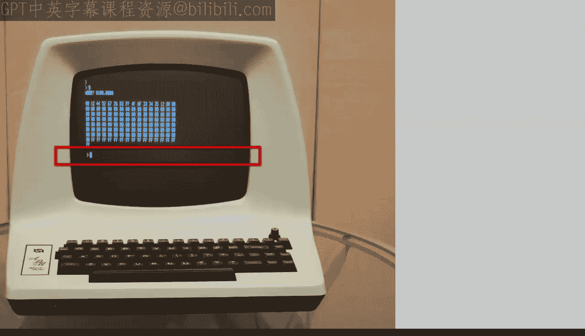

以下是命令行系统中的主要问题：唯一的输入设备是键盘，唯一的输出设备是屏幕底部，它会像电子电传打字机一样向上滚动。

因此，正如我在这段伪代码中试图说明的，软件仍然可以保持传统的顺序结构。基本上，软件等待按键，然后将字符回显到屏幕，接着处理按键，这可能会导致更多的屏幕输出。不存在“在哪里输出”的问题，因为它总是输出到屏幕底部。

但对于图形用户界面，情况则根本不同。首先，你现在有多个输入源：键盘和鼠标。

这是一个问题，我再次尝试用一段伪代码来说明。如果你明确等待键盘输入，那么你对鼠标输入就没有响应，反之亦然。所以，首先你需要找到一种方法，能够同时等待多个输入。

但假设你已经解决了这个阻塞调用的问题，接下来你必须检查多个输入中实际接收到的是哪一个。此外，对于键盘，你不再知道输出应该显示在屏幕的哪个位置，因为你必须知道屏幕的哪个部分是活动的（在今天的GUI编程中称为键盘焦点）。而对于鼠标，问题则更加根本。鼠标提供二维输入，即屏幕上的X和Y坐标，以及鼠标按钮的状态。

但原始坐标不足以采取有意义的行动。你还需要知道屏幕上这些坐标处是哪个对象。为此，你通常会调用GUI系统的服务。但由于这需要对每个鼠标输入都发生，你完全可以跳过这一步，总是让GUI系统根据当前鼠标坐标来查找对象。

这实际上意味着鼠标可以产生更多种类的输入，例如对象ID（如这段伪代码所示）。所有这些都取决于屏幕上不断变化的情况。

我希望你开始看到，图形用户界面引入了新的复杂度层级，这与命令行界面不在同一个层次上。事实上，GUI编程完全是另一种游戏。因此，GUI编程需要不同的思维方式也就不足为奇了。

实现可行解决方案的关键见解是聚焦于输入，这些输入被称为**事件**或**消息**，例如按键、鼠标移动以及来自屏幕上对象（如按钮、桌面图标、滚动条等）的次级输入。聚焦于事件意味着事件驱动软件，而不是像顺序编码的命令行程序那样反过来。

为了理解这种事件驱动范式的真正含义及其工作原理，我准备了一个在Windows上运行的简单“Hello Win” GUI应用程序。

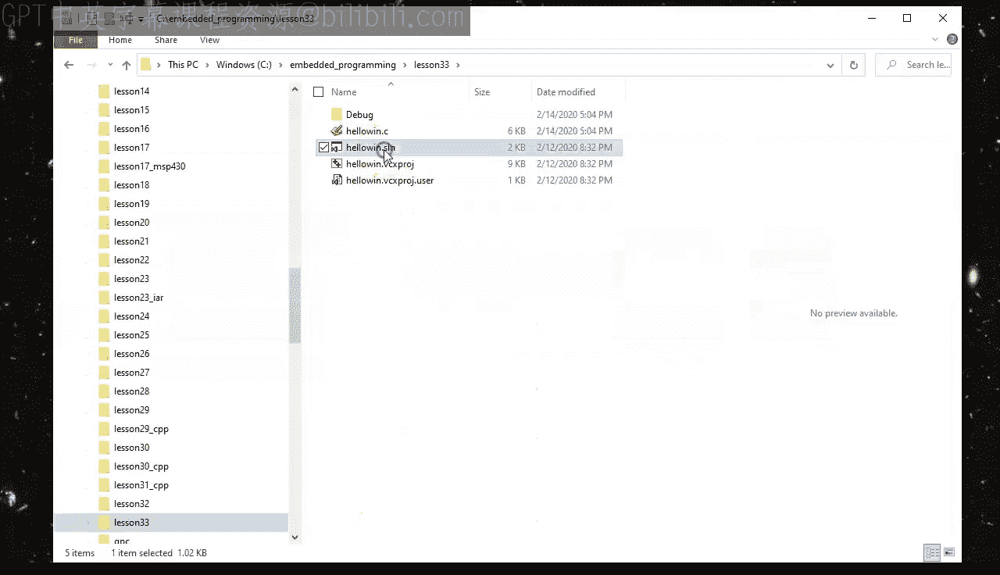

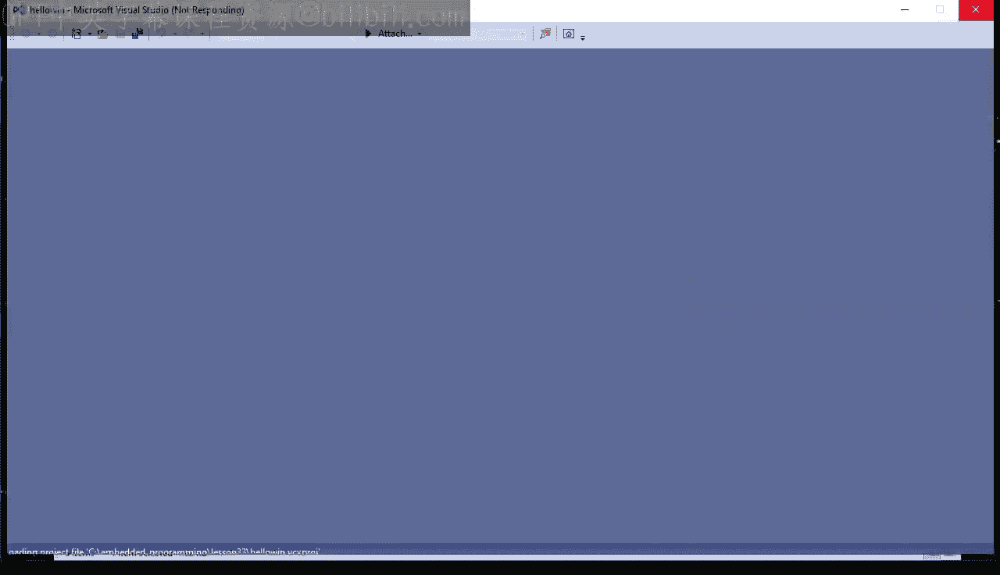

上一节我们探讨了GUI带来的挑战，本节中我们来看看一个具体的事件驱动程序示例。

### 一个简单的事件驱动Windows应用程序

你可以从本视频课程的配套网页 [statemachine.com/quickstart](http://statemachine.com/quickstart) 下载第33课的项目。在项目目录中，我点击了 `HelloWin.sln` 解决方案文件，在 Visual Studio 2019 Community 版中打开它。

即使开发环境相当现代，该软件也是用C语言编写的，使用的是微软在20世纪80年代开发的古老的Windows应用程序编程接口（API）。事实证明，与其他编程语言中更现代的API不同，这种用C语言编写的低级Win32 API以最简单、最直接的形式展示了事件驱动编程的核心概念。

让我们浏览一下这个简单的Windows应用程序，它是我根据Charles Petzold所著《Programming Windows》一书中的“Hello Windows”程序改编的。这本书于1988年首次出版，在当时成为了Windows编程的圣经。

代码从包含 `Windows.h` 头文件开始，该文件定义了Windows API的类型和常量。

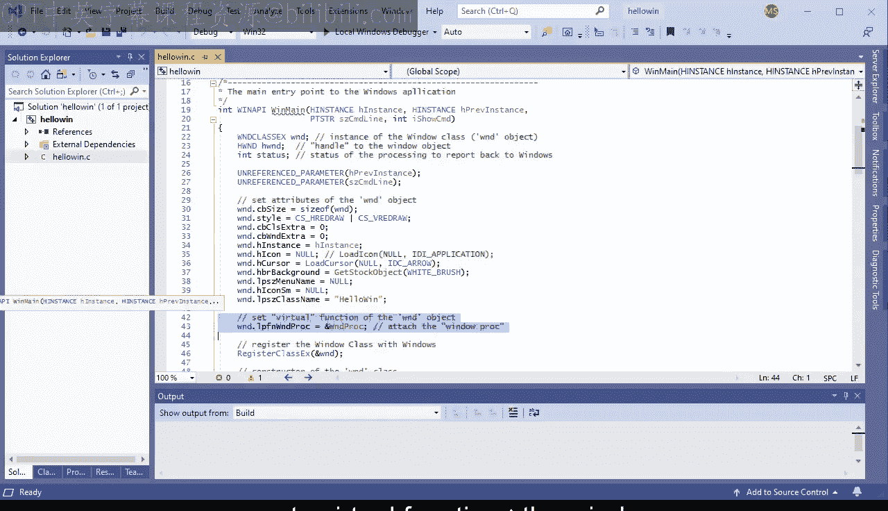

接下来，你可以看到 `WndProc` 函数的原型，它用于初始化一个“虚函数表”，我稍后会详细讨论。但首先是 `WinMain` 函数。这是Windows GUI应用程序的主入口点，其作用与传统C环境中的 `main` 函数相同，只是在GUI环境中，入口点需要更多参数，因为GUI应用程序更复杂。

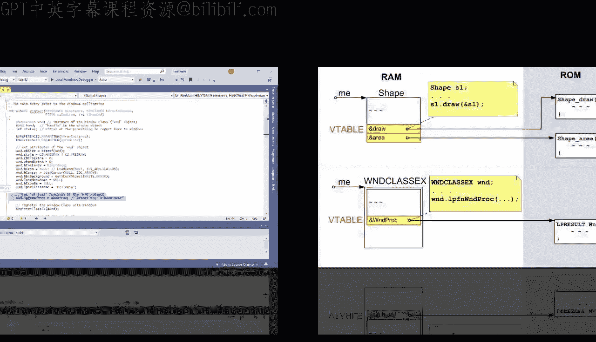

在这个简单的HelloWin应用程序中，其中一些参数甚至没有使用。

但接下来是有趣的部分：准备要向Windows注册的窗口类。我特意对初始化部分进行了格式化和注释，以便你能认出这里你正在进行一种面向对象编程，正如我在上一节关于C语言中OOP的第32课中解释的那样。

具体来说，你首先看到的是设置窗口类实例 `wndclass` 的属性，例如窗口样式、窗口的鼠标光标和窗口类名。但接下来，你或许能认出这是一个“虚函数”的赋值：针对此窗口类的窗口过程 `WndProc`。

在这里，Windows API设计者使用了我在上一节关于C语言中面向对象编程的课程中提到的简单实现技术：将指向虚函数的指针直接嵌入到属性结构中。

接下来是调用Windows来注册预定义的窗口类。最后，`CreateWindow` 调用扮演了构造函数的角色，因为它基于刚刚注册的窗口类创建了一个窗口对象。

应用程序窗口创建后，它被显示在屏幕上并更新。但在所有这些初始化之后，`WinMain` 函数进入了**事件循环**（也称为消息循环或消息泵），程序在这里执行其真正的工作。这是每个事件驱动程序中最重要的部分。

事件循环具有非常特定的结构，包含两个主要步骤。首先，调用 `GetMessage` Windows API会阻塞并等待来自键盘、鼠标或屏幕的任何输入。当任何此类事件发生时，Windows系统会将其记录为一个消息对象，并将其放入该应用程序的消息队列中。`GetMessage` 然后解除阻塞，并将消息从队列复制到 `msg` 对象。这就是事件循环解决同时等待多个事件问题的方式，正如我之前试图在伪代码中说明的那样。

如果从 `GetMessage` 返回的状态是0，则意味着应用程序已关闭。因此，在这种情况下，需要通过执行 `break` 语句来终止事件循环。

否则，消息将被传递给 `DispatchMessage` Windows API，然后由它调用为当前窗口注册的 `WndProc`。

你稍后会看到这个简单HelloWin应用程序的 `WndProc`。但在离开这段代码之前，让我总结一下事件循环的关键属性。

以下是事件循环的关键属性列表：

*   **异步事件传递**：事件循环使用特殊的消息对象来记录应用程序可能感兴趣的所有事件。这些消息对象仅用于通信，可以方便地存储在事件队列中，稍后检索处理。由于消息队列的存在，事件既可以在循环等待它们时传递，也可以在循环忙于处理先前事件时传递。在任何情况下，Windows系统只记录事件为消息并将其放入消息队列，但不会等待事件的实际处理。这种事件传递类型称为**异步**，意味着事件生产者（此处是Windows系统）独立于事件消费者（此处是你的应用程序）执行。换句话说，这两个活动是异步的，即不同步。
*   **运行至完成**：`DispatchMessage` 调用必须在循环处理下一个事件之前完成并返回到事件循环。这意味着事件处理以**运行至完成**（RTC）的步骤进行，不能被任何其他事件的处理中断。
*   **控制反转**：事件循环会调用你的应用程序代码（`WndProc`）。这与你习惯的方式相反，因为在之前所有关于实时操作系统的经验中（例如第20至26课），是你的应用程序调用RTOS的服务。但现在，事件驱动的Windows系统正在调用你的应用程序。事件循环的这个属性导致了与传统顺序编程相比的**控制反转**。这是所有事件驱动系统的关键特征，也是事件驱动编程的本质。控制反转真正意味着事件驱动应用程序，而不是反过来。

现在让我们看看这个GUI应用程序的 `WndProc`。首先，要理解这个函数签名，你需要看看我之前跳过的消息结构的声明。`MSG` 结构定义在 `Winuser.h` 头文件中，该文件由 `Windows.h` 包含。如你所见，`WndProc` 四个参数的类型与 `MSG` 结构的前四个属性完全相同。

我只是将第一个参数从 `HWND`（窗口句柄）重命名为 `me`，以更清楚地表明 `WndProc` 是窗口类的一个成员函数。这是第30课关于在C中实现类时引入的成员函数命名约定。

实际上，正如你在 `WinMain` 中看到的，`WndProc` 不仅仅是一个成员函数。它是一个虚成员函数，特定于为此应用程序向Windows注册的窗口类类型。

我还将 `WndProc` 的第二个参数从 `message` 重命名为 `sig`，因为这是消息中告知你记录在消息中的事件种类的部分。在现代事件驱动编程中，此信息称为事件的**信号**。所以我将其命名为 `sig`。

最后，最后两个参数 `wParam` 和 `lParam` 是事件参数，提供有关记录事件的附加信息。这些参数的含义取决于事件信号。

在 `WndProc` 内部，主要工作是处理接收到的消息。这需要首先确定你正在处理哪种消息。为此，Windows程序员使用基于消息整数信号作为控制表达式的 `switch` 语句。

每个 `case` 语句代表需要根据该信号处理的不同消息类型。`case` 语句的标签是各种消息信号的符号名称，这些名称同样列在 `Winuser.h` 头文件中。例如，`WM_CREATE` 信号对应数值1，在窗口创建时发送给 `WndProc`。类似地，`WM_DESTROY` 对应数值2，在窗口即将销毁时发送给 `WndProc`。在后一种情况下，`WndProc` 调用 `PostQuitMessage` API，该API将 `WM_QUIT` 消息插入程序的消息队列中。这反过来又会导致事件循环终止。这是一个有趣的例子，向你展示了应用程序可以异步地向自身发布事件。

但在所有情况下，`WndProc` 还会设置局部变量 `status`，记录处理状态。例如，当 `WndProc` 处理给定消息时，它将状态设置为 `0`（已处理）。然后状态被返回给Windows系统，因此存在双向通信：Windows告诉 `WndProc` 处理哪个消息，然后 `WndProc` 将处理状态报告回Windows。

现在，`WndProc` 可能需要处理的最重要的消息或许是 `WM_PAINT` 消息，当Windows系统确定窗口的部分或全部需要重新绘制时，会生成此消息。你的HelloWin应用程序通过在窗口矩形的中心绘制一些文本来处理此消息。所有这些细节对于今天来说并不那么重要，除了要注意绘制显示的是按键和鼠标移动计数器的当前值。

然而，更重要的是，这些计数器被定义为静态变量，因为它们必须在 `WndProc` 的多次调用和返回中持续存在。请注意，如果你将计数器定义为局部自动变量，它们会在每次返回时超出作用域。

现在，你可能好奇这些计数器实际上在哪里递增。所以，它们在这里。`WM_KEYDOWN` 计数器在 `WM_KEYDOWN` 消息中递增。`WM_MOUSEMOVE` 计数器在 `WM_MOUSEMOVE` 消息中递增。在这两种情况下，处理还必须包括调用 `InvalidateRect` API，以告诉Windows窗口矩形需要重新绘制，否则计数器的值不会立即更新。这是应用程序代码与Windows系统之间双向通信的另一个方面。

最后，`default` 情况处理 `WndProc` 没有在提供的 `case` 语句中明确选择处理的所有消息信号。在那个 `default` 情况下，`WndProc` 调用Windows提供的默认窗口过程。

这是一个非常有趣的设计，具有巨大的影响，因为GUI系统特有的外观和感觉就是这样产生的。为了解释我的意思，让我们运行这个HelloWin应用程序，看看它能做什么。

事实证明，该应用程序具有通常的窗口，带有窗口栏和标题。你可以调整窗口大小、移动它、最小化它、恢复它、最大化它。但你只显式编码了鼠标移动和按键的计数。然而，应用程序显然也能做所有其他事情，并且看起来和感觉上就像任何其他Windows应用程序。这都归功于默认窗口过程，它为你提供了这些其他行为。

你的 `WndProc` 中的 `default` 情况可能看起来一点也不令人印象深刻。但要欣赏它，你只需要浏览 `Winuser.h` 中定义的数百个Windows消息。大多数这些 `WM_` 消息信号都会经过你的 `WndProc`，并且大多数都由Windows提供的默认窗口过程处理。然而，作为程序员，你可以完全不知道所有这些复杂性，因为你只需要知道你实际处理的少数几个消息。

思考这种设计的一个好方法是，它是按层次顺序分层的。层次结构的最低层是你的代码。它对每个事件都有优先处理权，因为每个事件首先发送到你的 `WndProc`。但当你的代码没有明确处理一个事件时，它不会被忽略，而是被传递给处于更高层次结构的窗口系统。这种分层设计的其他名称是“终极钩子”和“差异编程”。这两个名称含义完全相同，但强调其不同方面。“终极钩子”强调将你的代码附加或挂钩到每个事件的便利性。“差异编程”强调你只需要显式编程与默认行为的差异。

但在这一点上，我希望你开始意识到，你在之前的第29至32课中已经看到了类似的东西，在那里你学习了面向对象编程。具体来说，从OOP的角度来看，你可以将此设计视为一个类层次结构，其中Windows系统是基类，拥有数百个虚函数（每个消息信号一个），而像你的HelloWin或Microsoft Word这样的Windows应用程序则是子类，它们在各自的 `WndProc` 中覆盖选定的虚函数。

上一节我们分析了事件驱动程序的结构，本节中我们来看看事件驱动编程与顺序编程的关键区别。

### 事件驱动与顺序编程：阻塞的危害

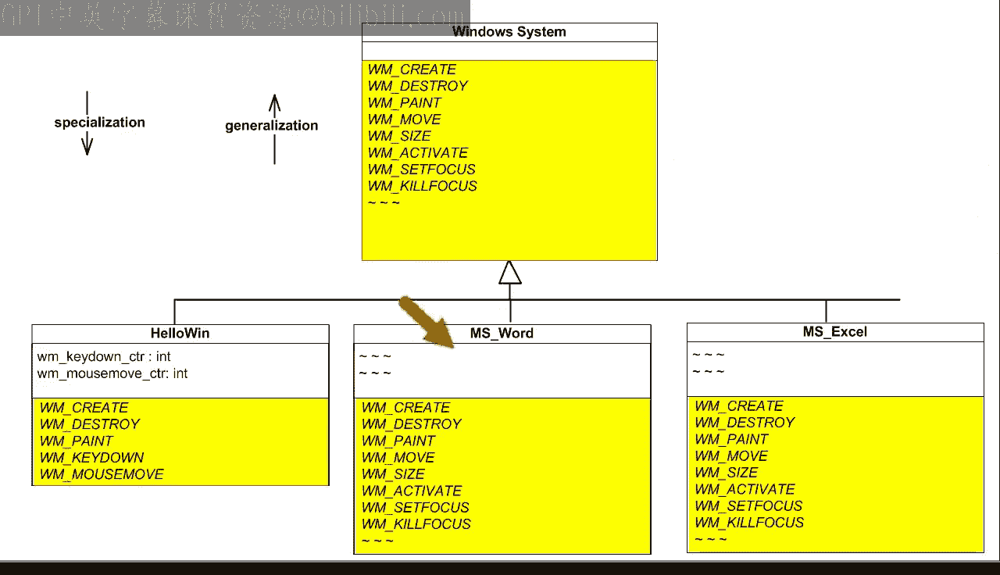

但是，如果不将其与传统的顺序编程以及代码中阻塞的作用进行对比，任何关于事件驱动编程的介绍都无法给你正确的理解。这正是我想在本课最后几分钟简要解释的内容。

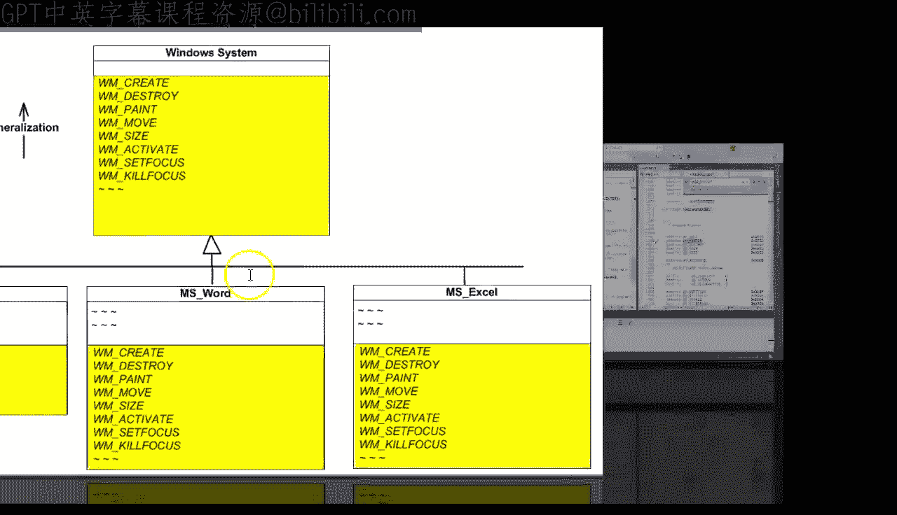

作为顺序编程的例子，让我从第27课关于实时操作系统（RTOS）中提取一些代码。例如，这里是顺序编码的 `blinky3` 线程，它在Tiva C LaunchPad开发板上闪烁红色LED。

那么，让我们尝试在你的事件驱动 `WndProc` 中做类似的事情。例如，假设你想在按下键盘上的任何键后短暂闪烁一个LED。从之前的代码回顾中，你知道在 `WndProc` 中的正确位置是处理按键的 `WM_KEYDOWN` 分支。

传统的顺序实现将是打开LED，然后等待（即阻塞）大约200毫秒以实际看到闪烁，然后关闭LED。Windows API实际上提供了一个等同于RTOS `delay` 服务的函数，称为 `Sleep`。Windows的 `Sleep` API会阻塞并等待指定的毫秒数。另外，你的Windows电脑上显然没有LED，所以你可以简单地将LED状态作为文本显示在窗口中心。

与所有其他情况一样，在更改要显示的文本后，你需要使窗口矩形无效以强制重新绘制窗口。在 `Sleep` 延迟之后，你将LED文本更改为“关”，并再次使窗口矩形无效。

作为其他状态变量，LED文本指针需要在 `WndProc` 中定义为静态。最后，你需要通过将LED文本添加到显示的字符串缓冲区来增强窗口的绘制。

现在，让我们简单地构建并运行这个程序。当你按一次键盘时，LED状态没有按预期改变，尽管键盘计数器递增了。所以你的LED代码没有像你想象的那样工作。

但等等，情况变得更糟：当你快速连续按下几个键时，程序会冻结，并且不会立即更新键盘计数器。然后，过了相当长一段时间后，键盘计数器突然跳增了一大截。实际上，当你按下几个键并同时晃动鼠标时，应用程序中没有任何反应，两个计数器都不会递增，直到键盘和鼠标计数器都突然跳增一大截。

所有这些显然都不好，因为应用程序看起来冻结且无响应。此外，显示的事件计数器的大幅跳跃也相当奇怪。

事实证明，这种行为是Windows内部异步事件发布和事件排队的结果。问题是 `Sleep` 延迟阻塞了 `WndProc`，阻止它快速返回到事件循环。当事件循环旋转得太慢时，键盘事件会在事件队列中累积。只有当所有带有阻塞延迟的 `WM_KEYDOWN` 消息最终都被处理后，事件循环才会解除阻塞并快速处理所有其他事件。因此，计数器值会突然跳跃。

这个问题是众所周知的，Windows程序员有一个名字来形容它：他们称这样的应用程序为“猪”。相信我，你不想成为一只猪。Windows程序的老规矩是，如果任何操作需要超过大约100毫秒，就应该通过使用事件将其分解成更短的部分。

这就解释了你的程序缺乏响应性和冻结的原因。但请记住，按键事件后的LED更新实际上并没有起作用。其原因甚至更有趣。

从事件驱动的角度来看，代码中的每个阻塞调用（如 `Sleep`）实际上意味着等待某个事件发生。那么解除阻塞就意味着该事件已经发生。解除阻塞后你得到的事件可能没有明确命名，但它仍然是在处理另一个事件（本例中是 `WM_KEYDOWN`）的过程中传递的。但这违反了事件处理的**运行至完成**语义，而事件驱动的Windows系统假设了这种语义。

具体来说，在阻塞 `Sleep` 之前调用 `InvalidateRect` 是无效的，因为此时 `WndProc` 没有返回给Windows。因此，Windows没有机会向 `WndProc` 发送 `WM_PAINT` 消息来实际更新LED状态。因此，你永远看不到更新。

所以，正如你所看到的，在事件驱动系统中使用顺序编程范式，尤其是阻塞，是一个坏主意，原因有二：首先，它会堵塞事件循环，破坏程序对所有事件的响应性，而不仅仅是那些阻塞一段时间的事件。其次，它违反了所有事件驱动系统普遍假设的运行至完成语义。

这是本课我希望你记住的最重要的要点：顺序编程和事件驱动编程是两种不同的范式，它们不能很好地混合。所以始终将它们分开。这意味着在事件驱动程序中，你需要使用真正的事件驱动解决方案来实现按键后LED闪烁的功能。

为此，你可以使用Windows专门为此目的设计的设施，称为**定时器**，而不是顺序阻塞使用 `Sleep`。你可以设置定时器在未来指定的毫秒数生成一个特殊事件，称为 `WM_TIMER`。这就是你在 `WM_KEYDOWN` 分支中真正需要做的全部，因为其余的处理随后会进入 `WM_TIMER` 分支。当然，你需要以通常的方式完成处理，唯一的额外步骤是调用 `KillTimer`，否则Windows定时器将按照编程的间隔周期性地持续到期。有趣的是，在这种情况下，你使用了 `wParam` 消息参数，该参数在此情况下保存了生成 `WM_TIMER` 消息的定时器的ID。

现在让我们看看这是如何工作的。首先，从单独的按键开始。如你所见，每次按键后，LED状态会短暂变为红色然后关闭。现在，让我们尝试连续按键爆发，同时晃动鼠标。你可以看到LED状态正确变化，并且事件计数器持续更新，因此应用程序保持响应。

本节课中我们一起学习了事件驱动编程的核心概念，包括事件循环、消息处理、异步传递、控制反转以及它与顺序编程的根本区别。我们还通过一个Windows GUI示例，看到了在事件驱动系统中使用阻塞的危害以及正确的解决方案。

### 总结

这结束了使用GUI和Windows API作为示例对事件驱动编程的快速介绍。你学到了相当多的新概念，这些概念总结在此图表中供你参考。要被称作事件驱动，一个程序必须具备此图表中列出的大多数特征，但或许将事件驱动程序与顺序程序最区分开来的属性是：**应用程序级代码内部没有阻塞**。

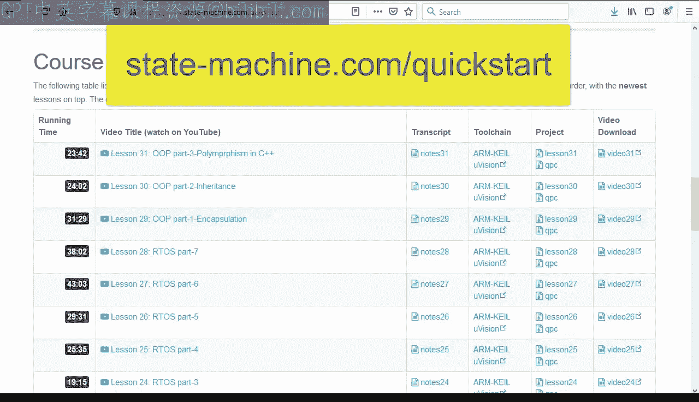

我将在下一课中回到这个问题，在那里你将学习事件驱动编程如何应用于像你的Tiva C LaunchPad开发板这样的实时嵌入式系统。我希望你能加入我，享受这个乐趣。