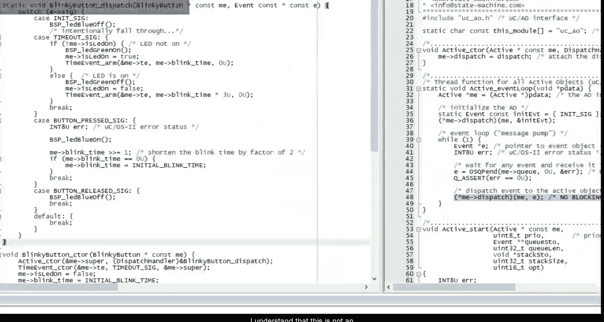
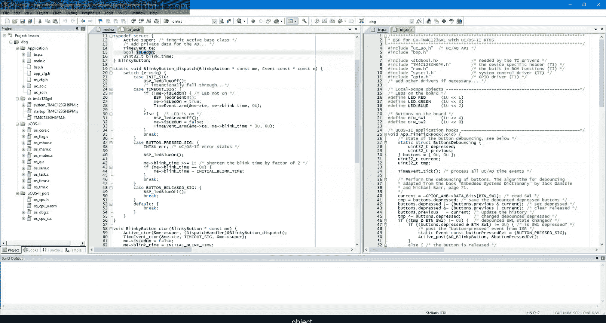
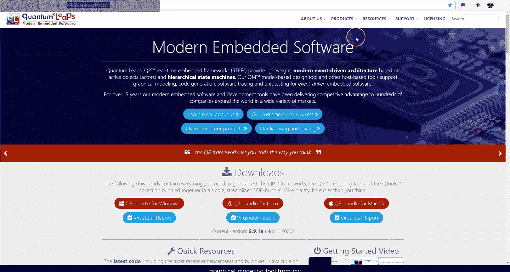
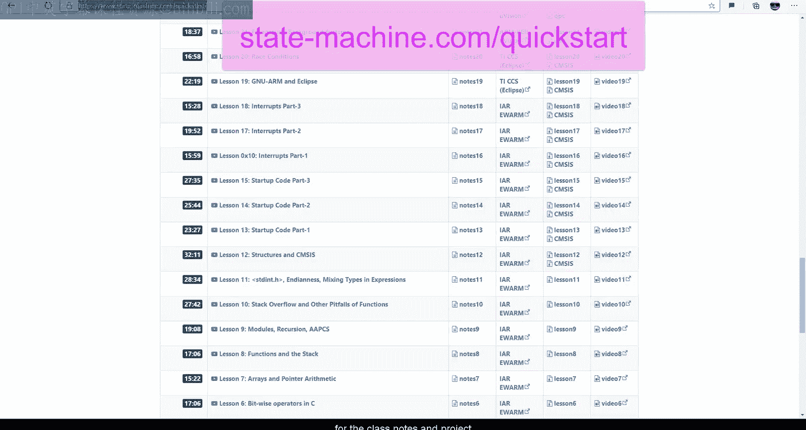

# 现代嵌入式系统编程：35：状态机（第一部分）- 什么是状态机？🤖


## 概述
在本节课中，我们将开始学习状态机。状态机是事件驱动编程和上节课介绍的主动对象模式的自然延伸，它能有效解决事件驱动系统中手动管理上下文（如使用标志位）所带来的问题。我们将探讨状态机的核心概念、其图形化表示，并动手将一个简单的“闪烁按钮”主动对象重构为状态机实现。



## 从事件驱动到状态机
上一节我们介绍了并发编程的最佳实践以及主动对象设计模式。我们构建了一个名为 MicroCAO 的框架，并实现了一个“闪烁按钮”应用。然而，该示例暴露了事件驱动方法的一个潜在问题：为了在事件之间记住绿色 LED 的状态，我们不得不引入一个名为 `isLedOn` 的布尔标志。


在传统的顺序代码（如使用 `osDelay` 阻塞的线程）中，这种上下文是自动通过调用栈维护的，但代价是需要大量 RAM。事件驱动代码无法阻塞，必须在每个事件处理后返回事件循环，因此失去了栈上下文，转而需要手动管理上下文（如使用标志和变量）。对于简单应用，这似乎可行，但在复杂的现实项目中，这种方法极易导致代码混乱、难以维护。

## 状态：相关历史的等价类
手动管理上下文反映了开发者的一个正确直觉：我们不需要记住所有过去事件的全部历史，只需记住那些影响系统未来行为的相关部分。系统未来行为只依赖于其“相关历史”。

例如，一个键盘控制器根据 Shift 键是否被按下来决定输出大写或小写字符。这个行为只依赖于 Shift 键的状态，而与之前按过其他哪些键无关。因此，键盘的整个相关历史可以简化为两个等价类：**正常状态**（输出小写）和**Shift状态**（输出大写）。

**状态** 就是系统过去历史的这样一个等价类，该等价类中的所有历史都导致系统未来行为完全相同。因此，状态是相关历史的最有效表示，它抽象掉了所有不相关的细节，只保留了影响未来的最小信息。



## 状态机与状态图
状态的概念自然引出了**状态机**的概念。一个状态机是所有可能状态的集合（即所有相关历史的等价类），以及状态之间转换的规则。这些规则称为**转换**，由那些能改变相关历史（即影响未来行为）的事件触发。



状态机的一个优点是它拥有直观的图形化表示——**状态图**。在现代统一建模语言（UML）中：
*   **状态** 用圆角矩形表示，名称写在名称栏中。
*   **常规转换** 用带箭头的线表示，线上标有触发事件。
*   **内部转换** 不会导致状态改变，仅执行动作，它被列在状态框内部。
*   动作可以在两种转换上执行，写在 `/` 字符之后。
*   每个状态机都需要一个**初始转换**，指向状态机创建后的默认状态。

所有状态机形式体系都有一个通用特性：**运行至完成（RTC）**事件处理。RTC 意味着状态机一次只能处理一个事件，必须完全处理完当前事件，才能开始处理下一个。这与我们上节课学习的主动对象（以及所有事件驱动系统）的语义完全匹配。因此，状态机是定义主动对象行为的理想机制。

## 设计“闪烁按钮”状态机
现在，让我们为“闪烁按钮”主动对象设计一个状态机，以取代之前的 `isLedOn` 标志。

以下是设计过程：
1.  **初始转换**：这是起点。初始转换的动作是：关闭绿色 LED，并设置一个在“关闭时间”后触发的超时事件。这些动作定义了默认状态是 LED 的“关闭”状态，因此我们将其命名为 `off`。
2.  **`off` 状态**：
    *   当 `TIMEOUT` 事件到达时，需要开启绿色 LED 并为“开启时间”设置新的超时。这意味著系统不能再停留在 `off` 状态，因此需要一个新状态 `on`。我们创建一个指向 `on` 状态的转换，并执行上述动作。
    *   此外，`off` 状态还需要处理 `BUTTON_PRESSED` 和 `BUTTON_RELEASED` 事件。这些事件不改变 LED 的闪烁状态（即不改变 `off` 状态本身），因此使用**内部转换**处理：`BUTTON_PRESSED` 时开启蓝色 LED 并缩短绿色 LED 闪烁周期；`BUTTON_RELEASED` 时关闭蓝色 LED。
3.  **`on` 状态**：
    *   当 `TIMEOUT` 事件到达时，需要关闭绿色 LED 并为“关闭时间”设置新的超时。这导致状态转换回 `off` 状态。
    *   `on` 状态同样需要处理 `BUTTON_PRESSED` 和 `BUTTON_RELEASED` 事件，其动作与在 `off` 状态中完全相同。目前我们只能重复这些内部转换，这提示了在更复杂系统中可能存在的问题，而**分层状态机**正是为解决此类代码重复而设计的。

## 在 C 语言中实现状态机
我们将采用最直接的方法在 C 语言中实现上述状态机，代码将放在主动对象的 `dispatch` 函数中。

首先，我们需要一个**状态变量**来记住当前状态。最直接的方式是使用枚举定义所有可能的状态：
```c
typedef enum {
    OFF_STATE,
    ON_STATE
} BlinkyState;
```
这个状态变量取代了所有手动管理的上下文标志（如 `isLedOn`）。

以下是 `dispatch` 函数重构为状态机的核心逻辑：
1.  **处理初始转换**：检查事件信号是否为 `INIT_SIG`。如果是，则执行初始动作（关闭蓝色 LED，设置初始超时），并将状态变量设置为 `OFF_STATE`。
2.  **状态分发**：使用 `switch` 语句，根据状态变量值跳转到不同的状态处理逻辑。
3.  **事件处理**：在每个状态的处理部分，再使用一个 `switch` 语句，根据接收到的事件信号执行相应操作：
    *   对于**常规转换**（如 `OFF_STATE` 中收到 `TIMEOUT` 转换到 `ON_STATE`），执行动作后需要更新状态变量。
    *   对于**内部转换**（如处理 `BUTTON_PRESSED`），执行动作后**不改变**状态变量。

通过这种映射规则，代码与状态图之间建立了清晰的对应关系，这带来了**可追溯性**（便于验证和审查）和**可扩展性**（添加新状态或事件时，修改位置明确）。



## 总结
本节课我们一起学习了状态机的基础知识。我们了解到状态是系统相关历史的等价类，是管理事件驱动系统上下文的最有效方式。状态机通过状态图和 RTC 语义，为主动对象的行为提供了清晰的规范。我们还将一个简单的“闪烁按钮”示例从使用标志位的手动上下文管理，重构为基于显式状态机的实现，从而提高了代码的结构清晰度和可维护性。在下一节课中，我们将探讨状态机的其他变体，以及关于状态机的常见误解。