# 现代嵌入式系统编程：第37课：输入驱动型状态机


## 概述

在本节课中，我们将学习状态机的另一种重要类型——输入驱动型状态机。我们将探讨其硬件起源、工作原理、与事件驱动型状态机的区别，并通过一个实际的代码示例来理解其实现和应用场景。

## 状态机的硬件起源

上一节我们介绍了事件驱动型状态机，本节中我们来看看状态机概念的起源。要更广泛地理解状态机，我们需要回到它的起点。

状态机的概念起源于近70年前。在20世纪50年代，贝尔电话公司的乔治·摩尔和爱德华·米利发表了关于数字电路形式化综合方法的开创性论文。这些论文概述了状态机在设计此类电路中的实用性。

最重要的观察之一是，状态机起源于硬件设计，因为当时软件尚处于起步阶段。事实证明，这深刻地影响了状态机，以至于即使在今天，软件中使用的状态机仍然带有许多来自其硬件起源的痕迹。

## 组合逻辑与同步电路

摩尔和米利关注的是具有内部存储器或某种状态的数字电路。为了理解其挑战，我们首先考虑没有内部状态的数字电路。

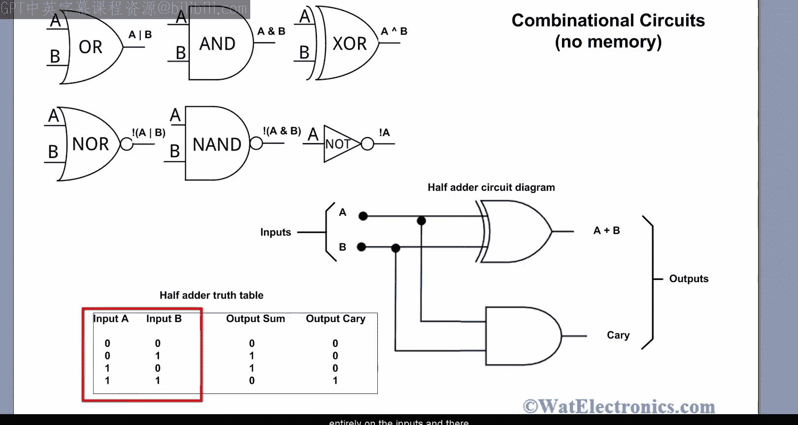

这类电路称为组合逻辑电路，例如或门、与门、异或门、反相器以及这些元件的组合。例如，下图是一个执行两个输入A和B相加的组合逻辑电路。它产生两个输出：A加B的和以及加法产生的进位。

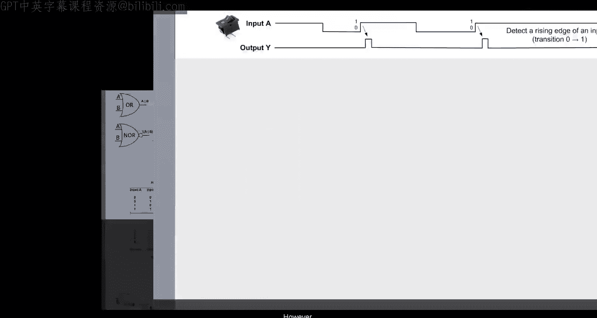

```
输入 A, B
输出 Sum, Carry
```

因为数字电路处理逻辑值，所以通常用真值表来描述它们。真值表完全描述了半加器电路的工作原理。输出仅完全依赖于输入，不需要记住任何过去的输入历史。

然而，考虑检测数字输入A的上升沿问题，即我们希望输出Y仅在输入A从0变为1时变为高电平。

```
问题：检测输入 A 的上升沿
条件：当 A 从 0 -> 1 时，输出 Y = 1
```

这个问题无法用任何纯组合逻辑解决，因为电路显然需要记住输入A之前的状态。

## 边沿检测电路示例

以下是完成此工作的电路示例。电路中最重要的新组件是D触发器，它只记住一位信息。这就是电路的状态。此外，现在有一个连接到触发器的周期性时钟信号，它控制触发器何时存储新信息。这个时钟为系统提供了一个全局事件，并决定了输入和输出何时被允许改变。

由时钟驱动的电路称为同步电路，摩尔和米利主要关注同步电路。有许多原因导致至今基本上只使用同步电路。

边沿检测电路还有两个纯组合逻辑块：一个用于根据当前输入和当前状态确定输出，另一个逻辑块用于确定下一个状态。

电路的工作原理可以再次用真值表描述，但这次表格还需要列出系统的先前状态和下一个状态。根据真值表，输出Y仅在A之前为0且现在为1时为1。

## 米利型与摩尔型状态机

乔治·摩尔和爱德华·米利原始文章的一个重要见解是通过命名系统的状态来抽象它们，然后应用自动机理论将真值表信息描述为状态图。

状态名称与触发器输出值之间的关联称为二进制编码。在这里，编码特别简单：状态名S0分配给触发器值0，S1分配给值1。

有了这种编码，你可以绘制出米利提出的状态图。状态用标有其名称的圆圈表示。从状态出发的箭头对应于真值表中的行，在米利表示法中，它们标有可能的输入值以及每种情况下产生的输出。

这个电路被称为米利状态机，因为输入和输出的组合逻辑之间存在直接连接。

然而，通常最好将输入与输出分离，只允许当前状态决定输出。这导致了更受限制的电路，称为摩尔状态机。

摩尔状态机通常比米利状态机需要更多的状态来执行等效功能。另一方面，输入A和输出Y的组合逻辑之间没有直接连接。只有当前状态（即触发器的输出）影响输出Y。

摩尔状态图略有不同，因为转换仅用输入标记，而输出被放置在状态内部，因为输出仅依赖于状态。

## 通用状态机结构

以下是具有内部状态的电路的通用结构。电路的核心组件是由多个D触发器组成的当前状态寄存器，它们都由公共时钟信号驱动。当前状态位和所有输入位都被馈送到组合逻辑块，该逻辑块决定下一个状态。然后，下一个状态被反馈到状态寄存器，在下一个时钟周期成为当前状态。当前状态也被馈送到另一个组合逻辑块以生成输出。此外，仅在米利机中，输入也被馈送到该输出逻辑块。

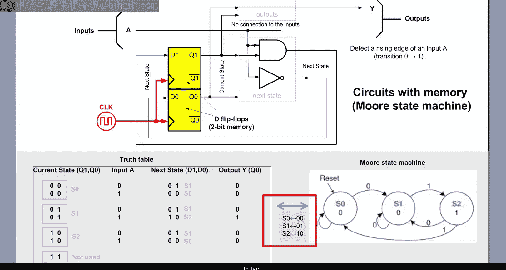

电路的同步性质反映在时序图中。同步意味着所有信号仅在时钟为高电平时才允许改变，并且在时钟为低电平时必须保持稳定。当然，这将所有一切都与时钟绑定，并且限制性很强。

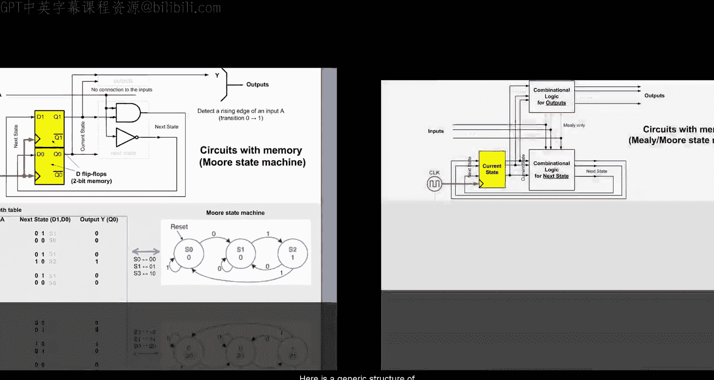

没有时钟的电路是可能的，称为异步电路。事实上，原始的米利论文也讨论了这种电路。但它也提到了异步电路的最大问题：竞争条件。硬件中的竞争条件问题非常棘手，以至于至今几乎所有数字电子设备（包括所有嵌入式CPU）都是同步的。

但即使是同步电路也不能完全避免竞争条件。例如，米利状态机的输出上升得更早一个时钟周期，因为它直接响应输入，而不是等待状态改变。但这种更快的反应有时会导致竞争条件，因为电路的状态可能与输入在同一时钟周期内改变，因此这两个变化可能相互竞争。

由于这些原因，摩尔状态机通常更受青睐，尽管它们比米利机稍慢且稍复杂。

## 软件中的状态机

现在的问题是，所有这些与软件中使用的状态机有什么关系？如果你在网上搜索软件状态机，你很可能会看到类似这样的图。这些显然是状态机，但它们与本视频课程第35课和第36课中学到的事件驱动型状态机非常不同。

我指的不是状态表示从圆圈变为圆角矩形这种表面变化。我指的是驱动状态转换的真正差异，因为这些显然不是事件。相反，转换标有输入，以及由这些输入构建的表达式。例如，你可以看到包含逻辑或、与以及比较（如等于、大于或仅为真或始终）的表达式。

那么这是怎么回事？这些输入是什么？这一切都直接追溯到硬件状态机，在硬件中，输入只是位或位组。在软件中，可以改变的位组称为变量。例如，一位输入可以表示为一个布尔变量 `pilot_lever`，它可以取值 `UP` 或 `DOWN`。另一个输入，如毫秒计数器，可以是一个16位变量，取值从0到2^16，等等。

但此时，我希望你注意到一些熟悉的东西。是的，这些输入的布尔表达式正是上一课第36课中学到的守卫条件。实际上，在更高级的工具中，例如MathWorks（制作MATLAB和Simulink的公司）的Stateflow，转换明确标有守卫条件，因为你可以看到特征性的方括号。

## 输入驱动型状态机的执行时机

下一个更大的问题是：这些状态机何时运行？何时等待？对于事件驱动型状态机，这一点非常清楚。事件驱动型状态机仅在有待处理的新事件时运行。此外，当没有可用事件时，事件驱动型状态机只是等待，意味着它什么都不做。

但输入驱动型状态机不同。它们“始终”或“周期性”运行，通常你可以从图表中知道其运行频率。有时状态机会在上下文中显示，例如在Simulink模型中，从这个更广泛的上下文中，你可以猜测状态机必须由某个时钟驱动，这意味着周期性执行。

但其他这种类型的状态机始终运行。例如，状态机经常直接从主函数的 `while(1)` 超级循环中执行。

你也在本视频课程中遇到过这样的状态机，在第21课关于前后台系统的内容中，我向你展示了闪烁实现的非阻塞状态机版本。

从 `while(1)` 超级循环执行的状态机占用所有可用的CPU周期，无论是否有事件需要处理。

## 术语与分类

关于这类状态机的术语，似乎没有完全确立。我已经使用了“输入驱动型状态机”这个术语。但我也见过其他名称，比如“控制器状态机”，因为这类状态机通常用于过程控制，如Simulink模型中所示。我还见过“周期性状态机”，因为它们通常周期性执行。然而，这个名称暗示了明确定义的执行周期性，而 `while(1)` 超级循环中的简单状态机可能以非常不规则的方式执行。

例如，当当前状态中的所有守卫条件评估为假时，状态机可能在几微秒内完成。但当某些守卫评估为真时，执行可能需要许多毫秒。这意味着有几个数量级的差异，很难谈论任何明确定义的执行周期。

这导致了用于描述这类状态机的另一个术语：“轮询状态机”。这个术语抓住了这样一个事实：这类状态机不断轮询输入，以发现需要处理的真正有趣的事件。换句话说，这类状态机结合了通过轮询输入发现事件和状态机逻辑。

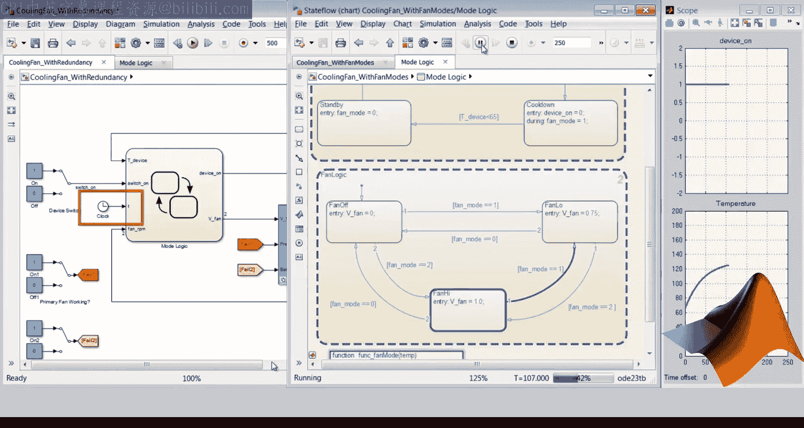

从这个意义上说，你可以将状态机的输入视为“原始事件”。也就是说，输入是需要被轮询并在守卫表达式中组合以提炼出真正有趣事件的变量。

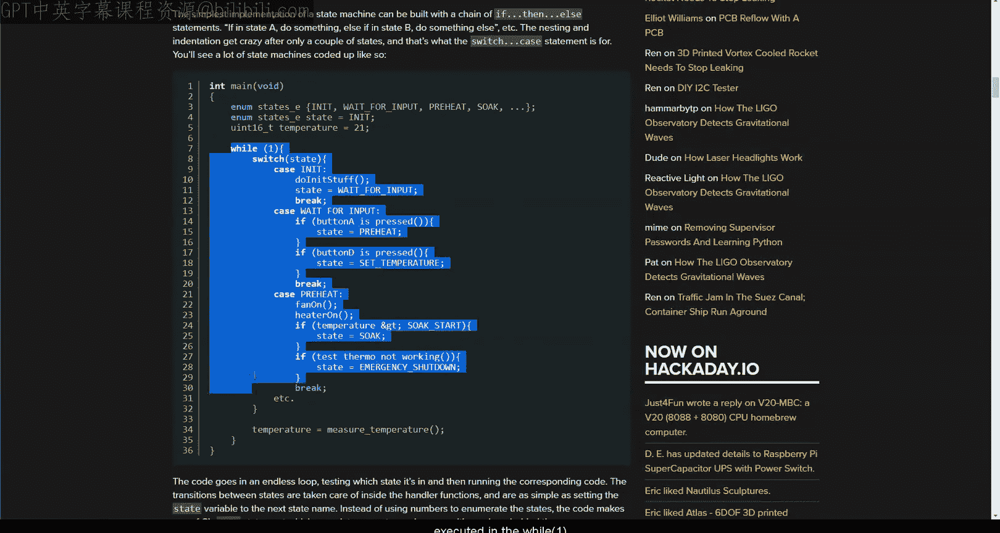

## 输入来源与共享数据问题

说到输入，它们通常外在于状态机，要么直接来源于外设寄存器，要么来源于中断。例如，状态机中的按钮输入是从Arduino函数 `digitalRead` 中的GPIO寄存器读取的。同样，变量 `time` 是从函数 `millis` 返回的毫秒计数器中读取的。毫秒计数器在Arduino的系统时钟滴答中断中更新。

这里的要点是，外部输入是在并发实体（如外设和中断）之间共享的变量。我真的希望到目前为止，在本视频课程中，你已经学会对任何此类共享保持非常谨慎的态度，因为任何与代码执行异步变化的东西都可能导致竞争条件、数据损坏和此类其他问题。

由于这些原因，输入驱动型状态机可以与前面提到的异步电路相比较，而事件驱动型状态机则与同步电路相比较。这只是一个类比，不是精确的等价，所以请不要过分引申。但这种比较的主要原因是驱动输入驱动型状态机的输入的异步性质。


外部输入可以在任何时候改变，包括在状态机处理期间。相比之下，事件驱动型状态机中的事件是排队的，并保证在整个运行到完成步骤期间不会改变。

## 示例：飞机起落架状态机

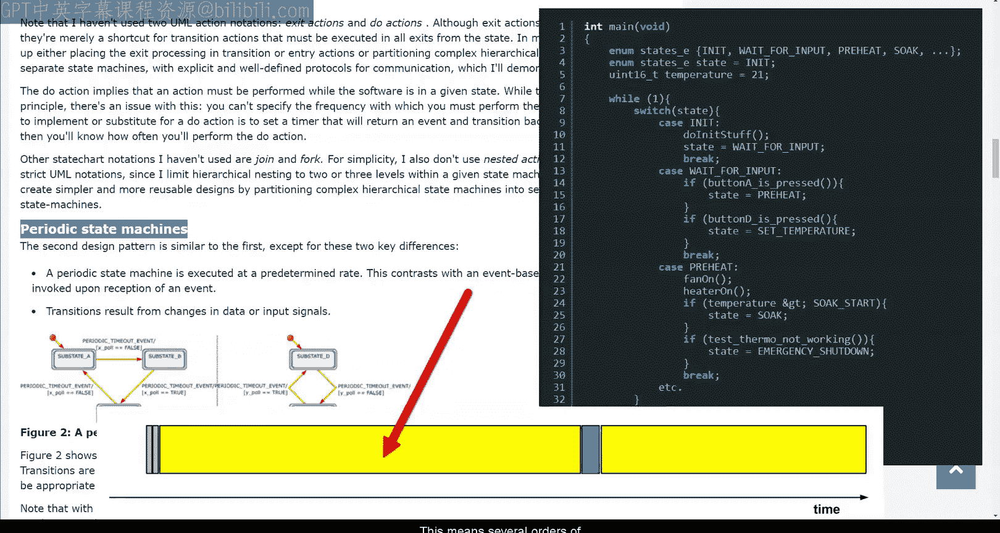

例如，考虑一篇流行文章《嵌入式状态机实现》中的输入驱动型状态机。该文章中用作示例的状态机控制飞机的起落架。它直接从 `while(1)` 超级循环调用，并且恰好实现为一组保存在数组中的函数，每个函数代表一个状态。我将在未来的课程中讨论各种状态机实现。

但今天，让我们只关注输入，其中包括 `gear_lever` 变量。状态 `gear_down` 中守卫条件的意图是通过测试 `gear_lever` 的当前值以及存储在局部变量 `prev_gear_lever` 中的先前值来检测该输入的上升沿。

现在，在 `gear_down` 状态的函数内部，如果 `gear_lever` 变量在中断中异步改变，或者直接从GPIO寄存器读取（例如），它在守卫条件被评估时可能是 `DOWN`，但在值存储到 `prev_gear_lever` 时可能变为 `UP`。如果发生这种情况，该输入的上升沿将被错过，守卫条件将永远不会评估为真。这架飞机将永远不会起飞。

请注意，无论 `gear_lever` 输入是直接访问还是可能通过类似Arduino的 `digitalRead` 的函数访问，都无关紧要。

## 解决方案：输入缓冲

解决此类问题的方法当然是缓冲输入。我的意思是将外部输入的值复制到局部变量中，这些局部变量保证在状态机的运行到完成步骤期间不会改变。

为了向你展示这在实践中如何工作，并最终为本课编写一些代码，让我们回到第21课关于前后台系统的内容。

## 实践：改造闪烁状态机

为了基于那节课构建今天的代码，将第21课的目录复制到第37课。进入新的第37课目录，双击项目文件在Keil Microvision IDE中打开它。

为了快速提醒你，在第21课结束时，你看到了直接在 `while(1)` 超级循环中实现的闪烁应用程序的非阻塞实现。这正是你今天正式学习的输入驱动型状态机。

这个输入驱动型状态机使用基于当前状态的常用 `switch` 语句编码，在每个状态的每个 `case` 中，你可以看到特征性的 `if` 语句。这些是输入驱动型状态机典型的守卫条件。

以下是状态机的逆向工程状态图。如你所见，动作仅与转换相关联。所以这是一个米利型状态机。

现在，状态机只有一个输入，由 `BSP_TickCounter` 函数提供。该函数读取 `l_tickCounter` 变量，该变量在SysTick处理程序中断中不断更新。

因此，`tickCounter` 输入确实相对于后台循环的执行是异步变化的。同样，在这个状态机代码中，你可以看到 `tickCounter` 输入在每个状态中被访问了两次，因此在每个访问点它可能不同，因为它是异步变化的。

在这个小的玩具示例中，这恰好是可以容忍的，但缓冲仍然会使它对任何未来的修改更加健壮。

还要注意，无论输入是直接访问还是通过像 `BSP_TickCounter` 这样的函数调用访问，输入的异步性质都不会改变。

## 第一步：缓冲输入

因此，首要任务是将 `tickCounter` 输入缓冲到局部变量 `now` 中，以便输入在状态机的每个运行到完成步骤中只读取一次。在设置局部变量之后，你现在可以用该局部变量 `now` 替换所有对 `BSP_TickCounter` 的直接引用。

让我们快速检查一下这是如何工作的，构建代码并直接加载到开发板上。绿色LED仍然快乐地闪烁。

## 扩展功能：添加按钮控制

现在，让我们通过添加类似于前两课第34课和第35课的闪烁按钮功能来扩展这个示例。这将给你一个机会添加第二个输入：SW1按钮。

今天的任务是对SW1按钮做出反应，按下时应点亮蓝色LED，释放时应关闭蓝色LED。

你首先通过添加访问SW1按钮的BSP函数来开始编码这个新功能。该函数的实现将直接读取GPIO寄存器，如果非零则返回1，否则返回0。

你还必须不要忘记定义SW1按钮位，并将SW1开关配置为启用了数字功能和上拉寄存器的GPIO输入。

现在，在实际的状态机内部，你添加自动变量 `button` 用于缓冲状态机的按钮输入。你通过调用新的 `BSP_SW1` 函数来初始化它。此外，为了检测按钮输入的变化，你需要记住按钮的先前值，存储在静态变量 `prev_button` 中。你将这个 `prev_button` 初始化为SW1按钮的非活动状态，即1。

现在，你添加守卫条件来检测下降沿，即先前按钮不为0且当前按钮输入为0的情况。作为动作，你点亮蓝色LED，并将当前按钮保存到 `prev_button`。由于这实际上是一个内部转换，你不改变状态变量。

否则，你添加守卫条件来检测上升沿，即先前按钮为0且当前按钮输入不为0的情况。作为动作，你关闭蓝色LED，并再次将当前按钮保存到 `prev_button`。同样，由于这实际上是一个内部转换，你不改变状态变量。

现在，你将相同的按钮反应复制并粘贴到另一个 `ON` 状态的 `case` 中。

输入驱动的按钮状态机现已准备就绪，因此你可以清理一些未使用的代码并构建项目。让我们检查一下它是如何工作的。

## 测试与逻辑分析仪观察

将代码加载到开发板后，你可以看到绿色LED仍然像以前一样闪烁，按下SW1按钮会点亮蓝色LED。

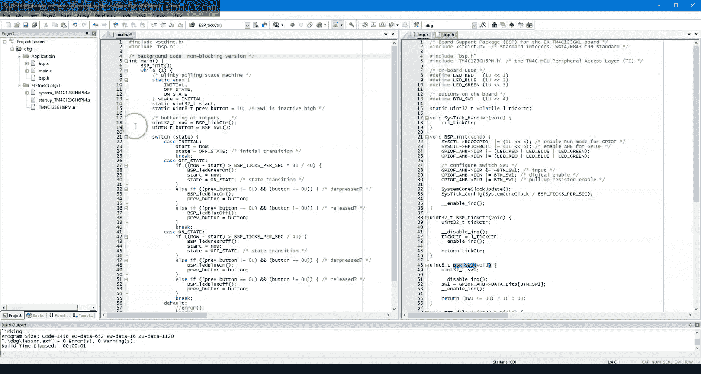

但为了更精确地观察，我将使用逻辑分析仪。在这个视图中，顶部标记为SW1的白色迹线显示按钮输入模式。下面的三条迹线分别显示红色、绿色和蓝色LED。触发器设置为SW1的下降沿，所以当我启动逻辑分析仪时，只有绿色LED按预期切换。

现在，当我按下并释放SW1按钮时，迹线触发并停止。如你所见，按下SW1会点亮蓝色LED，释放SW1按钮会关闭蓝色LED。这一切都完全符合预期。

但如果你仔细观察，你可以看到在这种情况下，SW1迹线在稳定到按下状态之前反弹了一次。这当然是你在第27课已经遇到过的电触点弹跳。

在这种特定情况下，你的状态机跟上了噪声信号，并设法点亮和关闭蓝色LED。但有时状态机跟不上弹跳，就像在这个释放按钮的情况下。这在你的特定应用中可能可以接受，也可能不可接受，但问题是你无法控制。这都是因为输入采样与输入驱动型状态机的执行速度耦合在一起，而执行速度可能根据状态机当时正在做什么而有很大差异。

## 输入驱动与事件驱动的转换

因此，在需要跟上输入变化的应用中，如果输入变化可能快于状态机最坏情况采样率，你可能需要将输入轮询与状态机执行解耦。

这种解耦为你提供了预处理原始输入的机会。例如，你可能需要对原始SW1按钮输入进行一些数字滤波，如去抖动。然后你需要添加一些输入缓冲或排队层，以免丢失输入。

但这越来越导向事件驱动型状态机。因为实际上，每个输入驱动型状态机都可以很容易地转换为事件驱动型状态机。

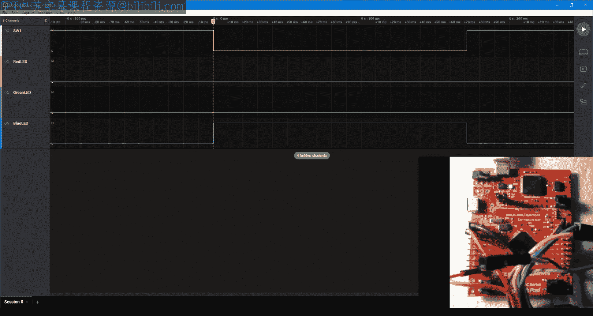

为了了解如何转换，只需回到代码并查看缓冲的输入。如果你简单地将它们包装到一个结构中，并命名其实例为 `evt`，你就创建了一个事件，其中输入成为事件参数。这种输入分组还有一个额外的好处，即将代表一致快照的输入打包在一起。

现在一个有趣的问题是这种事件的信号是什么。这取决于你的状态机何时以及如何运行。如果它只是尽可能频繁地运行，比如在 `while(1)` 超级循环中，你可能会称这个事件为通用“采样”。这是一个低质量的事件，重复率相当不稳定。

但要完成输入驱动型状态机到事件驱动的转换，你可以添加指向事件实例 `evt` 的指针 `e`。这样，所有输入现在都作为事件参数通过事件指针 `e` 访问。

我希望你能看到这段代码如何开始类似于前几课中事件驱动型状态机的分发函数。

让我们尝试构建这个版本并检查它是如何工作的。同样，绿色LED像以前一样闪烁。SW1按钮点亮和关闭蓝色LED。

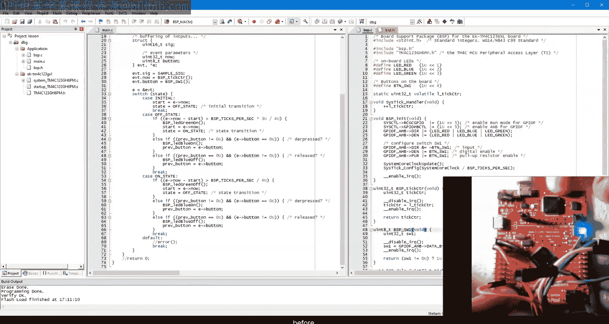

但在逻辑分析仪中，你仍然可以捕捉到按钮输入弹跳和状态机不可靠响应的实例。当然，这是可以预料的，因为现在在事件内部的单次缓冲输入并没有改变状态机的执行速率。

## 核心观察：可靠性与环境

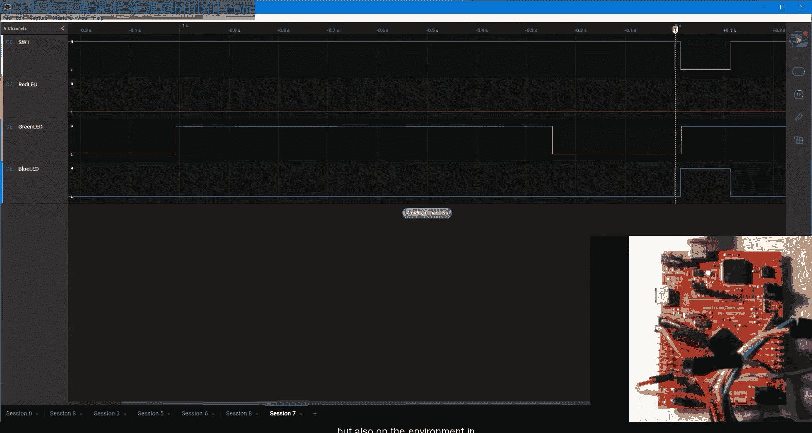

因此，这也许是本课最重要的观察：状态机的可靠性和健壮性不仅取决于其类型（输入驱动型与事件驱动型），还取决于状态机运行的环境。

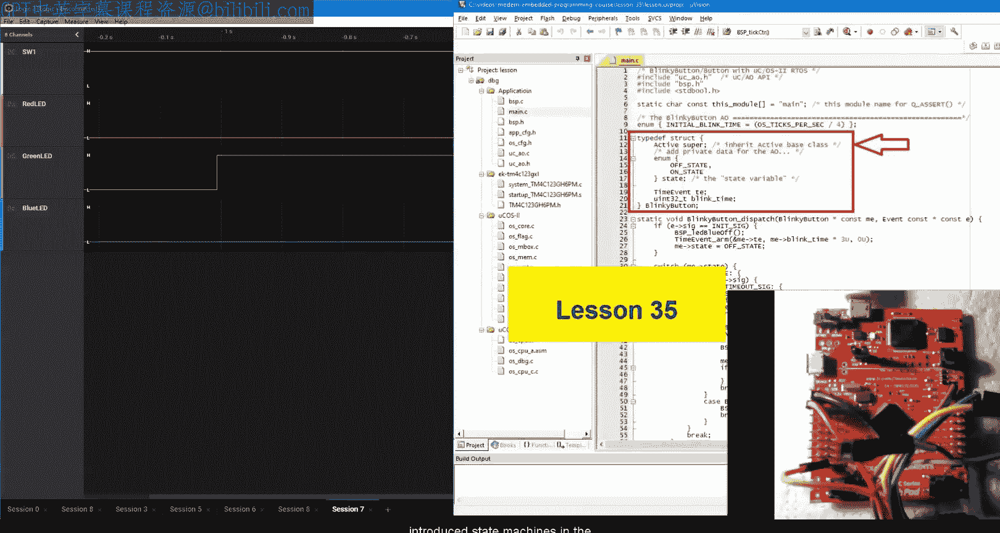

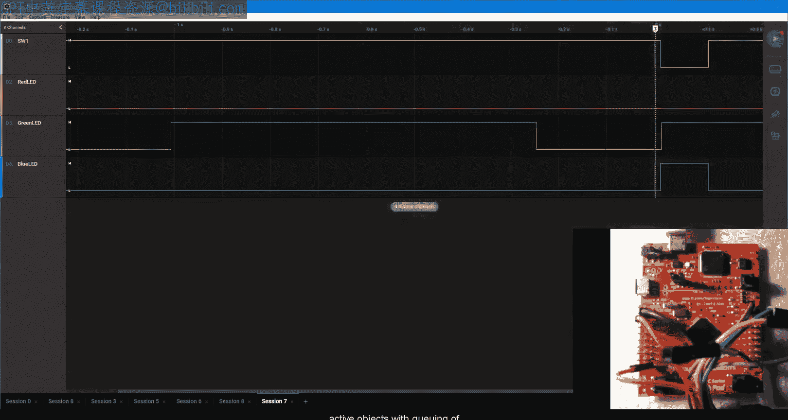

这正是为什么我在第35课中在事件驱动的活动对象（带有事件排队）的上下文中介绍状态机。

但状态机应用形成了一个完整的谱系：从在 `while(1)` 超级循环中执行且没有任何输入缓冲的输入驱动型状态机，到具有通用事件和守卫条件的日益事件驱动的状态机，再到在具有完整事件排队的活动对象内部运行的完全事件驱动型状态机。

所有这些并不意味着输入驱动型状态机都是坏的。相反，在外部事件发现和排队困难或不切实际的情况下，输入驱动型状态机带来了一系列优势。

## 适用场景

例如，计算机游戏周期性地执行代码，以响应通用的“帧”事件，该事件每秒发生30或60次。在计算机游戏中，有趣事件的发现很大程度上是游戏本身的一部分，在程序外部执行是不切实际的。例如，一个有趣的事件可能是某个敌人的接近。这是输入驱动型或周期性状态机的理想应用。

另一个应用领域是机器人技术，同样，机器人软件以一定的帧速率周期性运行，从机器人传感器中发现有趣的输入很大程度上取决于机器人试图做什么以及周围发生了什么。

最后，输入驱动型状态机对于为事件驱动型状态机发现外部事件非常有用。例如，前面提到的开关去抖动在前面的第35课和第36课中进行了演示。事实证明，去抖动算法是一个非常特殊的输入驱动型摩尔型状态机，从系统滴答中断钩子中周期性运行。这实际上是32个同时运行的状态机，能够同时为32个开关去抖动。

但我必须将这个实现的讨论留到下一课，在那里我将专门关注各种状态机实现。

## 总结


本节课我们一起学习了输入驱动型状态机。我们探讨了其从硬件数字电路（米利机和摩尔机）起源的历史，理解了其基于输入变量和守卫条件进行轮询的工作原理。我们通过改造一个闪烁LED的状态机，添加了按钮控制功能，并演示了输入缓冲的重要性。最后，我们讨论了输入驱动型状态机与事件驱动型状态机的联系与区别，以及它们各自适用的场景（如游戏、机器人控制、作为事件发现器）。关键在于，状态机的可靠性不仅取决于其类型，更取决于其运行环境（如输入是否异步变化、是否有缓冲/排队机制）。