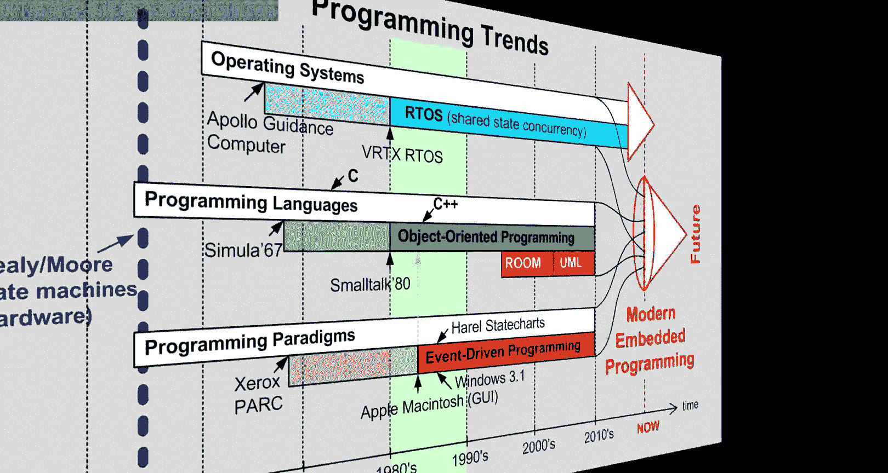
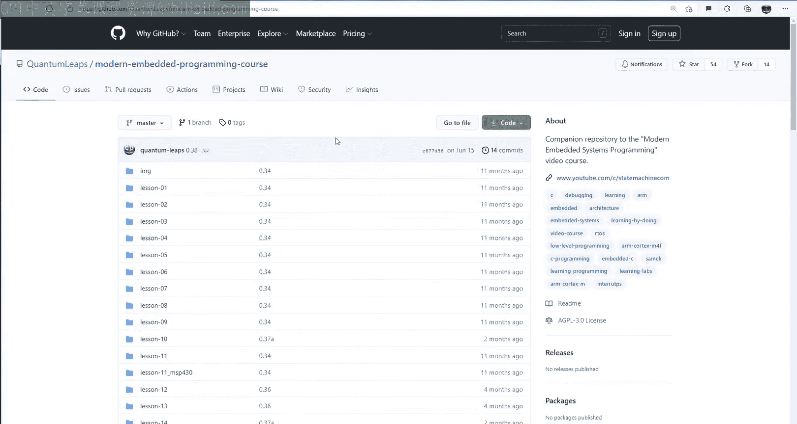

# Quantum Leaps《现代嵌入式系统编程Modern Embedded Systems Programming》中英字幕 p41 -41-#40 State Machines Part-6_ What is a Hierarchical State Machine_.zh_en -BV1fRt2efEms_p41-

。Hello and welcome to the modern andmed System programming course。 My name is Miro Samak。

 and in the sixth lesson on state machines， I would like to give you the first glimpse of modern hierarchical state machines。

Today， you will learn what hierarchical state machines are and how they differ from the traditional finite state machines。

 You will also get an idea how to implement state hierarchy in C。

 and you'll see which aspects are easy and which are harder to implement。🎼Finally。

 you'll report your time bomb application from the Toy microcrociIO framework to the professional QPC framework where hierarchical state machines are fully supported。

🎼う。As usual， let's start with copying the previous lesson 39 directory and renaming it to lesson 40。

Get inside the new lesson40 directory and double click on the project lesson to open it in the microvision IDE。

To remind you quickly what happened so far in the previous lesson。

 you've learned the optimal state machine implementation。

 which you evolved from an idealized domain specific language for state machines。

That's why the implementation was very readable with a clear one to one correspondence between the state machine elements in the diagram and the corresponding code。

 The implementation had also small memory footprint and was reasonably efficient in the CPU use。

But the optimal implementation has one more huge advantage。

 and that is that it is very easy to extend it to support the modern version of state machines。

 which will be the subject of this lesson。But I am getting ahead of myself because you first need to see the biggest problem with the traditional state machines。

To illustrate what I mean， suppose that you need to extend your time bomb application to allow the user to diffuse the bomb。

Specifically， the second button on the OV you launchpaboard should now diffuse the bomb and should turn the blue LED on to show that the bomb is diffused。

The most important aspect is that diffusing should work at any stage。

 including when the bomb already started to time out。In the state diagram。

 this means that you need an additional state diffused with an Android action that turns the blue LED on。

And then you need transitions trigger get by the button2 pressed event that leads to this new state。

The ability to always diffuse the bomb means that the button to press transition has to be added in all existing states。

 because otherwise the bomb would not diffuse reliably。Now。

 in your code to replicate the changes from the diagram。

 you'll need to add the new diffused state in the code， you typically work by copying。

 pasting and modifying the existing elements to reuse the established coding patterns rather than writing them from scratch。

So， for example， you can copy the boom state handler function and modify it for the diffused state。

Similarly， you can copy the button pressed transition and modify it for button 2 pressed。

Then to replicate the transition， you copy it and paste it in all the states。At this point。

 the time bomb state machine itself is done， but you still need to add the new button to press and release event signals。

And you need to modify the board support package to configure the GPIO for the SW2 button as input。

A tricky aspect here is that S W2 is multiplexed with the NmiI line on the Tva CMU。

 So before you can use it as an input， you need to unlock the access to this pin。

Only now you can configure the SW 2 pin as input， just like S W 1。

Once the pin is correctly configured， you need to generate and post the button to pressed events to the time bomb active object。

 which you copy and modify from the SW1 button。Here you take advantage of the switch debouncing algorithm。

 which was discussed in lesson than 37， and which allows you to deounce up to 32 signals simultaneously。

Before you build the code， though， please make sure that the compiler optimization is not set to minus Oz image size for some reason。

 which really looks like a compiler error。 The code will not work when the minus Oz optimization is selected。

The last step is， of course， to check how it works。Let's open the debugger。And run the code free。

When you press the SW2 button， the blue LED lights up。

 which means that you are in the diffused state。All right。 second test。

 reset the board and run the code of fee。 Now， press S W 1 button。 The time bomb starts to blink red。

 But when you press the S W 2 button， again， the blue LED lights up and the time bomb stops timing out。

So all is fine and then your diffusing feature seems to be working fine。

But suppose that you want to debug the new button to press transition。

 The problem is that you have now four of those。 So where would you put your breakpoint。

Even if you have enough break pointss， you are on the risk of missing some of the transitions。

For instance， suppose that you missed one right here。When you run the previous test again。

You typically hit one of your breakpoints。But， sometimes。

You take the transition without hitting the break point， so your debugging is unreliable。

Another facet of the same problem is with maintaining such code。 For instance。

 if you need to modify in some way the repeated transitions。

 you need to do this identically in all instances。It's just too easy to miss some of the instances or make slightly different changes in some places and thus introduce inconsistencies。

Well， all these problems are well known because all of them stem from violating one of the most important principles of software development。

 the Dr principle， which stands for don't repeat yourself。

Please note that the repetition in the code is ultimately the problem of the original state machine design。

 of which the code is merely a faithful reflection。As it turns out。

 this problem with repetitions in traditional state machines is fundamental and is known as the state transition explosion。

 What that means is that complexity of the state machine solution to a given problem tends to grow disproportionately faster than the complexity of the problem。

For example， an additional state and an additional transition in the time bomb state diagram would be an increase of complexity that is proportional to the increased complexity of the problem。

 But the four repeated transitions add the extra complexity。Of course。

 as the problem grows more complex， their repetitions pile up even faster and explode。

 making the traditional speed machines unworkable for bigger problems。

This is probably one of the main obstacles to widespread adoption of state machines in embedded software。

Fortunately， a very elegant solution to this problem has been known since the late 1980s when David Harrell invented advanced state machines that he called state charts。

The main innovation of state charts is the introduction of hierarchically nested states。

 and therefore state charts are also called hierarchical state machines。

So first let me show you how hierarchical state nesting looks。

 and then I'll explain how it works and how it helps to eliminate the troublesome repetitions。

So the extension of the state machine formalism is to allow states to contain other states。

Specifically in your time bomb state machine， you can surround the four of the original states with another state。

 which you can call armed。This introduces a state hierarchy in which state armed is at a higher level and therefore is called the superstate。

The internal states are then at the lower level and are called subs。

The meaning of the state hierarchy is that the behavior of the superstate applies to all its substates。

With this in mind， you can now move the button to pressed transition up one level to the armed superstate so that it applies to all four substitutes of armed。

The semantics associated with state nesting now means that while the state machine is in the sub state Wait for button and the button too pressed event occurs。

 the event is not ignored， as it would be the case in the traditional non hierarchical state machine。

 Instead， the event is propagated to the high level state armed。

 where it triggers the transition to diffused。On the other hand。

 if a sub already handles a given event， it will not be propagated to the superstate。

This is how substrates can override the behavior from the superstate。However。

 in case of your time bomb， the transition in the armed superstate is exactly what you want。

 so you can delete the repeated transition in all substate and rely on the common transition already defined in the superstate armed。

The end result is that you could replace the full repeated transitions with just one。

 so this is how state hierarchy allows you to get rid of the repetitions and instead capture the common behavior in the higher level states。

But at this point， I hope that you might remember already seeing something like that in this video course。

Well， actually， similar combination of abstraction and hierarchy came up already a few times before。

The more recent one was in lesson 33 about event driven programming on Windows with the original win 32 API。

In that lesson， you have seen how all Windows events are first passed to the window procedure。

 Win pro。But the events not handled explicitly there are not discarded。

 but rather passed on to the Windows system， where they are handled according to the characteristic。

 look and feel of the windows Gui。This mechanism is known under the names ultimate hook or programming by difference。

Another occasion when you've applied programming by difference was in lesson 30 about inheritance。

You learn that inheritance is a mechanism of capturing commonalities in a higher level superclass in order to reuse them in the lower level subclass。

So you can also think of hierarchical state nesting as a form of inheritance called behavioral inheritance in which substrates inherit the behavior from their superstate。

In fact， an alternative view of the time bomb state chart could be explicitly hierarchical。

 as shown on the left as the traditional inheritancery or in the nested form on the right。

 as in the QM model Explorer view。By the way， in a trivial like this。

 it's often convenient to think of the whole state machine as nested inside a single top state。

 which typically is not shown in the diagram， but turns out to be a useful concept for implementing hierarchical state machines。

Speaking of which， how would you code your updated time bomb hierarchical state machine？Well， again。

 let's first look at your existing code as a specification of a state machine。

 not just implementation。With this perspective， the question becomes how to unambiguously specify the hierarchical state nesting。

For this， you can take clues from other forms of inheritance like the class inheritance。

 where all that needs to be done is for a subclass to specify the single superclass that it inherits。

So similarly， all a substrate handler needs to do is to specify its superstate。Now。

 the obvious most appropriate place to specify the superstate is the default case。

 because at this point the event is not being handled， so instead of being ignored。

 it should be passed on to the superstate。All right。

 so you can introduce a macro super similar to the macro trend with a parameter being the superstate handler like time bomb Ar in this case。

Now， you can copy this macro into all subs of armed。But the state diffuse is not a subset of armed。

In that case， you can still use the super macro， but the superstate is the implicit top state encoded as HSM top。

Now， you need to add the time bomb armed state handler。

 which is similar to time bomb diffused in that it nests only inside HSM top。In that armed state。

 you copy the button to press transition from any of the subs。

You add the prototype of the new armed state handler。

And you can also delete all the repeated transitions from the subs of Ar。

So this is actually all that needs to be done to convert your traditional finite state machine into a hierarchical state machine。

This is what I meant by saying that the optimal state mission implementation is easily extensible。

But you still need to add the super Mac and the HSM top state handler to the event processor。

 which is now part of your micro CAO framework。Let's start with renaming the class FSM。

 which stands for finite state machine to HSM， which stands for hierarchical state machine。Now。

 let's add the macro super based on the existing macro trend。

Here you should be careful not to clo the state variable because unlike during a transition。

 when you specify the superstate， you actually don't change the current state。Instead。

 let's set an additional attribute temp in the HSM class and add it as the temporary storage specifically for the superstate。

Also， you need to return a different super status， which you need to add to the state enumeration。

Finally， you need to add the prototype of the HSN top state handler。

In the implementation of the event processor or inside the microcaO。C file。

 you again replace FSM with HSM。Next， you add the HSN top state handler， which ignores all events。

 so it always returns the ignored status。And finally。

 you need to augment the HSM dispatch operation to implement the state hierarchy。

Here you add a check whether the current state handler returns the super status， and if so。

 that means that the same event must be tried in the superstate。

 which is now provided in the T attribute。Actually。

 because the state nesting is not limited to one level only。

 this should be a wild loop that continues as long as the state handlers return as super status。

When the loop terminates， it's because the transition is taken or because you reached the top state。

 which returns ignored status。Either way， in case it was a transition。

 you exit the previous state and entered the new state as before。

This is a gross simplification because with hierarchical states。

 you need to correctly exit all the nested source states。

 and you also need to correctly enter all the nested target states。

 but let's keep it for now and see how it works。The code builds correctly。

 so let's load it to your Tva C Lapad board and perform some basic tests。First test， reset green LED。

 S W 2 button， blue LED， meaning diffused state。 This means that the inherited button 2 press transition was taken。

Second test， reset green LED S W 1 button， blinking red LED。S W 2 button， blue L。

 meaning diffused state。 This means that the inherited button to press transition was taken again。

Third test， reset green LED， S W 1 button， blinking red LED。White light， we are in boom， S W2 button。

 No visible change。This looks like a flaw in a state machine design because the early aren't turned off on their way out of the boom state。

 So turning the blue LED on in the diffused state makes no noticeable difference。Allright。

 so let's correct this problem first in the state machine and then in the code。Here。

 possibly the best fix would be to add an exit action to boom。

 which would exactly undo the antioxidant。 So if the antioxidant action turns all LEDs on。

 the exit action should turn all LEDs off。But for the sake of today's subject。

 let's move the exit action to the high level of the armed superstate。

I will explain the exact semantics of entry and exit actions in hierarchical state machines in a future lesson。

 but they are intuitive in that a transition out of a state hierarchical or not must cleanly exit the state。

But there is more， for example， a superstate armed can have its own nested initial transition to one of its subs。

 such as wait for button。The meaning of such nested initial transition is that any direct transition to armed。

 like， for example， button2 pressed from diffused is required to also take the initial transition。

 so the end state will be wait for button。All right。

 so let's actually add all these new elements to your code。First， let's grab the interaction to boom。

Copy to armed。Change to exit。And reverse all the actions。Now。

 the nested initial transition in Ar is a new element。

You can code it by the case with a special signal in its sig。Followed。By the trend macro。

With the sub state name as the target。Finally， the transition from diffused to armed。

Is also coded in the already established way。At this point。

 your application level code of hierarchical state machine contains the most major elements。

 and as you can see， it is quite straightforward。The code even compiles。

But it obviously won't work because the nested exit entrys。

 as well as nested initial transitions are not yet implemented in your HSM dispatch operation。

The bad news here is that in the general case of multiple levels of state nesting。

 these elements are tricky and quite complex to implement。

The good news is that all that complexity is confined to the HSM dispatch and HSM in operations inside the active object framework。

 which means that the complexity can be completely hidden from your application level state machine code。

But at this point， you are really reaching the limits of your toy microcaO framework。

So instead of implementing the complete rich semantics of hierarchical state machines from scratch in microcio。

 in the last segment of today's lesson， I will show you how to move on to a professional grade QPC framework。

QPC provides not just full implementation of hierarchical state machines。

 but also much more complete implementation of active objects。

The framework will also enable you to apply automatic codegen。

 which is very much part of the modern embedded systems programming。

 and which I'd like to show you in the next lesson。Actually。

 you've been already using parts of Q PCC over many lessons， including this one。

You have also already gone through the porting exercise back in lesson 27 about the Arts。

 where you replace the toy Mis Arts that you've been building as a teaching aid until that point with a QX K K from QPC。

Interestingly， back then， the tricky parts turned out not to be the context which magic Uni the context which in the first two lessons on arts。

 The tricky parts turned out to be the complex inter thread communication mechanisms。

The situation repeats here again with the modern hierarchical state machines。

 because the tricky parts turned out not to be the state hierarchy。 This was handled in a simple。

 while loop。The complexity lies in the proper handling of transition chains of exit actions from the current state configuration and entry into the target state configuration。

The process of moving an application from one framework to another is a form of refactoring and is called porting an application。

It is like replacing the foundation from under a house with a minimal disturbance to the house itself。

To start theporting， let's create the group's Q PCC and Q PCC port similar to microseos 2 and microseOS2 port。

Now you can delete the microCO groups。And also to make sure that none of the microCOOS stuff is being used。

 let's go to the current lesson 40 project on disc and delete the files Fcfg。h orfg。h， microcoao。

c and microcoo。 H。Also， you need to remove these files from your project。Next。

 you need to add the QPC source code to the QPC group。If by any reason you don't have QPC yet。

 please visit the companion webage to this video course at statemachine。

com/video course and download QPC in a zip file。Inside the Q PC directory。

 go to SRC slash QF subdirecty and select all the files。

 This is the code for state machines and active objects。In addition to this。

 you will need to choose the real time kernel for Q PCC for this lesson。

 choose the simplest non preemptive QV kernel in the QV subdirecty。

I will explain the other all time columns available in QPC in the future lessons。And finally。

 you will need a specific port of the QV kernel for your arm cortex and processor and the arm clk tool chain you are using for this。

 go up to the ports directory and down to ArMCm and inside there to QV and arm Kk subdirecty for your specific compiler。

The next step is to adapt the include paths for your compiler。

 You need to add here that QPC includes subdirecty。The Q PC S R C cell directory。

And the specific Q PCC port with the Q V kernel and arm plank compiler。

These changes should be now sufficient to compile the QPC framework itself。

 as you can test with one of the QPC source files。Now you can move on to adapting your application。

 starting with a board support package， BSP。Here in the BSP。t HHer file。

 you add the Q prefix to the items that now come from the QP framework。

The practice of starting all names with a common prefix is quite popular in designing a reusable software because it minimizes potential name conflicts and helps you recognize the framework API in the code。

You can also remove the BSP assert macro because the assertion mechanism is already provided in Q PC。

 and you also add the constant BSP T per sec to replace similar constant from microcos2。

 Now inside the BSP dot C source file， you perform similar changes。

 You replace the microca header file with Q PC dot H。And instead of the micro C 2 time tick hook。

 you use directly the cysttic handler ISR。Here you replace the time event processing with Q F macro。

And you also replace event with Q EVT。And active post with Q active post macro。

Instead of the microco idle hook， youll use the QV kernel QV on iddle callback。

You delete the other micro hooks。And you replace BSP start with QPC callback Q F on startup。

Just to remind you， callbacks are functions that you need to provide。

 but you don't call because they are called by the framework。

 The naming convention for Q P Colbacks is that they all start with on like Q V on idle。

 Q F on Start or Q F on cleanup。At this point， you can try to compile the updated BSP and you fix the remaining issues。

Like the parameters for the co post macro。Okay， so with the BSP done。

 you move on to adapting the most interesting part。

 which is your time bomb state machine code in main dot C。

Here you replace the header file to use Q PCC。And you provide the module name for the QPC assertions。

But then you need to make a bunch of global replacements to adjust the API to the QPC framework。

Specifically， you need to replace。Active with Q active。Time event with Q time EVT。State。With Q state。

Event with Q， E VT。Tranran with Q tra。Exit signal with Q exit s。Entry s with Q entry S。

In Eseig with Q in Ezig。Super with Q super。Handled status with Q handled。

Please note that these are all rather trivial name substitutions which don't really change the structure of your state machine code。

In other words， QPC uses the exact same optimal state machine implementation you've learned in the last lesson and extended today for hierarchical state machines。

Now， there are still some adjustments for the QP API。

 but perhaps the most interesting change for the QV kernel is that you don't need the expensive per thread stack。

A few more changes。But finally， the project builds cleanly。

 So the very last thing to do is to check how it works。Reet。Great哪 lady。SW 1 button。

 blinking red LED， S W 2 button， blue LED， meaning diffuse state。But now， S W 2 button again。

 combination of blue and green LED， meaning back to the armed superstate and wait for button substate。

Now， as W1 button， solid blue LED and blinking red LED。 And finally， white LED。

 meaning the boom state。Of course， the blue LED should be turned off in the exit action from diffused。

 but I leave it as an exercise for you。More importantly， however。

 all aspects of state hierarchy now work correctly。

This concludes this first glimpse of hierarchical state machines。

I devoted a lot of time to the implementation because I wanted to disprove the common misconception that hierarchical state machines are too hard to code manually。

As you saw， given the right optimal state machine implementation strategy。

 the complications were quite manageable。But still。

 coding state machines is manual labor that can and should be automated In the next lesson。

 I will show you exactly this automatic generation of state machine code。 Stay tuned。

If you like this channel， please give this video a like and subscribe to stay tuned。

 You can also visit statemachine。com/ video course for the class notes and project file downloads。

🎼Finally， all the projects are also available on GitHub in the Quaum Les Reository Moern embeddedd programming course Thanks for watching。

