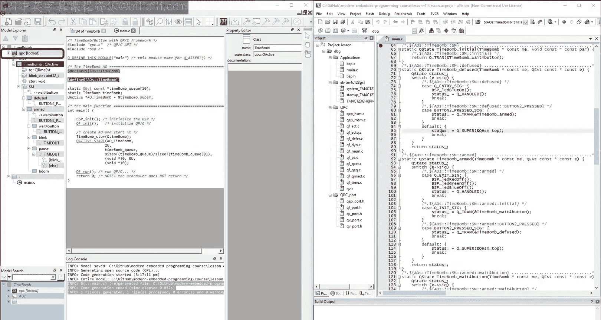
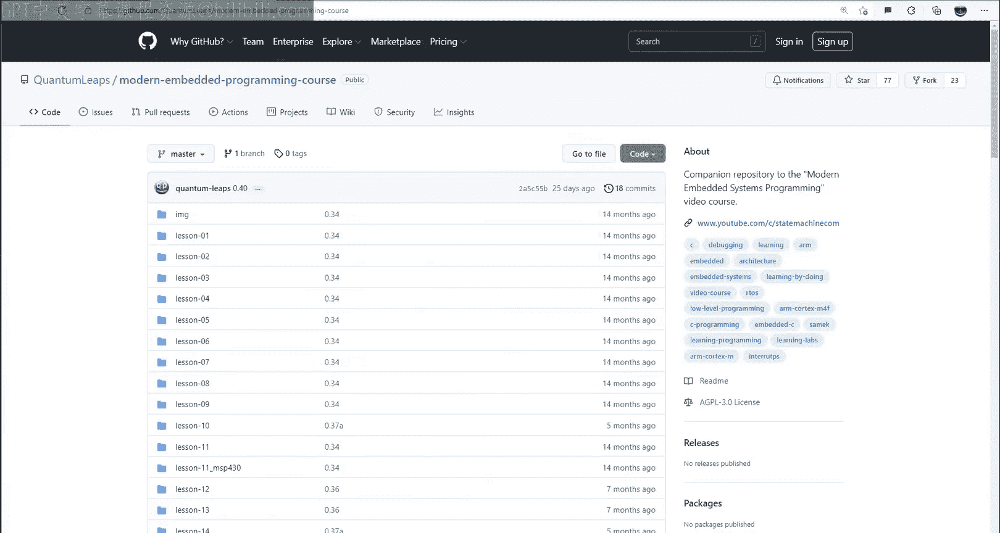

# Quantum Leaps《现代嵌入式系统编程Modern Embedded Systems Programming》中英字幕 p42 -42-#41 State Machines Part-7_Automatic Code Generation.zh_en -BV1fRt2efEms_p42-

Hello and welcome to the modern Embeded Asance programming course。 My name is Miseic。

 and in this seventh lesson on state machines， I would like to show you how you can automatically generate code from your state machines。

Graphal modeling and automatic co generation do not seem to be mainstream yet。

 but they are very much parts of their modern approach。

 And I believe that they are the future of embedded software development。To day。

 you'll see how code generation actually works。 And in the process。

 I will try to convince you about the benefits of graphical modelling as opposed to writing your code manually。

 You will then see what the real issues with modelling and code generation are。

 because chances are that they are quite different from what you might think right now。

 So let's get to it。As usual， let's get started with copying the previous lesson 40 directory and renaming it to lesson 41。

Get inside the new lesson 4 the1 directory， but instead of opening the project lesson in the microvision I D E right away。

 let's start today with the QM model also provided in that directory。Now。

 you've seen the QM modeling tool before， but it was used just as a drawing tool for creating state machine diagrams。

The way those diagrams were created didn't really matter。 And any other tool would do。

 including just pen and paper or a whiteboard。But today。

 QM will be an essential tool because you will finally use its code generation capabilities。

 Therefore， I first need to show you how you can get QM and install it on your machine。

To download Q M， you can visit the companion web page for this video course at state machine dot com slash video course and look for the project downloads。

 The software that you need for each lesson is listed in the table。So for today's lesson 41。

 you will need QP bundle， which you can download for Windows， Linux and Mac OS。

Assuming that youll work on Windows， you should download Q P bundle for Windows。Now。

 as the name suggests， the Q P bundle contains much more than just Q N。 For example。

 you also get the Q PCC framework that you also already used in the past several lessons。

 but separately。If you are interested exactly what's inside QP bundle。

 you could watch the getting started video。But for today。

 let's just run the digitally signed Windows installer。

As far as the installation is concerned after accepting the license agreement。

 I recommend to install the QP bundle in the default location， C Bxlashlash QP。Next。

 you can disselect the individual components of the bundle。

 but I recommend that you keep all of them。 Among others。

 you are getting here the Q PC and Q PC plus+ frameworks， the QM modeling tool。

 and I C plus+ compilers for the desktop Windows， as well as the cross compiler for arm cortex M。

These command line compilers are quite useful for testing embedded software。

 both on the desktop and on the embedded targets。 You will see how to do this in the future lessons of this course。

I also recommend that you keep the option to add the QP bundle insulation folder to your path。

So finally， you can run the insulation， which takes a minute or two。Once the installation complete。

 the dot QM files are recognized in the Windows Explorer and shown with a red ball icon。

 You can open them in Q M by double clicking。Alternatively。

 you can simply open the QM modeler via a QM shortcut on your desktop and either open the model through the file menu or by dragging and dropping the model file on the QM modeler。

Either way， you should now have the model of your time bomb from the last lesson open in Q M。

 If you don't see the state machine， you can double click on the time bomb class in the model Explorer。

Of course， Q M offers also the help menu， where among others。

 you can learn how to get started with Q M here。 I'd recommend that you check out the Q M tutorial。

 which is available as a video or as a step by step guide。But going back to your time bomb model。

 let's start with correcting the model documentation。Now， the state diagram is done。

 but the actions taken in the state machine are only provided as pseudo code。

 This was good enough to avoid clatutter in your diagram。 But for code generation。

 you need to provide the actual actions in C。For that， alongside QM。

 you can open the microvision project where you have your manually written state machine code。

 You can then copy the actions in C back to into the model。

This is actually my general game plan for today day。

 I will go backwards from the final code that you already know， because you wrote it manually。

 You will then see what you need to do back in the model in order to generate essentially the same code。

 But this time to do it automatically。For every action code。

 every time you see some pseudocode in the model， you need to copy over the actual corresponding code in C for that action。

Okay， so now the state machine is fully defined， but you still need to make sure that your time bomb class has all the attributes that you access through the me pointer。

 specifically in your actions， you use the TE attribute to be the Q P time event of the type Q time E VT。

You also use the blink CR attribute of the type U in 320。

You can also provide operations for your time bomb class。 for example， the constructor。

Please remember that Q M will automatically prepare the class name to all class operations because it knows the conventions for object ored programming in C。

 which you' have learned back in lessons 29 through 32。Here。

 you can also specify both the return type， as well as any parameters if needed。Again。

 remembering that Q M will automatically supply the me pointer for class operations。Finally。

 you can provide the actual code of the operation。So now all aspects of your time bomb class are fully designed。

 This is called logical design because it specifies all the items such as classes。

 and there are internal structures， such as attributes， operations and state machines。

But such logical design says nothing about the code organization。

 the code structure that is the director reason files are the subject of the so called physical design。

The majority of modeling and co generating tools don't really support their physical design。

That generated code goes simply to a predetermined directory and has a rather rigid structure。

Typically， for each class， a tool generates a header file named class name do H and an implementation file named class name do C。

But QM is a unique modeling tool that fully supports the physical design and allows you to organize the generated code whichever way you like。

Fully supporting physical design means that the directories and filess become explicit first class model items。

 just like classes， attributes， operations and state machines are。So， for example， in QM。

 you can choose to generate the code exactly as you have organized your manually written code。

Specifically， your current code consists of main dot C， BSP。 H and BSP。 C out of these files。

 only the source file main dot C contains the time bomb Act object class and its state machine。

So let's generate only the main dot C file in the same directory as the Timebo。qM model file。

This will illustrate a non standard physical design。

 as well as flexibility to mix and match generated code with any other code located in the same file like main dot C and in other files such as BSP H and BSP。

t C。The physical design starts with a directory item。Your current model already contains a directory。

 but it was for the original blinklinky model template。

 So let's just delete it and start today from scratch。To add a directory to your model。

 right click on the model item and choose add directory from the pop up menu。Next。

 in the property editor change the generic directory path to dot。

 meaning that your code directory will be the same as the model directory。

The direct rate path is always relative to the model file and can include dot dot for going up levels。

As well as slashes and directory names foregoing down levels。But today。

 you just want the current model directory so you'll leave it as dot。Once you have a directory。

 you can add files to it by right clicking on the directory and choosing add file pop up menu。

Your physical design for today is to generate the file named main dot C。

As soon as you provide the extension， QM will recognize it as a C file and will apply the C syntax coloring to it。

Now， you need to edit the body of the file for as you open the file by double clicking on it。

Your main do file starts obviously empty， but today you want it to look like your manually created code。

So continuing to work backwards， you first copy the entire content of the existing maint C file and paste all of this into your main dot C model item。

Now， if you would leave it at this， QM would literally copy the content of the file item from the model to the specified directory and file on disk。

 but the twist here is that you can also instruct QM to generate specific parts of the file。

For example， this part of your manually created code corresponds to the declaration of your time bomb class。

So you can replace it with the directive to QM to generate such a declaration for you。

 You specify this by typing Do declare and dragging the desired model element。

 such as your time bomb class from the model Explorr like this。 Of course。

 you could also simply type the name of the model item。

The next big segment of code contains the definitions of the timebone class。

 state machine and other operations。 So you can again replace all of this with the directive2 QM to generate the definition of the whole time bomb class。

As you probably expect， you specify this by typing dollar define and dragging the timebone class item from the model Explorr like this。

And this is it。 Now you can let QM generate the code by clicking on the toolbar button or pressing the F7 shortcut key。

This causes QM to generate the main C file on disk and in the process to verify your model items that you asked QM to generate。

QM reports all of this in the lock console， whereas only the files that actually have changed get overwritten on disk。

This time around the file main has changed， which the microvision ID notices and asks you to reload the file。

At the top of the generated file， you can see the comment added by Q M。

 which tells you not to edit the file manually， because all your changes will be lost when the file is regenerated。

 This means that from now on， you should only modify the file in Q M and let Q M regenerate the file after each change。

But below that， you can see the section copied verbaating from the file item in the model。

The dollar declared directive from the model is exp into the declaration of your time bomb class。

 essentially identical to how you declare the class before。Below this。

 you have the expanded dollar defined directive。And below that， again。

 a snippet of code copied verbatim from your file item。Again。

 the generated code is essentially identical to your handwritten code before， and in particular。

 it follows exactly the same rules for coding states， transitions。

 entry exit actions and super states。This must be so because the implementation strategy for state machines is determined by the underlying framework。

 which is Q PCC in this case。 In fact， the framework is the whole enabler of code generation。

 exactly because it provides the well established rules for codifying various model elements。

The generated code contains also some comments， which are designed to help you navigate between the model and the code。

 but I'll discuss all this in a minute， because right now。

 perhaps the most interesting for you is whether the generated code still compiles and runs。Well。

 the code builds error and warning free right off the bat。 That's great。

So let's load it to your TVC Lapad board and test how it works。Reet。Green LED。SスWワン button。

Blinking red ready。SW2 button。Blue LED， meaning diffus state。S W 2 button again。

 combination of blue and green LED， meaningan back to wait for button Sub。 Now， S W 1 button。

 solid blue LED and blinking red LED。 and finally white LED， meaning back to the boom state。

This is exactly the same behavior as at the end of the previous lesson 40。

 which means that the auto generated code works exactly as your handwritten code before。

All right。 so this was just a simple example of cogen from a visual model。

 whereas I glossed over many details that turned out to be important in the everyday programming practice。

But before getting into some of these details， I'd like to step back for a minute and address some of the more fundamental questions。

The most important such question is， why should you even bother with modeling and cogen。I mean。

 isn't modeling just a costly overhead that distracts from the real work of writing code。Well。

 some of the best arguments to such a criticism I found in the article the pragmatics of model driven development by B Salik。

 Please see the video description for a link to this article。

The first argument for modelling comes from the more mature engineering disciplines where it is inconceivable to construct a car or a house without first preparing conceptual models and detailed drawings。

This popularity of visual representations goes back to the human psychology。

 Our brain has at least an order of magnitude， more hardware。

 more neurons devoted to visual processing than all other senses combined。 Consequently。

 we process visual information at a much higher bandwidth。

 and retain it better than any other form of information， especially complex textual representations。

As they say， a picture is worth 1000 words， or perhaps now I field 1000 lines of code。

But not any picture will do。In order to take advantage of our visual superintelence。

 we need to choose a visual or representation that is intuitive。

 yet precise enough to convey the information unambiguously。 For example。

 mechanical or architectural drawings apply quite specific projections and cross sections。 Similarly。

 electrical schematics contain carefully chosen and standardized symbols。Unfortunately， in software。

 when visual representations are used at all， more often than not。

 these are informal nebulous blog diagrams of some kind。

These are often missed opportunities for applying visual intelligence because of ambiguities and overall confusion。

 For example， such diagrams often mix notations。 Does this error represent inheritance。

 Do these multiplicities indicate aggregation。Do the other arrows represent communication？

What do the different shadings of the boxes mean， How about the meaning of the different fonts。

And so on。For these reasons， the efforts like the unified modelling language U ML have standardized the diagrams and thes。

 But even in the U ML， not all diagrams are equally expressive。Out of all the U M L。

 state machine diagrams stand out as intuitive， yet precise and truly constructive。

 meaning really useful for effective code generation regarding the intuitive nature of state diagrams。

 Here is one of the stories described by David Harrell， the inventor of state charts in his article。

 State chosen in the making a personal account。 Again。

 a link to this article is provided in the video description。Here is what David Harrell writes。

I recall an anecdote from late 1983， in which in the midst of one session。

 an Air Force pilot entered the room。 I remember him staring at our intricate state chart diagram on the blackboard and asking。

 what's that， One of the engineers said， oh， thats the behavior of the so and so part of the system。

 And by the way， these rounded rectangles are states and the arrows are transitions between states。

The pilot studied the blackboard for a couple of minutes， then said。

 I think you have a mistake down here。 This arrow should go over here， and not over there。

He was right。So there are certainly some compelling reasons for modeling， not just coding。Basically。

 you don't want to miss out on the extra brain power and the chance to engage more stakeholders in the design process。

 not necessarily just software with developers。 If you don't take advantage of these opportunities。

 your competition will。But going back to the subject of today's lesson。

 code generation turns out to be critical to the success of modelling。

 modelling without code generation has been tried and failed every time。

Models that don't contribute to the final production code are like cars without wheels。

 They can't go too far。 become outdated at get abandoned sooner or later。All right。

 So assuming that you are intrigued about code generation。

 the next set of concerns expressed by developers first exposed to this method is about the correctness。

 quality and efficiency of the generated code。These are， of course。

 the very same questions that were asked when compilers were first introduced more than 50 years ago。

 But to day， nobody questions any more the efficiency of the machine code generated by the compilers。

Same thing applies to modeling and cogen because in practice。

 correctness and efficiency are really non issues。 In fact， the reality is quite the opposite。

 The automatically generated code tends to be the most solid part of the project。

 While the manually written parts are typically more problematic due to human errors。

So what are the real problems of code generation when it is actually applied in the everyday programming practice。

Well， here is a list that I'd like to go over with you and illustrate with the QM tool。

The biggest real problem is what the developers call the need to constantly fight the tool。

 This feeling arises when things that used to be simple without the tool suddenly become complex with the tool。

The QN modeling tool has been very carefully designed to minimize the need to fight the tool。

 For example， any code that you enter into the tool is directly in C or C++ if you choose the Q PCC plus+ framework。

And the tool itself doesn't attempt to change any of your code。

Other modelling tools handle things like that differently and often put various restrictions on what you can or cannot do in your actions to appreciate the simplicity of QM。

 you'd really need to see some other tools， especially the big high ceremony modelling tools。

But to give you an idea of how fighting the tool might look like back in lesson 39 of this video course。

 you saw the state machine compiler， S MC C。Even though this was not a visual tool。

 its job was to generate code from the a textual model in this case。

The problem is that SMC tries to be smarter about your action code。For example。

 SC will not let you use simple assignment。You cannot access attributes of your state machine either。

All you can really do is to call operations on your context class。

 so instead of writing your actions in a simple way。

 you need to invent workarounds such as adding a bunch of class operations in this case。

But moving on， the next big issue is that the generated code must be complete。

 meaning that no changes of any kind should be necessary for the code to cleanly compile and link with the rest of your application。

Generating only code skeletons with the to do comments in places that later need to be coded manually are just not good enough。

To that end， QM generates complete code only。 In fact。

 QM assumes that the generated code won't be modified and to prevent any accidental changes。

 QM marks the generated files as read only。 What that means is that any changes must be performed in the model。

 and the code must be regenerated as opposed to being modified manually。The next issue。

 critically important in practice， is the ease of integration between the generated code and the existing code。

As you saw in the time bomb model in QM， you write the body of each file and then you direct QM to generate specified model elements for you。

In this arrangement， it is trivial to surround the generated code with any include directives。

 macro definitions or anything else you need。This is actually unique to QM because in most other tools。

 such simple things require going through dial boxes or special deployment models。Also。

 the time of example showed you how to generate code for a class。

 but QM allows you to generate code of both a finer and a coarser granularity than that。 For example。

 you can generate definitions of individual operations like， say， just the constructor。

Or you can generate the whole package。As you noticed。

 I keep creating here new files to show you how easy it is and not to disturb their working code。

For state machines， you can generate definitions of individual states。

Whereas the dollar defined directive generates a recursive definition of a state and all its substate。

While the dollar defined one directive generates a nonrecursive definition of just a given state。

 you can then use the directives to split the definition of a larger state machine among multiple files。

The next pragmatic consideration is the traceability from the generated code back to the model。

For example， suppose that your model has an error and the generated code fails to compile。

In that case， you want to quickly correct the problem in your model because you are not supposed to change the generated code。

And here is where traceability comes in。 Q M generates special modeling comments right before each element。

 This allows you to select a piece of the code， including the comment and copy it to the clipboard。

 This works for any code editor。You can then paste the model link into QM。

 which causes QM to highlight the corresponding model element where you can conveniently correct the problem。

Tracsability is also important in the opposite direction from the model to code。For instance。

 suppose that you want to set a break point upon the entry to the boom state。

 Your problem is to quickly and reliably locate the corresponding place in the generated code。In QM。

 you can do this easily by highlighting the desired state in the model and copying the model link to the clipboard。

You can then simply search a code for the modeling comment again。

 an code editor supports simple text search。After locating the place in the code。

 you can set your break point and proceed with the standard debugger。

Please note that the bidirectional traceability from the model to code and vice versa is the property of the particular optimal state machine implementation that you learned back in lesson 39 and which is used in the QPC framework。

Such traceability is another given， and many other code generators don't produce by directionally traceable code。

 For example， some code generators transform hierarchical state machines into classical。

 flat state machines for implementation。This， unfortunately。

 brings back the repetitions of transitions， which hierarchical state machines were exactly designed to remove。

In that case， the traceability from the model to code is destroyed because a single transition in the model can map to several transitions in the code。

Yet， the bi directional traceability is a very desirable property and is actually required by various functional safety standards。

When you start modeling， your models will become a new kind of your source code。

 This means that you will gradually produce different versions of your models。

 which then you will need to difference and merge like any other source code。For example。

 let's save the current version of your time bomb do QM model file as timebo 0 do QM。 And next。

 let's add the exit action to the diffuse state to undo the entry action that is to turn the blue LED off。

Please note that this creates two differences。 One is the exit action code。

 and the other is the graphical rendering of the exit action box， which has been resized。Now。

 let's change some views in the model and save it as the new version。At this point。

 let's say that you would like to see the differences between the original and the new model。

QM does not support such model different directly， but to see the differences between your two models。

 you can use any standard codediencing tool like windmer。

This is possible because QM stores the models in XmL。So here you can see two differences。

 The first being the exit code and the second being the size of the exit box。

The Q M model format in X， M， L is specifically designed to be quite readable。And also here again。

 in the model file itself， QM generates the model in comments。

 which you can copy and paste into QM to visually locate the item that has changed。

The saving of the modeling commons in the X M L is controlled by the check box in the model's property sheet。

 It's important to note that just like the generated code。

 the X Ml is read only because you are not supposed to make any manual changes there。

 All changes to the model should be done through the Q and modeling tool。And finally。

 Yamalla should scale up to efficiently support really big projects in teams。

 This is where modeling really shows its biggest advantages。Here。

 I would like to mention only two QM features that support large scale projects。

First is the unique support for the physical design in Q M。

 which becomes critically important for larger scale projects。 Physical design is vastly underapp。

 and there are very few resources that cover it well。One notable exception is John Lacos's book。

 Large scale C++ softwareftware Design， which I highly recommend and list in the video description。

The other feature of QM for bigger projects is the ability to break up models into external packages that are saved into separate files。

These exome packages can be then managed separately by sub teamsems and can be imported into multiple models。

🎼This concludes this quick introduction to automatic Co generation。

The three main points I'd like you to remember are。That to succeed。

 modeling must be accompanied by code generation。That besides the big。

 heavy and expensive tools of the past， there are now lightweight modelling tools that you no longer need to fight。

And that success of modelling and cogen in everyday practice requires many little accommodations that collectively bring up the paradigm shift。

If you like this channel， please give this video a like and subscribe to stay tuned。

 You can also visit statemachine。 co slash video course for the class notes and project file downloads。

🎼Finally， all the projects are also available on GitHub in the Quantum Lis Repoitory Mod embedded programming course Thanks for。

