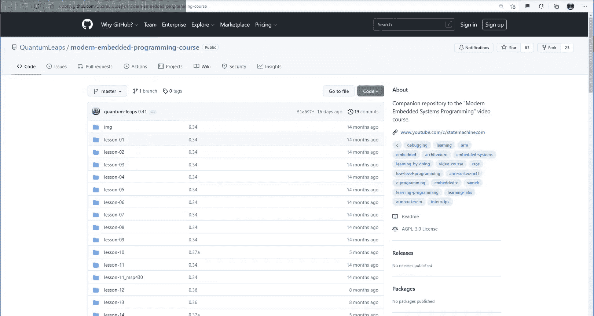

# Quantum Leaps《现代嵌入式系统编程Modern Embedded Systems Programming》中英字幕 p43 -43-#42 State Machines Part-8_ Semantics of Hierarchical State Machines.zh_en -BV1fRt2efEms_p43-

Hello and welcome to the modern Medience programming course。 My name is Miro Samak。

 and in this eighth lesson on state machines， I would like to drill deeper into the semantics of hierarchical state machines。

Specifically， in this lesson you will examine a hierarchical state machine with multiple levels of state nesting。

 you will then see how this more advanced state machine handles various transitions and exactly which actions are executed in which order。

🎼う。To remind you quickly what happened so far in lesson 40。

 you designed a relatively simple hierarchical state machine for your time bomb application。

 which you first coded manually。 and then in the last lesson 41。

 you generated the code automatically。However， that timebone state machine had only one level of state nesting and didn't really demonstrate the richness of semantics enabled by state hierarchy and transitions between states nested at various levels。

 So today day， to explore what's possible and to learn how exactly a more advanced hierarchical state machine can handle various transition types。

 I'd like you to run an example already provided in the QPC framework。Specifically。

 in the last lesson 41， you've seen how to download and install the QP bundle software。

 which among others contains the Q and modeling tool， QP frameworks。

 as well as many other supportinging tools， some of which you will have a chance to use today。

 So first， I'd like you to go to the Q PCC examples workstation directory， because today。

 you will see an example that runs on your workstation as opposed to an embedded target。

 I will show you how to adapt this example for your Tva C launchpa embedded board in one of the future lessons。

But for today， choose the QHSMTSD example and find the QM model file。

 which I'd like you to open in the QM modeling tool。Once the model opens。

 expand the HSM's package and double click on the QHSM TSD class to show the As state machine。

Before anything else， let's start with locking the model。

 which will protect it from any accidental edits。So this hierarchical state machine is taken from Chapter 2 of my book。

 Praical U ML St in CNC+ plus Second edition， which is available in P D F from the statem dot com website。

This example is obviously contrived in that it does not model any real system。

 but it has been carefully designed to contain all possible transition topologies up to four levels of state nesting。

 This includes regular transitions between various levels of state hierarchy。

 as well as internal transitions。The state machine contains six nested states， S， S1 and S1。

1 on the left and S 2， S 2，1， and S 2，1，1 on the right。

The various transitions are triggered by events named A，B， C， and so on through I。

These events correspond to the ordering of transition times from the simplest to progressively more complex in the state machine algorithm used inside the Q P framework。

Also， all transitions， as well as states have actions。

 These actions produce information as to what exactly happened。 For instance。

 entry action to state S 2 produces output S  to entry。

 While the exit action produces output S 2 exit。Similarly。

 the action on state transition A in state S1 produces the output S1 a。

 while state transition A in S21 produces the output S21 a。By the way。

 this kind of output with the information about the code execution is more technically called software tracing。

Because the output generated by the instrumentation added to the software allows you to trace the code execution。

 Such information can be very useful for debugging， testing， and fine tuning your code。

S tracing is a very important concept， and I will talk about it in the future lessons of this video course。

But going back to your state machine， it also demonstrates guard conditions， and for that。

 it has an attribute fo， which is used inside guards and also modified in some transitions。

So now let's generate the code from this hierarchical state machine exactly as you did in the last lesson 41。

By now the generated C code should be familiar to you because this is the same optimal state machine implementation that you've been using since lesson 39。

In principle， you could write such code manually because， in fact。

 it was originally designed for manual coding。But here I have a personal story which convinced me to automatic code generation。

So as I already mentioned， I designed a QHSM TST example for the practical UML State chart book。

 At that time， the QM tool didn't yet exist。 So of course。

 I coded it manually and drew the diagram in thissio。After Q M was developed。

 I wanted to provide all examples from the book as QM marbles。Interestingly。

 the QM generated code from the QHSMTST state diagram produced a different trace than my manually written code。

My first suspicion was the QM code generator because the tool was new back then。But to my surprise。

 the generated code turned out to be right。 and the problem was with the diagram。Specifically。

 the transition G in state S21 went all the way to state S11。

 whereas it should go only to the S1 superstate。 This is indeed what the current QHSMTST model shows。

This was a big lesson for me， and I hope it will inspire you as well。 Since then。

 I just don't leave things to chance any more and always generate code automatically。

But I digress because now you need to build the generated code。For that。

 open a command prompt and change the directory to your QHSMTSD example。

This directory contains a make file， which should work on Windows as well as Linux and Mac OS。

 This make file is designed to be easily customizable for your own applications。

 whereas you typically don't need to change anything beyond that line。To execute a make file。

 you need the make utility。 But if you have installed Q P bundle as shown in the last lesson 41。

 make should be directly available in your path。Also。

 the make file assumes that the Gcc G CC plus plus compiler is directly available in your path as well。

 Again， if youve installed the Q P bundle， you should have the Gcc compiler available。

So now just take make to build the code。This produces the executable in that build directory。

To run this executable from your command prompt， type， build， back slash QHSM TST。

This produces some printouts from your software tracing instrumentation in estate machine actions。

By correlating this tracing information to the state diagram。

 you will be able to see exactly what the state mission is doing and in which order。

Please try to pay attention to the details here， because they are important to learn and understand the semantics of hereerarchical state machines。

So starting with the topmost initial transition， the first action top in it is the one attached to the transition itself。

 Please note that besides producing the output， the action also initializes the member4 to 0。

 This will be important later for evaluation of guard conditions。

 Please also note that an initial transition is allowed to cut through more than one level of state nesting。

 like here， it cuts through state S。 and goes directly to state S 2。However。

 every state crossed by a transition initially or regular， must be still properly entered。

 and therefore， the next action executed is the entry action to state S。

 followed by entry action to state S 2。 Now， the topmost initial transition ends on state S 2。

 which is called the explicit target of the transition， but the trace does not stop there。

This is because the semantics prescribes that any transition， including initial transition。

 needs to drill into the sum states as long as there are initial transitions nested directly in the target state。

And indeed， there is an initial transition nested directly in S2， so it is taken。Next。

 as to one is entered and S to one，1 is also entered。And 2，1。

1 is called a leaf state because it has no further substrates or nested initial transitions。

Therefore， the runto completion step completes here。

 and the hierarchical state machine is said to have reached a stable state configuration。

The last entered state becomes the current state。At this point。

 you can start dispatching events to your state machine。You do this by typing on your keyboard。

 For example， letter G dispatches the corresponding event G to the state machine。

With the semantics of hierarchical state machines， the event G is handled in the following way。First。

 the current state S 211 attempts to handle the event。 However。

 state S 211 does not have any transitions labeled with the G。

So the event is passed on to the next high level state in the hierarchy， which is the state S to1。

S to1 has a transition triggered by G， so it executes the action associated with the transition and produces the printout S to1 G。

Next， the state machine executes the transition chain that exits the source state configuration and enters the target state configuration。

The transition chain starts with exit actions from all states up the state hierarchy to the so called least common ancestor。

 LCCA， but not exiting the LCA itself。The LC A of S to1 S1 pair of states is their common superstate S。

 So all states up to S， but without S itself are exited。Next。

 the target state configuration is entered in the exact opposite order that is starting from highest levels of state hierarchy down to the lowest。

 The transition G from state S to 1 terminates on state S1。 However。

 as1 has a nested initial transition， So it is executed and S11 is entered。 This is a leaf state。

 So the RTC step complete。Next， let's dispatch the event I。Again。

 the current state S11 does not have any transitions labeled I。

 So the event is passed on to the next level of state hierarchy。 That is to state S1。

S1 has an internal transition triggered by I。 Therefore。

 S1 handles the event and produces the print out S1， I。 And at this point， the processing ends。

 No change of state ever occurs in the internal transition。

 even if such transition is inherited from higher levels of state hierarchy。

The current state remains the estate， S 1，1。Next， let's dispatch event A as before the current state S 11 does not prescribe how to handle a。

 So the event is passed on to the super state S1。S 1 has a self transition triggered by a。

 so it executes actions associated with that transition producing the print S1 a。This time， however。

 a is a regular transition， which requires exiting the source state configuration and entering the target state configuration。

The LC C A of state pair S1 S1 is S。 So all states from the current state up to S。

 but excluding S are exited。Next， status 1 is cleanly reentered by executing the entry action to S1。

 initial transition in S1 and entering the S11 leaf state。At this point。

 I'd like to make two observations。 The first is that in hierarchical state machines。

 self transitions like S1 A here are different from internal transitions like S1 I here。

This is not necessarily the case in the classical non hierarchical state machines without entry and exit actions to states。

 where cell transitions are used exactly to cause a reaction in a given state。

And the second observation is that in hierarchical state machines。

 a cell transition is an idiom to cleanly reset a given state context by cleanly exiting and reentering a given state。

Such self transitions can be useful for various cancel operations。

 like the cancel button in a calculator。Now let's show the current state。

 which is still S11 and dispatch event D。S 1，1 has a transition D， But this transition has a guard。

 me fo。Fu is an attribute of the state machine， which was initialized to 0 in the topmost initial transition。

 Therefore， the guard condition， me fo evaluates to false。According to the UL semantics。

 this is treated as though transition D was absent in S11。

 and therefore the event D is passed on to the next higher level that is to state S1。

Stus1 also has transition D， but with the complementary guard， not me Fo。 This time。

 the guard evaluates the true and the transition is taken， producing the S1 D trace。

 Please note that the action on that transition also changes the value of the attribute full to one。

After this， all the appropriate exit actions is up to the LCA， which is state S， are taken。

 followed by interactions back to S 11。The current state becomes， again， S11。Now。

 when you dispatch another event D， the guard Mi4 in transition S11 D evaluates the true。

 and so this transition is taken。 This time the LCA is only S1， so fewer exit entry are executed。

Even C， thispat to the state machine demonstrates again that all exited entry actions are always executed。

Regardless of which transitions are in between。 For example。

 the nested initial transition in the explicit target state。 S 2 goes to substitute S 2，1，1。

 cuttingtting through the substrate S 21。 However， still。

 the entry actions don't skip the entry to S 2，1 before entering the S 2，1，1 leaf state。

This example demonstrates， once again， the powerful concept of guaranteed cleanup of the source state configuration through the exit actions and guaranteed initialization of the target state configuration through the entry actions。

 regardless of the complexity of the exited entry path。Interestingly， in hierarchical state machines。

 the exact same transition can cause different sequences of acid actionss。

 depending on which state inherits the transition。For example。

 let's now dispatch event E twice in a row。Each time the event triggers the same transition as E。

 but the actions executed are different because transition E fires from different state configurations。

 once when the current state is S 2，1，1。 and next， when the current state is S 1，1。 For example。

 let's now dispatch event G to change the current state to S 2，1，1。And after this。

 two events I in the row。 The first I triggers transition S to I。

 because the guard not meful is true。Please note that the action on this transition also sets4 to one。

The next event， I does not trigger S to I， because this time， the guard not mele evaluates to false。

 And so the event is passed up to the superstate S。

The internal transition S I has a complementary guard， which is true。 So the transition S I is taken。

Of course， in case of internal transitions， there is no change of state。

 So no exit or entry actions are ever executed。Now。

 let's terminate the QHSMTSD executable by pressing the escape key。

But you can learn much more by running this example yourself。

 dispatching various events to it and studying the self re tracece it produces。Now。

 if you wish to play with the example and modify it。

 you can certainly unlock the model and change things directly in the QPC folder。

But perhaps a better idea is to make a local copy of the example and make any changes there。

So let's just do that as a coding exercise for today day。In the final Exper。

 copy the QHSMTSD example directory and paste it into your projects for this video course。 Next。

 renamed the QHSMTSD directory to lesson 42。Get inside the lesson for the two directory and double click on the model file to open it in Q M。

Now copy the full path to the new directory。And in your command， prompt， change directory there。

The director contains the copied make file that you already used in the original location。

 So let's try it again by typing make。The build fails because the QPC do H header file cannot be found。

When you open the make file， you can see that this is because the location of the QPC framework has been defined as a relative path。

 This was appropriate for the original QPC examples because it allows you to install QPC anywhere in your file system and still have all the make files work。

But it doesn't work anymore in a folder that is outside the QPC directory tree。

You have a few options to fix the issue。First， you can define the QPC environment variable。

 which they make while we and take instead of using the relative path。

You can do it permanently from Se system about tab and Advance System settingstting link。

Here you click the Environment variables button。Where you finally can add your new Q PCC variable。

Alternatively， you can set the Q PCC variable locally and the command prompt for the sake of this exercise。

 let's do it locally。Now the build succeeds and you can run the build QHSM TSD executable as before。

Your other option is to change the Q PCC variable in the make file itself。

 which will then work without you remembering to set Q PCC the next time。Alright。

 so now let's get back to your local QHSMTST model and take a look at the few issues that came up during the explanation of the hierarchical state Ma semantics。

First， I'd like to explore a little deeper guard conditions and specifically the propagation of events to the high level states when a guard evaluates the fall。

For example， this happens when you get to state S11 and dispatch event D。

The guard condition on transition S 1，1 D evaluates to false。

 and the event is propagated to the high level state S 1。This might be what you want。

 but sometimes you might exactly not want to propagate the event。

 even when the guard evaluates the fall。You can model this by attaching a special。

 explicit compliment guard else like this。Now， you need to regenerate the code。

And a rebuild to the programme。When you run it again， get to state S 11 as before， and dispatch N D。

As you can see， this time D produces no output because the event is ignored due to the guard。

 but the event is no longer propagated up to state S1。By the way。

 the special Esgar and more tipss for working with choice segments are described in the QM On manual。

Another aspect of a QHSMTST state machine that you can change is how it exits。

 specifically as you can see in the software trace。

 the execution stops abruptly without any cleanup that is without executing the appropriate exit actions from states。

This happens because the terminate event dispatched when you press the escape key is an internal transition that。

 as you've flow in today， never triggers exit or entry。To execute the exit actions。

 you need to turn terminate into a regular transition。

 That is it needs to go to a state which you can call final。Now。

 we can move the BSP exit action from the terminate transition to the entry action to final。

 This will exit the application， but only after the whole chain of exit actions from the as superstate has been executed。

As usual， you need to regenerate the code and rebuild the executable。

When you run it and press escape， you can see that now it performs cleanup。Interestingly。

 when you run it again， but change state before pressing escape。

 the clean up is different because it is specific to the current state when the application is terminated。

 This concludes this lesson about the semantics of hierarchical state machines。

 I hope that you have no a better idea how H Sm's work。

 and you gain some appreciation for the richness of semantics that state hierarchy offers。Of course。

 you might still have questions as to how exactly certain transition types will be handled。

 but here the QHSMTST example can help because it has been specifically designed to contain all possible state transition configurations up to four levels of state nesting。

🎼This allows you to quote unquote， answersw all your questions by running the example and dispatching the events to trigger the specific transitions。

If you like this channel， please give this video a like and subscribe to stay tuned。

 You can also visit statemachine dot com slash video course for the class notes and project flight downloads。

 Finally， all the projects are also available on Github in a quantum Lis repository modern embedded programming course。

Thanks for watching。

