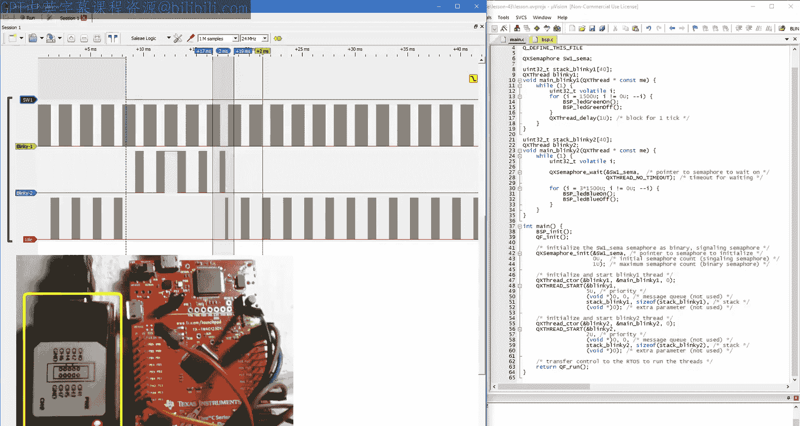
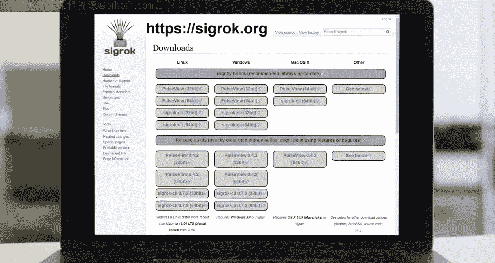
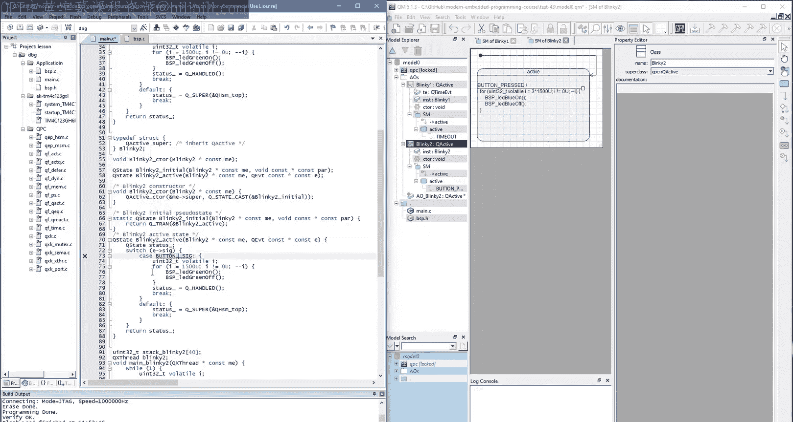
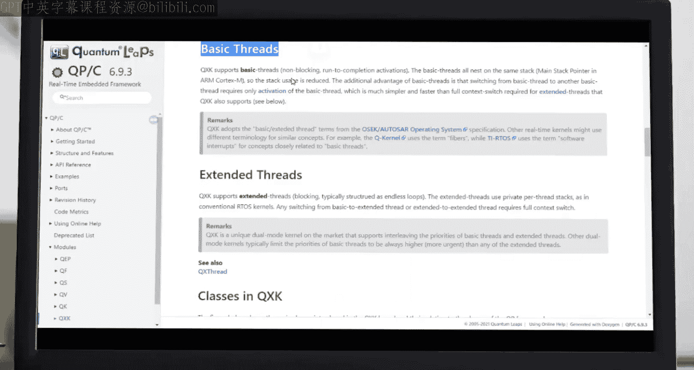
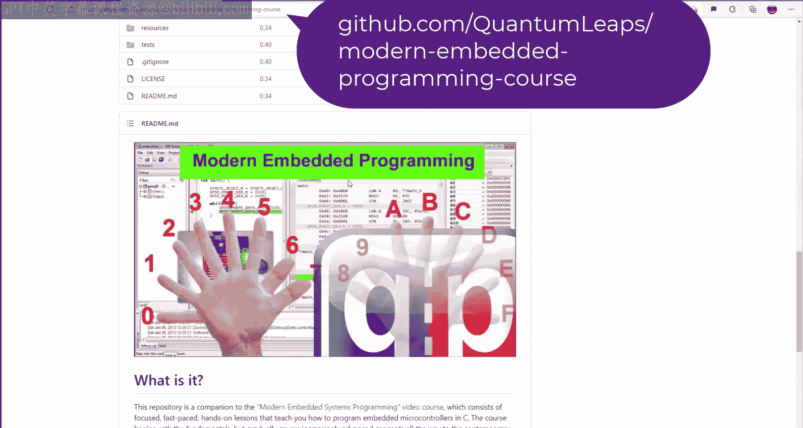

# 现代嵌入式系统编程：第43课：实时系统中的活动对象（第一部分）- 运行至完成与RMS/RMA 🚀


在本节课中，我们将探讨事件驱动编程中的活动对象，并分析它们在实时系统中的优势，特别是它们如何与速率单调调度（RMS/RMA）方法兼容，以实现可证明的硬实时行为。

---

## 概述

从第34课开始，我们一直在使用事件驱动的活动对象。本节课将把事件驱动编程、活动对象、状态机和实时操作系统（RTOS）等概念联系起来。我们将通过修改第27课的项目，将传统的阻塞线程转换为活动对象，并观察它们在预抢占式RTOS内核下的行为，以验证活动对象是否同样适用于RMS方法。

---

## 回顾第27课项目

首先，我们复制第27课的目录，并将其重命名为“lesson_43”。在项目目录中，我们打开项目文件。

该项目最初使用了QP框架中的预抢占式、基于优先级的RTOS内核QXK。它管理了两个传统线程：`Blinky1`和`Blinky2`。`Blinky1`线程以最高优先级运行，周期为2毫秒，以展示速率单调调度（RMS）原则。`Blinky2`线程以较低优先级运行，并在按下开关`SW1`时通过信号量被触发。

---

## 将线程转换为活动对象

我们的目标是将`Blinky1`和`Blinky2`线程转换为活动对象。以下是转换的核心步骤。



### 创建Blinky1活动对象



首先，我们需要创建`Blinky1`活动对象类，它继承自QP框架中的`QActive`基类。

在C语言中，我们通过声明一个结构体来实现，其第一个成员是`QActive`类型的`super`。

```c
typedef struct {
    QActive super; // 继承QActive基类
    QTimeEvt timeEvt; // 时间事件，用于替代阻塞延时
} Blinky1;
```

`Blinky1`需要一个构造函数和一个简单的状态机。状态机包含一个顶层的初始伪状态和一个`active`状态。

构造函数必须初始化超类`QActive`和时间事件`timeEvt`。顶层的初始转换将时间事件设置为在2个时钟节拍后触发，并随后每2个节拍周期性地触发（系统时钟节拍为1毫秒一次），从而使`Blinky1`具有2毫秒的周期。

```c
// 状态机初始伪状态中的动作
QTimeEvt_armX(&me->timeEvt, 2U, 2U); // 2个节拍后首次触发，之后每2个节拍触发
```

初始转换进入`active`状态。`active`状态只有一个由`TIMEOUT_SIG`信号触发的内部转换。

```c
// active状态中处理TIMEOUT_SIG的内部转换
case TIMEOUT_SIG: {
    BSP_ledGreenOn();
    BSP_ledGreenOff();
    status_ = Q_HANDLED();
    break;
}
```

### 创建Blinky2活动对象

`Blinky2`活动对象的结构与`Blinky1`类似，但它处理按钮按下事件，而不是超时事件。

```c
typedef struct {
    QActive super; // 继承QActive基类
} Blinky2;
```

其状态机的`active`状态处理`BUTTON_PRESSED_SIG`信号。

```c
// active状态中处理BUTTON_PRESSED_SIG的内部转换
case BUTTON_PRESSED_SIG: {
    for (uint8_t i = 0U; i < 5U; ++i) {
        BSP_ledBlueOn();
        BSP_delay(BSP_TICKS_PER_SEC/10U);
        BSP_ledBlueOff();
        BSP_delay(BSP_TICKS_PER_SEC/10U);
    }
    status_ = Q_HANDLED();
    break;
}
```

---



## 关键变化：栈与事件队列

在转换过程中，一个重要的变化是我们不再需要为每个活动对象分配私有栈。

这是因为底层的QXK内核利用了活动对象的非阻塞特性，将它们作为“基本线程”执行。基本线程是运行至完成的激活单元，与传统的、在无限循环中阻塞的“扩展线程”不同。所有基本线程可以共享同一个栈，从而节省了大量宝贵的RAM空间。

然而，每个活动对象仍然需要一个事件队列缓冲区来接收事件。队列长度需要根据最坏情况场景进行配置，通常10个事件是一个安全的初始估计。

```c
// 在main.c中创建事件队列和活动对象实例
static QEvt const *blinky1QSto[10]; // Blinky1的事件队列存储
static QEvt const *blinky2QSto[10]; // Blinky2的事件队列存储

Blinky1 blinky1; // Blinky1活动对象实例
Blinky2 blinky2; // Blinky2活动对象实例
```



启动活动对象时，我们使用`QActive_start()` API，并传入事件队列及其长度，而不再提供栈指针。

```c
QActive_start(&blinky1.super,
              (QPriority)1U,
              blinky1QSto, Q_DIM(blinky1QSto),
              (void *)0, 0U,
              (QEvt *)0);
```

---

## 调整板级支持包（BSP）

我们需要在BSP中定义新引入的事件信号（如`BUTTON_PRESSED_SIG`和`TIMEOUT_SIG`），并替换原有的信号量机制，改为向活动对象投递事件。

在`bsp.h`中声明信号枚举：

```c
enum {
    BUTTON_PRESSED_SIG = Q_USER_SIG, // 按钮按下信号
    TIMEOUT_SIG,                     // 超时信号
    // ... 其他信号
};
```

在`main.c`中声明全局活动对象指针，并在中断服务例程（ISR）中将信号量触发改为投递事件：

```c
// 替换原有的信号量触发
// QXK_ISR_EXIT(); // 旧代码
QACTIVE_POST(&blinky2.super, &buttonPressEvt, 0U); // 新代码：投递事件
```

---

## 测试与验证

完成代码修改并成功编译后，我们将程序加载到Tiva C LaunchPad开发板上，并使用逻辑分析仪观察其行为。

测试结果表明，转换后的系统行为与使用传统线程时完全一致：
*   `Blinky1`（高优先级）仍然每2毫秒周期性地运行，始终满足其硬实时截止时间。
*   当按下按钮时，`Blinky2`（低优先级）被触发并运行，但会被`Blinky1`周期性地预抢占。
*   `Blinky2`最终会在处理下一个按钮按下事件之前，完成其当前的运行至完成步骤。

这说明了本节课的核心要点：**活动对象和状态机的运行至完成语义，并不意味着状态机必须在单次激活中独占CPU直到完成。在预抢占式内核（如QXK）下，不同活动对象的运行至完成步骤可以在时间上交错执行。** 内核完全负责处理这种交错，因此只要内核是预抢占式的，活动对象就可以像传统线程一样相互预抢占，并满足硬实时截止时间。

这意味着，**当活动对象与预抢占式、基于优先级的实时内核结合时，它们完全适用于速率单调调度（RMS/RMA）方法**。实际上，由于活动对象不共享资源（而是使用异步事件通信），它们可能比传统线程更适合硬实时系统和RMS方法。

---

## 总结

在本节课中，我们一起学习了：
1.  如何将传统的RTOS线程转换为基于状态机的活动对象。
2.  活动对象作为“基本线程”运行，共享栈空间，从而节省了系统RAM。
3.  在预抢占式内核下，活动对象的运行至完成步骤可以被更高优先级的任务中断，但这并不影响其最终完成和实时性。
4.  通过实验验证了活动对象与速率单调调度（RMS/RMA）的兼容性，它们能够像传统线程一样保证硬实时截止时间。



活动对象通过异步事件进行通信，避免了资源共享带来的复杂性，这使其在并发和实时系统中具有显著优势。关于活动对象在资源管理和并发方面的更多关键特性，我们将在下一节课中详细探讨。