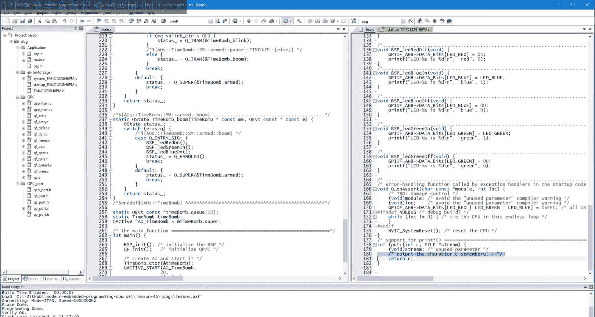
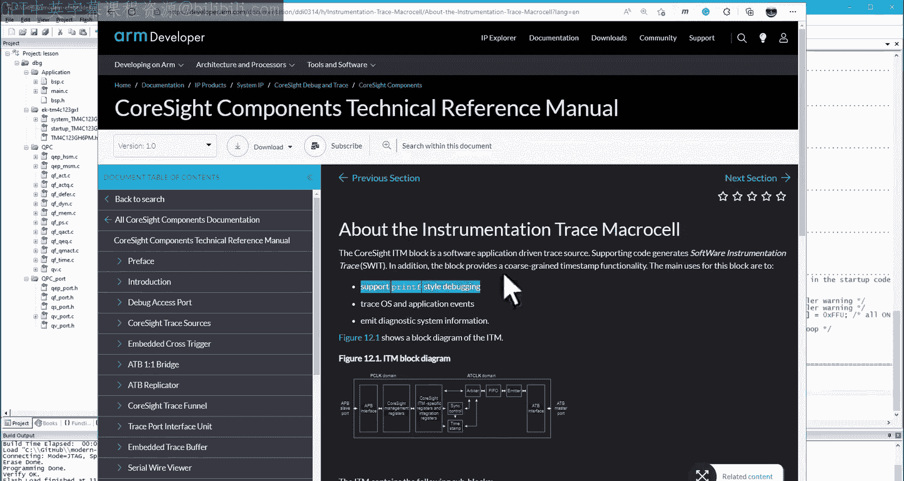
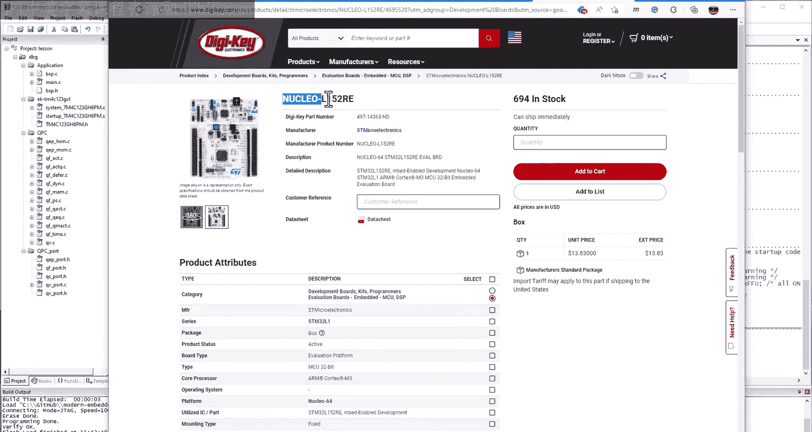
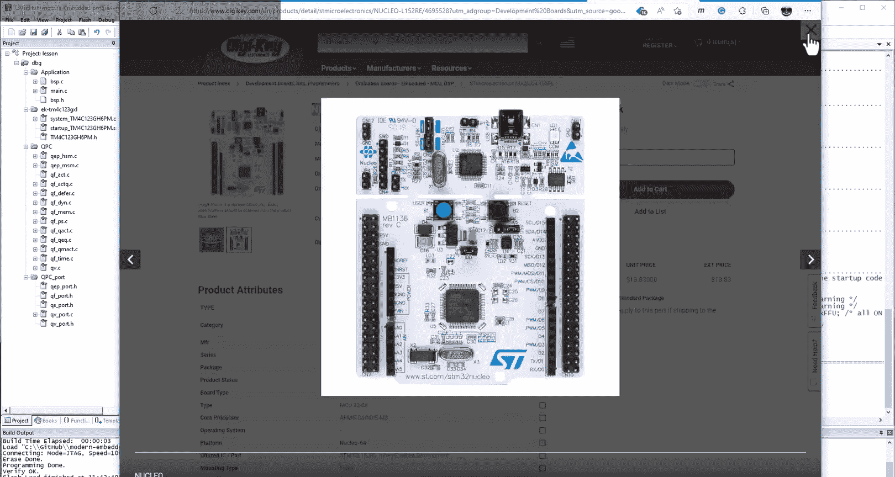
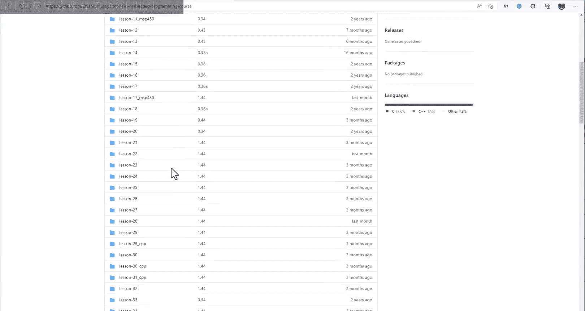

# Quantum Leaps《现代嵌入式系统编程Modern Embedded Systems Programming》中英字幕 p46 -46-#45 Software Tracing with printf.zh_en -BV1fRt2efEms_p46-

🎼，🎼Hello and welcome to the modernern embeddedd systems programming course。 My name is Misic。

 and in this lesson， you'll learn about debugging by Prif as the most common software tracing technique Today。

 you'll see how to implement software tracing with Prif on your Tva C launchpa board。

 and you'll also explore some shortcomings of this primitive technique。😊，In any real life project。

 getting the code written compiled and successfully linked is only the first step。

 The system still needs to be debugged， tested and optimized。So far in this course。

 the primary tool for this was the single step debugger where you set the break points。

 And after a break point is hit， you inspect registers variables and memory。 In case of any problem。

 the biggest question is always， how do they get there。

The calls tag might provide some help as to which functions were called in which order。

 but the information is minimal in event driven systems。 specifically。

 the calls tag is of less value because event handlers return after each event。

 thus removing any trace of their execution from the calls tag。In the end。

 the biggest problem with a single step debugger is that it stops the running system and completely changes its real time behavior。

 It's like trying to study a living organism by first killing it。

What you really need is a method to observe the live interactions within the software running at full speed or close to the full speed。

For that， most software developers turned to the Trident truee print F debugging picnic。

In that method， print F statements are placed throughout the code。

 which is called instrumentation so that the code itself reports what it is doing。

Such debugging by print F or S， printf as N， print F and similar functions is the most primitive of a class of techniques collectively called software tracing。

You saw an example of this technique in lesson 42， where the hierarchical state machine produced a trace of all actions it has executed。

But that was done on your host computer。 Today， I'd like to show you how to do it on your embedded board。

For that， let's go back a few lessons to lesson 41， copy the directory and rename it to lesson 45。

Get inside the Lesson 45 directory and double click on the project lesson to open it in the microvision IDDE。

To remind you quickly what happened back in lesson 41。

 you have created a hierarchical state machine for a time bomb active object。

 The state machine was triggered by the button presses and time events。

 It turned the LEDs on and off to emulate various actions。

Your job for today is to instrument the code such that it will also produce a trace output at real time about the perform actions。

Given this problem statement， and C programmer would typically turn to the standard C library function print F。

This function requires the SDDIo。h header file。Print F takes a format string as the first parameter。

 which it copies to the output， but also performs percent substitutions。 For example， format string。

 Pri F LED percent S is percent D new line， red1 will produce output LED red is1 new line in which all percent signs are substituted with the values of parameters following the format。

Okay， so let's put such a print F instrumentation in all functions for the LEDs。

And also in the cystsic handler ISR to trace the button presses。All right。

 so let's just try to build a project。Well， what do you know。

 All this comps and links error and warning free。But when you try to run it。

It gets stuck at the hard coded break point somewhere inside this open。

 even before reaching the main function。Well， it turns out that the print facility requires a more elaborate configuration。

Since print F is a C library function， the first step is to enable microlibb。

 which is a very lightweight version of the standard C library specifically designed for embedded microcontrollers。

So let's see if that helps。This time around， you'll reach the main function。

 which is significant progress。But when you attempt to run the code。

 you still hit a hard coded breakpoint。 but this time in F put C。

 which is another C library function called from Pri F。

So what's going on with these hard coded break ones anyway。Well。

 it seems that the microlib library provided with the K microvision toolet implements all standard functions。

 but the library cannot fully define hardware specific functions。

 so instead of not defining such functions like Fput C at all。

 the library apparently provides dum implementations with hard coded breakpoints。

The solution is to provide the definitions of such functions in your application code。

Then due to the linking rules for libraries， which you have learned in lesson 14 about the start code。

 the linker will take your functions instead of the versions from the library。 All right。

 so let's just provide an empty definition of F C。By the C documentation。

 the F put C function takes the character to send and the file pointer。Upon success。

 it returns the character it sends。 You'll still need to decide where to send the character。

 but let's ignore it for now。When you build in loader code now。

 set a breakpoint inside your new Fput C function。Run the code and after hitting the break point。

 you can see on the call stack that Fput C is called from the print F core。

 which is called from your time bomb， Wait for button and ultimately from main。Also。

 when you keep running the code and hitting the break point。

 you can see that your F put C function receives different characters。All this looks very reasonable。

Finally， when you remove the brake and run the code free。

 you can see that your time bomb works as before， although it still does not produce any trace output。

So now you need to finish the job with Fput C and finally send the characters somewhere where you can see the output。

For that you have a few options， your first option is to send the output to the debugger。

Specifically， the cortex and process work has a built in ITM module。

 which stands for instrumentation trace macroce。 The ITM is specifically designed for supporting the print F style debugging。

Unfortunately， ITM requires a more advanced hardwarerubugger probe than the Stlaris I D I installed on your T C launchpa board。

 The hardware ready debugger doesn't need to be expensive， just a little more modern。For example。

 the SD Li debuggger provides tracing capability based on the ITM。In fact。

 I have adapted the time bomb example for the very inexpensive SDM32 Nucle L152 R E board equipped with the S link hardware debugger。

Let me quickly demonstrate the ITM option with the nuclear project。

 which will be included in the project downloads for this lesson。After this。

 I'll go back to Tvai to explore other options for sending the tracing output。

The nuclear project uses exactly the same main at sea with the time bomb hereerarchical state machine。

But obviously， a bit different B speeded C implementation than T R C。However。

 the BSP for nucle has the same tracing instrumentation with print f's。

The essential difference is that the Fput C implementation calls ITM and car to output the character to the instrumentation trace microce。

The other difference is the S link hardwoodybuggger set up。

Where you need to enable tracing and correctly set the core clock because leaving it at the default value won't work。

For that， you could set a breakpoint at QF on startup。And round the debugger。

Once the breakpoint is hit。You point to the system core clock S its variable and read its value。Now。

 go back to the tray setup。And convert the system core clock value to megahertz。

You need to copy the result into the core clock field in the trace setup。Also， as you are added。

 make sure that ignore packet with no sink is unchecked。Alright， so finally。

 you can start the debugger again and open the view， She Windows， Dbug， print viewer。Now。

 when you continue， the window shows the first print out from the topmost initial transition。

When you press the button on the nuclearcle board， you get the real time trace of the time bomb activity。

All right。 So this was a quick demonstration of the print of debugging with the ITM。

While the programming was relatively simple， the method requires an appropriate hardware debugger probe。

 such as S D link， which is an external hardware to the microcontroller。 Also。

 you must run the code under a software debugger， which then displays the output。For these reasons。

 often， a better solution is to make the microcontroller produce the tracing output by itself without any external hardware。

 which leads us back to the Tiva C Lachpad project here， specifically。

 you need to implement Fput C using a piece of communication hardware already present in your microcontroller。

 This peripheral is called Uart， which stands for universal asynchronous receiver and transmitter。

I don't want to go into too much detail about how your art works。

 but it uses just one T X pin to transmit data。The transmission happens by modulating the voltage level on the T X pin。

The speed of the transmission called the boundary rate is determined up front and must match the rate expected by the receiver within 1 per or so。

For example， if the transmitter uses a bad rate 1，1，5，200 bits per second。

The serial receiver must also be configured to 115200 bits per second。

Ytivai has eight such independent UR peripherals， but UR0 is special because it is already connected to the USB cable and shows as a virtual compcor on the host PC。

This means that you won't need any additional wiring to access the serial data transmitted through you are0。

The presence of the virtual comp is actually one of the main reasons why I selected the Tva C launch by the board for this video course some years ago。

So here is the code for your Fput C to send a character to the U0。First。

 you must wait as long as the U0 is busy by pulling the busy bit in the UtFR register。And next。

 you need to write the byte into the U R0 data register。But while sending bytes is easy。

 the Us requires some non trivial initialization。Here is the code。As the comments explained， first。

 you need to enable the clock gating for the U0 peripheral and the GPIO A。

 which controls the T X pin for the UR。Next， you need to properly configure the U are 0 T X and R X pins。

And finally， you configure the U art for the desired bo rate and 8 and1 operation。

 which means8 bit data， no parity and one stop bit。 the bad rate。

 as well as other constants need to be defined before they are used。

You still need to actually call you art in it。From BP in it。

And you need to provide the prototype of the function at the top of the file。All right。

 let's check how this works。Now I will specifically not go into debugger。

 but only upload the code to the board because the U R does not need the debugger support。

 as ITM did previously。But instead， you need to receive the print output via the virtual serial port to see that you can open the Windows device manager where in the section port。

 Com and LPT， you should se the La virtual serial port。On my machine， the comp number is 3。

 but it might be different on your PC。 Now， you will need a serial terminal utility to actually show the print of output。

 Many such terminals are available for download。 I happen to have here a simple and freeware terminal called termite from Compuphase。

 A link to the download will be provided in the video description。

Trmite typically detects the virtual serial port and connects to it。

 but you can also adjust the settings here。 The important value is the bad rate， which。

 as you remember， was configured to 1，1，5，200 in your Tiva C。Now。

 when you press the reset button on the board， you can see the first print out from the topmost initial transition。

 This is awesome。😊，Now， when you press the SW1 button on the board。

 you can see the sequence of blanks。And。😔，Boom， hey， it works。

Let's compare it to the trace produced by the ITM on the nuclearcle board。As you can see。

 they are identical。 So here you have it software tracing with printf for your Tva C launchpad board。

 But this is just the first cut because for real life use。

 you can still significantly improve the design For starters。

 you should be able to deactivate and activate the tracing in your code easily。In a minute。

 I will explain the reasons why you might not want to have instrumentation like that in your coat permanently。

 But now， let's just see what I mean by deactivating the instrumentation。

 because I don't mean deleting the instrumentation once you are done debugging since really。

 you are never quite done， are you。Chances are that you might need the instrumentation for the future maintenance of the code。

Therefore， I mean keeping the instrumentation， but activating and deactivating it easily。

A rather naive approach is to surround all snippets of code pertaining to the instrumentation with pound if def spy。

Pound and if conditionals。Then you can activate all these parts of the code simultaneously just by defining the macro sp or deactivate all of them by commenting out the macro definition。

 But the far better and much more maintainable design is to define the tracing instrumentation itself as preproces macros and make the macro definitions conditional。

Here is how it works。 As before you start with the pound if F sp。

 but now you'll define the my print F macro to call printf。

A little tricky part here is that print F takes a variable number of parameters or no parameters at all。

Luckily， the C preprocessor supports the so calledvariadic macros defined with the ellipses。

 And then the special pound pound V A R's construct is used to pass thevariic parameters to print F。

In case the tracing should be disabled， the macro My printf is defined as 0 to emulate the return value from printf。

 This typically generates no code。Similarly， my print in it is defined as void 0。

 which also generates no code。With these definitions。

 you can now replace all instances of print a function call with the My print F macro。

The code supporting the print directly needs to be also conditionally compiled。And finally。

 the U art initialization needs to be replaced with the My print F in it macro。

The first compilation after the changes builds the code with the print of instrumentation disabled because the macro sp is not defined。

But when the macro spy is defined， the code is built with a print of instrumentation enabled。

Interestingly， now you can improve and generalize the code even further。 For example。

 in case you wanted to add instrumentation in other files such as your main C with the time bomb state machine。

 you wouldn't want to repeat the same definitions of the instrumentation markers there。

But you don't have to if you put the snippet of coat into a separate header file。Before you do。

 however， let's refactor the function name you are 0 in it and to print F in it。

 because in other embedded boards the initialization might involve some other peripheral than you are to0。

Okay， so now you can put the print F related stuff in the My print F dot H header file。

 not forgetting the usual inclusion guards。With that done。

 you can include the new hair file in all modules that you wish to instrument。But wait a minute。

 the spy macro is now defined only in the BSP dot C file and is not defined in main dot C。

 which is inconsistent。The remedy is to move this P macro definition to the compiler options where it will be applied consistently to all compilation units。

However， all this is still not the ultimate solution。

The most professional way of incorporating software tracing into your project is through the concept of a build configuration。

A built configuration is a collection of settings and source code packaged together and having a distinct name。

For example， so far， you've been building your code for ease of debugging。

 And so you've been using that DBG built configuration。

But maybe the settings for debugging would not be optimal for the final release of the software。

 So you could define a separate release configuration。Most professional tools。

 including K microcrovision， support separate built configurations。

 So today I will quickly show you how to create a spy built configuration optimized for software tracing。

You start from the top menu project manage project items。Alternatively。

 you can click on the Man project items button in the toolbar。In the project targets column。

 you click on the new item and type the name pie for the build configuration。

 Click set as the current target and close the dialog box。Now。

 you can adjust the settings for the sp configuration。In the output tab。

 you still have the DBG folders inherited from the DBG configuration。

 You need to change it to the spy folder， which you create on disk。

A similar situation occurs in the listing tab， but this time you just use the already created spy folder。

In the compiler settings， you obviously keep the sp macro definition because it enables the tracing instrumentation in the code。

Now， you can finally build your spy configuration。You can also adjust the other。

 the bag build configuration where you don't want the tracing instrumentation。

You disable the tracing by removing the sp macro definition。Again。

 you can rebuild your debug configuration completely separately from the spy configuration。

Which leads us to the last segment of this lesson， where I'd like to discuss the benefits and costs of print F style debugging。

 The technique is immensely popular， and almost everybody uses it。 For example。

 it is essentially the only way of debugging in the Arduino world。

Printf style tracing is convenient and requires relatively little code in the application。

 For example， to get printf working on a different board with a different communication mechanism。

 you only need to modify these two simple functions。It was even less code for the ITM debugging。

But at the same time， print F is about the most expensive software tracing technique you can possibly come up with。

Not many developers even realize how much code space print F adds to the final binary image。

 So let's take a quick look Here I compare the map file from the debug built configuration。

With the map file for this spybal configuration。If you forgot what theM file is。

 I introduced it back in lesson 14 where you learned about the embedded built process。

So here in the lab files， the most interesting is the image component sizes section where you can see that the library contribution increased from 124 bytes in the Db configuration to 676 bytes in the sp configuration。

This means that printf adds some 552 bytes to the code。

And this is only for the simplest string and integer format specifications。

If you used floating point format anywhere in the code， like here， for example。

The size of printf code would balloon to over 3，700 bytes。

 which means that printf would contribute over 3。5 kilobyte to the total image。

To put it in perspective， the whole QPC framework contributes only about 2。

5 kilob of code and read only data。If you remember from the previous lessons。

 the QP framework provides hierarchical state machines， active objects， time events。

 and an arts kernel。 Still， all of this is dwarfed by the complexity of print F。

But the big code footprint is not the only cost of print F。

A much bigger problem is the overhead in the execution time。 I mean。

 all self tracing techniques are intrusive to some degree， but printf is particularly bad。

To see just how bad， I'll use the $5 logic analyzer that I've introduced in lesson 43。

To better observe the timing， I've added two more GPIO test pins to the code。

The first GPIOD pen0 is used in the cysttic ISR where it is turned on upon the entry and turned off upon the exit from the ISR。

The second GPI O D pin 1 is used in a similar way to time the execution of the F put C function。

So now let's load dis code to the board and use everything you' have got。

 the logic analyzer and the serial terminal for print of tracing。

Set the analyzer to trigger when you press the S W1 button and start the trace。

Reset the board and watch the first print out on the terminal。Now。

 press the SW1 button and see the printers on the terminal and the several milliseconds of captured logic analysis rays。

Interestingly， notice the new boom trays added in the time bomb state machine。

Regarding the logic analyzer， trace D 4 shows the activity of the cystic ISR。

 which fires periodically， but when execution time is much longer。

This is when the print of trace is produced， and it takes。0。78 milliseconds。

That needs to be compared with the normal case of only。2 microseconds for the whole ISR。

This means that printf extends the time by almost 400 times。

Tras D 5 shows the activity inside the F put C function， which is even worse。

This is because it shows all three printf messages produced。All of that takes some 3。2 milliseconds。

Actually， here you can count the individual bytes transmitted。

 whereas each byte takes 87 microseconds to send。Overall， this is pretty bad。

 The printed formatting to ASki characters is expensive and produces a lot of bytes。

 which takes a lot of time to send out。 But worst of all is that all that formatting and transmitting clogs that time critical paths with the code。

In the next lesson， youll see a much smarter software tracing approach。

 far less intrusive by orders of magnitude compared to the print of debugging。Stay tuned。

If you like this channel， please give this video a like and subscribe to stay tuned。

 You can also visit statemachine。 com s videoo course for the class notess and project file downloads。

Finally， all the projects are also available on GitHub in a quantumum Les repository modern embeddedd programming course。

Thanks for watching。

