# 现代嵌入式系统编程：第47课：断言与契约式设计（第一部分）


欢迎来到现代嵌入式系统编程课程。我是 Miro Samek。在本节课中，你将学习软件断言，以及在嵌入式编程背景下更正式的契约式设计方法。

🎼 这是关于该主题的两部分系列中的第一部分。

你将学习的这项技术，是交付高质量代码最宝贵、最有效的单一策略。在我的编程生涯中，断言和契约式设计对我的帮助超过了任何其他编程技术，甚至超过了我最爱的状态机。

不幸的是，断言似乎是有效软件中最重要的非实践。令人担忧的是，大量嵌入式开发者从未听说过断言，或者听说过但从未使用，或使用不当。

因此，今天在第一部分中，我的目标是解释断言和契约式设计是什么，更重要的是，它们不是什么，以及断言的正确用法。在第二部分，你将看到如何在嵌入式 C 或 C++ 中应用断言和契约式设计，以及断言在嵌入式系统中的其他实践方面。

## 什么是软件断言？

断言是布尔表达式，允许程序在运行时检查自身。当断言评估为真时，程序按预期运行。反之，断言评估为假则表明存在错误，程序继续运行已无意义。

C 标准提供了一个简单的断言工具来使用这些标准断言。你需要包含标准头文件 `assert.h`。然后，将布尔断言表达式指定为 `assert` 宏的参数。

例如，这里有一个 `int_div` 函数，用于执行 x 除以 y 的整数除法。但除法运算不允许除数为 0。因此，你断言 y 不为 0。然后打印 x 和 y 参数，并返回 x 除以 y 的结果。

```c
#include <assert.h>
#include <stdio.h>

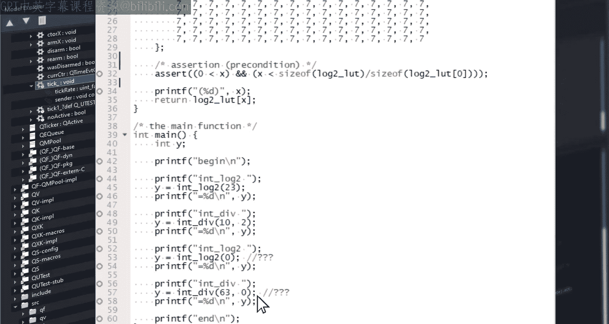

int int_div(int x, int y) {
    assert(y != 0); // 断言除数不为0
    printf("Dividing %d by %d\n", x, y);
    return x / y;
}
```

当然，你可以在一个文件中拥有多个这样的断言。这里还有另一个计算以 2 为底的整数对数的函数。你在关于位运算的课程中遇到过这个函数，当时它在调度器中用于快速找到最高优先级的就绪任务。无论如何，对数运算的参数不能为 0。因此你断言 x 不为 0。此外，这里的函数是用查找表实现的。因此你额外断言索引不会超出表的末尾。

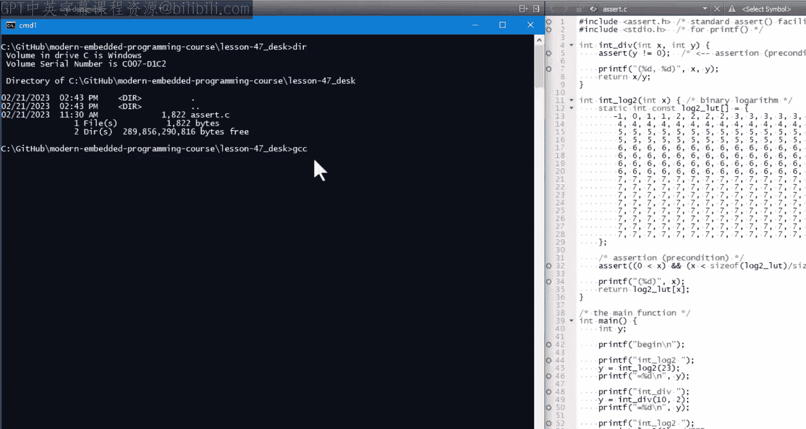


```c
int int_log2(int x) {
    static const int log2_table[16] = { /* ... 查找表数据 ... */ };
    assert(x != 0); // 断言参数不为0
    assert(x < 16); // 断言索引在表范围内
    return log2_table[x];
}
```

现在在 `main` 函数中，你只需用不同的参数调用 `int_div` 和 `int_log2` 函数并打印结果。最后两次调用故意违反了断言，以便你能看到会发生什么。


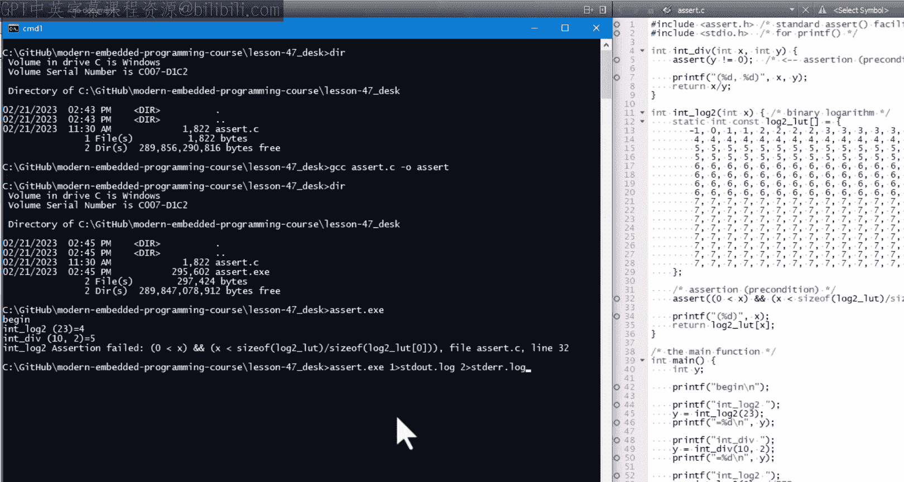

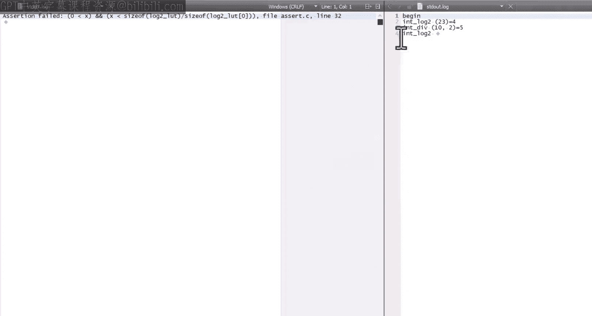

接下来，我将演示如何在桌面计算机上使用 GCC 编译器从命令行构建和运行这个简单程序。代码将在第 47 课的 `codes` 目录中提供。如果你在 Windows 上工作（就像我在这里一样），你可能没有 GCC 编译器。但获取它的一个方法是下载适用于 Windows 的 QP 捆绑包，其中包含一个 `MINGW GCC` 工具集。


你可以使用 GCC 如下构建断言程序。当你运行 `assert` 可执行文件时，可以看到程序会一直运行直到断言失败，而打印输出会告诉你断言表达式以及发生失败的代码行。

在常规运行中，程序产生的输出和失败断言产生的错误信息会混合在一起。但是，当你将输出重定向到 `stdout` 和 `stderr` 流时，可以看到失败的断言将错误信息发送到 `stderr` 流，而程序的正常输出则发送到 `stdout` 流。


最后，你可以看到失败的断言显然会中止程序，因为最后的“end”输出没有产生。这与“断言失败后继续运行没有意义”的前提是一致的。

我想演示的标准断言的最后一个特性，是通过定义 `NDEBUG` 宏来禁用断言的能力。例如，通过编译器的命令行选项。这会导致断言宏扩展为空，因此断言不生成任何代码，也没有开销。当你这次运行可执行文件时，确实不再看到断言信息。有趣的是，现在程序打印出 0 的对数为 -1，因此它从之前导致断言失败的第一次错误中幸存了下来。但程序没有从除以 0 中幸存，而是静默中止了。你只能通过最后的“end”打印输出仍然缺失来猜测程序被中止了。

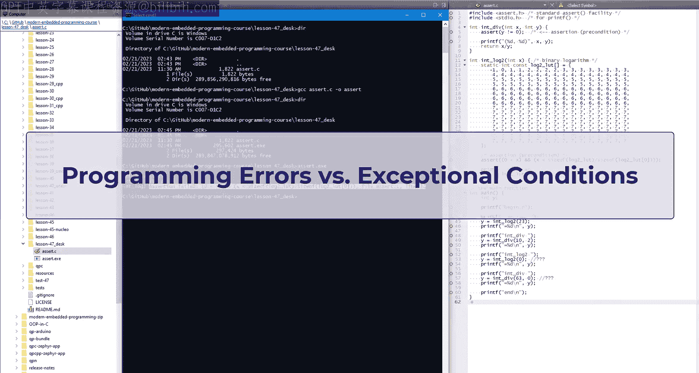

以上就是标准断言工具的全部内容。它非常简单，但不幸的是，不能直接应用于嵌入式系统，因为它们通常没有用于断言消息的 `stderr` 流，也无法像桌面系统那样中止。在本课后面，你将看到一个更适合嵌入式系统的实现。

但在那之前，我想讨论一下断言的正确用法。

## 断言的正确用法

要正确有效地使用断言，你必须清楚地区分程序错误和异常条件。


错误，也称为缺陷，是由于设计或实现错误导致的持久性缺陷。例如，除以 0、数组索引越界、解引用空指针或在初始化之前使用外设。当你的软件存在缺陷时，通常你无法合理地“处理”这种情况。相反，你应该专注于检测、报告并最终修复这个缺陷。此外，你通常无法继续执行。相反，你必须仔细设计一个损害控制策略。这就是断言的用武之地。

与错误相反，异常条件是在系统生命周期内可能合法出现的特定情况，但相对罕见，并且偏离了你软件的主要执行路径。例子包括不正确的用户输入、在本质上不可靠的连接（如无线连接）上的传输错误、异常或降级的操作模式等。在这些情况下，你不应该使用断言。相反，你必须使用常规代码仔细设计和实现处理此类异常条件的策略。


试图将错误当作异常条件来处理，与反过来做一样糟糕。这种编程风格被称为防御性编程。它旨在通过接受更广泛的输入或允许与程序状态不一致的操作顺序，使软件对错误更具鲁棒性。

例如，一个防御性编程的 `int_div` 函数不会使用断言，而是会通过返回某个虚假值（如 `0xFFFF`）来“处理”除数为 0 的情况。同样，一个防御性编程的 `int_log2` 会“处理”低于范围的值，比如返回 -1，高于范围的值则返回另一个编造的值，如 999，只有在其他情况下才返回查找表中的真实值。

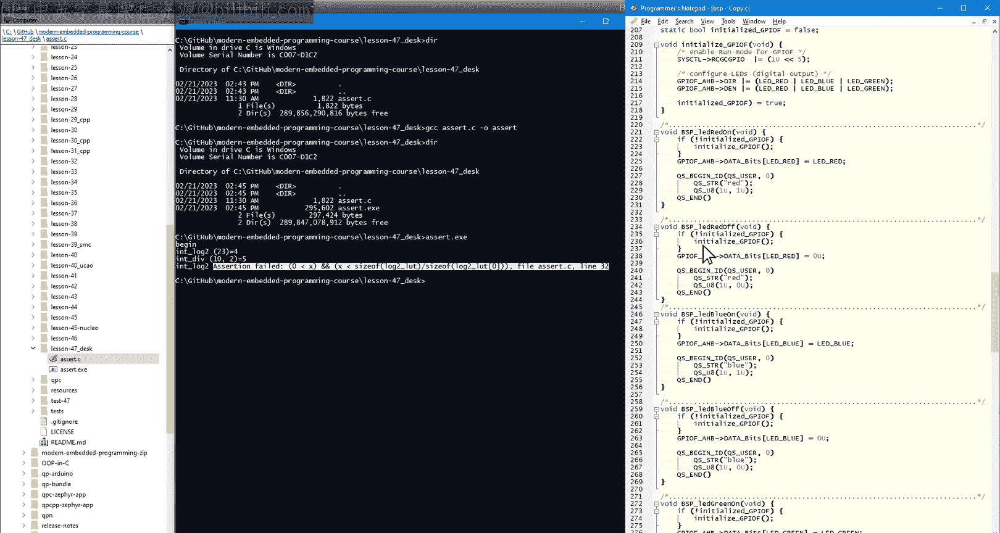

另一个例子是用于在你的 O Tva C Launchpad 开发板上打开和关闭 LED 的板级支持包函数。通常，这些函数只是简单地写入 GPIO 寄存器，假设 GPIO 外设已经初始化。但如果是防御性编码，这些函数会检查 GPIO 是否已初始化，并在需要时静默执行初始化。


防御性编程经常被宣传为一种更好的编码风格，但不幸的是，它会隐藏缺陷，并且常常由于额外的复杂性而引入新的缺陷。也请注意，像对不正确的用户输入做出反应或车辆跛行模式这样的行为，总是有意设计和专用代码的结果。具体来说，期望这种行为能奇迹般地从防御性编程中产生是相当天真的。相反，防御性编程更有可能产生虚假、不正确的结果和不良行为。

回到断言，一个将断言提升到新水平的强大方法是契约式设计。它由 Bertrand Meyer 在 20 世纪 80 年代中期开创。视频描述中提供了 Bertrand Meyer 关于应用契约式设计的文章链接。

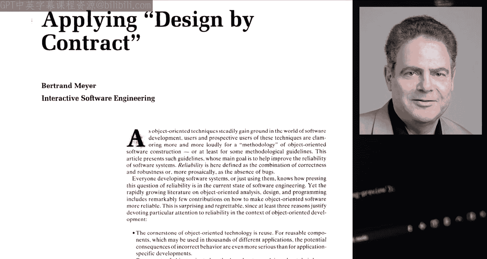


契约式设计将断言视为软件组件之间相互义务的规范，类似于人与人之间的契约。该方法的核心思想是将这些契约作为断言内在地嵌入到代码中，并在运行时自动验证它们。

契约式设计的视角帮助你真正理解软件断言。也就是说，断言不是错误处理机制。它们既不处理也不防止错误，就像人与人之间的契约不能防止欺诈一样。例如，断言除数不为 0 并不能真正防止用 0 作为除数调用 `int_div` 函数。同样，断言数组索引在范围内可能会给你一种你已经处理或防止了缺陷的温暖而模糊的感觉，但实际上你并没有。

然而，真正发生的是，你确实建立了一个契约，在其中明确规定了你的 `int_log2` 函数的参数必须在某个范围内。只要断言被启用，契约就会被自动检查，并且可以肯定的是，如果契约失败，程序将粗暴地中止。

起初，你可能会认为这一定是倒退的。断言不仅对处理（更不用说修复）缺陷毫无作用，而且实际上通过将每个断言条件（无论多么良性）都变成致命错误而使情况变得更糟。然而，请回想一下前面的讨论，处理缺陷的首要任务是检测它们，而不是隐藏它们。

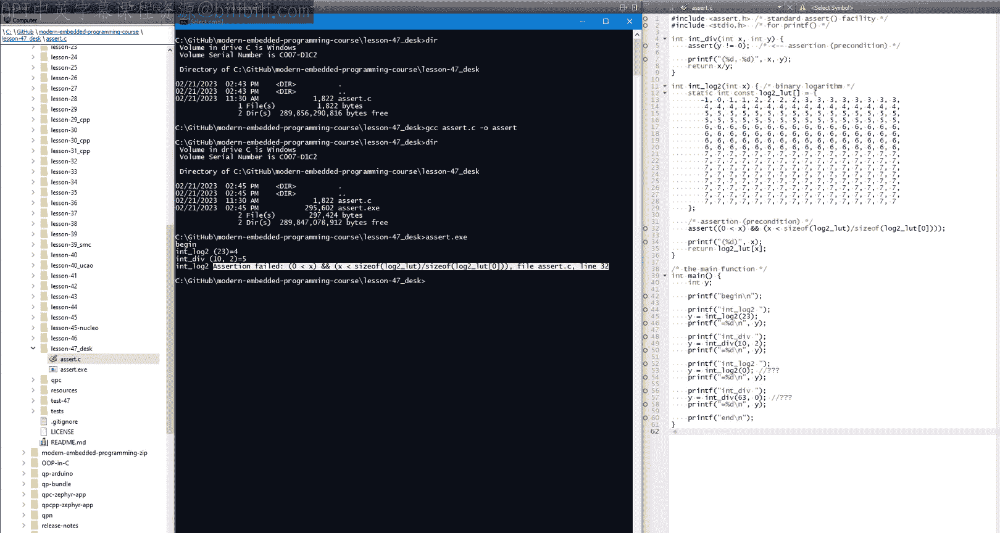

为此，一个导致程序大声崩溃并精确指出哪个契约被违反的缺陷，比一个微妙的、在距离你本可以轻松检测到它的位置数百万条机器指令之后才间歇性显现的缺陷，要容易发现和修复得多。此外，正如你稍后将看到的，断言可以提供最后一道防线，并提供执行纠正行动和损害控制的机会。相比之下，防御性编程向缺陷投降，不提供这样的机会。


除了将断言视为契约之外，另一个有见地的类比是将软件中的断言对应于电路中的保险丝。

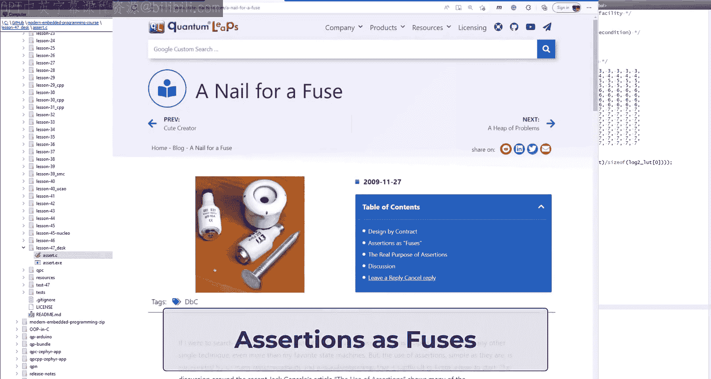

电气工程师在电路的各个位置插入保险丝，以引入受控的损害，在电路故障或被误操作时烧断保险丝。很难想象任何非平凡的电路（如家庭布线或汽车的电气系统）没有许多不同额定值的保险丝。


请注意，保险丝既不能防止也不能解决问题。因此，在问题的根本原因被消除之前，更换烧断的保险丝是没有帮助的。事实上，“缺陷”和“调试”这两个术语起源于在布线中发现的真实虫子。只有在移除虫子后，问题才得以解决。

这结束了关于断言和契约式设计的两部分系列的第一部分。

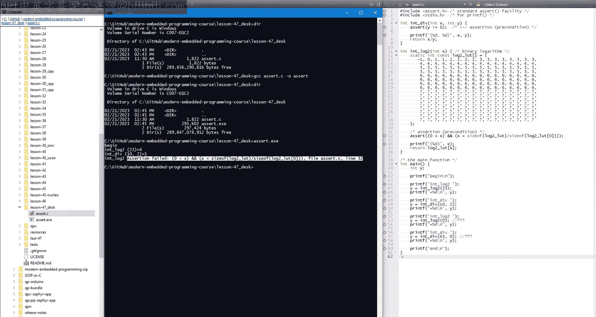


在第二部分，你将看到如何在嵌入式 C 或 C++ 中应用断言和契约式设计。

如果你喜欢这个频道，请给这个视频点赞并订阅以保持关注。你也可以访问 `statemachine.com/video-course` 获取课堂笔记和项目文件下载。最后，所有项目也可以在 GitHub 的 `QuantumLeaps` 仓库 `modern-embedded-programming-course` 中找到。

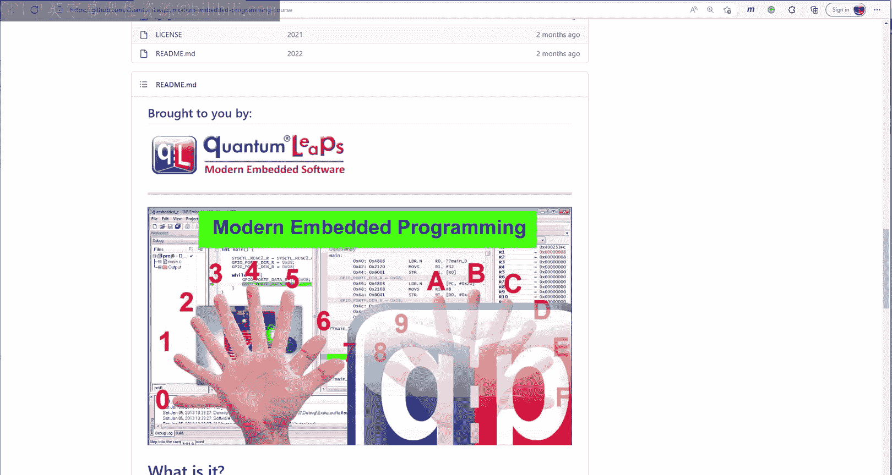

感谢观看。🎼