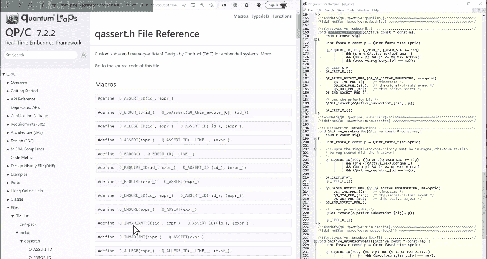
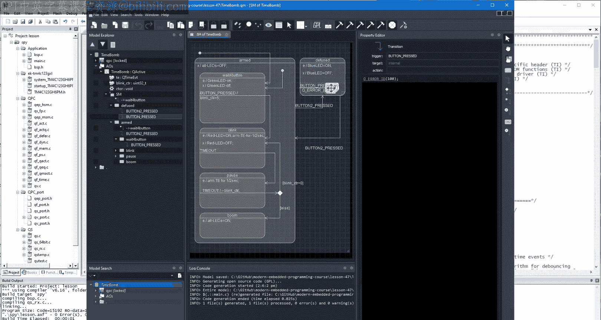
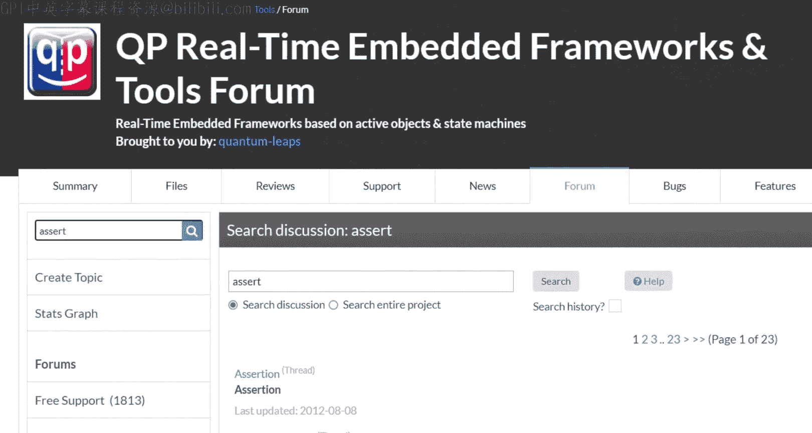
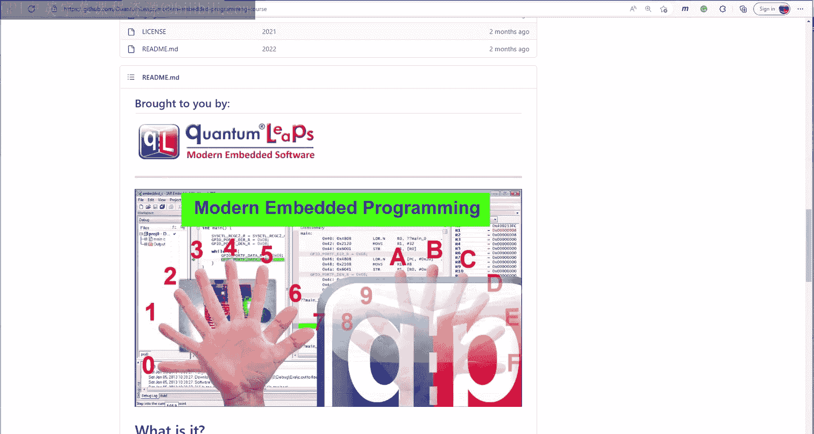

# Quantum Leaps《现代嵌入式系统编程Modern Embedded Systems Programming》中英字幕 p49 -49-#48 Assertions and Design by Contract, Part-2.zh_en -BV1fRt2efEms_p49-

🎼，Hello and welcome to the modern embedded systems programming course。 My name is Mirosak。

 and in this lesson， I'll continue the subject of assertions and design by contract Today。

 you'll learn how to apply them in embedded systems。

To quickly summarize what happened so far in the previous lesson 47。

 you learned what assertions are and how they are implemented in the standard C facility。

 assert dot H。You've also learned about design by contract。

 DBC and the proper use of assertions to avert errors and not to handle exceptional conditions。Today。

 you'll see how to apply assertions and DBC in embedded C。

You'll also consider several aspects of the implementation and deployment of assertions in embedded systems。

So let's see how to implement assertions in an embedded systems friendly way。

Here I will quickly review the implementation consisting of a single header file。

 Q Ser dot H located in the QPC framework。 This is a self contained file。

 and you can use it outside of the QP framework in your own projects。Actually。

 you've been already using these assertions on multiple occasions。 For example。

 in the lessons about the art。Usually I would review the raw file。

 but today I'd like to show you a review of the documentation generated by Dxgen because it's often an easier way to explore the code。

The documentation is located in the QP On manual that can be found on the statemachine。

 co website through the product/lash QPC manual menu。To find quickly what you need。

 type Q Aser into the search box。The first documented macro is Q As I D。

 which is a general purpose assertion used later for all other assertion variants。

The macro takes two parameters， the ID number， which should be unique within a given module and a Boolean expression to check。

The macro itself is defined by means of the ternary operator， which is standard practice。

 For example， here is the standard Ased H header file from the Ar K compiler 6 that you've been using through microvision I DE。

 The ternary operator is used to define all versions of the asserted macro in that file。

A significant advantage of defining a as an expression as opposed to a statement。

 is that it can be safely used inside if L control flow。 If you define a as an F statement。

 you could run into the dangling else problems。The else brand from your code could be misunderstood as else from the assertion。

 if statement。But going back to the Q As ID definition， the Boolean expression X is evaluated。

 and if it is true， the turnernary operator returns zero cast on void， just like the standard assert。

Otherwise， theterernary operator calls the Q on Asert function， which， as you can expect。

 will be your custom error handler。To uniquely identify the specific assertion。

 the Q on aer callback function takes the ID parameter and the Q this module string。

This is a departure from the standard practice of identifying assertions with the underscore underscore line number and the underscore underscore file string。

Why depart from the beaten path。 Well， underscore underscore underscore line is quite an unstable I D for an assertion。

 because adding or removing lines changes all the following line numbers。

As I will discuss in a minute， Test assertions requires a stable way of identifying them。Similarly。

 the string generated by underscore underscore file often depends on how the file is specified to the compiler。

If the file is specified with a path name， underscore underscore file expends accordingly。Also。

 if you use multiple assertions in a given file， some that compilers might generate multiple copies of the file string。

 which is wasteful。To avoid all such problems， the Q asserter header file provides a macro Q define this module where you can define your own module name string。

 typically at the top of each module。That static and cons pointer will be subsequently used in all assertions in a given file。

Going back to the Q on As function， it is defined as never returning with the Q No return macro。

If that macro is not defined elsewhere， the default definition uses the C 99 and no return specifier。

 This can help the compiler to perform optimizations as execution paths that violate asserted conditions are unreachable。

Additionally， if you use static analysis tools， the Q onassert function should be given the no return semantics。

 like it is done in the QPC framework for the PCL plus static analysis tool。

 This helps the tool to better understand your code and avoid diagnostics for asserted conditions。

Now， Q Ased H provides many other assertion variants， such as Q require， Q and sure and Q invariant。

 These correspond to preconditions， post conditionsditions and invaris respectively。

 The names of the macros are direct loans from the EiffL programming language that natively supports designed by a contract。

The most useful and frequently used are preconditions。

 which you designate with a macro Q required ID or Q required。

Preconditions are specified inside the functions， but they spell out contractual obligations for the colors of these functions。

 So when the precondition assertion fails， you know the problem is not with a function。

 but rather an incorrect call to that function。Using a precondition assertion as opposed to just a generic assertion is an excellent way of documenting a function and providing a hint as to where the problem might be。

In that way， preconditions should be an integral part of the function's documentation。

 just like the list of parameters， because the colors of the function should know and satisfy the preconditions。

The other variants of assertions like post conditions and invariants are less frequently used。

 but also provide valuable documentation as to the purpose of these assertions。

Another frequently used assertion variant is Q error， which simply calls Q on As。

 This one is useful for incorrect paths through the code， such as unwanted events in a state machine。

Regarding the Q onassert handler in the traditional use of assertions only during debugging。

 you might get away with a simplistic implementation such as an endless loop。That way。

 when an assertion happens。You can break into the program with a debuggger and find it conveniently spinning inside Q on Ast。

You can then inspect the call stack to see where the assertion fired。

But you can also leave assertions enabled in the final product。

 which I will strongly advocate in a minute。 In that case。

 the assertion handler becomes critically important as your last line of defense after detecting an error。

To provide real protection， however， the assertion handler must be carefully designed to perform damage control and corrective actions for your specific system。

Please remember that the assertion handler should not return。

 So most of the time it should end with resetting the system For that。

 the Sis provides the function and Vic system reset。Also。

 please remember that the assertion handler runs after your system has already been compromised。

 For that reason， the assertion handler is not your usual code and must be carefully tested under various fault conditions。

 such as stack overflow， inner appreemption， etc cetera。For such testing。

 I highly recommend the fault injection technique you saw in several lessons in this video course。

For example， you can intentionally change the stack pointer S P register to simulate stack overflow and then cause an assertion failure。

In programming languages that support throwing and catching exceptions such as C++。

 assertion handlers often throw exceptions。In my opinion， this is a mistake for a couple of reasons。

First， throwing an exception makes sense only if that exception can be cut and reasonably handled with an intent to continue program execution。

None of this applies if assertions are used correctly。And second。

 throwing an exception involves unwinding this stack。

 which implicitly assumes that the stack hasn't been compromised。

The main purpose of the fu analogy was to recognize that the power of assertions derives from their simplicity。

You should keep the assertion handler as simple as possible， because any complications。

 such as throwing exceptions only increase the chance of failures while already in a compromised situation。

 thus defeating the purpose of effective damage control。

So far this lesson was only about software assertions placed explicitly in the source code。

 but there are also several failure conditions detected in hardware， for example。

 in the lessons about the startup code， you've seen socalled fault exceptions such as hard fault。

 men manage， Bu fault and usage fault。Traditionally。

 these conditions haven been seen as related to assertions， but for all intents and purposes。

 the hardware fault handlers and the assertion handler have the same function。

Unlike software assertions， you cannot disable hardware faults in the final product。

 so you cannot get away with fault handlers coded as endless loops。Unless there is。

 the users of your devices can tolerate permanent denial of service。Therefore。

 since you must implement a robust fault handler anyway。

 you might as well develop just one common handler for both hardware and software assertions。

This is precisely how the start code that you've been using in most of the lessons of this course is structured。

 As you can see， the fault handlers branch to assert fail。

 which carefully resets the stack pointer in case of stack overflow。

 and then it calls the familiar Q onassert handler。As I confessed in the introduction。

 assertions helped me more than any other programming technique。For example。

 if you search the Quaum Les Free support forum for Ast， you will find 23 pages of posts。

Many start with an assertion failure report and end with an observation of how difficult the bug would be to find and fix without the particular assertion。

But you don't need to take only my word for it。One of the rules for developing safety critical code by NASA JPL Laboratory for reliable software is not only to use assertions。

 but to achieve a sufficient density of about two assertions per function。Also。

 Microsoft Researched published a paper showing studies of commercial software projects were moduled with a low density of assertions had much higher post release bag rates than those seeded with many assertions。

By the way， links to all papers and resources the I will be provided in the video description。

As Perertrand Meer remarked， the use of assertions will completely change your approach to software。

 and in particular， your view of errors。Working with software programmed offensively with assertions feels completely different than software programmed defensively。

With the recommended density of assertions， the surface stops producing undesired behavior。

 denial of service or crashes。 All bugs manifest themselves as assertion failures。

 This effect is truly amazing。😊，The integrity checks embodied in assertions prevent the code from unquote。

 wandering around。Even hardware failures and broken belts don't crush and burn。

 but end up in the asserterion handler。Once an insertion fires。

 dismissing the problem as an intermittent glitch is much harder。 So all errors require attention。

You also have a record in the form of a unique assertion I D to start your investigations。

 This makes most bugs more transparent。In contrast。

 testing defensively programmed code is inconclusive。 You might be running tests for days and nights。

 but you can never be sure if the runs were truly successful or perhaps the programme silently produced garbage all night long。

As I already mentioned， software assertions can be disabled and discern that practices to use them only during debugging。

 but disable them entirely in the final product。 For example。

 here is what I heard just yesterday from one engineer working on a medical device。

We don't have assertions enabled in the released version of our code base。

 The goal is to detect and fix assert failures during the development。

I absolutely agree with a second sentence to do everything in our power to fix all bug during development and never fail assertions in the final product。

But once assertions have been used and tested， I don't really understand the logic behind disabling assertions。

All the analogies for forming the proper mental model of assertions also show that disabled assertions is frankly。

 ridiculous。If you think of assertions as fuses， would you replace all the fuses with nails。

 coins and paper clips for real use？How would you feel if you discover the fuse box fixed like that in a car you are about to drive or an airplane。

 you are about to fly。It wouldn't inspire much confidence in your safety， would it。Yet。

 this is precisely what disabling assertion does to the code。

If you think of assertions as guardrails， would you prefer to drive on a mountain road with or without them。

I mean， you never intended to hit the guard anyway。 so you don't need them， right。Finally。

 if you view assertions as an insurance policy， Would you cancel it right before a fire season。

 I mean， you don't really want to cash such a policy， do you。But if your house burns down anyway。

 it sure helps to have a damage control mechanism in place。I hope you get the picture。

This concludes the lesson about assertions and designed by contract for embedded systems。

If you like this channel， please give this video a like and subscribe to stay tuned。

You can also visit statemachine。 com s video course for the class notes and project via downloads。

Finally， all the projects are also available on GitHub in a quantumntum Les Reository modern embedded programming course。

Thanks for watching。

🎼。