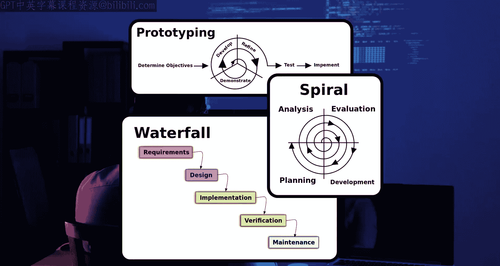
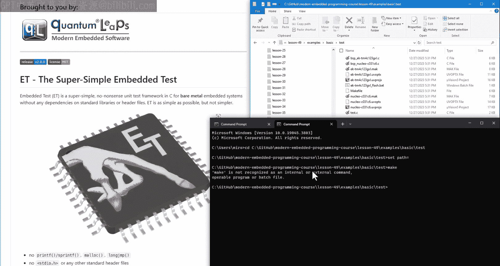
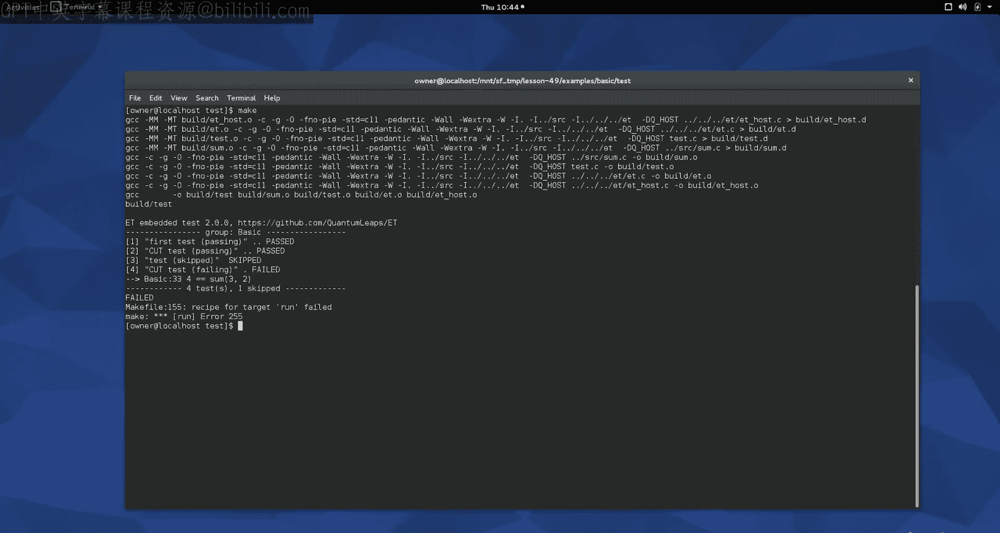
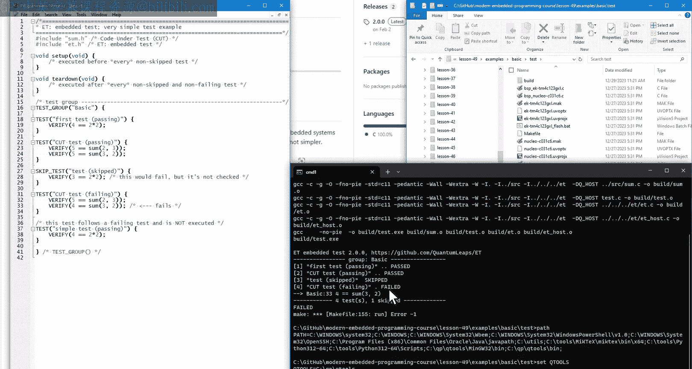
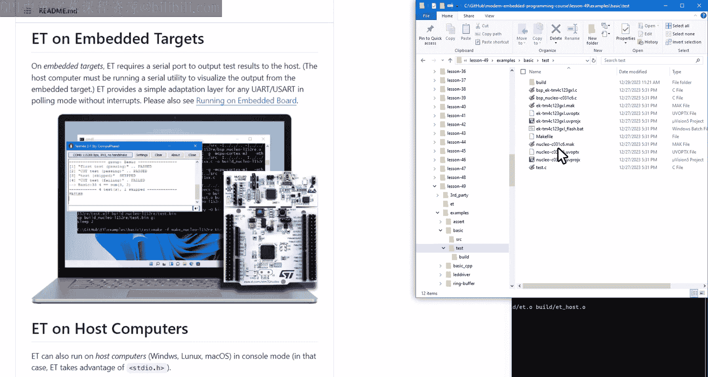
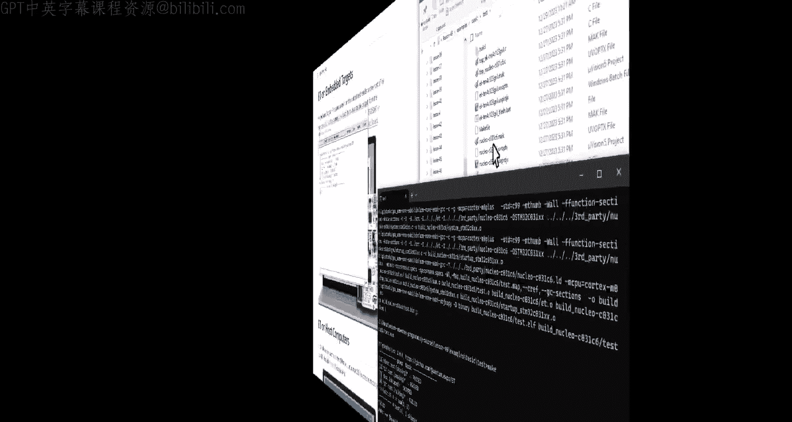

# 现代嵌入式系统编程：第49课：嵌入式单元测试 🧪

在本节课中，我们将探讨测试在软件开发中的核心作用，并学习如何在主机和嵌入式目标上进行单元测试。我们将介绍必要的工具，并通过一个名为Embedded Test（ET）的测试框架进行实践。

## 概述

软件开发本质上是创建复杂系统的过程。历史经验表明，任何复杂系统都无法通过一次性设计完成，而必须从一个简单、可工作的系统逐步演化而来。测试，特别是持续进行的测试，是驱动这一演化过程的关键选择机制。本节课将聚焦于单元测试，这是开发人员在编写代码时进行的最广泛的测试类型。

## 复杂系统的演化

上一节我们介绍了软件开发与复杂系统演化的相似性。本节中，我们来看看达尔文的自然选择理论如何启发软件开发。

在1859年达尔文发表《物种起源》之前，主流观点认为所有生物都是以其当前完美且最终的形式被一次性创造出来的。达尔文的自然选择进化论则提出了截然不同的解释：所有生物体都是通过从简单到复杂的渐进、累积的演化过程而产生的。

一个鲜为人知的事实是，在达尔文之后，另一位作者（即本课程讲师Miro Samek）发表了一篇名为《论软件的起源》的著作，将达尔文的思想推广到软件开发领域。该著作提出了三个重要观点：

1.  一个能工作的复杂系统，总是从一个能工作的简单系统演化而来。
2.  一个从零开始设计的复杂系统永远不会工作，也无法使其工作。你必须重新开始，从一个能工作的简单系统起步。
3.  （前两点的推论）在嵌入式系统中，**除非所有部分都工作，否则没有任何部分能工作**。

不幸的是，在软件真正被发明时，人们仍然相信“大爆炸”式的设计方法，即进行大量的前期设计，最后进行集中测试。这种方法缺乏增量开发和持续选择这两个对创造复杂事物至关重要的演化要素，因此无法成功。

## 敏捷开发与测试驱动

在软件领域，通过选择进行演化的重要性被多次重新发现和遗忘。直到最近的“敏捷开发”运动，才完全承认并拥抱测试作为必须持续应用的主要选择机制。

测试不仅用于剔除不良的“适应”（即软件中的Bug），还用于指导整个开发过程。这种以测试为指导的方法也称为**测试驱动开发（TDD）**。

其他敏捷最佳实践，如**持续集成（CI）**和**持续交付（CD）**，看似是最近的发明，实则只是承认了软件系统必须像任何复杂系统一样持续保持工作状态。如果它停止工作，使其再次正常运行就如同试图复活一个死去的生物。

## 人工选择与测试环境

既然我们已知演化与强选择是软件开发的唯一途径，那么问题就变成了：如何演化软件？测试应提供何种选择机制？

显然，软件开发没有亿万年的深进化时间，客户也不会接受在真实环境中测试软件的所有迭代版本。但我们可以使用**人工选择**，就像人类驯化所有动植物一样。人工选择在更短的时间尺度上工作，但它要求我们对自己想要选择什么以及如何精确选择负起全部责任。

为此，我们需要一个合适的软件演化起点（第一个可工作的版本），还需要为软件创建一个**人工栖息地**。这个人工栖息地取决于你希望执行的测试类型。

## 单元测试框架

本节课重点讨论**单元测试**，它涉及可以隔离并单独测试的最小粒度组件，例如C语言中的函数和模块。单元测试是（或至少应该是）原始开发人员在编写代码时进行的最广泛的测试类型。

一般来说，测试级别越低，所需的软件栖息地（即测试环境）就越广泛。对于单元测试，这个人工创建的栖息地称为**测试工具**或**测试框架**。

以下是几个可用于嵌入式软件的单元测试框架：
*   **CppUTest** 和 **Unity**：两者都在James Grenning的著作《Test Driven Development for Embedded C》中使用。
*   **Google Test (gtest)**：另一个流行的测试框架。

本节课将重点介绍一个独特的测试框架：**Embedded Test (ET)**。它比其他方案更简单，但可以运行Grenning的TDD书中描述的所有测试。ET使用C语言编写，但不像Unity那样需要测试运行器。它可以在主机计算机和嵌入式板上运行，只需最少的移植工作。

## 获取与设置ET

ET是采用宽松许可证的开源软件，你可以从GitHub获取。

假设你已经将ET下载为ZIP文件，请将其解压到你为本课程保存项目的目录中。解压后，将主目录重命名为 `lesson49`。

进入 `lesson49` 目录，在Windows资源管理器中右键点击并选择“在此处打开终端”。

到目前为止，本课程只使用了集成开发环境（如Keil、IAR、TI CCS）。但单元测试通常直接从命令行执行。因此，今天你将使用终端来了解其工作原理。

ET自带示例，让我们从最基本的 `basic` 示例开始。它虽然简单，但展示了单元测试典型的代码组织方式：被测代码位于 `src` 子目录，测试代码位于 `test` 子目录。

首先进入 `test` 子目录，运行测试。在终端中输入 `make` 命令。这将调用 `make` 实用程序，执行当前目录下 `Makefile` 中规定的构建过程。构建完成后，`make` 会立即运行测试，这在单元测试中是惯例。

然而，你的机器上可能没有安装 `make` 实用程序或 `GCC` 编译器，因此运行 `make` 可能会失败。

## 安装构建工具（QTools）

你有几种选择来获取 `make` 和其他在构建和测试中常用的类Unix风格工具。

一个便捷的选择是使用 **QTools collection for Windows**，它专门设计为在一个简单的安装中提供所有必需的工具。

1.  从GitHub的QTools发布页面下载最新的数字签名Windows安装程序（这是最简单的方式）。
2.  运行安装程序。建议将其安装到没有空格或特殊字符的路径（例如 `C:\qp`）。
3.  安装后，QTools的 `bin` 目录包含 `make` 等工具，`mingw32` 目录包含用于主机的GCC编译器，`gnuarmeclipse` 目录包含用于ARM板的交叉编译器。

如果使用安装程序，QTools目录会自动添加到你的系统 `PATH` 环境变量中。如果使用ZIP文件，则需要手动修改 `PATH`。

## 分析测试示例

现在让我们回到基本的单元测试示例，查看被测代码和围绕它的测试。

被测代码非常简单，包含 `sum.h` 和 `sum.c` 文件。`sum` 函数计算并返回两个整数参数的和。

位于 `test` 子目录中的测试文件更有趣：
1.  它首先包含被测代码和ET测试框架头文件。
2.  接着是 `setUp` 和 `tearDown` 函数，ET在每个测试前后执行它们。
3.  然后是**测试组**，它提供这组测试的名称，并在终端中显示输出。
4.  接下来是**单个测试**。它们以 `TEST` 宏开始，后跟测试描述。在测试内部，使用 `VERIFY` 宏来评估提供的布尔表达式。只有当该测试中所有 `VERIFY` 表达式都为真时，测试才通过。否则，测试在第一个失败的 `VERIFY` 处失败。

这个基本测试组还演示了如何**跳过**一个测试（ET不执行它），以及一个**故意失败**的测试，该测试会终止测试运行并打印出行号和失败的表达式。ET在一个测试失败后不会执行任何后续测试，因为系统可能处于未知状态。

ET与其他用C编写的单元测试框架（如之前提到的Unity）的一个显著区别是，**ET不需要任何测试运行器**。在ET中，单个测试只是具有自己作用域的代码块，它们都位于一个测试组函数内。

## 双目标策略

你可能已经注意到，我们一直在主机计算机上进行测试。James Grenning将这种策略称为**双目标**，意味着从第一天起，你的代码就被设计为在两个平台上运行：最终的嵌入式目标和你的开发主机。

双目标有时被误认为是在主机上使用QEMU等软件模拟嵌入式目标。但实际上，双目标更简单：你使用主机上的原生编译器（如MinGW GCC）构建嵌入式代码，并在主机上运行测试。

双目标策略有许多好处，例如更快的演化周期（避免了目标硬件瓶颈），以及更容易自动化基于主机的测试。但最重要的是，双目标会影响你的设计，因为为了在主机上测试嵌入式代码，你必须密切关注硬件和软件之间的边界。

## 在嵌入式目标上运行测试

然而，仅在主机上运行测试是不够的，至少偶尔需要在嵌入式目标上运行测试。ET测试框架专门设计得易于实现这一点。

回到基本的ET示例，除了用于在主机上构建和测试的 `Makefile`，你还可以找到分别用于在EK-TM4C和Nucleo-C031嵌入式板上测试的 `.mak` 文件。

**在EK-TM4C (Tiva LaunchPad) 上测试：**
1.  将板子连接到计算机，并打开串行终端（如QTools提供的Termite）。
2.  在终端中，进入 `test` 目录，运行命令：`make -f ektm4c123gxl.mak`
3.  这使用QTools中的ARM交叉编译器构建相同的测试代码。构建后，`make` 会上传代码到目标板。由于LM Flash工具的一些问题，该Makefile会提示你手动复位板子。复位后，测试执行，串行终端显示测试运行结果，与主机上产生的输出相同。

**在Nucleo-C031上测试：**
1.  连接Nucleo板，关闭之前的串行终端并重新打开以连接到新板子。
2.  运行命令：`make -f nucleoc031c6.mak`
3.  你可能会收到提示，要求提供USB驱动器盘符（因为Nucleo板在电脑上显示为USB驱动器，可通过复制二进制文件来编程）。根据你电脑上的盘符进行设置（例如 `make -f nucleoc031c6.mak USB_DRIVE=G`）。
4.  该命令将构建、上传并自动在板子上执行基本测试。同样，输出到串行终端的结果与之前相同。

## 测试框架的工作原理

在嵌入式系统中，最大的问题是如何将信息（例如本例中的测试结果）从板子传输到主机。ET采用的解决方案与第45课中软件跟踪使用的方法类似：通过UART进行通信。这总是取决于特定的板子，因此在 `test` 目录中，有针对Tiva C和Nucleo板的**板级支持包（BSP）**。

查看其中一个BSP，你会看到三个ET回调函数：
*   `ET_onInit`：初始化UART。
*   `ET_onPrintChar`：向UART传输一个字符。
*   `ET_onExit`：实现在所有测试完成后行为。嵌入式目标无法真正退出，因此此函数会进入一个无限循环，闪烁板载LED。

ET没有使用 `printf`，因为 `printf` 是一个庞大的函数，且使其与任何特定UART配合工作依赖于具体实现。ET的设计原则之一是小心避免对标准库或任何其他库的依赖。

但这些限制对主机计算机无关紧要。在ET目录下的 `EThost.c` 文件中，为这三个回调提供了实现，它使用了标准库中的 `fputc` 和 `exit` 函数。

## 总结与要点

本节课我们一起学习了嵌入式软件测试的核心概念与实践。最重要的收获是：创建非平凡软件的唯一途径是**演化它**。软件开发的赢家是那些通过应用更好、更智能、更有效的测试技术来更快地消除缺陷，从而更快地演化软件的团队。

这种软件演化由**人工选择**引导，这需要为测试软件构建人工环境。本节课让你对单元测试的一种人工环境——单元测试框架——有了一个总体认识，但大多数此类框架的总体思路是相似的。

单元测试的新手常常困惑于到底在测试什么。第一印象可能认为测试只关乎被测代码和测试本身。但你必须意识到，所有测试都必然同时涉及被测代码和测试环境。因此，像TDD这样的方法论建议在没有被测代码的情况下开始这个过程。这个首次失败测试的目的，实际上是为了**测试环境**。

最后，当你开始更系统地进行测试时，你会积累很多测试。一方面，这些测试对于检查你的软件是否持续工作以及新功能是否破坏了旧功能（称为**回归测试**）很有价值。另一方面，测试也是代码，你拥有的代码越多，进展就越慢。诀窍在于找到正确的平衡，并丢弃相关性较低的测试。保留所有测试是一个错误。

---

如果你喜欢本频道，请给本视频点赞并订阅以保持关注。你也可以访问 statemachine.com/video-course 获取课堂笔记和项目文件下载。最后，所有项目也可以在GitHub的 Quantum Leaps 仓库 “Modern Embedded Programming” 课程中找到。

感谢观看！