# 0：入门指南 🚀

在本节课中，我们将学习如何开始现代嵌入式系统编程课程。我们将介绍课程的核心目标、所需的软硬件准备，以及如何设置开发环境。课程旨在从基础开始，深入讲解嵌入式微控制器的编程实践。

## 课程概述

欢迎来到现代嵌入式系统编程课程。在本课程中，你将学习如何以现代方式对嵌入式微控制器进行编程。内容从基础知识开始，一直延伸到当代的嵌入式编程实践。

本课程的独特之处在于，它会频繁深入到机器层面，向你展示嵌入式微控制器内部发生的具体过程。这种更深层次的理解将使你能够更高效、更自信地应用相关概念。

我的名字是 Miro Samek，我是一名拥有超过30年经验的嵌入式软件工程师。我热爱教学，我的视频课程、书籍、文章和会议演讲帮助了许多开发者提升技能、通过面试并获得嵌入式编程职位。

## 课程的相关性与先决条件

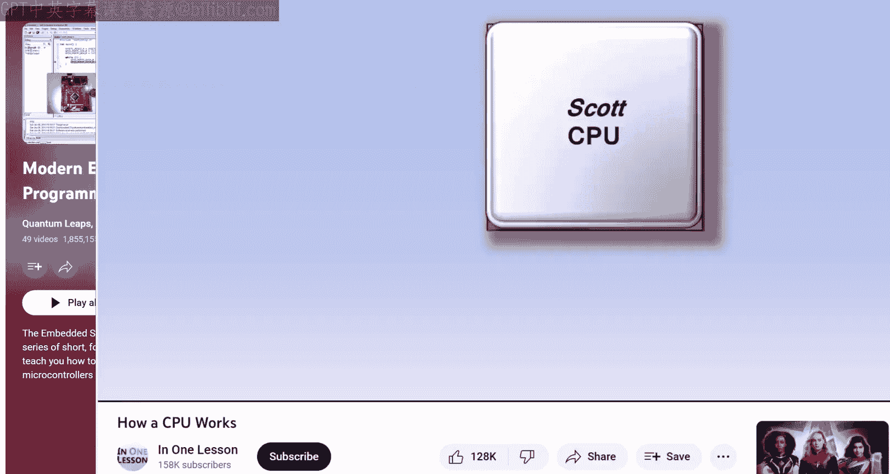

这门嵌入式编程课程自2013年持续至今。人们常问，它是否仍然具有现实意义。答案是肯定的，甚至可能比最初更为重要，主要有两个原因。

首先，本课程专注于嵌入式编程中那些永不过时的核心和基础概念。其次，本课程基于当前主流的 ARM Cortex-M 架构，该架构的普及度已大幅提升。掌握 ARM Cortex-M 是雇主最看重的技能之一。

关于本课程的先决条件，虽然我从基础开始讲解，但这部分内容简短且专注于 C 语言编程的嵌入式方面。因此，你可能需要额外学习 C 编程语言来补充本课程。了解 CPU 的工作原理也会很有帮助。

## 硬件与软件准备

为了从本课程中获得最大收益，你应该跟随课程并在你的电脑上运行讨论的项目。为此，你需要一些硬件（一块嵌入式开发板）和软件（一套嵌入式开发工具链）。

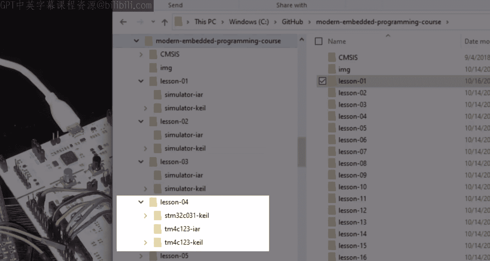

本课程主要使用的嵌入式开发板是德州仪器基于 ARM Cortex-M4F CPU 的 Tiva C Launchpad。这块板子价格低廉、功能齐全，并内置了硬件调试器，支持单步调试和检查 CPU 内部状态，这对本课程至关重要。该板仍在生产，可从众多分销商处购买。

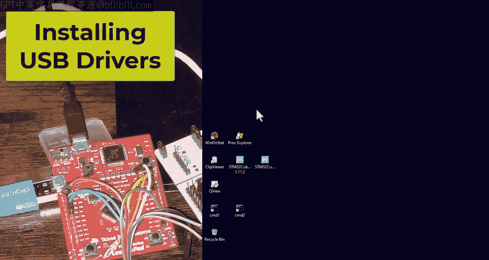

课程下载内容现在也包含基于 ARM Cortex-M0 CPU 的较新的 STM32 Nucleo-C031C6 开发板的项目版本。这块板子同样价格低廉、功能齐全，并内置了功能更丰富的硬件调试器。未来可能会添加其他类似的低成本 ARM Cortex-M 开发板。

此外，课程最初的几节课会使用模拟器，因此你不需要立即拥有硬件。然而，后续涉及与微控制器外设交互的课程则需要一块实际的嵌入式开发板。

## 硬件驱动安装

当你首次收到嵌入式开发板并将其插入 USB 端口后，需要检查 USB 驱动是否正确安装。通过右键点击 Windows 图标并选择“设备管理器”选项来打开设备管理器。

对于 Tiva C 开发板，正确的驱动应该是“Stellaris In-Circuit Debug Interface”。如果你看到其他内容，则需要重新安装驱动。为此，你首先需要下载正确的 USB 驱动，可以按照开发板包装上的说明，或从本视频课程的配套页面 `statemachine.com/videocourse` 下载。

下载后，将驱动解压到磁盘上的某个位置。接下来，右键点击设备描述，选择“更新驱动程序”。选择“浏览我的计算机以查找驱动程序”，并指向你解压驱动的目录。

如果因任何原因 USB 安装不成功，你可以随时点击“卸载设备”，然后再次尝试更新驱动程序。上述过程对于给定的开发板只需执行一次，但当你获得不同的开发板时（例如 Nucleo 板需要使用 ST-LINK 驱动），则需要重复此过程。

## 软件开发工具链

就软件而言，你需要一套嵌入式开发工具链。本课程最初使用的是 IAR Embedded Workbench for ARM，这是一个专业的工具集，拥有良好的编译器和稳定的调试器。多年来，该工具曾提供免费的、有大小限制的 Kickstart 许可证。但最近情况发生了变化，目前唯一剩下的免费选项似乎是两周的评估许可证。

因此，本课程的项目下载已更新，现在包含适用于多个工具集的版本，包括我稍后介绍的 Keil MDK。但回到 IAR，如果你希望使用与视频第1至18课相同的工具集，可以下载 IAR 评估版。安装过程简单直接，尽管需要一些时间。我建议将工具集安装到没有空格和特殊字符的目录名中，例如，我将我的 IAR 工具集安装在 `C:\tools\iar` 目录。

首次启动 IAR Embedded Workbench 后，你可能需要申请许可证。你需要向 IAR 注册并通过电子邮件接收许可证密钥。获得后，你需要将其输入许可证对话框中。

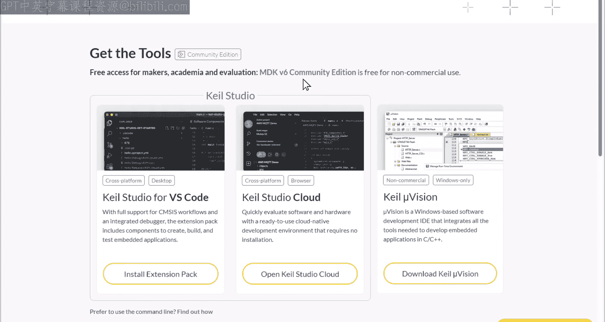

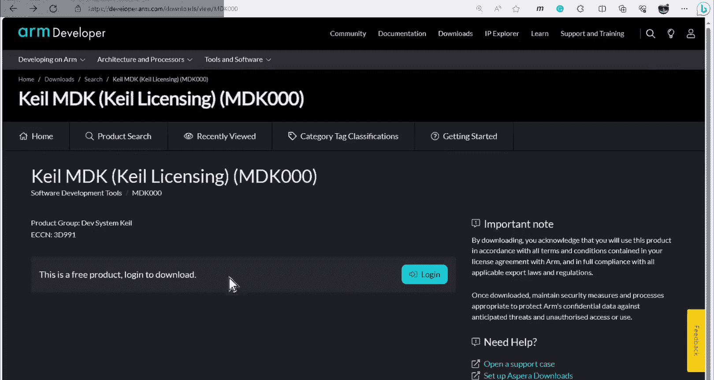

Keil MDK（微控制器开发套件）是本视频课程中使用的另一个专业开发工具集。与 IAR Embedded Workbench 不同，Keil MDK 提供了越来越宽松的许可，包括免费的 Keil MDK v6 社区版。本课程从第21课开始使用 Keil MDK，但所有课程（包括最初使用 IAR Embedded Workbench 或 TI Code Composer Studio 的第1至21课）都已添加了 Keil 版本的项目。

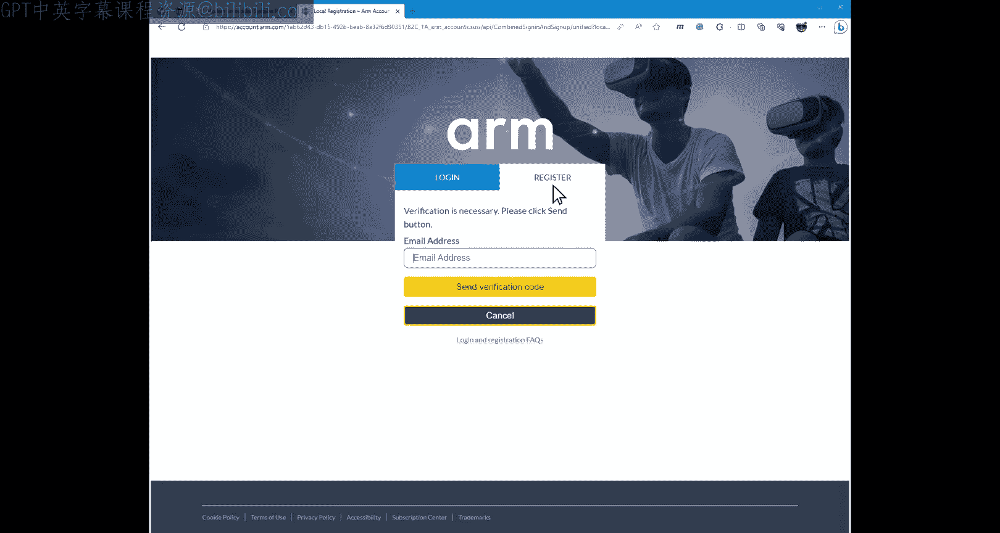

对于本课程，你需要下载 Keil Microvision。

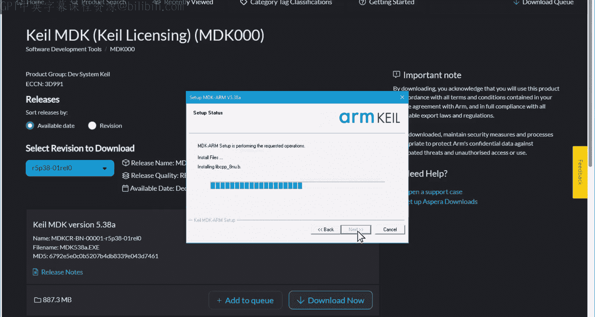

在下一页，点击“Download Keil MDK”。接下来，你需要登录 ARM 开发者门户。如果你没有账户，必须先注册。

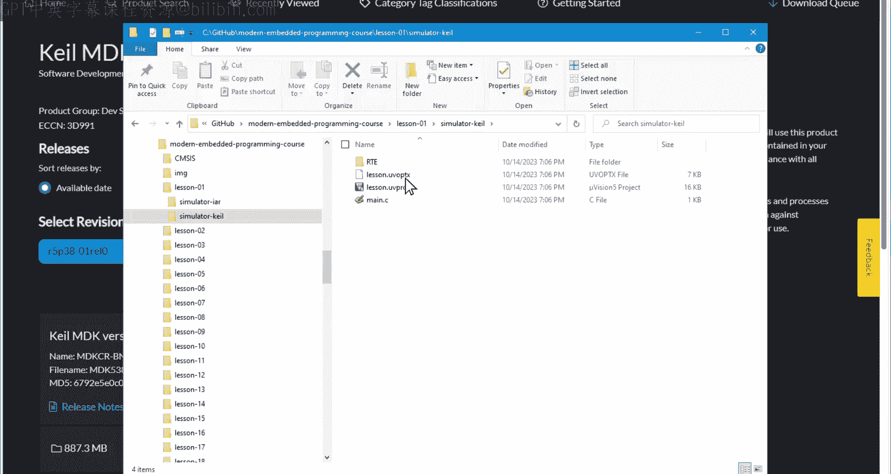

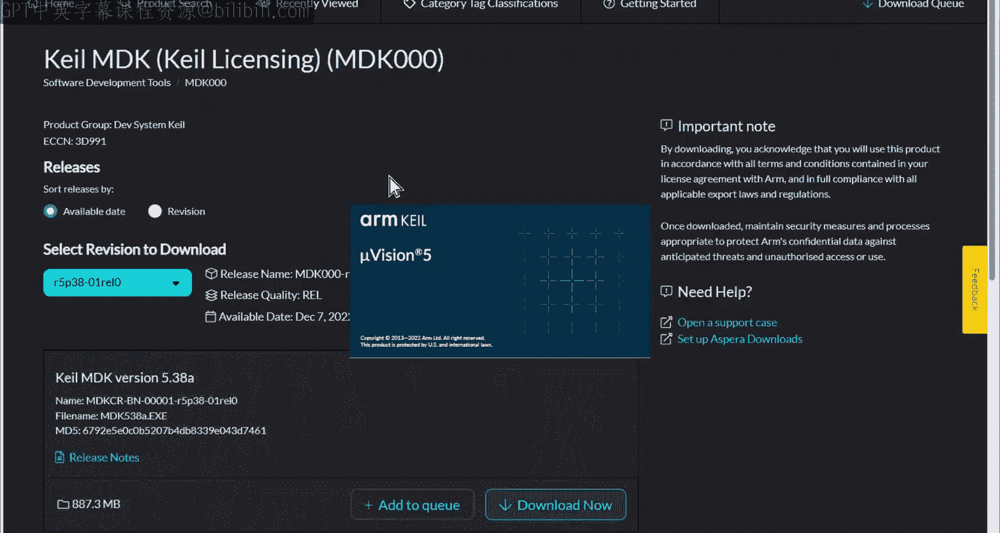

登录后，你最终可以下载最新的 MDK 版本。MDK 安装过程简单直接，MDK 工具集和所谓的 MDK 软件包的默认安装位置是可以接受的。

安装的最后一步会启动 Keil 软件包安装程序，但你现在可以关闭它，因为当你打开一个 Keil Microvision 项目时，软件包的用途会更清晰。我稍后会解释如何获取本课程的项目，但为了完成工具集安装，让我们通过双击文件资源管理器中的项目文件来打开一个 Keil 项目，例如第1课的项目。

当这样的项目首次打开时，你会看到一个对话框，提示所需的设备系列软件包缺失。这意味着项目使用的设备（本例中是 TM4C）的信息工具集尚未获取。当你点击“安装”时，软件包安装程序会自动下载并安装该特定设备的信息。

接下来你需要处理的问题是许可证安装。选择菜单“File” -> “License Management”，在对话框中点击“Get License via Internet”。这将带你到 ARM Keil 网站，你需要填写一个冗长的注册表格，但最终你应该会通过电子邮件收到你的 MDK 社区版许可证。

你需要解决的最后一个问题涉及 Tiva C Launchpad 板上的 Stellaris In-Circuit Debugger。在项目视图中，右键点击“Debug”目标菜单，选择“Options for Target ‘Debug’”。接下来，点击“Debug”选项卡并展开下拉列表。Stellaris ICDI 选项缺失，因为 Keil MDK 默认不再支持它。然而，你可以通过从本视频课程的配套网页下载 MDK 扩展来添加 Stellaris ICDI 支持。

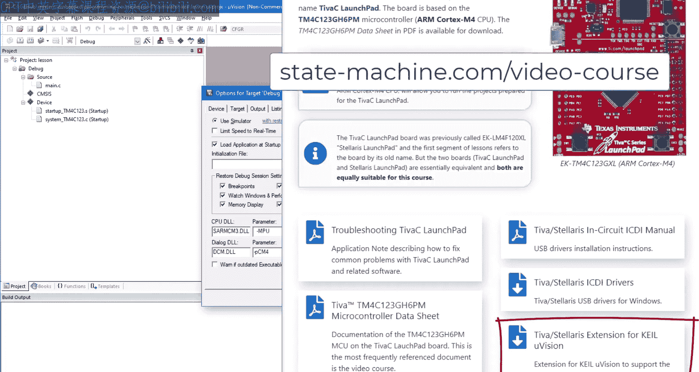

下载后，只需运行提供的安装程序即可。现在，当你为 Tiva C 打开任何 Keil 项目时，Stellaris ICDI 调试器就可用。

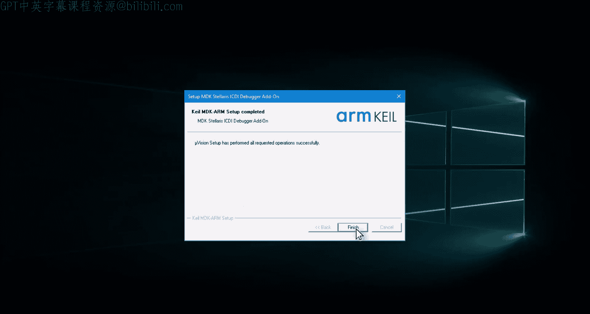

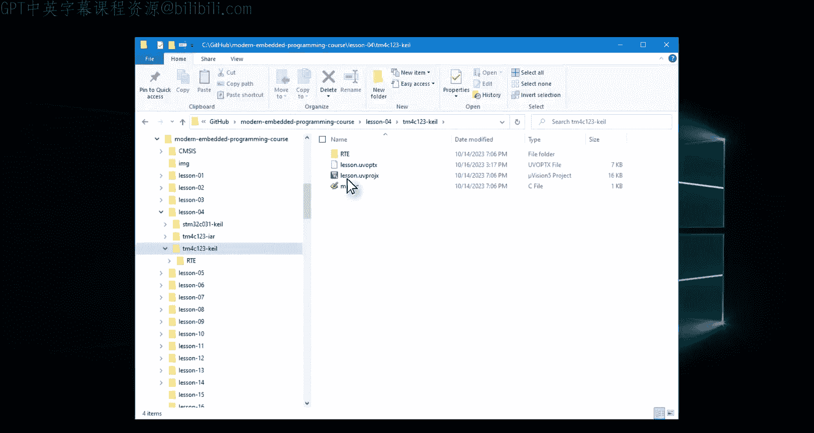

## 获取课程项目

在视频的最后，我想描述一下如何下载本课程各课的项目。同时，我需要解释项目的新结构，因为它与视频中显示的内容相比已经发生了变化。

所有课程的项目都可以从 `state-machine.com/videocourse` 下载，这是本课程的主要资源。此外，一个日益重要的资源是 GitHub 仓库，它也托管了所有项目。

项目采用分层结构组织，以适应多种嵌入式开发板和工具集，并为未来提供可扩展性。例如，第4课的项目位于 `lesson-04` 目录中。在里面，你可以找到以嵌入式开发板和嵌入式工具集命名的子目录。

Tiva C 的项目缩写为 `tm4c123`，而 STM32 Nucleo 板缩写为 `stm32c031`。后面跟着嵌入式工具集的名称，如 `iar` 或 `keil`。在这些子目录中，你可以找到对应工具集的实际项目、源代码以及项目所需的所有其他代码。这使得项目自包含且没有外部依赖。

特殊情况是模拟器项目，它们不需要物理开发板，尽管它们是为具体目标（通常是 Tiva C）准备的。

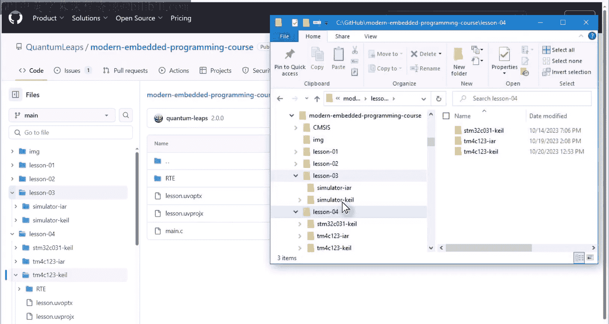

## 总结

本节课我们一起学习了现代嵌入式系统编程课程的入门知识。我们了解了课程的目标、相关性和先决条件，详细介绍了所需的硬件（如 Tiva C Launchpad 和 STM32 Nucleo 开发板）和软件（如 IAR 和 Keil 工具链）的准备步骤，包括驱动安装和许可证获取。最后，我们说明了如何下载和浏览结构化的课程项目文件。希望这些信息能帮助你顺利开始学习，并以全新的视角思考嵌入式编程。