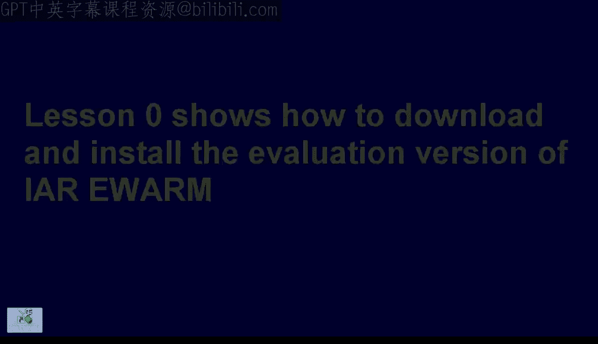
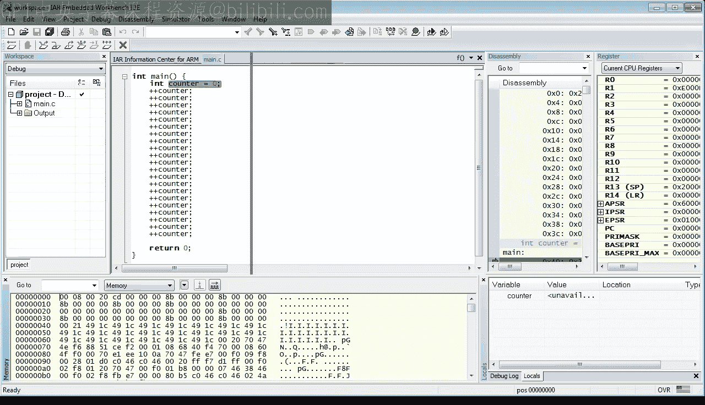
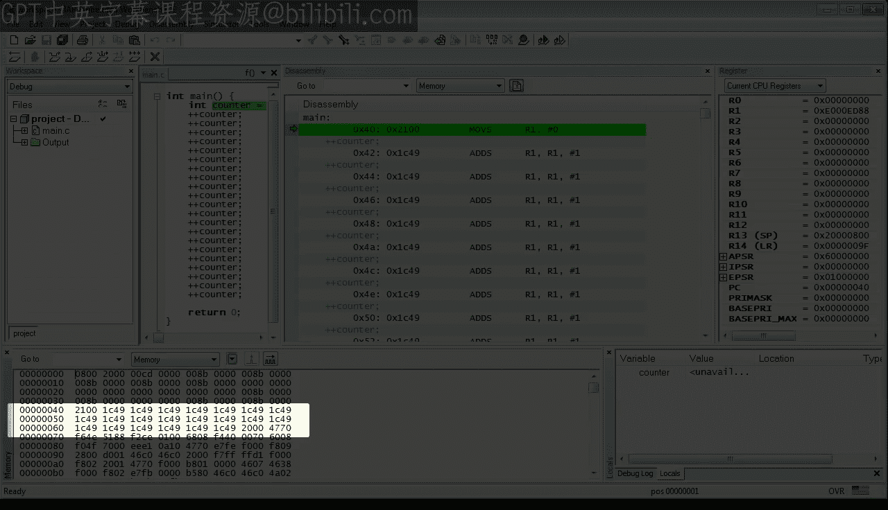
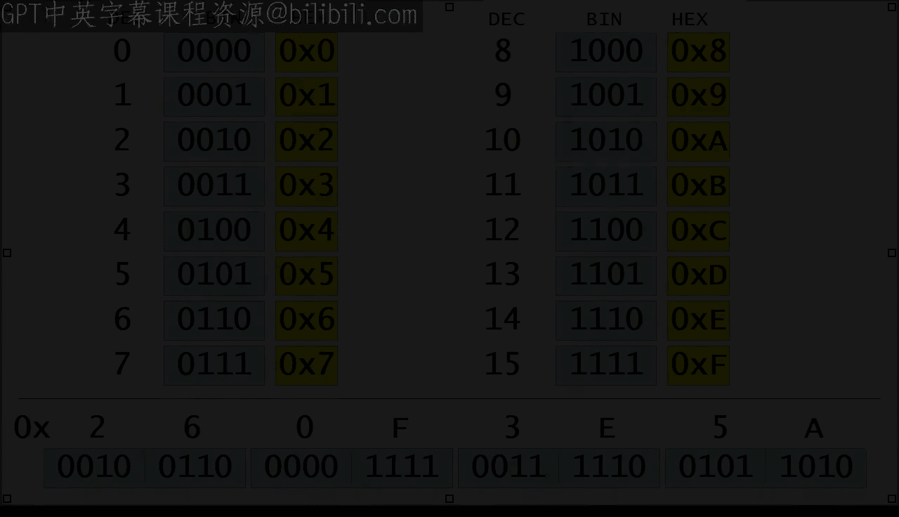
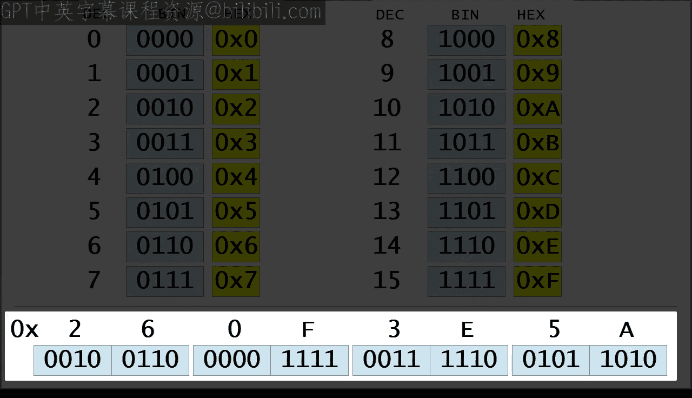
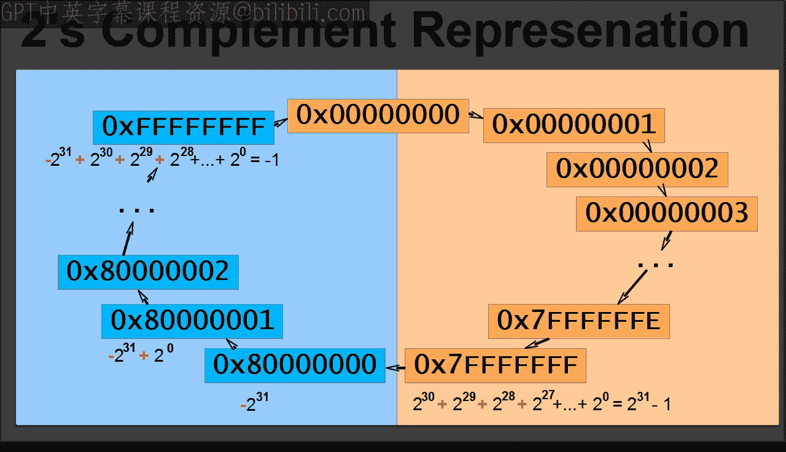
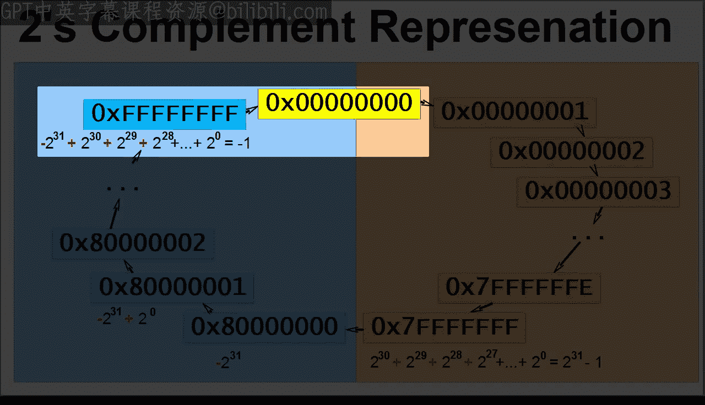
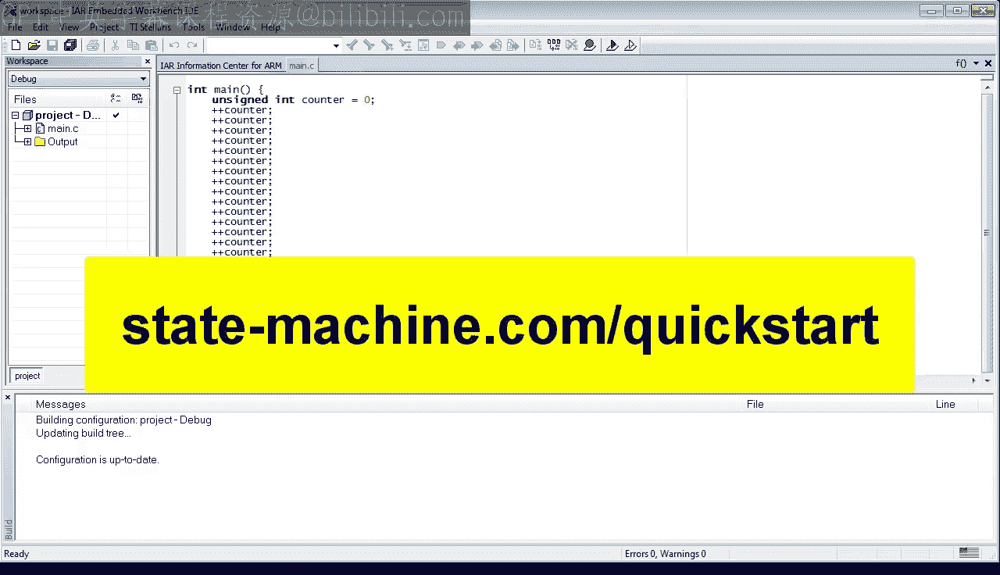

# 1：计算机如何计数 🔢

在本节课中，我们将学习计算机如何计数。我们将从创建一个简单的C语言项目开始，逐步探索变量、内存、寄存器以及计算机内部数字的表示方式，最终在真实的硬件上运行我们的程序。

---



## 项目创建与配置

首先，我们需要创建一个新的项目。启动IAR Embedded Workbench，选择 `Project` -> `Create New Project` 菜单。展开C项目类型，选择 `main` 模板，然后点击 `OK`。


在弹出的文件浏览器中，选择项目存放的目录。建议为整个课程创建一个主目录（例如 `C:\embedded_programming`），并在其中为每节课创建子目录。为本节课创建一个名为 `lesson_01` 的子目录，进入该目录，将项目命名为 `project`，然后点击 `Save`。

项目创建后，会生成一个 `main.c` 文件。在深入代码之前，我们需要配置一些项目参数。

点击 `Project` -> `Options` 菜单。在 `Target` 标签页下，选择处理器型号。点击 `Device` 旁边的选择按钮，找到并选择 `Texas Instruments` -> `LM4F120H5QR` 设备。

接下来，选择 `C/C++ Compiler` 类别。确保默认语言是 `C`，并且 `C dialect` 设置为 `C99`。本课程将使用这个较新的C语言标准。

最后，点击 `Optimization` 标签页，确保优化级别设置为 `Low`。在课程初期，我们的程序在高优化级别下可能无法正确运行，直到我们学会如何编写可被高度优化的代码。

为了获得更好的编程体验，我们还可以定制开发环境。点击 `Tools` -> `Options` 菜单。在这里，你可以更改字体（例如，我更喜欢 `Lucida Console` 等宽字体）。在 `Editor` 部分，将缩进设置为4个空格，并选择使用空格而非制表符。强烈建议在代码中避免使用制表符，因为它在不同设备（如打印机）上的显示效果不一致。

---

## 编写第一个程序

现在，让我们查看并修改IAR工具集生成的代码。首先，验证这是一个有效的C程序。通过编译代码来完成验证，编译过程由称为编译器的程序执行。

在 `Project` 菜单中，选择 `Make` 选项（或使用快捷键 `F7`）。由于是首次构建此项目，工具会要求输入工作空间名称。输入一个通用名称，如 `workspace`，然后按回车。

构建完成后，显示 `0 errors` 和 `0 warnings`。恭喜你，你的第一个合法的C程序诞生了！😊

接下来，按照我偏好的风格重新格式化生成的代码：使用节省行数的花括号放置方式和4个空格的缩进。编译器本身不关心格式，即使代码写成一行长串也能接受。但良好的格式对于需要阅读和维护代码的人来说至关重要。

当然，并非你对代码的所有修改都是合法的。例如，让我们故意输入一些非法内容，然后再次按 `F7` 编译。这次，编译器会报告错误。双击错误报告，工具会直接定位到代码中的问题位置，这非常方便。修复问题后，再次按 `F7` 让编译器检查，这是一个好习惯。

我想从一开始就让你相信，编译器是你最好的朋友，它时刻关注着你的代码。你需要做的就是经常按 `F7`，给它机会来帮助你。

---

## 变量与计数

现在，让我们定义一个计数器变量，用它来展示计算机如何计数。变量是计算机内存中用于存储值（如数字）的位置。在C语言中，你必须先定义变量才能使用它。

定义变量需要指定其类型、名称，并可选择性地赋予初始值。

```c
int counter = 0; // 定义一个名为counter的整数变量，并初始化为0
```

根据我的建议，让我们立即检查编译器是否接受这个变量定义。按 `F7` 编译。虽然没有错误，但有一个警告：变量 `counter` 已声明但从未被引用。确实如此，我们继续。

现在，让我们将变量 `counter` 从其当前值增加1。C语言有一个特殊的运算符 `++` 用于此目的，称为“前自增”。

```c
++counter; // 将counter的值增加1
```

像往常一样，让编译器检查代码是否仍然可以编译。按 `F7`。

为了观察计算机如何计数，让我们再增加几次计数器。

```c
++counter;
++counter;
++counter;
```

最后按一次 `F7` 编译。



---

## 在模拟器中运行与调试

现在，我将展示如何运行这个程序。首先，确保项目配置为使用模拟器。你可以通过顶部菜单栏是否存在 `Simulator` 菜单来判断，或者双击检查：点击 `Project` -> `Options`，在 `Debugger` 类别下，应该看到选择了 `Simulator`。

你有两种方式运行程序：通过 `Project` -> `Download and Debug` 菜单，或者使用工具栏按钮（我将使用后者）。此时，IAR工具集切换到调试器模式。

确保以下调试器视图可见：`Disassembly`（反汇编）、`Memory`（内存）、`Registers`（寄存器）和 `Locals`（局部变量）。让我们重新排列调试器窗口，以便更好地观察模拟的ARM Cortex-M4处理器内部。


首先，查看 `Disassembly` 视图。这个视图显示了编译器从你的程序生成的机器指令。处理器停在突出显示的指令处，这是你的 `main` 函数的开始。计算机内部的一切，包括机器指令，都只是数字。指令右侧的符号是所谓的指令助记符，由调试器添加以提高可读性。指令左侧的数字列是指令的内存地址。内存地址是分配给内存中字节的简单数字。

为了让你相信指令确实是内存中的数字，让我们看看 `Memory` 视图。你可以将内存想象成一个巨大的字节表，这些字节从0开始顺序编号。这些称为地址的顺序数字显示在内存视图左侧的数字列中。



为了更好地识别内存中的机器指令，让我们将视图单位改为 `2 times units`，因为大多数ARM Cortex指令在内存中占用两个字节。现在，你应该能轻松识别指令了。例如，在地址 `0x40` 处，你看到的数字与反汇编视图中的相同。地址 `0x42` 到 `0x50` 的指令也是如此。


好了，让我们逐行单步执行代码。在代码视图中点击，然后点击 `Step Into` 按钮。如你所见，当前指令前进一步，`counter` 变量的值变为0。同时，如果你仔细观察，`PC` 寄存器的值已变为 `0x42`。`PC` 代表程序计数器，因为它对指令进行计数。

现在再次点击 `Step Into` 按钮执行下一条指令。这次，变量 `counter` 的值增加到1。`Locals` 视图还告诉你，`counter` 变量位于 `R1` 寄存器中。确实，当你查看寄存器视图时，可以看到 `R1` 的值是1。

---

## 理解寄存器

那么，寄存器到底是什么？如果你曾经使用过简单的计算器，你应该已经有了很好的概念，因为微处理器中的寄存器与计算器的存储寄存器非常相似。通常，你可以对计算器的存储寄存器进行加、回忆和清除操作。

ARM Cortex-M处理器有16个这样的寄存器，命名为 `R0` 到 `R15`，其中 `R15` 是 `PC` 的另一个名称。所有这些寄存器都可以保存32位的数字。这些寄存器的重要性在于，机器指令可以直接操作它们，通常只需一个时钟周期。你已经看到了两个操作寄存器的指令示例：将0移动到 `R1`，以及给 `R1` 加1。

让我们继续单步执行代码，观察 `counter` 变量递增。一切似乎都按预期工作，但当计数器达到10时，发生了有趣的事情。

如你所记，`counter` 位于 `R1` 寄存器中，但在值为10时，`Locals` 视图和 `Registers` 视图似乎不同步，因为 `R1` 显示的值是 `0xA`。

这需要一些解释。`Locals` 视图以十进制系统显示 `counter` 的值，这是人类因为通常有10个手指而采用的系统。然而，C程序员在工作一段时间后会长出16根手指。例如，这是我编程20多年后的手部照片。





程序员发现使用十六进制系统工作更加自然，因为它能完美映射到所有计算机底层的二进制系统。正如你在十进制、二进制和十六进制的比较中所见，一个十六进制数字代表一组4位，称为半字节。相比之下，十进制系统对于大于9的数字需要两位数字。

在每个十六进制数字前看起来奇怪的 `0x` 前缀，是C语言中编码十六进制数字的约定。

在图片底部，你可以看到一个将上述表格应用于将32位字符串编码为十六进制的例子。这些位被分成四组，每组八位，称为字节。每个字节包含两个4位的半字节。正如我刚才解释的，半字节直接映射到十六进制数字。例如，半字节 `1010` 映射到十六进制数字 `A`，半字节 `0101` 映射到十六进制数字 `5`，依此类推。最终，整个32位字符串等价于十六进制 `0x260F3E5A`。



现在，我希望调试视图对你来说更有意义了，因为它们大多显示十六进制数字（你可以通过 `0x` 前缀识别）。在让程序继续递增计数器之前，让我们稍微“作弊”一下，测试当数字变得非常大时会发生什么。

在调试器中这实际上非常容易做到，因为你可以通过单击任何变量并输入新值来手动更改它。输入 `0x7FFFFFFF` 并按回车。这被证明是一个很大的十进制数。现在，让你的程序将计数器递增1。哎呀，发生了非常奇怪的事情。你的计数器在十进制中变成了一个巨大的负数，而在 `R1` 寄存器中它是十六进制的 `0x80000000`。


---

## 有符号整数与二进制补码

这又需要一些解释。变量 `counter` 被声明为 `int`，在C语言中这是一个有符号数，意味着它可以保存正值和负值。事实证明，计算机以一种相当特殊的方式表示负数，称为二进制补码表示法。这个循环图解释了它的工作原理。



图中的每个箭头代表加1。对于小的正数，一切按预期工作，直到数字填满除最高位外的所有位。这是32位有符号整数可以表示的最大正值。当你将这个数字加1时，会溢出到最高位，此时数字变为负数。实际上，它变成了你可以用32位表示的最小负数。从那里开始，当你继续递增时，数值变得负得越来越少，直到你填满所有位，此时你达到-1。当你将-1递增时，你又得到0，循环重复。




回到我们的调试会话，让我们将 `counter` 值设置为-1，并观察 `R1` 寄存器的内容。接下来，让你的程序再将计数器递增一次，通过使计数器再次变为0来闭合循环。

按 `X` 按钮退出调试器。

---

## 课后作业


作为课后作业，我希望你研究无符号整数的计数。为此，你需要将 `counter` 变量的类型修改为 `unsigned int`，重新编译，并像本节课前面那样启动调试器进行观察。

---

## 在真实硬件上运行

最后，作为本课的最后一个步骤，我承诺向你展示如何在LaunchPad开发板上运行代码。为此，你需要修改项目选项。

点击 `Project` -> `Options` 菜单。在对话框中选择 `Debugger` 类别，然后从下拉列表中选择 `TI Stellaris` 选项。接下来，点击 `Download` 标签页，勾选 `Use flash loader` 选项以及 `Verify download` 选项。点击 `OK`。

此时，你需要使用提供的USB线将LaunchPad板连接到计算机。如果这是你第一次连接该板，请留出一两分钟时间安装USB调试器的驱动程序。该板预装了一个闪烁LED的演示程序。

现在，你可以将代码下载到开发板的闪存中，并以与在模拟器中完全相同的方式开始调试。当你思考这一点时，这相当酷，并且只有在板载USB调试器和微控制器本身都有特殊电路为你提供此功能的情况下才可能实现。

请注意，你的程序被永久编程到微控制器内部，所以它会计数，但不会再闪烁LED。不过别失望，在未来的课程中，我们将让它闪烁，并实现更多功能。

---

## 总结

本节课我们一起学习了计算机如何计数。我们从创建和配置一个嵌入式C项目开始，探索了变量定义、编译过程以及调试器的使用。我们深入了解了内存地址、机器指令和寄存器，并观察了计算机内部数字的表示方式，特别是十进制、十六进制和二进制补码表示法。最后，我们成功地将程序下载到真实的硬件上运行。

在下一课中，我将展示如何用循环替换重复的指令，并向你展示各种改变代码控制流的方法。请保持关注，并访问 statemachine.com/quickstart 获取课堂笔记和项目文件下载。



