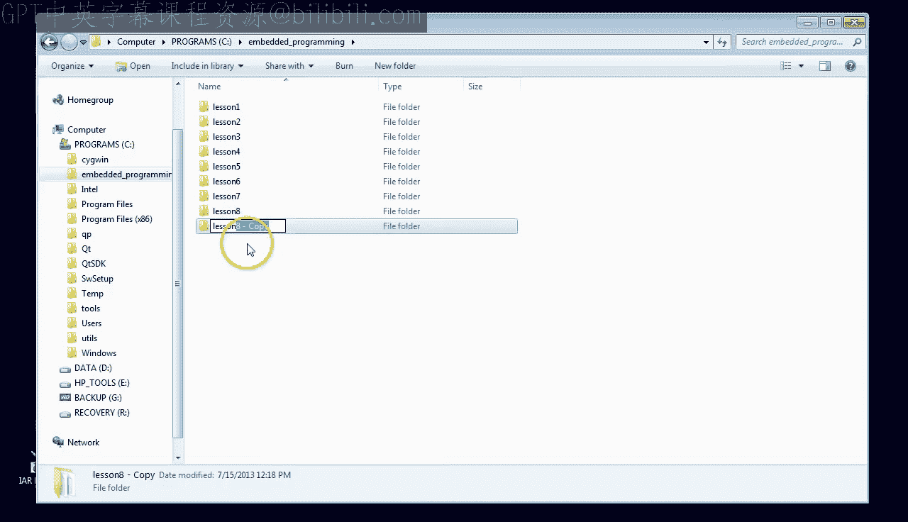
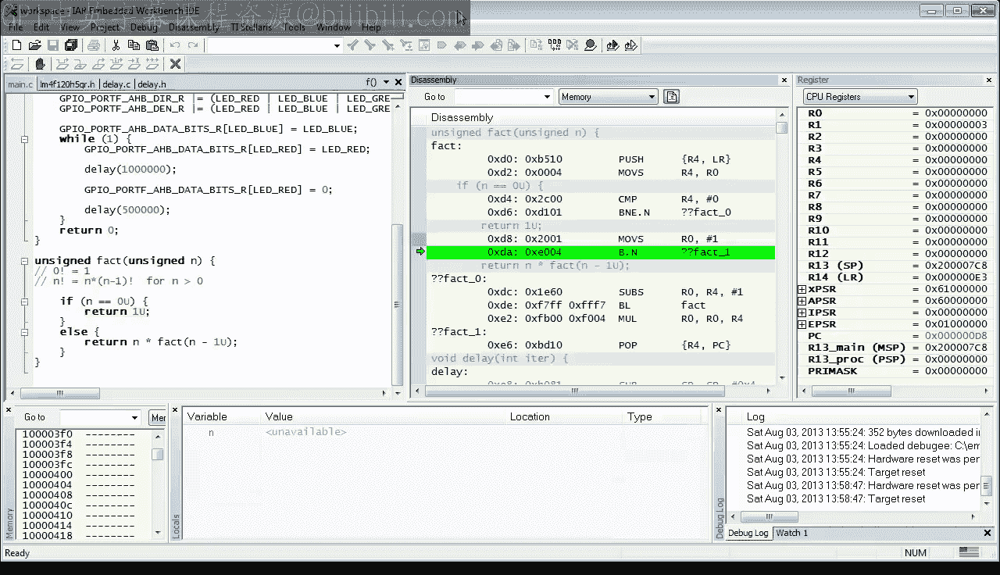

# 9：模块、递归与AAPCS



在本节课中，我们将继续学习C语言中的函数。你将学会如何利用函数将程序分割到不同的文件中，编写你的第一个递归函数，并了解ARM过程调用标准（AAPCS）。


## 概述

上一节我们介绍了函数的基本概念，并创建了一个`delay`函数。本节中，我们将探索函数的更多高级特性，包括模块化编程、递归以及函数调用的底层约定。

## 将函数移至独立文件

首先，我们将`delay`函数从主文件移动到它自己的文件中，以实现代码的模块化。

1.  创建一个新文件。
2.  将`delay`函数的定义剪切并粘贴到这个新文件中。
3.  将文件保存为`delay.c`到当前项目目录。
4.  通过右键单击项目并选择“添加文件”，将`delay.c`添加到项目中。

此时编译项目，你会遇到一个错误，提示`delay`函数没有原型声明。

## 创建头文件

简单的解决方法是把原型从`main.c`复制到`delay.c`，但这违反了“不要重复自己”（DRY）的原则。正确的做法是创建一个独立的头文件。

1.  创建一个新文件，将`delay`函数的原型剪切并粘贴进去。
2.  将文件保存为`delay.h`。
3.  在`main.c`和`delay.c`中，使用`#include "delay.h"`来包含这个头文件，而不是重复编写原型代码。

为了防止头文件被多次包含，我们可以在头文件中使用预处理指令进行保护。

```c
#ifndef __DELAY_H
#define __DELAY_H

void delay(unsigned int iter);

#endif /* __DELAY_H */
```

**工作原理**：当`delay.h`第一次被包含时，`__DELAY_H`宏尚未定义，因此预处理器会处理`#ifndef`和`#endif`之间的所有内容，并定义`__DELAY_H`宏。如果同一个文件再次被包含，`__DELAY_H`宏已被定义，预处理器会跳过整个文件内容。

## 函数返回值

接下来，我们探索函数的另一个特性：返回值。我们将编写一个计算整数阶乘的函数。

首先定义函数原型：
```c
unsigned int fact(unsigned int n);
```

这个函数接收一个无符号整数`n`作为参数，并返回`n`的阶乘值（即 `1 * 2 * 3 * ... * n`）。

定义了原型后，我们可以在定义函数之前就使用它。以下是几种调用方式：

*   **将返回值赋给变量**：
    ```c
    unsigned volatile int x = fact(5);
    ```
*   **在表达式中使用**：
    ```c
    x = fact(3) + fact(4);
    ```
*   **忽略返回值**（如果函数有副作用）：
    ```c
    (void)fact(10); // 明确表示忽略返回值
    ```

## 编写递归函数

现在我们来定义`fact`函数。我们将使用递归的数学定义来实现它：

*   0的阶乘是1。
*   n的阶乘是 n * (n-1的阶乘)。

```c
unsigned int fact(unsigned int n) {
    if (n == (unsigned int)0) {
        return (unsigned int)1;
    }
    else {
        return n * fact(n - 1);
    }
}
```

这个函数通过`return`语句返回结果。函数`fact`在其定义内部调用了自身，这就是**递归**。

## 递归与栈的工作原理

当程序运行时，每次函数调用都会在栈上分配空间，用于保存局部变量和返回地址。对于递归函数，每次递归调用都会在栈上创建新的帧，直到达到基线条件（`n == 0`）。然后，这些调用会依次返回，栈帧被逐个释放（栈“展开”）。

例如，计算`fact(5)`时，栈上会依次建立`fact(5)`、`fact(4)`、`fact(3)`、`fact(2)`、`fact(1)`、`fact(0)`的调用帧。`fact(0)`返回1后，上一层的`fact(1)`用返回的1乘以自己的`n`（即1）得到1并返回，依此类推，最终`fact(5)`返回120。

## ARM过程调用标准（AAPCS）

函数调用者和被调用函数之间需要遵循一套约定，这就是**ARM应用程序过程调用标准（AAPCS）**。它规定了寄存器在函数调用中的角色：

*   **调用者保存寄存器（Caller-saved）**：`R0-R3`, `R12`, `LR`。函数可以自由修改这些寄存器，调用者需要在调用前保存其中重要的值。
*   **被调用者保存寄存器（Callee-saved）**：`R4-R11`, `SP`。如果函数要使用这些寄存器，它必须在开始时将它们压入栈中，并在返回前恢复原值。

在我们的`fact`函数汇编代码中，可以看到它保存了`R4`和`LR`寄存器，正是因为`R4`是被调用者需要保存的寄存器，而`LR`中存放的返回地址在后续的递归调用中会被覆盖。

## 关于递归的注意事项

虽然递归是演示函数调用和栈操作的绝佳例子，但在嵌入式编程中应谨慎使用深度递归。因为每一次递归调用都会消耗栈空间，在内存有限的嵌入式系统中可能导致**栈溢出**。

对于像阶乘这样的计算，迭代版本或查找表通常是更高效、更安全的选择。

## 总结

本节课我们一起学习了：
1.  **模块化编程**：如何将函数分离到独立的`.c`和`.h`文件中，并使用头文件保护。
2.  **函数返回值**：如何定义和调用有返回值的函数。
3.  **递归函数**：编写了第一个递归函数`fact`，并观察了递归调用时栈的增长与收缩。
4.  **AAPCS**：了解了ARM函数调用约定中寄存器的保存规则。



然而，关于函数的学习还未结束。在下一课中，我们将深入学习函数参数（包括指针参数）、变量的作用域、基于栈的局部变量，并看看当栈溢出时会发生什么。