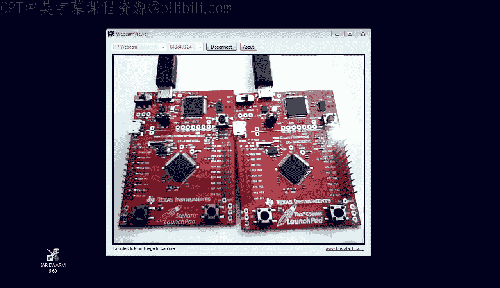
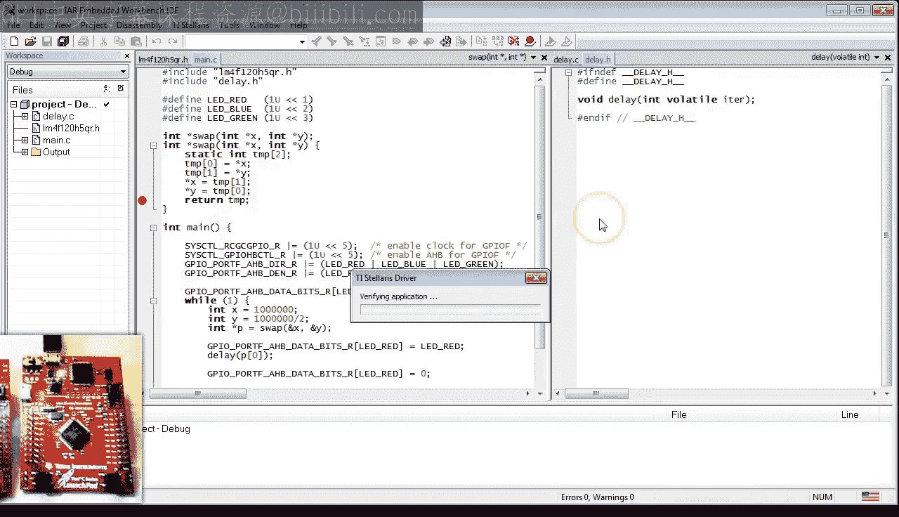

# 10：函数中的栈溢出及其他陷阱

在本节课中，我们将继续深入学习C语言中的函数。你将了解关于栈的更多知识，学习如何传递指针参数以及从函数返回指针值。同时，你将看到如果错误地使用函数，程序是如何崩溃的。

## 开发板与工具更新

在开始编码之前，我们先简要说明一下新版LaunchPad开发板和IAR EWARM工具集的更新。

首先，德州仪器发布了一款名为Tiva C系列LaunchPad的新版开发板。如果你现在按照第0课介绍的去购买，可能会看到Tiva LaunchPad，而不是Stellaris LaunchPad。好消息是，对于本课程的所有目的而言，Tiva LaunchPad与Stellaris LaunchPad是相同的。例如，我手头就有这两块板子，它们可以运行完全相同的代码。

其次，IAR也发布了新版本6.60的IAR EWARM。这个新版本支持新的Tiva产品线。新版本的安装过程与第0课中描述的6.50版本相同。如果你已安装旧版本，建议在安装新版本前先卸载旧版。

现在，让我们复制第9课的项目，并将其重命名为第10课，然后开始今天的学习。



## 栈溢出初体验

上一课中，我们创建了递归函数 `fact` 来计算整数参数 `n` 的阶乘。递归调用让我们观察了函数调用如何在栈上嵌套。今天，我们将“黑”掉这个函数，对栈施加压力直到其崩溃。

为了给栈施加压力，我们在函数内部添加一个局部无符号变量 `foo`。实际上，为了让它更大，我们将其改为一个大小为10的数组。

```c
unsigned int foo[10];
```

编译此代码时，你会收到一个警告，提示 `foo` 未被引用。为了防止编译器将其优化掉，我们以某种方式使用它。在这个“黑”操作中，我们将 `n` 赋值给 `foo[n]`，并在返回表达式中使用 `foo[n]` 代替 `n`。

加载代码到Tiva LaunchPad上（尽管项目仍设置为Stellaris），以证明Tiva可以同样运行此代码。

上一课我们使用内存视图来观察栈。IAR调试器也提供了一个专用的栈视图。打开此视图，点击“View”菜单并选择“Stack -> Stack1”。

在点击运行按钮前，在 `fact` 函数内部的递归调用处设置一个断点。当触发此断点时，Stack1视图显示了数组 `foo`，这证实了该数组确实存在于栈上。

更有趣的是，当 `fact` 递归调用自身时，你可以看到栈上又增加了另一个 `foo` 数组的实例。随着递归的深入，栈的增长速度远快于没有 `foo` 数组的情况。

你可能会注意到每个 `foo` 实例都包含一些值。这些值来自RAM的先前使用。这些数据看起来像是Flash内存映像，很可能是编程器将代码烧录到Flash ROM时留下的。最重要的是，对于你的程序而言，栈上的这些内容是“垃圾”。你不能假设任何自动变量有特定的初始值，而必须显式地将每个自动变量初始化为你需要的值。

为了帮助你记住这个关键事实，让我们扩展一下之前提到的“脏盘子”比喻：C语言的栈就像一摞盘子，但它们都是脏的。在使用它们之前，你必须先清洗干净。

这个压力测试虽然“锤击”了栈，但尚未使其崩溃。让我们回到代码，通过将 `foo` 的大小再增加一个数量级到100，来更用力地“锤击”它。

```c
unsigned int foo[100];
```

在运行代码前，我想向你展示IAR调试器中栈的另一个视图。请点击“View”菜单并选择“Call Stack”。顾名思义，调用栈视图显示了当前嵌套在栈上的所有函数调用。

确保 `fact` 函数内的断点仍然设置，然后运行代码。当触发断点时，你可以在栈上看到更大的 `foo` 数组，同时调用栈视图确认你正处于从 `main` 调用的 `fact` 函数内部。

现在，你可以看到 `fact` 函数开始递归调用自身，栈增长得非常快。当达到大约5层调用嵌套时，你的栈就完全耗尽了。栈指针正好位于RAM的起始地址，并且没有更多空间向更低的地址增长，因为那里没有内存。

继续执行，观察会发生什么。首先，你的程序会冻结并且不会再次触发断点。手动中断代码，你会看到栈指针已经低于有效的RAM起始地址（0x20000000），程序在一个名为 `BusFault_Handler` 的无限循环中挂起。

这需要一些解释。`BusFault_Handler` 不是你的代码，而是标准IAR启动代码中提供的所谓“异常处理程序”，它由链接器与你的主程序链接在一起。总线故障异常是CPU中实现的一种硬件机制，用于处理CPU被迫访问不存在内存的情况。IAR启动代码将总线故障异常（以及所有其他异常）实现为一个无限循环。但你实际上可以提供自己的代码来做其他事情，例如复位CPU。我将在关于启动代码的课程中展示如何定义自己的异常处理程序。

至此，恭喜你经历了第一次栈溢出。现在你知道它是什么感觉了，我希望你能养成一个习惯：当发现程序在硬件异常中挂起时，检查栈指针。

请注意，栈溢出也可能以其他方式失败，例如只破坏某些数据而没有耗尽内存，这可能更难检测和诊断。无论如何，你应该养成习惯，为你的特定应用程序适当地调整栈大小，以免栈溢出。

## 如何调整栈大小

要更改栈大小，请打开项目选项，在“Config”选项卡下选择“Linker”类别。勾选“Override default”，因为你将要更改默认的栈大小设置。

点击“Edit”按钮，选择“Stack/Heap Sizes”选项卡。默认栈大小是2KB（此处以十六进制指定，但你可以使用十进制）。我相信对于本阶段的所有项目，1KB的栈应该是足够的（当然，前提是你从阶乘函数中移除了那个巨大的数组）。

堆是用于动态内存分配（通过标准函数 `malloc` 和 `free`）的RAM区域。这在通用计算中非常有用，但在实时嵌入式编程中，堆通常弊大于利，你不应该使用它。在这种情况下，你应该将堆大小设置为0。

点击“Save”按钮后，你需要选择编辑后的IAR链接器脚本文件 `project.icf` 的保存位置。你需要保存这个文件，因为它不再是默认文件，现在包含了特定于你项目的设置。

## 栈损坏：一个更微妙的灾难

现在，让我们在代码中制造另一个更微妙的灾难。这次，你将损坏栈，并观察它是如何“爆炸”的。这是一个堪比福尔摩斯探案的神秘事件。

为了准备“犯罪现场”，请将 `fact` 函数中 `foo` 数组的大小改回6。然后，在 `main` 函数中，用参数7调用 `fact`，并在此调用处设置断点。

我希望你开始明白这是怎么回事。运行代码到断点，并从那里单步执行。

指令 `push {r4, lr}` 应该从上节课就很熟悉了。但从栈指针的减法操作是新的。这就是你的 `foo` 数组在栈上分配的方式。你会看到SP减少了0x18个字节（十进制24），这只是在栈上腾出空间，但没有浪费任何周期来清理这个空间。这就是为什么 `foo` 数组包含垃圾。

`add` 指令将 `foo` 数组的地址（恰好是当前栈顶）放入R1。`str` 指令将R0中的值 `n` 写入索引为 `n`（也是R0）的位置。逻辑左移两位是因为 `foo` 的每个元素占4个字节。

现在仔细观察 `str` 指令的效果，因为“犯罪”就发生在这里。`foo` 的最后一个有效索引是5。因此，索引7超出了 `foo` 末尾两个位置。这个位置恰好是保存的 `lr` 寄存器，它现在被损坏了，函数将无法正确返回。

所以，“犯罪”其实很简单：你越界索引了一个数组并损坏了栈。请注意，C语言允许你很容易地做到这一点，因为C不检查数组索引，并相信你知道自己在做什么。

然而，就像任何好的悬疑故事一样，有趣的不是“犯罪”本身，而是随之展开的故事。事实证明，这个故事在这里展开了数千个时钟周期，系统才最终失败。

显然，调试此类问题的艺术在于避免单步执行数千步，而应该学习如何策略性地设置断点。

第一个策略性的位置是 `fact` 函数的返回处。在此处停止是合乎逻辑的，因为你知道问题出在返回地址上。当你触发这个断点时，所有阶乘的递归调用都嵌套在栈上。这是栈的最大使用量，你可以验证没有栈溢出问题。

当你从这里继续执行时，随着每个嵌套调用返回，栈逐渐“展开”。我认为观看这个过程很美。

最后，你到达最后一个调用，栈变得非常小。`add` 指令从栈中移除 `foo` 数组的大小。最后的 `pop {r4, pc}` 指令执行最终返回。

请注意，即将恢复到PC的返回地址是7。这是我精心策划的损坏值，我特意将其设为奇数。因为如果它是偶数，`pop` 指令会在此处立即失败，CPU将进入异常，从而结束故事。如果你忘了为什么在Cortex-M上每个返回地址必须是奇数，请回顾第8课。

因此，通过我精心而“变态”的策划，`pop` 指令成功了，程序计数器被强制跳转到地址6。

坦白说，接下来发生的事情让我感到意外，因为反汇编视图实际上具有误导性。问题是这些低内存位置用于所谓的异常和中断向量表，这意味着那里是一堆32位的地址数据。但不知何故，CPU将这些数据当作合法的16位指令来执行，而反汇编器需要两步才能解析每个32位数据值。

纯属巧合，`main` 函数紧跟在Flash ROM中的向量表之后。因此，CPU现在开始执行真实的指令。第一条指令将寄存器压栈，但栈上已经保存了之前从 `main` 压入的寄存器，因为请记住，`main` 从未真正返回。

当你从这里继续执行时，最终会再次触发仍设置在阶乘函数返回处的断点。移除这个断点并继续。从现在开始，每次你点击“Continue”按钮，都会执行整个递归调用周期，损坏栈，并通过执行向量表这个“后门”重新进入 `main` 函数。

但请注意，栈在缓慢增长，因为 `main` 并没有真正返回，所以它不会从栈中弹出其栈帧。

最后，移除最后一个断点，让程序自由运行。此时，你应该知道它将如何结束：因为栈在增长，你最终会溢出它，CPU将进入总线故障异常。

随着这个谜团的解开，我希望你对损坏栈有了更多的敬畏。我的意思是，这可能会变得非常糟糕，非常快，一个失控的程序有时会在数千个CPU周期内损坏其状态。由于过程中可能存在许多巧合，这往往很难复现和调试。

## 函数参数与指针

在本节课的最后一部分，我想稍微转换一下话题，讨论函数参数，包括指针参数和从函数返回指针值。

让我们从一个实验开始，修改 `delay` 函数，使其参数 `it` 在大于0时递减。这个例子旨在向你展示函数参数就像局部变量一样，你可以修改它们。唯一的区别是参数由调用者初始化，而局部变量必须在函数内部初始化。

```c
void delay(volatile unsigned int it) {
    while (it > 0) {
        --it;
    }
}
```

像往常一样，对于延时循环，将循环计数器声明为 `volatile`，以防止编译器将整个循环优化掉。

因为你改变了函数的签名，别忘了更新头文件中的函数原型。

在运行此程序前，将调用 `delay` 的方式改为传递变量 `x` 作为参数，而不是常量。在第一次调用 `delay` 处以及调用后立即设置断点。

在第一个断点处，验证变量 `x` 的值为100万。在第二个断点处（调用后立即），你可以看到 `x` 的值仍然是100万，即使 `delay` 函数已将其参数递减到0。

移除断点并运行程序，看看LaunchPad板上的LED是否仍在闪烁。确实如此。

这个小实验的结论是：C语言通过**值传递**函数参数。这意味着只有参数的值被复制到函数内部的变量中以进行初始化。函数内部使用的是这个副本，而不是原始参数。这意味着函数永远不会改变原始参数。

但有时你可能恰恰想要改变参数。经典的例子是交换操作 `swap`，它交换其参数 `x` 和 `y` 的值。

你的第一次尝试可能是这样写 `swap` 函数：

```c
void swap(int x, int y) {
    int tmp = x;
    x = y;
    y = tmp;
}
```

你还应该提供这个函数的原型。使用场景可能如下：

```c
int x = 1;
int y = 2;
swap(x, y);
```

当然，这不起作用，因为 `swap` 函数无法改变参数。

这时你就需要用到**指针**作为参数。转换为指针很容易，C语法实际上帮助了你：只需将 `x` 和 `y` 改为 `*x` 和 `*y`。最后，你需要调整函数调用，传入 `x` 和 `y` 的地址，因为现在函数签名要求的是指向整数的指针，而不仅仅是整数。

```c
void swap(int *x, int *y) {
    int tmp = *x;
    *x = *y;
    *y = tmp;
}

// 调用方式
swap(&x, &y);
```

让我们快速测试一下这段代码。正如你所见，根据AAPCS标准，`x` 和 `y` 的地址被准备在R0和R1中。`x` 的值被复制到用作临时变量的R2中。`y` 的值被加载到R3并存储到 `x` 的地址。最后，R2中的临时值被存储到 `y` 的地址。最终结果是，在 `swap` 返回后，`x` 和 `y` 的值确实如你所愿地交换了。

## 从函数返回指针

最后，在本节课的最后一分钟，我想简要谈谈从函数返回指针。

但在开始之前，让我最终解释一下困扰我们很长时间的那个持续警告：警告提示 `main` 中的 `return` 语句不可达。这没问题，因为编译器很聪明，看到了 `return` 之前有一个无限的 `while(1)` 循环。

然而，`main` 的返回类型必须是 `int`，因为这是C标准要求的。同时，标准还要求每个具有非 `void` 返回类型的函数都必须显式返回该类型，因此不可能同时满足标准并避免IAR警告。到目前为止，我选择了标准合规性和可移植性，因为其他编译器（例如GCC）如果缺少 `return` 语句也会报告警告。

但为了最终获得完全干净的编译，我将在 `main` 中注释掉 `return 0;` 语句。

解决了这个问题后，让我们假设出于某种原因，你希望 `swap` 函数记住参数 `x`、`y` 的原始顺序，并将其作为数组返回。

你第一次尝试实现此行为可能如下所示：

```c
int * swap(int x, int y) {
    int tmp[2];
    tmp[0] = x;
    tmp[1] = y;
    // ... 交换逻辑（如果需要）...
    return tmp; // 警告：返回局部变量的地址
}
```

你还修改了返回类型以匹配 `return` 语句。在编译时，编译器会发出警告，但让我们暂时忽略它，因为你想看看为什么这是错误的。

相反，让我们在代码中使用新的 `swap` 函数。总体思路是不断交换LED点亮和熄灭的延时时间，使闪烁模式更有趣。

运行此代码。为了更好地观察，你需要查看比当前C栈视图更多一点的内容。因此，设置原始内存视图以显示栈指针周围的内存。

在 `swap` 返回处设置第一个有趣的断点。触发此断点后，验证栈包含 `tmp` 数组以及 `x` 和 `y`。然而，当你单步跳出 `swap` 时，栈中只包含 `x` 和 `y`。`tmp` 数组在原始内存视图中仍然可以识别，但现在它位于栈指针上方。因此，它不再显示在C栈视图中。

现在，在第二次调用 `delay` 处设置断点并运行。当你停在那里时，注意到R0中的参数 `it` 是0，而不是预期的500000。快速查看原始内存就能明白原因：在此期间，第一次对 `delay` 的调用使用了栈，并破坏了之前的值。

现在你明白了为什么返回指向局部变量的指针总是一个坏主意：因为这样的指针在函数返回后，其指向的内容总是位于栈指针上方（即已被释放的栈空间）。更专业的术语是：所有局部变量在函数返回时都**超出了作用域**，因此它们甚至不再存在，无法被访问。

这个问题的补救方法其实很简单：不要使用栈上的局部变量，而是使用不在栈上的局部变量。在C语言中，在局部变量前使用 `static` 关键字会告诉编译器在栈外分配该变量，使其生命周期超过函数的任何一次调用，因此即使在函数返回后也可以访问。

```c
int * swap(int x, int y) {
    static int tmp[2]; // 使用 static 关键字
    tmp[0] = x;
    tmp[1] = y;
    // ... 交换逻辑 ...
    return tmp; // 现在这是安全的
}
```

进行此更改后，编译不会产生警告。当你运行此代码并在 `swap` 返回处停止时，可以看到 `tmp` 数组不再位于栈上，而是位于常规内存中，就在RAM的开头。这一次，第二次对 `delay` 的调用收到了正确的参数500000。

移除所有断点并运行程序，你可以看到LED按预期闪烁。



## 总结

本节课我们一起学习了使用函数时需要避免的陷阱。我们亲身体验了**栈溢出**，了解了它是如何发生的以及如何通过调整链接器设置来分配足够的栈空间。我们还深入探讨了**栈损坏**的微妙后果，它可能导致程序在数千个周期后才表现出异常行为，使得调试变得非常困难。此外，我们学习了C语言中**值传递**的参数机制，以及如何通过传递**指针**来让函数修改外部变量。最后，我们明白了为什么不能返回指向局部变量的指针，并学会了使用 `static` 关键字来安全地返回函数内部数据的地址。

在下一课中，你将学习C语言中的数据结构，以便能够开始使用Cortex微控制器软件接口标准（CMSIS）来访问硬件。

如果你喜欢这个频道，请订阅以保持关注。你也可以访问 state-machine.com/quickstart 获取课堂笔记和项目文件下载。