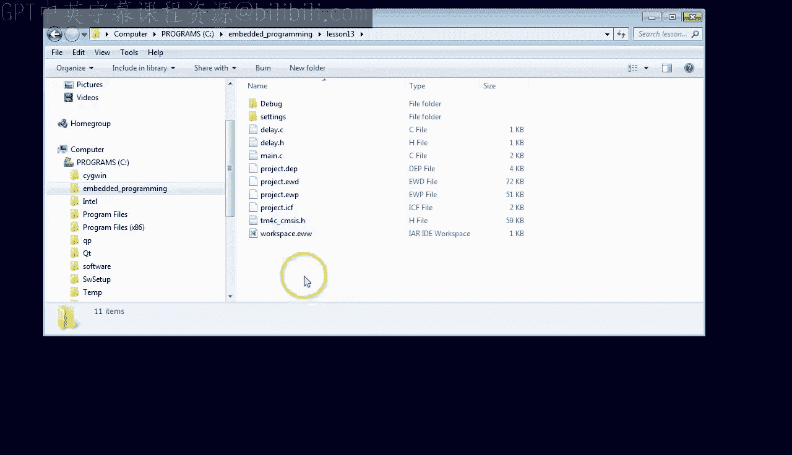
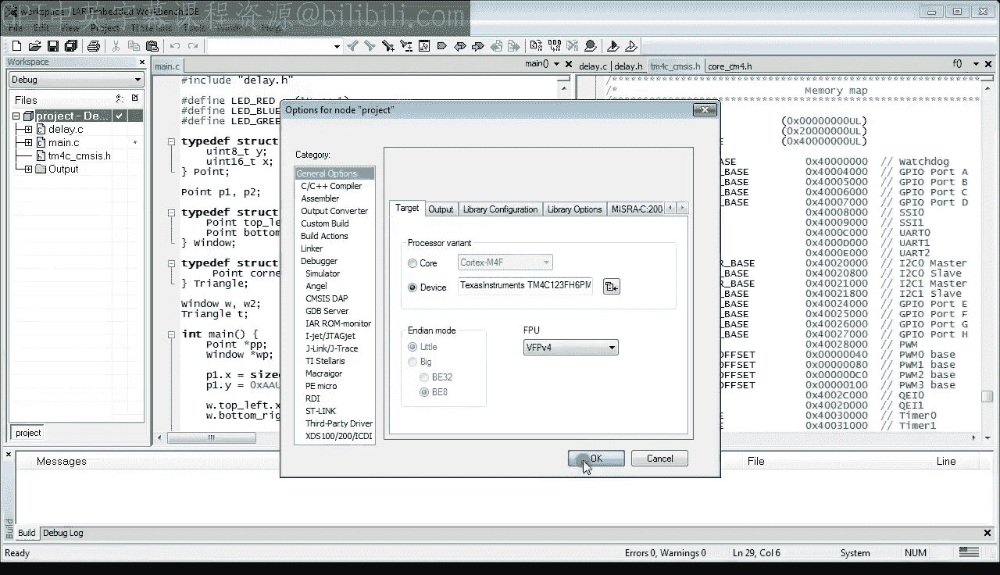
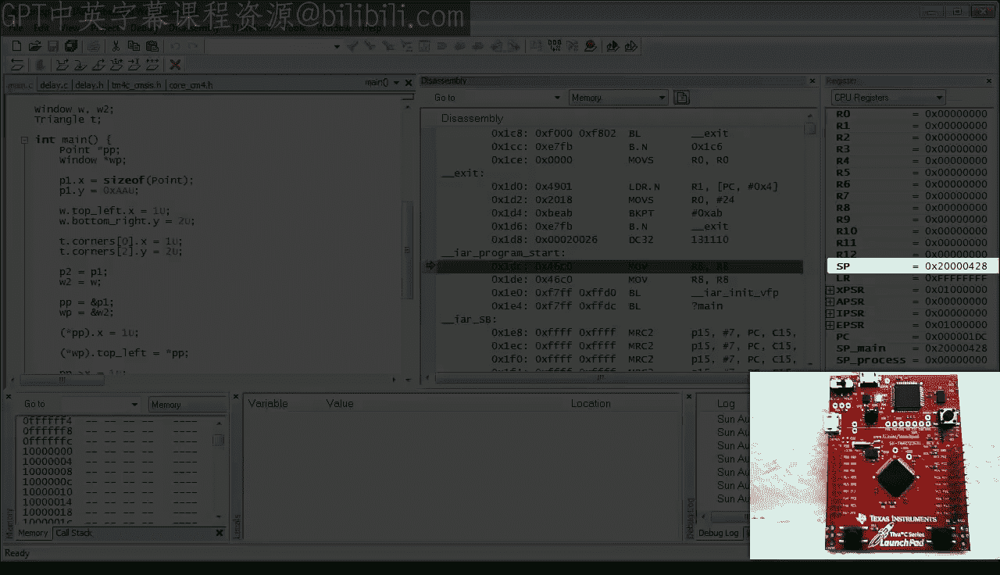
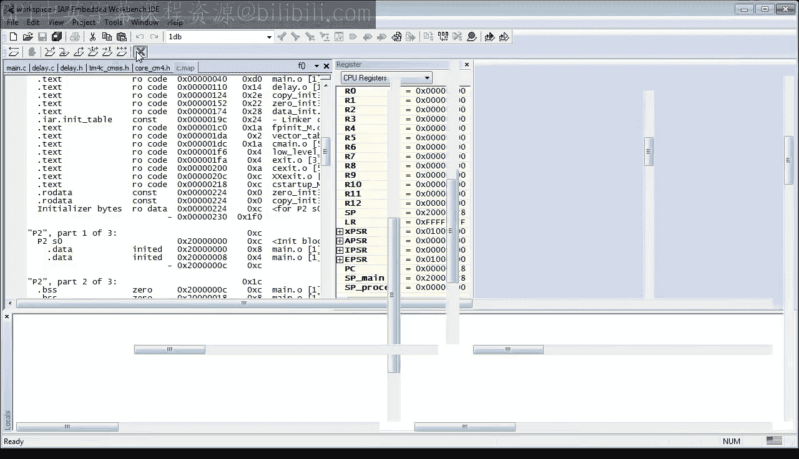

# 13：启动代码（第一部分）- CPU如何从复位到main函数 🚀

在本节课中，我们将学习嵌入式系统启动代码的工作原理。你将了解CPU从复位到执行`main`函数之间发生了什么，包括标准库启动代码如何初始化各种数据段，以及如何通过链接器映射文件查看这些信息。

## 概述

启动代码是嵌入式程序在`main`函数之前运行的一段特殊代码。它负责初始化硬件、设置内存（如栈、堆）以及为C语言环境准备数据段（如初始化全局变量、清零未初始化变量）。理解启动代码对于调试和编写可靠的嵌入式软件至关重要。

## 准备工作

首先，我们需要复制上一课（第12课）的项目，并将其重命名为“lesson13”。如果你刚刚加入本课程，可以从statemachine.com/quickstart下载之前的项目文件。

进入新的“lesson13”目录，双击工作空间文件以打开IAR工具集。本课使用的是IAR EWARM 7.10版本。

## 探索main函数之前的世界

到目前为止，我们调试时都是从`main`函数开始。现在，我们将探索`main`函数之前的世界。

打开项目选项对话框，在“Debugger”部分，取消勾选“Run to main”选项。这允许调试器在启动代码处停止，而不是直接跳到`main`。

同时，确保选择了“TI ICDI Stellaris Debug Driver”，因为本课需要使用真实的Tiva C LaunchPad开发板，而不是模拟器。此外，请确认“Use Flash loaders”选项被选中。

最后，在“General Options”中，将设备从实验用的Cortex-M0改回你的Tiva C LaunchPad实际使用的TM4C设备。请注意，此设备使用硬件浮点单元（FPV4）。

现在，当你将代码下载到开发板并开始调试时，你会发现程序并非从`main`开始执行。相反，你遇到的第一个代码标签是`__iar_program_start`。同时请注意，除了栈指针（SP）被初始化为RAM中的一个合理值外，大多数寄存器都被初始化为0。我们将在课程后面了解这是如何发生的。

现在，让我们快速单步执行代码，了解发生了什么。

第一个有趣的指令是`BL`（带链接的分支），这是一个函数调用。这里被调用的函数是`__iar_init_vfp`，它用于初始化硬件浮点单元（FPU）。虽然我们不深入探讨FPU的细节，但需要知道，如果`main`函数或后续代码要使用FPU，就必须在启动早期初始化它。

第二个有趣的函数调用是`?main`。这不是一个合法的C函数名，但请记住，我们现在处于C语言规则不适用（如函数命名规则）的启动代码世界。这是IAR特定的启动代码，他们选择将其命名为`?main`。让我们单步进入这个函数。

在这里，你会看到另一个函数调用`__low_level_init`。这个函数旨在执行硬件的自定义初始化，这些初始化要么必须非常早进行，要么可以加速启动过程。例如，如果你计划提高CPU时钟速度，最好尽早进行，以便启动代码的其余部分执行得更快。

如果你没有定义自己的`__low_level_init`函数（目前你肯定没有），则会使用一个空的库版本。通过检查R0寄存器的值可以看到，`__low_level_init`返回一个值，该值决定是直接调用`main`函数，还是执行数据初始化。库版本返回一个非零值，因此会调用函数`__iar_data_init3`。

我现在跳过这个函数，因为目前你的程序还没有所有有趣的数据段。在修改代码以包含所有数据段后，我将在下一次调试会话中单步执行数据初始化过程。

在这里，我只想通过展示启动代码最终调用`main`函数来结束这次运行。

## 理解数据段

现在，让我们修改代码，使其包含所有数据段。但首先，我需要为你澄清“数据段”这个术语。

也许最好的解释方式就是直接展示各种程序段。为此，你需要让链接器生成所谓的映射文件。

请打开项目选项对话框，进入“Linker”部分和“List”选项卡，勾选“Generate linker map file”选项。然后按F7重新构建代码。

让我们看一下生成的链接器映射文件。你可以在项目的输出文件夹中找到它。

乍一看，你可能会认为链接器映射文件是晦涩难懂的机器级乱码。确实如此，但对于嵌入式程序员来说，它也是一个包含宝贵信息的宝库。我强烈建议你不仅为所有项目生成映射文件，还要学会如何阅读和使用其中的信息。

例如，你应该始终知道你的程序在代码空间（ROM）和数据空间（RAM）方面有多大。要找出这些信息，请滚动到“MODULE SUMMARY”部分。

在这里，你可以看到按数据类型（如只读代码、只读数据和读写数据）以及目标模块（如`debug.o`和`main.o`）分解的所有信息。

在底部，你可以找到总计：目前是470字节的只读代码、18字节的只读数据和1060字节的读写数据。读写数据的最大贡献者是链接器为栈生成的1024字节。

然而，目前映射文件最有趣的部分是“PLACEMENT SUMMARY”，它列出了所有的程序段。对于链接器来说，程序段只是一个具有符号名称的连续内存块。

例如，地址0到0x40之间的区域被命名为`.intvec`段。接下来的几个段都命名为`.text`，用于存放代码。最后，`.rodata`段用于存放只读数据。所有这些段都位于ROM地址范围内。

在下面，你会找到几个`.bss`段，它们存放未初始化的数据，这些数据需要在系统启动时被清零。

最后，在最底部，你可以找到`CSTACK`段，它存放栈，在启动期间保持未初始化状态。

如果你对`.text`（代码）或`.bss`（未初始化数据）等名称感到好奇，这些都是来自某些古老汇编语言的历史名称。例如，`.bss`过去的意思是“由符号开始的块”之类的，今天已经有了完全不同的含义。

但无论如何，重点是，你的程序还没有初始化数据段，即需要在启动期间用硬编码值进行特定初始化的数据段。

因此，在本课的下一步，我们将添加一些数据初始化，然后再次检查这将如何改变你的映射文件。

## 添加数据初始化

在本课程的前几课中，你已经看到可以在变量定义时为其赋予初始值。语法是在变量名后跟一个等号、一个表达式和一个分号。

例如，一个有符号16位整数`x`被初始化为-1，而无符号32位整数`y`被初始化为由`#define`定义的常量`LED_RED`和`LED_GREEN`的二进制或运算结果。

你也可以初始化更复杂的变量，比如整个数组。在这种情况下，你需要将初始值用花括号括起来，并用逗号分隔。例如，这里是一个包含四个元素的有符号16位数组`sqr`的初始化。

当你提供数组初始化器时，可以省略数组大小，C编译器会根据初始化器推断大小。此外，初始化器可能比指定的数组大小包含更少的元素，在这种情况下，缺失的元素将被初始化为0。但是，初始化器不能包含比数组大小更多的元素，否则你会得到编译错误。

结构体的初始化类似于数组的初始化。同样，你需要将成员的初始值用花括号括起来，并用逗号分隔。例如，这里是`Point`结构体`p1`的初始化。

对于包含结构体的结构体（如`Window`），你只需嵌套成员结构体的初始化器。例如，这里是包含两个`Point`实例的`Window`实例`w`的初始化。

现在，回到映射文件，你可能已经注意到它发生了变化。

首先，在ROM地址范围内添加了一个新的`Initializer bytes`段。
其次，在RAM地址范围内创建了两个新的`.data`段，同时两个`.bss`段消失了。
第三，两个新`.data`段的组合大小是0xC字节，这与ROM中新`Initializer bytes`段的大小完全相同。

用图形表示，添加变量初始化导致以下变化：链接器在RAM中插入了一个新的`.data`段用于存放初始化数据。同时，链接器在ROM中创建了一个匹配的`Initializer bytes`段，其大小与`.data`段完全相同。

这对启动代码的启示是，它需要将`Initializer bytes`段从ROM复制到RAM中的`.data`段。

请注意，启动代码并不是按照你在代码中指定的方式初始化数据（例如，将两个字节复制到这里，四个字节复制到那里的单个变量）。相反，链接器专门重新排列了变量，以便所有初始化数据可以通过从`Initializer bytes`段到`.data`段的单次块复制来完成初始化。

## 再次查看启动代码

现在，既然你既有`.data`段中的初始化数据，也有`.bss`段中的未初始化数据，让我们再次查看启动代码。

首先，我将内存视图设置为RAM区域，并用`0xFF`填充内存，这样当字节被更改为0或其他值时，你可以清楚地看到。

接下来，快速单步执行启动代码，直到到达`__iar_data_init3`调用。这次我们将单步进入这个函数，看看它如何初始化数据。

这个标签表明第一步是清零初始化数据（即清零`.bss`段）。`STR`指令是数据清零算法的核心。该指令将R3的值存储到R2中的地址。如你所见，R3是0，而R2正是RAM中第一个`.bss`段的起始地址。

在内存视图中，你可以看到`STR`指令将零写入RAM中第一个`.bss`段开头的4字节字。

但我也想借此机会解释一下这条`STR`指令中使用的新寻址模式。请注意方括号后的`#4`常量。这个偏移量导致基址寄存器R2增加4个字节，正如你在寄存器视图中看到的那样。

你不应将这种寻址模式与括号内有常量的`STR`指令混淆，后者是在存储数据之前临时将偏移量加到基址上。这种带基址递增的新寻址模式特别适用于紧凑的循环。

因此，当你单步执行代码时，你可以看到代码如何围绕`STR`指令循环，每次循环清零`.bss`段中的下一个字。

在清零`.bss`段之后，启动代码继续将数据复制到`.data`段。实际的复制工作由`LDR`/`STR`指令对完成，它们使用了刚才为`.bss`段解释的寻址模式。

`LDR`指令的基址寄存器R2指向数据的源，即ROM中`Initializer bytes`段的起始位置。`STR`指令的基址寄存器R3指向数据的目标，即RAM中`.data`段的起始位置。同样，你可以看到代码循环并初始化整个数据段。

最终，启动完成，并调用`main`函数。

## 总结

总结一下，你刚刚看到的是IAR库中提供的符合标准的启动代码。当`main`函数被调用时，C标准要求所有已初始化的变量都具有其初始值，所有未初始化的变量都被设置为0。

然而，其他供应商的启动代码可能不符合C标准。具体来说，你可能会遇到不清理`.bss`段中未初始化变量的启动代码。例如，德州仪器DSP的启动代码通常在这方面不符合标准。

重点是，我强烈建议你使用我刚才展示的方法测试你的启动代码。如果你发现你的`.bss`段没有被清零，你可能需要显式地将所有先前未初始化的变量初始化为0。但这并不是最优的，因为你本质上将`.bss`段转换成了`.data`段，这需要在ROM中有一个匹配的`Initializer bytes`段。换句话说，你为了一堆零占用了ROM空间。

## 回到复位过程的起点

既然你对标准的C初始化序列有了相当好的概述，现在是时候回到复位过程的最开始了。启动序列的这一部分是处理器特定的，因此接下来的内容将特定于Tiva LaunchPad开发板上的ARM Cortex-M处理器。

让我们开始另一个调试会话，以回答两个基本问题：第一，栈指针SP是如何获得其初始值的？第二，程序计数器PC是如何最终指向`__iar_program_start`函数的？

回答这两个问题的线索在地址0处，这是ROM的起始位置。当你在反汇编窗口中查看这个地址时，可以看到地址0处是`CSTACK$$Limit`，地址0x4处是`__iar_program_start`。请注意，这些不是机器指令，它们只是内存中的字。代码指令稍后才开始，从`main`函数开始。

所以，这就是你的问题的答案：ARM Cortex-M处理器是硬连线的，复位后，它会将地址0处的字复制到SP寄存器，并将地址0x4处的字（除了最低有效位）复制到PC。加载到PC的任何值的最低有效位必须为1，因为该位指示处理器的Thumb模式，这是Cortex-M唯一支持的模式。这解释了为什么PC是0x218，而地址0x4处的值是0x219。我在之前的课程中已经讨论过这一点。

但我想指出一些更重要的事情：你刚刚在地址0处发现的就是所谓的向量表。向量表在你的微控制器数据手册中有描述，你可以在那里读到你已经知道的内容：它包含栈指针的复位值和PC的起始地址。但向量表包含的内容不止这些，它还包含你的处理器可以处理的所有异常和中断向量。当然，我需要在接下来的课程中解释这些是什么，但我希望你对接近这个迷人的主题感到兴奋。

向量表的实际布局显示在下一页。这张图是以传统方式绘制的，即地址0在底部，高地址在顶部。这恰好与你反汇编视图中的向量表上下颠倒。

所以，让我翻转向量表布局，并尝试与你的调试器视图进行匹配。如你所见，数据手册中的向量表现在与你的调试器视图匹配得相当好。数据手册中定义的所有异常向量都被初始化为`Bault_Handler`，标记为“Reserved”的向量为0。

然而，数据手册中的向量表显然比你反汇编视图中的要长得多。具体来说，标记为IRQ0、IRQ1等的向量在你的反汇编视图中不存在。这是因为IAR库提供的向量表是通用的。它只包含标准异常向量，这些向量定义在表的开头，并且是所有Cortex-M微控制器共有的。但是IAR表不包含特定于给定微控制器的中断向量（如IRQ0、IRQ1等），因此它无法真正处理任何中断。为此，你需要用特定的向量表替换通用的IAR向量表，该向量表必须完全匹配你的特定微控制器数据手册中定义的布局。

不过，在离开这个调试会话之前，让我们检查一下`Bault_Handler`代码，根据向量表，它应该在地址0x1DB。这段代码的实际位置是0x1DA，但到现在，你应该知道为什么地址必须是奇数，而实际代码在偶数地址。

所以，这里你也得到了答案，为什么IAR向量表中的所有异常向量似乎都设置为`Bault_Handler`。显然，IAR启动代码定义了所有异常处理程序，如PendSV、Debug Monitor、HardFault、MemManage和NMI。但它们都指向同一段代码。只知道这个公共地址，反汇编器无法区分各种异常处理程序，并选择只显示`Bault_Handler`，因为这是按字母顺序排列的第一个。

最后，与所有这些异常处理程序关联的IAR代码实际上是一条跳转到自身的分支指令。这意味着任何异常的发生都会导致CPU陷入一个紧凑的无限循环。这对于调试是有好处的，因为当你中断这样的代码时，你会发现它在异常处理程序内部循环。然而，这种原始策略对于生产代码是不可接受的，因为设备将显得完全锁定且无响应。这被称为拒绝服务攻击。

## 课程总结

本节课关于标准启动代码的内容到此结束。在下一课中，你将学习如何用能够处理微控制器中所有中断的真实向量表替换通用向量表。你还将编写可用于生产质量代码的异常处理程序。最后，你将开始为你的LaunchPad开发板构建板级支持包。所有这些都将为学习中断打下基础。