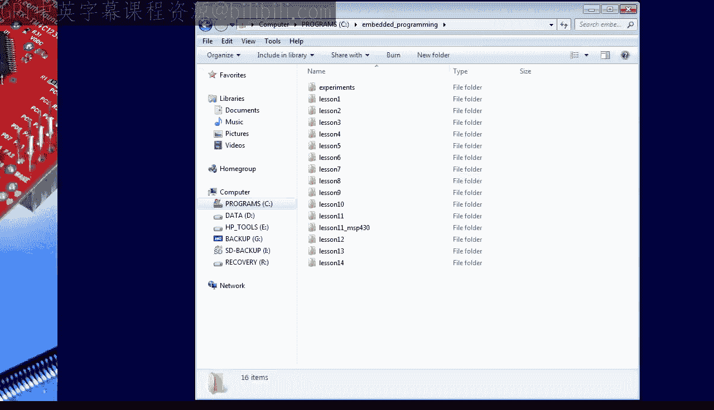
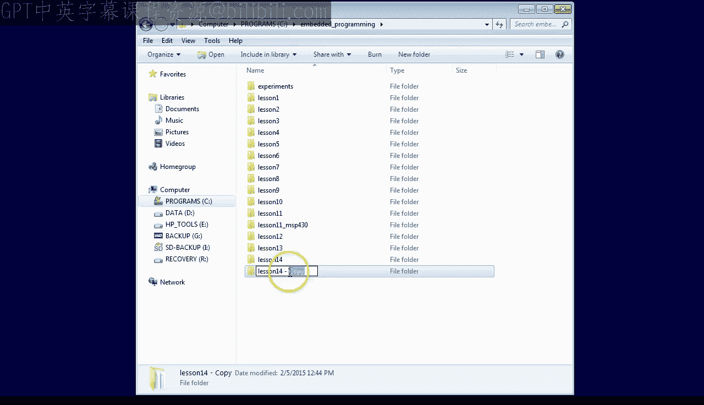
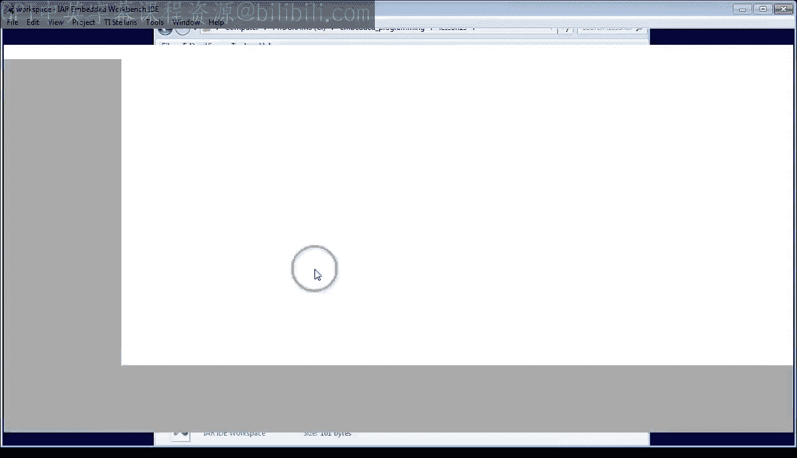
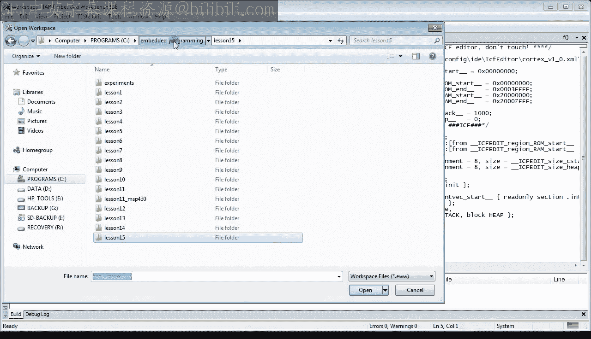
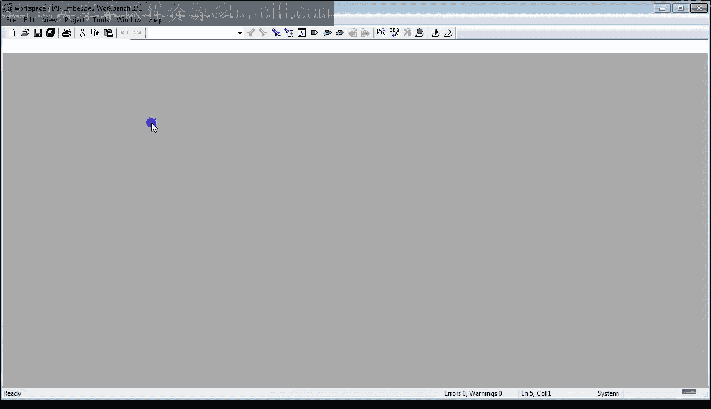
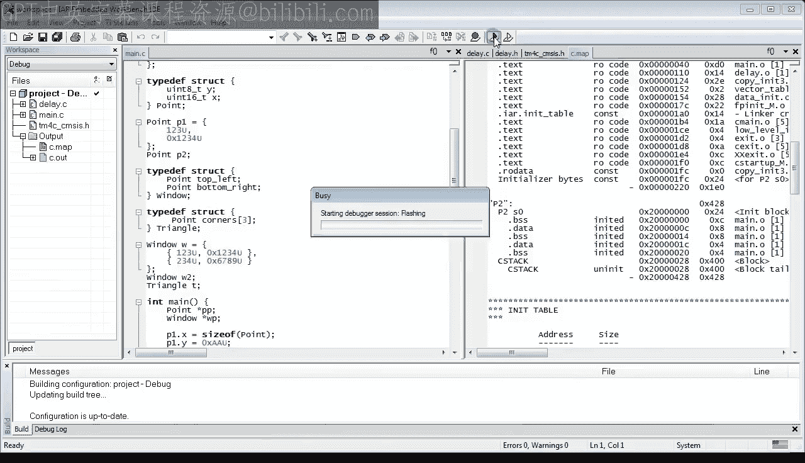
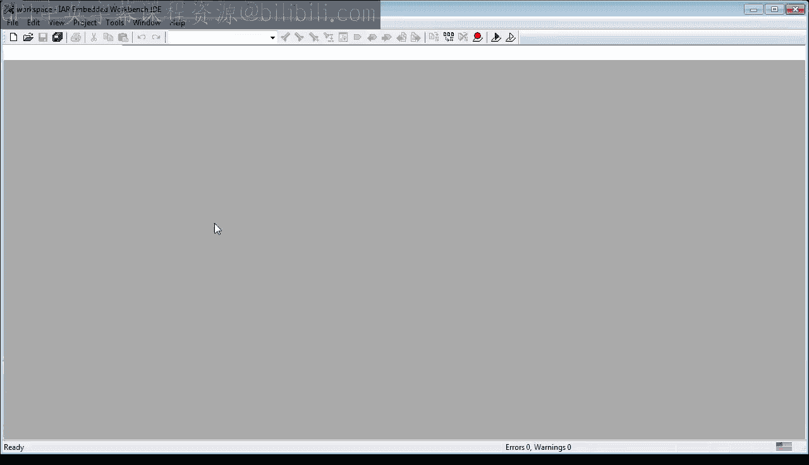
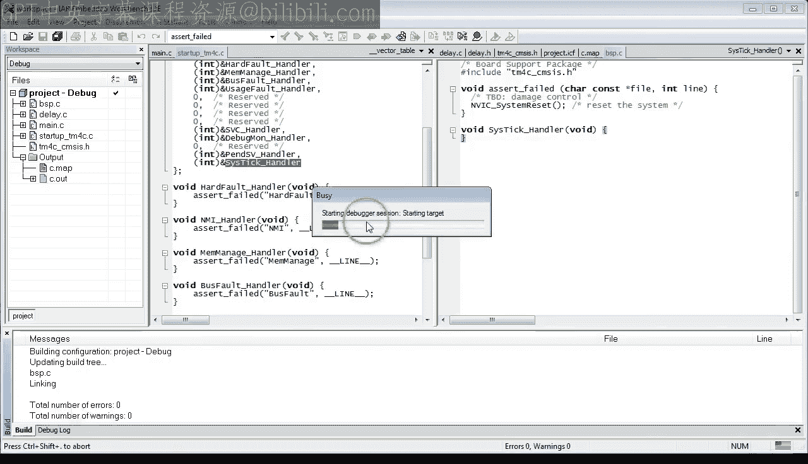
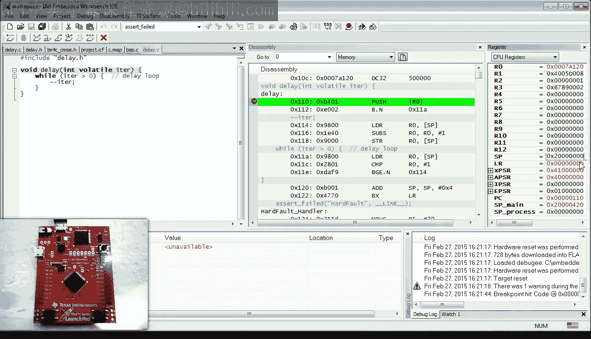
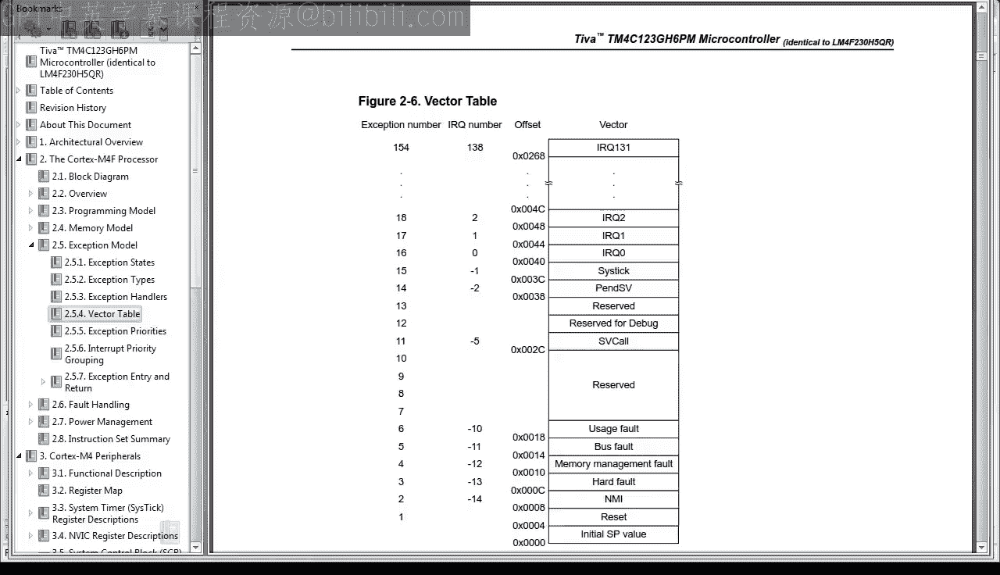

# 15：启动代码第三部分 - 异常与中断处理程序

在本节课中，我们将完成启动代码的学习。你将学习如何正确初始化向量表，包括设置正确的栈指针以及微控制器中所有可用的中断。你还将看到如何编写和测试异常处理程序，以确保它们能按预期工作。





## 项目准备



首先，复制第14课的项目并将其重命名为第15课。如果你刚刚加入本课程，可以从 statemachine.com/quickstart 下载之前的项目。

进入新的 `lesson15` 目录，双击工作空间文件以打开 IAR 工具集。如果你还没有 IAR 工具集，请回顾第0课的内容。

## 回顾与目标

上一节课结束时，我们向项目中添加了一个名为 `Startup_TM4C.c` 的新文件，并在其中将向量表定义为一个整数常量数组。上节课的重点是确保链接器使用这个新的向量表，而不是 IAR 库中的通用向量表，并将其定位在地址 0 的 `.intvec` 段中。

然而，新的向量表尚未正确初始化。因此，今天的首要任务就是提供正确的初始化。







## 初始化栈指针

根据 TM4C 数据手册，向量表的第一个值应该是栈指针的初始值（位于地址 0），第二个值是复位处理程序的地址（位于地址 4）。



为了与 IAR 链接器脚本编辑器（可以在其中设置 C 栈大小）保持兼容，我们需要找到一种方法来初始化栈指针。回顾第13课（仍使用 IAR 库的默认启动代码），可以看到向量表的第一个条目是 `CSTACK$$Limit`。这表明链接器知道 `CSTACK$$Limit` 这个符号。

IAR 链接器会为程序中定义的每个段生成 `$$Base` 和 `$$Limit` 符号。对于 C 栈段，链接器会在内存中 C 栈段的开始处创建符号 `CSTACK$$Base`，在结束处创建符号 `CSTACK$$Limit`。在 ARM 处理器上，栈从高地址向低地址增长，因此初始栈指针需要设置为 `CSTACK$$Limit` 的地址。

回到代码中，我们尝试将向量表中的栈指针条目初始化为 `CSTACK$$Limit` 符号的地址。

```c
// 在 Startup_TM4C.c 中
extern int CSTACK$$Limit; // 声明链接器生成的符号

const int vector_table[] __attribute__((section(".intvec"))) = {
    (int)&CSTACK$$Limit, // 栈指针初始值
    // ... 其他条目
};
```

编译时，编译器会报错 `CSTACK$$Limit` 未定义。这是因为段符号是由链接器在编译之后创建的，因此上游的 C 编译器并不知道它们。我们需要通过声明该符号为一个变量来告知编译器它的存在。这里使用 `extern` 关键字进行声明，而不是定义。

编译器可能还会提示类型不匹配（`int*` 不能初始化 `int` 类型），我们可以通过显式类型转换来解决。

```c
(int)&CSTACK$$Limit,
```

编译和链接成功后，将代码加载到 LaunchPad 开发板。在反汇编视图中，可以看到地址 0 处是 `CSTACK$$Limit`，SP 寄存器的值看起来像是栈顶地址。通过检查链接器生成的 MAP 文件，可以确认 `CSTACK$$Limit` 被分配到了正确的地址。

为了证明与链接器脚本编辑器的兼容性未被破坏，可以通过 IDE 更改栈大小。重新构建项目后，`CSTACK$$Limit` 的地址会相应增加。再次将代码加载到开发板，检查 SP 寄存器的新值，确认栈指针初始化成功。

## 初始化复位处理程序

复位处理程序位于栈指针之后。当微控制器退出复位状态时，ARM Cortex-M 处理器会将此地址复制到 PC 寄存器，并从此处开始执行代码。

查看标准 IAR 库中复位处理程序的默认初始化，发现它被设置为 `__iar_program_start`，这是我们在第13课学过的启动代码。我们可以在自定义向量表中重用这个函数。

在 C 语言中，可以像获取变量地址一样获取函数地址。我们可以使用 `&__iar_program_start` 来初始化向量表。

```c
// 声明函数原型
void __iar_program_start(void);

const int vector_table[] __attribute__((section(".intvec"))) = {
    (int)&CSTACK$$Limit,
    (int)&__iar_program_start, // 复位处理程序
    // ... 其他条目
};
```

同样，如果遇到类型错误，需要进行显式类型转换。值得注意的是，在 C 语言中，函数名后面不加括号也可以表示获取其地址（例如 `__iar_program_start`），但为了清晰起见，建议使用 `&` 操作符。

将代码加载到开发板，可以看到程序停在 `__iar_program_start` 处，向量表中也正确显示了 `CSTACK$$Limit` 和 `__iar_program_start`。运行代码，LED 正常闪烁，说明代码工作正常。

## 初始化标准异常处理程序

复位处理程序之后是其他具有负 IRQ 编号的条目，例如 NMI、HardFault、MemoryManagement Fault、BusFault、UsageFault、SVCall、PendSV 和 SysTick。这些是 ARM Cortex-M 处理器共有的异常处理程序。

标准异常在向量表中的排列不是连续的，中间有标记为“保留”的间隙。在自定义向量表中必须保持这种精确布局。

初始化标准异常的方式与复位异常类似，但需要注意将所有保留槽初始化为 0。异常处理程序的函数原型不需要自己声明，它们都已在 `TM4C_CMCS.h` 头文件中提供。使用标准名称对于与实时操作系统或其他第三方软件组件集成非常重要。

因此，在启动代码中包含 `TM4C_CMCS.h` 头文件。

与来自标准 IAR 库的 `__iar_program_start` 复位处理程序不同，我们需要为其他异常处理程序（如 `HardFault_Handler`）编写代码。标准的编码方式是使用一个无限循环，当相应异常（如硬故障）发生时，CPU 会陷入其中。这对于调试很方便，但会导致最终产品出现“拒绝服务”问题。

更好的做法是调用一个名为 `assert_failed` 的通用错误处理函数。该函数适用于遇到不可恢复错误且不希望继续执行的情况。其目的是执行一些损害控制（最常见的是复位机器），并报告错误位置（如果可能，记录到错误日志中）。`assert_failed` 函数接受两个参数：指向常量文件名字符串的指针和发生调用的行号。

在硬故障处理程序中，可以这样调用：

```c
void HardFault_Handler(void) {
    assert_failed("HardFault", __LINE__);
}
```

`__LINE__` 是标准的预处理器宏，会展开为它出现位置的行号。其他故障处理程序可以以相同方式编码。

然而，向量表中还包含一些非故障异常，如 `SVC_Handler`、`DebugMon_Handler`、`PendSV_Handler` 和 `SysTick_Handler`。理想情况下，我们希望为这些处理程序提供在程序中其他地方定义的选项（如果需要的话）。如果未使用，则希望提供一个默认实现，以指示使用了未定义的处理程序。

IAR 编译器提供了一种非常方便的方法来为函数提供所谓的“弱别名”。例如，可以为向量表中的非故障异常处理程序设置弱别名：

```c
#pragma weak SVC_Handler=Unused_Handler
#pragma weak DebugMon_Handler=Unused_Handler
#pragma weak PendSV_Handler=Unused_Handler
#pragma weak SysTick_Handler=Unused_Handler
```

弱别名意味着，如果某个符号在链接过程结束时仍未定义，则将使用提供的别名。例如，如果未使用 `SVC_Handler`，它将被替换为 `Unused_Handler`。但是，如果在项目中定义了该符号，则忽略弱别名，并且链接器不会报告多重定义的符号。当然，别名本身必须被定义。

我们需要在文件顶部提供 `Unused_Handler` 的原型，并定义它。`Unused_Handler` 可以简单地调用 `assert_failed`。

现在尝试构建，启动代码编译成功，但链接器报告 `assert_failed` 未定义。这是预期的，因为我们需要将此函数添加到项目中。

## 创建板级支持包

建议创建一个新的板级支持包文件 `BSP.c` 并将其添加到项目中。由于该文件与具体电路板相关，它需要包含 `TM4C_CMCS.h` 头文件。我们将在这里放置板级特定的内容，如错误和断言处理策略，以及特定的中断处理程序。

关于 `assert_failed` 函数的定义，任何损害控制都取决于具体项目，因此需要在仔细设计错误恢复策略后重新审视此函数。最终，通常需要复位系统，CMSIS 标准为此提供了一个有用的函数 `NVIC_SystemReset`。

```c
// 在 BSP.c 中
#include "TM4C_CMCS.h"

void assert_failed(const char *file, int line) {
    // 此处可添加错误记录逻辑，例如记录到日志或闪存
    // ...
    NVIC_SystemReset(); // 复位系统
}
```

现在项目构建成功，没有错误和警告。像往常一样，在每一步增量之后，都需要检查代码在目标硬件上的表现。

在反汇编视图中，地址 0 处的向量表与 `Startup_TM4C.c` 中的初始化匹配。具体来说，故障处理程序和保留向量都完全匹配。非故障处理程序在反汇编中都显示为 `DebugMon_Handler`，因为它们都是同一个地址 `Unused_Handler` 的别名。IAR 调试器按字母顺序显示第一个名称，恰好是 `DebugMon`。运行代码，LED 仍然闪烁。

## 测试异常处理程序



为了测试别名机制，可以提供自己的非故障处理程序实现（例如 `SysTick_Handler`），以期望它代替别名被使用。代码构建成功后，在反汇编中可以看到自定义的 `SysTick_Handler` 而不是 `DebugMon_Handler` 别名。运行代码，LED 仍然闪烁。

然而，我们还没有测试任何故障处理程序或 `assert_failed` 函数的实现。我们需要通过“故障注入”来有意触发错误。

例如，可以在 `delay` 函数的开头设置断点。运行代码，当断点命中时，在栈推送指令之前，将 SP 寄存器更改为 `0x20000000`（这是 RAM 的起始地址）。然后非常小心地单步执行代码。当 SP 降到 RAM 起始地址以下时，程序会跳转到 `HardFault_Handler`。

但问题出现了：`HardFault_Handler` 的第一条指令是另一个栈推送操作，这会导致另一个故障，从而重新进入硬故障处理程序，形成一个隐式的无限循环和拒绝服务。这正是我们想要避免的。

## 修复栈访问问题

显然，我们不希望在故障处理程序或 `assert_failed` 中访问栈，因为栈可能已损坏。IAR 提供了一个 C 语言扩展 `__stackless`，它告诉编译器不要为给定函数使用栈。被指定为 `__stackless` 的函数违反了编码约定，无法从中返回。但我们本来就不希望从故障处理程序或 `assert_failed` 返回，我们只想执行一些损害控制、记录错误并复位。

进行此更改后，再次构建和运行代码。首先检查 LED 是否仍在闪烁。然后像之前一样停止程序，在 `delay` 函数的开头设置断点并运行代码。断点命中后，将 SP 寄存器更改为 `0x20000000`。单步执行代码，这次创建的栈溢出导致了硬故障异常。但这一次，没有栈推送指令，代码继续执行并调用了 `assert_failed` 函数。最后，`assert_failed` 也不访问栈，它成功调用了 `NVIC_SystemReset`，复位成功，程序回到了 `__iar_program_start` 复位处理程序。

这样，代码就能正常工作，并且似乎不再受拒绝服务问题的影响。遗憾的是，许多硅供应商分发的启动代码示例可能足以用于调试，但不足以部署在产品中。本课程的目标是提供一套可以一直用到产品生产的启动代码。

## 添加中断处理程序



自定义向量表现在包含了所有标准异常，但仍需要添加处理器支持的所有中断处理程序（即数据手册中标记为 IRQ 中断请求的条目）。

数据手册中包含了这些中断的完整列表，其中也包含一些保留条目，必须保留表的精确布局。

将实际的中断处理程序添加到向量表中是一项繁琐的工作，但不需要任何新的技巧。我们可以直接复制预先准备好的列表。所有函数原型都在 `TM4C_CMCS.h` 头文件中提供。

最后的步骤是将所有中断处理程序别名到 `Unused_Handler`。

```c
// 例如，为所有中断向量设置弱别名
#pragma weak GPIOA_IRQHandler=Unused_Handler
#pragma weak GPIOB_IRQHandler=Unused_Handler
// ... 其他所有中断
```

最后一次系统构建显示代码编译和链接成功。

## 总结

本节课中，我们一起完成了启动代码的学习。我们学习了如何正确初始化向量表中的栈指针和复位处理程序，如何编写和测试标准异常处理程序以避免拒绝服务问题，以及如何为中断处理程序设置弱别名。我们还介绍了通过故障注入来测试不常执行的代码部分的重要性，并创建了板级支持包来管理板级特定的功能。



在下一节课中，我们将介绍中断。如果你喜欢本频道，请订阅以保持关注。你也可以访问 statemachine.com/quickstart 获取课堂笔记和项目文件下载。