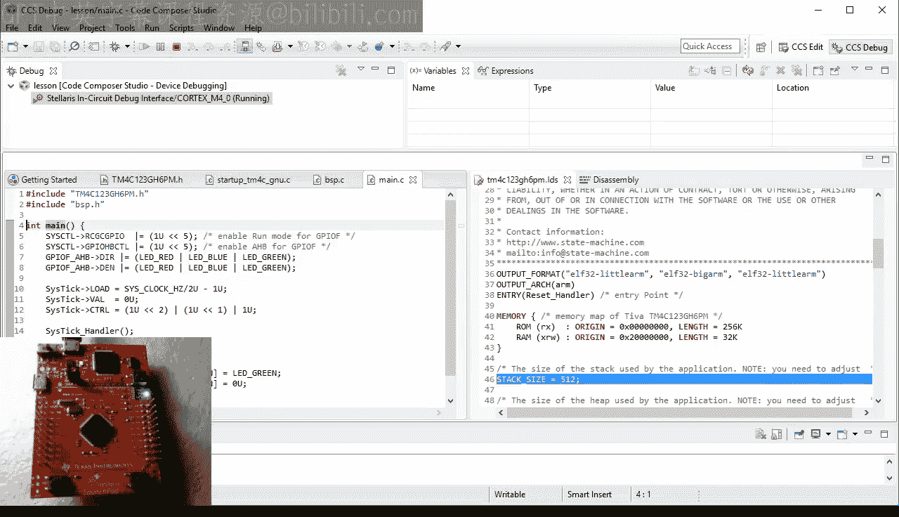

# 19：GNU-ARM工具链与Eclipse IDE

## 概述
在本节课中，我们将学习如何将开发工具链从IAR切换到免费的、无限制的GNU-ARM编译器以及基于Eclipse的集成开发环境。这是一个很好的机会来回顾代码，并了解代码可移植性在实际中的意义。

## 工具链切换与代码可移植性
工具链的切换实际上是一个很好的机会来回顾代码，并了解代码可移植性在实际中的意义。正如你将看到的，到目前为止你编写的大部分代码无需任何更改即可在新的ARM工具链上工作，这主要归功于对Cortex微控制器软件接口标准（CMSIS）的遵守。然而，启动代码和板级支持包中的一些IAR特定扩展必须替换为新编译器的等效项。

## 下载与安装开发工具集
今天，让我们从下载和安装用于新ARM工具链的开发工具集开始。实际上，有很多这样的工具集可供选择，但你需要寻找一个支持你开发板的工具集。在这里，最重要的因素是支持特定的调试器接口，对于Tiva C LaunchPad开发板来说，就是Stellaris ICDI。

由于该开发板来自德州仪器（TI），寻找工具集的合理地点是ti.com网站。在那里，你确实可以找到一个名为Code Composer Studio（CCS）的工具集。与现在通常的做法一样，我不会给你一个具体的、固定的下载CCS的URL，因为它很可能在几周后失效。我建议使用搜索框。

当你搜索“CCS”时，可以快速找到正确的网页。在下载部分，你可以看到CCS工具可以免费使用，没有限制，并且使用GNU GCC工具集。点击Windows下载，这将引导你进入注册页面，并需要填写一些表格以遵守出口管制规定。最终，你应该能够下载到Windows版的CCS安装程序。

你需要运行它并同意许可条款。在下一步中，你可以选择安装目录。你可以保留默认设置或选择自己的目标目录，但我强烈建议不要使用带有空格或任何非标准字符的目录名。

接下来的步骤允许你选择CCS组件。在这里，你需要展开“32-bit ARM MCUs”并选择“Tiva C Series support”。同时，你还需要明确选择“GCC ARM compiler”。你不需要再做其他选择，所以最后点击“Finish”开始安装，这可能需要几分钟时间。

## 配置工作空间与创建项目
当你启动Code Composer Studio时，它会询问你工作空间的位置。工作空间的概念在所有基于Eclipse的工具集中都很常见，旨在将相关的项目分组在一起。根据我的观察，大多数人倾向于为他们所做的所有事情使用一个默认的工作空间，但我建议你为不同的项目组使用单独的工作空间。

具体来说，我建议你为这个嵌入式编程课程使用一个专用工作空间。由于我将本课程的所有项目都保存在“embedded_programming”目录中，我也在那里创建了CCS工作空间，即在CCS子目录中。

现在，你终于准备好创建你的第一个项目了。这部分特定于这个将Eclipse重新打包为Code Composer Studio的特定版本，但所有基于Eclipse的集成开发环境中的一般过程都是相似的。

为新项目做的第一个选择是嵌入式目标。在这里，你需要选择Tiva C系列，以及该系列中安装在你的Tiva C LaunchPad开发板上的特定TM4C123 MCU。

接下来，你选择与目标的连接，对于你的LaunchPad来说，就是Stellaris ICDI。请注意，对这个特定调试器接口的支持是你最初选择CCS工具集的主要原因。

在下一步中，你需要为项目命名。这里我建议一个通用名称“lesson”，用于属于这个嵌入式编程课程的项目。这个名称将适用于所有后续课程，因为你将简单地克隆这个原始项目，而不是每次都从头开始创建一个新项目。

出于同样的原因，你也不能在默认位置（工作空间目录内）创建项目。相反，你在保存所有先前课程的目录中创建项目。在我的机器上是“embedded_programming”，但在你的计算机上可能不同。为了完成项目位置设置，你需要为这个特定项目添加“lesson19”子目录。

下一个也是最后一步至关重要。在这里，你需要选择GNU工具集，而不是默认的TI ARM编译器。当你点击“Finish”时，CCS将在工作空间和磁盘上的“lesson19”目录中创建你的“lesson”项目。

你可以通过点击顶部的锤子按钮来构建项目。正如你所看到的，构建过程成功完成，没有任何问题。

## 分析生成的代码
让我们快速浏览一下CCS为这个项目生成的代码。首先，你得到了一个带有空`main`函数的`main.c`文件。其次是启动代码，这是由芯片供应商提供的代码中非常典型的。不幸的是，它具有我在第13、14和15课中介绍过的所有缺点。

首先，这个启动代码使用了不符合CMSIS的专有异常名称。此外，向量表需要在你开始或停止使用给定的中断处理程序时进行编辑。例如，要使用SysTick处理程序中断，你需要修改向量表中的相应条目，并且还需要在文件顶部声明处理程序的原型。

最后，提供的异常处理程序实现包含了使CPU陷入死循环的无限循环。换句话说，如果任何这样的异常处理程序被执行，系统将冻结，用户会认为这是拒绝服务。这在任何生产级代码中都是不可接受的。

生成的代码还包含扩展名为`.ld`的文件，即链接器脚本。这个文件的目的是告诉链接器ROM和RAM在地址空间中的位置，以及在哪里放置各种程序段。你在第14课中看到了IAR工具集的链接器脚本示例。这里你有一个新工具集的链接器脚本。这又是一个常规的链接器脚本，与启动代码匹配。

其中，它将栈分配为RAM中的最后一个段。在我看来，这是一个错误，因为在ARM上栈是向低地址增长的。因此，栈溢出可能会损坏其上的RAM段。事实上，这似乎是臭名昭著的丰田意外加速案例中可能的原因。正如我在文章《我们是否在用栈溢出搬起石头砸自己的脚？》中描述的那样，我在本视频的评论区提供了这篇文章的链接。

## 改进生成的代码
看来CCS生成的代码并不是特别可用，但好消息是，你可以通过应用到目前为止学到的课程来修复所有问题。

那么第一件事就是将第18课的所有相关代码复制到新的第19课文件夹中。可用的文件是`BSP.h`、`BSP.c`、`main.c`、`startup_tm4c.c`以及你的TM4C123 MCU的主头文件。

有趣的是，复制到`lesson19`文件夹的最终文件会立即显示在你的项目中。这是所有Eclipse项目的行为方式。项目目录中的所有源文件都会自动包含在项目中，你不需要像在IAR Embedded Workbench IDE中那样显式地添加它们。

然而，这个Eclipse策略也有其缺点。例如，现在项目中有两个启动文件，所以你需要删除其中一个。

让我们尝试构建这个项目。这次你得到了一些错误。第一个错误是编译器找不到包含文件`core_cm4.h`。这个文件是CMSIS的一部分，在Code Composer Studio中不像在IAR Embedded Workbench中那样直接可用。

这不是一个大问题，因为你可以轻松地自己提供CMSIS。在这里，我为你准备了一个目录`CMSIS`，其中包含子目录`include`中的核心头文件。你应该将`CMSIS`目录复制到你保存本视频课程课程的文件夹中，这样你就可以在所有后续课程中重用CMSIS。

当然，复制目录是不够的，因为你还需要告诉编译器在这个新目录`CMSIS/include`中查找包含文件。你可以通过项目属性对话框来实现这一点，通过右键单击项目并选择“Properties”弹出菜单来打开它。

具体来说，你需要在“GNU Compiler”组中选择“Directories”属性，在那里你会找到“Include paths”窗格。要添加一个新的包含目录，请单击加号按钮。第一种简单的方法是简单地浏览你的文件系统以找到`CMSIS/include`目录。但这样做的一个大缺点是，你添加了一个绝对包含路径，这只会在你的计算机上、这个特定的`embedded_programming/CMSIS`目录中有效。

一个更好的方法是创建一个相对包含路径，这将在任何计算机上都能工作。Eclipse IDE允许你通过系统变量创建相对路径。具体来说，在这些变量的列表中，你可以选择`${PROJECT_LOC}`，这将创建相对于项目位置的路径。从项目位置，你需要向上走一级，然后附加`CMSIS/include`。

关于在Windows上使用目录分隔符，你可以使用反斜杠或正斜杠。我使用正斜杠，因为它们似乎更通用。当你再次构建时，你会发现之前的包含错误消失了，但你得到了一堆新的错误。

事实证明，这些新错误大部分来自启动代码。这实际上不应该那么令人惊讶，因为这段代码是用IAR特定的C语言扩展编写的，而新编译器无法识别这些扩展。

因此，我为你准备了用GNU特定C语言扩展重写的启动代码。正如你稍后将看到的，启动代码必须与链接器脚本紧密匹配，所以我也包含了一个匹配的链接器脚本。要将这些文件包含在项目中，我只需将它们复制到`lesson19`目录。我需要覆盖之前的链接器脚本，并且还需要删除之前的启动代码。

当你切换到Eclipse IDE时，你可以看到项目立即更新了新文件。

## 审查新启动代码与链接器脚本
让我们快速回顾一下代码，以便你知道它是如何工作的。首先，与旧文件相比，新的、GNU特定的启动代码符合最新的CMSIS 4.30。

当你向下滚动到向量表时，你可以看到它有一个特殊的属性`section(".isr_vector")`。这是一个GNU特定的扩展，它告诉编译器将后面的符号（在本例中是向量表）放置在指定的段中。

要查看这个段在哪里，你可以打开新的GNU链接器脚本。你可以看到`.isr_vector`是ROM中的第一个段。而ROM段位于地址0x0，所以位于ROM开头的向量表也在0x0，这正是ARM CPU所需要的。

正如你希望从第15课中记住的那样，ARM向量表的第一个元素是初始栈顶，所以在这里你看到`&`符号表示`__stack`的地址，并转换为`int`。符号`__stack_end`再次来自链接器脚本。确实，当你向下滚动一点时，你可以看到`.stack`段是RAM中的第一个段。

与将栈作为RAM中最后一个段的常规方法相反，我建议将其作为第一个段。这样，栈溢出将无法损坏任何其他RAM段。作为一个额外的优势，溢出到RAM下方未映射内存的栈将通过执行硬故障异常自动检测到，所以你会知道它发生了。

说到栈，你可以通过调整链接器脚本顶部的符号`STACK_SIZE`来改变它的大小。

回到启动代码，符号`__etext`由链接器提供，但编译器不知道它。为了告诉编译器，你需要在启动文件顶部将`__etext`声明为外部变量。

向量表的其他元素是Cortex-M异常和中断的处理程序函数的地址。正如你所看到的，该表已经包含了所有具有符合CMSIS名称的特定处理程序，因此你根本不需要编辑代码来使用任何这些异常或中断。

同时，如果你不使用给定的异常或中断，它将被默认处理程序实现自动替换。这是通过一对GNU特定属性`weak`和`alias`来实现的。

`weak`属性意味着一个符号定义可以被另一个定义覆盖，链接器将悄悄地丢弃弱定义，而不会报告符号被定义了两次。`alias`属性意味着如果符号未定义，则应改用别名符号。

例如，如果你在你的应用程序中定义了`SysTick_Handler`，链接器将采用你的非弱定义。如果你没有定义`SysTick_Handler`，链接器将采用它的默认处理程序别名，并且不会报告任何错误。

但请注意，并非所有处理程序都有别名。这是因为标准故障处理程序实际上是在这个启动代码中定义的，所以你不需要在你的应用程序中定义它们。但这些处理程序不是原始的、导致拒绝服务的无限循环。提供的实现使用内联汇编来小心避免任何栈的使用，因为此时栈可能已损坏。汇编代码将关于故障的信息存储在R0和R1寄存器中，然后分支到`assert_handler`，在那里你可以执行最后的损害控制。

在这里，你遇到了另一个GNU特定属性`naked`，它指示编译器不要为这个函数做任何栈操作。

## 修复剩余错误与构建项目
当你再次尝试构建时，仍然有一个错误，这次是在`BSP.c`中。到现在，你应该知道问题是什么了。扩展关键字`__stackless`是IAR用于无栈函数的扩展。在GNU中，你需要用属性`naked`替换它。

再次构建。这次，编译器抱怨`__enable_interrupt`，这是一个IAR内部函数。这个操作需要替换为`__enable_irq`。

再次构建。哈利路亚！完全没有错误了。恭喜你，你刚刚完成了将深度嵌入式代码从一个工具集移植到另一个工具集的第一次尝试。

## 测试代码
是时候插入你的Tiva C LaunchPad开发板来测试代码了。要将代码下载到开发板的闪存并开始调试，请按顶部的“bug”按钮。调试器设置为在`main`函数的开头停止，它确实做到了。

按“go”按钮运行代码，观察LED每秒改变一次颜色。点击“pause”按钮中断代码，观察它在后台循环中停止。

顺便说一下，你现在看到的不同屏幕布局在Eclipse中被称为“调试透视图”。这是为了与你在编辑代码时看到的“编辑透视图”区分开来。调试透视图提供了你在IAR中遇到的所有调试器视图，例如反汇编视图。你也可以单步执行代码，并观察LED被打开和关闭。

你可以设置断点，例如，在`SysTick_Handler`内部，以查看这个中断被调用的频率。

要停止调试会话并返回到编辑透视图，请按顶部的“stop”按钮。

## 修改代码行为
作为本课程的最后一步，让我们修改从你之前的IAR项目中复制的代码的行为，例如，将切换的LED颜色从红色改为蓝色。构建项目并像之前一样开始调试。观察LED以新颜色闪烁。

## 总结
本节课介绍了将工具集切换到GNU-ARM和基于Eclipse的Code Composer Studio（CCS）。本课的启动代码和链接器脚本比芯片供应商分发的典型代码更接近生产质量。该代码符合CMSIS，并且将适用于任何基于GNU-ARM的工具集，而不仅仅是CCS。你可以轻松地将其适配到任何ARM Cortex-M微控制器。

如果你想了解更多关于使用免费的GNU-ARM工具集的信息，我推荐我的10部分文章《使用GNU构建裸机ARM系统》，该文章在2007年是Embedded.com上最受欢迎的文章。这篇文章讨论的是经典的ARM7/ARM9内核，但许多信息仍然适用于Cortex-M。我在本视频的YouTube描述中提供了这篇文章的链接。

本课程的项目下载将分为两部分：包含CCS项目和课程代码的常规`lesson19.zip`存档，以及包含CMSIS代码的`CMSIS.zip`存档。在下一课中，我将最终讨论竞争条件，这是为了有效地使用中断而绝对需要理解的一个概念。