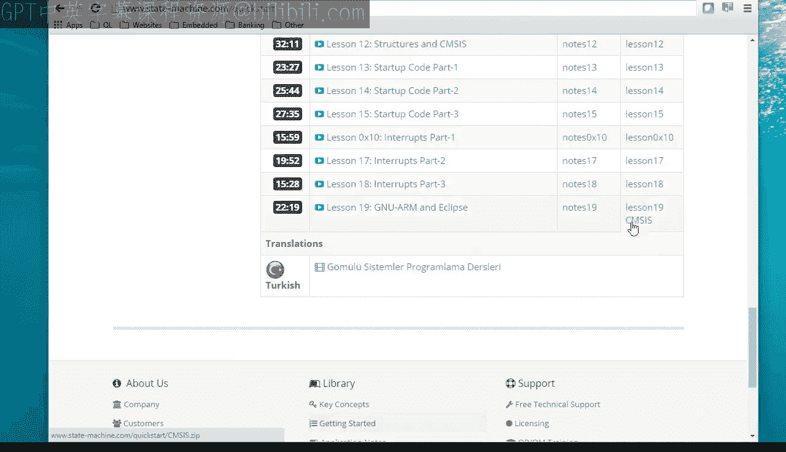
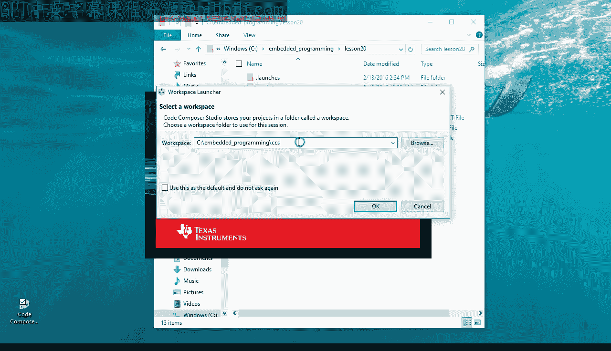
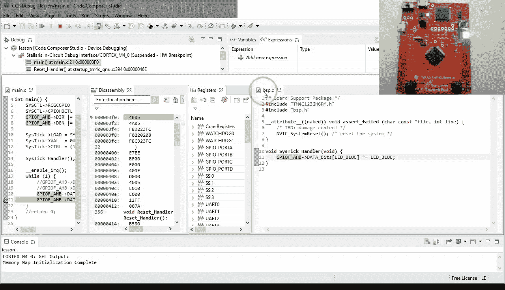
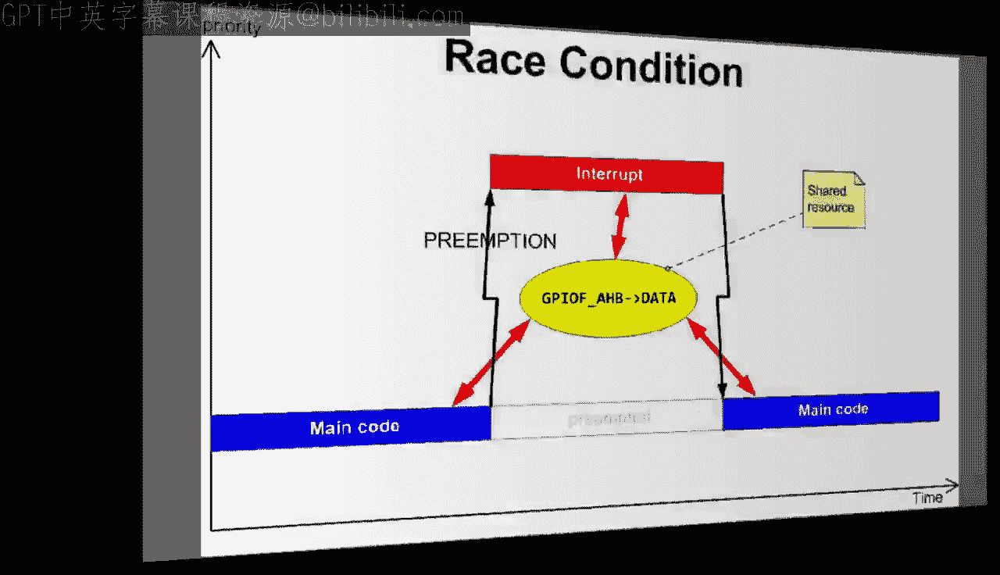
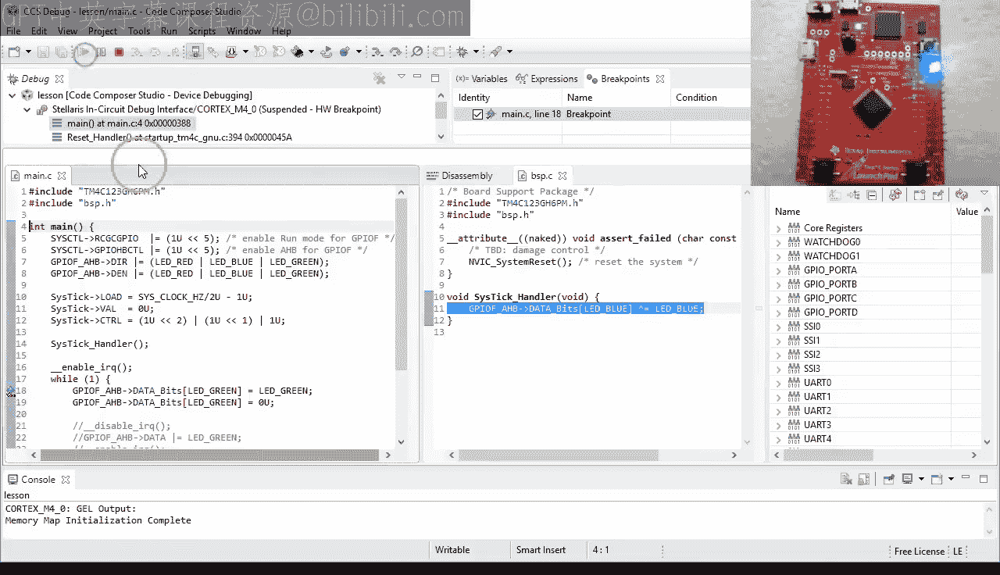

# 20：竞态条件及其避免方法

在本节课中，我们将学习什么是竞态条件，为什么它们很危险，以及如何避免它们。我们将通过一个具体的例子来演示竞态条件的产生，并探讨两种主要的解决方案。

## 项目设置回顾

上一节我们介绍了基于Eclipse的Code Composer Studio开发工具。本节我们将在此基础上继续。

以下是项目目录结构：
*   `CCS` 子目录包含本视频课程各课的Eclipse工作空间，由Code Composer Studio创建。
*   `CMSIS` 子目录包含Cortex微控制器软件接口标准头文件。你需要从本视频课程的项目下载中获取并解压CMSIS压缩包来创建此目录。
*   `lesson19` 目录包含第19课的所有代码和CCS项目文件，同样可以从项目下载中获取。

当然，你也可以在此目录中存放其他课程的内容，但今天你只需要上述三个目录。

要为本次课程创建新项目，请复制之前的 `lesson19` 目录并将其重命名为 `lesson20`。

使用基于Eclipse的IDE时，通常无法通过双击直接打开项目。相反，你需要先启动Eclipse IDE，然后导入新项目，稍后我将演示。

启动Code Composer Studio时，请确保选择我之前描述的 `CCS` 工作空间。

Eclipse最终打开后，应包含一个名为 `lesson` 的项目，这是你在上一课第19课中创建的。

在导入第20课的新项目之前，你需要从工作空间中删除旧项目，因为新项目也将具有相同的复制名称 `lesson`，而Eclipse不接受两个同名的项目。

删除项目时，请不要勾选“删除磁盘上的项目内容”复选框。

现在，你终于可以导入为第20课复制的项目了。选择“文件”>“导入”菜单，然后选择“现有项目到工作空间”。

点击“下一步”，浏览到 `lesson20` 目录。

你应该能看到 `lesson20` 目录中的 `lesson` 项目，点击“全选”和“完成”按钮。

完成所有这些操作后，你应该在Eclipse中打开了 `lesson` 项目，但这次这是对应于第20课的新项目。

## 代码分析与问题引入

让我们首先打开这里的两个源模块，即 `main.c` 和 `bsp.c`，并将它们并排放置。

主代码包含惯用的无限 `while(1)` 循环，其中绿色LED被打开和关闭。

BSP代码包含SysTick中断服务例程，它被设置为每秒触发两次以切换蓝色LED。

对于本课，让我们修改主代码，注释掉通过GPIO寄存器的特殊 `DATA_BITS` 数组来打开和关闭绿色LED的两行代码，我在第7课中解释过这个数组。

今天，你将不使用 `DATA_BITS` 数组，而是简单地使用控制所有8个GPIO线的 `DATA` 寄存器。具体来说，要设置所需的位，你将读取 `DATA` 寄存器，将其与 `LED_GREEN` 位进行逻辑或运算，然后将结果写回 `DATA` 寄存器。你这样做是为了不干扰数据寄存器中控制绿色LED以外其他内容的另外七个位。顺便说一下，如果你不记得位运算符是如何工作的，请回到第6课。

要清除所需的位，你将读取 `DATA` 寄存器，将其与取反后的 `LED_GREEN` 位进行逻辑与运算，并将结果写回 `DATA` 寄存器。我特意使用了这种冗长的表达式写法，是为了向你展示GPIO位是通过读-修改-写操作序列来设置或清除的，但这些表达式也可以通过C语言中的 `|=` 和 `&=` 运算符更简洁地书写。不过请记住，这些简短形式执行的是完全相同的读-修改-写操作序列。

当你构建程序并将其加载到Tiva C LaunchPad开发板上时，可以看到它像以前一样闪烁LED。

当你中断代码并单步执行主循环时，可以看到绿色LED按照你的编程精确地打开和关闭。

此外，当你在SysTick处理程序中设置断点时，可以看到它每次被调用时仍然会切换蓝色LED。

所以你的程序似乎像以前一样工作，对各个元素的检查也没有显示任何问题。有什么不喜欢的呢？

但如果你观察开发板一段时间，可能会注意到蓝色LED的闪烁不再像以前那样规律。具体来说，有时LED似乎会暂停一整秒甚至更长时间。

## 竞态条件演示

为了找出原因，让我们在关闭绿色LED的代码行设置一个断点，并打开一些新的调试器视图，例如反汇编和寄存器视图。

现在让我们在汇编代码中单步执行。

首先，GPIOF数据寄存器的地址被加载到R3和R2中，然后数据寄存器的值再次被加载到R2中。

最后，`BIC` 指令清除了R2寄存器中编码为立即数参数8的绿色LED位。请注意，所有这些机器指令都是由你的一行简短C代码生成的。

但在你执行 `BIC` 指令之前，让我们触发SysTick中断。我的意思是，中断随时可能发生。那么为什么不在这里呢？

要触发SysTick中断，请打开NVIC寄存器集。

滚动到 `NVIC_ICSR`。

向 `PENDSTSET` 字段写入1，然后按回车键。

在你运行代码之前，恢复核心寄存器视图并设置一些断点。在 `BIC` 指令之后立即放置第一个断点，第二个断点放在SysTick中断处理程序中。这样你就会知道哪段代码先执行。你应该已经从之前关于中断的课程中熟悉了这个技巧。

最后，你已准备好通过点击“恢复”按钮来运行代码。你不能单步执行，因为这会禁用中断。

嗯，正如你所看到的，第一个命中的断点在SysTick处理程序内部，所以它一定是在 `BIC` 指令之后的另一个断点之前执行的。这意味着SysTick处理程序恰好在这个点抢占（中断）了之前的代码。

所以现在当你单步执行SysTick处理程序代码时，可以看到它打开了蓝色LED。

然后它返回，回到 `BIC` 指令。

现在 `BIC` 指令清除了R2中的绿色LED位，然后将R2存储到GPIO数据寄存器中。

哎呀！这最后一条存储指令同时熄灭了绿色和蓝色LED。这是一个问题，因为代码本应只关闭绿色LED，并且完全不改变任何其他GPIO位。

## 竞态条件解析

我希望你开始理解这里刚刚发生了什么。关闭绿色LED的代码是读-修改-写操作序列，但这个序列在读操作之后、写操作之前被中断了。中断通过打开蓝色LED改变了GPIO数据寄存器的状态。然而，被中断的代码并不知道这个变化，仍然使用了存储在R2中的GPIO数据寄存器的先前值。

你刚刚遇到的问题被称为**竞态条件**。

当两个或多个可以相互抢占的代码段以某种方式访问共享资源，导致结果取决于这些代码段的执行顺序时，就会发生竞态条件。

当然，在一个简单的闪烁示例中，这样的竞态条件不是什么大问题，但它实际上可能是一个致命的错误。例如，想象一下，SysTick中断不是切换蓝色LED，而是打开核反应堆中的冷却系统以防止反应堆过热。

在这种情况下，SysTick中断刚刚打开了冷却系统，但主循环在几分之一微秒后又将其关闭。结果是冷却系统在反应堆熔毁时仍然关闭。

考虑到这一点，我希望你开始明白为什么竞态条件可能是个问题，但我不确定你是否完全理解它们有多么棘手。

问题在于，竞态条件似乎违背逻辑，因为每个单独的代码段都能正确工作。只有当这些代码段一起执行，并在你无法控制的各种位置相互抢占时，问题才会出现。

这导致错误往往是间歇性的、难以重现和难以隔离的，因为通常只有在狭窄的时间窗口内，抢占才会导致错误。这意味着你可能测试系统数小时或数周，从未注意到任何问题，但一些灾难性的竞态条件错误仍可能逃逸到最终产品中。

所有这些使得竞态条件成为你可能需要处理的最糟糕的错误类型。它们是使用中断的直接后果和巨大代价。似乎生活中没有什么好东西，甚至中断，是免费的。

## 避免竞态条件的策略

既然我已经充分强调了其严重性，我希望讨论两种消除竞态条件的主要策略。

第一种策略基于**互斥**的概念，这意味着你确保在访问共享资源时，只有一个并发代码段可以执行。

在你的Blinky程序中，你可以通过在打开蓝色LED和关闭蓝色LED的代码周围简单地禁用中断来实现互斥。这将阻止SysTick中断的抢占，从而消除竞态条件。

让我们在调试器中快速查看这个修改后的版本。

首先，内部函数 `__disable_irq()` 只生成一条机器指令 `CPSID I`。这里没有函数调用开销，这就是使用内部函数的好处。

类似地，`__enable_irq()` 也只生成一条指令 `CPSIE I`。

这两条指令都只在一个时钟周期内执行，因此禁用中断的额外开销非常小。

顺便说一下，中断禁用和启用之间的代码段称为**临界区**。

现在，让我们完全重复之前的测试：触发SysTick中断并设置断点以找出代码执行顺序。单步执行到 `BIC` 指令。

在NVIC中触发SysTick中断。

在 `BIC` 指令之后设置一个断点。

在SysTick处理程序中设置另一个断点。

通过点击“恢复”按钮运行应用程序。

正如你所看到的，这次SysTick没有抢占主代码，而是命中了 `STR` 指令处的断点。

然而，SysTick中断并没有丢失。一旦中断被启用，它就会触发。

当你单步执行中断代码时，可以看到它打开了蓝色LED。

中断然后返回到循环顶部的主代码。

总之，临界区的引入序列化了对共享资源（本例中是GPIO数据寄存器）的访问，并使其成为**原子性**的，即不可分割的。有了临界区，三段代码（SysTick中断和两个临界区）可以相互之前或之后运行，但不能在中间运行。这就是互斥访问的含义。

## 更优的解决方案：避免共享

但比互斥更好的是，从一开始就通过不共享任何资源来避免竞态条件。

所以让我注释掉今天的代码，留给你做实验，并恢复到原始代码。

这个原始代码不使用 `DATA` 寄存器，而是使用255个GPIO寄存器的 `DATA_BITS` 数组。

我几乎用了整整第7课来解释这个GPIO寄存器数组的工作原理，所以这里不再重复。

但今天的主要观点是，该数组为8个GPIO位的每一种可能组合提供了一个单独的寄存器。例如，寄存器 `DATA_BITS[LED_GREEN]` 与寄存器 `DATA_BITS[LED_BLUE]` 是不同的。这意味着没有共享公共的数据寄存器，并且正如你稍后将在汇编中看到的，也不需要读-修改-写操作序列。

设置给定位是通过对专用 `DATA_BITS` 寄存器的特定原子写操作完成的，清除给定位也是如此。

现在你终于明白为什么德州仪器的硬件工程师以这种特殊而复杂的方式设计GPIO寄存器了。他们这样做正是为了分离各种GPIO位，以避免共享的需要，从而消除软件中潜在的竞态条件。这些人在硬件上做了繁重的工作，以便你作为软件设计师的生活可以更轻松。

## 总结

本节课我们一起学习了竞态条件。我们了解了竞态条件是如何产生的，为什么它们是危险且难以调试的。我们探讨了两种主要的避免方法：通过禁用中断实现互斥访问的临界区，以及从根本上避免共享资源的设计（如使用专用的 `DATA_BITS` 寄存器）。硬件设计有时会提供避免软件竞态条件的机制，理解并利用这些机制是编写健壮嵌入式软件的关键。

在下一课中，我将讨论中断优先级以及在ARM Cortex-M处理器上禁用中断的其他方法。