# 21：前后台架构（超级循环）


在本节课中，我们将学习嵌入式系统中最普遍的一种软件架构——前后台架构，也称为超级循环或主循环+中断架构。这是理解所有其他嵌入式软件架构，特别是实时操作系统的基础。

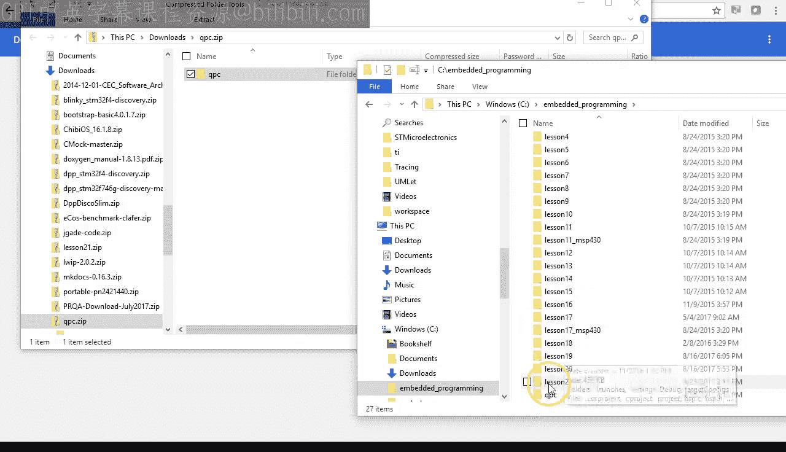

## 概述


前后台架构是许多小型嵌入式系统的核心。它由两部分组成：一个在`main`函数中无限循环运行的**后台**，以及由中断服务程序构成的**前台**。中断可以抢占后台循环，但执行完毕后总是返回到被抢占的点。两者通过共享变量进行通信。

## 开发环境设置

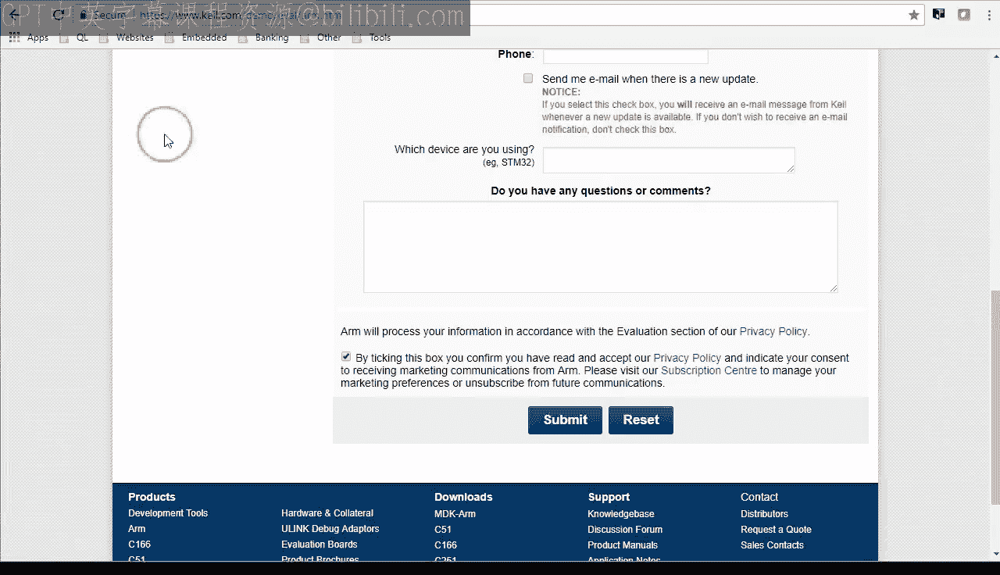

上一节我们介绍了课程主题，本节中我们来看看如何搭建本次课程所需的开发环境。

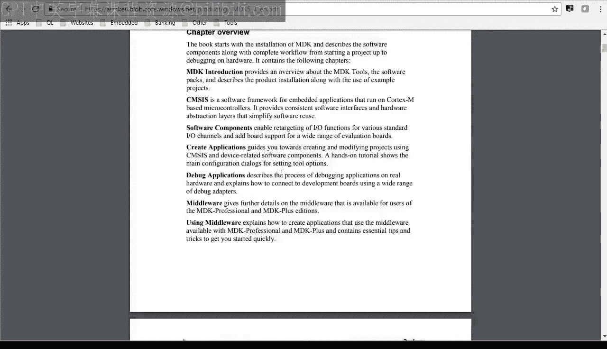

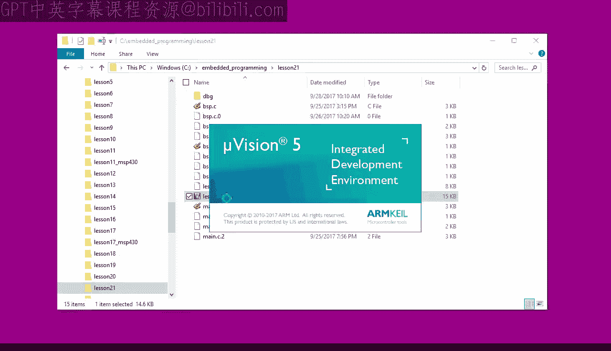

本次课程使用ARM公司的Keil MDK工具链，替代了之前基于Eclipse的TI Code Composer Studio。你可以从ARM官网下载免费的MDK-Lite版本，它完全足够用于本课程的所有项目。

安装Keil MDK后，你需要从课程配套网站下载两个代码包：`lesson21`项目文件和将在后续课程中频繁使用的QPC框架。将它们解压到你的嵌入式编程目录中。

首次打开`lesson21`项目时，可能需要为TI Tiva C系列LaunchPad板安装对应的软件包。在Keil的Pack Installer中选择“Texas Instruments Tiva C Series TM4C123x Series”即可。

## 初始项目分析

现在，让我们打开并分析初始的“闪烁LED”项目。这个项目与第8课的项目类似，但有一个关键改进：延时函数现在基于系统节拍中断实现，提供了更精确的定时。

以下是新的`BSP_Delay`函数的核心实现逻辑：

```c
void BSP_Delay(uint32_t ticks) {
    uint32_t start = BSP_TickCounter(); // 获取起始节拍计数
    while ((BSP_TickCounter() - start) < ticks) { // 循环等待指定节拍数
        // 空循环，等待时间到达
    }
}
```

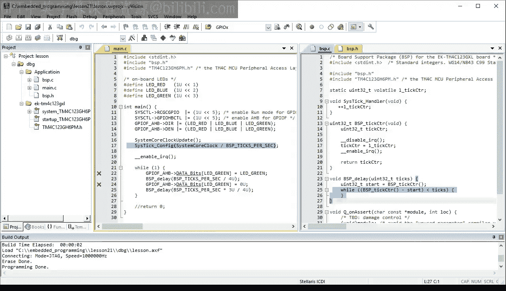

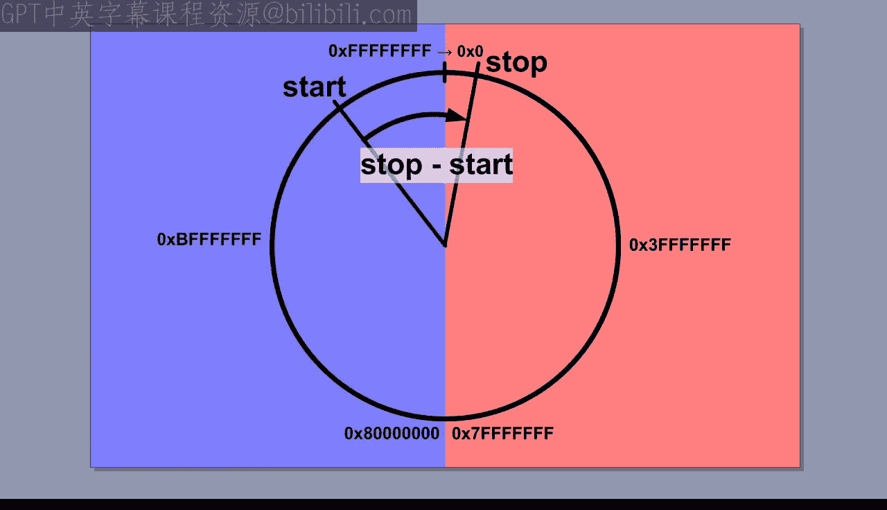

系统节拍中断服务程序（SysTick ISR）以固定频率（例如每秒100次）触发，并递增一个静态的、声明为`volatile`的计数器变量`l_tickCounter`。`volatile`关键字告知编译器此变量可能被中断意外修改，防止编译器进行错误的优化。

## 前后台架构详解

上一节我们分析了具体的代码实现，本节中我们来深入理解前后台架构的概念和特点。

正如其名，该架构包含两个主要部分：
*   **后台**：在`main`函数中的无限循环（`while(1)`），负责处理主要的、非紧急的任务。
*   **前台**：由各种中断服务程序构成，负责处理紧急的、对时间敏感的事件。

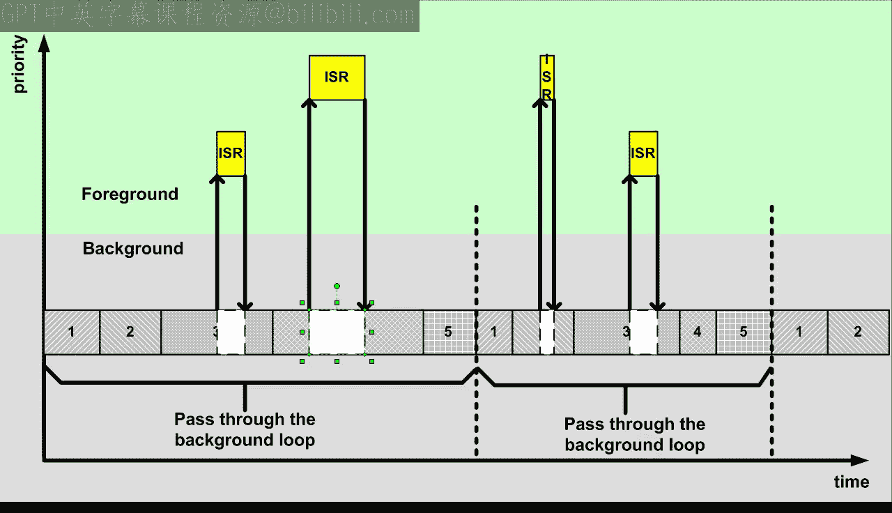

中断（前台）可以随时抢占后台循环的执行，但中断服务程序执行完毕后，CPU会返回到后台循环被中断的位置继续执行。

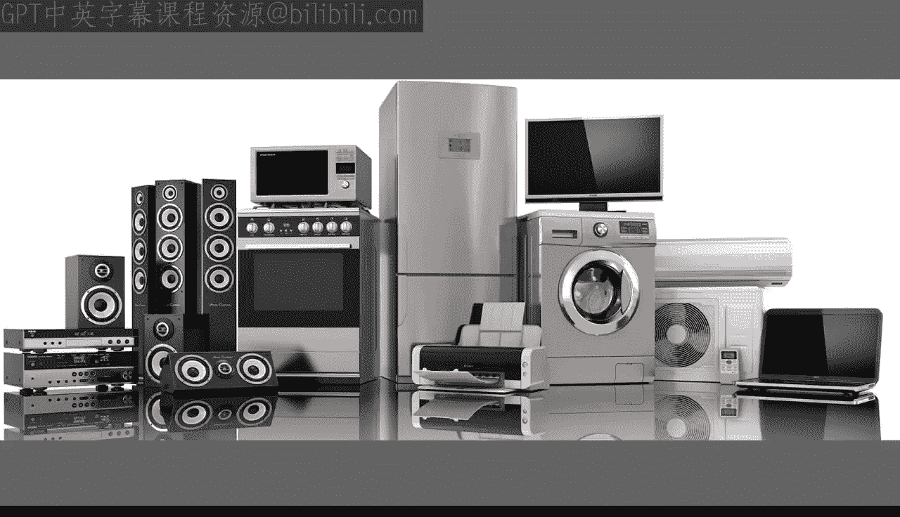


以下是该架构的关键特征：
*   **通信机制**：前后台通过共享变量进行通信。
*   **临界区保护**：访问共享变量时，必须通过短暂禁用中断来防止竞态条件。
*   **时序不确定性**：后台循环中函数执行的时序不精确，因为它受代码条件分支和中断活动的影响。
*   **处理严格时序任务**：任何有严格时间约束的操作都必须放在前台（中断）中执行，但这可能导致中断服务程序变长，并可能干扰后台循环和其他中断。

由于其简单性，前后台架构被广泛应用于消费电子、家用电器、玩具和遥控器等大批量嵌入式产品中。Arduino平台也采用了这种架构，只不过将其库函数背后。

## 代码重构与关注点分离

在分析了基础架构后，我们可以对代码进行重构，使其更清晰、更易于移植。

目前的`main`函数中混杂了应用逻辑（*做什么*）和硬件操作细节（*如何做*）。更好的做法是将它们分离：
*   **应用代码**：专注于描述*做什么*（例如，打开LED，等待，关闭LED）。
*   **板级支持包**：专注于实现*如何做*（例如，如何初始化MCU，如何控制特定引脚的电平）。

以下是重构步骤：
1.  将初始化代码移到`BSP_Init()`函数中。
2.  将LED控制代码移到`BSP_LedOn()`和`BSP_LedOff()`函数中。
3.  更新`main.c`，使其只调用这些BSP函数，并移除所有硬件相关的头文件和宏定义。

重构后，`main`函数变得非常简洁且自解释。要移植到新硬件，只需重写`BSP.c`文件，而应用代码无需任何改动。

## 阻塞式 vs. 非阻塞式编程

到目前为止，我们的后台代码采用的是**阻塞式、顺序执行**的模式。`BSP_Delay`函数会“忙等待”，直到指定的时间过去，期间CPU无法处理其他任务。

我们可以将代码改为**非阻塞式、事件驱动**的模式。在这种模式下，后台循环快速轮询检查事件（如定时器超时）是否发生，而不是停下来等待。这允许系统更及时地响应多个事件。

以下是事件驱动模式的一个简单状态机示例结构：

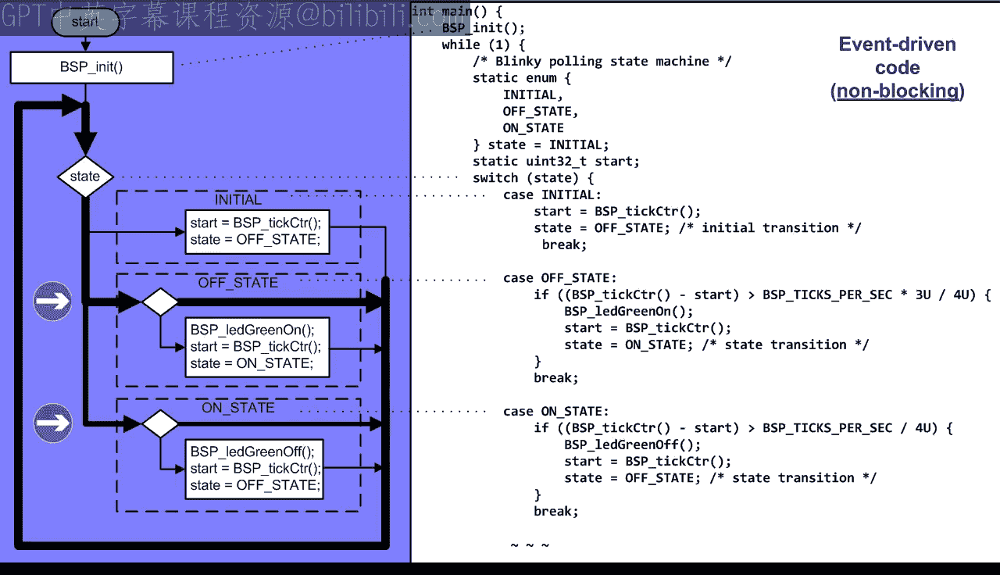

```c
while (1) {
    uint32_t current_time = BSP_TickCounter();

    switch (state) {
        case LED_OFF:
            if ((current_time - start_time) >= OFF_DURATION) {
                BSP_LedOn();
                start_time = current_time;
                state = LED_ON;
            }
            break;
        case LED_ON:
            if ((current_time - start_time) >= ON_DURATION) {
                BSP_LedOff();
                start_time = current_time;
                state = LED_OFF;
            }
            break;
    }
    // 此处可以处理其他事件
}
```

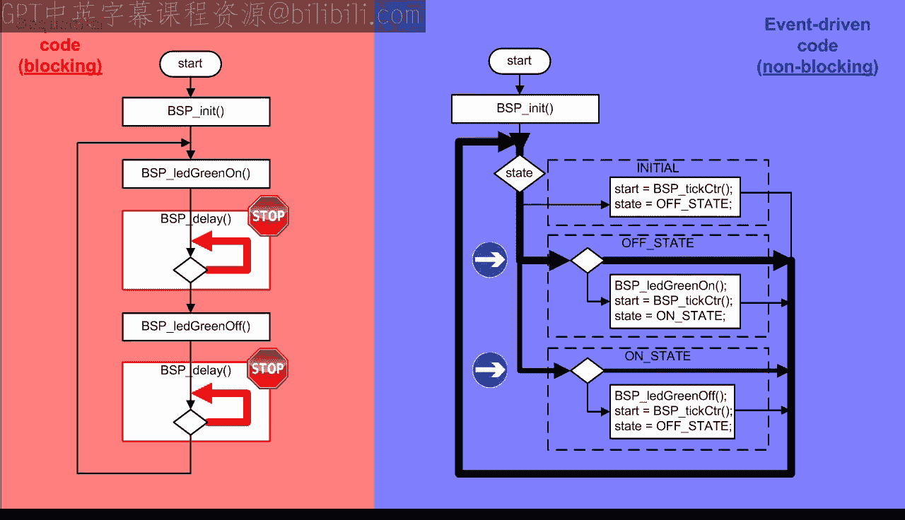

非阻塞式代码的优点是响应更及时，能更好地处理并发事件。代价是代码结构变得更复杂，通常需要引入状态机来管理程序逻辑。许多实际项目由于缺乏清晰的状态机设计，最终会变成难以维护的“面条代码”。

## 总结

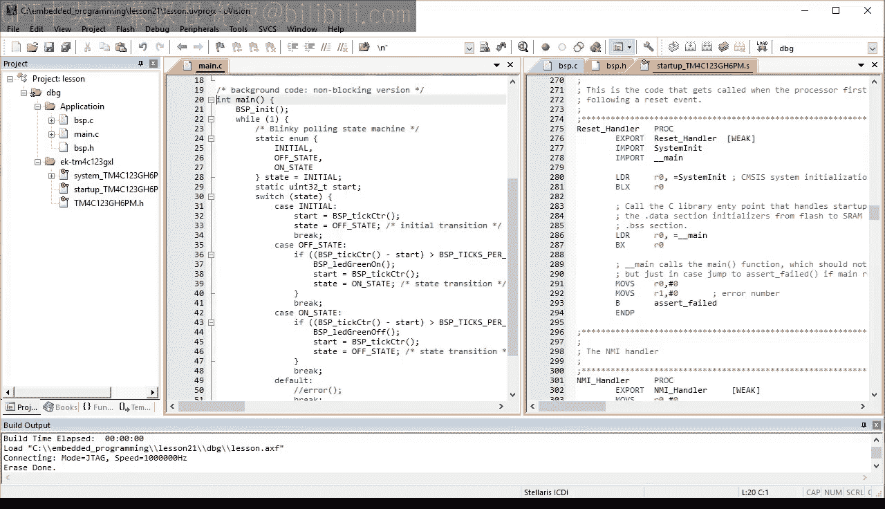

本节课中我们一起学习了嵌入式系统的基石——前后台架构。
*   我们了解了其由**前台中断**和**后台主循环**构成的基本原理。
*   我们探讨了通过**共享变量**进行通信以及使用**临界区**保护的重要性。
*   我们实践了通过**板级支持包**分离硬件细节与应用逻辑，提高了代码的可移植性。
*   最后，我们对比了**阻塞式/顺序执行**与**非阻塞式/事件驱动**两种编程范式，并看到了事件驱动代码在响应性上的优势及其在复杂度上的代价。

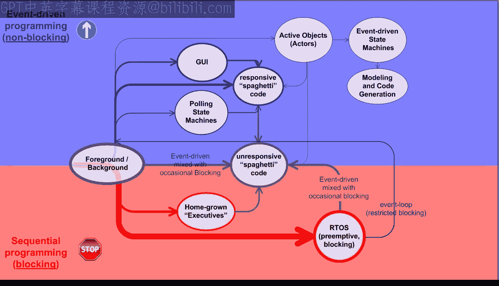

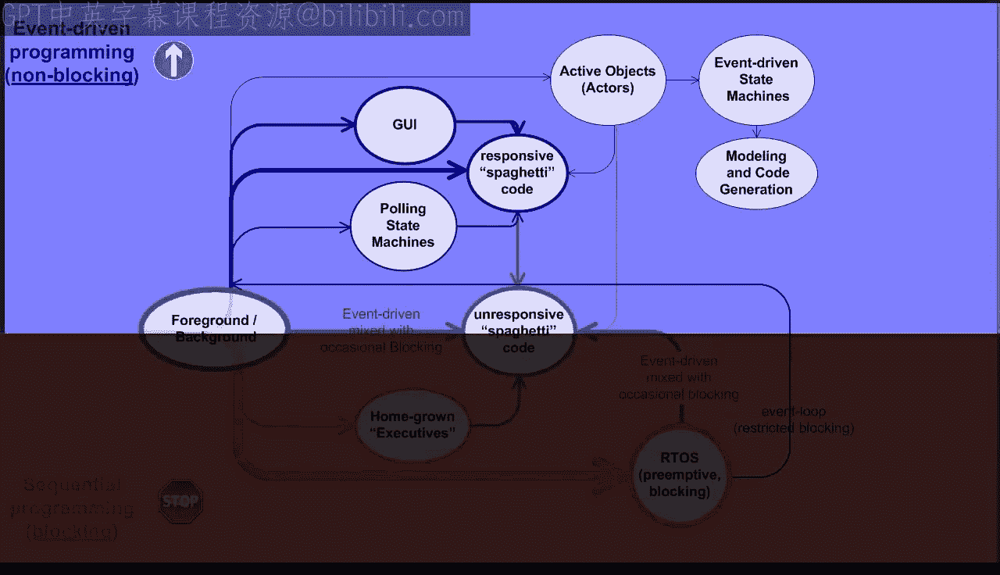

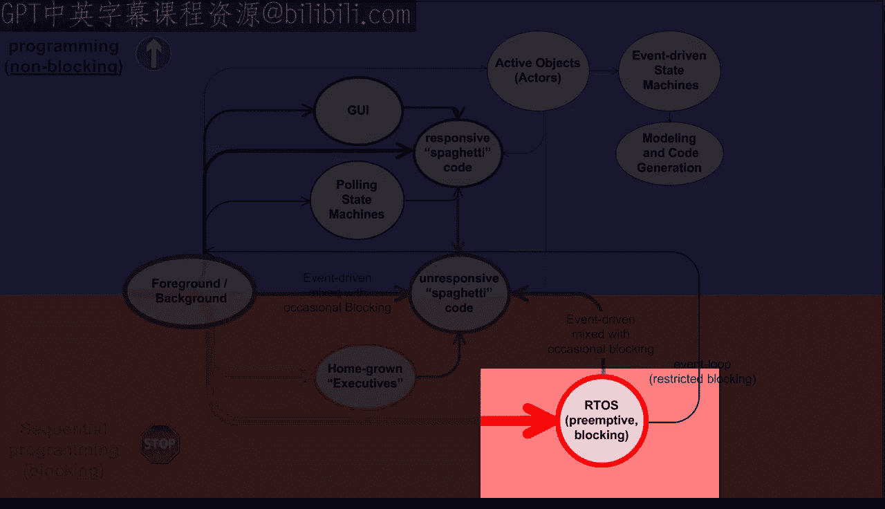

前后台架构是理解更复杂架构（如实时操作系统）的必经之路。在接下来的课程中，我们将以此为基础，开始探索实时操作系统的世界。