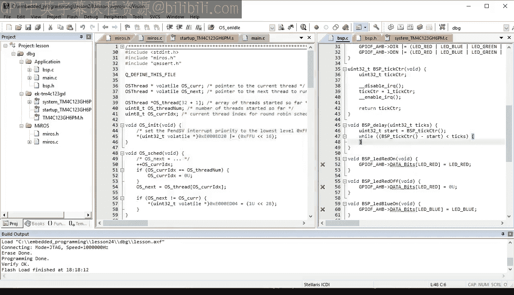

# 24：使用轮询策略实现自动化调度 🔄

在本节课中，我们将学习如何为实时操作系统（RTOS）实现自动化的线程调度。我们将重点构建一个简单的轮询调度器，它能够以循环顺序运行多个线程。通过这个过程，我们还将对MiROS RTOS进行多项改进，并观察其高效的运行性能。

## 项目准备 🛠️

首先，我们需要复制上一课（第23课）的项目目录，并将其重命名为“lesson_24”。进入新目录后，双击打开其中的Microvision项目文件。

回顾上一课的内容，我们开始构建一个名为MiROS的最小化实时操作系统。目前，MiROS RTOS已经能够表示线程、启动线程，并能在不同线程之间切换上下文。然而，在`OS_Sched`函数中，选择下一个要运行的线程这一调度过程仍然是手动的。今天，我们将实现自动化调度，使MiROS能够真正全速运行你的线程。

## 实现自动化调度 🤖

对于只有两个线程（Blinky1和Blinky2）的特定情况，我们可以简单地使用`if`语句硬编码调度逻辑：如果当前线程是Blinky1，则将`OS_next`设置为Blinky2的地址；否则，将其设置为Blinky1的地址。

编译此代码时可能会失败，因为编译器无法识别`Blinky1`和`Blinky2`标识符。我们可以通过提供外部声明来修复这个问题。通常，这类声明会放在头文件中，但现阶段我们只是为了测试自动化调度的基本思路。

代码正确编译后，将其加载到LaunchPad开发板上运行。可以看到，来自Blinky1线程的绿色LED和来自Blinky2线程的蓝色LED都在同时且独立地闪烁。这表明自动化调度是可行的，并且我们知道了预期的运行结果。

## 重构设计：避免硬编码 🧩

现在，我们尝试改进内部设计，避免在调度器中硬编码特定的线程。这个过程称为重构。我们的目标不是改变代码行为（它已经符合要求），而是优化其内部结构。

重构的方法有很多种，核心在于如何组织在`OS_thread_start`函数中启动的线程。一些RTOS使用链表来组织线程，然后由调度器遍历。但考虑到MiROS未来的发展方向，我建议采用一种简单的“蛮力”解决方案：将线程指针存储在一个预分配的数组`OS_thread[]`中。

一旦通过连续调用`OS_thread_start`将线程指针填入数组，调度器将以循环方式选择下一个要运行的线程。

首先，我们需要定义`OS_thread`数组，其大小设为32+1个线程。MiROS RTOS最多可以处理32个线程，这个限制在后续课程中会更清晰。RTOS还需要记录已启动的线程数量，我们将使用变量`OS_thread_n`来保存。最后，调度器需要记住当前在`OS_thread`数组中的索引，我们将使用变量`OS_cur_idx`，并在循环调度中递增和回绕该索引。

## 改进线程启动与断言 🔒

现在，每当在`OS_thread_start`中启动一个新线程时，其指针将被存储在`OS_thread`数组中，并且`OS_thread_n`计数器会递增。这里我们做了一个隐含假设：不会溢出线程数组。这种假设应该通过某种方式强制执行。

典型的方法是检查索引并在溢出时向调用者返回错误码。但调用者可能忽略此问题。对于这种情况，更好的方法是使用断言。C语言提供了标准的`assert`设施，但它在深度嵌入式编程中并不适用，因为我们没有屏幕来打印消息，也无法真正退出程序。

因此，我在这里使用了一个嵌入式系统友好的断言`Q_ASSERT`。它检查表达式，如果为假，则调用特殊的回调函数`Q_onAssert`。这个函数已经在`bsp.c`文件中定义，因为启动代码已经在使用断言。你应该根据具体项目仔细定制此函数，这是代码失败后的最后一道防线。当断言失败时，你应该尝试进行损害控制，并记录或输出断言的位置（由`module`和`loc`参数提供）。之后，通常应该重置系统以避免拒绝服务故障。

为了使用嵌入式系统友好的断言，需要包含`qassert.h`头文件。该文件位于QPC的`include`目录中，因此需要确保该目录在你的包含搜索路径中。请确保从`state-machine.com/quickstart`网页下载并解压QPC。

在给定文件中使用断言，还需要在文件顶部使用`Q_DEFINE_THIS_FILE`宏来定义文件名。最后，我们可以使用`qassert.h`头文件中定义的`Q_DIM`宏来获取数组维度，而无需引入额外的符号名称。

## 实现轮询调度器 🔄

完成上述准备后，我们进入`OS_Sched`函数中最有趣的部分：实际的调度逻辑。

在这里，我们需要递增当前运行线程的索引（存储在`OS_cur_idx`变量中），并在索引达到线程数量时将其回绕到0。然后，通过将`OS_next`指针设置为`OS_cur_idx`索引处的线程，完成轮询调度。

至此，调度器就完成了。现在可以构建并运行代码。这种设计的优点是，不再需要在应用程序中硬编码线程，因为MiROS RTOS会注册每个新启动的线程，并自动将其纳入轮询调度。

## 线程的可组合性 🧱

为了验证添加新线程的便捷性，让我们创建另一个Blinky类型的线程。新的Blinky3线程将闪烁红色LED，并使用略有不同的开/关延时，以便与其他两个Blinky线程结合产生一些有趣的色彩模式。

可以看到，添加新线程的操作仅限于主文件，不需要更改任何现有线程或RTOS代码。线程的这种特性称为可组合性。请注意，只有在添加了RTOS之后，线程才变得可组合，因为如果没有RTOS，你无法轻松地将它们组合起来，使其看似同时且独立地运行。

## 改进初始化时间线与中断 ⏱️

接下来，我们需要改进MiROS RTOS的另一个方面：初始化时间线，特别是中断的配置和使能。

目前，代码已经在`BSP_init`函数中启动并使能了中断。这为时过早。因为如果在到达`main`函数末尾之前发生中断，该中断可能会触发上下文切换，从而将控制权从`main`函数夺走且不再返回。这意味着一些重要的初始化代码可能无法执行，一些线程可能无法启动。

正确的RTOS初始化时间线是：在所有线程都启动之后，才配置和启动中断。这意味着正确的位置是在`main`函数的末尾。这里也是那个丑陋的`while(1)`循环所在的位置，让我们用新的RTOS API `OS_run()`来替换它。

顾名思义，`OS_run`函数是你将控制权转移给RTOS并请求它运行你的线程的地方。此时，所有初始化都已完成，你已准备好接收中断。

`OS_run`的实现将从调用`OS_onStartup`回调函数开始。这里的“回调”意味着该函数不会在RTOS本身中定义，而是需要在应用程序中定义。`OS_onStartup`函数是你配置和使能中断的地方。接下来，`OS_run`函数将调用调度器来运行第一个线程。这个调用与你在SysTick处理程序中的调用相同，但这次你是在中断上下文之外调用调度器。

从之前关于RTOS的课程中我们知道，上下文切换只能在中断之后立即发生，因为整个堆栈布局假设线程是作为从异常返回而切换的。但在这里没问题，因为调度器并不直接执行上下文切换，而是触发PendSV异常，然后该异常正确地返回到下一个要运行的线程。PendSV异常将在中断重新使能后立即运行，因此控制权永远不会真正返回到`OS_run`，其后的任何代码也永远不会执行。

既然如此，我们可以使用一个总是失败的断言。可以将其编码为`Q_ASSERT(0)`，但`qassert.h`头文件为这种情况提供了一个更具描述性的断言，称为`Q_ERROR`。

最后，我们还需要在`miros.h`头文件中声明新的RTOS API的原型。现在尝试构建时，会因为缺少`OS_onStartup`回调函数而失败。这是一个很好的提醒，我们仍然需要在`bsp.c`文件中定义这个应用程序特定的函数。要获得`OS_onStartup`函数的主体，只需剪切并粘贴`BSP_init`函数中处理中断配置和使能的部分。最后一条使能中断的指令是多余的，因为`OS_run`函数无论如何都会禁用并重新使能中断。

这次，代码编译和链接没有错误或警告。让我们在调试器中快速单步执行代码的主要部分。在`OS_run`处设置断点，观察它如何禁用中断并调用调度器。调度器递增`OS_cur_idx`索引，检查回绕，并将`OS_next`设置为Blinky2线程的地址。下一个有趣的断点在PendSV处理程序内部，可以看到它如何返回到下一个线程（本例中是Blinky2）。最后，移除断点后，可以观察所有三种颜色的LED在三个Blinky线程同时运行时闪烁。

## 测量RTOS性能 ⚡

随着MiROS RTOS真正自主运行，在本节课的最后几分钟，你可能有兴趣了解它的运行速度。为了进行测量，我将使用一个混合信号示波器，其逻辑分析仪连接到Tiva-C LaunchPad开发板的以下引脚：红色LED、蓝色LED、绿色LED、几个接地引脚，以及用作测试引脚的PF4。

第一个视图显示信号D1到D4，它们对应PF1到PF4，线条颜色与所连接LED的颜色匹配。可以看到，随着LED闪烁，信号发生变化，但变化速度太慢，难以测量上下文切换时间。

我们需要在每个引脚上看到更快的持续活动，例如让引脚快速上下翻转，中间没有延迟。这可以通过简单地在线程处理程序中注释掉`BSP_delay`函数调用来实现。但还需要一个触发器来知道上下文切换何时发生。为此，我们将使用另一个测试引脚，比如尚未使用的PF4。

为了提供上下文切换的触发器，可以使用SysTick处理程序来驱动测试引脚上升和下降。由于测试引脚是输出引脚，需要在`BSP_init`函数中将其配置为输出。将此代码加载到开发板后，会得到一幅非常不同的画面：所有LED都以不同的强度发光，因为它们切换得太快，人眼无法看到单个闪光。

在逻辑分析仪中，可以看到引脚快速上下翻转，但也可以清楚地看到这些活动是互斥的，即一次只有一个引脚在切换，而其他引脚保持原样（要么高要么低）。还可以看到，活动的切换只发生在与测试引脚对应的D4线被激活时，因此让我们将触发器设置为D4的上升沿。

现在，上下文切换总是位于屏幕中央，我们可以方便地放大以查看细节。让我们进行几次测量。首先，测量线程的最后一次活动与触发器（即SysTick中断开始）之间的时间。为了看到测量值，我需要激活模拟视图。结果大约是400纳秒。

要将此值转换为CPU时钟周期数，需要将延迟乘以时钟频率。基本经验法则是：时钟频率每增加1MHz，每微秒就对应一个时钟周期。你的Tiva-C LaunchPad以50MHz运行，因此每微秒有50个时钟周期。将其乘以400纳秒（即0.4微秒），结果是20个时钟周期。

同样，可以测量在SysTick处理程序中花费的时间，结果大约是1.6微秒，对应80个时钟周期。最后，也许最有趣的测量是SysTick退出后、下一个线程开始翻转引脚之前的上下文切换时间，这个时间大约是1.5微秒，代表75个时钟周期。

挂起一个线程和恢复另一个线程之间的总时间大约是3.5微秒，代表175个时钟周期。最后一个测量值可用于估算RTOS的开销，即RTOS内部用于调度和上下文切换的CPU时间与总CPU时间的比率。这个比率是3.5微秒乘以每秒100次嘀嗒，再除以每秒100万微秒，结果仅为0.00035，甚至不到百分之0.1。即使你将系统嘀嗒频率增加到每秒1000次（即1kHz），RTOS的开销也仍然只有0.3%。因此，RTOS的开销相当小。

## 总结 📝

本节课我们学习了轮询调度。MiROS RTOS正在变得更好，但仍有巨大的改进空间。主要的改进机会是处理`BSP_delay`函数内部CPU周期的巨大浪费。在掌握了上下文切换魔法之后，你可以利用它将上下文从一个延迟的线程切换走，并仅在延迟结束后再切换回来。这种高效的等待称为阻塞，它将是下一节RTOS课程的主题。