# 25：线程的高效阻塞


在本节课中，我们将学习如何用高效的线程阻塞机制，取代之前低效的轮询等待事件方式。具体来说，我们将为Miros RTOS添加一个阻塞式延时函数，并探讨线程阻塞对RTOS设计带来的深远影响。

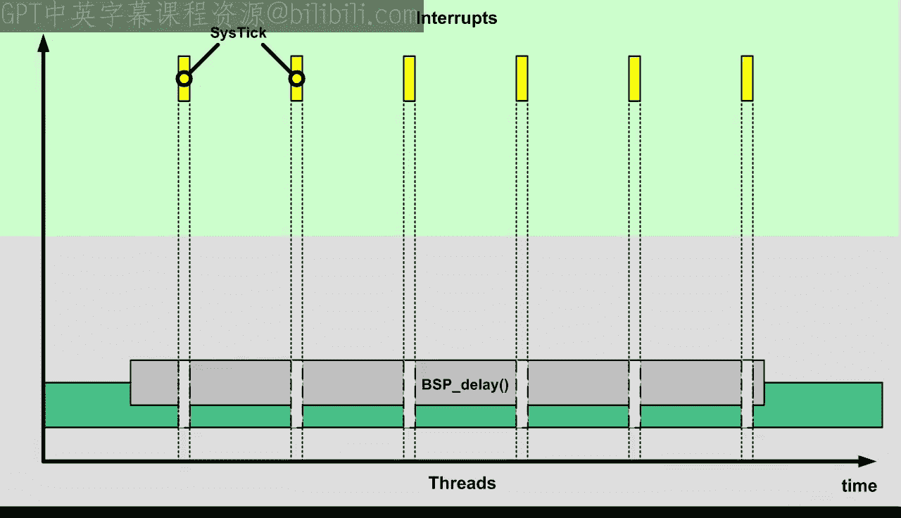

## 概述

上一节我们实现了RTOS的完全自主运行和简单的轮转调度。然而，线程内部仍然在使用轮询方式的`BSP_delay`函数。这种轮询会浪费大量CPU周期，而这些周期本可以用于其他更有用的任务。

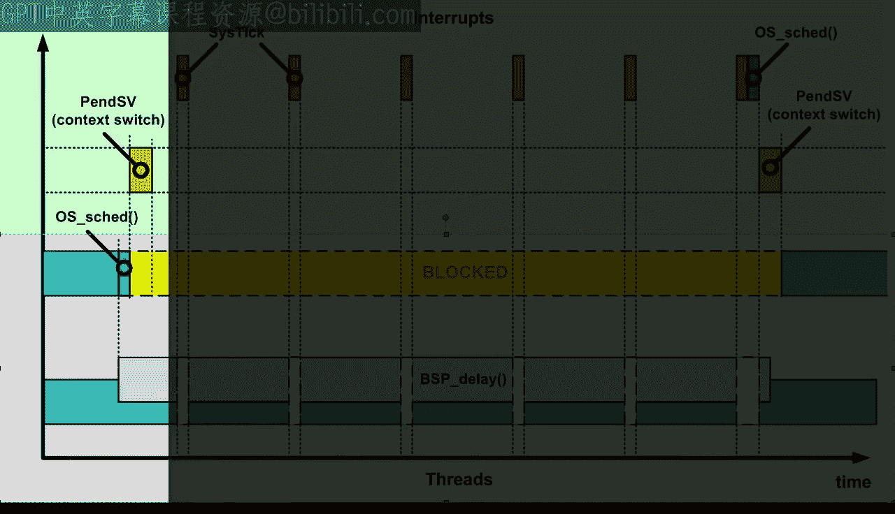

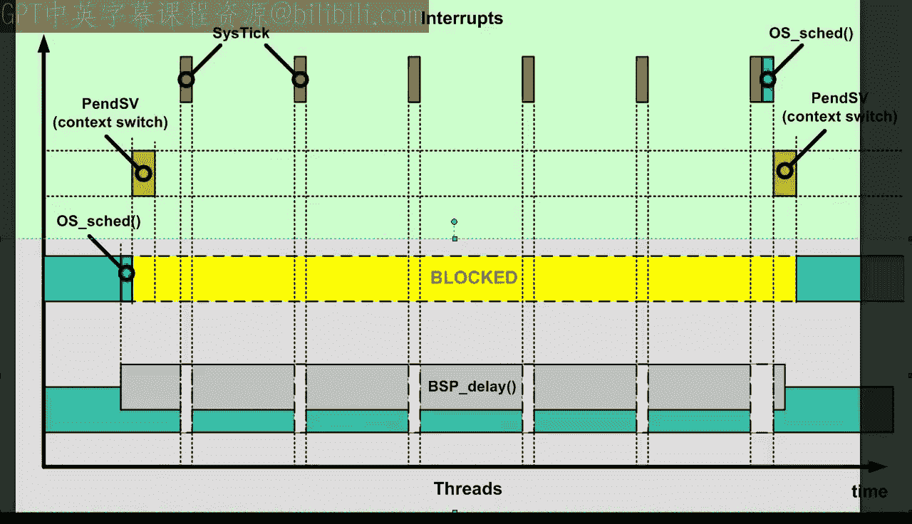

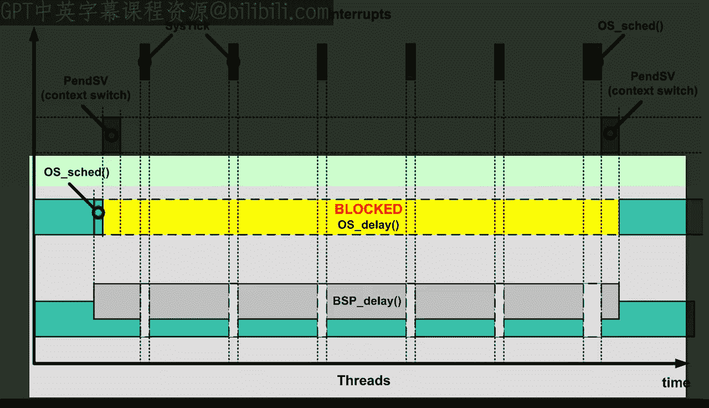

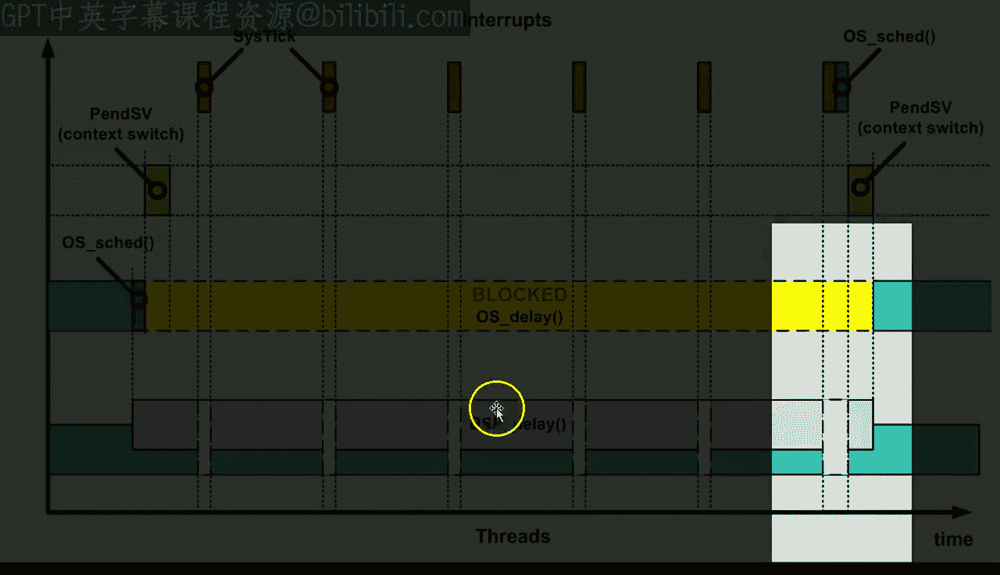

本节我们将利用上下文切换这一新工具，实现一个完全不同的延时函数。线程在调用延时函数时，会主动让出CPU，进入阻塞状态，直到延时结束才恢复运行。从线程角度看，阻塞式延时和轮询式延时没有区别；但从系统整体角度看，CPU资源得以释放给其他就绪线程，效率大大提升。

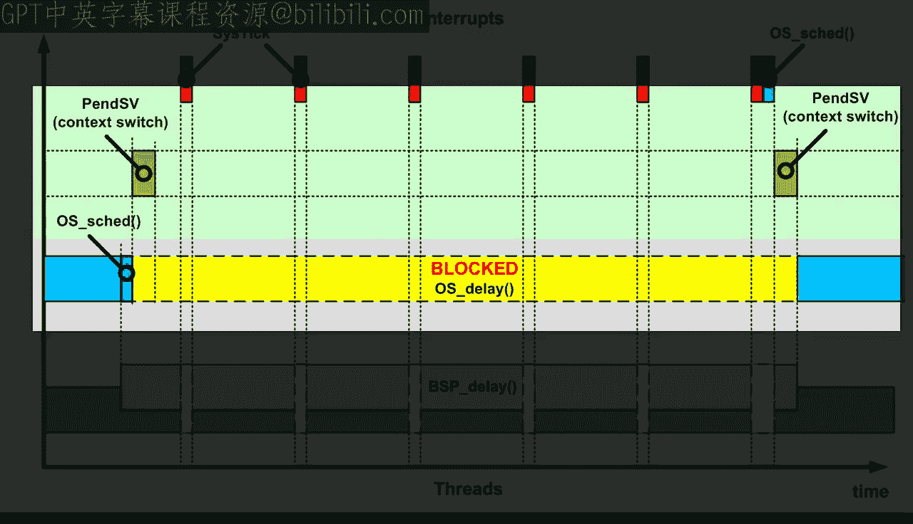

## 从轮询到阻塞

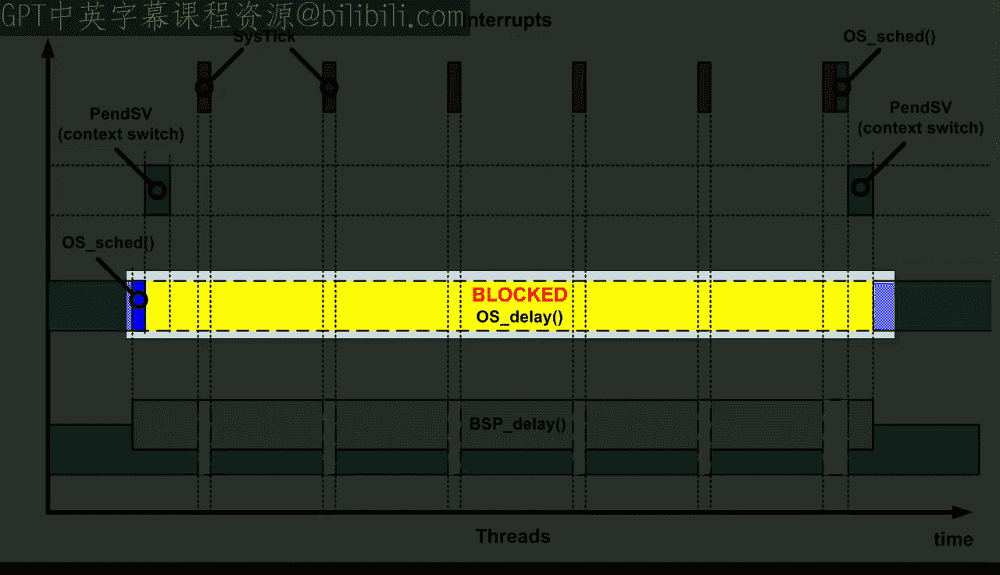

轮询式延时的核心问题是CPU在空转等待。而有了上下文切换能力后，我们可以这样设计延时函数：
1.  线程调用延时函数。
2.  函数将线程标记为“未就绪”，并立即触发调度器进行上下文切换。
3.  CPU转而执行其他就绪线程。
4.  延时时间到后（通常由系统时钟节拍中断服务程序管理），该线程被重新标记为“就绪”。
5.  调度器在后续调度中会再次选中该线程运行。

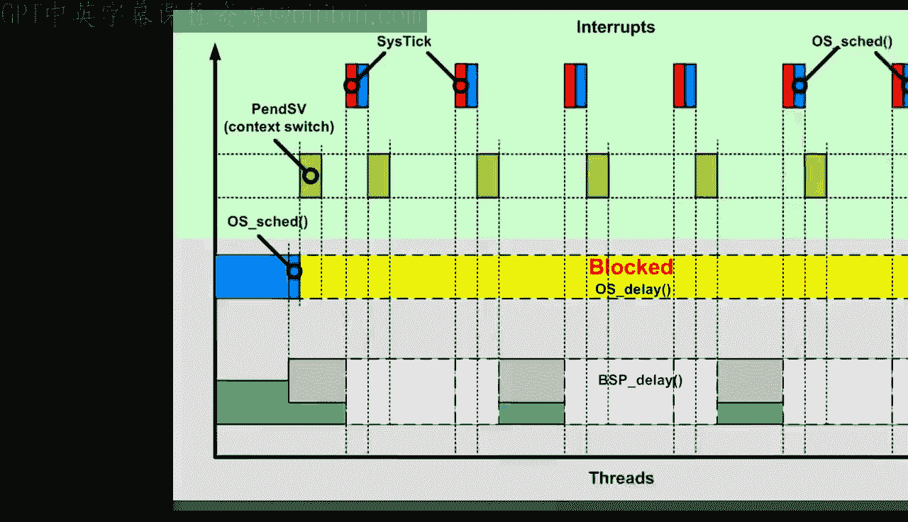

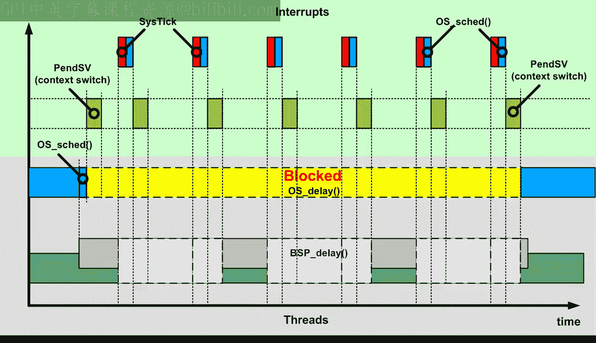

这种将功能（如延时）从应用程序迁移到系统软件层，以更高效方式处理的趋势，在后续学习更高级的软件技术时会反复遇到。

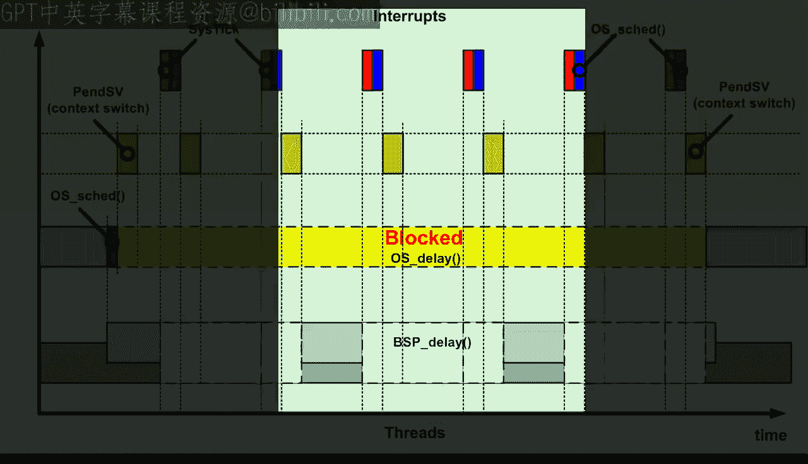

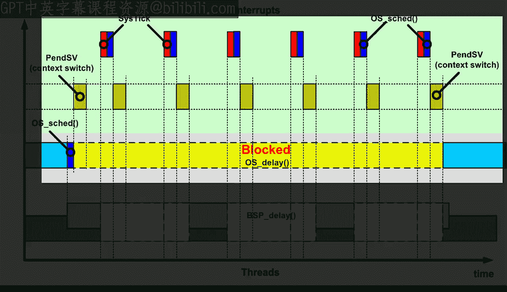

## 线程的生命周期与状态

在实现阻塞式延时前，需要理解线程的一个新属性：**就绪状态**。一个处于阻塞状态的线程**不应该**被调度执行，因为它并未准备好运行。

我们可以用状态图来可视化线程的生命周期：
*   **休眠**：线程对象和栈被创建，但尚未启动。
*   **就绪**（包含两个子状态）：
    *   **运行**：正在CPU上执行。单核系统中，同一时刻只有一个线程处于此状态。
    *   **被抢占**：曾经运行过，但被调度器切换出去，等待再次被调度。
*   **阻塞**：线程主动等待某个事件（如延时结束），在此期间不参与调度。

线程从“运行”状态调用`OS_delay()`时，会主动进入“阻塞”状态。而从“阻塞”状态恢复“就绪”，则需要系统中心服务（`OS_tick()`）来管理，因为阻塞的线程自身无法行动。

## 空闲线程的必要性

线程阻塞还带来了一个有趣的推论：系统**必须**有一个特殊的、**永远就绪且不能阻塞**的线程，即**空闲线程**。

考虑一个只有两个线程（如Blinky1和Blinky2）的系统：
*   当两个线程都就绪时，调度器可以运行其一。
*   当一个线程阻塞时，调度器可以运行另一个。
*   但如果两个线程**同时**阻塞，CPU仍需运行一个线程，而现有线程却都不就绪。

空闲线程就是为解决此问题而设。当没有其他线程就绪时（即系统处于**空闲条件**），调度器就运行空闲线程。因此，空闲线程不允许调用任何可能阻塞的函数。

## 代码实现步骤

以下是实现阻塞式延时的核心步骤：

### 1. 创建空闲线程

首先，在`main.c`中创建空闲线程，其线程例程结构与其他线程类似，但只调用一个回调函数`OS_onIdle()`，以便应用程序能在其中执行一些处理（如进入低功耗模式）。

```c
// 在 main.c 中创建空闲线程
OS_thread idle_thread;
static uint32_t idle_stack[40];

void main(void) {
    // ... 硬件初始化
    OS_init(&idle_stack, sizeof(idle_stack));
    // ... 创建并启动其他应用线程
    OS_run();
}
```

空闲线程需要在`OS_init()`中启动，并将其栈空间分配交给应用程序决定。

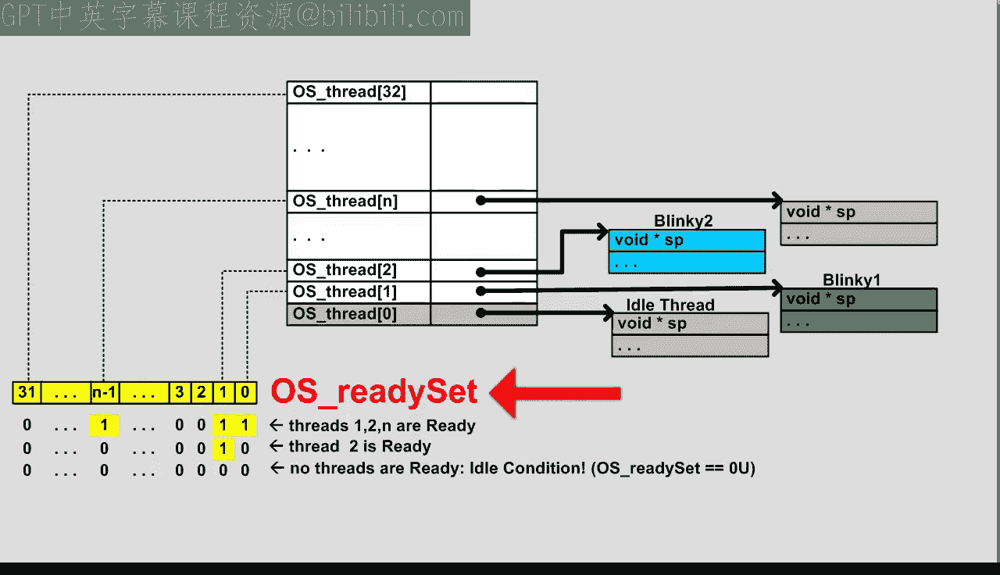

### 2. 扩展线程控制块

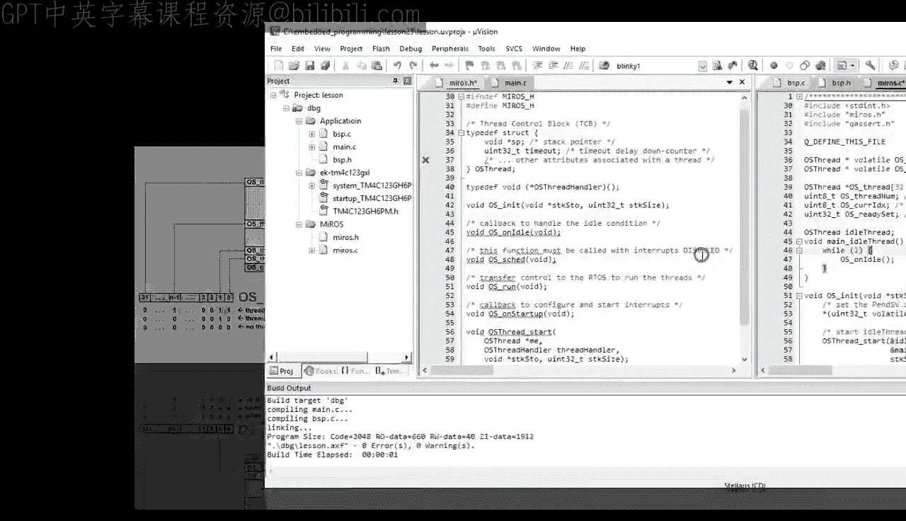

我们需要为每个线程对象（`OS_thread`）添加两个新属性：
*   **超时计数器**：用于实现延时。`OS_delay()`设置初值，`OS_tick()`每次递减，减到0时唤醒线程。
*   **就绪标志**：但为了提高效率，我们不将标志放在每个线程对象中，而是使用一个全局的**位图** `OS_readySet`。

`OS_readySet`是一个32位的位掩码，每个位对应`OS_thread`数组中的一个线程（空闲线程除外，索引0）。例如：
*   位0 对应 线程数组索引1
*   位1 对应 线程数组索引2
*   ...
*   位n-1 对应 线程数组索引n

这种设计的优势在于：
*   检查系统是否空闲（`OS_readySet == 0`）只需一条指令。
*   为后续实现基于优先级的调度奠定了基础（位号可代表优先级）。

### 3. 修改调度器算法

调度器`OS_sched()`需要避开未就绪的线程：
1.  首先检查`OS_readySet`是否为0（空闲条件）。若是，则直接选择空闲线程（索引0）。
2.  若不为0，则从当前线程索引的下一个开始，以轮转方式查找下一个**就绪**的线程。需要跳过空闲线程（索引0），并且只选择在`OS_readySet`中对应位被设置的线程。

### 4. 实现阻塞式延时函数 `OS_delay()`

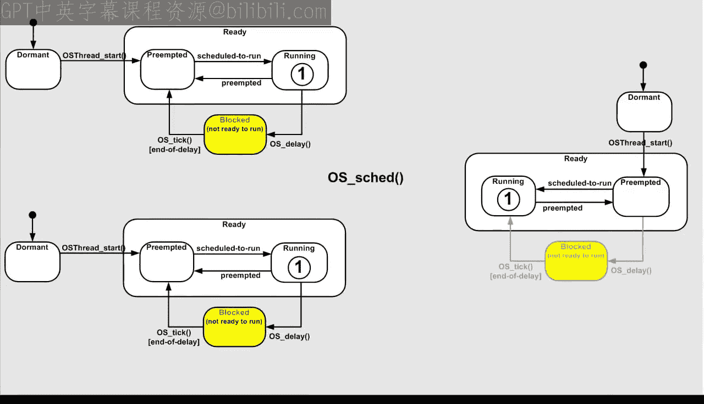

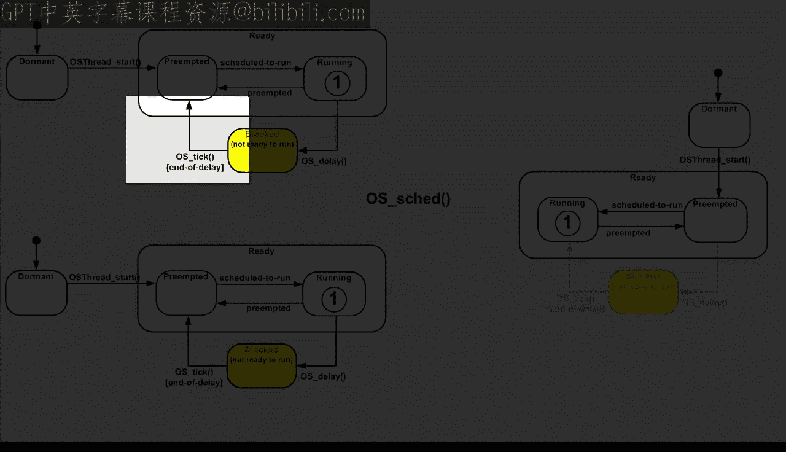

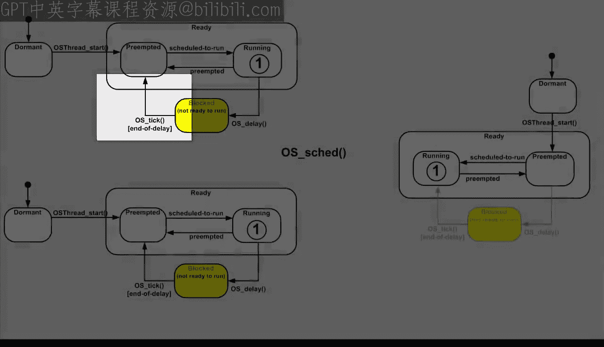

`OS_delay()`函数的签名与轮询式`BSP_delay()`相同。

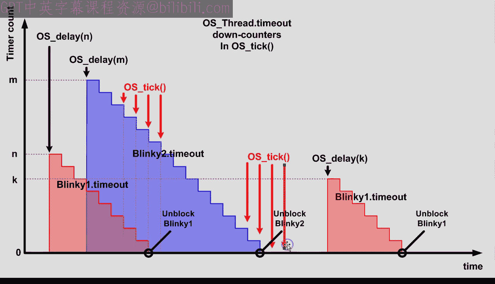

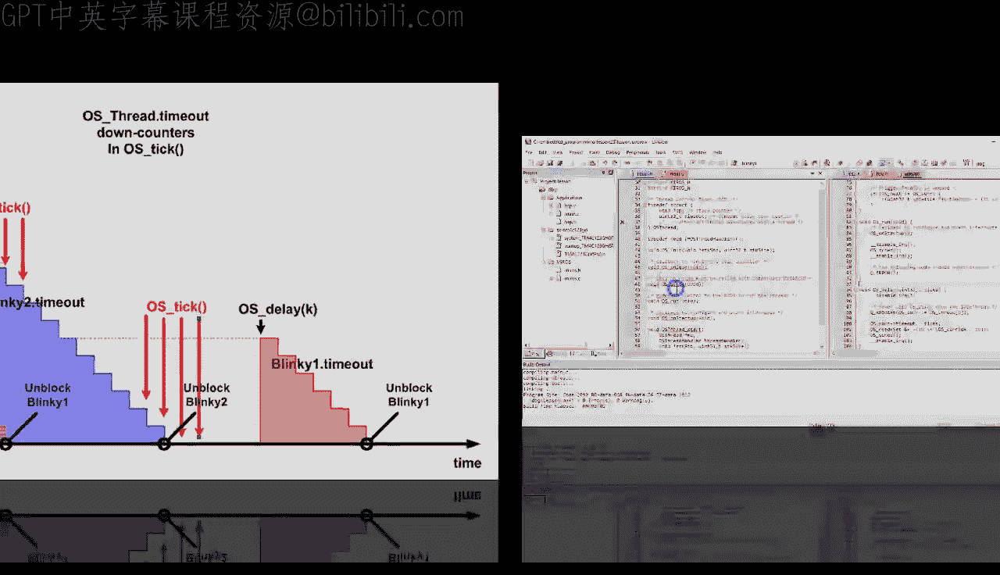

```c
void OS_delay(uint32_t ticks) {
    Q_REQUIRE(OS_curr != (uint32_t)0); // 前提条件：不能从空闲线程调用

    __disable_irq();
    // 1. 设置当前线程的超时计数器
    OS_thread *me = OS_thread[OS_curr];
    me->timeout = ticks;
    // 2. 将当前线程标记为未就绪（清除OS_readySet中对应的位）
    OS_readySet &= ~(1U << (OS_curr - 1U));
    // 3. 触发调度，立即切换上下文
    OS_sched();
    __enable_irq();
}
```

### 5. 实现系统节拍服务 `OS_tick()`

`OS_tick()`通常由系统时钟中断（如SysTick）调用，负责管理所有线程的延时。

```c
void OS_tick(void) {
    uint32_t idx;
    // 遍历所有线程（跳过空闲线程，索引0）
    for (idx = 1U; idx < OS_thread_num; ++idx) {
        OS_thread *th = OS_thread[idx];
        // 如果该线程的超时计数器不为0
        if (th->timeout != 0U) {
            --th->timeout; // 递减计数器
            // 如果计数器减到0
            if (th->timeout == 0U) {
                // 将线程标记为就绪（设置OS_readySet中对应的位）
                OS_readySet |= (1U << (idx - 1U));
            }
        }
    }
    // 注意：此处不需要调用OS_sched()，因为调度会在中断服务程序末尾自动发生
}
```

### 6. 最终调整与测试

*   确保除空闲线程外，所有线程启动时都被正确标记为就绪。
*   更新RTOS版本号。
*   在头文件中添加新函数的原型。
*   将应用程序中原来的`BSP_delay()`调用替换为`OS_delay()`，将`BSP_tick()`调用替换为`OS_tick()`。

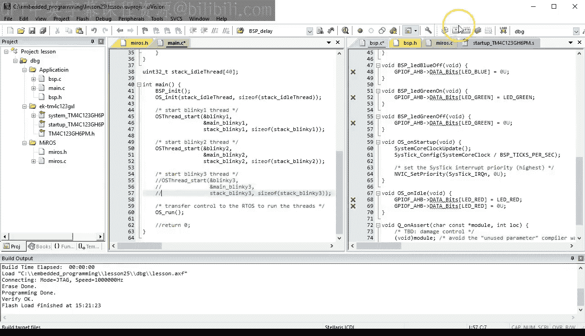

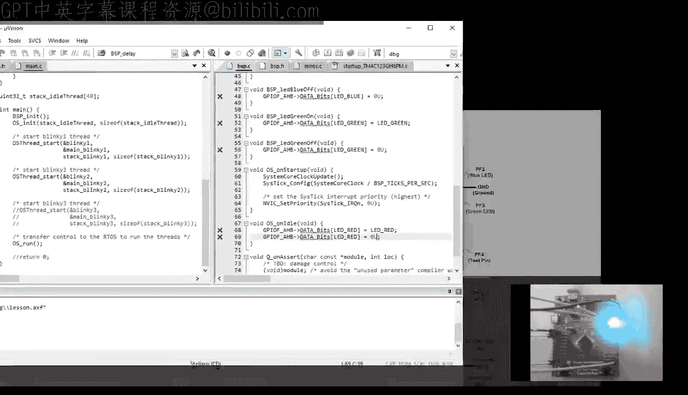

代码编译无误后，运行程序。表面上看，LED闪烁效果与之前相同。但通过调试器或逻辑分析仪观察会发现，`OS_readySet`大部分时间为0，CPU绝大多数时间都在执行空闲线程。只有当某个线程延时结束被唤醒时，才会短暂执行该线程，然后很快又回到空闲线程。

## 低功耗设计启示

空闲线程消耗了绝大部分CPU时间，这提示我们此处是实现低功耗的关键。对于电池供电的应用，可以在`OS_onIdle()`回调中让CPU进入低功耗睡眠模式。

ARM Cortex-M 微控制器提供了`WFI`（Wait For Interrupt）指令，可以停止CPU时钟直到中断发生。将其加入`OS_onIdle()`：

```c
void OS_onIdle(void) {
    __WFI(); // 等待中断，进入低功耗模式
}
```

加入此指令后，CPU在空闲时会真正停下来，仅当中断发生时才会唤醒，从而极大降低系统功耗。

## 总结

本节课中，我们一起学习了如何用高效的线程阻塞机制替代低效的轮询。我们为Miros RTOS添加了阻塞式延时功能，并深入探讨了由此引发的RTOS设计变化：

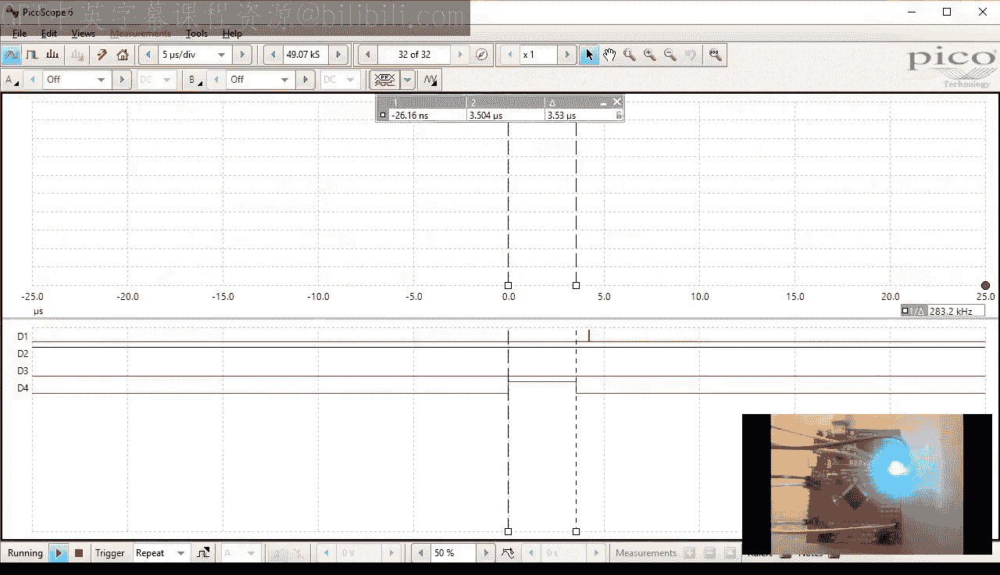

1.  **引入了线程状态**：明确了“就绪”（包含运行和被抢占）与“阻塞”状态，并绘制了线程生命周期状态图。
2.  **创建了空闲线程**：作为当所有应用线程都阻塞时，保证CPU始终有线程可执行的“最后防线”。
3.  **实现了核心机制**：
    *   使用`OS_readySet`位图高效管理线程就绪状态。
    *   修改调度器`OS_sched()`，使其能跳过未就绪线程。
    *   实现了主动阻塞的`OS_delay()`函数。
    *   实现了由系统中断驱动的`OS_tick()`服务，用于更新延时和唤醒线程。
4.  **连接到低功耗设计**：指出空闲线程是放置CPU睡眠指令、实现系统低功耗的理想位置。

至此，我们的Miros RTOS实现了一个支持阻塞功能的轮转时间片调度器，这相当于计算机系统在20世纪60年代初期的技术水平。在下一节课中，我们将把RTOS带入70年代，实现**基于优先级的抢占式调度**。