# 26：什么是“实时”？抢占式、基于优先级的调度


欢迎来到现代嵌入式系统编程课程。我是Miroslaw，在关于RTOS的第五课中，我将最终探讨“实时操作系统”名称中的“实时”方面。

具体来说，在本节课中，你将为Miros RTOS添加一个抢占式、基于优先级的调度器。该调度器在特定条件下，可以被数学证明能够满足实时截止时间的要求。

和往常一样，让我们从复制上一课（第25课）的目录并重命名为第26课开始。进入新的第26课目录，双击MicroVision项目文件以打开它。

## 概述

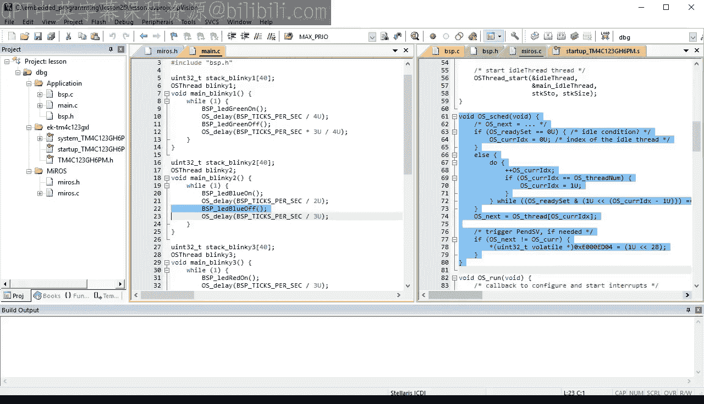

为了快速回顾，在上一课中，你为Miros RTOS添加了高效的阻塞延迟功能。然而，这个RTOS尚不名副其实，因为其轮询调度器还不是真正的实时调度器。因此，让我们从引入“实时”的概念开始今天的课程。

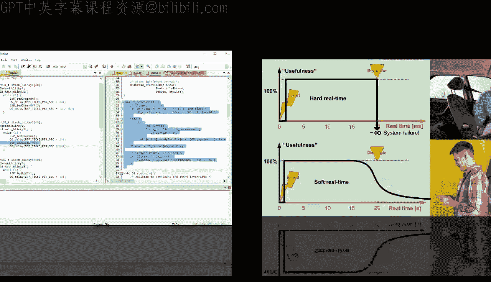

## 什么是实时？

到目前为止，在你所有的代码中，任何被执行的计算都被认为是同等有用的。你只关心计算是否正确，而不关心它是否在给定的时间内完成。实时性为计算增加了及时性的要求。

具体来说，一个执行得太晚（或太早）的计算，其有用性会降低，甚至可能像完全错误的计算一样有害。


上图以图形方式展示了计算的有用性随时间变化的函数关系。


在所谓的**硬实时系统**中，计算从触发事件开始到截止时间为止是有用的。截止时间之后，计算的有用性变为负无穷大，这意味着该计算不仅无用，甚至是有害的。错过截止时间意味着系统故障。例如，安全气囊展开得太晚不仅是无用的，更是灾难性的。

但也存在**软实时系统**，其中及时性也很重要，但截止时间不那么严格。例如，一条短信期望在20秒内送达，但即使更晚送达也仍然有用，尽管其有用性会随时间递减。在接下来的讨论中，我将专注于硬实时系统。

## 历史背景与周期性任务

从历史角度看，计算机在硬实时系统中的主流应用始于20世纪60年代和70年代。例如，阿波罗计划使用了两个相同的实时计算机，一个在指令舱，另一个在登月舱。下图是Margaret Hamilton的照片，她领导了大部分工作，旁边的代码清单堆展示了20世纪60年代和70年代初创建了多少实时软件。

在这些早期阶段，人们就意识到大多数实时系统以**周期性**方式运行，意味着触发事件和截止时间以特定周期重复。例如，在月球表面着陆航天器需要对火箭推进器进行精细调整，机载计算机必须每几毫秒执行一次。同样，工业过程需要从毫秒到数十秒不等的周期性控制。内燃机的电子控制需要与发动机转速同步的周期性控制，等等。

## 实验：观察当前RTOS的行为

为了更好地理解实时概念如何应用于周期性线程，让我们用你当前版本的Miros RTOS进行一些实验。

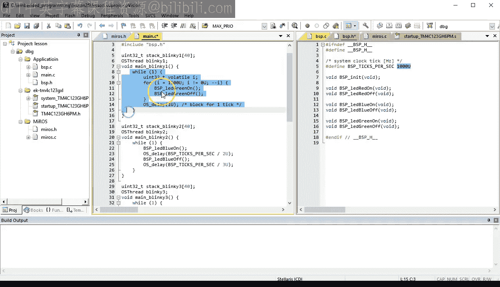

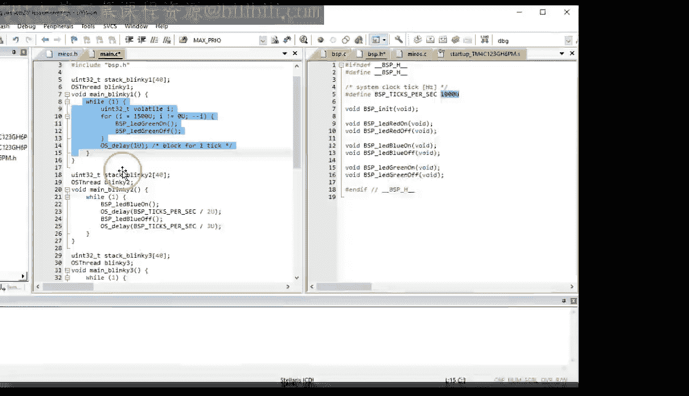

具体来说，你可以将系统时钟节拍率提高到每秒1000次，即每毫秒一个时钟节拍。接下来，你可以修改你的`Blinky1`和`Blinky2`线程，让它们给CPU施加一些计算负载，因为目前它们只是打开和关闭LED，这只需要一微秒，之后线程就会阻塞并放弃CPU。

为了模拟更真实的CPU负载，你可以在`for`循环中不是只开关一次LED，而是开关几千次。这个特定的`for`循环将执行大约1.2毫秒，这有意设计得比你的系统时钟节拍（1毫秒）稍长。在`for`循环之后，`Blinky1`线程延迟一个时钟节拍，这将阻塞直到下一个系统滴答中断。这意味着`while(1)`循环体将以2毫秒的周期重复。


现在，让我介绍文献中常用的几个符号，用于描述像你的`Blinky1`这样的周期性实时线程。

*   **线程1的计算时间**记为 **C1**，等于1.2毫秒。
*   **线程1的周期**记为 **T1**，等于2毫秒。
*   **线程1的处理器利用率**记为 **U1**，是计算时间与周期的比值。这是CPU执行线程1所花费时间的百分比，在本例中为60%。

类似地，你可以修改`Blinky2`线程，模拟一个比`Blinky1`运行时间长三倍（约3.6毫秒）的CPU负载。在`for`循环之后，`Blinky2`线程将延迟50毫秒，因此其总周期约为54毫秒。

在图表中，`Blinky2`的计算时间**C2**为3.6毫秒，其周期**T2**为54毫秒，CPU利用率**U2**为6.6%。

在构建代码之前，最后一步是注释掉`OS_onIdle`回调函数中的`__WFI()`（等待中断）指令。这将防止CPU停止，并允许你在逻辑分析仪视图中看到空闲线程中红色LED的切换。

代码构建正确，让我们将其加载到Tiva C LaunchPad开发板中，并使用逻辑分析仪观察其运行情况。

*   **标记为ISR的顶部轨迹**对应系统滴答中断处理程序，它每1毫秒重复一次。这是你每秒1000次的快速系统时钟节拍。
*   **紧挨着标记为T1的轨迹**对应`Blinky1`，大部分时间它运行约1.2毫秒，每2毫秒重复一次。
*   **标记为T2的轨迹**对应`Blinky2`。这个线程运行约3到4毫秒（不计间隔），每55毫秒重复一次。
*   **标记为Idle的底部轨迹**对应空闲线程，它只在没有其他线程或ISR运行时运行。

但逻辑分析仪视图中最有趣的部分是`Blinky1`和`Blinky2`同时解除阻塞并准备运行的时刻。

当你放大时，可以看到`Blinky1`开始运行，但在下一个时钟节拍时被调度出去，此时`Blinky2`被调度运行。`Blinky2`也只运行一个节拍，然后`Blinky1`再次被调度进来以完成处理，之后它阻塞，所以`Blinky2`运行剩余的时间片。在随后的时钟节拍，`Blinky1`再次准备运行，但请注意，这是自上次激活以来的第三个节拍，这意味着`Blinky1`错过其2毫秒的截止时间一个节拍。

## 轮询调度器的问题

这种情况发生是因为Miros RTOS中当前的调度器仍然是**轮询调度器**。这种调度器是为分时系统设计的，其最重要的目标是在所有线程之间公平地共享CPU。因此，调度器在`Blinky1`耗尽时间片后夺走CPU，但这在硬实时系统中并不是你想要的。

例如，假设`Blinky1`代表一个控制登月舱在月球表面下降的重要线程。它必须每2毫秒运行一次，错过任何一个截止时间都可能导致灾难性的系统故障。在这种情况下，你不在乎CPU分配的公平性，你在乎的是满足2毫秒的硬实时截止时间。

为此，你需要一个不同的调度器，它能够以某种方式了解线程的重要性，以便在执行较低重要性的线程之前执行较高重要性的线程。

## 引入基于优先级的抢占式调度器

今天，你将实现这种实时调度器的最简单版本，称为**具有静态优先级的、基于优先级的抢占式调度器**。这意味着每个线程在启动时将被分配一个唯一的优先级号，并且此后该优先级不会改变。调度器的工作是始终运行准备就绪的最高优先级线程。

让我们在时序图中看看你的`Blinky`线程在这种基于优先级的调度器下将如何执行，以及时序与当前的轮询调度器有何不同。

只要线程T1是唯一准备就绪的线程（因为T2在`OS_delay`函数内阻塞），两种调度器下的执行是相同的。但是，一旦T2准备就绪运行，轮询调度器就会挂起T1并调度T2。此时，T1就失去了满足2毫秒截止时间的机会。

相比之下，基于优先级的调度器也看到T2准备就绪，但T1具有更高的优先级，因此调度器选择运行T1。因此，T1继续运行并轻松满足其2毫秒的截止时间。

T2线程只有在T1在`OS_delay`函数中自愿阻塞后才被调度，但一旦T1再次解除阻塞，调度器会立即切换回T1，因为它的优先级高于T2。只要T2最终也阻塞，这种情况就会重复。

但有趣的是，请注意，即使T2被T1的持续中断显著延迟，它最终也能完成并在其54毫秒的截止时间之前阻塞。这意味着基于优先级的调度器以这样一种方式执行T1和T2，使它们都能满足硬实时截止时间。

## 在Miros RTOS中实现基于优先级的调度器

现在，让我们在Miros RTOS中实际实现基于优先级的调度器。

首先，需要增加版本号，并将线程优先级添加到线程控制块（TCB）以及`OS_thread_start`函数中。优先级号将是一个小整数，范围从0到支持的线程数（在Miros RTOS中是32），因此它可以舒适地放入一个`uint8_t`类型。

在RTOS的实现中，你还需要增加版本号，并向`OS_thread_start`函数添加优先级参数。在这里，你还需要重新设计`OS_thread[]`数组的使用方式。

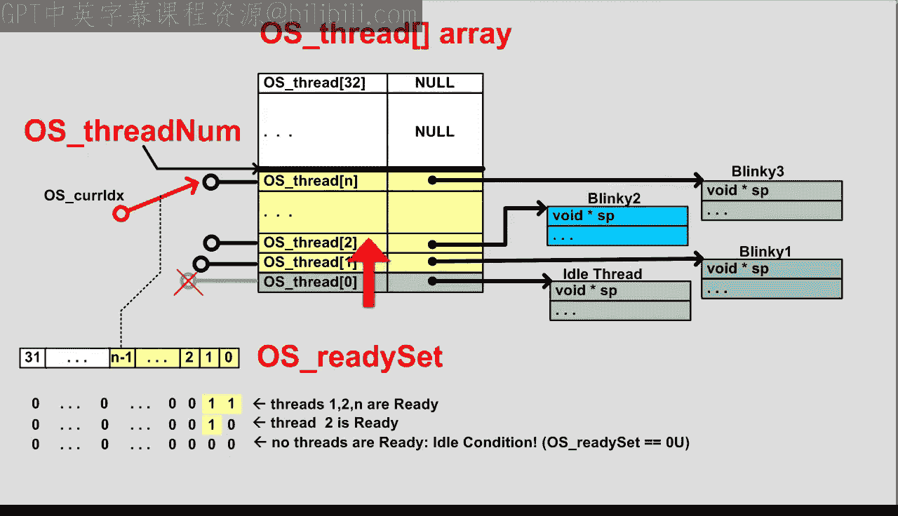

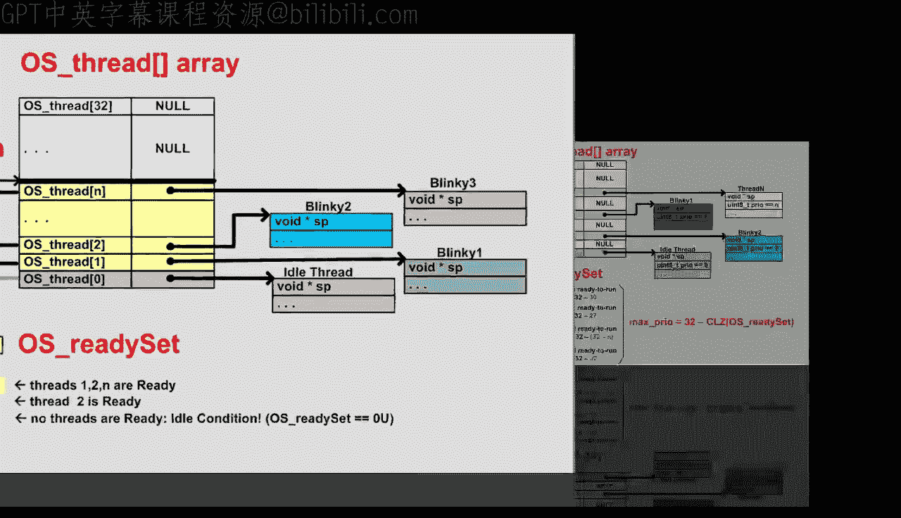

你可能还记得第25课，`OS_thread[]`数组保存了所有已启动线程对象的指针。在轮询调度器中，数组从索引0（保留给空闲线程）开始连续填充，直到索引`OS_threadNum`。


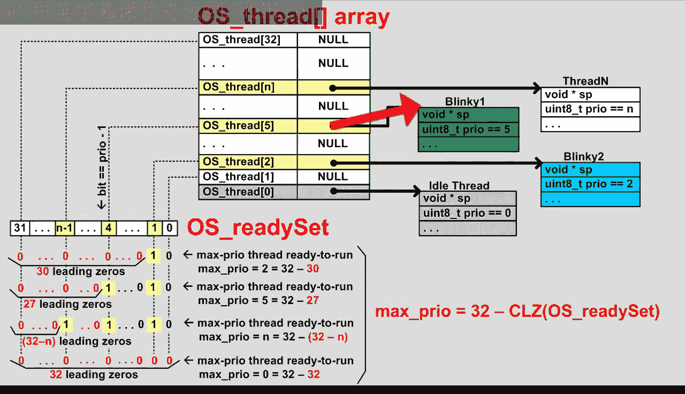

对于基于优先级的调度器，不同之处在于，`OS_thread[]`数组的索引将是线程的优先级，并且这些优先级不需要是连续的，意味着`OS_thread[]`数组中可能存在间隙。例如，下图显示了优先级0的空闲线程、优先级2的`Blinky2`、优先级5的`Blinky1`和优先级N的线程N。

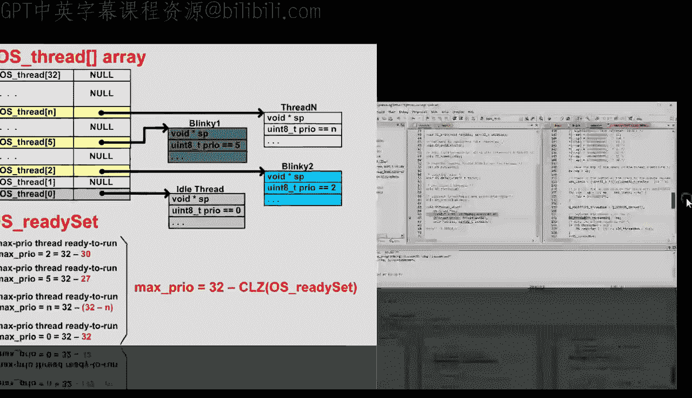


这意味着你将用作为函数参数传递的优先级号替换`OS_threadNum`索引。


同时，你需要将用户指定的优先级保存到线程控制块中。然而，为了避免`OS_thread[]`数组被过度预订，你现在必须确保优先级不仅范围正确，而且尚未被使用，即`OS_thread[priority]`索引处的指针仍然是0。

你可以将此断言移到函数顶部，并将其作为使用上一课介绍的`Q_REQUIRE`宏编码的**前置条件**。前置条件意味着它必须由函数的调用者满足，而不是由函数本身满足。例如，为每个线程分配唯一优先级是应用程序程序员的工作。

## 重新设计就绪集和调度逻辑

现在，让我们思考一下`OS_readySet`位掩码的使用。

对于基于优先级的调度，最有趣的信息是基于位掩码的当前值，找到准备就绪的最高优先级线程。此时，你需要决定你偏好的优先级编号方案。

出于历史原因，你可能会遇到的许多RTOS（如Nucleus、ThreadX、MicroC/OS、embOS等）使用**反向优先级编号方案**，其中优先级0对应最高优先级线程，更高的优先级编号对应更低优先级的线程。不用说，反向优先级编号方案在讨论更高和更低线程优先级时会导致持续的混淆。

当然，也可以使用简单的**直接优先级编号方案**，其中优先级0对应空闲线程，更高的优先级编号对应更高优先级的线程。Miros RTOS将使用这种简单的直接优先级编号约定。

找到准备就绪的最高优先级线程的优先级号的基本原理是：计算`OS_readySet`位掩码中直到第一个1位的前导零的数量，并从总位数（32）中减去它。

例如，如果`Blinky2`线程是唯一准备就绪的线程，`OS_readySet`位掩码将只有第1位为1，其余为0。在这种情况下，前导零的计数是30，通过从总位数32中减去它，可以转换为优先级号2。如果优先级为5的`Blinky1`线程准备就绪，`OS_readySet`位掩码将有27个前导零直到第一个1位，通过从32中减去它，转换为优先级号5。

一般情况下，对于优先级为n的准备就绪线程，前导零的计数将是32-n，因此优先级号再次计算为32减去`OS_readySet`位掩码中的前导零计数。该公式甚至适用于系统的空闲条件，即`OS_readySet`位掩码中的所有32位都为0，这导致优先级为0，即空闲线程的优先级。

从数学上讲，公式 **`32 - clz(x)`**（用于查找数字x中最高有效1位）是**log₂(x)**函数的整数近似，这就是为什么我将在Miros RTOS的C实现文件中将其编码为`LOG2`宏。当然，该算法的速度仅与计数前导零操作一样快，但事实证明，你的ARM Cortex-M4处理器在硬件中通过`CLZ`指令支持它。你实际上可以在Tiva C微控制器的数据手册中找到这条指令。

为了利用`CLZ`指令，你可以在编译器帮助中搜索`CLZ`。正如你所看到的，这个特定的编译器通过内部函数`__clz`支持它。

有了非常高效的`LOG2`操作，你现在可以实现基于优先级的调度器。和以前一样，当调度器检测到系统空闲条件时，它需要选择空闲线程。但现在你不再使用`OS_curIdx`变量，所以你直接设置`OS_next = OS_thread[0]`，即空闲线程。

否则，如果有一些线程准备就绪，你使用带有`OS_readySet`参数的`LOG2`宏来找到准备就绪的最高优先级线程。请注意，`LOG2`宏保证产生一个介于0到32（含）之间的数字，因此可以直接用作`OS_thread[]`数组的索引，而无需进行范围检查。

此时，最好也断言`OS_next`指针不为0。

## 修改系统滴答和延迟服务

最后的更改是重新设计`OS_tick`和`OS_delay`服务。这是必要的，因为这两个实现目前都假设`OS_thread[]`数组是连续填充到`OS_threadNum`级别的，但情况已不再如此。

在`OS_tick`中，与其遍历整个`OS_thread[]`数组（可能存在大量未使用的优先级间隙），不如利用快速的`LOG2`操作。具体来说，你可以引入一个**延迟线程位掩码**（`OS_delaySet`），它类似于`OS_readySet`，但保存的是延迟的线程。在编辑时，你可能还需要移除不再需要的变量`OS_curIdx`和`OS_threadNum`。

有了`OS_delaySet`位掩码，`OS_tick`函数将只迭代位掩码中的1位，而不是扫描所有位。但是，因为你需要从位掩码中移除已处理的位，所以你需要使用一个临时的位掩码工作集。只要工作集中有一些位被设置（意味着一些线程被延迟并需要在此刻处理），你就循环。

你首先使用快速的`LOG2`宏快速获取工作集中最高阶1位的编号，并用它索引到`OS_thread[]`数组。将获得的指针保存在临时变量`t`中。然后断言`t`指针不为0（意味着线程正在使用），并且该线程的超时不为0（因为它必须是一个延迟线程）。

接下来，你递减此线程的超时计数器，如果它变为零，则通过设置`OS_readySet`位掩码中相应的优先级位，使线程准备就绪运行。同时，你从`OS_delaySet`位掩码中移除相同的位，因为此线程不再延迟。最后，你总是从工作集中移除相同的优先级位，因为它现在已被处理。

为了避免明显的代码重复，你可以像这样引入一个临时变量`bit`：
```c
uint32_t bit = (1U << p); // p 是优先级
```

在`OS_delay`函数中，你需要用当前线程的优先级号替换`OS_curIdx`变量。除了从就绪集中移除优先级位之外，该函数现在还需要将相同的位添加到`OS_delaySet`中，因为此线程现在正在变为延迟状态。

最后，为了避免代码重复，你可以像之前在`OS_tick`中那样引入一个临时变量`bit`。

## 测试基于优先级的调度器

基于优先级的调度器实现现已准备就绪，让我们尝试构建代码。项目编译失败，因为`OS_thread_start`函数的签名已更改。使用基于优先级的调度器，你启动的每个线程都需要一个唯一的优先级才能运行。

为了与之前使用的图表保持一致，让我们为`Blinky1`分配优先级5，为`Blinky2`分配优先级2。正如你所看到的，优先级不需要是连续的。真正重要的是它们是唯一的，并且`Blinky1`的优先级高于`Blinky2`的优先级。

还有一个编译错误。你需要在启动空闲线程时显式添加优先级0。

代码构建干净，让我们看看它是如何工作的。首先，我相信你很好奇`LOG2`宏生成的代码。因此，让我们在`OS_sched`函数中使用该宏的地方设置一个断点。

正如你所看到的，这段汇编代码首先加载`OS_thread[]`数组和`OS_readySet`位掩码的地址，然后仅用两条指令就完成了最高优先级就绪线程的计算。`CLZ`指令在一个CPU周期内计算位掩码中前导零的数量并将其存储在R0中。类似地，`RSB`（反向减法）指令在一个CPU周期内将结果转换为优先级号并存储在R0中。在这种情况下，得到的优先级结果是5，你应该认出这是`Blinky1`的优先级。确实，`OS_next`变量被设置为`Blinky1`线程的地址。

当你最终自由运行代码时，可以观察板上LED的一些活动。但要真正看到你新的基于优先级的调度器如何工作，你需要使用逻辑分析仪。

正如你所看到的，`Blinky1`线程现在完全不受干扰地运行，即使`Blinky2`准备就绪运行。`Blinky1`总是满足其截止时间。`Blinky2`也是如此，尽管它被`Blinky1`抢占了几次。最后，空闲线程也会运行，但仅当没有其他线程或中断处于活动状态时。

很高兴注意到，这个分析轨迹与你之前设计并随后在Miros RTOS中实现的基于优先级的调度器的时序图完全匹配。

## 阻塞的重要性

此时，我想指出**阻塞对于基于优先级的调度器的绝对关键重要性**。一个高优先级线程可以运行任意长的时间，没有较低优先级的线程可以运行，直到高优先级线程阻塞并自愿放弃CPU。没有阻塞，较低优先级的线程将永远不会运行。例如，`Blinky2`和空闲线程只有在`Blinky1`阻塞时才运行；同样，空闲线程只有在`Blinky1`和`Blinky2`都阻塞时才运行。

这与轮询调度器非常不同，轮询调度器会依次执行每个`Blinky`线程，即使它们根本没有阻塞。所以现在你明白为什么我必须在上一课（第25课）中实现高效的线程阻塞，然后才能在本课中引入实时基于优先级的调度。

## 优先级分配与速率单调分析

随着代码按预期工作，让我们现在关注在使用基于优先级的调度器时面临的最重要决策：如何为线程分配优先级。

对于像`Blinky1`和`Blinky2`这样的两个线程，你只有两种可能性：`Blinky1`的优先级高于`Blinky2`，或者`Blinky1`的优先级低于`Blinky2`。正如你刚才看到的，第一种选择满足两个实时截止时间。另一方面，很容易看出，将`Blinky1`的优先级分配得低于`Blinky2`的第二种可能性，会导致`Blinky2`一准备就绪运行，`Blinky1`就错过其截止时间。

因此，这里出现的规则是：**为周期较短（也意味着截止时间较短）的线程分配较高的优先级**。

事实证明，这条规则早在20世纪70年代就被发现了。具体来说，在1973年，C.L. Liu和James W. Layland发表了一篇开创性论文，题为《多道程序硬实时环境中的调度算法》。我在视频描述中提供了这篇文章的网络链接。

但基本上，Liu和Layland在这篇文章中描述道，你刚刚实现的简单静态优先级调度器，在特定条件下，可以被数学证明满足所有线程的所有硬实时截止时间。该方法后来被推广并称为**速率单调分析**或**速率单调调度**，并在另一篇文章《实时系统的速率单调分析》中得到了很好的解释，我也在视频描述中提供了其网络链接。

我在这里提到它，是因为任何关于基于优先级的调度器的讨论，如果不提及RMA/RMS方法，都是不完整的。

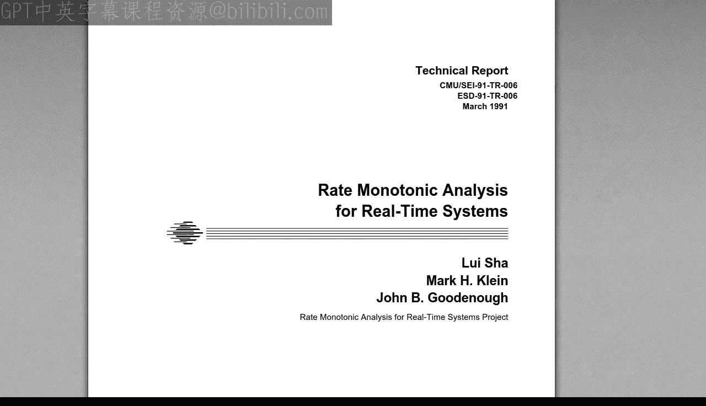

术语“速率单调”源于将优先级分配给一组线程的方法，即作为周期性线程速率的单调函数。

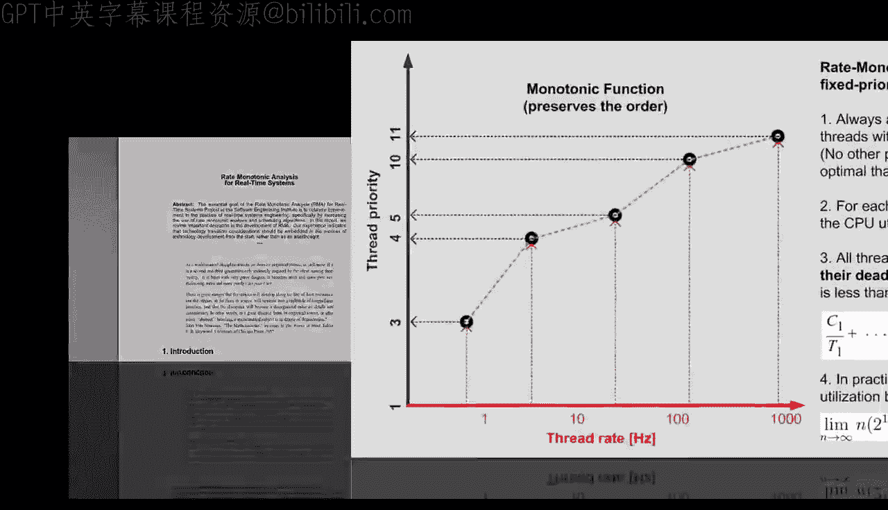

在数学中，当一个函数保持或反转两个有序集合之间的顺序时，它被称为单调的。具体来说，RMA指的是将线程速率的递增顺序映射到线程优先级的递增顺序的优先级分配。因此，它只是你自己发现的简单规则的一个花哨名称。


但RMA当然不止于此，完整的讨论确实超出了这节简短课程的范围。对于今天，让我只总结RM/RMS方法最重要的指导原则。

1.  **始终单调地分配线程优先级**，意味着具有较高速率的线程必须以比具有较低速率的线程更高的优先级运行。
2.  你需要知道每个线程的CPU利用率，你将其计算为测量的执行时间**Cₙ**与线程周期**Tₙ**的比值。
3.  你需要计算总CPU利用率，即所有单个CPU利用率因子的总和。

如果这个总利用率低于理论界限，则保证集合中的所有线程都能满足其截止时间。这早在1973年Liu和Layland的论文中就已经被数学证明了。

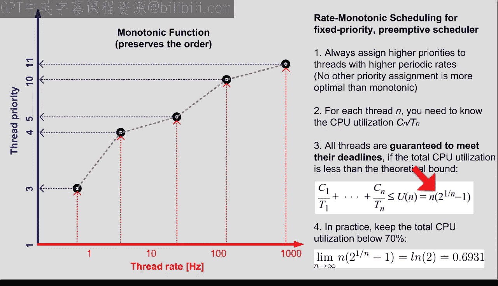

利用率界限**U(n)**取决于线程数**n**。对于大量线程，**U(n)**趋近于**ln(2)**，即略低于0.7。因此，在实践中，如果你将CPU利用率保持在70%以下，你的线程集将是可调度的，意味着它们都将满足线程截止时间。

例如，你的`Blinky1`和`Blinky2`线程的总CPU利用率如下：`Blinky1`为1.2毫秒/2毫秒，`Blinky2`为3.6毫秒/54毫秒。因此，总CPU利用率为0.66，低于理论界限。


当然，基本的RMA假设周期性线程以恒定时间执行，但该方法可以扩展到具有可变执行时间的非周期性线程。在这种情况下，你需要考虑最坏情况，即线程激活之间的最短时间和最长的执行时间。

此外，在实践中，通常只有少数最高优先级的线程具有硬实时截止时间，而其他线程只有软实时要求。在这种情况下，你对硬实时线程使用RMA，并将所有软实时线程的优先级设置得更低。

## 抢占式优先级调度的优势

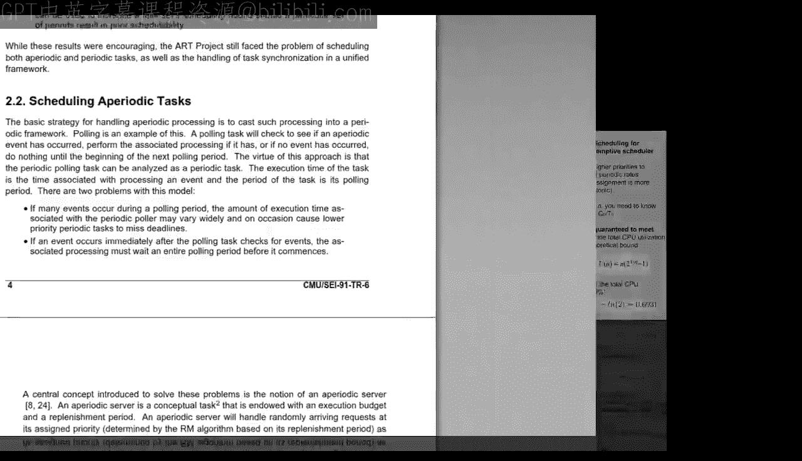

抢占式、基于优先级的调度的美妙之处在于，高优先级线程总是可以立即抢占所有较低优先级的线程，因此高优先级线程对较低优先级线程的执行时间或周期的变化不敏感。换句话说，抢占式、基于优先级的调度器在时间域上解耦了线程。


由于所有这些原因，抢占式、基于优先级的调度器成为规范，并且在大多数实时操作系统中得到支持，直至今日。

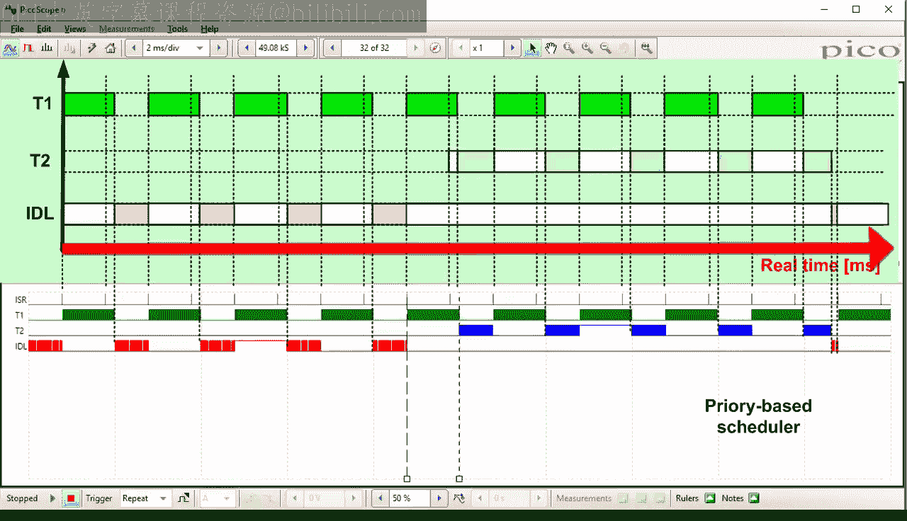


## 总结

本节课关于实时计算和基于优先级的调度的内容到此结束。在下一课中，你将再前进十年，从20世纪70年代到80年代，那时商业RTOS成为主流，并添加了线程间同步和通信机制。

如果你喜欢这个频道，请订阅以保持关注。你也可以访问 statemachine.com/quickstart 获取课堂笔记和项目文件下载。