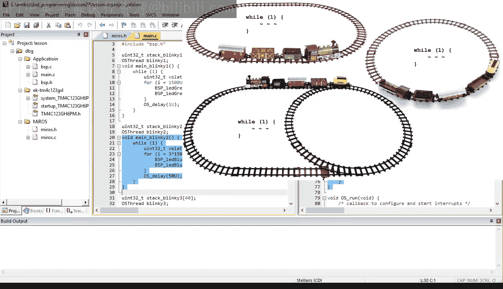
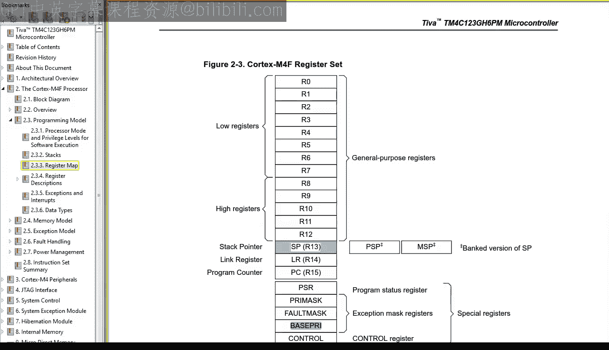
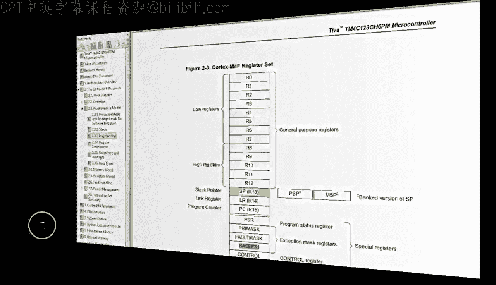
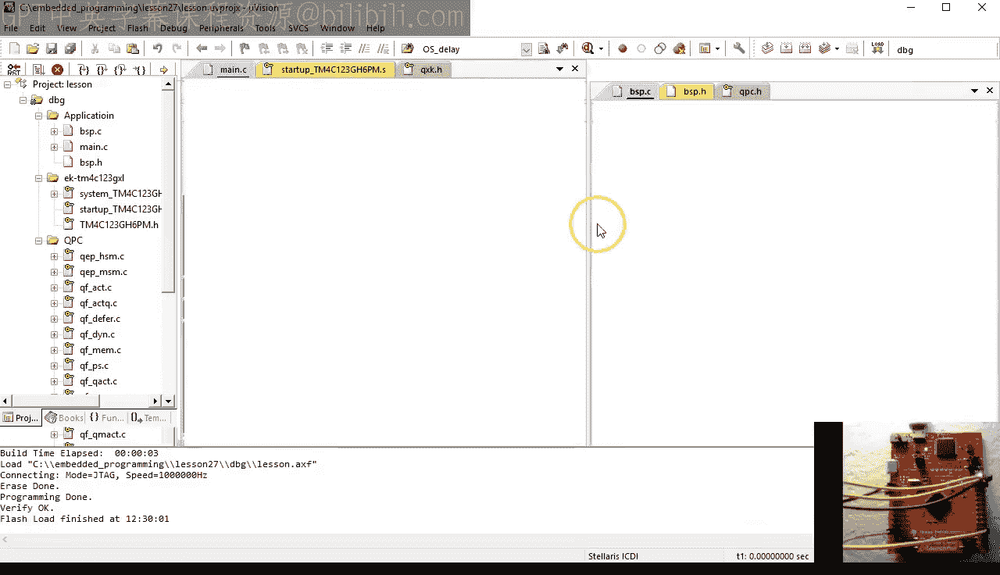
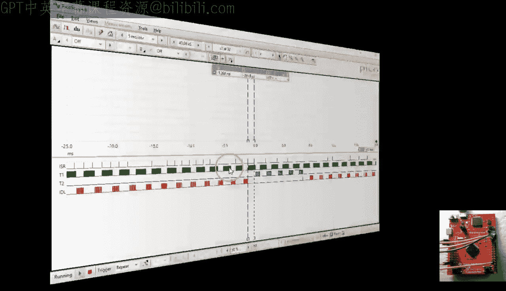

# 27：RTOS 第6部分 - 同步与通信





在本节课中，我们将学习实时操作系统（RTOS）中用于并发线程间同步与通信的核心机制。我们将从自制的“Miro RTOS”迁移到专业的“QXK RTOS”，并重点学习信号量（Semaphore）的工作原理与实践应用。

## 概述

上一节我们实现了基于优先级的抢占式调度器。然而，我们的线程目前仍像在独立轨道上运行的火车，彼此间没有交互。在实际系统中，线程的“轨道”会交叉，这就需要同步与通信机制来协调工作并避免冲突。本节课，我们将引入软件信号量这一经典同步机制，并完成从自制RTOS到专业RTOS（QXK）的迁移。

## 从 Miro RTOS 迁移到 QXK RTOS

实现信号量等线程间通信机制非常复杂且容易出错。因此，我们将放弃在自制RTOS上实现，转而使用QPC框架中包含的专业级QXK RTOS。这个过程称为“移植”。

以下是移植应用程序的主要步骤：

1.  **移除旧RTOS文件**：从项目中删除 `MiroS.h` 和 `MiroS.c` 文件，并将项目组重命名为“QPC”。
2.  **添加QPC源码**：将QPC框架的源文件添加到项目中。这包括：
    *   `QP/source/qf` 目录下的文件（用于事件驱动编程和状态机）。
    *   `QP/source/qxk` 目录下的文件（用于QXK抢占式内核）。
    *   针对ARM Cortex-M和Keil工具链的移植文件（位于 `QP/ports/arm-cm/qv/keil` 目录下的 `qxk_port.c`）。
3.  **调整应用程序代码**：修改应用程序代码以适配QXK的API。主要改动包括：
    *   包含头文件：将 `#include “MiroS.h”` 替换为 `#include “qpc.h”`。
    *   更新数据类型：将 `OS_thread` 替换为 `QXThread`。
    *   更新函数名：将 `OS_delay()` 替换为 `QXThread_delay()`，将 `OS_init()` 替换为 `QF_init()`，将 `OS_run()` 替换为 `QF_run()`。
    *   调整线程启动方式：使用 `QXThread_ctor()` 构造函数初始化线程对象，然后使用 `QXTHREAD_START()` 宏启动线程。
    *   修改线程函数签名：线程函数需要增加一个参数（通常命名为 `me`），用于访问关联的线程对象。
4.  **更新板级支持包（BSP）**：在 `bsp.c` 中，将调度器调用替换为QXK的宏 `QXK_ISR_EXIT()`，并将系统节拍服务调用替换为 `QF_TICK_X()`。
5.  **实现QXK回调函数**：定义 `QF_onStartup()` 和 `QF_onIdle()` 等回调函数，以替换Miro RTOS中的对应函数。特别注意在 `QF_onStartup()` 中正确设置系统节拍中断（SysTick）的优先级，使其成为“内核感知中断”。

完成上述步骤后，应用程序应能成功编译并运行，其行为与之前使用Miro RTOS时完全一致。





## 理解信号量

信号量是用于线程间同步的基础机制。其概念源于铁路信号灯：当信号灯关闭（红色）时，火车必须等待；当信号灯打开（绿色）时，火车可以通过。





在软件中，信号量是一个计数器，它跟踪“信号”发生的次数。线程可以“等待”（`wait`）信号量（尝试减少计数器），也可以“发送信号”（`signal`）给信号量（增加计数器）。如果线程等待时计数器为零，则该线程会被阻塞，直到有其他线程发送信号。

QXK中的二进制信号量（最大计数为1）常用于简单的线程间信号传递。

## 实践：使用信号量同步按钮与LED

我们将修改 `Blinky2` 线程，使其不再基于固定延时闪烁蓝色LED，而是等待开发板上的 `SW1` 按钮被按下后才开始闪烁。

以下是实现步骤：

1.  **定义并初始化信号量**：在 `main.c` 中定义一个 `QXSemaphore` 类型的信号量对象（例如 `SW1_sem`），并在 `main()` 函数开始时使用 `QXSemaphore_init()` 将其初始化为二进制信号量，初始计数为0（表示无信号）。
    ```c
    QXSemaphore SW1_sem; // 信号量对象
    int main() {
        // ... 其他初始化 ...
        QXSemaphore_init(&SW1_sem, 0U, 1U); // 初始计数0，最大计数1（二进制信号量）
        // ... 启动线程 ...
    }
    ```
2.  **在线程中等待信号量**：在 `Blinky2` 线程函数的循环开始处，调用 `QXSemaphore_wait()` 来等待信号量。这将阻塞线程，直到信号量被发送信号。
    ```c
    void Blinky2_thread(QXThread * const me) {
        while (1) {
            QXSemaphore_wait(&SW1_sem, QXTHREAD_NO_TIMEOUT); // 无限期等待
            BSP_ledBlueOn();
            // ... 短暂延时 ...
            BSP_ledBlueOff();
        }
    }
    ```
3.  **配置按钮并设置中断**：在板级支持包（`bsp.c`）中，配置连接 `SW1` 按钮的GPIO引脚（例如 `PF4`）为输入模式，启用内部上拉电阻，并设置为下降沿触发中断。
4.  **在中断服务程序中发送信号**：为GPIOF中断编写中断服务程序（ISR）。在ISR中，确认中断源来自 `SW1` 引脚后，调用 `QXSemaphore_signal()` 来发送信号给信号量。
    ```c
    void GPIOF_IRQHandler(void) {
        QXK_ISR_ENTRY(); // 进入内核感知中断
        if ((GPIOF->RIS & SW1_PIN) != 0U) { // 检查是否是SW1引脚的中断
            GPIOF->ICR = SW1_PIN; // 清除中断标志
            QXSemaphore_signal(&SW1_sem); // 发送信号给信号量
        }
        QXK_ISR_EXIT(); // 退出中断，可能触发调度
    }
    ```
5.  **设置中断优先级**：在 `QF_onStartup()` 回调中，将GPIOF中断的优先级设置为“内核感知”级别（低于 `QF_AWARE_ISR_CMSIS_PRI`），以确保它能安全调用QXK的API（如 `QXSemaphore_signal`）。

完成这些步骤后，`Blinky2` 线程的运行将与 `SW1` 按钮的按下动作同步。每次按下按钮（实际上，每次中断），`Blinky2` 线程就会执行一次循环（闪烁一次蓝色LED）。

## 深入理解信号量行为

在实际测试中，由于机械按钮的抖动（Bounce），一次物理按压可能产生多次中断，从而导致信号量被多次“发送信号”。结合线程的抢占式调度，这会产生不同的执行序列，生动地演示了信号量“令牌”模型的工作方式：

*   **信号（`signal`）**：向信号量添加一个令牌（如果未达最大计数）。
*   **等待（`wait`）**：从信号量中取出一个令牌（如果有），否则阻塞。

按钮抖动和线程调度的不确定性，可能导致 `Blinky2` 线程执行循环的次数与中断触发次数不完全一致，这正体现了并发编程中同步机制的复杂性和重要性。对于生产环境，必须为机械开关添加去抖动（Debouncing）逻辑。

## 总结


本节课中，我们一起学习了RTOS中线程同步与通信的基础。我们成功将应用程序从自制的Miro RTOS移植到了功能更完善的QXK RTOS。我们重点探讨了**信号量**这一核心同步原语，通过一个“按钮控制LED”的实例，理解了信号量的初始化、等待（`wait`）和发送信号（`signal`）操作，并分析了在抢占式调度和真实硬件事件（如按钮抖动）下信号量的行为。这为我们理解更复杂的资源共享与互斥机制打下了基础。在下一课中，我们将探讨如何让多个线程安全地共享资源。