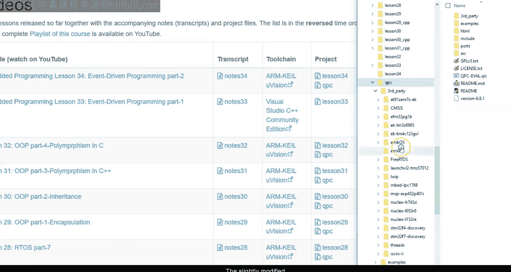
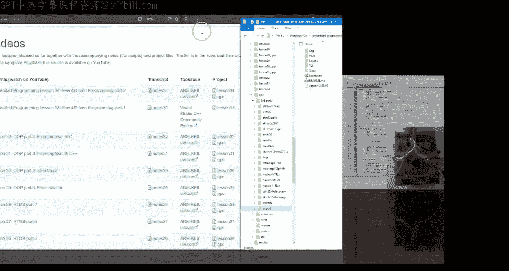
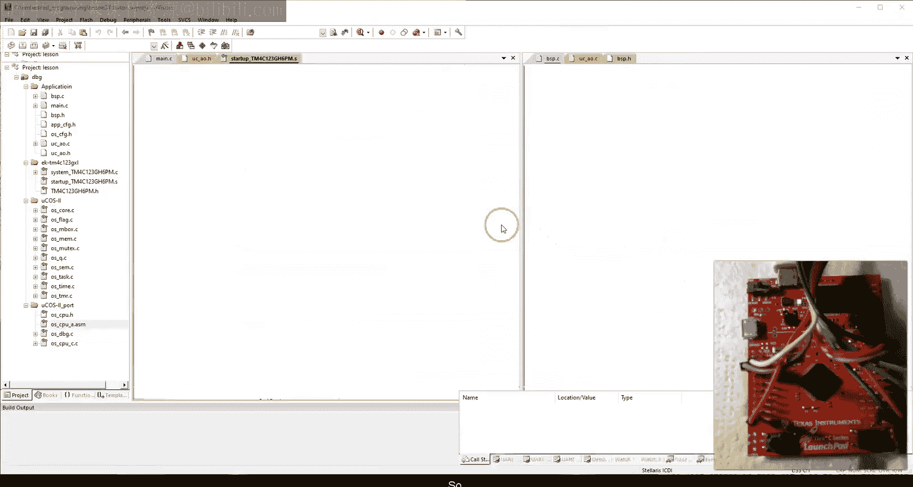
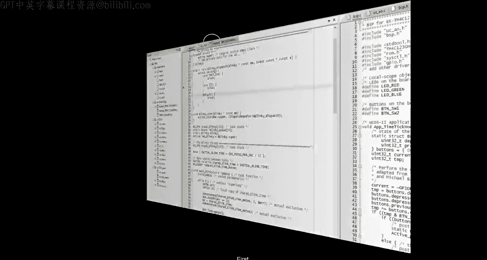
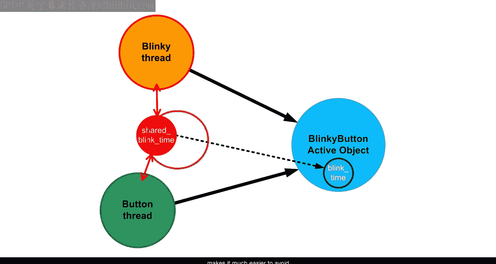
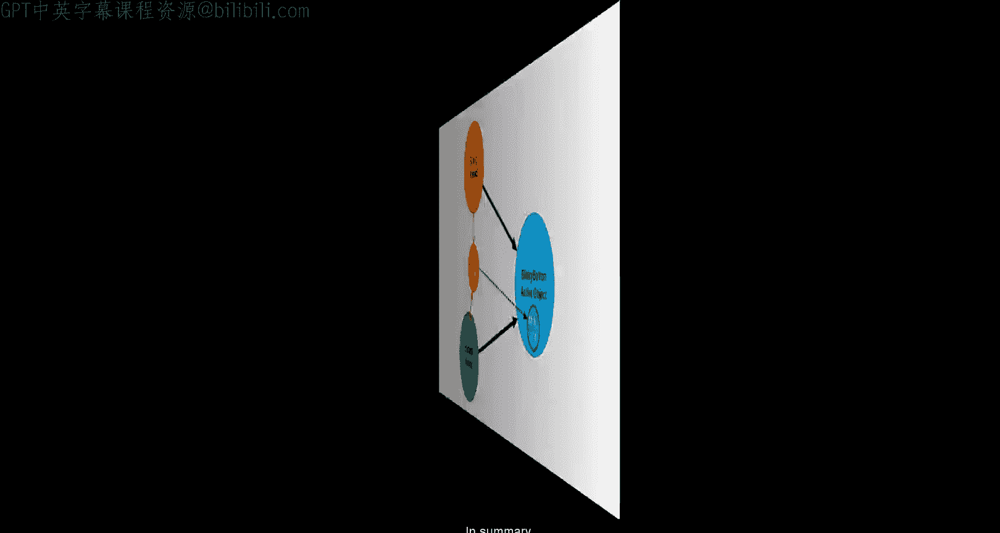
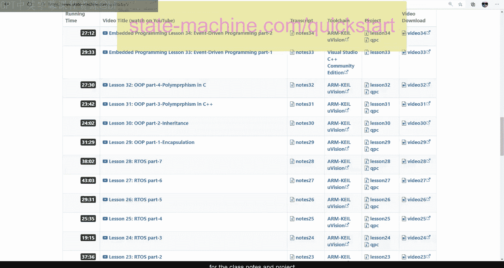

# 35：事件驱动编程第二部分 - 并发与主动对象模式


## 概述

在本节课中，我们将学习如何将事件驱动编程的概念应用于实时嵌入式系统。我们将从传统的顺序编程和实时操作系统（RTOS）出发，逐步引入事件驱动概念，并探讨它们如何帮助解决并发编程中的常见问题。核心内容包括理解主动对象设计模式，以及如何在传统RTOS之上构建一个事件驱动的框架。





---

## 从顺序编程到事件驱动

上一节我们介绍了事件驱动编程在桌面GUI环境下的基本概念。本节中，我们来看看这些概念如何应用于实时嵌入式系统。

最熟悉且仍占主导地位的嵌入式系统编程风格是基于“超级循环”和RTOS的顺序编程。在这种设计中，线程通过阻塞等待特定事件来同步其执行。然而，一个被阻塞的线程对其他未明确等待的事件没有响应。因此，为了添加对新事件的处理，通常需要创建更多线程。

但线程数量的不断增长会迅速变得昂贵且难以管理。更重要的是，新线程可能需要访问与现有线程相同的数据、外设或其他资源，这导致了线程间的资源共享。资源共享会引发竞态条件，而RTOS提供的互斥机制（如互斥锁）虽然可以防止竞态条件，但往往会导致更多的阻塞，使时序分析变得复杂，并可能导致错过实时截止时间，最终导致系统故障。

---


## 并发编程的最佳实践

有经验的软件开发人员学会对阻塞保持警惕，并应用一系列最佳实践来大幅减少软件中的阻塞。以下是C++并发专家Herb Sutter提出的三项核心最佳实践：

以下是三项核心最佳实践：

1.  **保持数据隔离**：尽可能将数据私有于线程。这意味着线程应避免与其他线程共享数据或资源，从而消除共享状态并发问题。没有共享，就不需要互斥。
2.  **通过异步消息进行线程间通信**：这项实践包含了两个重要概念：**消息（或事件）**和**异步通信**。事件对象是专门为通信设计的封装数据，携带“发生了什么”的信息。异步通信意味着事件的发送者只是将事件发布给接收者，但不会等待事件被处理，即不会阻塞。
3.  **围绕消息泵组织线程工作**：这直接引用了事件驱动编程中的**事件循环**（也称为消息泵）概念。这项实践规定，超级循环的唯一允许结构是消息泵，从而将阻塞限制在循环中唯一特定的位置。

这些最佳实践共同确立了一种设计模式，即**主动对象模式**。


---

## 主动对象模式详解

主动对象模式在“裸线程”之上提供了一个抽象层。在该模式中：

*   像任何其他对象一样，主动对象拥有**私有数据**。
*   每个主动对象还拥有一个**私有线程**和一个**私有事件队列**。
*   与主动对象交互的唯一方式是通过向其事件队列**发布事件**。发布是**异步**的，意味着事件只是被放入队列，发送者不会等待事件被处理。
*   事件处理发生在主动对象私有线程中运行的**事件循环**内。处理过程可能涉及向其他主动对象甚至自身发送次级事件。

从某种意义上说，主动对象是面向对象编程最严格的形式，因为异步通信使主动对象能够被真正封装。相比之下，C++、C#或Java提供的传统OOP封装在并发方面并没有真正封装任何东西。对象的任何操作都在调用者的线程中运行，其私有数据与全局数据一样面临竞态条件。要使操作线程安全，需要显式地用互斥机制（如互斥锁或监视器）进行保护，但这会导致额外的阻塞。

相反，主动对象的所有私有数据都因其只能从自身线程访问，而无需任何互斥机制，从而实现了真正的并发封装。这种并发封装不是编程语言特性，因此在C语言中实现它并不比在C++中更困难，但它需要遵循“不共享”原则的编程规范。基于事件的通信极大地帮助了这一点，因为与其共享资源，不如让一个专用的主动对象成为该资源的管理者或代理，系统的其余部分只能通过向此代理主动对象发布事件来访问资源。

主动对象模式很有价值，因为它自然地实现并自动强制执行了并发编程的最佳实践。

---

## 在传统RTOS上实现主动对象

现在，让我们看看如何在传统RTOS（以μC/OS-II为例）之上实现主动对象服务层（我们称之为`μC/AO`）。

### 事件与主动对象结构定义

首先，我们需要定义事件和主动对象的基本结构。

**事件信号**通常是一个小整数，用于枚举应用程序中各种有意义的发生。例如：
```c
enum {
    INIT_SIG, // 保留信号：进入事件循环前发送
    TIMEOUT_SIG,
    BUTTON_PRESSED_SIG,
    BUTTON_RELEASED_SIG,
    USER_SIG // 用户可用信号的起始点
};
```

**事件结构**需要包含信号，并且需要可扩展以容纳任意事件参数。这可以通过继承（在C语言中通过结构体嵌套实现）来完成。
```c
/* 事件基类 */
typedef struct EventTag {
    uint16_t sig; /* 事件信号 */
    /* 可扩展用于添加参数 */
} Event;

/* 示例：带参数的事件子类 */
typedef struct EthernetEventTag {
    Event super; /* 继承自Event */
    uint8_t packet[1500]; /* 事件参数 */
} EthernetEvent;
```

**主动对象结构**需要包含私有线程（在μC/OS-II中用优先级表示）、私有事件队列（用消息队列实现）以及一个指向其**分发处理函数**的指针（用于实现多态性）。
```c
/* 主动对象基类（前向声明） */
typedef struct ActiveTag Active;

/* 分发处理函数指针类型 */
typedef void (*DispatchHandler)(Active *me, Event const *e);

/* 主动对象结构体 */
struct ActiveTag {
    uint8_t prio;          /* 私有线程优先级 */
    OS_EVENT *queue;       /* 私有事件队列（μC/OS-II消息队列） */
    DispatchHandler dispatch; /* 虚拟分发函数 */
    /* 子类可在此添加私有数据 */
};
```

### 主动对象服务实现

主动对象的核心服务包括构造、启动和事件发布。

**启动操作 (`Active_start`)** 创建内部消息队列和任务。关键的是，所有主动对象线程都运行**同一个**事件循环函数，这体现了事件驱动编程的**控制反转**特性。
```c
static void Active_eventLoop(void *pdata) {
    Active *me = (Active *)pdata;
    Event const *e;

    /* 1. 初始化：分发INIT事件 */
    me->dispatch(me, &initEvent);

    /* 2. 事件循环（消息泵） */
    for (;;) {
        /* 唯一允许阻塞的地方：等待事件 */
        e = (Event const*)OSQPend(me->queue, 0, &err);

        /* 分发处理事件 */
        me->dispatch(me, e);
    }
}
```

**事件发布操作 (`Active_post`)** 是异步的，它只是将事件指针放入目标主动对象的队列中，然后立即返回，不等待处理。
```c
void Active_post(Active *me, Event const *e) {
    INT8U err;
    OSQPost(me->queue, (void*)e);
}
```

### 应用示例：将按钮线程转换为主动对象



假设原有一个顺序编程的按钮线程，它阻塞等待信号量。转换为主动对象后：

1.  **创建按钮主动对象类**：通过继承`Active`基类。
    ```c
    typedef struct ButtonTag {
        Active super; /* 继承自Active */
        /* 可在此添加私有数据，如去抖状态 */
    } Button;
    ```
2.  **实现分发处理函数**：使用`switch`语句基于事件信号进行处理。**注意：在分发函数内部绝不阻塞**。
    ```c
    void Button_dispatch(Button *me, Event const *e) {
        switch (e->sig) {
            case INIT_SIG:
                BSP_blueLedOff(); /* 初始状态 */
                break;
            case BUTTON_PRESSED_SIG:
                BSP_blueLedOn();
                /* 更新闪烁速度（原需互斥保护） */
                break;
            case BUTTON_RELEASED_SIG:
                BSP_blueLedOff();
                break;
        }
    }
    ```
3.  **修改板级支持包（BSP）**：将原来释放信号量的中断服务程序，改为向按钮主动对象发布事件。
    ```c
    /* 在按钮按下中断中 */
    void ISR_buttonPressed(void) {
        static Event const pressedEvt = { BUTTON_PRESSED_SIG };
        Active_post(AO_Button, &pressedEvt); /* 异步发布 */
    }
    ```



---

## 处理时间事件：定时器

在顺序代码中，延时通过阻塞调用实现。在事件驱动代码中，延时对应着**时间事件**。我们需要扩展主动对象框架以支持时间事件。

**时间事件类**继承自`Event`，并添加了目标主动对象、倒计时计数器、间隔等成员。
```c
typedef struct TimeEventTag {
    Event super;        /* 继承 */
    Active *act;        /* 目标主动对象 */
    uint32_t timeout;   /* 倒计时计数器 */
    uint32_t interval;  /* 重装间隔（0表示单次） */
} TimeEvent;
```

关键操作包括：
*   `TimeEvent_arm()`：启动定时器，设置超时时间和间隔。
*   `TimeEvent_disarm()`：解除定时器。
*   `TimeEvent_tick()`：一个静态函数，应在系统时钟节拍中断中调用，用于递减所有已注册时间事件的计数器，并在超时时向对应主动对象发布事件。

### 应用示例：将闪烁线程转换为主动对象

闪烁线程需要周期性的时间事件来控制LED开关。

1.  **在闪烁主动对象中添加私有时间事件成员和状态标志**。
    ```c
    typedef struct BlinkyTag {
        Active super;
        TimeEvent te;       /* 私有时间事件 */
        bool isLedOn;       /* LED状态标志 */
        uint32_t blinkTime; /* 闪烁周期（现为私有数据） */
    } Blinky;
    ```
2.  **在分发函数中处理`TIMEOUT_SIG`**：根据`isLedOn`标志切换LED，并重新武装时间事件以触发下一次切换。
    ```c
    case TIMEOUT_SIG:
        if (!me->isLedOn) {
            BSP_greenLedOn();
            me->isLedOn = true;
            TimeEvent_arm(&me->te, me->blinkTime, 0); // 亮一段时间
        } else {
            BSP_greenLedOff();
            me->isLedOn = false;
            TimeEvent_arm(&me->te, 3 * me->blinkTime, 0); // 灭三倍时间
        }
        break;
    ```
3.  **在`INIT_SIG`处理中初始化状态并启动第一个超时**。
    ```c
    case INIT_SIG:
        me->isLedOn = false;
        BSP_greenLedOff();
        /* 直接“落入”TIMEOUT处理，启动定时器 */
        /* 注意：此处需要巧妙的结构设计或直接调用相同逻辑 */
        ```

通过这种方式，原来的共享变量`blinkTime`和相关的互斥锁可以被移除，因为该变量现在被封装在闪烁主动对象内部，消除了竞态条件和阻塞源。

---

## 事件驱动代码的可组合性

顺序超级循环由于缺乏响应性而难以组合，这是RTOS需要创建多个线程的根本原因。但事件驱动代码始终保持对所有事件的响应，这意味着它是**可直接组合的**。

因此，我们可以将`Blinky`和`Button`两个主动对象的功能合并到一个主动对象中（例如`BlinkyButton`）。这样做的好处是：
1.  消除了线程间通信（原来通过共享变量和互斥锁），简化了设计。
2.  减少了内存开销（栈和队列缓冲区）。
3.  功能逻辑集中在同一个事件分发函数中，更易于理解和维护。

合并后，原来的共享变量变成了合并后主动对象的私有成员，完全避免了并发访问问题。

---

## 总结

本节课我们一起学习了从传统的、基于阻塞和共享状态的RTOS顺序编程，向现代的、事件驱动的主动对象编程的范式转变。





我们了解到，主动对象模式通过强制实施数据隔离、异步通信和事件循环，提供了一种更安全、更可预测的并发编程方式。我们还在μC/OS-II之上动手构建了一个简单的主动对象框架（μC/AO），并实践了将顺序线程转换为主动对象，以及处理时间事件的方法。

尽管传统RTOS可用于实现事件驱动框架，但它并非最佳选择，因为它提供的许多基于阻塞的机制在主动对象编程中不仅无用，甚至可能有害。主动对象框架更侧重于事件的分发和处理，而非线程的调度与同步。



最终，事件驱动和主动对象模式为嵌入式系统，尤其是硬实时系统，提供了更具可组合性、更少阻塞、更易于进行时序分析的软件设计路径。