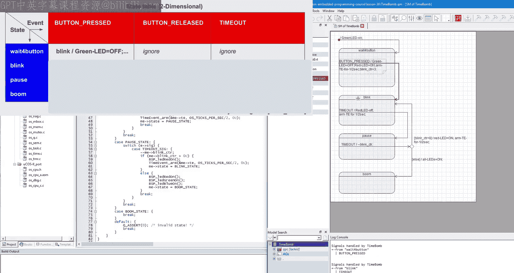
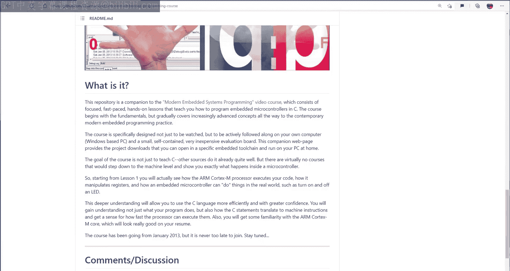

# 38：状态表与进入/退出动作

在本节课中，我们将学习状态机的另一种实现方式——状态表。我们将了解如何用C语言实现状态表，并扩展此实现以支持状态的进入和退出动作。

## 概述

到目前为止，在本系列关于状态机的课程中，我们已经学习了最直接的C语言实现方式：嵌套的`switch`语句。例如，第36课中的“定时炸弹”项目就是采用这种方式实现的。整个状态机被编码在一个调度函数中，由一个基于状态变量的`switch`语句构成。每个`case`处理一个独立的状态，在每个状态内部，又有一个基于事件信号的嵌套`switch`语句来处理该状态感兴趣的事件。

然而，这种实现方式并非最高效或最优雅的，它只是最直观、最常见的。今天，我们将学习另一种基于状态表的实现方式。状态表是状态机的一种流行表示方法，理解其工作原理至关重要。

## 从状态图到状态表

在上一课（第37课）中，我们看到了用于描述电子电路的米利型和摩尔型状态机的状态表。由于这些状态机的输入是逻辑信号，所以那些表是真值表。但我们可以很容易地将其推广到事件。

例如，如果我们为状态分配名称，并将事件命名为`low`（0）和`high`（1），就可以将一维真值表重写为二维状态表。在二维表中，状态沿垂直维度排列，事件沿水平维度排列。表中的每个单元格包含一个“下一状态”和“要执行的动作”对，对应于给定状态下给定事件的处理方式。

一维表和二维表包含完全相同的信息，并且都与状态图一一对应。

## 为“定时炸弹”项目构建状态表

现在，让我们将同样的技术应用于第36课的“定时炸弹”软件状态机，为其构建一个二维状态表。

首先，我们需要识别所有发送给“定时炸弹”的事件。这些事件在`BSP.h`头文件中枚举，包括`BUTTON_PRESSED`、`BUTTON_RELEASED`和`TIMEOUT`。

接着，查看状态机中的状态。这些状态是：`WAIT_FOR_BUTTON`、`BLINK`、`PAUSE`和`BOOM`。

对于每个状态，我们检查它处理哪些事件，并在状态表的相应单元格中填入下一状态和动作。对于某个状态下未处理的事件，我们填入`ignore`（忽略），或者如果你认为该事件永远不应到达该状态，也可以填入`error`（错误）。

例如，`WAIT_FOR_BUTTON`状态处理`BUTTON_PRESSED`事件，我们就在对应单元格填入下一状态和动作。`BLINK`状态只处理`TIMEOUT`事件。

在`PAUSE`状态中，存在一个问题：该状态有一个带守卫条件的转换，根据条件不同，可能转换到`BLINK`状态或`BOOM`状态。在状态表中，我们可以先填入这两个可能的下一状态并加上问号，然后在表格脚注中进一步解释。另一种方法是将整个守卫条件直接放入表中，但这会使表格变得杂乱。我们将在实际代码中看到如何解决这个问题。

## 在C语言中实现状态表

现在，我们进入本节课最有趣的部分：如何将状态表表示作为实际实现的基础。

首先，将第36课的目录复制到第38课，并在Microvision IDE中打开项目。

实现状态表的第一个问题是如何在代码中表示它。C语言直接支持二维数组，因此我们可以创建一个`timeBomb_table`数组，其第一维对应状态数量，第二维对应事件数量。

一个值得注意的技巧是，在状态枚举的末尾放置一个名为`MAX_STATE`的特殊常量，在`BSP.h`的事件信号枚举末尾放置一个名为`MAX_SIG`的常量。将这些`MAX`常量放在末尾，可以自动跟踪枚举内部的任何变化。

接下来，最关键的决定是关于状态表条目`timeBomb_table`中每个单元格的类型。有些实现让每个条目成为一个包含守卫条件、新状态、转换动作等一大堆成员的结构体。然而，这种每个单元格都包含大量信息的方式使得表格初始化非常复杂，占用大量内存，并且最重要的是，即使是一个简单的状态机实现也会被分割成数百个小函数。

因此，我推荐一个更简单的解决方案：让数组中的每个单元格只保存一个名为`TimeBomb_action`的动作函数指针。这个动作函数可以评估守卫条件，也可以在内部改变状态，因此不需要单独的下一状态信息。

`TimeBomb_action`是一个函数指针，当给定事件到达给定状态时被调用。我们通过`typedef`来定义这个函数指针类型。动作函数返回`void`类型。为了便于访问`TimeBomb`的数据成员，动作函数将接收一个指向`TimeBomb`对象的指针`me`。为了访问事件参数，它还将接收一个指向事件对象的指针`e`。

有了这个定义，我们就可以开始填充状态表了。请注意，状态表在设计时是完全已知的，在运行时是固定的。因此，它可以且应该是`const`（常量）。这不仅更安全（因为编译器不允许你更改常量表），而且允许状态表被放置在ROM中，而不是占用宝贵的RAM空间。

常量对象必须在定义时立即初始化。在C语言中，实现这一点的唯一方法是使用C数组初始化器。为了简化工作并避免错误，我们可以在初始化器中添加注释，标注出`BSP.h`中枚举的所有信号标签和`TimeBomb`类中枚举的所有状态标签。

但这里必须非常小心，因为状态表数组的索引必须是连续的并从0开始。然而，`BSP.h`中的信号并不是从0开始，而是有一个`USER_SIG`常量的偏移。这个偏移量在`microC/OS-II`的`os.h`头文件中定义，其中第一个默认值为0的信号是`INIT_SIG`。因此，状态表中的完整信号列表必须在开头包含`INIT_SIG`。

现在，我们可以根据之前设计的状态表来填充表格单元格，除了`INIT_SIG`信号只在`TimeBomb`的`init`函数中的`WAIT_FOR_BUTTON`状态被处理。

对于每个被处理的信号-状态组合，我们插入一个函数指针，其命名格式为`timeBomb_`后跟状态名，再后跟信号名。例如，`WAIT_FOR_BUTTON`状态处理`BUTTON_PRESSED`事件，所以我们在这里插入指向函数`timeBomb_wait_for_button_pressed`的指针。如果某个信号-状态组合应该被忽略，则插入`timeBomb_ignore`函数指针。

最后一步是定义表中使用的所有函数。从`timeBomb_init`开始，我们提供与`TimeBomb_action`函数指针对应的原型，并从原始的顶层初始转换中复制动作。在初始化时，状态变量`me->state`必须在构造函数中初始化为`WAIT_FOR_BUTTON`状态，因为它将被用作状态表的索引。

其他动作函数，如`timeBomb_wait_for_button_pressed`、`timeBomb_ignore`、`timeBomb_blink_timeout`等，都以类似的方式实现，只需从原始的嵌套`switch`语句中复制相应的动作代码。

现在，我们可以清理`TimeBomb_dispatch`函数中的旧代码，并用状态表重新实现它。这里的代码非常简单和优雅：我们获取`timeBomb_table`，用`me->state`状态变量和`e->sig`信号作为索引，然后通过指针调用选定的动作函数，并将`me`指针和`e`指针作为参数传递给调用。

一个好的做法是，使用`assert`断言来确保用作数组索引的变量在有效范围内。作为最后的修饰，我们可以为所有`TimeBomb`函数添加`static`关键字，就像已经为`dispatch`函数所做的那样。这是一种良好的编程实践，因为`static`关键字限制了静态元素在给定模块内的可见性，防止了从其他地方意外访问它们。

## 引入进入和退出动作

在课程的第二部分，我想介绍状态机的另一个重大改进，它可以消除设计和代码中的许多烦人重复。

例如，在“定时炸弹”状态机中，`BLINK`状态可以通过两种不同的转换进入：从`WAIT_FOR_BUTTON`的`button pressed`转换，以及从`PAUSE`的带守卫条件的`timer`转换。在这两个转换中，都重复了一组动作：`red LED on`和`arm timer event for 1/2 second`。这是因为这些动作是`BLINK`状态所需的准备，因此无论以何种方式进入`BLINK`状态，都必须执行它们。

这些动作在逻辑上属于`BLINK`状态，如果能将这些动作显式地附加到该状态上，将会好得多。这正是状态的进入和退出动作允许我们做的事情。

具体来说，我们可以为`BLINK`状态提供一个进入动作，将那些在进入该状态时总是需要执行的动作放在那里。在UML表示法中，这是在状态形状内使用单词`entry`或字母`E`，后跟斜杠和动作列表。然后，我们可以从所有传入转换中移除这些动作。

但你不应该仅仅为了转换上的重复动作而应用进入和退出机制。事实上，你应该批判性地审视整个状态机，检查哪些动作更适合放在状态中而不是转换上。

例如，顶层初始转换中的动作`green LED on`在逻辑上属于`WAIT_FOR_BUTTON`状态，所以我们可以将其放入进入动作中，并从转换中移除它。

现在，在进入动作中所做的事情通常需要在退出动作中撤销。例如，进入`WAIT_FOR_BUTTON`时打开的绿色LED，在退出时（无论以何种方式退出）需要被关闭。因此，你应该将该动作从`button press`转换移动到状态的退出动作中。

类似地，如果`BLINK`状态在其进入动作中打开红色LED，那么它应该在其退出动作中将其关闭，而不是在转换上执行此操作。另一方面，同样发生在该转换上的定时事件武装动作，在逻辑上属于`PAUSE`状态，因为它决定了`PAUSE`状态将保持活动多长时间。

最后，模拟爆炸的“打开所有LED”动作在逻辑上属于`BOOM`状态的进入动作。

这样，我们就得到了一个“定时炸弹”状态机版本，它的大部分动作都在状态中执行，而不是在转换上。如果你还记得上一课，将动作与状态关联的状态机称为摩尔机，而将动作与转换关联的状态机称为米利机。从某种意义上说，我们刚刚将“定时炸弹”状态机从米利型转换为了摩尔型。

但我不会将硬件状态机中的米利/摩尔分类过分延伸到软件领域。因为通常，软件状态机同时具有米利机和摩尔机的特征。例如，你的“定时炸弹”仍然在转换上执行一些动作，比如`PAUSE`状态中`timeout`转换上的动作，这是可以的。

尽管如此，我数十年的软件状态机经验表明，将动作与状态关联的摩尔型状态机通常比将动作与转换关联的米利型状态机更好、更清晰、更健壮、更易于维护。

## 实现带进入/退出动作的状态表

现在，本节课的最后一步显然是使用状态表技术来实现你的“定时炸弹”状态机的摩尔版本。

当然，你有许多选项可以将进入和退出动作纳入状态表。一种可能性是应用你已经用于初始转换的相同思路：添加两个新的特殊信号，并在`microC/OS-II`的`os.h`文件中重新枚举它们。

现在，你需要立即将这些信号也添加到状态表中，否则表格将与事件枚举不匹配。然后，你需要为状态图中所有处理进入和退出动作的状态插入相应的动作函数。

例如，`WAIT_FOR_BUTTON`状态有一个进入动作和一个退出动作。`BLINK`状态也有进入和退出动作。另一方面，`PAUSE`状态只有进入动作，忽略退出动作。`BOOM`状态也是如此。

下一步是定义你已经放入状态表中的进入和退出动作函数。`wait_for_button`状态的进入动作打开绿色LED，退出动作关闭绿色LED。`blink`状态的进入动作打开红色LED并为1/2秒武装定时事件，退出动作关闭红色LED。`pause`状态的进入动作仅为1/2秒武装定时事件。`boom`状态的进入动作打开所有LED。

最后，在你的`dispatch`函数中，当发生转换时，你必须实际调用正确的退出和进入动作。但这里有一个问题：你如何知道发生了转换？

一个解决方案是让动作处理程序本身告诉你内部发生了什么。具体来说，一个动作处理程序可以返回一个枚举的状态信息，例如：
*   `TRANS`：告诉你发生了转换。
*   `HANDLED`：告诉你动作已处理但未发生转换。
*   `IGNORED`：告诉你事件被忽略。
*   `INIT`：告诉你发生了初始转换。

有了这个，你现在需要将状态返回类型添加到动作处理程序的签名中。当然，你需要回过头为所有`TimeBomb`动作处理程序添加状态返回。

从顶层开始，你需要在初始转换中返回`INIT`状态。从进入和退出动作中返回`HANDLED`状态。从改变状态的转换动作中返回`TRANS`状态。最后，从忽略动作中返回`IGNORED`状态。

有了这些准备，你就可以修改`dispatch`操作，以添加在转换时调用退出和进入动作的功能。

首先，定义一个状态变量以及一个`prevState`变量，用于在发生任何潜在转换之前保存当前状态。接下来，你从状态表中执行适当的动作，但现在将返回状态保存到你的变量中。然后，你检查报告的状态是否对应于转换。如果是，你断言新状态在有效范围内。然后，你调用状态表中对应于先前状态和`EXIT`信号的动作。此时，你传递给动作的事件是什么并不重要，因为退出动作不应该使用事件，它只是为了符合动作处理程序的签名而存在。因此，你可以在这里传递`NULL`指针。

退出先前状态后，你需要进入当前状态，因此调用状态表中对应于当前状态和`ENTRY`信号的动作。同样，你可以为事件参数传递`NULL`指针。

但你还没有完全完成，因为你仍然需要正确处理初始转换后的状态进入。所以，如果返回状态是`INIT`，你就像之前一样进入新状态，但不退出任何状态。

至此，代码修改完成。构建代码并加载到开发板进行测试，状态机应能正常工作。

## 总结

本节课我们一起学习了状态表以及状态的进入和退出动作。

状态表代表了一种不同类型的状态机实现策略，因为与纯代码的嵌套`switch`语句相比，状态表是数据驱动的。具体来说，实现围绕状态表数据结构展开，该结构在运行时通过状态和事件信号进行索引。其他数据驱动的状态机实现包括将状态表示为数据对象，然后在运行时相互连接和遍历以执行转换。

状态表示法的主要优点是高度规则的结构，迫使你考虑所有可能的状态和事件组合。此外，该实现提供了相对较好且确定性的运行时性能。

然而，该技术也有许多缺点。整个状态机代码被高度分割成大量的小动作处理程序。此外，状态表本身往往是稀疏的，有很多空白单元格，即使是在像“定时炸弹”这样极其简单的状态机案例中也是如此。这是因为事件信号被用作表的索引，而很难避免信号数值上的空白。例如，`BUTTON_RELEASED`事件在当前版本的“定时炸弹”中未被处理，但可能在系统的其他地方需要，并且通常很难为多个状态机优化信号的数值。

但也许状态表最大的缺点是，它们不鼓励添加新的状态和事件，因为这需要在表中添加整个新的列或行。开发人员认为这是很大的开销，因此倾向于避免这样做。相反，他们添加内部状态变量和守卫条件，这又回到了“面条式代码”，违背了使用状态机（正是为了避免“面条式代码”）的初衷。

在下一课中，我将向你展示另一种基于可重用事件处理器的状态机实现策略，我认为这是最优的。