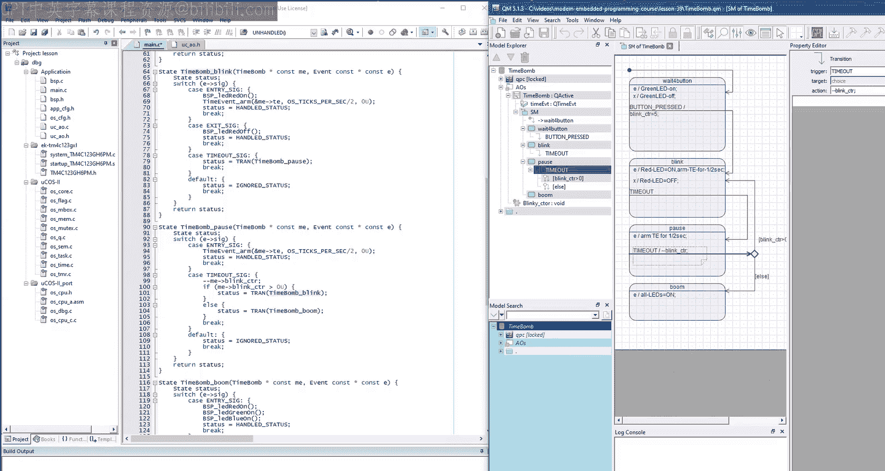
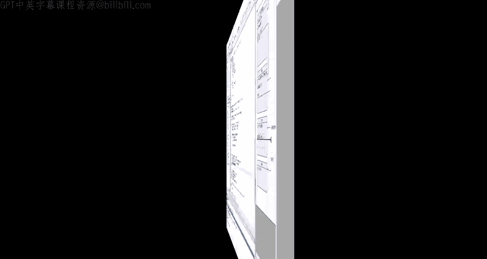
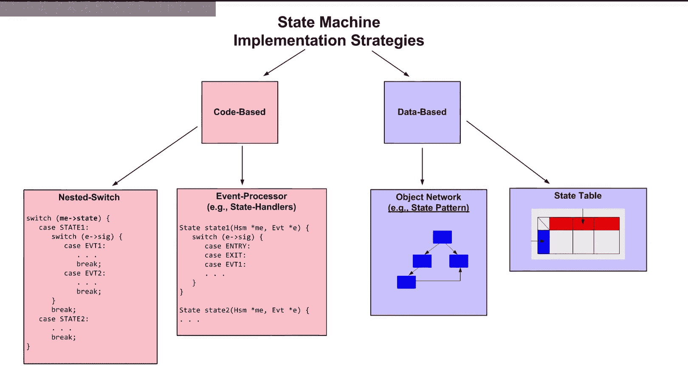
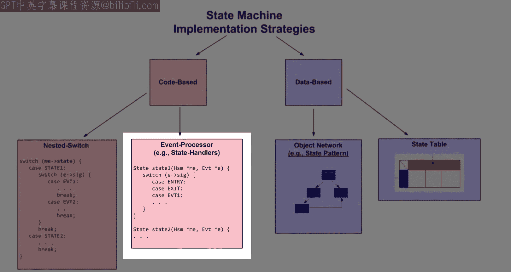
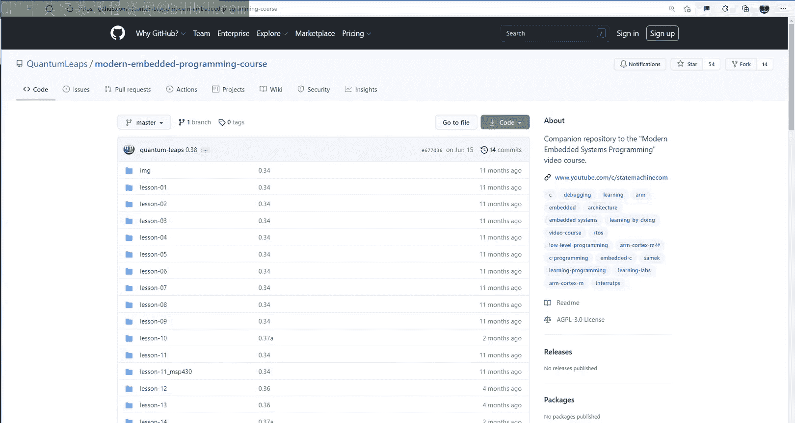

# 39：状态机第5部分 - C语言最优实现


在本节课中，我们将学习如何用C语言实现一个最优化的状态机。我们将从回顾之前的状态机实现方法开始，分析其优缺点，然后逐步构建一个基于状态处理函数的、可读性强、性能优异且易于维护的解决方案。最后，我们会将这个方案集成到微控制器主动对象框架中。

## 概述与回顾

上一节我们介绍了状态表实现技术。本节中，我们将探索如何结合之前各种实现方法的优点，同时摒弃其缺点，最终得到一个最优化的状态机实现。

为了进行直接比较，我们将继续使用之前的“定时炸弹”示例。首先，让我们复制第38课的目录并重命名为第39课，然后在IDE中打开项目。

回顾一下，我们已经学习了C语言的几种状态机实现策略，例如嵌套`switch`语句和状态表技术。它们各有优缺点。今天的目标是混合搭配这些方法的优良特性，同时消除其弊端。

## 构想理想的状态机描述语言

在开始编码之前，先构想一个理想的状态机描述方式往往很有帮助。我们可以想象发明一种领域特定语言来指定状态机，而不是直接实现它。这种DSL将是状态图的文本表示。

例如，对于“定时炸弹”状态机，我们可以这样描述：

```
State: wait_for_button
  entry: me->timeout = 0;
  exit: // 无操作
  button_pressed -> transition(blink)

State: blink
  entry: me->timeout = 0; me->blink_ctr = 0;
  exit: // 无操作
  timeout -> transition(pause)

State: pause
  entry: // 无操作
  exit: // 无操作
  timeout -> if (me->timeout < 4) { transition(blink) } else { transition(boom) }

State: boom
  entry: BSP_boom(); // 模拟爆炸
  exit: // 无操作

Initial: transition(wait_for_button)
```

这种DSL以状态为中心，清晰地描述了入口动作、出口动作、事件触发和状态转换。实际上，存在类似的状态机编译器，如SMC。但我们的目标不是使用特殊编译器，而是将这种DSL的理念融入C语言程序中。

## 将DSL转化为C语言状态处理函数

观察上面的DSL，状态规格可以自然地转化为C语言函数。状态的主要职责是响应事件并执行动作代码，这正是函数的功能。

状态处理函数需要访问对象指针`me`和当前事件信号，因此其参数列表与之前状态表中的动作处理函数类似。根据我们在第29至32课介绍的C语言面向对象编程约定，成员函数需要添加类名前缀。

以下是状态处理函数签名的构想：
```c
static QState TimeBomb_wait_for_button(TimeBomb * const me, QEvt const * const e);
```
其中，返回类型`QState`表示状态处理后的状态信息（例如，事件是否被处理、是否发生了状态转换）。

在函数内部，我们可以重用嵌套`switch`语句的结构：外层`switch`基于当前状态（现在已由函数本身代表），内层`switch`基于事件信号。入口和出口动作可以通过特殊的保留事件信号`Q_ENTRY_SIG`和`Q_EXIT_SIG`来处理，这与状态表技术类似。

以下是`wait_for_button`状态处理函数的一个可能实现框架：
```c
static QState TimeBomb_wait_for_button(TimeBomb * const me, QEvt const * const e) {
    QState status;
    switch (e->sig) {
        case Q_ENTRY_SIG: {
            me->timeout = 0;
            status = Q_HANDLED();
            break;
        }
        case Q_EXIT_SIG: {
            status = Q_HANDLED();
            break;
        }
        case BUTTON_PRESSED_SIG: {
            status = Q_TRAN(&TimeBomb_blink); // 转换到blink状态
            break;
        }
        default: {
            status = Q_SUPER(&QHsm_top); // 或者 Q_IGNORED()
            break;
        }
    }
    return status;
}
```
这里引入了一个关键概念：**状态转换宏 `Q_TRAN`**。它需要改变状态变量。由于我们的状态现在由函数指针表示，因此状态变量应该是一个指向状态处理函数的指针。



我们定义状态处理函数类型和状态变量：
```c
typedef QState (*QStateHandler)(void * const me, QEvt const * const e); // 简化示意
QStateHandler state; // 状态变量
```
然后，`Q_TRAN`宏可以这样实现：
```c
#define Q_TRAN(target_) \
    ((me->state = (QStateHandler)(target_)), Q_TRAN_STAT)
```
这里使用了C语言的逗号运算符，它先执行状态赋值，然后表达式的值取`Q_TRAN_STAT`，正好可以赋值给`status`变量。

我们需要在所有状态处理函数定义之前提供它们的函数原型声明。这个列表大致对应之前枚举所有状态的做法。

这种基于状态处理函数的方法，其粒度介于过于细碎的动作处理函数和过于庞大的嵌套`switch`实现之间。它不再需要可能稀疏且浪费空间的状态表，大大提高了可维护性。其最大的优势在于**可读性**，因为代码结构直接对应状态图的元素：状态、入口/出口动作、转换和守卫条件。

## 调整事件分发机制

接下来，我们需要调整上一课中的`dispatch`操作，使其能够与状态处理函数协同工作，而不是状态表。



主要更改包括：
1.  将`state`变量的类型改为状态处理函数指针。
2.  在调用当前状态处理函数时，直接通过函数指针调用，无需经过状态表索引。
3.  当状态处理函数报告发生了状态转换时，需要先调用旧状态的出口动作，再调用新状态的入口动作。这里可以使用静态的、包含`Q_EXIT_SIG`和`Q_ENTRY_SIG`的保留事件对象。
4.  调整初始化的处理。

完成这些修改后，项目可以成功编译并在硬件上运行，验证了基本功能的正确性。

## 重构：将通用状态机管理集成到框架中

观察当前的`dispatch`操作，它完全是通用的，不包含任何“定时炸弹”状态机特有的逻辑。相同的实现可以用于任何其他状态机。这为我们提供了一个改进设计的机会：将通用的状态机管理功能集成到微控制器主动对象框架中。

当前框架设计是：`QActive`基类被应用层类（如`TimeBomb`）继承。我们可以利用继承，将公共元素（如图中蓝色的状态机管理部分）整合到基类中，避免重复代码。

我们可以设计更精细的类层次结构：添加一个`QHsm`（层次状态机）基类，专门负责状态机管理。然后让`QActive`类继承`QHsm`，而应用类（如`TimeBomb`）再继承`QActive`。这样做的好处是，`QHsm`也可以独立用于非主动对象的被动状态机（例如在中断服务例程中）。

以下是重构步骤：
1.  在框架头文件中声明`QHsm`基类，包含状态变量`state`。
2.  为`QHsm`类编写构造函数（接收初始伪状态处理函数）、`init`操作（执行初始转换）和`dispatch`操作。
3.  修改`QActive`类，使其继承`QHsm`。调整其构造函数，调用`QHsm`的构造函数。
4.  在`QActive`的`start`操作中，调用`QHsm`的`init`操作来初始化状态机。
5.  由于状态变量现在位于`QHsm`基类中，需要修改`Q_TRAN`宏，对`me`指针进行向上转型到`QHsm*`，并转换目标函数指针的类型以匹配`QHsm`中的函数签名。

完成框架重构后，再对`TimeBomb`应用类进行相应调整：删除已移至框架的类型定义和状态变量，并更新构造函数。

最终，整个项目能够干净地编译，并且“定时炸弹”功能运行正常。

## 性能评估与比较

我们可以在调试器中利用Cortex-M4处理器的DWT周期计数器来量化新方法的执行速度。测量从`button_pressed`事件分发到状态机开始，到`dispatch`函数结束所花费的CPU时钟周期。

实验结果表明，新的状态处理函数方法执行一次转换大约需要**226个周期**（在40MHz CPU下约5.65微秒）。

作为比较：
*   **状态表方法**（第38课）：约206个周期，快约10%。
*   **嵌套switch语句方法**（第36课）：约146个周期，但该版本不支持入口/出口动作，因此不具备直接可比性。

结论是，新的状态处理函数方法在速度上几乎与状态表方法相当，同时具有更佳的可读性、可维护性，并且在内存占用上显著更优（无需大型稀疏状态表）。

## 其他方法：状态机编译器

作为补充，本节课还简要介绍了状态机编译器（如SMC）的方法。SMC使用自定义的DSL描述状态机，然后将其编译成C或C++代码。生成的代码通常基于“状态模式”，每个状态都是一个单独的类，结构较为复杂。

相比之下，我们的状态处理函数方法属于基于代码的策略，更加简单直观。SMC等工具在历史上曾流行，但直接使用C语言状态处理函数通常更直接、更易集成到现有工作流中。

## 总结

本节课中，我们一起学习了如何实现一个最优化的C语言状态机。我们从构想一个清晰的DSL开始，逐步将其转化为基于函数指针的状态处理函数实现。这种方法的核心优势在于：
*   **高可读性与可维护性**：代码结构直接映射状态图元素。
*   **良好性能**：执行速度接近最快的状态表方法。
*   **内存高效**：无需存储稀疏的状态表。
*   **易于集成**：我们将通用的状态机管理逻辑重构并集成到了微控制器主动对象框架中，提高了代码的复用性。





我们还将新方法的性能与嵌套`switch`和状态表方法进行了比较，验证了其综合优势。最后，我们简要了解了状态机编译器作为另一种实现途径。



这个最优实现现已内置到你的微控制器主动对象框架中。在下一课中，我们将进入更强大的现代层次状态机的学习。