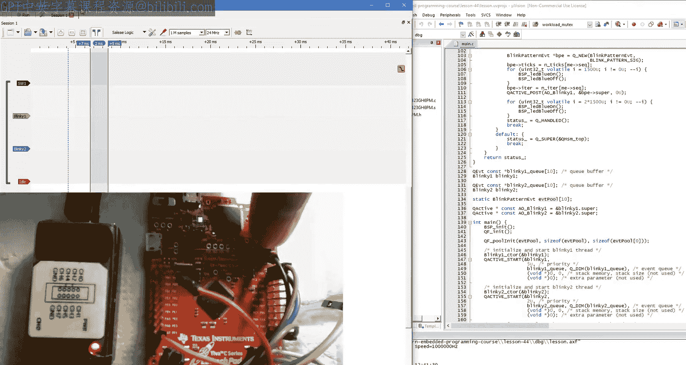
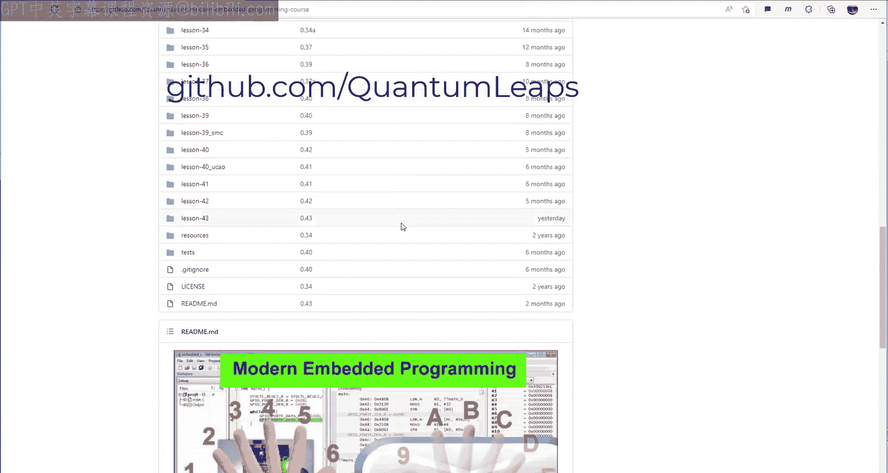

# 44：实时系统中的活动对象（第二部分）——可变事件 🚀


在本节课中，我们将继续探讨实时系统中的活动对象。具体来说，我们将学习如何使用异步可变事件，并了解为何这种方法比使用传统实时操作系统（RTOS）的编程方式更适合硬实时系统。

## 概述

上一节我们介绍了活动对象在抢占式优先级调度器下的基本行为，并验证了它们符合速率单调调度（RMS）的要求。然而，那个例子过于简化，没有包含任何交互。本节中，我们将通过添加活动对象之间的交互，来观察这对其实时行为的影响，并重点学习如何安全地使用可变事件。

## 从共享全局变量开始

首先，我们尝试一种不推荐的方法：在活动对象之间共享全局变量。假设我们希望在每次按钮按下后，让 `Blinky2` 活动对象改变 `Blinky1` 的闪烁模式。

以下是实现步骤：

1.  **定义全局变量**：创建两个全局变量 `g_ticks` 和 `g_iter`，分别用于存储 `Blinky1` 的时钟节拍数和内部循环迭代次数。
2.  **修改 Blinky1**：将 `Blinky1` 的闪烁模式改为由这些全局变量控制。定时事件需要设置为单次触发，并在每次超时后重新设置。
3.  **修改 Blinky2**：在 `Blinky2` 的按钮按下事件处理程序中，修改这些全局变量的值，以改变 `Blinky1` 的模式。可以使用静态数组和序列计数器来循环设置不同的值。

运行此代码，表面上看功能正常。然而，这里存在一个**竞态条件**。如果按钮按下事件恰好在修改 `g_ticks` 之后、修改 `g_iter` 之前发生，`Blinky1` 将看到一组不一致的值（新的 `g_ticks` 和旧的 `g_iter`）。

为了更容易地暴露这个问题，我们可以在设置两个变量之间添加一个模拟工作负载的循环。测试时，`Blinky1` 的定时会变得混乱，甚至可能导致 CPU 被完全占用，造成**拒绝服务**。

## 尝试互斥保护

既然问题源于资源共享，传统的解决方案是使用互斥机制。由于活动对象是非阻塞的，我们不能使用阻塞式的互斥量（Mutex），但可以使用非阻塞的**调度器锁定**。

在 `Blinky2` 中修改共享变量的代码周围，添加调度器锁定。测试发现，系统不再崩溃，`Blinky1` 的模式也能正常切换。但是，在模式切换的瞬态过程中，`Blinky1` 的周期有时会超过其 2 毫秒的截止时间。

这是**有界优先级反转**的后果。当低优先级的 `Blinky2` 持有锁时，高优先级的 `Blinky1` 无法运行，这段时间应计入 `Blinky1` 的 CPU 利用率。这暂时使系统超出了 RMS 的可调度界限，从而导致截止时间被错过。

## 转向事件驱动方案

共享状态并发（无论有无互斥）会带来复杂性和实时性能问题。更好的方法是使用事件进行交互，从而完全避免共享。

我们需要创建一个能携带闪烁模式信息的特殊事件。以下是正确使用可变事件的步骤：

1.  **创建事件类**：定义一个继承自 `QEvt` 的新事件类（例如 `BlinkPatternEvt`），并为其添加所需的参数（如 `ticks` 和 `iterations`）。
2.  **动态分配事件**：在 `Blinky2` 中，使用框架提供的 `Q_NEW()` 宏来动态分配一个 `BlinkPatternEvt` 事件。这能确保线程安全。
    ```c
    BlinkPatternEvt *e = Q_NEW(BlinkPatternEvt, BLINK_PATTERN_SIG);
    e->ticks = ...;
    e->iterations = ...;
    ```
3.  **设置事件参数**：填充事件的参数。
4.  **投递事件**：将事件投递给 `Blinky1` 活动对象。
    ```c
    QACTIVE_POST(&l_blinky2->super, (QEvt *)e, 0U);
    ```
5.  **接收与处理事件**：在 `Blinky1` 中，添加对新事件信号 `BLINK_PATTERN_SIG` 的处理。在事件处理程序中，通过向下转型访问事件参数，并更新内部状态。
    ```c
    case BLINK_PATTERN_SIG: {
        BlinkPatternEvt const *e = (BlinkPatternEvt const *)Q_EVT_CAST(BlinkPatternEvt);
        me->iterations = e->iterations;
        QTimeEvt_armX(&me->timeEvt, e->ticks, e->ticks);
        break;
    }
    ```
6.  **初始化事件池**：框架需要存储动态事件。我们必须初始化一个确定性的固定大小事件池，并将其交给框架管理。
    ```c
    static QF_MPOOL_EL(BlinkPatternEvt) l_smlPoolSto[10];
    QF_poolInit(l_smlPoolSto, sizeof(l_smlPoolSto), sizeof(l_smlPoolSto[0]));
    ```

这种方法实现了**零拷贝事件传递**。从应用角度看像是在复制事件，但底层框架通过引用计数和事件池进行高效管理。

## 动态事件的生命周期与所有权规则

为了确保零拷贝事件传递正常工作，应用程序必须遵守以下所有权规则：




*   **框架初始拥有**：所有动态事件最初由框架拥有。
*   **生产者获取所有权**：事件生产者（如 `Blinky2`）通过 `Q_NEW()` 获得事件的所有权，并有权写入事件。
*   **生产者转移所有权**：生产者完成后，必须通过投递（`POST`）、发布（`PUBLISH`）或显式调用垃圾回收（`GC`）将所有权交还给框架。此后，生产者**不得再访问或修改该事件**。
*   **消费者获得只读所有权**：消费者活动对象在接收到事件时获得其**只读**所有权。
*   **消费者可转发事件**：消费者可以投递或发布当前事件，且不会因此失去所有权。
*   **所有权在 RTC 步骤结束时结束**：如果事件中的信息需要在未来的运行至完成步骤中使用，消费者必须将其保存到自己的属性中。

遵守这些规则，框架就能以确定性和线程安全的方式传递可变事件，提供优于传统共享状态并发方案的硬实时性能。

## 总结

本节课我们一起学习了在实时系统中使用活动对象和可变事件。我们首先看到了在活动对象间共享全局变量会引入竞态条件和实时性能问题。接着，尝试使用互斥保护（调度器锁定）虽然解决了数据一致性问题，但带来了有界优先级反转和截止时间错过的风险。最后，我们转向了正确的事件驱动方案：通过动态分配和传递可变事件来完全避免共享。我们学习了如何创建、投递、接收可变事件，并理解了框架提供的零拷贝事件传递抽象及其关键的所有权规则。这种方法消除了对互斥机制的需求，为硬实时系统提供了更优的性能和可靠性基础。



在下一节课中，我们将探讨软件追踪（或称日志记录）技术。