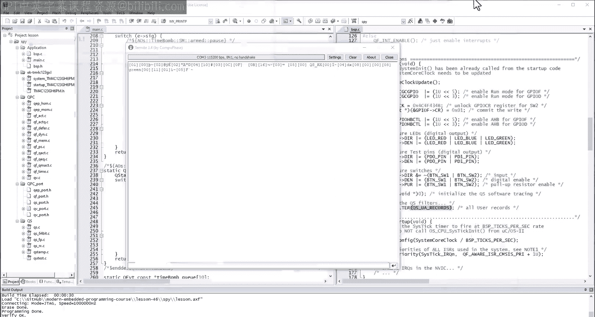
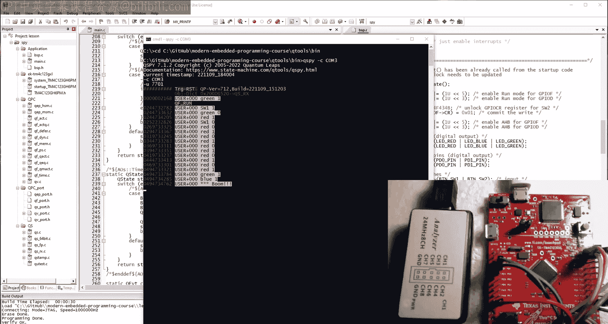
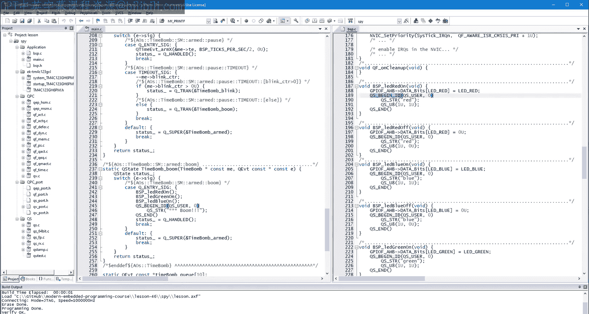
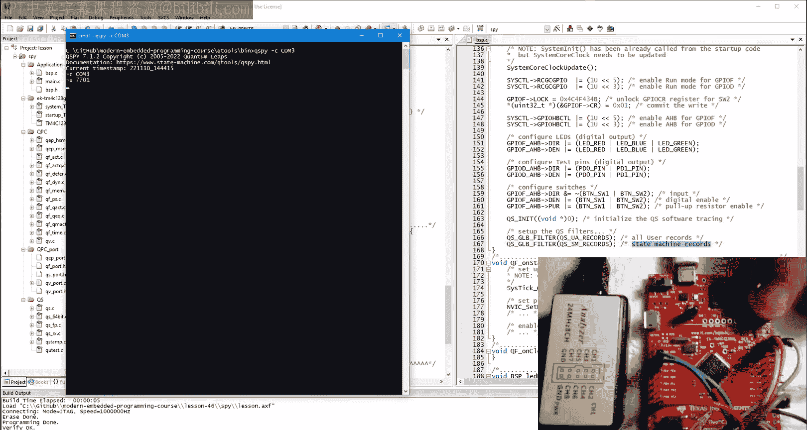
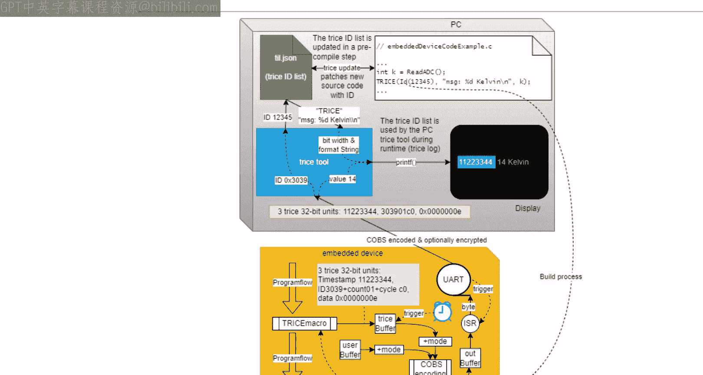
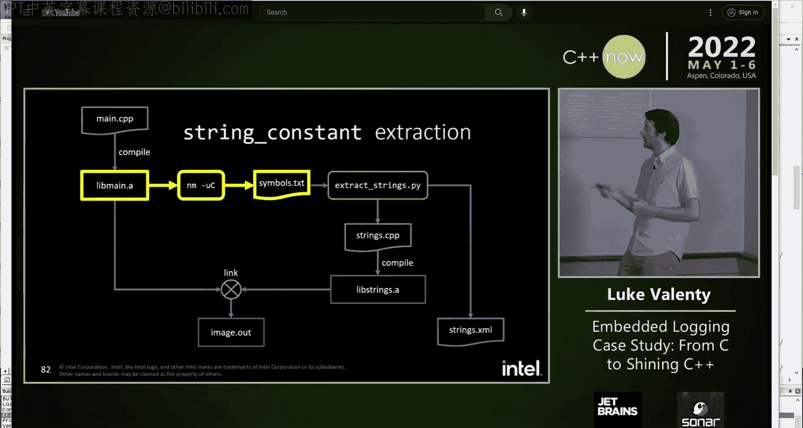
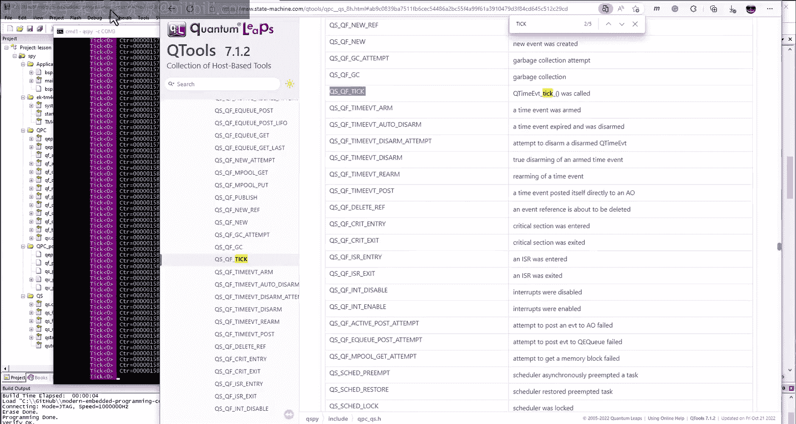
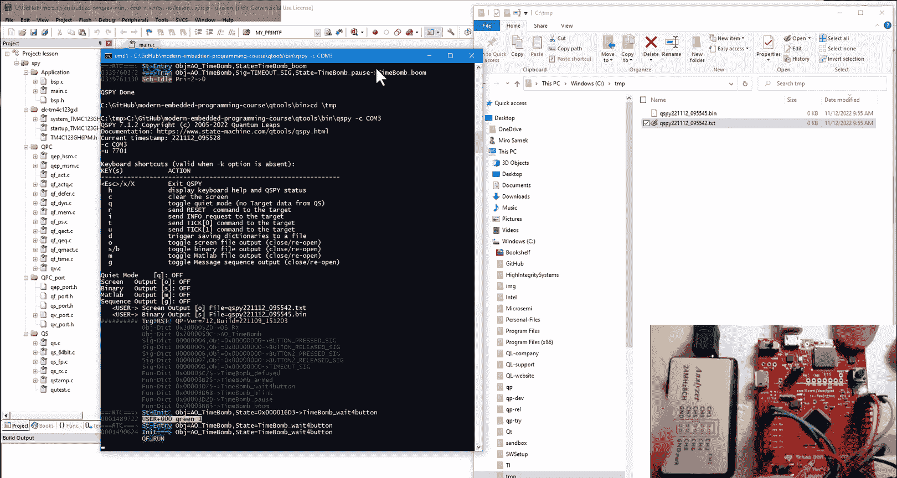
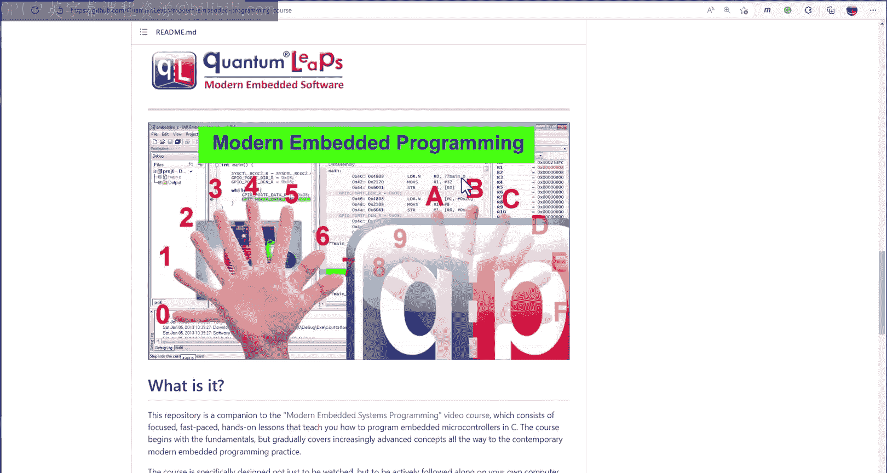

# 46：使用二进制协议的软件追踪


在本节课中，我们将学习一种适用于实时嵌入式系统的成熟软件追踪系统——Q-Spy。我们将了解它如何通过二进制协议高效地记录和传输追踪数据，从而克服传统 `printf` 调试方法带来的高开销和侵入性问题。

## 概述

上一节我们介绍了使用 `printf` 进行软件追踪的基本方法及其局限性。本节中，我们将看看一个更先进的解决方案——Q-Spy。Q-Spy 是 QP 框架内置的追踪系统，它采用二进制协议，将数据记录与传输解耦，显著降低了在关键代码路径上的执行时间开销。

## 从 `printf` 到 Q-Spy

`printf` 风格的追踪将数据生成和通过 UART 等接口发送数据耦合在一起，这个过程非常耗时。想象一下，消防车正在赶往紧急现场（这对应你的关键代码路径），但消防员却停下来花一小时写报告给上司。软件追踪本身是有用的，就像报告一样，但问题在于执行的时机和方式。

更好的策略是：消防员佩戴随身摄像机快速记录细节（对应快速记录二进制数据到内存缓冲区），然后在紧急情况结束后（对应 CPU 空闲时），再查看录像并提交报告（对应将数据发送到主机）。Q-Spy 正是采用了这种策略。

## 配置 Q-Spy 追踪

首先，我们需要在项目中激活 Q-Spy 并替换掉原有的 `printf` 调用。

### 激活 Q-Spy 仪器

与上一课的简单追踪系统类似，Q-Spy 仪器通常处于非激活状态。你需要通过定义预处理器宏 `Q_SPY` 来激活它。

### 替换追踪宏

不再使用格式字符串，而是通过调用相应的宏直接将原始二进制数据插入内部内存缓冲区。

以下是替换追踪宏的示例：
```c
// 替换前（使用自定义的 MyPrintf）
MyPrintf("SW1 %d\n", (int)SW1_SIG);

// 替换后（使用 Q-Spy）
QS_BEGIN_ID(SW1_SIG, 0U) // 开始一个追踪记录，参数用于运行时过滤
    QS_U8(0U, SW1_SIG);   // 输出一个 uint8_t 值（信号）
    QS_STR("SW1");        // 输出一个字符串
QS_END()                  // 结束追踪记录
```
整个追踪记录（在 Q-Spy 中称为 Trace Record）由 `QS_BEGIN_ID` 和 `QS_END` 宏包围。`QS_BEGIN_ID` 中的参数用于运行时过滤。

### 板级支持包（BSP）代码更新

接下来，需要更新板级特定代码，用于软件追踪的初始化和向主机发送数据。这相当于上一课中的 `MyPrintf_Init` 和 `MyPrintf_PutC` 实现。

主要区别在于：
1.  **提供追踪缓冲区**：你必须在 RAM 中提供一个缓冲区，然后将其传递给 Q-Spy 函数 `QS_INIT`。
2.  **更多功能**：Q-Spy 实现了数据输入（用于接收主机命令），这需要一个小型 RAM 缓冲区、一个中断以及处理目标重置和各种命令的回调函数。
3.  **精确时间戳**：Q-Spy 提供基于硬件计时器的精确时间戳，需要在 QS 回调函数中初始化和读取。
4.  **在空闲线程中发送数据**：最耗时的数据发送工作应在底层实时内核的空闲线程中完成。本课程使用的 QV 内核支持空闲回调，我们将发送代码放在这里。关键改进是，现在只在 UART 就绪时才发送字节，而不再忙等待。

完成代码更新后，构建项目。你可能会遇到链接错误，提示缺少 Q-Spy 的源代码文件。



### 添加 Q-Spy 源代码



需要将 Q-Spy 的源代码文件添加到项目中。这些文件位于 QPC 框架的 `qpc/qs/source` 目录下。在 µVision IDE 中创建一个名为 "QS" 的新组，并将该目录下的所有文件添加进去。

**重要**：QS 组仅应在 Spy 构建配置中包含，在 Debug 配置中应排除。你可以在 µVision 的项目管理器中，针对特定配置（如 DBG），右键点击 QS 组，在选项中去掉 "Include in Target Build" 的勾选。



## 使用 Q-Spy 主机工具

构建并下载程序后，如果你使用通用的串口终端（如上一课用的 Termite），看到的输出将是乱码。这是因为 Q-Spy 输出的是二进制数据，而非人类可读的格式。

为了正确解析二进制 Q-Spy 数据并以可读格式显示，你需要一个名为 `qs.exe` 的特殊程序（类似于串口终端）。你可以从 Quantum Leaps 的 GitHub 仓库获取它。



在命令行中运行 `qs.exe`，并指定你的开发板虚拟串口号（例如 `qs -c COM3`）。重置开发板，你将在 Q-Spy 工具中看到格式清晰的追踪输出，包括每个记录的时间戳。

## 性能对比

为了展示 Q-Spy 的实时性能优势，我们可以在代码中添加测试引脚（Test Pin）的翻转操作，并使用逻辑分析仪进行测量。





例如，在系统滴答中断（SysTick ISR）中，在 Q-Spy 追踪记录前后分别拉高和拉低一个测试引脚。测量结果显示，生成 Q-Spy 追踪记录仅需约 8.8 微秒。相比之下，使用 `printf` 输出相同信息需要 799 微秒，耗时高出近 100 倍。这证明了 Q-Spy 方法对系统的侵入性要小得多。

## Q-Spy 的预定义追踪记录

Q-Spy 的强大之处不仅在于用户自定义的追踪记录。QP 框架本身也有内置的仪器，可以产生预定义的追踪记录，这些记录比应用特定的记录效率更高。

软件追踪与事件驱动范式结合尤其强大，因为存在固有的控制反转。事件驱动基础设施（如 QP 框架）控制着应用程序，这意味着系统中几乎所有有趣的交互都必须经过框架。框架就像一个漏斗，提供了被仪器化的绝佳机会，可以在无需修改应用代码的情况下，输出关于应用程序行为的详细追踪信息。

要启用这些预定义记录，需要进行相应的配置。启用后，追踪输出将包含诸如 `DISPATCH`、`EXIT_ST`、`ENTRY_ST` 等状态机活动记录。不过，相关的数据（如原始内存地址）看起来是加密的。

## 符号信息与字典记录



为了在主机端更友好地显示二进制数据（如将地址转换为函数名、对象名），Q-Spy 需要符号信息。与其他一些从源代码中提取格式字符串的追踪系统不同，Q-Spy 采用了一种不同的方法：由目标机生成符号信息，从而确保永远不会与执行代码不同步。

通过查看 Q-Spy 输出，你可以识别出两种地址：以 `0x2` 开头的 RAM 地址（如活动对象）和以 `0x0` 开头的 ROM 地址（如状态处理函数）。此外，还有作为较小整数的信号值。

Q-Spy 允许你通过提供所谓的“字典追踪记录”来建立地址与符号名称之间的映射：
1.  **对象字典**：提供对象地址的符号信息。
    ```c
    QS_OBJ_DICT(&l_time_bomb); // l_time_bomb 是一个指针
    ```
2.  **信号字典**：提供事件信号的符号信息。
    ```c
    QS_SIG_DICT(SW1_SIG, &l_time_bomb); // 信号和关联的状态机指针
    ```
3.  **函数字典**：提供状态处理函数地址的符号信息。你可以手动输入，也可以使用 QM 建模工具自动生成（在状态机属性编辑器中勾选“QS fun dict”选项）。



添加字典记录后，重建代码并运行，你会发现 Q-Spy 输出中的原始十六进制值大部分被替换成了符号名称。

## Q-Spy 二进制数据协议

Q-Spy 的核心是其内部的二进制数据协议。与格式化的 ASCII 数据（如 `printf`）相比，二进制格式天然具有压缩性。例如，捕获的二进制文件大小可能是其对应可读文本文件大小的三分之一，这意味着在相同带宽下可以传输三倍多的追踪信息。

此外，二进制协议还能检测数据错误和间隙。它是一种 HDLC 类型的协议，允许在任何错误后立即重新同步，以最大限度地减少有用数据的丢失。在嵌入式端，该协议的关键特性是允许数据以任意块从内部缓冲区移除，完全独立于记录边界，而接收方仍能立即找到并正确解析单个记录。

## 总结



本节课我们一起学习了一种适用于实时嵌入式应用的软件追踪系统——Q-Spy。我们了解了它如何通过使用二进制协议和在空闲线程中传输数据，来显著降低对系统实时性能的侵入性。我们还探讨了如何启用框架的预定义追踪记录，以及如何通过字典记录提供符号信息，使输出更易于理解。最后，我们简要介绍了 Q-Spy 二进制协议的优势，包括数据压缩和强大的错误恢复能力。软件追踪是理解不透明的嵌入式系统内部运行状态的重要工具，而 Q-Spy 为此提供了一个高效、强大的解决方案。