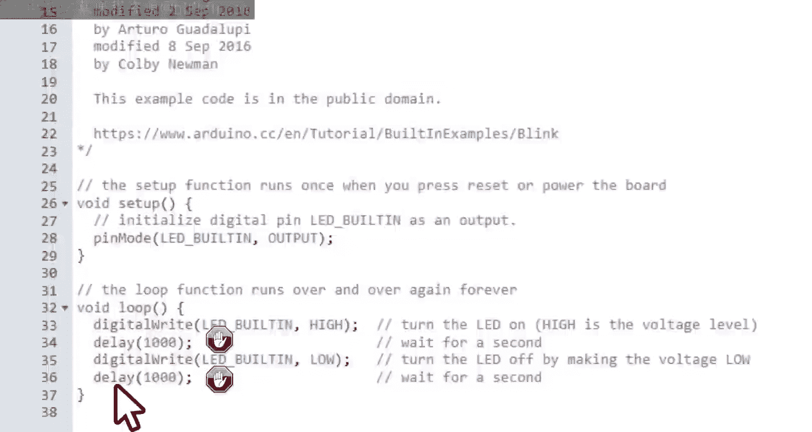
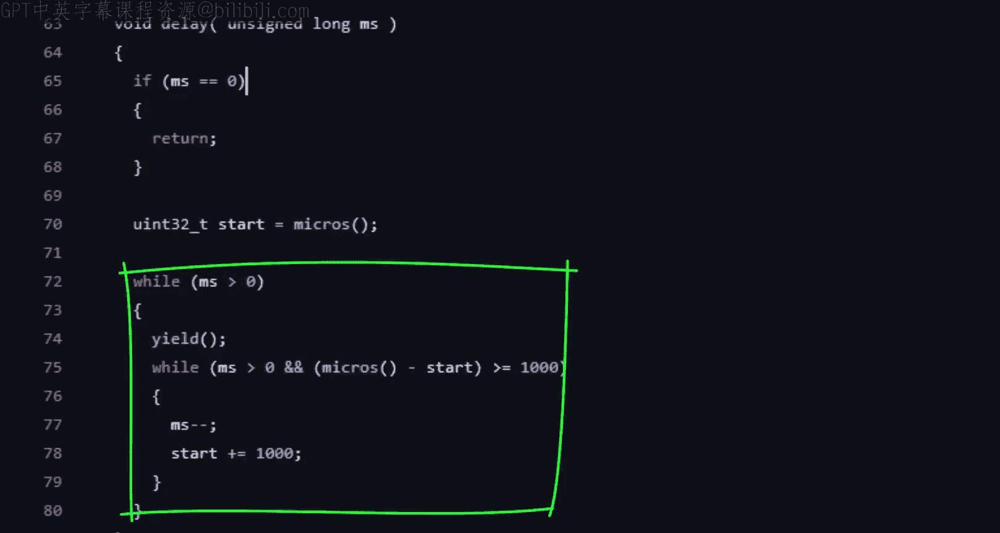
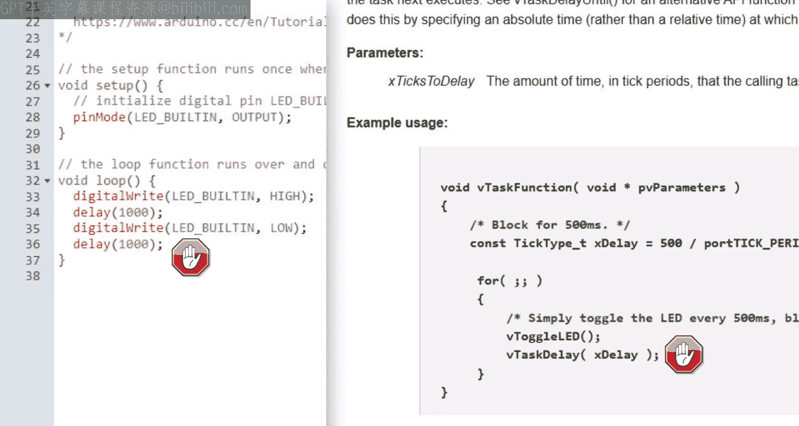
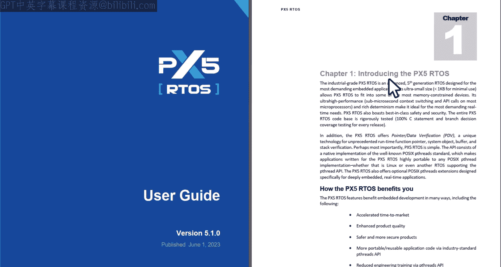
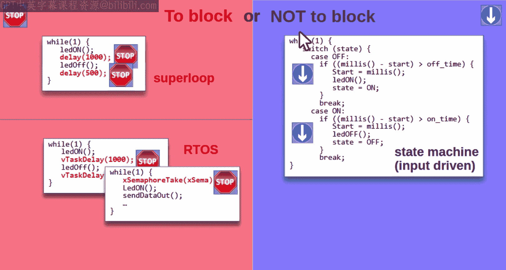
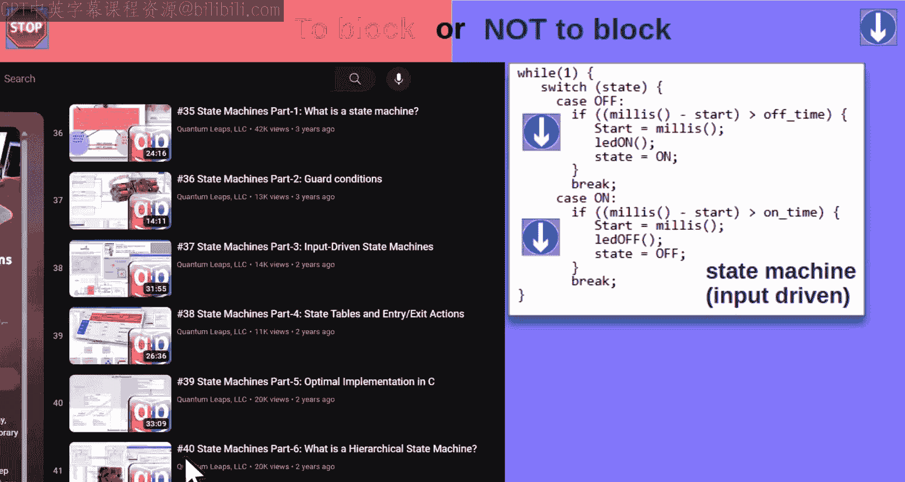
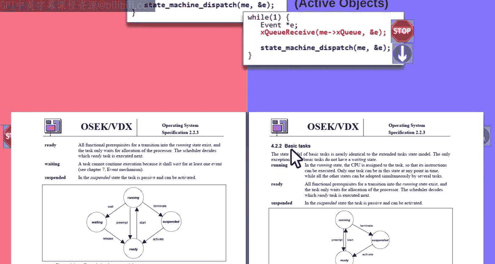
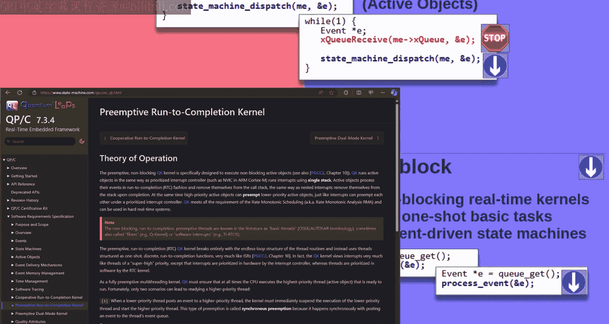
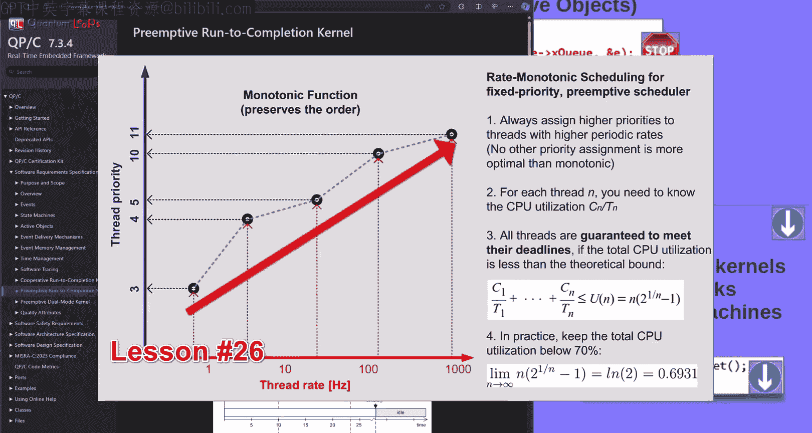
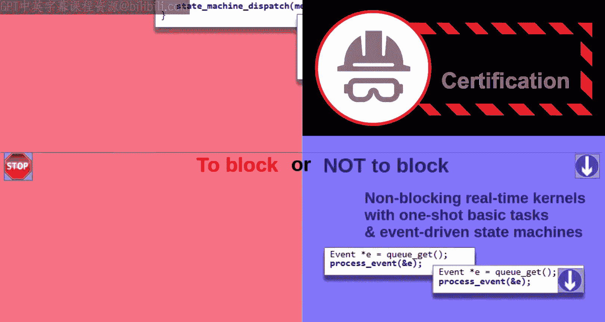

# 50：阻塞还是不阻塞，这是个问题！🚀


## 概述

在本节课中，我们将探讨嵌入式软件架构中最根本的问题：**阻塞**。我们将分析阻塞的两种形式，比较阻塞与非阻塞架构的优劣，并了解现代嵌入式开发中架构选择的演变趋势。

---

## 什么是阻塞？



阻塞是指代码执行过程中，为了等待某个事件（如时间到达、I/O操作完成）而暂停执行。它主要出现在两种形式中：**忙等待轮询**和**基于实时操作系统（RTOS）的上下文切换阻塞**。



### 忙等待轮询

忙等待轮询是初学者最常接触的形式。例如，在Arduino经典的“闪烁LED”示例中，核心功能依赖于`delay()`函数。

```cpp
void loop() {
  digitalWrite(LED_BUILTIN, HIGH); // 打开LED
  delay(1000);                     // 阻塞等待1000毫秒
  digitalWrite(LED_BUILTIN, LOW);  // 关闭LED
  delay(1000);                     // 阻塞等待1000毫秒
}
```

`delay()`函数的内部实现是一个循环，持续检查时间是否到达，在此期间CPU被完全占用，无法执行其他任务。

### RTOS中的阻塞





在RTOS中，任务可以通过调用如`vTaskDelay()`这样的函数来主动阻塞自己。虽然其内部机制（如任务切换、调度）与忙等待截然不同，但从应用开发者的视角看，其行为目的是一致的：让代码在当前位置等待。

---

## 为什么阻塞如此重要？

阻塞能力被认为是简化软件开发的最有价值特性之一，也是许多人选择使用RTOS的主要原因。它允许开发者以直观、顺序的方式编写代码，仿佛在独占地使用CPU。

然而，阻塞也是一把双刃剑。在简单的“超级循环”架构中，一旦某个函数发生阻塞，整个循环的进展都会被卡住，这会破坏其他任务的实时性。

上一节我们介绍了阻塞的基本概念，本节中我们来看看阻塞对软件架构可组合性的影响。

### 阻塞与可组合性

**可组合性**是指软件组件可以像积木一样方便地添加或移除，而整个系统仍能正常工作。在超级循环中，只要组件不阻塞，它们就基本具备可组合性。

但一旦引入任何形式的阻塞，可组合性就被破坏了。因为一个组件的阻塞会延迟所有后续组件的执行。为了解决这个问题，开发者通常需要将阻塞函数重构成**非阻塞的状态机**。

以下是避免阻塞的一种常见方法：

1.  使用非阻塞的时间检查（如Arduino的`millis()`函数）替代`delay()`。
2.  引入状态变量来记录程序当前所处的阶段。
3.  在每次循环中，根据状态和条件判断来决定执行什么动作。

这本质上就是一个简易的状态机。

---

## 传统解决方案：RTOS与状态机

面对阻塞带来的可组合性问题，嵌入式领域发展出了两种主流的传统解决方案。

### 方案一：使用RTOS

RTOS的思路是将一个超级循环拆分成多个独立的循环，即**线程**或**任务**。每个线程都拥有自己的私有栈。

*   **优点**：每个线程都可以安全地阻塞，而不会影响其他线程，因为RTOS内核会在线程阻塞时进行切换。
*   **缺点**：引入了多线程的复杂性、上下文切换的开销以及每个线程所需的额外栈内存。



### 方案二：使用状态机（非阻塞）



另一种方案是坚持使用超级循环，但彻底避免阻塞，将所有功能都实现为**非阻塞的状态机**。

*   **优点**：保持了单线程的简单性，没有上下文切换开销和额外的栈内存消耗。
*   **缺点**：需要开发者手动管理状态，对于复杂逻辑，代码可能变得难以设计和维护。最常见的实现是“意大利面条式代码”或简单的输入驱动状态机。

---

## 现代架构的演变

近年来，嵌入式架构的选择发生了显著变化。阻塞不再被视为绝对的好特性，而现代的状态机技术也不再那么令人望而生畏。

### 趋势一：在RTOS中限制阻塞

即使在基于RTOS的系统中，并发专家也强烈建议限制阻塞的使用，转而采用**事件驱动范式**。例如，NASA JPL在其所有火星车上使用的架构就遵循这一原则。

在这种架构中，事件循环**仅在顶层进行一次阻塞**（等待事件），在事件处理过程中**绝不阻塞**。这大大提高了系统的响应性和可靠性，是任务关键型软件的首选。

### 趋势二：现代状态机的复兴

传统的、持续运行的输入驱动状态机确实存在开销。但**事件驱动的状态机**（如UML状态图）只在有事件时才运行，否则不占用CPU。它们与事件循环和**主动对象设计模式**完美结合，提供了强大的建模能力，同时保持了高效率。

---

## 超越传统：更高效的实时内核

一个自然的问题是：如果我们付费使用了RTOS的阻塞能力却尽量避免使用它，那为什么不选择更简单、更高效的内核呢？



确实存在更简单的实时内核，它们**不支持自愿阻塞**，但也**不需要为每个线程分配独立的栈**。这类内核在汽车等行业已被广泛使用。

在接下来的课程中，我将介绍两种这样的内核：
1.  **协作式单栈内核（QK）**：任务必须主动释放CPU。
2.  **完全可抢占的单栈内核（QK）**：支持基于优先级的抢占，并且完全兼容**速率单调分析（RMA）**方法。由于避免了阻塞，其实时性分析甚至比传统RTOS更简单。



---



## 总结

本节课我们一起学习了阻塞在嵌入式软件架构中的核心地位。
*   **阻塞**是决定架构选择的最关键特性。
*   **传统RTOS**通过多线程和阻塞来简化编程，但带来了复杂性和开销。
*   **非阻塞状态机**保持了简单性，但对开发者要求更高。
*   **现代趋势**是朝着**事件驱动**和**非阻塞架构**发展，即使在RTOS中也是如此，这尤其适用于对可靠性要求极高的系统。
*   新的**单栈实时内核**（如QK）提供了比传统RTOS更高的效率和更简单的实时分析，代表了嵌入式架构的重要创新方向。



架构的选择没有银弹，但理解“阻塞还是不阻塞”这个问题，是为你项目选择正确架构的第一步。