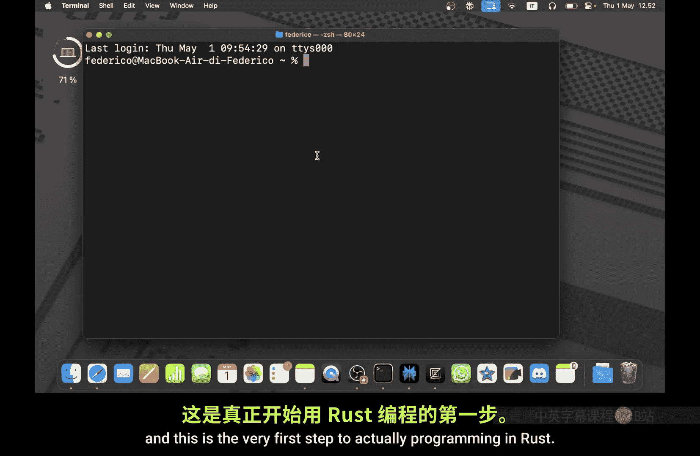
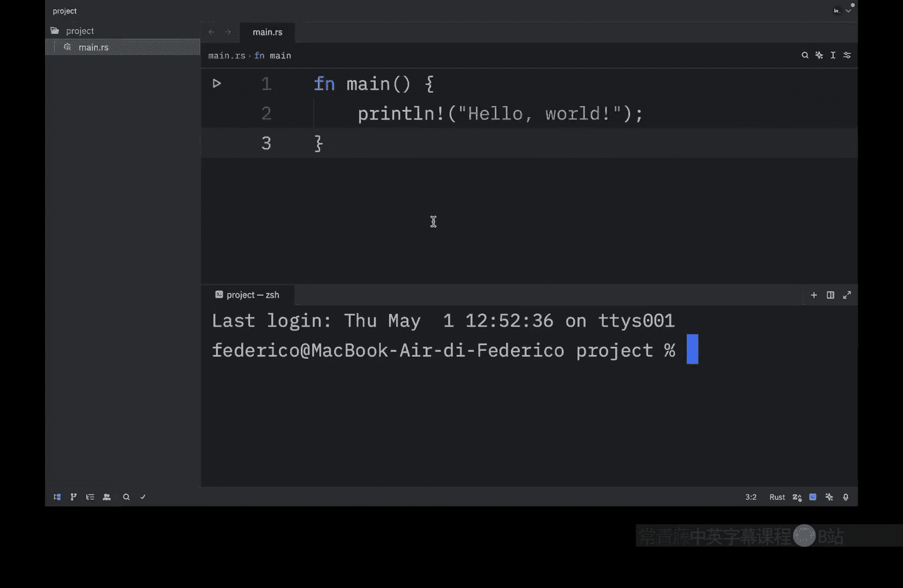
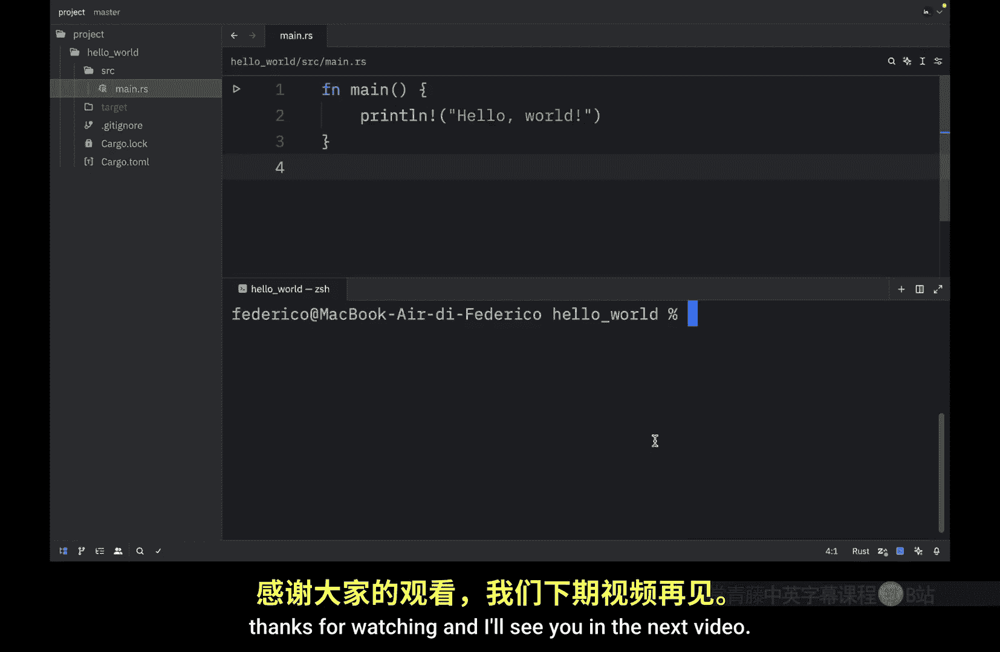

# 001：你的第一个Rust程序（如何安装Rust） 🚀

在本节课中，我们将要学习如何在你的计算机上安装 Rust。这是开始 Rust 编程的第一步。

## 概述

安装 Rust 是编写 Rust 程序的第一步。我们将通过官方工具 `rustup` 来完成安装，并学习如何创建、编译和运行你的第一个 Rust 程序。我们还将介绍 Rust 的构建系统和包管理器 `cargo`，它能极大地简化开发流程。

## 安装 Rust



首先，你需要访问 Rust 官方网站的安装页面。为了方便，你可以在视频描述中找到该页面的链接。


当你打开安装页面时，首先会看到一个绿色区域，标题是“使用 rustup”。这是安装 Rust 的推荐方法。

对于 macOS 和 Linux 用户，你只需要复制页面上的命令，并在终端中执行它。该命令会下载安装器，并询问一些关于安装配置的问题。

以下是安装步骤：
1.  复制命令并在终端中运行。
2.  安装器会提供选项：标准安装、自定义安装或取消安装。
3.  选择标准安装（通常按 `1` 然后回车）即可。

如果一切顺利，你将看到一行提示，表明 Rust 已成功安装。

对于 Windows 用户，过程略有不同。你需要点击“其他安装方式”，然后很可能需要选择“独立安装程序”并根据你的系统选择合适的版本进行下载安装。

安装完成后，验证安装是否成功非常重要。你可以在终端中输入以下命令来检查 Rust 编译器的版本：


```bash
rustc --version
```

如果安装成功，该命令会返回类似 `rustc 1.86.0` 的版本号。至此，Rust 安装完成。

## 创建第一个 Rust 程序

上一节我们介绍了如何安装 Rust，本节中我们来看看如何创建并运行你的第一个程序。

首先，创建一个新文件夹作为项目目录，并用你喜欢的代码编辑器打开它。接下来，在该文件夹内创建一个名为 `main.rs` 的新文件。

现在，我们可以开始编写第一个 Rust 脚本。在 `main.rs` 文件中输入以下代码：



```rust
fn main() {
    println!("Hello, world!");
}
```


这段代码定义了一个 `main` 函数，这是每个可执行 Rust 程序的入口点。函数体内使用了 `println!` 宏来向屏幕输出一行文本。宏名后面的 `!` 表示这是一个宏而不是普通函数，关于宏的细节我们将在后续视频中解释。最后，语句以分号 `;` 结尾，表示表达式结束。

## 编译与运行程序

要运行这个程序，你需要先打开终端。在 Windows 上，你可能需要运行 `.\main.exe`；在 macOS 和 Linux 上，则是 `./main`。

但是，如果你直接尝试运行，可能会得到一个错误，因为代码尚未编译成可执行文件。

为了编译代码，你需要使用 `rustc` 编译器。在终端中，导航到你的项目目录，然后执行以下命令：

```bash
rustc main.rs
```

这个命令会将 `main.rs` 文件编译成可执行文件。编译成功后，你会在项目文件夹中看到生成的可执行文件（例如 `main` 或 `main.exe`）。现在，你可以使用对应的命令（`./main` 或 `.\main.exe`）来运行程序，并看到输出 `Hello, world!`。

然而，每次修改代码后，你都需要重新执行 `rustc main.rs` 来编译，然后再运行，这个过程有些繁琐。

## 使用 Cargo 工具

你可能会想，每次运行程序都要先编译，肯定有更简单的方法。幸运的是，Rust 提供了一个名为 `cargo` 的强大工具。

`cargo` 是 Rust 的构建系统和包管理器。借助 `cargo`，我们可以同时完成编译和运行。

首先，让我们使用 `cargo` 创建一个新项目。在终端中（可以退出当前项目目录），执行以下命令：

```bash
cargo new hello_world
```

这个命令会创建一个名为 `hello_world` 的新目录，其中包含一个预设的 Rust 项目结构，包括 `Cargo.toml` 文件（用于管理项目信息和依赖）和 `src` 目录（内含一个已经写好的 `main.rs` 文件）。

创建后，使用 `cd` 命令进入新项目目录：

```bash
cd hello_world
```

现在，我们可以使用 `cargo` 命令了。`cargo build` 命令用于编译项目。编译后的可执行文件位于 `target/debug/` 目录下。你可以通过一个较长的路径来运行它，例如在 Unix 系统上：

```bash
./target/debug/hello_world
```

但更常用的命令是 `cargo run`。这个命令会先编译代码（如果代码有变动），然后立即运行它。这样，你修改代码后，只需一个命令就能看到最新结果。

```bash
cargo run
```

此外，`cargo` 还提供了一个非常有用的 `cargo check` 命令。这个命令会快速检查你的代码是否能通过编译，而无需真正生成可执行文件。这在开发过程中用于快速发现语法错误非常高效。

```bash
cargo check
```

## 总结



本节课中我们一起学习了 Rust 编程的起点。我们首先通过 `rustup` 安装了 Rust 工具链，并验证了安装。然后，我们手动创建了一个简单的 Rust 程序，并使用 `rustc` 编译器进行编译和运行。最后，我们介绍了更强大的 `cargo` 工具，它能够管理项目、自动处理依赖，并通过 `cargo run` 和 `cargo check` 等命令极大地简化了编译和检查流程。现在你已经准备好开始探索 Rust 的世界了。