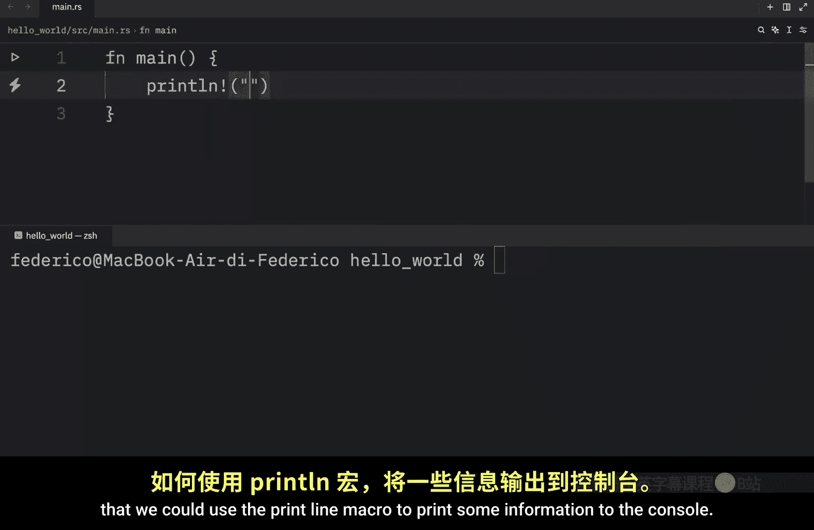
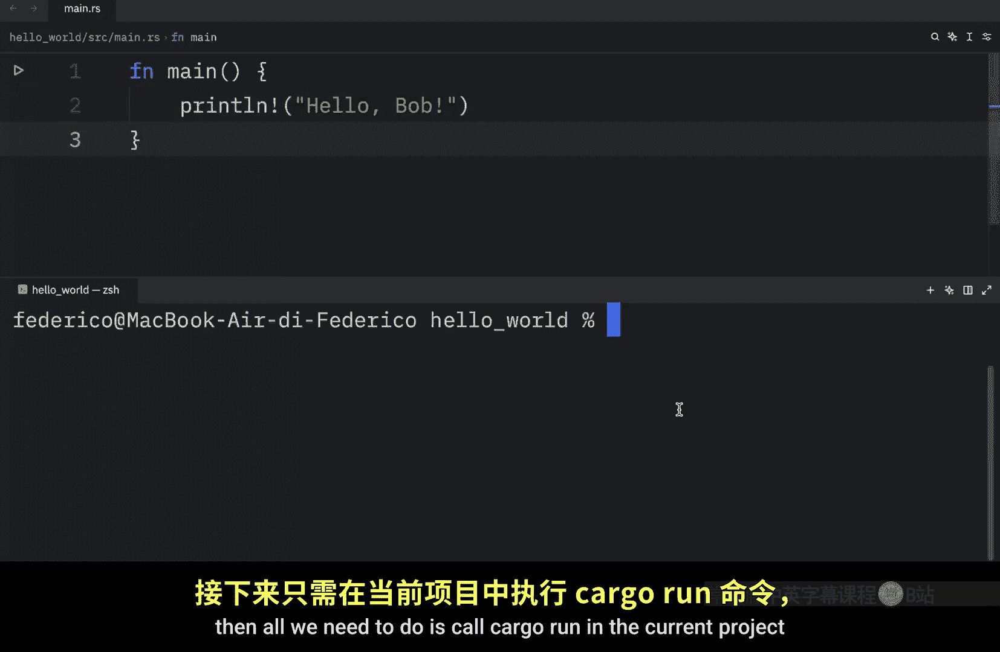
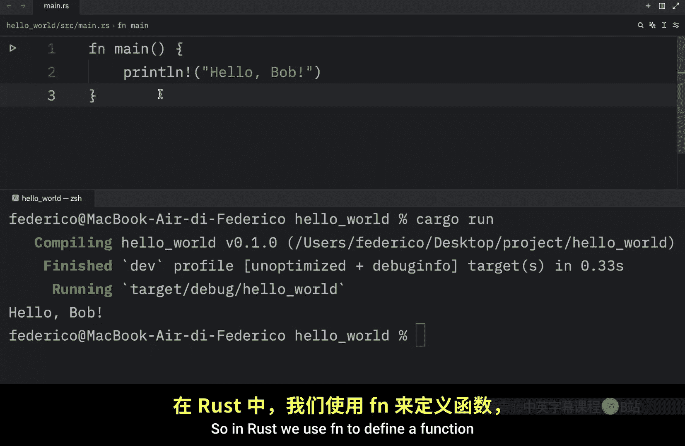
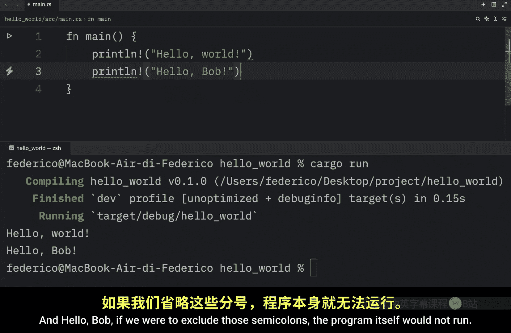
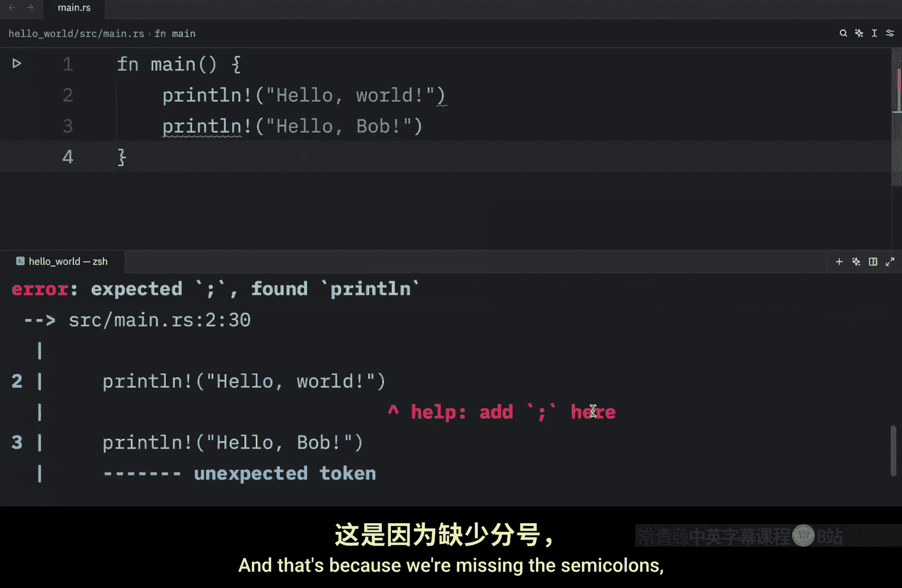
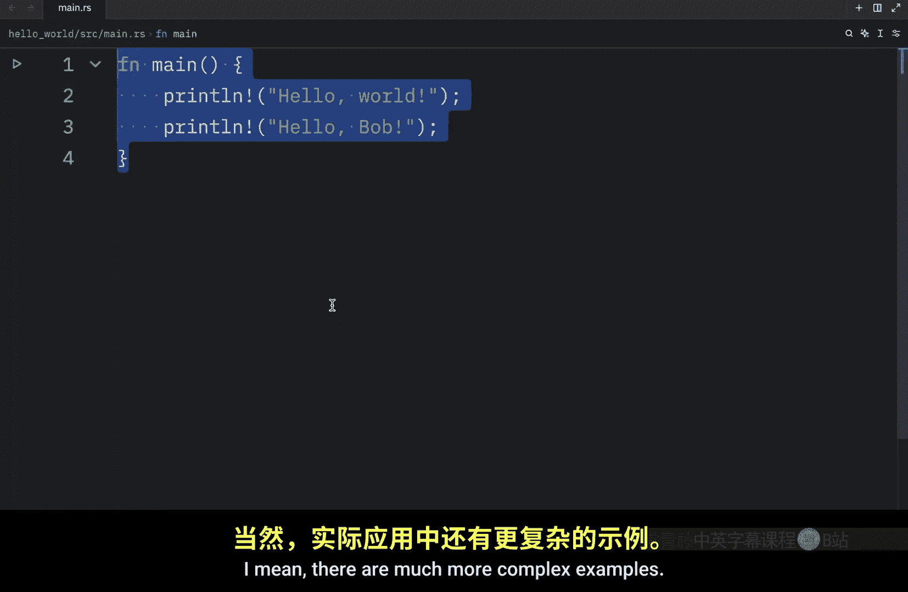
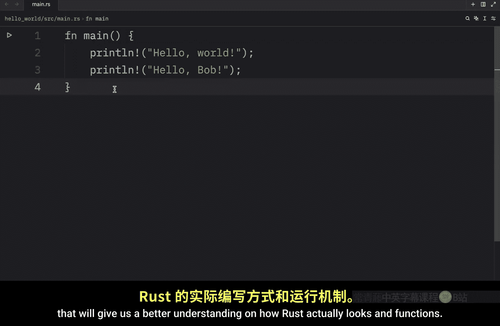

# 002：Rust 代码结构解析 🧬

在本节课中，我们将详细解析上一节视频中看到的 Rust 代码结构。我们将学习 `main` 函数、代码块、`println!` 宏以及语句结束符等核心概念，帮助你理解一个基础 Rust 程序是如何组织的。

上一节我们运行了第一个 Rust 程序，本节中我们来看看构成这个程序的各个部分具体是什么含义。

## 函数定义与 `main` 函数

在 Rust 中，我们使用关键字 `fn` 来定义一个函数。`main` 函数非常特殊，因为它是程序的入口点，总是首先运行。

定义函数的语法如下：
```rust
fn function_name() {
    // 函数体
}
```






## 代码块与花括号




我们使用花括号 `{}` 来开启一个代码块。按照惯例，花括号通常与函数定义放在同一行开始，但编译器并不会阻止你使用其他格式。

例如，以下两种写法都是有效的，但第一种是推荐格式：
```rust
// 推荐格式
fn main() {
    println!("Hello");
}

// 不推荐但有效的格式
fn main()
{
    println!("Hello");
}
```

## 使用 `println!` 宏输出信息

为了向控制台打印信息，我们使用 `println!` 宏。请注意，`println` 后面有一个感叹号 `!`，这表示它是一个宏而不是普通函数。宏与函数略有不同，我们将在后续课程中详细讲解。

目前，你只需要知道 `println!` 用于输出信息。我们使用双引号 `"` 来定义一个字符串。

以下是字符串定义的代码示例：
```rust
println!("Hello Bob");
```




在许多编程语言中，定义字符串通常使用双引号。在 Rust 中，**必须使用双引号**，单引号 `'` 有其它用途（表示字符类型）。



## 语句与分号

在 Rust 中，分号 `;` 表示一个表达式的结束，并准备开始下一个表达式。这对于编译器理解代码结构至关重要。

以下是添加多个打印语句的示例。每个 `println!` 调用后都需要分号：
```rust
fn main() {
    println!("Hello World");
    println!("Hello Bob");
}
```

如果省略分号，编译器将无法区分两个语句，导致程序无法编译运行。例如，以下缺少分号的代码是错误的：
```rust
fn main() {
    println!("Hello World") // 错误：缺少分号
    println!("Hello Bob")
}
```

## 核心要点总结


本节课我们一起学习了 Rust 程序的基本解剖结构：
1.  使用 `fn` 关键字定义函数，`main` 函数是程序入口。
2.  代码块由花括号 `{}` 界定。
3.  使用 `println!` 宏（注意感叹号）向控制台输出信息。
4.  字符串必须使用双引号 `"` 定义。
5.  语句末尾需要使用分号 `;` 表示结束。






一个最基本的 Rust 程序就由这些元素构成。当然，实际程序会更加复杂，包含更多逻辑。在下一节视频中，我们将构建一个小项目，让你更好地理解一个完整的 Rust 程序（或脚本）应该如何编写和运作。