# 003：编写你的第一个Rust项目 🎯

在本节课中，我们将通过构建一个简单的“猜数字”游戏来编写你的第一个 Rust 项目。这个项目将帮助你初步了解 Rust 语言的基本结构和语法。

---

## 创建新项目 🚀

首先，我们需要使用 Cargo 创建一个新的 Rust 项目。Cargo 是 Rust 的包管理器和构建工具。

打开终端，输入以下命令来创建一个名为 `guessing_game` 的新项目：
```bash
cargo new guessing_game
```

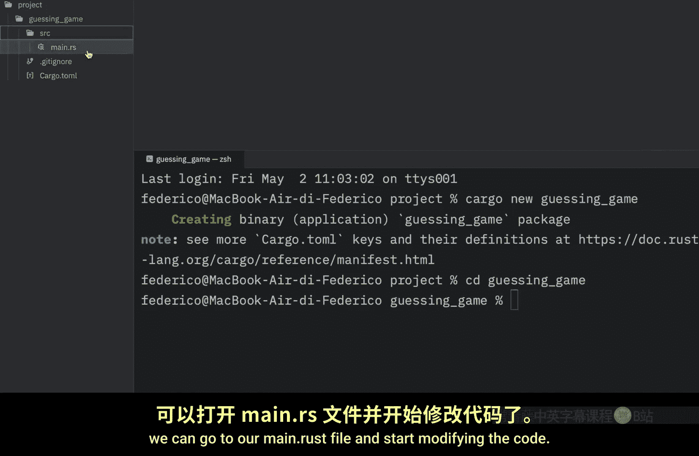


项目创建完成后，使用 `cd` 命令进入项目目录：
```bash
cd guessing_game
```

现在，你可以打开 `src/main.rs` 文件开始编写代码。为了确保环境配置正确，你可以运行 `cargo run` 命令。如果程序编译成功并打印出 “Hello, world!”，说明一切就绪。

---

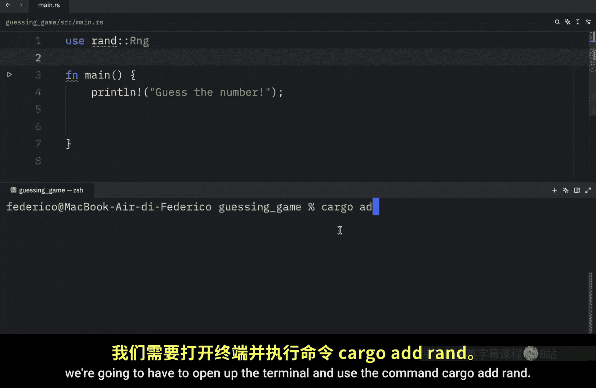

## 添加欢迎信息与生成随机数 🎲

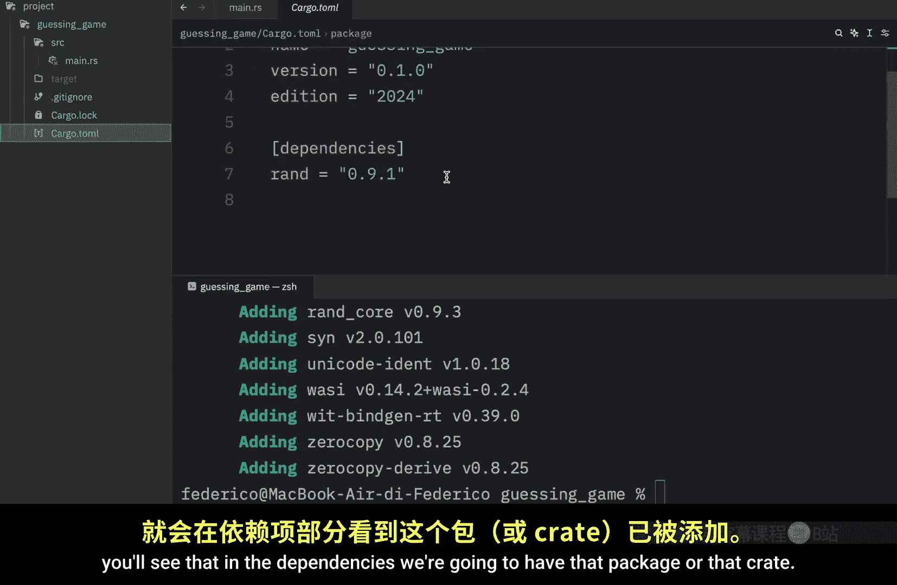

上一节我们创建了项目，本节中我们来看看如何为游戏添加欢迎信息并生成一个随机数。

首先，在 `main.rs` 文件中，我们添加一个欢迎信息：
```rust
println!("猜数字！");
```

接下来，我们需要生成一个 1 到 100 之间（包含两端）的随机数。这需要使用外部库（在 Rust 中称为 **crate**）。我们将使用 `rand` 这个 crate。

在代码顶部，我们尝试导入 `rand`：
```rust
use rand::Rng;
```

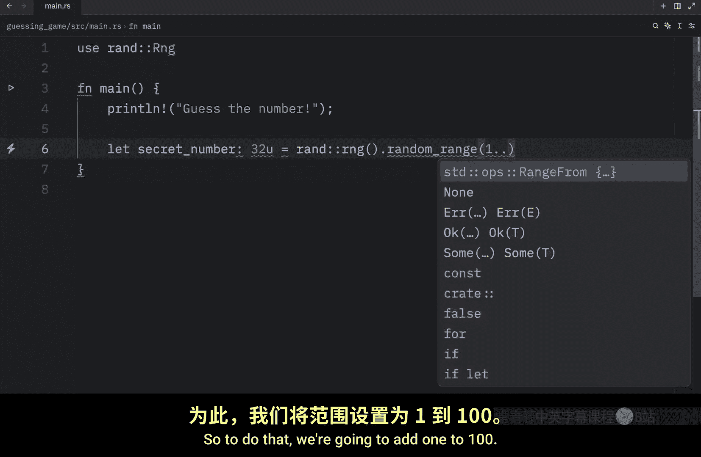

但是，`rand` 是一个外部 crate，默认不在 Rust 的标准库中。因此，我们需要先将其添加到项目的依赖中。

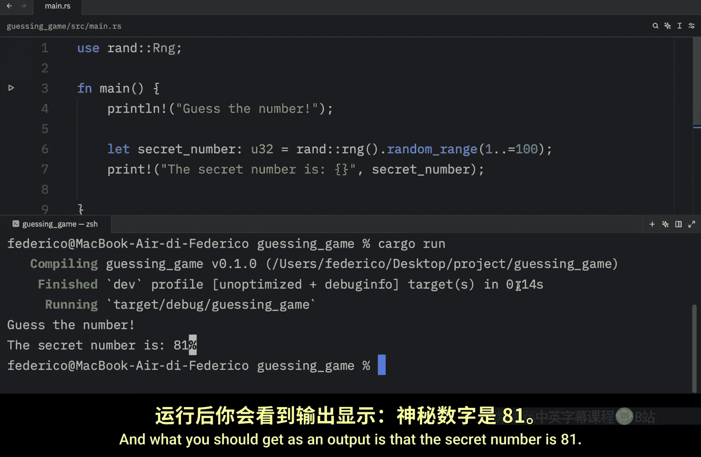

以下是添加依赖的步骤：

1.  打开终端，在项目根目录下运行：
    ```bash
    cargo add rand
    ```
2.  这条命令会自动更新 `Cargo.toml` 文件，在 `[dependencies]` 部分添加 `rand`。

依赖添加完成后，我们就可以在代码中生成随机数了。我们创建一个名为 `secret_number` 的变量来存储这个秘密数字：
```rust
let secret_number: u32 = rand::thread_rng().gen_range(1..=100);
```
*   `let` 关键字用于声明变量。
*   `u32` 表示这是一个 32 位无符号整数类型。
*   `rand::thread_rng()` 获取一个随机数生成器。
*   `gen_range(1..=100)` 生成一个 1 到 100（包含）之间的随机数。


为了调试方便，我们可以先打印出这个秘密数字：
```rust
println!("秘密数字是：{}", secret_number);
```
注意：Rust 中语句的结尾需要加上分号 `;`。

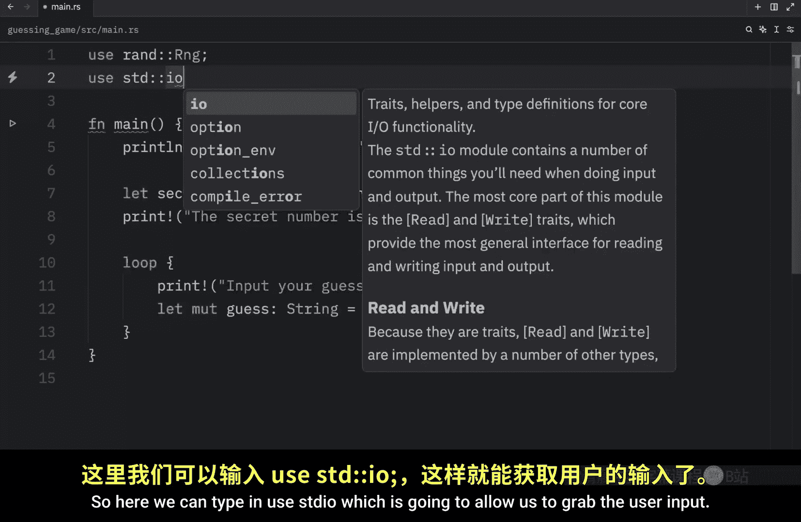

现在，运行 `cargo run`，你应该能看到类似 “秘密数字是：81” 的输出。

---

## 获取用户输入 🔄

上一节我们生成了随机数，本节中我们将创建一个循环，让用户可以持续输入猜测，直到猜中为止。

首先，我们创建一个无限循环：
```rust
loop {
    println!("请输入你的猜测：");
}
```

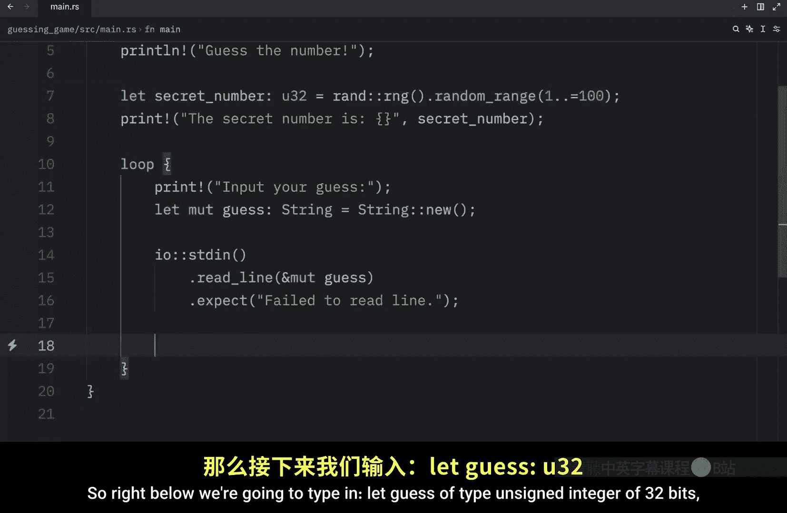


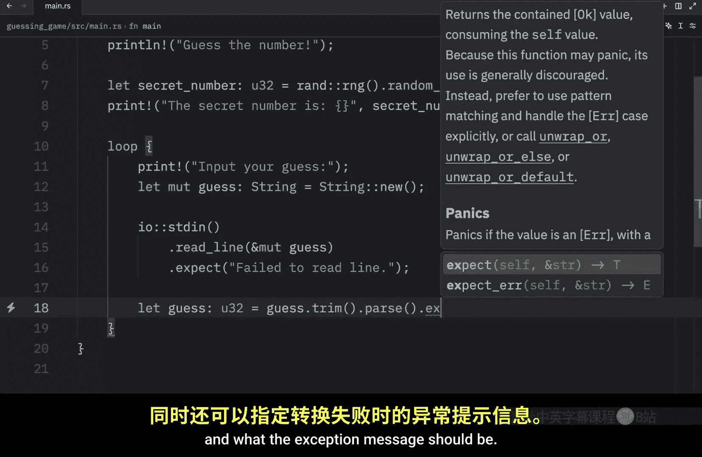

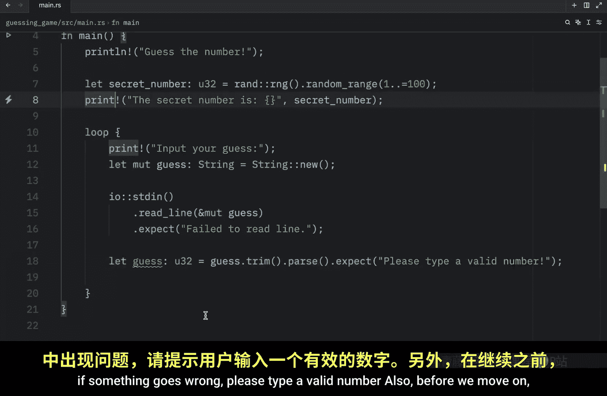

在循环内部，我们需要获取用户的输入。为此，我们先创建一个可变的（mutable）字符串变量来存储输入：
```rust
let mut guess = String::new();
```
*   在 Rust 中，变量默认是不可变的（immutable）。使用 `mut` 关键字可以声明一个可变变量。
*   `String::new()` 创建一个新的空字符串。

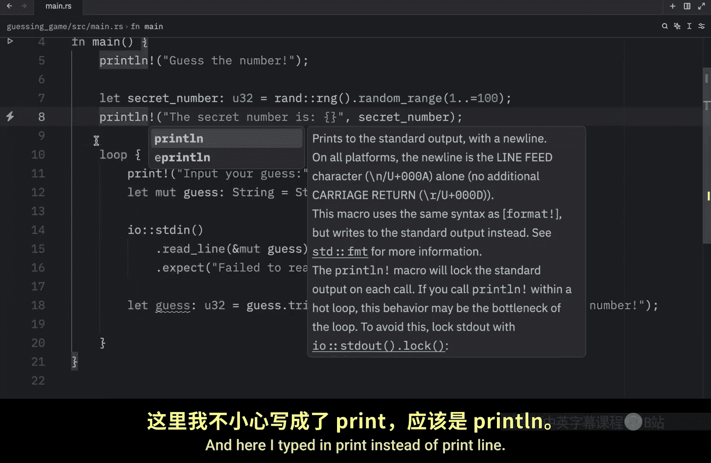

接下来，我们需要从标准输入（stdin）读取一行内容。这需要使用标准库 `std::io` 中的功能。在文件顶部添加导入：
```rust
use std::io;
```


然后，在循环内使用以下代码读取输入：
```rust
io::stdin()
    .read_line(&mut guess)
    .expect("读取行失败");
```
*   `io::stdin()` 获取标准输入句柄。
*   `.read_line(&mut guess)` 将用户输入的内容读取到 `guess` 变量中。`&mut` 表示这是一个可变引用，允许函数修改 `guess` 的值。
*   `.expect("...")` 用于处理可能出现的错误。如果读取失败，程序会崩溃并显示给定的错误信息。


用户输入的内容是字符串，但我们需要一个整数来与秘密数字进行比较。因此，我们需要进行类型转换：
```rust
let guess: u32 = guess.trim().parse().expect("请输入一个有效的数字！");
```
*   `.trim()` 去除字符串首尾的空白字符（如换行符）。
*   `.parse()` 尝试将字符串解析为指定的类型（这里是 `u32`）。
*   同样使用 `.expect()` 来处理解析失败的情况。

为了给用户反馈，我们可以打印出他们的猜测：
```rust
println!("你猜的是：{}", guess);
```

现在，运行程序 `cargo run`。你可以尝试输入数字（如 10, 20），程序会重复提示你输入。如果输入非数字（如 “Bob”），程序会显示错误信息 “请输入一个有效的数字！”。

---

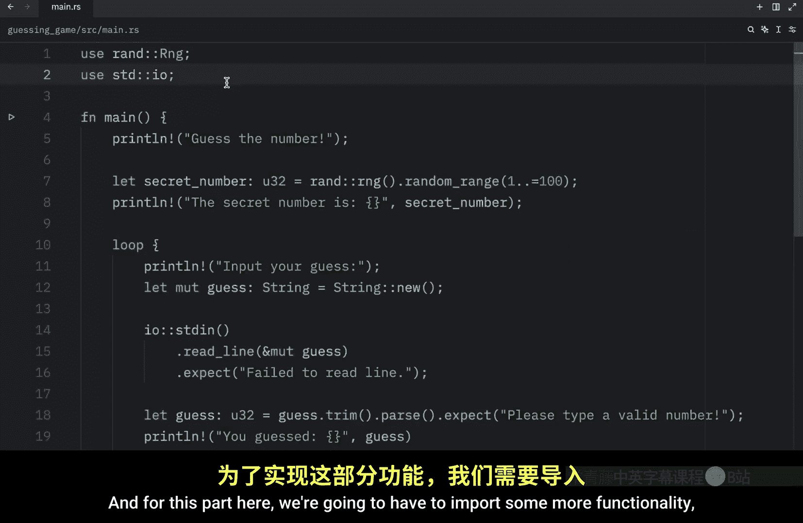

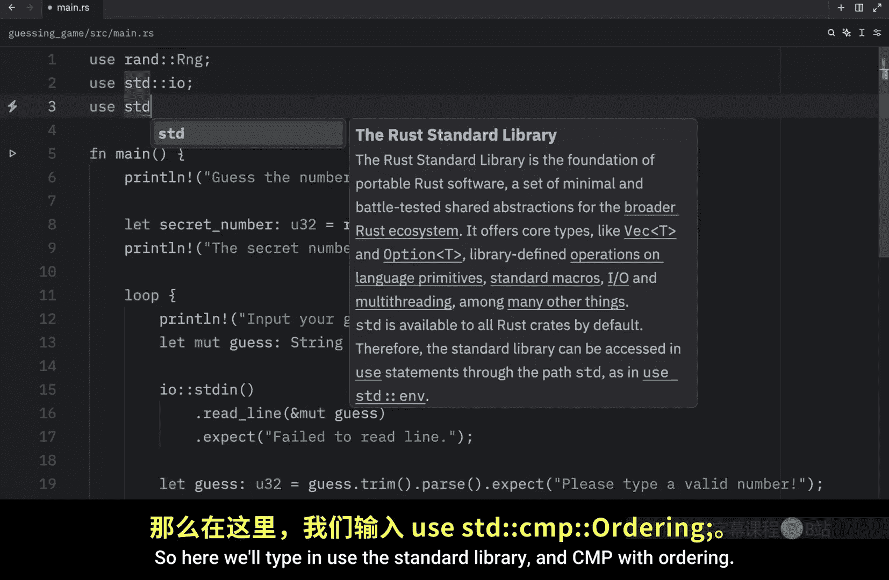

## 比较猜测与秘密数字 🏆

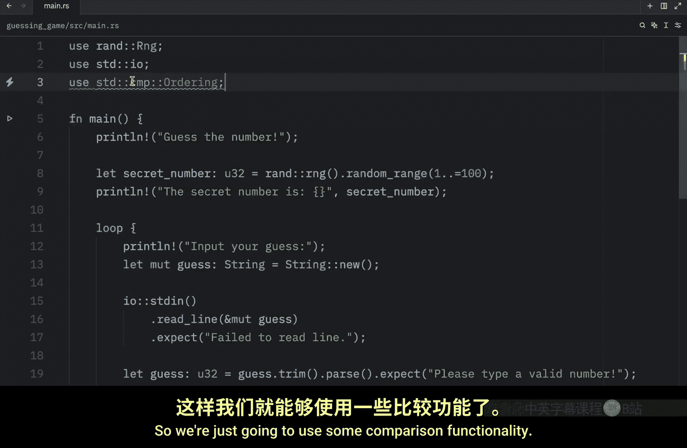

上一节我们实现了用户输入，本节中我们来实现游戏的核心逻辑：比较用户的猜测与秘密数字，并给出提示。

首先，我们需要导入用于比较的功能，它也在标准库中：
```rust
use std::cmp::Ordering;
```

在将用户输入转换为整数 `guess` 之后，我们使用 `match` 表达式来进行比较。`match` 是 Rust 中强大的控制流运算符，它根据值的不同模式执行不同的代码分支。

以下是实现比较的逻辑：
```rust
match guess.cmp(&secret_number) {
    Ordering::Less => println!("太小了！"),
    Ordering::Greater => println!("太大了！"),
    Ordering::Equal => {
        println!("恭喜你，猜对了！🎉");
        break;
    }
}
```
*   `guess.cmp(&secret_number)` 将 `guess` 与 `secret_number` 进行比较，返回一个 `Ordering` 类型的枚举值。
*   `Ordering::Less` 表示猜测小于秘密数字。
*   `Ordering::Greater` 表示猜测大于秘密数字。
*   `Ordering::Equal` 表示猜测等于秘密数字。此时，我们打印胜利信息，并使用 `break` 关键字跳出循环，结束游戏。

现在，完整的游戏已经实现了！运行 `cargo run` 开始游戏。程序会提示你输入数字，并根据你的猜测给出“太小了”、“太大了”或“恭喜你，猜对了！”的反馈。猜对后程序会自动退出。

为了让游戏更具挑战性，你可以注释掉打印秘密数字的那行代码（`println!("秘密数字是：{}", secret_number);`），这样你就不知道答案了。

---

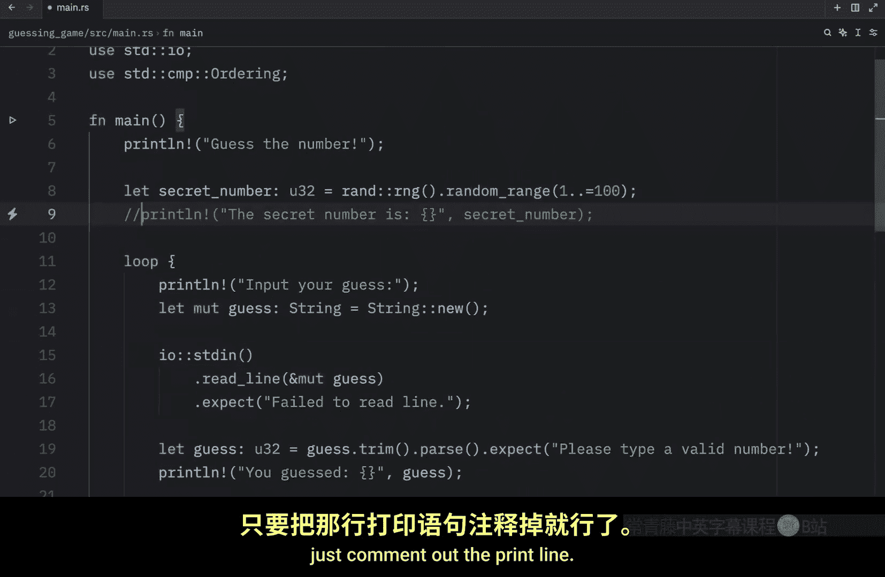

## 总结与挑战 📚

本节课中我们一起学习了如何构建第一个 Rust 项目——“猜数字”游戏。我们涵盖了以下核心概念：
1.  使用 `cargo new` 创建项目。
2.  使用 `cargo add` 添加外部依赖（crate）。
3.  使用 `let` 声明变量，使用 `mut` 使其可变。
4.  使用 `rand::thread_rng().gen_range()` 生成随机数。
5.  使用 `std::io` 处理用户输入，并用 `trim().parse()` 进行类型转换。
6.  使用 `match` 表达式和 `std::cmp::Ordering` 进行比较判断。
7.  使用 `break` 退出循环。


**挑战作业**：尝试为游戏添加一个新功能：记录并告诉用户他们猜了多少次才猜中数字。例如，在输出“恭喜你，猜对了！”之后，添加一行：“你用了 {} 次尝试。”。