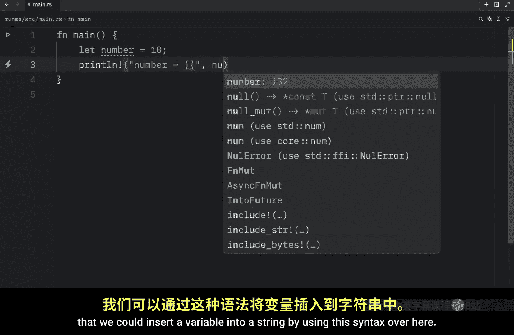
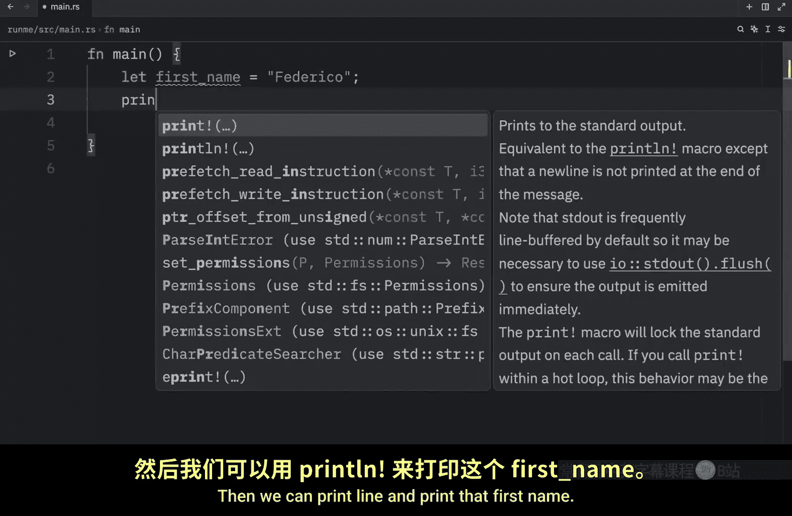
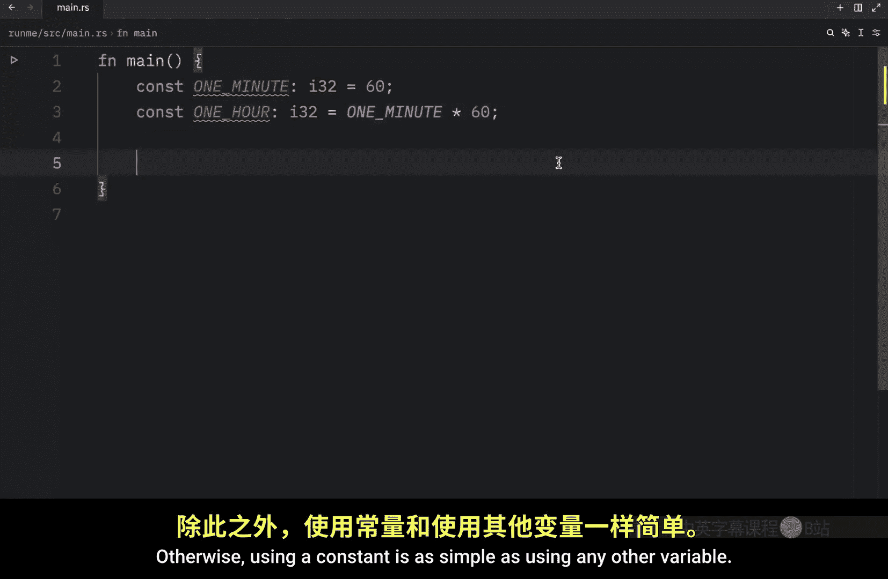
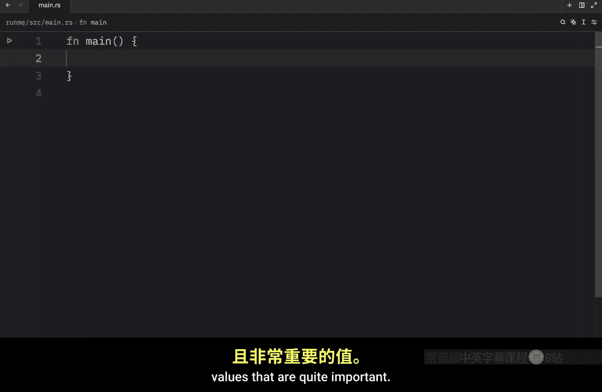
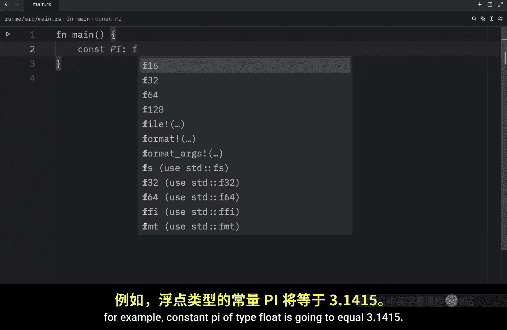
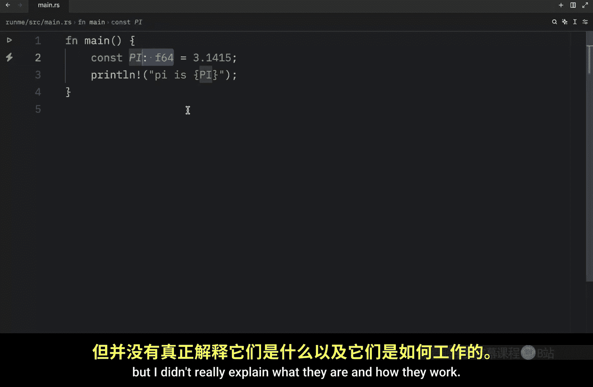

# 004：变量与常量 🧱

在本节课中，我们将要学习 Rust 中变量的核心概念：不可变变量、可变变量以及常量。理解它们之间的区别对于掌握 Rust 编程至关重要。

## 不可变变量

在 Rust 中，默认创建的变量都是**不可变**的。这意味着一旦给变量赋值，其值就不能再被改变。

我们使用 `let` 关键字来声明一个变量。例如，下面的代码创建了一个名为 `number` 的变量，并赋值为 `10`：

```rust
let number = 10;
```

默认情况下，`number` 是不可变的。我们可以打印它的值：




```rust
println!("number is equal to {}", number);
```

运行代码会输出：`number is equal to 10`。

现在，如果我们尝试改变 `number` 的值，例如将其改为 `20`：

```rust
let number = 10;
number = 20; // 这行代码会导致编译错误
println!("number is equal to {}", number);
```

Rust 编译器会给出一个明确的错误：`cannot assign twice to immutable variable`。这证实了默认变量的不可变性。

## 可变变量

上一节我们介绍了不可变变量，本节中我们来看看如何创建可变的变量。如果你希望一个变量的值在未来可以被修改，就需要使用 `mut` 关键字将其声明为**可变**的。

以下是创建可变变量的方法：

```rust
let mut number = 10;
```

现在，我们可以自由地改变 `number` 的值：

```rust
let mut number = 10;
number = 20; // 现在这是允许的
println!("number is equal to {}", number);
```


我们还可以对可变变量进行运算，例如自增操作：



```rust
let mut number = 10;
number += 1; // number 现在等于 11
println!("number is equal to {}", number);
```


记住一个简单的规则：如果你认为一个变量的值将来可能需要改变，就使用 `let mut` 来声明它。

## 变量命名规范

在深入常量之前，我们先了解一下 Rust 的命名规范。与 Python 类似，Rust 对变量名使用**蛇形命名法**。

以下是蛇形命名法的示例：

```rust
let first_name = "Federico";
println!("My name is {}", first_name);
```

蛇形命名法意味着单词之间用下划线 `_` 连接，且全部使用小写字母。

## 常量




现在，让我们转向常量。常量与不可变变量有相似之处，但也有几个关键区别。

常量使用 `const` 关键字声明，并且**必须**在声明时显式标注类型。常量的命名规范是使用全大写字母和蛇形命名法。

以下是定义常量的方法：

```rust
const ONE_MINUTE: u32 = 60;
const ONE_HOUR: u32 = ONE_MINUTE * 60;
```

关于常量，有两点非常重要：
1.  常量的值必须在编译时确定，不能是运行时计算的结果。
2.  常量总是不可变的。



常量通常用于表示程序中永不改变的重要值，例如数学常数：



```rust
const PI: f64 = 3.1415;
println!("Pi is {}", PI);
```

常量的一个特殊优势是，它们可以在任何作用域中定义，包括全局作用域，而 Rust 编译器不会报错。这是普通变量（使用 `let` 声明）所不具备的特性。

## 总结

本节课中我们一起学习了 Rust 中三种存储数据的方式：
*   **不可变变量**：使用 `let` 声明，默认不可更改。
*   **可变变量**：使用 `let mut` 声明，值可以后续修改。
*   **常量**：使用 `const` 声明，必须标注类型，命名全大写，值在编译时确定且永远不可变。



理解它们之间的区别有助于你编写更安全、意图更明确的 Rust 代码。在下一节，我们将探讨 Rust 中的各种数据类型。