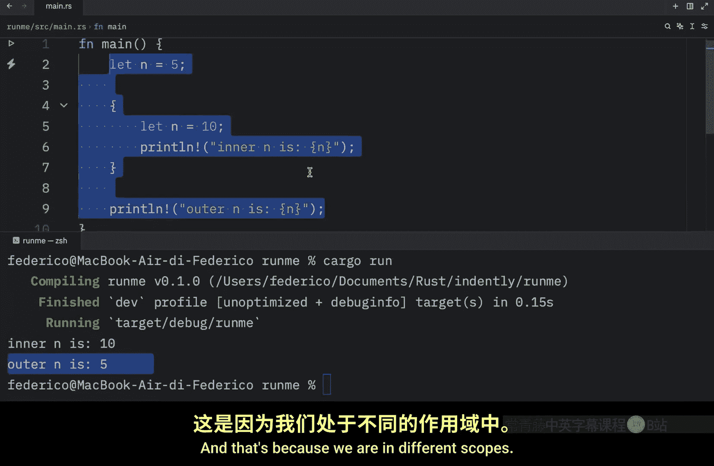
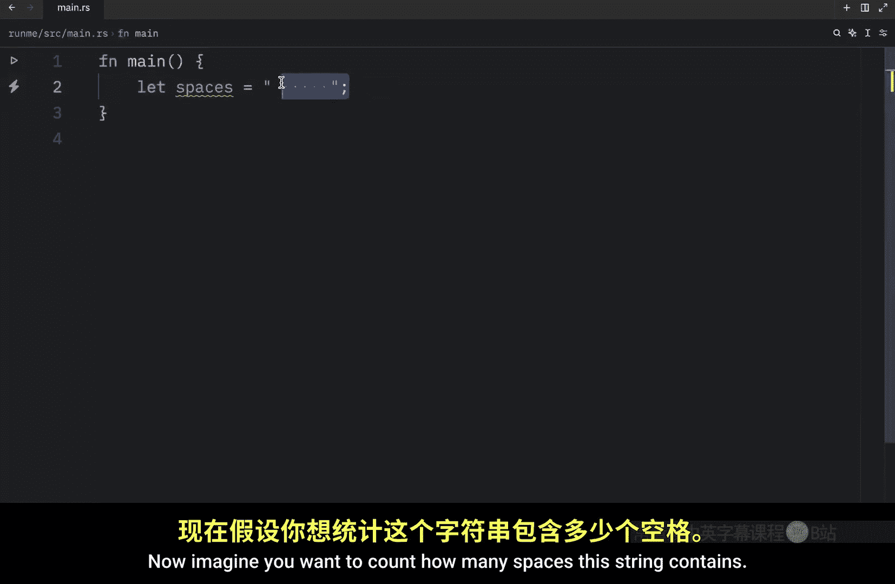
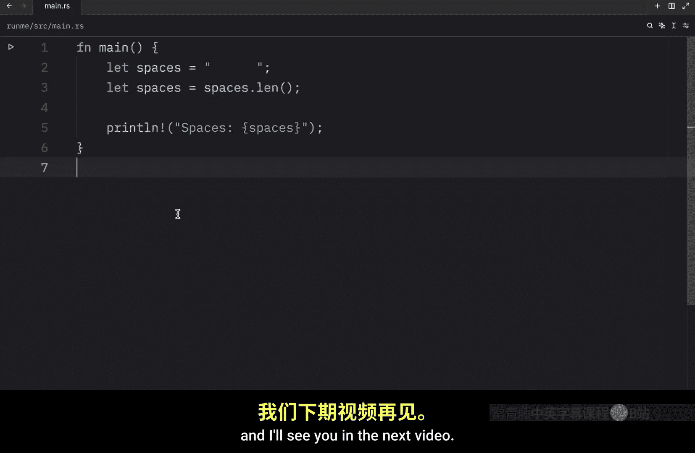

# 005：变量遮蔽 🎭

在本节课中，我们将要学习 Rust 中一个独特且实用的概念：**变量遮蔽**。这个概念允许我们在同一作用域或不同作用域内，使用相同的变量名来存储不同的值，甚至是不同的数据类型，而无需编写额外的代码。

## 什么是变量遮蔽？

变量遮蔽允许我们“重新声明”一个已存在的变量名，为其赋予新的值或类型。这与修改变量（可变性）不同，因为它实际上是创建了一个同名的新变量。

## 作用域内的变量遮蔽

上一节我们介绍了变量遮蔽的基本概念，本节中我们来看看它在不同作用域中的具体表现。

以下是一个在不同作用域中使用变量遮蔽的例子：



```rust
fn main() {
    let n = 5; // 外部作用域的 n

    {
        let n = 10; // 内部作用域遮蔽了外部的 n
        println!("内部 n 是 {}", n);
    }

    println!("外部 n 是 {}", n);
}
```

运行这段代码，输出将是：
```
内部 n 是 10
外部 n 是 5
```

内部作用域中的 `let n = 10;` 创建了一个新的变量 `n`，它**遮蔽**了外部作用域的同名变量。当离开内部作用域后，外部的 `n` 依然保持其原始值 `5`。

如果我们在内部作用域中不使用 `let` 关键字重新声明，而是直接使用 `n`，那么它将引用外部作用域的变量。

```rust
fn main() {
    let n = 5;

    {
        // 这里没有使用 let，所以 n 引用的是外部的变量
        println!("内部 n 是 {}", n); // 输出：内部 n 是 5
    }

    println!("外部 n 是 {}", n); // 输出：外部 n 是 5
}
```

## 改变数据类型的变量遮蔽

变量遮蔽的一个强大之处在于，它允许我们改变变量的数据类型。这是使用可变变量（`mut`）无法做到的。




假设我们有一个字符串，我们想计算它的长度，并将结果存储回同一个变量名中。

以下是使用变量遮蔽的方法：

```rust
fn main() {
    let spaces = "      "; // 这是一个 &str 类型的字符串
    let spaces = spaces.len(); // 遮蔽：spaces 现在是一个 usize 类型的整数

    println!("空格数量是 {}", spaces); // 输出：空格数量是 6
}
```

在这个例子中：
1.  第一个 `spaces` 是一个字符串切片（`&str`）。
2.  第二个 `let spaces = ...` 重新声明了 `spaces`，并将其值设置为字符串的长度，这是一个 `usize` 类型的整数。
3.  从此以后，`spaces` 就代表这个整数值。

## 为什么不用可变变量（mut）？

你可能会想，为什么不直接声明一个可变变量然后修改它呢？让我们试试看：

```rust
fn main() {
    let mut spaces = "      "; // 可变字符串
    spaces = spaces.len(); // 错误：尝试将 usize 赋值给 &str
}
```

这段代码**无法编译**。Rust 是强类型语言，一个变量一旦被声明为某种类型（如 `&str`），就不能被赋予另一种类型（如 `usize`）的值，即使它是可变的。

以下是两种方式的对比：
*   **使用 `mut`**：只能改变**值**，不能改变**类型**。
*   **使用遮蔽**：可以改变**值**，也可以改变**类型**。

因此，当你需要重用变量名但赋予其全新含义（可能包括新类型）时，变量遮蔽是更合适的选择。

## 总结

本节课中我们一起学习了 Rust 中的变量遮蔽。

我们了解到：
*   变量遮蔽通过 `let` 关键字重新声明同名变量来实现。
*   它可以在不同作用域中创建独立的变量，互不影响。
*   它的一个关键优势是能够**改变变量的数据类型**，这是可变变量无法做到的。
*   变量遮蔽使代码更简洁，特别是在需要转换数据并重用变量名的场景中。



记住，变量遮蔽创建的是新变量，而 `mut` 是修改原有变量。根据你的需求选择合适的方式。