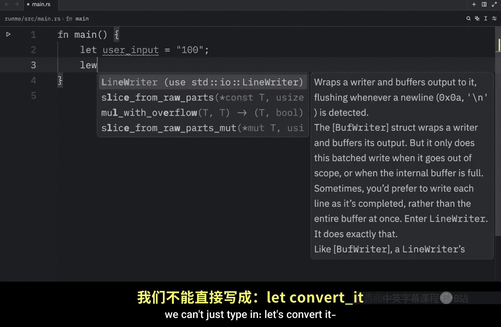
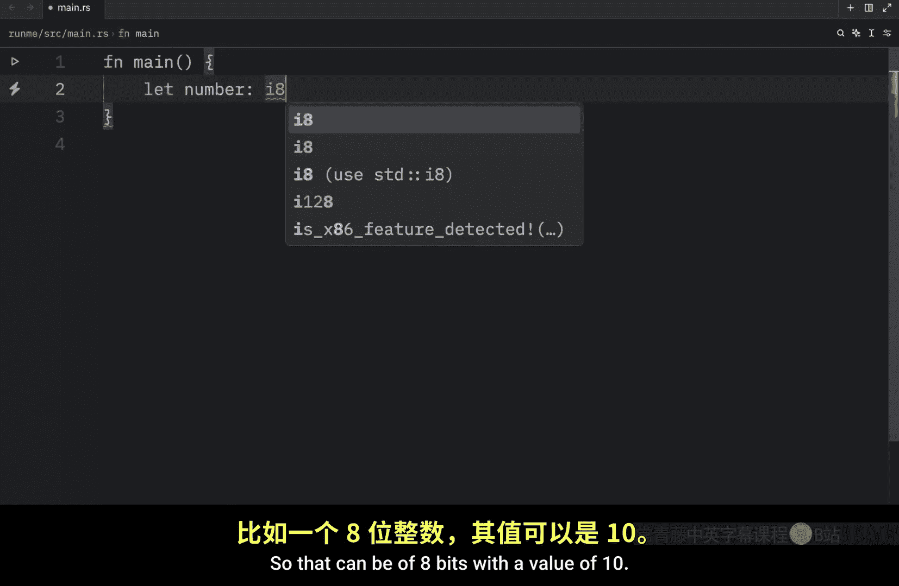

# 006：Rust 中的数据类型 🧱

在本节课中，我们将要学习 Rust 语言中的数据类型。这是一个非常重要的概念，因为 Rust 是一门静态类型语言，这意味着编译器必须在编译时知晓所有变量的类型。

通常，编译器能够根据上下文推断出变量的类型。但在某些情况下，你需要更明确地指定类型。例如，当你需要将一种类型转换为另一种类型时，就必须明确指出目标类型。

## 类型推断与显式声明


Rust 编译器通常能根据上下文推断变量类型。例如，一个被赋值为 `"100"` 的变量，其类型会被推断为字符串。



```rust
let user_input = "100"; // 类型被推断为 &str 或 String
```

然而，当你需要将这个字符串转换为整数时，就必须进行显式类型声明。Rust 无法自动知道你想转换成哪种整数类型。

以下是如何进行显式类型转换的示例。我们使用 `.parse()` 方法，并指定目标类型为 `u32`（32位无符号整数）。

```rust
let converted: u32 = user_input.parse().expect("无法解析为数字");
println!("转换后的值是: {}", converted);
```

完成转换后，该变量就可以参与数学运算了。


```rust
let result = converted + 100; // 现在可以进行加法运算
println!("转换后的值加 100 等于: {}", result);
```

## 数据类型分类 📊



上一节我们介绍了类型推断与显式声明，本节中我们来看看 Rust 数据类型的两个主要子集：标量类型和复合类型。


### 标量类型

标量类型代表单个值。Rust 有四种主要的标量类型：整数、浮点数、布尔值和字符。

以下是每种标量类型的示例：

*   **整数**：表示没有小数部分的数字。
    ```rust
    let integer_example: i8 = 10; // 8位有符号整数
    ```
*   **浮点数**：表示带有小数点的数字。
    ```rust
    let float_example: f32 = 3.1415; // 32位浮点数
    ```
*   **布尔值**：表示逻辑真或假，只有两种状态。
    ```rust
    let boolean_example: bool = false; // 布尔值 false
    ```
*   **字符**：表示单个 Unicode 标量值，使用单引号。
    ```rust
    let char_example: char = 'Δ'; // 字符类型
    ```

### 复合类型

复合类型可以将多个值组合成一个类型。Rust 有两个原生的复合类型：元组和数组。

以下是每种复合类型的示例：

*   **元组**：将多个不同类型的值组合成一个复合类型。
    ```rust
    let tuple_example: (f32, f32) = (1.5, 2.5); // 包含两个 f32 的元组
    ```
*   **数组**：将多个相同类型的值组合成一个固定长度的集合。
    ```rust
    let array_example: [&str; 3] = ["Bob", "Luis", "Ashley"]; // 包含3个字符串的数组
    ```

## 总结


本节课中我们一起学习了 Rust 数据类型的基础知识。我们了解到 Rust 是静态类型语言，认识了类型推断和显式类型声明的使用场景。我们还将数据类型分为**标量类型**（如整数、浮点数、布尔值、字符）和**复合类型**（如元组、数组），它们分别用于表示单个值和多个值的组合。在接下来的课程中，我们将对这些类型进行更深入的探讨。