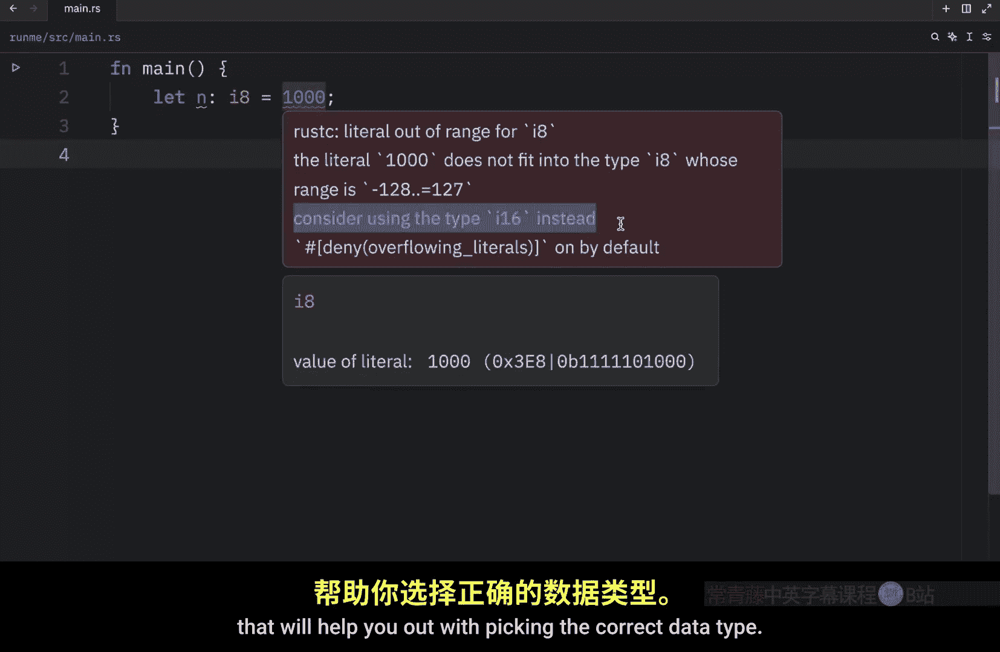
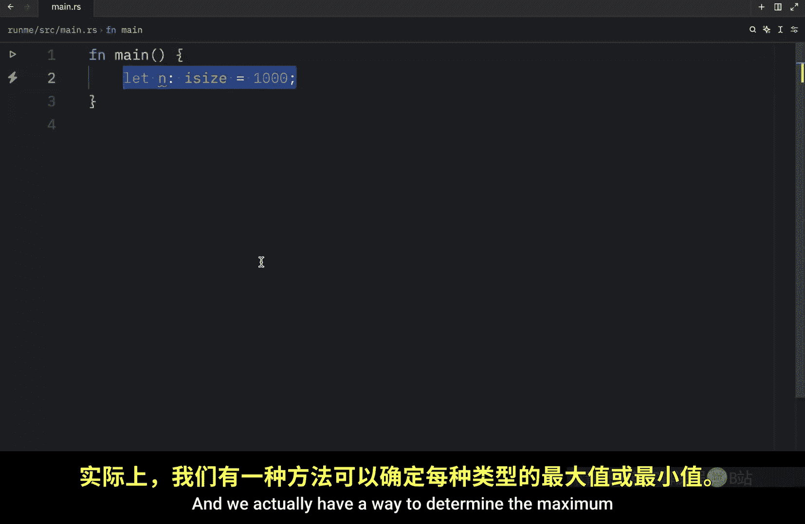
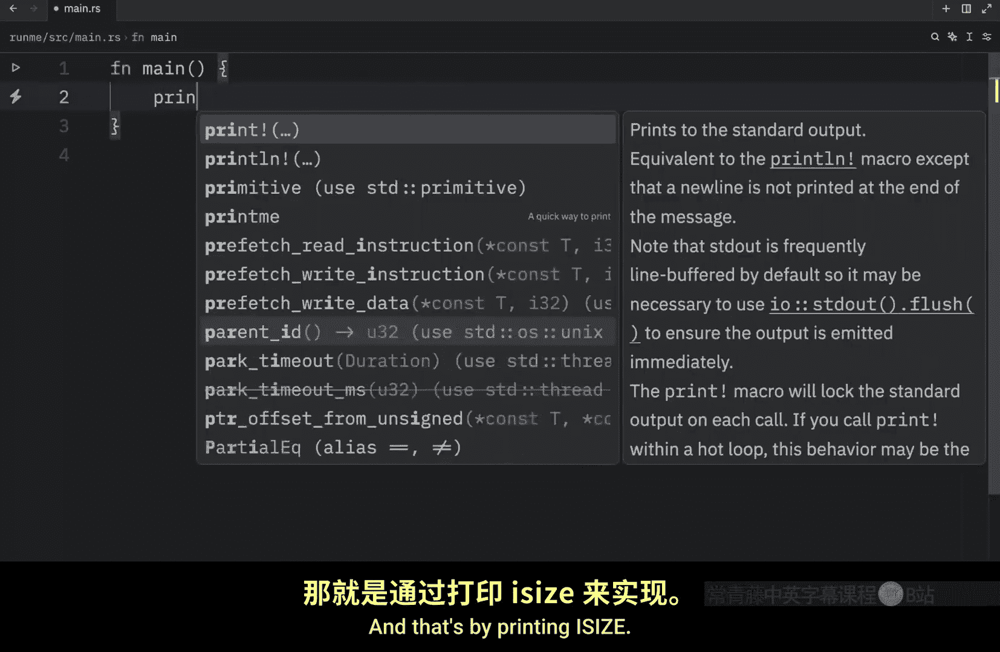
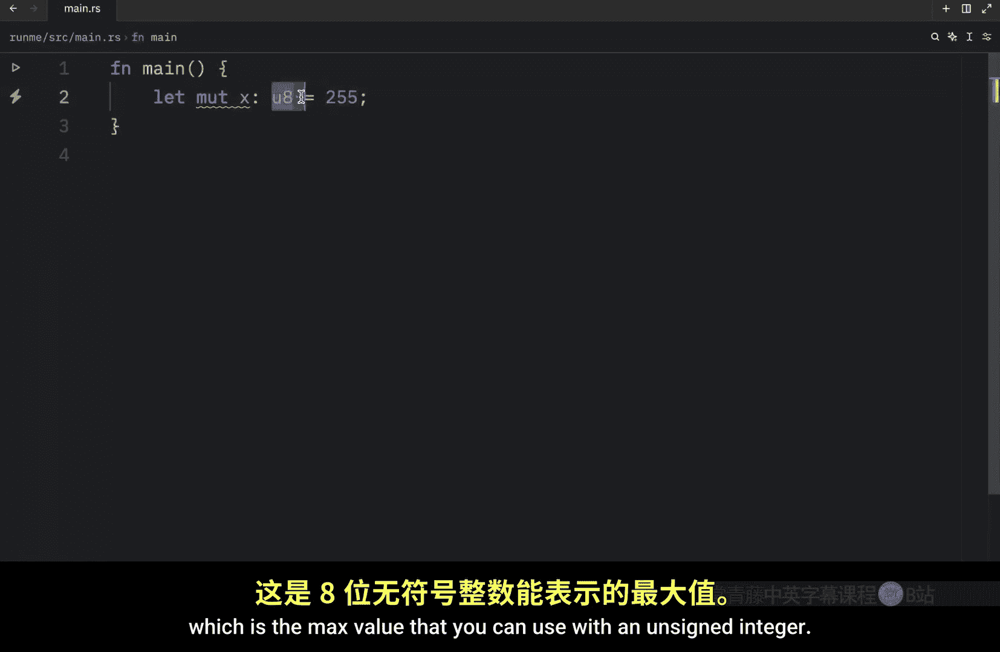
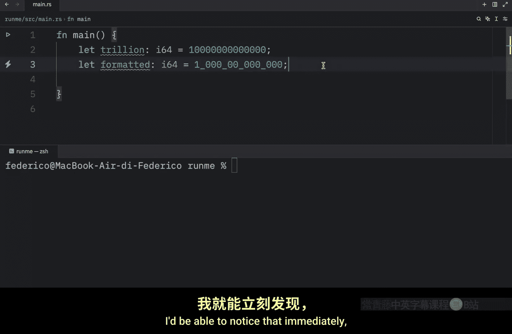
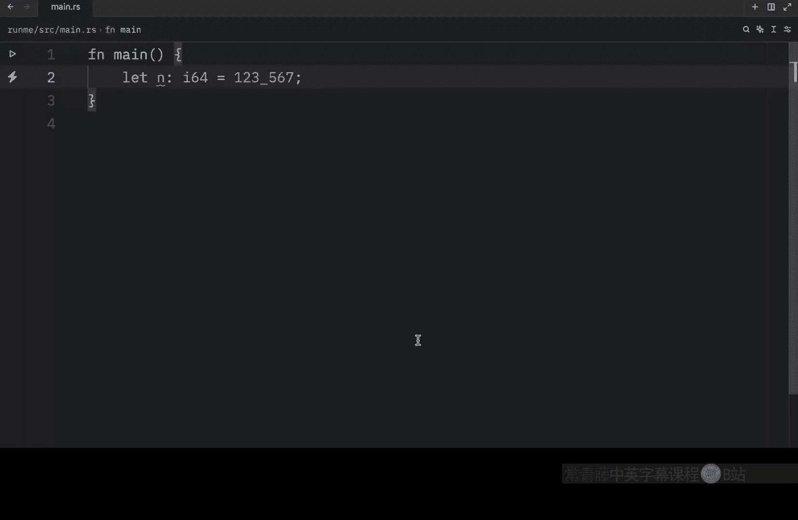

# 007：详解Rust中的整数 🧮

在本节课中，我们将要学习 Rust 编程语言中的整数类型。整数是编程中最基础的数据类型之一，理解其工作原理对于编写正确的 Rust 程序至关重要。

## 有符号与无符号整数

在 Rust 中，整数主要分为两种类型：有符号整数和无符号整数。它们的核心区别在于能否表示负数。

以下是创建这两种整数的一个例子：
```rust
let n1: i8 = 10; // 有符号 8 位整数
let n2: u8 = 200; // 无符号 8 位整数
```

有符号整数可以包含负值，而无符号整数则始终为正值。但更重要的是，它们都受到“位宽”的限制，这决定了它们能存储的数值范围。



## 理解整数范围

对于 8 位整数，其数值范围是固定的：
*   有符号整数 `i8` 的范围是 **-128 到 127**。
*   无符号整数 `u8` 的范围是 **0 到 255**。

两者都包含 256 个不同的数值（`i8`：-128到127共256个；`u8`：0到255共256个）。有符号整数的上限（127）低于无符号整数（255），因为它需要分配一半的范围来表示负数。

选择正确的整数类型非常重要。如果你尝试将一个超出范围的值赋给变量，程序将无法编译。例如：
```rust
let n: i8 = 1000; // 错误：字面量超出 i8 的范围
```
编译器会报错 `literal out of range for i8`。现代代码编辑器通常会在你悬停于数字上时给出提示，帮助你选择正确的数据类型。对于 1000 这个值，你应该选择 `i16` 或更大的类型。

## 默认整数类型与位宽



如果你在声明变量时不指定整数类型，Rust 会默认使用 `i32`，即 32 位有符号整数。



32 位整数的范围非常大：
*   `i32` 范围：**-2,147,483,648 到 2,147,483,647**
*   `u32` 范围：**0 到 4,294,967,295**

对于日常的大多数运算，32 位整数已经足够。Rust 提供了多种位宽的整数类型供你选择。

以下是 Rust 中可用的整数类型概览：


| 长度   | 有符号类型 | 无符号类型 |
| :----- | :--------- | :--------- |
| 8 位   | `i8`       | `u8`       |
| 16 位  | `i16`      | `u16`      |
| 32 位  | `i32`      | `u32`      |
| 64 位  | `i64`      | `u64`      |
| 128 位 | `i128`     | `u128`     |
| 架构位 | `isize`    | `usize`    |

表格底部的 `isize` 和 `usize` 类型比较特殊，它们的位宽取决于程序运行所在计算机的架构（例如 32 位或 64 位系统）。

## 查询类型的极值与溢出行为




上一节我们介绍了整数类型，本节中我们来看看如何获取类型的范围信息，以及当数值超出范围时会发生什么。

你可以使用 `MAX` 和 `MIN` 关联函数来获取任何整数类型的最大值和最小值：
```rust
println!("i8 最大值: {}, 最小值: {}", i8::MAX, i8::MIN);
println!("isize 最大值: {}, 最小值: {}", isize::MAX, isize::MIN);
```
在 64 位系统上，`isize::MAX` 的值将与 `i64::MAX` 相同。

接下来，我们探讨一个重要的概念：整数溢出。当你对一个已经达到其类型最大值的变量进行递增操作时，就会发生溢出。

考虑以下代码：
```rust
let mut x: u8 = 255; // u8 的最大值
x += 10; // 尝试增加 10，这将导致溢出
println!("x = {}", x);
```
这段代码的行为取决于编译模式：
*   在 **调试（debug）模式** 下运行，程序会“恐慌”（panic）并崩溃，这有助于在开发阶段发现问题。
*   在 **发布（release）模式** 下运行，程序会进行“环绕”（wrapping），即从最大值回到最小值继续计算。对于 `u8`，255 加 1 变成 0，再加 9 变成 9。因此，最终输出 `x = 9`，而不是预期的 265。



这种环绕行为是为了避免程序在发布版本中崩溃，但它可能导致非预期的逻辑错误。因此，在编程时应始终确保选择足够大的整数类型来避免溢出。


## 数值字面量的格式化技巧

在结束之前，我想分享一个非常实用的小技巧，用于提高大数值字面量的可读性。

假设你需要定义一个代表“一万亿”的变量：
```rust
let trillion: i64 = 1000000000000; // 难以阅读和核对
```
手动数零很容易出错。Rust 允许你在数字字面量中使用下划线 `_` 作为视觉分隔符，编译器会忽略这些下划线：
```rust
let trillion: i64 = 1_000_000_000_000; // 清晰易读
let formatted: i64 = 1_00_00_00_00_0000; // 你也可以使用任意分组方式
```
当你打印这些变量时，输出结果不会包含下划线。这个技巧能极大提升代码的可读性和可维护性，尤其是在处理财务、科学计算等涉及大数字的场景中。



本节课中我们一起学习了 Rust 中整数的核心知识：有符号与无符号整数的区别、不同位宽整数类型的数值范围、默认的 `i32` 类型、如何查询类型的极值、整数溢出的概念及其在不同编译模式下的行为，以及使用下划线格式化大数值字面量的实用技巧。理解这些内容是安全、高效地使用 Rust 进行数值计算的基础。在下一节课中，我们将学习另一种基础数值类型：浮点数。