# 008：Rust 中的浮点数 🧮

在本节课中，我们将要学习 Rust 中的浮点数类型。浮点数用于表示带有小数部分的数字，例如 `3.14` 或 `2.718`。我们将了解 Rust 提供的两种浮点数类型，它们的特点，以及在使用时需要注意的一些关键问题。

上一节我们介绍了整数类型，本节中我们来看看 Rust 如何处理小数。

## 浮点数类型：F32 与 F64

Rust 为浮点数提供了两种基本类型：`f32` 和 `f64`。它们分别代表 32 位浮点数和 64 位浮点数。

当你在 Rust 中创建一个十进制数时，例如：

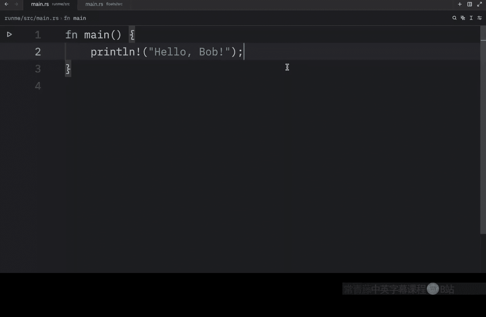


```rust
let pi = 3.1415;
```

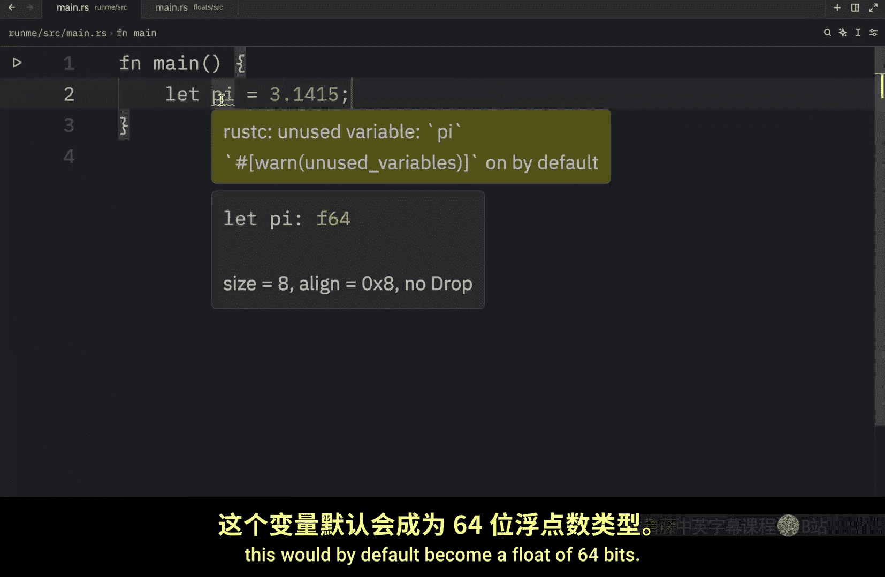

这个变量 `pi` 默认会成为 `f64` 类型。默认选择 `f64` 而非 `f32` 的原因是现代 CPU 处理两者的速度大致相同，但 `f64` 拥有更高的精度。

为了直观展示两种类型的区别，我们可以显式声明类型并赋值。

以下是创建两种浮点数的示例：

```rust
// 创建一个 f32 类型的变量，精度约为7位十进制数字
let pi: f32 = 3.1415927;


// 创建一个 f64 类型的变量，精度约为15位十进制数字
let decimal: f64 = 2.718281828459045;
```


`f32` 类型大约可以精确表示 7 位十进制数字，而 `f64` 类型则能表示大约 15 位十进制数字，精度大约翻倍。

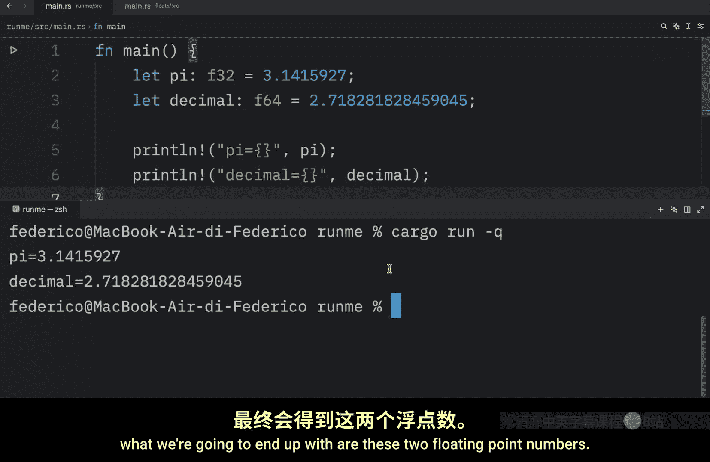

## 打印与精度限制

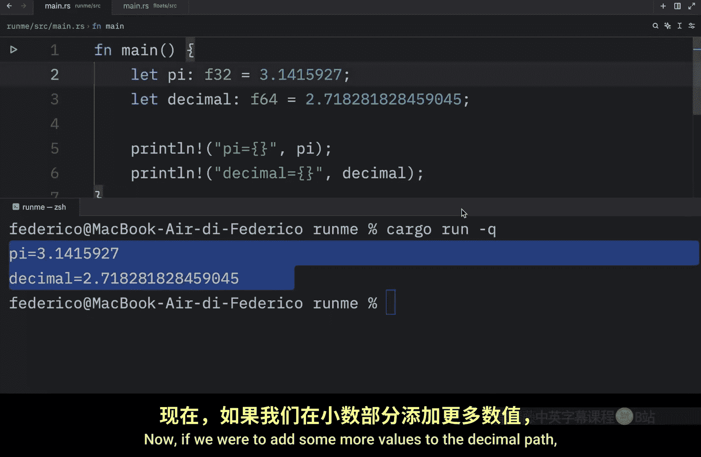

接下来，我们尝试将这两个变量打印到控制台。

```rust
println!("pi = {}", pi);
println!("decimal = {}", decimal);
```

运行程序后，你会看到输出的浮点数。如果你尝试为变量赋予超出其精度范围的值，例如在小数部分添加更多数字，Rust 会进行截断或舍入。`f32` 和 `f64` 在处理超限数字时的具体行为可能略有不同，这取决于具体的数值和舍入规则。

与整数类型一样，你必须尊重所指定类型的精度限制。

## 浮点数运算的精度问题

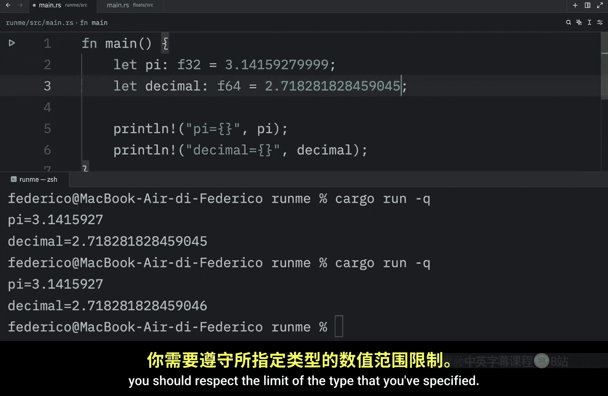

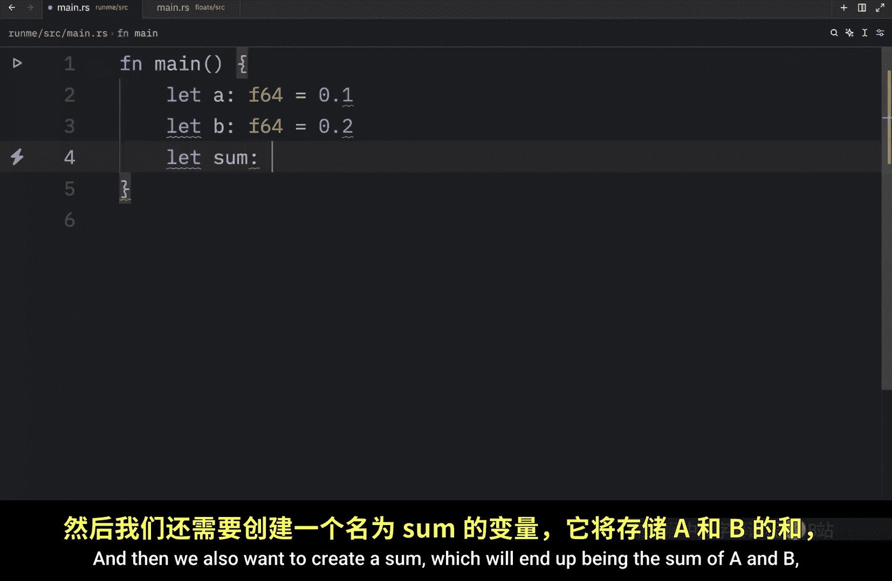

浮点数还有一个重要特性需要注意，那就是运算时的精度问题。我们通过一个例子来说明。

在这个例子中，我们将创建两个 `f64` 变量并进行加法运算。

```rust
let a: f64 = 0.1;
let b: f64 = 0.2;
let sum: f64 = a + b;
println!("The sum is: {}", sum);
```

运行这段代码后，你可能会惊讶地发现，输出的结果并非精确的 `0.3`，而是一个类似 `0.30000000000000004` 的数值。

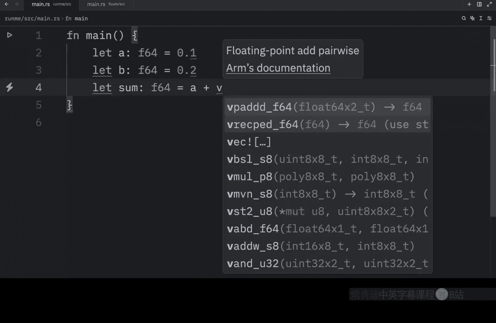

这是因为十进制小数在二进制计算机中难以被精确表示。因此，在没有外部库辅助的情况下，你不能完全依赖浮点数运算的完美精度。

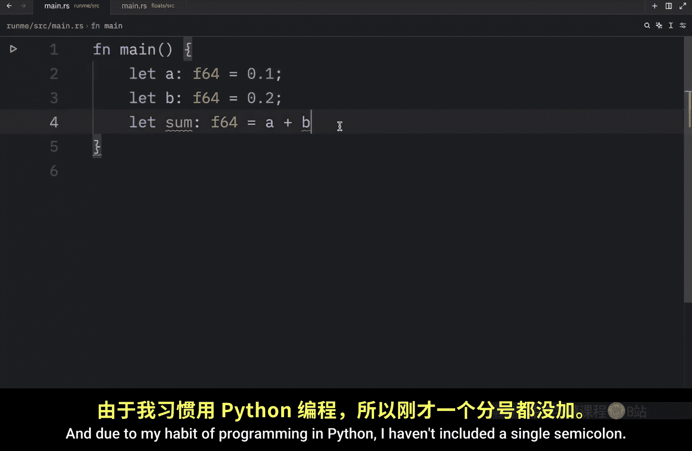


这个问题在比较两个浮点数是否相等时会变得尤为棘手。

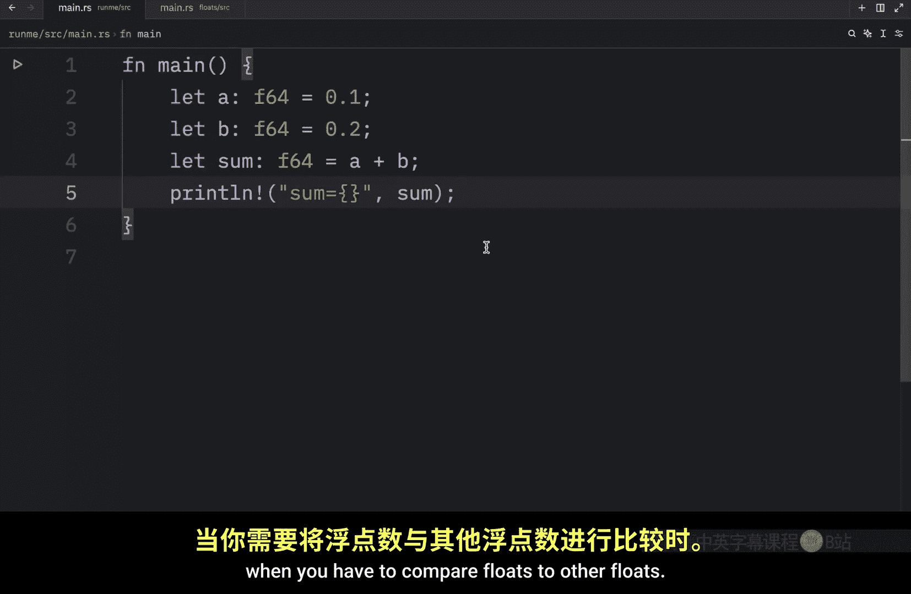

例如，如果我们尝试判断 `sum` 是否等于 `0.3`：

```rust
println!("Is the sum equal to 0.3? {}", sum == 0.3);
```

输出结果将是 `false`。因为 `sum` 的实际值（如 `0.30000000000000004`）与字面值 `0.3` 在二进制表示上并不完全相同。`==` 运算符检查的是两个值是否完全相等。

## 总结

本节课中我们一起学习了 Rust 的浮点数。


*   我们使用 `f32` 和 `f64` 类型来表示编程中的小数和分数。
*   `f64` 是默认类型，它比 `f32` 精度更高。
*   浮点数类型有固定的精度限制，赋值时超出的部分会被处理。
*   由于二进制表示的固有特性，浮点数运算可能存在微小的精度误差，直接使用 `==` 比较两个浮点数是否相等通常不可靠。

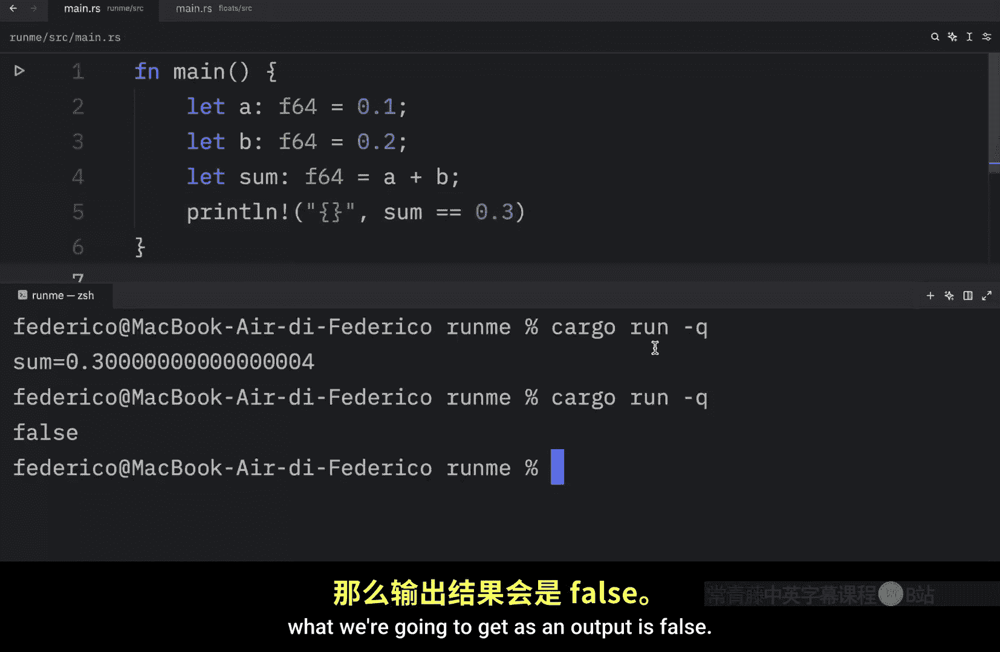

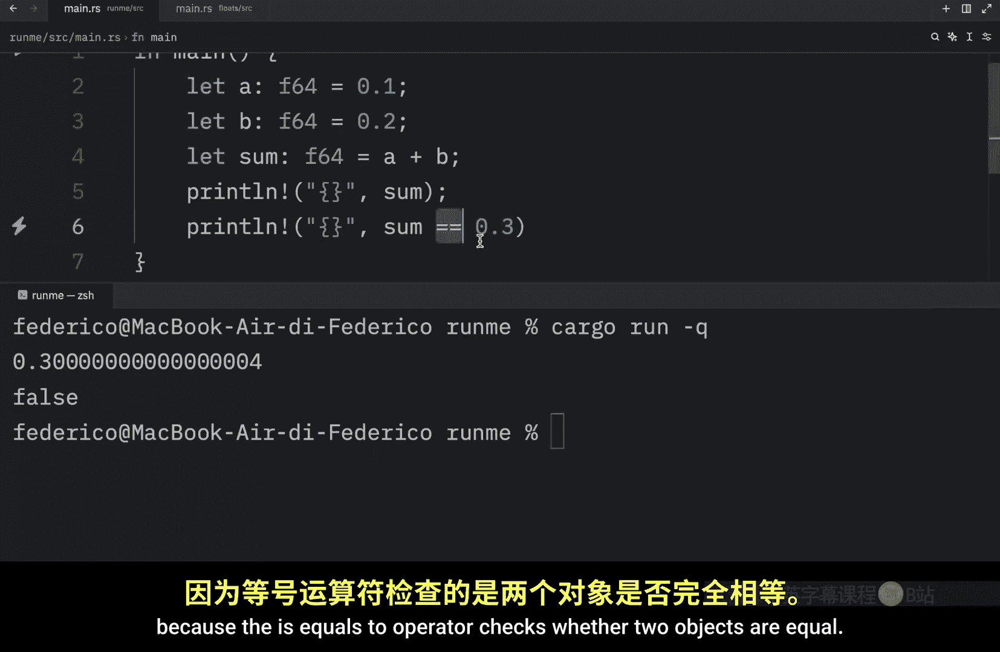


在未来的视频中，我们将学习如何正确地执行需要高精度的浮点数计算。但就今天的内容而言，以上就是关于 Rust 浮点数的基本介绍。